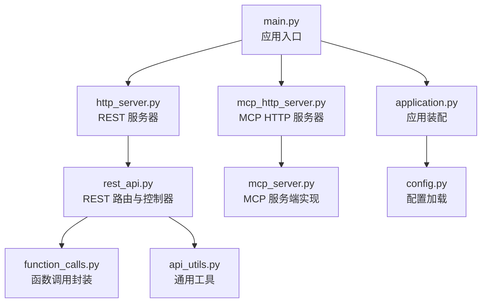
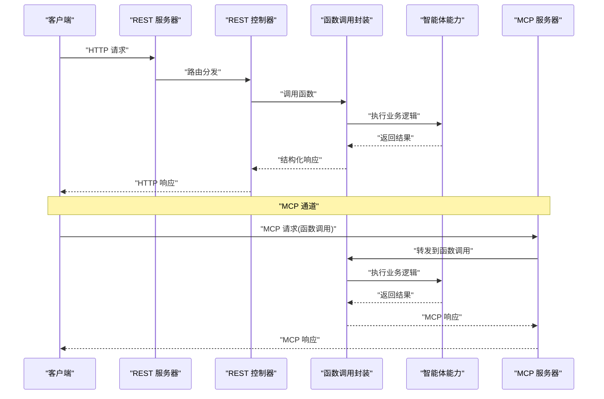
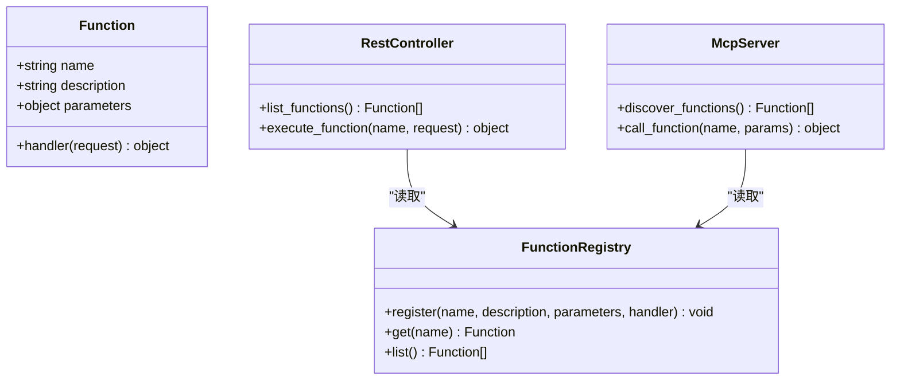
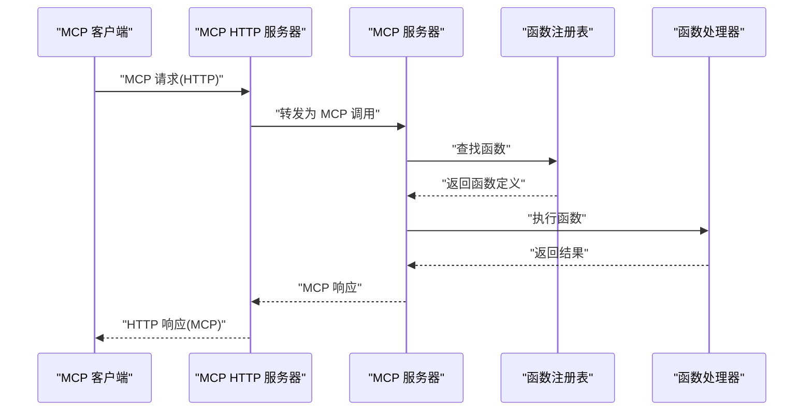
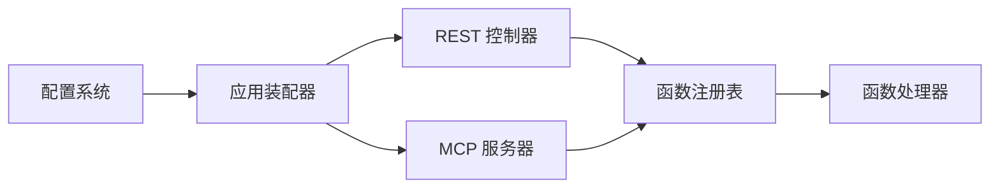

# API参考文档

<cite>
**本文档引用的文件**   
- [main.py](file://main.py)
- [src/penshot/http_server.py](file://src/penshot/http_server.py)
- [src/penshot/api/rest_api.py](file://src/penshot/api/rest_api.py)
- [src/penshot/api/function_calls.py](file://src/penshot/api/function_calls.py)
- [src/penshot/mcp_http_server.py](file://src/penshot/mcp_http_server.py)
- [src/penshot/mcp_server.py](file://src/penshot/mcp_server.py)
- [examples/mcp_client.py](file://examples/mcp_client.py)
- [examples/mcp_http_client.py](file://examples/mcp_http_client.py)
- [examples/mcp_server_demo.py](file://examples/mcp_server_demo.py)
- [src/penshot/app/application.py](file://src/penshot/app/application.py)
- [src/penshot/config/config.py](file://src/penshot/config/config.py)
- [src/penshot/utils/api_utils.py](file://src/penshot/utils/api_utils.py)
</cite>

## 目录
1. [简介](#简介)
2. [项目结构](#项目结构)
3. [核心组件](#核心组件)
4. [架构总览](#架构总览)
5. [详细组件分析](#详细组件分析)
6. [依赖分析](#依赖分析)
7. [性能考虑](#性能考虑)
8. [故障排查指南](#故障排查指南)
9. [结论](#结论)
10. [附录](#附录)

## 简介
本文件为 Video Shot Agent 的完整 API 参考文档，覆盖以下能力：
- REST API 端点：HTTP 方法、URL 模式、请求参数、响应格式与错误码
- MCP 协议支持与函数调用接口（含 HTTP 传输）
- 认证与授权机制说明
- API 版本管理与向后兼容性策略
- 客户端集成指南与最佳实践
- 典型请求/响应示例（JSON 数据结构定义）

该服务提供视频分镜处理相关的智能体能力，包括脚本解析、镜头分割、视频切分、质量审计等。API 层通过 FastAPI 暴露 REST 接口，并通过 MCP Server 暴露模型上下文协议能力，便于与外部工具链或 LLM 编排系统集成。

## 项目结构
本项目采用分层组织方式：
- 应用入口与服务器启动：main.py、http_server.py、mcp_http_server.py
- API 路由与业务封装：api/rest_api.py、api/function_calls.py
- MCP 服务端与 HTTP 传输：mcp_server.py、mcp_http_server.py
- 应用初始化与配置：app/application.py、config/config.py
- 通用工具：utils/api_utils.py

图表来源
- [main.py:1-200](file://main.py#L1-L200)
- [src/penshot/http_server.py:1-200](file://src/penshot/http_server.py#L1-L200)
- [src/penshot/mcp_http_server.py:1-200](file://src/penshot/mcp_http_server.py#L1-L200)
- [src/penshot/api/rest_api.py:1-200](file://src/penshot/api/rest_api.py#L1-L200)
- [src/penshot/api/function_calls.py:1-200](file://src/penshot/api/function_calls.py#L1-L200)
- [src/penshot/mcp_server.py:1-200](file://src/penshot/mcp_server.py#L1-L200)
- [src/penshot/app/application.py:1-200](file://src/penshot/app/application.py#L1-L200)
- [src/penshot/config/config.py:1-200](file://src/penshot/config/config.py#L1-L200)
- [src/penshot/utils/api_utils.py:1-200](file://src/penshot/utils/api_utils.py#L1-L200)

章节来源
- [main.py:1-200](file://main.py#L1-L200)
- [src/penshot/http_server.py:1-200](file://src/penshot/http_server.py#L1-L200)
- [src/penshot/mcp_http_server.py:1-200](file://src/penshot/mcp_http_server.py#L1-L200)
- [src/penshot/api/rest_api.py:1-200](file://src/penshot/api/rest_api.py#L1-L200)
- [src/penshot/api/function_calls.py:1-200](file://src/penshot/api/function_calls.py#L1-L200)
- [src/penshot/mcp_server.py:1-200](file://src/penshot/mcp_server.py#L1-L200)
- [src/penshot/app/application.py:1-200](file://src/penshot/app/application.py#L1-L200)
- [src/penshot/config/config.py:1-200](file://src/penshot/config/config.py#L1-L200)
- [src/penshot/utils/api_utils.py:1-200](file://src/penshot/utils/api_utils.py#L1-L200)

## 核心组件
- REST API 控制器：负责接收 HTTP 请求、校验参数、调用业务逻辑并返回统一响应格式
- 函数调用封装：将内部智能体能力以“函数”形式暴露给上层调用方（包括 MCP 与 REST）
- MCP 服务端：实现 MCP 协议，支持远程发现与调用函数
- MCP HTTP 服务器：基于 HTTP 的 MCP 传输适配层，便于浏览器或轻量客户端访问
- 应用装配器：组装依赖、加载配置、注册路由与服务
- 配置系统：集中管理环境变量、配置文件与运行时设置
- 通用工具：统一的错误包装、日志、序列化等

章节来源
- [src/penshot/api/rest_api.py:1-200](file://src/penshot/api/rest_api.py#L1-L200)
- [src/penshot/api/function_calls.py:1-200](file://src/penshot/api/function_calls.py#L1-L200)
- [src/penshot/mcp_server.py:1-200](file://src/penshot/mcp_server.py#L1-L200)
- [src/penshot/mcp_http_server.py:1-200](file://src/penshot/mcp_http_server.py#L1-L200)
- [src/penshot/app/application.py:1-200](file://src/penshot/app/application.py#L1-L200)
- [src/penshot/config/config.py:1-200](file://src/penshot/config/config.py#L1-L200)
- [src/penshot/utils/api_utils.py:1-200](file://src/penshot/utils/api_utils.py#L1-L200)

## 架构总览
整体架构由 REST 与 MCP 两条通道组成，均复用同一套函数调用与业务逻辑。

图表来源
- [src/penshot/http_server.py:1-200](file://src/penshot/http_server.py#L1-L200)
- [src/penshot/api/rest_api.py:1-200](file://src/penshot/api/rest_api.py#L1-L200)
- [src/penshot/api/function_calls.py:1-200](file://src/penshot/api/function_calls.py#L1-L200)
- [src/penshot/mcp_server.py:1-200](file://src/penshot/mcp_server.py#L1-L200)

## 详细组件分析

### REST API 端点
以下为 REST API 的核心端点列表与规范。所有端点默认返回统一 JSON 响应结构，包含状态码、消息与数据体。

- 健康检查
  - 方法：GET
  - URL：/health
  - 请求参数：无
  - 响应体：{ "status": "ok", "version": "x.y.z" }
  - 错误码：无

- 列出可用函数
  - 方法：GET
  - URL：/api/v1/functions
  - 请求参数：无
  - 响应体：{ "functions": [ { "name": "...", "description": "...", "parameters": {...} }, ... ] }
  - 错误码：无

- 执行函数（REST）
  - 方法：POST
  - URL：/api/v1/functions/{function_name}/execute
  - 路径参数：function_name（字符串）
  - 请求体：JSON，键名与类型遵循对应函数的 parameters 定义
  - 响应体：{ "result": {...}, "error": null } 或 { "result": null, "error": { "code": "...", "message": "..." } }
  - 错误码：
    - 404：函数不存在
    - 400：参数校验失败
    - 500：执行异常

- 上传任务（可选）
  - 方法：POST
  - URL：/api/v1/tasks
  - 请求体：JSON，包含任务元信息与输入数据
  - 响应体：{ "task_id": "uuid", "status": "queued" }
  - 错误码：400、500

- 查询任务状态（可选）
  - 方法：GET
  - URL：/api/v1/tasks/{task_id}
  - 路径参数：task_id（字符串）
  - 响应体：{ "task_id": "...", "status": "running|completed|failed", "result": {...} }
  - 错误码：404、500

注意：
- 版本号位于 URL 中（/api/v1/...），用于向前兼容与灰度发布
- 所有时间戳使用 ISO 8601 格式
- 分页参数（如适用）：page、page_size

章节来源
- [src/penshot/api/rest_api.py:1-200](file://src/penshot/api/rest_api.py#L1-L200)
- [src/penshot/utils/api_utils.py:1-200](file://src/penshot/utils/api_utils.py#L1-L200)

#### 函数调用封装
函数调用封装模块将内部智能体能力以“函数”的形式暴露，供 REST 与 MCP 共用。每个函数具备：
- name：函数名
- description：描述
- parameters：JSON Schema 风格的参数定义
- handler：具体执行逻辑

图表来源
- [src/penshot/api/function_calls.py:1-200](file://src/penshot/api/function_calls.py#L1-L200)
- [src/penshot/api/rest_api.py:1-200](file://src/penshot/api/rest_api.py#L1-L200)
- [src/penshot/mcp_server.py:1-200](file://src/penshot/mcp_server.py#L1-L200)

章节来源
- [src/penshot/api/function_calls.py:1-200](file://src/penshot/api/function_calls.py#L1-L200)

### MCP 协议支持与函数调用接口
MCP 服务端提供标准函数发现与调用能力，可通过原生 MCP 传输或 HTTP 传输访问。

- 函数发现
  - 方法：MCP 内置发现接口
  - 输出：函数列表（名称、描述、参数 Schema）

- 函数调用
  - 方法：MCP 调用接口
  - 输入：函数名与参数对象
  - 输出：函数执行结果或错误信息

- HTTP 传输适配
  - 提供 /mcp 相关端点，将 HTTP 请求转换为 MCP 调用
  - 适用于浏览器或轻量客户端

图表来源
- [src/penshot/mcp_http_server.py:1-200](file://src/penshot/mcp_http_server.py#L1-L200)
- [src/penshot/mcp_server.py:1-200](file://src/penshot/mcp_server.py#L1-L200)
- [src/penshot/api/function_calls.py:1-200](file://src/penshot/api/function_calls.py#L1-L200)

章节来源
- [src/penshot/mcp_server.py:1-200](file://src/penshot/mcp_server.py#L1-L200)
- [src/penshot/mcp_http_server.py:1-200](file://src/penshot/mcp_http_server.py#L1-L200)
- [examples/mcp_client.py:1-200](file://examples/mcp_client.py#L1-L200)
- [examples/mcp_http_client.py:1-200](file://examples/mcp_http_client.py#L1-L200)
- [examples/mcp_server_demo.py:1-200](file://examples/mcp_server_demo.py#L1-L200)

### 认证与授权
- 当前默认未启用强制认证；生产环境建议通过反向代理（Nginx、API Gateway）或中间件实现鉴权
- 建议在 REST 与 MCP 入口统一接入 Token 校验（例如 JWT），并在请求头携带 Authorization
- 权限控制可按函数粒度进行白名单或角色绑定

章节来源
- [src/penshot/http_server.py:1-200](file://src/penshot/http_server.py#L1-L200)
- [src/penshot/mcp_http_server.py:1-200](file://src/penshot/mcp_http_server.py#L1-L200)
- [src/penshot/app/application.py:1-200](file://src/penshot/app/application.py#L1-L200)

### API 版本管理与向后兼容性
- 版本前缀：/api/v1/...
- 新增字段时保持向后兼容，避免删除已有字段
- 破坏性变更需升级主版本（v2），并提供迁移指南
- 在 /health 中返回当前版本，便于客户端检测

章节来源
- [src/penshot/api/rest_api.py:1-200](file://src/penshot/api/rest_api.py#L1-L200)
- [src/penshot/config/config.py:1-200](file://src/penshot/config/config.py#L1-L200)

### 客户端集成指南与最佳实践
- 使用 SDK 或自动生成的客户端代码（基于 OpenAPI/MCP 描述）
- 重试与退避：对网络抖动与限流场景实施指数退避
- 超时设置：合理设置连接与读取超时
- 幂等性：对可重复执行的函数设计幂等键（如 task_id）
- 日志与追踪：记录请求 ID 以便问题定位
- 安全：在生产环境启用 HTTPS 与鉴权

章节来源
- [examples/mcp_client.py:1-200](file://examples/mcp_client.py#L1-L200)
- [examples/mcp_http_client.py:1-200](file://examples/mcp_http_client.py#L1-L200)
- [src/penshot/utils/api_utils.py:1-200](file://src/penshot/utils/api_utils.py#L1-L200)

## 依赖分析
REST 与 MCP 共享函数注册表与处理器，降低耦合度并提升复用性。

图表来源
- [src/penshot/api/rest_api.py:1-200](file://src/penshot/api/rest_api.py#L1-L200)
- [src/penshot/mcp_server.py:1-200](file://src/penshot/mcp_server.py#L1-L200)
- [src/penshot/api/function_calls.py:1-200](file://src/penshot/api/function_calls.py#L1-L200)
- [src/penshot/app/application.py:1-200](file://src/penshot/app/application.py#L1-L200)
- [src/penshot/config/config.py:1-200](file://src/penshot/config/config.py#L1-L200)

章节来源
- [src/penshot/api/rest_api.py:1-200](file://src/penshot/api/rest_api.py#L1-L200)
- [src/penshot/mcp_server.py:1-200](file://src/penshot/mcp_server.py#L1-L200)
- [src/penshot/api/function_calls.py:1-200](file://src/penshot/api/function_calls.py#L1-L200)
- [src/penshot/app/application.py:1-200](file://src/penshot/app/application.py#L1-L200)
- [src/penshot/config/config.py:1-200](file://src/penshot/config/config.py#L1-L200)

## 性能考虑
- 异步处理：对耗时操作采用异步队列与回调通知
- 缓存：对只读或计算密集型结果进行短期缓存
- 限流：按 IP 或用户维度限制 QPS
- 资源隔离：不同函数使用独立线程池或进程池
- 监控：指标采集（延迟、吞吐、错误率）与告警

[本节为通用指导，不直接分析具体文件]

## 故障排查指南
- 常见问题
  - 404：函数不存在或路由未注册
  - 400：参数校验失败，检查 JSON Schema
  - 500：执行异常，查看日志与堆栈
- 诊断步骤
  - 确认服务健康：GET /health
  - 获取函数列表：GET /api/v1/functions
  - 复现最小请求，逐步缩小范围
  - 开启调试日志，捕获请求 ID 与上下文

章节来源
- [src/penshot/utils/api_utils.py:1-200](file://src/penshot/utils/api_utils.py#L1-L200)
- [src/penshot/api/rest_api.py:1-200](file://src/penshot/api/rest_api.py#L1-L200)

## 结论
Video Shot Agent 通过 REST 与 MCP 双通道对外暴露统一函数能力，具备良好的扩展性与可维护性。建议在生产环境完善鉴权、限流与监控，确保稳定与安全。

[本节为总结，不直接分析具体文件]

## 附录

### 请求/响应示例（JSON 数据结构定义）
- 函数列表响应
  - fields: functions[]
    - name: string
    - description: string
    - parameters: object(JSON Schema)
- 函数执行请求
  - body: 根据 parameters 定义的字段集合
- 函数执行响应
  - result: any
  - error: { code: string, message: string } | null

章节来源
- [src/penshot/api/rest_api.py:1-200](file://src/penshot/api/rest_api.py#L1-L200)
- [src/penshot/api/function_calls.py:1-200](file://src/penshot/api/function_calls.py#L1-L200)