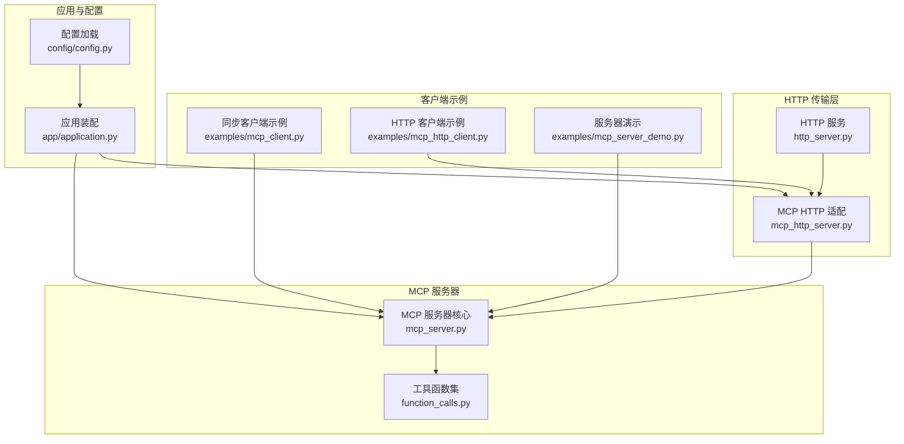
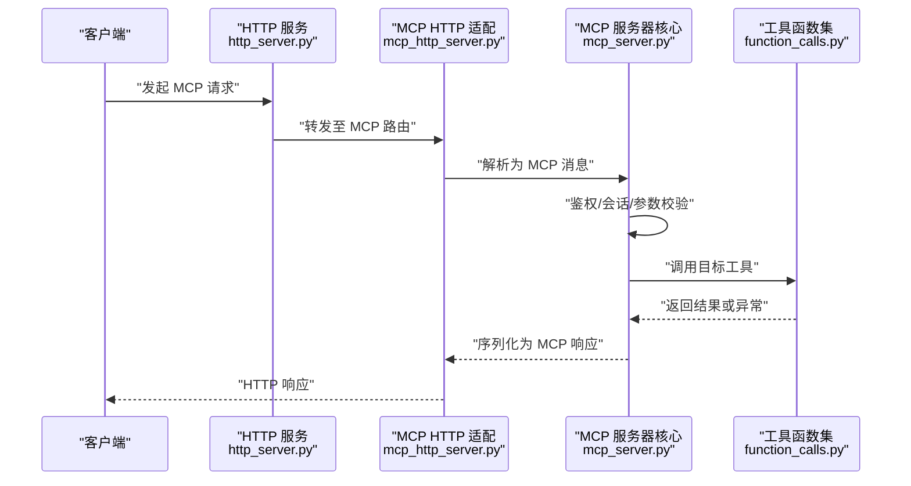
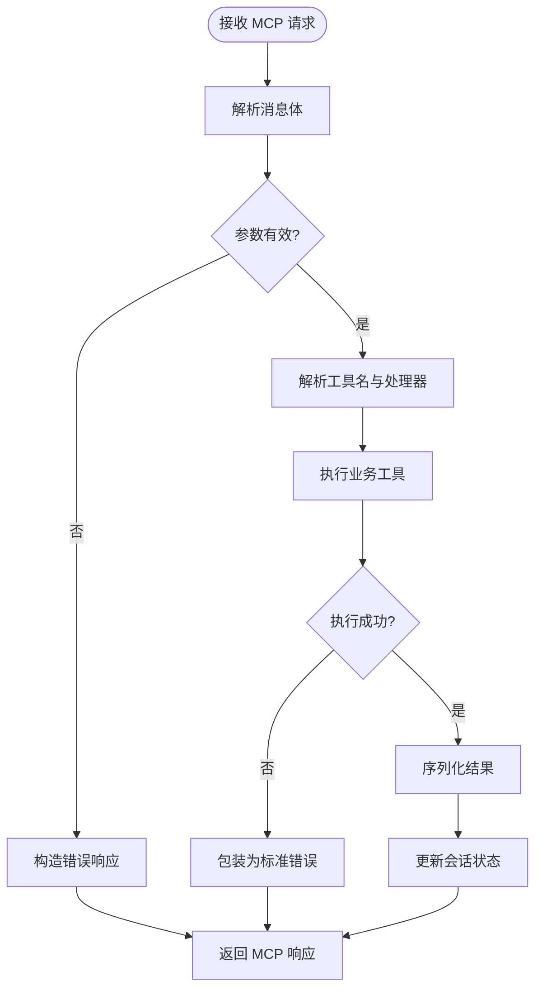
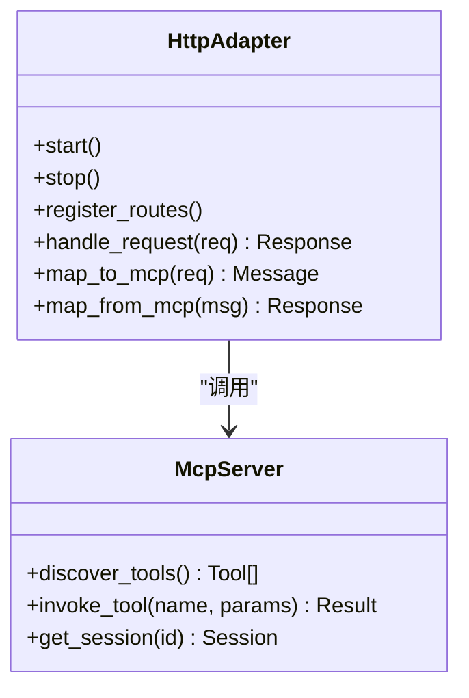
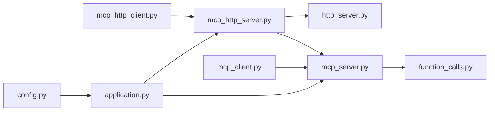

# MCP协议支持

<cite>
**本文引用的文件**   
- [mcp_server.py](file://src/penshot/mcp_server.py)
- [mcp_http_server.py](file://src/penshot/mcp_http_server.py)
- [http_server.py](file://src/penshot/http_server.py)
- [mcp_client.py](file://examples/mcp_client.py)
- [mcp_http_client.py](file://examples/mcp_http_client.py)
- [mcp_server_demo.py](file://examples/mcp_server_demo.py)
- [function_calls.py](file://src/penshot/api/function_calls.py)
- [rest_api.py](file://src/penshot/api/rest_api.py)
- [application.py](file://src/penshot/app/application.py)
- [config.py](file://src/penshot/config/config.py)
- [test_mcp.py](file://tests/api/test_mcp.py)
</cite>

## 目录
1. [简介](#简介)
2. [项目结构](#项目结构)
3. [核心组件](#核心组件)
4. [架构总览](#架构总览)
5. [详细组件分析](#详细组件分析)
6. [依赖关系分析](#依赖关系分析)
7. [性能考虑](#性能考虑)
8. [故障排除指南](#故障排除指南)
9. [结论](#结论)
10. [附录](#附录)

## 简介
本文件面向使用与集成 Model Context Protocol（MCP）的开发者，系统性说明本项目中 MCP 服务器的实现原理、连接建立过程、消息格式、错误处理与会话管理；同时记录已暴露的 MCP 工具与方法（脚本解析、分镜生成、质量审计等），并提供 MCP 客户端的同步/异步集成示例与 HTTP 传输层配置方法。文档还包含调试与排障建议，帮助快速定位问题并优化性能。

## 项目结构
围绕 MCP 的关键代码主要分布在以下位置：
- src/penshot/mcp_server.py：MCP 服务器核心逻辑（工具注册、请求路由、会话管理等）
- src/penshot/mcp_http_server.py：基于 HTTP 的 MCP 传输适配层
- src/penshot/http_server.py：通用 HTTP 服务入口（可承载 MCP 或其他 API）
- examples/mcp_client.py、examples/mcp_http_client.py：MCP 客户端同步/异步调用示例
- examples/mcp_server_demo.py：MCP 服务器演示启动
- src/penshot/api/function_calls.py：业务工具函数集合（脚本解析、分镜生成、质量审计等）
- src/penshot/api/rest_api.py：REST API 封装（便于对比或复用）
- src/penshot/app/application.py：应用装配与生命周期
- src/penshot/config/config.py：配置加载与默认值
- tests/api/test_mcp.py：MCP 相关测试用例

图表来源
- [http_server.py](file://src/penshot/http_server.py)
- [mcp_http_server.py](file://src/penshot/mcp_http_server.py)
- [mcp_server.py](file://src/penshot/mcp_server.py)
- [function_calls.py](file://src/penshot/api/function_calls.py)
- [mcp_client.py](file://examples/mcp_client.py)
- [mcp_http_client.py](file://examples/mcp_http_client.py)
- [mcp_server_demo.py](file://examples/mcp_server_demo.py)
- [application.py](file://src/penshot/app/application.py)
- [config.py](file://src/penshot/config/config.py)

章节来源
- [mcp_server.py](file://src/penshot/mcp_server.py)
- [mcp_http_server.py](file://src/penshot/mcp_http_server.py)
- [http_server.py](file://src/penshot/http_server.py)
- [mcp_client.py](file://examples/mcp_client.py)
- [mcp_http_client.py](file://examples/mcp_http_client.py)
- [mcp_server_demo.py](file://examples/mcp_server_demo.py)
- [function_calls.py](file://src/penshot/api/function_calls.py)
- [rest_api.py](file://src/penshot/api/rest_api.py)
- [application.py](file://src/penshot/app/application.py)
- [config.py](file://src/penshot/config/config.py)

## 核心组件
- MCP 服务器核心（mcp_server.py）
  - 负责工具注册、请求分发、参数校验、结果序列化、错误包装与会话上下文维护。
  - 提供统一的工具发现与元数据描述，供客户端动态发现可用能力。
- MCP HTTP 适配层（mcp_http_server.py）
  - 将 MCP 消息映射到 HTTP 请求/响应，处理路径、方法、头部与超时。
  - 可选支持流式或批量模式（取决于具体实现）。
- 工具函数集（function_calls.py）
  - 封装脚本解析、分镜生成、质量审计等业务能力，作为 MCP 工具的实际执行体。
- 客户端示例（examples/mcp_client.py、examples/mcp_http_client.py）
  - 展示同步/异步调用方式、重试策略、错误处理与日志记录。
- 应用装配（application.py）与配置（config.py）
  - 统一初始化服务、注入配置、启动/停止生命周期钩子。

章节来源
- [mcp_server.py](file://src/penshot/mcp_server.py)
- [mcp_http_server.py](file://src/penshot/mcp_http_server.py)
- [function_calls.py](file://src/penshot/api/function_calls.py)
- [mcp_client.py](file://examples/mcp_client.py)
- [mcp_http_client.py](file://examples/mcp_http_client.py)
- [application.py](file://src/penshot/app/application.py)
- [config.py](file://src/penshot/config/config.py)

## 架构总览
下图展示了从客户端到 MCP 服务器再到业务工具的完整调用链路，以及 HTTP 传输层的角色。

图表来源
- [http_server.py](file://src/penshot/http_server.py)
- [mcp_http_server.py](file://src/penshot/mcp_http_server.py)
- [mcp_server.py](file://src/penshot/mcp_server.py)
- [function_calls.py](file://src/penshot/api/function_calls.py)

## 详细组件分析

### MCP 服务器核心（mcp_server.py）
- 职责
  - 工具注册表：集中管理工具名称、描述、输入输出 Schema。
  - 请求路由：根据工具名选择对应处理器。
  - 参数校验：依据 Schema 对入参进行类型与必填项检查。
  - 会话管理：维护上下文（如用户标识、工作区、缓存键等）。
  - 错误处理：统一包装异常为 MCP 标准错误结构。
  - 结果序列化：将工具输出转换为 MCP 响应格式。
- 关键流程
  - 启动时加载工具元数据，构建路由表。
  - 收到请求后解析消息体，提取工具名与参数。
  - 校验通过后执行业务工具，捕获异常并标准化返回。
  - 更新会话状态（如进度、中间结果）。
- 扩展点
  - 新增工具只需在注册表中声明并实现对应处理器。
  - 可通过中间件机制添加鉴权、限流、审计等横切关注点。

图表来源
- [mcp_server.py](file://src/penshot/mcp_server.py)

章节来源
- [mcp_server.py](file://src/penshot/mcp_server.py)

### MCP HTTP 适配层（mcp_http_server.py）
- 职责
  - 将 MCP 消息映射到 HTTP 请求/响应，包括路径、方法、头部、查询参数与超时控制。
  - 处理跨域、压缩、分页、重试等通用 HTTP 关注点。
  - 将底层异常转换为 HTTP 状态码与错误体。
- 典型端点
  - POST /mcp/call：调用指定工具
  - GET /mcp/tools：列出可用工具
  - GET /mcp/session/{id}：查询会话状态
- 配置项
  - 端口、主机、最大请求大小、超时时间、CORS 白名单等。

图表来源
- [mcp_http_server.py](file://src/penshot/mcp_http_server.py)
- [mcp_server.py](file://src/penshot/mcp_server.py)

章节来源
- [mcp_http_server.py](file://src/penshot/mcp_http_server.py)

### 工具函数集（function_calls.py）
- 已支持的典型工具（以实际实现为准）
  - 脚本解析：将自然语言或结构化脚本解析为分镜要素。
  - 分镜生成：基于解析结果生成镜头列表、时长估计、转场建议。
  - 质量审计：对输出进行规则或模型驱动的质量评估与修复建议。
- 设计要点
  - 每个工具具备清晰的输入/输出 Schema，便于 MCP 自动发现与校验。
  - 工具内部可组合多个子任务（如先解析再估算时长）。
  - 支持幂等性与可重试性，便于上层容错。

章节来源
- [function_calls.py](file://src/penshot/api/function_calls.py)

### 客户端示例（examples/mcp_client.py、examples/mcp_http_client.py）
- 同步调用
  - 直接调用 MCP 服务器提供的工具，等待响应。
  - 适合批处理或简单脚本场景。
- 异步调用
  - 通过异步 HTTP 客户端并发调用，提升吞吐。
  - 适合高并发或长耗时任务的流水线编排。
- 最佳实践
  - 设置合理的超时与重试策略。
  - 记录请求 ID 以便追踪。
  - 对错误进行分类处理（网络、参数、业务）。

章节来源
- [mcp_client.py](file://examples/mcp_client.py)
- [mcp_http_client.py](file://examples/mcp_http_client.py)

### 服务器演示（examples/mcp_server_demo.py）
- 用于本地快速启动 MCP 服务器，加载默认工具集。
- 可与客户端示例配合验证端到端流程。

章节来源
- [mcp_server_demo.py](file://examples/mcp_server_demo.py)

### REST API 对比（src/penshot/api/rest_api.py）
- 提供与 MCP 类似的接口能力，便于对比或迁移。
- 可作为 MCP 工具实现的参考或替代方案。

章节来源
- [rest_api.py](file://src/penshot/api/rest_api.py)

### 应用装配与配置（application.py、config.py）
- application.py
  - 组装 HTTP 服务、MCP 适配器与服务器核心。
  - 管理生命周期（启动、健康检查、优雅关闭）。
- config.py
  - 加载环境变量与配置文件，提供默认值与校验。
  - 暴露服务端口、日志级别、工具开关等配置项。

章节来源
- [application.py](file://src/penshot/app/application.py)
- [config.py](file://src/penshot/config/config.py)

## 依赖关系分析
- 模块耦合
  - mcp_http_server.py 依赖 http_server.py 提供的 HTTP 基础设施。
  - mcp_server.py 依赖 function_calls.py 中的工具实现。
  - 客户端示例依赖 mcp_server.py 的对外契约（消息格式、错误结构）。
- 外部依赖
  - HTTP 框架（由 http_server.py 抽象）
  - 配置系统（config.py）
  - 日志与监控（由应用层注入）

图表来源
- [mcp_http_server.py](file://src/penshot/mcp_http_server.py)
- [http_server.py](file://src/penshot/http_server.py)
- [mcp_server.py](file://src/penshot/mcp_server.py)
- [function_calls.py](file://src/penshot/api/function_calls.py)
- [mcp_client.py](file://examples/mcp_client.py)
- [mcp_http_client.py](file://examples/mcp_http_client.py)
- [application.py](file://src/penshot/app/application.py)
- [config.py](file://src/penshot/config/config.py)

章节来源
- [mcp_http_server.py](file://src/penshot/mcp_http_server.py)
- [http_server.py](file://src/penshot/http_server.py)
- [mcp_server.py](file://src/penshot/mcp_server.py)
- [function_calls.py](file://src/penshot/api/function_calls.py)
- [mcp_client.py](file://examples/mcp_client.py)
- [mcp_http_client.py](file://examples/mcp_http_client.py)
- [application.py](file://src/penshot/app/application.py)
- [config.py](file://src/penshot/config/config.py)

## 性能考虑
- 连接与线程池
  - 合理设置 HTTP 服务器的工作进程/线程数，避免阻塞 I/O。
- 超时与重试
  - 为长耗时工具设置合适的超时与指数退避重试。
- 序列化开销
  - 尽量使用轻量级数据结构，避免大对象频繁拷贝。
- 缓存与会话
  - 对重复请求启用结果缓存；会话状态保持最小化。
- 监控与指标
  - 记录 QPS、P95/P99 延迟、错误率与资源占用。

[本节为通用指导，不直接分析具体文件]

## 故障排除指南
- 常见问题
  - 连接失败：检查端口、防火墙、CORS 配置。
  - 参数校验失败：核对工具 Schema 与入参类型。
  - 超时：增大超时或优化工具实现。
  - 会话丢失：确认会话 ID 传递正确且服务端持久化正常。
- 诊断步骤
  - 开启详细日志，记录请求 ID、工具名、入参与耗时。
  - 使用 /mcp/tools 验证工具清单是否完整。
  - 使用 /mcp/session/{id} 检查会话状态。
- 测试用例
  - 参考 tests/api/test_mcp.py 中的断言与边界条件覆盖。

章节来源
- [test_mcp.py](file://tests/api/test_mcp.py)

## 结论
本项目提供了完整的 MCP 服务器实现与 HTTP 传输适配，结合丰富的工具函数集，能够支撑脚本解析、分镜生成、质量审计等视频生产关键环节。通过清晰的客户端示例与完善的配置/装配机制，开发者可以快速集成与扩展。建议在生产环境完善监控、限流与熔断策略，确保稳定性与可观测性。

[本节为总结性内容，不直接分析具体文件]

## 附录

### 支持的 MCP 工具与方法（按功能分类）
- 脚本解析
  - 输入：原始脚本文本或结构化片段
  - 输出：分镜要素（场景、动作、对话、时长估计等）
- 分镜生成
  - 输入：解析后的分镜要素
  - 输出：镜头列表、转场建议、时长分配
- 质量审计
  - 输入：生成的分镜或脚本
  - 输出：评分、问题清单、修复建议

章节来源
- [function_calls.py](file://src/penshot/api/function_calls.py)

### 消息格式与错误处理（概览）
- 请求消息
  - 字段：工具名、参数、会话 ID、追踪 ID、时间戳
- 响应消息
  - 字段：结果数据、状态码、错误信息、耗时
- 错误结构
  - 分类：参数错误、权限错误、业务错误、系统错误
  - 包含：错误码、消息、堆栈（开发环境）、建议操作

[本节为概念性说明，不直接分析具体文件]

### MCP HTTP 传输层配置（常用项）
- 服务地址与端口
- 最大请求体大小
- 超时时间（连接、读取、写入）
- CORS 白名单
- 日志级别与采样率

章节来源
- [config.py](file://src/penshot/config/config.py)
- [mcp_http_server.py](file://src/penshot/mcp_http_server.py)

### 客户端集成示例（要点）
- 同步调用
  - 创建客户端实例 -> 设置超时 -> 调用工具 -> 处理响应/异常
- 异步调用
  - 使用异步客户端 -> 并发调用 -> 聚合结果 -> 统一错误处理
- 重试与回退
  - 指数退避、最大重试次数、回退策略

章节来源
- [mcp_client.py](file://examples/mcp_client.py)
- [mcp_http_client.py](file://examples/mcp_http_client.py)