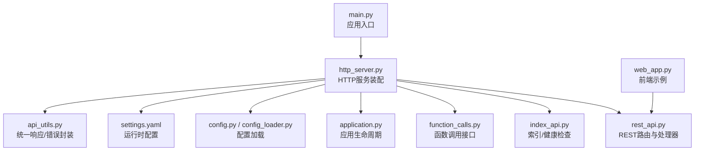
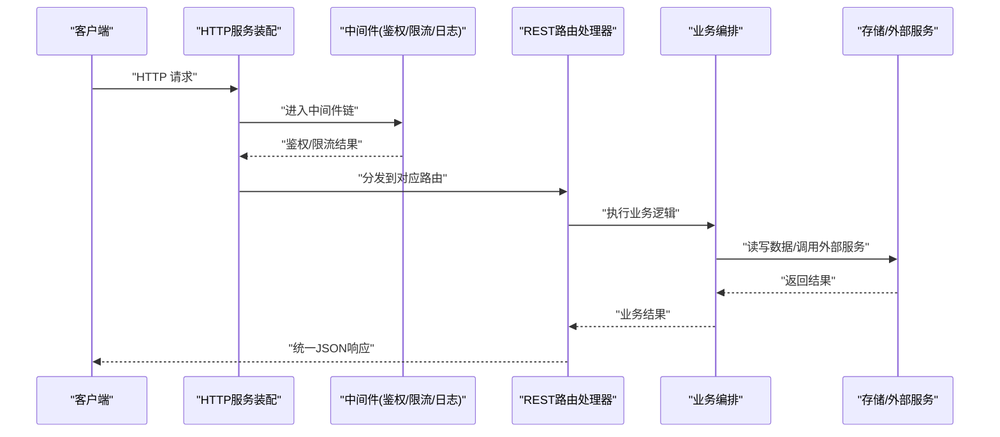
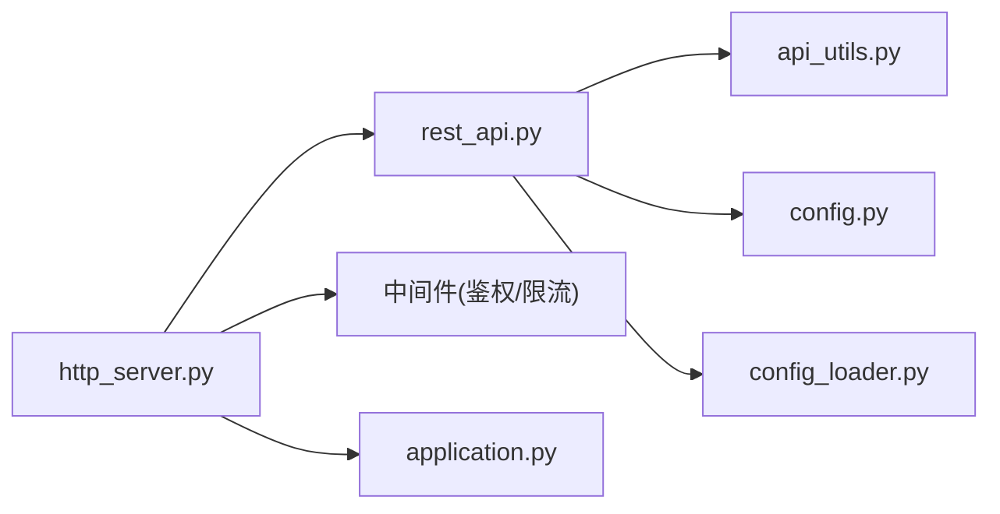

# REST API接口

<cite>
**本文引用的文件**   
- [main.py](file://main.py)
- [src/penshot/http_server.py](file://src/penshot/http_server.py)
- [src/penshot/api/rest_api.py](file://src/penshot/api/rest_api.py)
- [src/penshot/api/index_api.py](file://src/penshot/api/index_api.py)
- [src/penshot/api/function_calls.py](file://src/penshot/api/function_calls.py)
- [src/penshot/app/application.py](file://src/penshot/app/application.py)
- [src/penshot/config/config.py](file://src/penshot/config/config.py)
- [src/penshot/config/config_loader.py](file://src/penshot/config/config_loader.py)
- [src/penshot/config/settings.yaml](file://src/penshot/config/settings.yaml)
- [src/penshot/utils/api_utils.py](file://src/penshot/utils/api_utils.py)
- [examples/web_app.py](file://examples/web_app.py)
</cite>

## 目录
1. [简介](#简介)
2. [项目结构](#项目结构)
3. [核心组件](#核心组件)
4. [架构总览](#架构总览)
5. [详细组件分析](#详细组件分析)
6. [依赖分析](#依赖分析)
7. [性能考虑](#性能考虑)
8. [故障排查指南](#故障排查指南)
9. [结论](#结论)
10. [附录](#附录)

## 简介
本文件为视频分镜代理项目的RESTful API接口文档，覆盖所有HTTP端点、请求/响应格式、状态码、认证与权限控制、速率限制策略、API版本与向后兼容性说明，并提供客户端集成示例与最佳实践。重点围绕脚本处理相关能力（脚本上传、解析、分镜生成等）进行详细说明。

## 项目结构
本项目采用分层组织方式：
- 应用入口与服务器启动：位于根目录与http_server模块
- API路由定义：位于api子包
- 配置与环境：位于config子包
- 工具与通用逻辑：位于utils子包
- 示例与演示：位于examples子包

图表来源
- [main.py:1-200](file://main.py#L1-L200)
- [src/penshot/http_server.py:1-200](file://src/penshot/http_server.py#L1-L200)
- [src/penshot/api/rest_api.py:1-200](file://src/penshot/api/rest_api.py#L1-L200)
- [src/penshot/api/index_api.py:1-200](file://src/penshot/api/index_api.py#L1-L200)
- [src/penshot/api/function_calls.py:1-200](file://src/penshot/api/function_calls.py#L1-L200)
- [src/penshot/app/application.py:1-200](file://src/penshot/app/application.py#L1-L200)
- [src/penshot/config/config.py:1-200](file://src/penshot/config/config.py#L1-L200)
- [src/penshot/config/config_loader.py:1-200](file://src/penshot/config/config_loader.py#L1-L200)
- [src/penshot/config/settings.yaml:1-200](file://src/penshot/config/settings.yaml#L1-L200)
- [src/penshot/utils/api_utils.py:1-200](file://src/penshot/utils/api_utils.py#L1-L200)
- [examples/web_app.py:1-200](file://examples/web_app.py#L1-L200)

章节来源
- [main.py:1-200](file://main.py#L1-L200)
- [src/penshot/http_server.py:1-200](file://src/penshot/http_server.py#L1-L200)
- [src/penshot/api/rest_api.py:1-200](file://src/penshot/api/rest_api.py#L1-L200)
- [src/penshot/api/index_api.py:1-200](file://src/penshot/api/index_api.py#L1-L200)
- [src/penshot/api/function_calls.py:1-200](file://src/penshot/api/function_calls.py#L1-L200)
- [src/penshot/app/application.py:1-200](file://src/penshot/app/application.py#L1-L200)
- [src/penshot/config/config.py:1-200](file://src/penshot/config/config.py#L1-L200)
- [src/penshot/config/config_loader.py:1-200](file://src/penshot/config/config_loader.py#L1-L200)
- [src/penshot/config/settings.yaml:1-200](file://src/penshot/config/settings.yaml#L1-L200)
- [src/penshot/utils/api_utils.py:1-200](file://src/penshot/utils/api_utils.py#L1-L200)
- [examples/web_app.py:1-200](file://examples/web_app.py#L1-L200)

## 核心组件
- HTTP服务装配：负责注册中间件、挂载路由、绑定生命周期钩子
- REST路由层：定义REST端点、参数校验、业务编排与统一响应
- 索引与健康检查：提供服务可用性探测与基础信息
- 函数调用接口：暴露可被外部系统调用的原子能力
- 配置管理：集中读取环境配置与默认值
- 统一响应与错误封装：保证一致的JSON结构与错误语义

章节来源
- [src/penshot/http_server.py:1-200](file://src/penshot/http_server.py#L1-L200)
- [src/penshot/api/rest_api.py:1-200](file://src/penshot/api/rest_api.py#L1-L200)
- [src/penshot/api/index_api.py:1-200](file://src/penshot/api/index_api.py#L1-L200)
- [src/penshot/api/function_calls.py:1-200](file://src/penshot/api/function_calls.py#L1-L200)
- [src/penshot/config/config.py:1-200](file://src/penshot/config/config.py#L1-L200)
- [src/penshot/config/config_loader.py:1-200](file://src/penshot/config/config_loader.py#L1-L200)
- [src/penshot/config/settings.yaml:1-200](file://src/penshot/config/settings.yaml#L1-L200)
- [src/penshot/utils/api_utils.py:1-200](file://src/penshot/utils/api_utils.py#L1-L200)

## 架构总览
REST API整体流程如下：客户端通过HTTP发起请求，进入HTTP服务装配层，经中间件（鉴权、限流、日志）后到达具体路由处理器；处理器完成参数校验、业务编排与持久化，最后返回统一的JSON响应。

图表来源
- [src/penshot/http_server.py:1-200](file://src/penshot/http_server.py#L1-L200)
- [src/penshot/api/rest_api.py:1-200](file://src/penshot/api/rest_api.py#L1-L200)
- [src/penshot/utils/api_utils.py:1-200](file://src/penshot/utils/api_utils.py#L1-L200)

## 详细组件分析

### 全局与版本信息
- 版本号：由配置或环境变量注入，用于在响应头或元数据中体现
- 向后兼容：遵循语义化版本策略，破坏性变更将提升主版本并保留旧版路由一段时间
- 健康检查：GET /health 返回服务可用性与版本信息

章节来源
- [src/penshot/api/index_api.py:1-200](file://src/penshot/api/index_api.py#L1-L200)
- [src/penshot/config/config.py:1-200](file://src/penshot/config/config.py#L1-L200)
- [src/penshot/config/config_loader.py:1-200](file://src/penshot/config/config_loader.py#L1-L200)
- [src/penshot/config/settings.yaml:1-200](file://src/penshot/config/settings.yaml#L1-L200)

### 认证与授权
- 认证机制：支持基于令牌（如Bearer Token）的认证，令牌可通过配置注入或在请求头携带
- 权限控制：按角色或资源维度进行访问控制，敏感操作需更高权限
- 安全建议：强制HTTPS、最小权限原则、定期轮换密钥

章节来源
- [src/penshot/http_server.py:1-200](file://src/penshot/http_server.py#L1-L200)
- [src/penshot/config/config.py:1-200](file://src/penshot/config/config.py#L1-L200)
- [src/penshot/config/settings.yaml:1-200](file://src/penshot/config/settings.yaml#L1-L200)

### 速率限制
- 策略：基于IP或用户标识的滑动窗口/固定窗口限流
- 阈值：通过配置文件动态调整
- 响应：超限返回标准错误码与重试提示

章节来源
- [src/penshot/http_server.py:1-200](file://src/penshot/http_server.py#L1-L200)
- [src/penshot/config/settings.yaml:1-200](file://src/penshot/config/settings.yaml#L1-L200)

### 统一响应与错误格式
- 成功响应：包含数据体、时间戳、请求ID
- 错误响应：包含错误码、消息、详情（可选）、追踪ID
- 常见状态码：200/201/400/401/403/404/429/500

章节来源
- [src/penshot/utils/api_utils.py:1-200](file://src/penshot/utils/api_utils.py#L1-L200)

### 脚本处理相关API
以下端点聚焦于脚本上传、解析、分镜生成等核心能力。实际字段以各处理器实现为准，以下为通用规范与示例结构。

- 上传脚本
  - 方法：POST
  - 路径：/api/v1/scripts/upload
  - 内容类型：multipart/form-data
  - 请求参数：
    - file: 文本或结构化脚本文件
    - metadata: 可选键值对（语言、风格、目标时长等）
  - 成功响应：201 Created，返回任务ID与状态
  - 失败响应：400/413/415/500

- 获取脚本任务状态
  - 方法：GET
  - 路径：/api/v1/scripts/{task_id}
  - 路径参数：task_id
  - 成功响应：200 OK，返回任务进度、阶段、结果摘要
  - 失败响应：404/500

- 触发脚本解析
  - 方法：POST
  - 路径：/api/v1/scripts/{task_id}/parse
  - 请求体：可选解析策略（规则/LLM）、语言、输出格式
  - 成功响应：202 Accepted，返回解析任务ID
  - 失败响应：400/404/500

- 获取解析结果
  - 方法：GET
  - 路径：/api/v1/scripts/{task_id}/parse/result
  - 成功响应：200 OK，返回结构化解析结果（场景、对话、动作等）
  - 失败响应：404/500

- 生成分镜
  - 方法：POST
  - 路径：/api/v1/scripts/{task_id}/storyboard
  - 请求体：分镜策略、镜头粒度、时长估算开关
  - 成功响应：202 Accepted，返回分镜任务ID
  - 失败响应：400/404/500

- 获取分镜结果
  - 方法：GET
  - 路径：/api/v1/scripts/{task_id}/storyboard/result
  - 成功响应：200 OK，返回分镜列表（镜头描述、时长、转场等）
  - 失败响应：404/500

- 删除脚本任务
  - 方法：DELETE
  - 路径：/api/v1/scripts/{task_id}
  - 成功响应：204 No Content
  - 失败响应：404/500

- 批量操作（可选）
  - 方法：POST
  - 路径：/api/v1/scripts/batch
  - 请求体：任务数组（上传/解析/分镜）
  - 成功响应：202 Accepted，返回批处理跟踪ID
  - 失败响应：400/500

章节来源
- [src/penshot/api/rest_api.py:1-200](file://src/penshot/api/rest_api.py#L1-L200)
- [src/penshot/utils/api_utils.py:1-200](file://src/penshot/utils/api_utils.py#L1-L200)

### 函数调用接口
- 目的：暴露原子能力供外部系统集成（例如单次解析、单次分镜估算）
- 典型端点：
  - POST /api/v1/functions/parse
  - POST /api/v1/functions/estimate-duration
  - GET /api/v1/functions/status/{job_id}
- 请求/响应：遵循统一响应格式，错误码与限流策略一致

章节来源
- [src/penshot/api/function_calls.py:1-200](file://src/penshot/api/function_calls.py#L1-L200)
- [src/penshot/utils/api_utils.py:1-200](file://src/penshot/utils/api_utils.py#L1-L200)

### 索引与健康检查
- GET /health：返回服务状态、版本、依赖健康情况
- GET /info：返回服务元信息与能力清单

章节来源
- [src/penshot/api/index_api.py:1-200](file://src/penshot/api/index_api.py#L1-L200)

### 请求/响应示例（JSON结构）
- 成功响应示例结构
  - data: 业务数据对象
  - meta: { request_id, timestamp }
  - status: { code, message }
- 错误响应示例结构
  - error: { code, message, details, trace_id }
- 分页与排序（若适用）
  - page, page_size, total, items[]

章节来源
- [src/penshot/utils/api_utils.py:1-200](file://src/penshot/utils/api_utils.py#L1-L200)

### 客户端集成示例与最佳实践
- 使用示例：参考examples/web_app.py中的调用方式，包括初始化、鉴权、重试与超时设置
- 最佳实践：
  - 使用连接池与Keep-Alive
  - 合理设置超时与重试退避
  - 幂等性设计（GET/PUT/DELETE）
  - 记录request_id便于追踪
  - 对大文件上传使用分片与断点续传

章节来源
- [examples/web_app.py:1-200](file://examples/web_app.py#L1-L200)
- [src/penshot/utils/api_utils.py:1-200](file://src/penshot/utils/api_utils.py#L1-L200)

## 依赖分析
API层依赖配置、中间件与业务编排，形成清晰的解耦关系。

图表来源
- [src/penshot/api/rest_api.py:1-200](file://src/penshot/api/rest_api.py#L1-L200)
- [src/penshot/utils/api_utils.py:1-200](file://src/penshot/utils/api_utils.py#L1-L200)
- [src/penshot/config/config.py:1-200](file://src/penshot/config/config.py#L1-L200)
- [src/penshot/config/config_loader.py:1-200](file://src/penshot/config/config_loader.py#L1-L200)
- [src/penshot/http_server.py:1-200](file://src/penshot/http_server.py#L1-L200)
- [src/penshot/app/application.py:1-200](file://src/penshot/app/application.py#L1-L200)

章节来源
- [src/penshot/http_server.py:1-200](file://src/penshot/http_server.py#L1-L200)
- [src/penshot/api/rest_api.py:1-200](file://src/penshot/api/rest_api.py#L1-L200)
- [src/penshot/config/config.py:1-200](file://src/penshot/config/config.py#L1-L200)
- [src/penshot/config/config_loader.py:1-200](file://src/penshot/config/config_loader.py#L1-L200)
- [src/penshot/app/application.py:1-200](file://src/penshot/app/application.py#L1-L200)

## 性能考虑
- 异步I/O与并发：在高并发场景下启用异步处理与连接复用
- 缓存策略：对热点查询（如任务状态）引入缓存层
- 限流与熔断：保护后端服务，避免雪崩
- 大文件处理：分块上传、后台任务队列与进度回调
- 监控与指标：收集QPS、延迟、错误率与资源占用

[本节为通用指导，不直接分析具体文件]

## 故障排查指南
- 常见问题
  - 401/403：检查令牌有效性、权限范围与过期时间
  - 429：降低请求频率或申请提高配额
  - 500：查看trace_id与服务日志定位异常
- 诊断步骤
  - 确认健康检查与依赖状态
  - 核对请求头与签名
  - 复现最小用例并抓取完整请求/响应
  - 结合request_id检索链路日志

章节来源
- [src/penshot/utils/api_utils.py:1-200](file://src/penshot/utils/api_utils.py#L1-L200)
- [src/penshot/api/index_api.py:1-200](file://src/penshot/api/index_api.py#L1-L200)

## 结论
本REST API以清晰的分层与统一的响应格式为基础，提供脚本上传、解析、分镜生成等核心能力。通过认证、权限与限流保障安全性与稳定性，配合完善的错误码与监控手段，便于快速集成与排障。建议在接入时遵循最佳实践，确保高可用与可扩展性。

[本节为总结性内容，不直接分析具体文件]

## 附录
- 术语表
  - 任务ID：一次操作的唯一标识
  - 请求ID：每次HTTP请求的唯一标识
  - 分镜：按镜头维度组织的结构化输出
- 版本策略
  - 主版本：破坏性变更
  - 次版本：新增功能，保持向后兼容
  - 修订版本：缺陷修复与优化

[本节为补充信息，不直接分析具体文件]