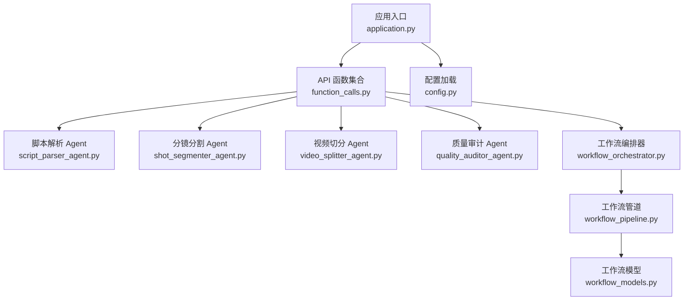
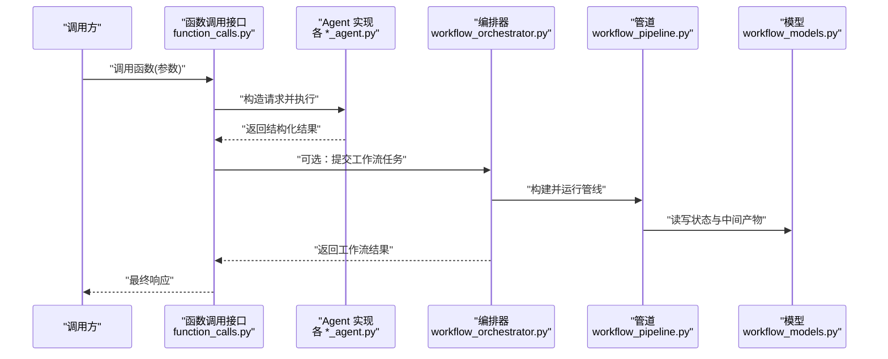
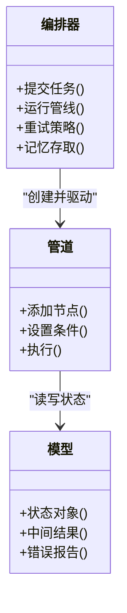
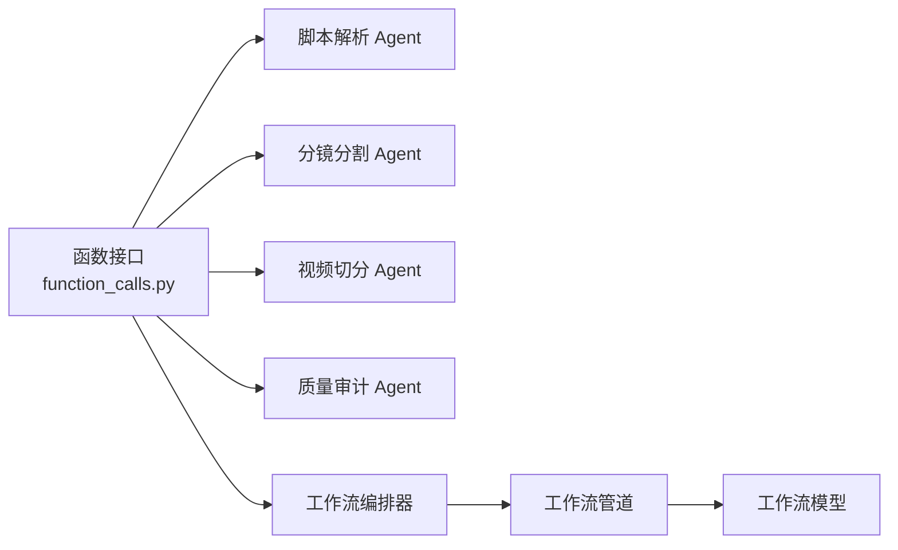

# 函数调用接口

<cite>
**本文引用的文件**   
- [src/penshot/api/function_calls.py](file://src/penshot/api/function_calls.py)
- [examples/direct_usage.py](file://examples/direct_usage.py)
- [examples/a2a_integration.py](file://examples/a2a_integration.py)
- [examples/langgraph_integration.py](file://examples/langgraph_integration.py)
- [src/penshot/neopen/agent/script_parser_agent.py](file://src/penshot/neopen/agent/script_parser_agent.py)
- [src/penshot/neopen/agent/shot_segmenter_agent.py](file://src/penshot/neopen/agent/shot_segmenter_agent.py)
- [src/penshot/neopen/agent/video_splitter_agent.py](file://src/penshot/neopen/agent/video_splitter_agent.py)
- [src/penshot/neopen/agent/quality_auditor_agent.py](file://src/penshot/neopen/agent/quality_auditor_agent.py)
- [src/penshot/neopen/agent/workflow/workflow_orchestrator.py](file://src/penshot/neopen/agent/workflow/workflow_orchestrator.py)
- [src/penshot/neopen/agent/workflow/workflow_pipeline.py](file://src/penshot/neopen/agent/workflow/workflow_pipeline.py)
- [src/penshot/neopen/agent/workflow/workflow_models.py](file://src/penshot/neopen/agent/workflow/workflow_models.py)
- [src/penshot/config/config.py](file://src/penshot/config/config.py)
- [src/penshot/app/application.py](file://src/penshot/app/application.py)
- [tests/api/test_function_calls.py](file://tests/api/test_function_calls.py)
</cite>

## 目录
1. [简介](#简介)
2. [项目结构](#项目结构)
3. [核心组件](#核心组件)
4. [架构总览](#架构总览)
5. [详细组件分析](#详细组件分析)
6. [依赖关系分析](#依赖关系分析)
7. [性能考虑](#性能考虑)
8. [故障排查指南](#故障排查指南)
9. [结论](#结论)
10. [附录](#附录)

## 简介
本文件面向需要直接调用 Python 函数的开发者，系统化梳理脚本处理、分镜生成、质量检查等核心能力的可编程接口。文档覆盖：
- 可直接调用的函数签名与参数类型、返回值格式、异常行为
- 批量处理与错误恢复模式的使用示例路径
- 与 Agent 系统的集成方式与配置选项
- 性能优化建议与最佳实践
- 单元测试示例与调试技巧

## 项目结构
本项目将“函数调用接口”集中在 API 层，并通过 Agent 封装具体业务逻辑（脚本解析、分镜分割、视频切分、质量审计），由工作流编排器统一调度。示例位于 examples 目录，测试位于 tests 目录。

图示来源
- [src/penshot/app/application.py](file://src/penshot/app/application.py)
- [src/penshot/api/function_calls.py](file://src/penshot/api/function_calls.py)
- [src/penshot/neopen/agent/script_parser_agent.py](file://src/penshot/neopen/agent/script_parser_agent.py)
- [src/penshot/neopen/agent/shot_segmenter_agent.py](file://src/penshot/neopen/agent/shot_segmenter_agent.py)
- [src/penshot/neopen/agent/video_splitter_agent.py](file://src/penshot/neopen/agent/video_splitter_agent.py)
- [src/penshot/neopen/agent/quality_auditor_agent.py](file://src/penshot/neopen/agent/quality_auditor_agent.py)
- [src/penshot/neopen/agent/workflow/workflow_orchestrator.py](file://src/penshot/neopen/agent/workflow/workflow_orchestrator.py)
- [src/penshot/neopen/agent/workflow/workflow_pipeline.py](file://src/penshot/neopen/agent/workflow/workflow_pipeline.py)
- [src/penshot/neopen/agent/workflow/workflow_models.py](file://src/penshot/neopen/agent/workflow/workflow_models.py)
- [src/penshot/config/config.py](file://src/penshot/config/config.py)

章节来源
- [src/penshot/app/application.py](file://src/penshot/app/application.py)
- [src/penshot/api/function_calls.py](file://src/penshot/api/function_calls.py)
- [src/penshot/config/config.py](file://src/penshot/config/config.py)

## 核心组件
- 函数调用入口：提供一组可直接调用的 Python 函数，用于脚本处理、分镜生成、质量检查等。
- Agent 封装：每个能力对应一个 Agent，负责提示词、LLM 客户端、工具链与结果建模。
- 工作流编排：通过编排器串联多个步骤，支持重试、修复、记忆与持久化。
- 配置系统：集中管理 LLM 客户端、提示词模板、规则与阈值等。

章节来源
- [src/penshot/api/function_calls.py](file://src/penshot/api/function_calls.py)
- [src/penshot/neopen/agent/workflow/workflow_orchestrator.py](file://src/penshot/neopen/agent/workflow/workflow_orchestrator.py)
- [src/penshot/config/config.py](file://src/penshot/config/config.py)

## 架构总览
下图展示了从函数调用到 Agent 执行再到工作流编排的端到端流程。

图示来源
- [src/penshot/api/function_calls.py](file://src/penshot/api/function_calls.py)
- [src/penshot/neopen/agent/script_parser_agent.py](file://src/penshot/neopen/agent/script_parser_agent.py)
- [src/penshot/neopen/agent/shot_segmenter_agent.py](file://src/penshot/neopen/agent/shot_segmenter_agent.py)
- [src/penshot/neopen/agent/video_splitter_agent.py](file://src/penshot/neopen/agent/video_splitter_agent.py)
- [src/penshot/neopen/agent/quality_auditor_agent.py](file://src/penshot/neopen/agent/quality_auditor_agent.py)
- [src/penshot/neopen/agent/workflow/workflow_orchestrator.py](file://src/penshot/neopen/agent/workflow/workflow_orchestrator.py)
- [src/penshot/neopen/agent/workflow/workflow_pipeline.py](file://src/penshot/neopen/agent/workflow/workflow_pipeline.py)
- [src/penshot/neopen/agent/workflow/workflow_models.py](file://src/penshot/neopen/agent/workflow/workflow_models.py)

## 详细组件分析

### 函数调用接口总览
- 职责：暴露一组稳定的 Python 函数，屏蔽底层 Agent 与工作流细节，便于外部系统集成。
- 典型能力：
  - 脚本处理：文本脚本解析、结构化输出、关键信息抽取
  - 分镜生成：基于脚本或上下文生成分镜序列
  - 质量检查：对输出进行规则与 LLM 双重校验
- 调用风格：同步函数调用；可配合工作流进行批处理与容错。

使用示例路径
- [examples/direct_usage.py](file://examples/direct_usage.py)

章节来源
- [src/penshot/api/function_calls.py](file://src/penshot/api/function_calls.py)
- [examples/direct_usage.py](file://examples/direct_usage.py)

### 脚本处理接口（脚本解析）
- 功能要点：
  - 输入：原始脚本文本或结构化片段
  - 输出：标准化脚本结构（场景、对话、动作等）
  - 扩展：支持多语言与规则/LLM 双引擎切换
- 关键类与方法：
  - 脚本解析 Agent：负责提示词组装、解析策略选择与结果校验
- 异常处理：
  - 输入校验失败：抛出参数异常
  - 解析失败：返回带错误信息的结构化结果或抛出领域异常
- 配置项：
  - 解析策略、关键词表、时长估算配置等

章节来源
- [src/penshot/neopen/agent/script_parser_agent.py](file://src/penshot/neopen/agent/script_parser_agent.py)
- [src/penshot/neopen/agent/workflow/workflow_models.py](file://src/penshot/neopen/agent/workflow/workflow_models.py)

### 分镜生成接口（分镜分割）
- 功能要点：
  - 输入：已解析的脚本或上下文
  - 输出：分镜列表（含镜头描述、时长估计、转场信息等）
  - 扩展：支持多种估算器（动作、对话、场景）组合
- 关键类与方法：
  - 分镜分割 Agent：封装估算器工厂与增强器
- 异常处理：
  - 估算失败：降级为默认策略或返回部分结果
- 配置项：
  - 估算器权重、阈值、提示词模板

章节来源
- [src/penshot/neopen/agent/shot_segmenter_agent.py](file://src/penshot/neopen/agent/shot_segmenter_agent.py)
- [src/penshot/neopen/agent/workflow/workflow_models.py](file://src/penshot/neopen/agent/workflow/workflow_models.py)

### 视频切分接口（视频分割）
- 功能要点：
  - 输入：分镜序列与媒体资源
  - 输出：按分镜切分的视频片段清单及元数据
  - 扩展：支持规则与 LLM 两种切分策略
- 关键类与方法：
  - 视频切分 Agent：协调切分策略与后处理
- 异常处理：
  - 媒体不可用/格式不支持：返回明确错误码与修复建议
- 配置项：
  - 切分策略、编码参数、输出路径

章节来源
- [src/penshot/neopen/agent/video_splitter_agent.py](file://src/penshot/neopen/agent/video_splitter_agent.py)
- [src/penshot/neopen/agent/workflow/workflow_models.py](file://src/penshot/neopen/agent/workflow/workflow_models.py)

### 质量检查接口（质量审计）
- 功能要点：
  - 输入：待审内容（如分镜、脚本、切分结果）
  - 输出：审计报告（问题清单、严重级别、修复建议）
  - 扩展：规则审计与 LLM 审计并行或串行
- 关键类与方法：
  - 质量审计 Agent：聚合规则与 LLM 检查结果
- 异常处理：
  - 规则冲突或 LLM 超时：回退到规则结果并记录告警
- 配置项：
  - 规则集、评分阈值、重试次数

章节来源
- [src/penshot/neopen/agent/quality_auditor_agent.py](file://src/penshot/neopen/agent/quality_auditor_agent.py)
- [src/penshot/neopen/agent/workflow/workflow_models.py](file://src/penshot/neopen/agent/workflow/workflow_models.py)

### 工作流编排与管道
- 编排器：
  - 负责任务生命周期、节点调度、错误恢复与记忆存取
- 管道：
  - 定义步骤顺序、条件分支、重试与补偿
- 模型：
  - 统一的状态与中间结果数据结构，保证跨节点一致性

图示来源
- [src/penshot/neopen/agent/workflow/workflow_orchestrator.py](file://src/penshot/neopen/agent/workflow/workflow_orchestrator.py)
- [src/penshot/neopen/agent/workflow/workflow_pipeline.py](file://src/penshot/neopen/agent/workflow/workflow_pipeline.py)
- [src/penshot/neopen/agent/workflow/workflow_models.py](file://src/penshot/neopen/agent/workflow/workflow_models.py)

章节来源
- [src/penshot/neopen/agent/workflow/workflow_orchestrator.py](file://src/penshot/neopen/agent/workflow/workflow_orchestrator.py)
- [src/penshot/neopen/agent/workflow/workflow_pipeline.py](file://src/penshot/neopen/agent/workflow/workflow_pipeline.py)
- [src/penshot/neopen/agent/workflow/workflow_models.py](file://src/penshot/neopen/agent/workflow/workflow_models.py)

### 与 Agent 系统的集成方式
- 直接调用：通过函数接口直接触发单个 Agent 能力
- 工作流集成：通过编排器串联多个 Agent，形成端到端流水线
- 外部集成：
  - A2A 集成示例：展示与其他 Agent 的协作
  - LangGraph 集成示例：在图结构中编排任务

章节来源
- [examples/a2a_integration.py](file://examples/a2a_integration.py)
- [examples/langgraph_integration.py](file://examples/langgraph_integration.py)
- [src/penshot/neopen/agent/workflow/workflow_orchestrator.py](file://src/penshot/neopen/agent/workflow/workflow_orchestrator.py)

### 配置选项
- 配置加载：集中读取环境、提示词模板、LLM 客户端与规则
- 关键项：
  - LLM 客户端配置（模型、密钥、并发）
  - 提示词模板版本与语言
  - 规则与阈值（质量审计、估算器）
  - 缓存与日志级别

章节来源
- [src/penshot/config/config.py](file://src/penshot/config/config.py)
- [src/penshot/app/application.py](file://src/penshot/app/application.py)

## 依赖关系分析
- 低耦合：函数接口仅依赖 Agent 抽象与工作流模型
- 可扩展：新增能力只需实现对应 Agent 并在编排器注册
- 外部依赖：LLM 客户端、存储与缓存

图示来源
- [src/penshot/api/function_calls.py](file://src/penshot/api/function_calls.py)
- [src/penshot/neopen/agent/script_parser_agent.py](file://src/penshot/neopen/agent/script_parser_agent.py)
- [src/penshot/neopen/agent/shot_segmenter_agent.py](file://src/penshot/neopen/agent/shot_segmenter_agent.py)
- [src/penshot/neopen/agent/video_splitter_agent.py](file://src/penshot/neopen/agent/video_splitter_agent.py)
- [src/penshot/neopen/agent/quality_auditor_agent.py](file://src/penshot/neopen/agent/quality_auditor_agent.py)
- [src/penshot/neopen/agent/workflow/workflow_orchestrator.py](file://src/penshot/neopen/agent/workflow/workflow_orchestrator.py)
- [src/penshot/neopen/agent/workflow/workflow_pipeline.py](file://src/penshot/neopen/agent/workflow/workflow_pipeline.py)
- [src/penshot/neopen/agent/workflow/workflow_models.py](file://src/penshot/neopen/agent/workflow/workflow_models.py)

章节来源
- [src/penshot/api/function_calls.py](file://src/penshot/api/function_calls.py)
- [src/penshot/neopen/agent/workflow/workflow_orchestrator.py](file://src/penshot/neopen/agent/workflow/workflow_orchestrator.py)

## 性能考虑
- 并发控制：合理设置 LLM 客户端并发度，避免限流
- 缓存策略：启用提示词与结果缓存，减少重复计算
- 批处理：优先使用工作流管道批量执行，降低上下文切换开销
- 降级与重试：对不稳定环节设置重试与回退策略
- 资源隔离：不同任务使用独立上下文与临时目录

[本节为通用指导，不直接分析具体文件]

## 故障排查指南
- 常见问题定位：
  - 参数校验失败：检查输入结构与必填字段
  - LLM 调用失败：查看客户端配置与网络状况
  - 规则冲突：核对规则优先级与阈值
- 调试技巧：
  - 开启详细日志，关注关键节点耗时与错误堆栈
  - 使用最小复现用例逐步缩小范围
  - 借助工作流状态快照回溯中间结果
- 参考测试：
  - 函数接口单测示例与断言模式

章节来源
- [tests/api/test_function_calls.py](file://tests/api/test_function_calls.py)

## 结论
通过统一的函数调用接口与 Agent 封装，项目提供了稳定、可扩展且易于集成的脚本处理、分镜生成与质量检查能力。结合工作流编排与配置系统，可实现高可用、高性能的生产级流水线。建议在生产环境中启用缓存、重试与监控，并结合单元测试持续验证接口契约。

[本节为总结性内容，不直接分析具体文件]

## 附录

### 使用示例与最佳实践
- 直接调用示例路径：
  - [examples/direct_usage.py](file://examples/direct_usage.py)
- 批量处理与错误恢复：
  - 在工作流中设置重试与补偿节点，捕获异常并记录诊断信息
- 与外部系统集成：
  - A2A 集成示例：[examples/a2a_integration.py](file://examples/a2a_integration.py)
  - LangGraph 集成示例：[examples/langgraph_integration.py](file://examples/langgraph_integration.py)

章节来源
- [examples/direct_usage.py](file://examples/direct_usage.py)
- [examples/a2a_integration.py](file://examples/a2a_integration.py)
- [examples/langgraph_integration.py](file://examples/langgraph_integration.py)