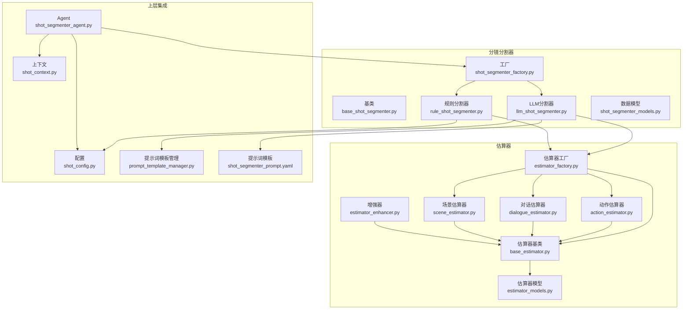
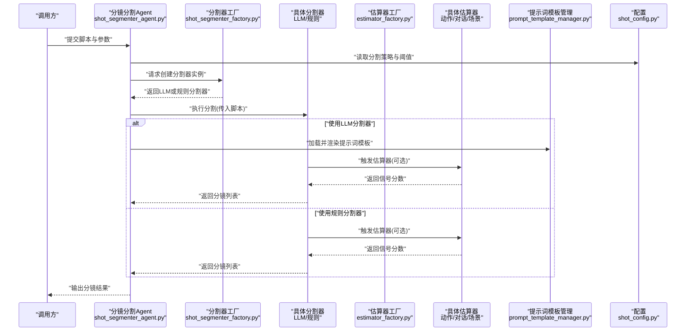
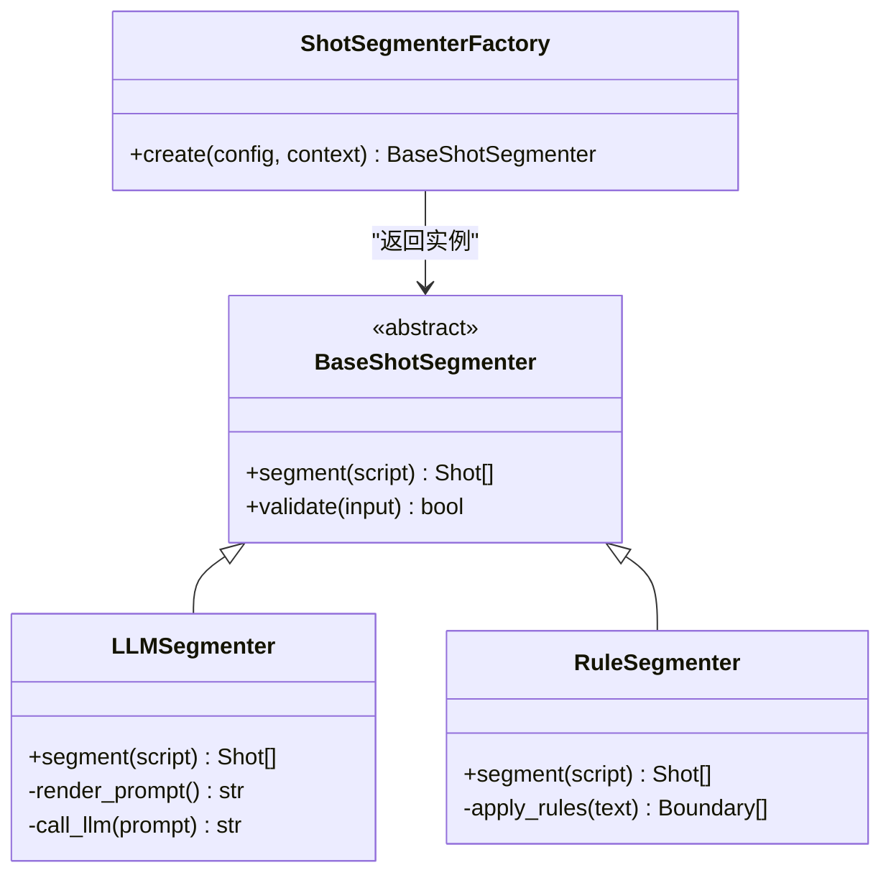
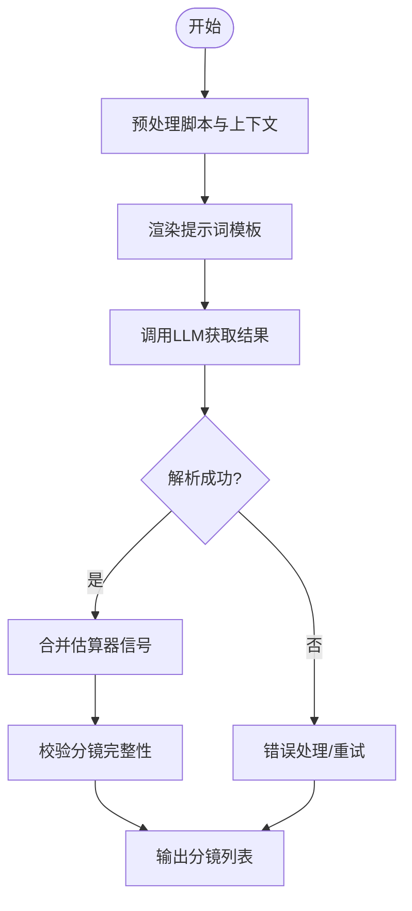
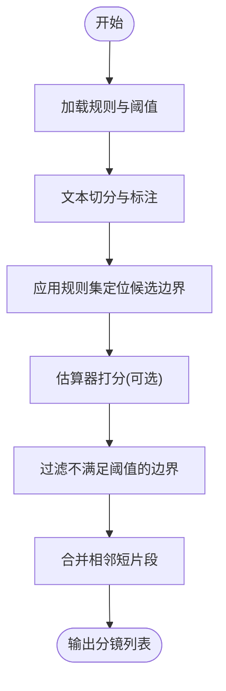
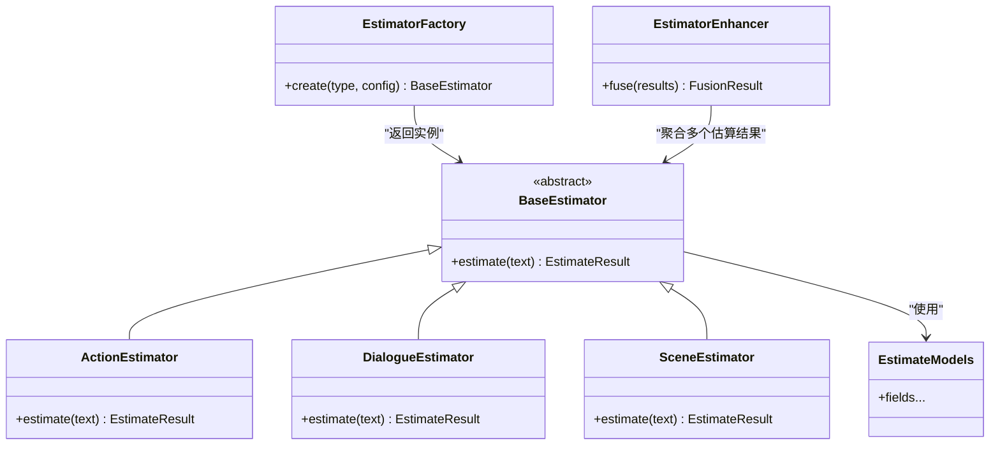
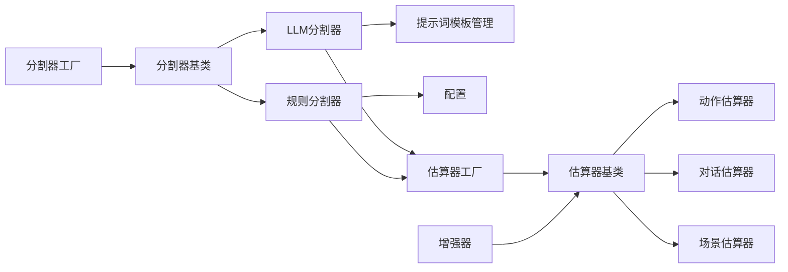

# 分镜分割器

<cite>
**本文引用的文件**   
- [shot_segmenter_factory.py](file://src/penshot/neopen/agent/shot_segmenter/shot_segmenter_factory.py)
- [base_shot_segmenter.py](file://src/penshot/neopen/agent/shot_segmenter/base_shot_segmenter.py)
- [llm_shot_segmenter.py](file://src/penshot/neopen/agent/shot_segmenter/llm_shot_segmenter.py)
- [rule_shot_segmenter.py](file://src/penshot/neopen/agent/shot_segmenter/rule_shot_segmenter.py)
- [shot_segmenter_models.py](file://src/penshot/neopen/agent/shot_segmenter/shot_segmenter_models.py)
- [estimator_factory.py](file://src/penshot/neopen/agent/shot_segmenter/estimator/estimator_factory.py)
- [base_estimator.py](file://src/penshot/neopen/agent/shot_segmenter/estimator/base_estimator.py)
- [action_estimator.py](file://src/penshot/neopen/agent/shot_segmenter/estimator/action_estimator.py)
- [dialogue_estimator.py](file://src/penshot/neopen/agent/shot_segmenter/estimator/dialogue_estimator.py)
- [scene_estimator.py](file://src/penshot/neopen/agent/shot_segmenter/estimator/scene_estimator.py)
- [estimator_enhancer.py](file://src/penshot/neopen/agent/shot_segmenter/estimator/estimator_enhancer.py)
- [estimator_models.py](file://src/penshot/neopen/agent/shot_segmenter/estimator/estimator_models.py)
- [shot_segmenter_agent.py](file://src/penshot/neopen/agent/shot_segmenter_agent.py)
- [shot_config.py](file://src/penshot/neopen/shot_config.py)
- [shot_context.py](file://src/penshot/neopen/shot_context.py)
- [prompt_template_manager.py](file://src/penshot/neopen/prompts/prompt_template_manager.py)
- [shot_segmenter_prompt.yaml](file://src/penshot/neopen/prompts/v1.x/en/shot_segmenter_prompt.yaml)
</cite>

## 目录
1. [简介](#简介)
2. [项目结构](#项目结构)
3. [核心组件](#核心组件)
4. [架构总览](#架构总览)
5. [详细组件分析](#详细组件分析)
6. [依赖关系分析](#依赖关系分析)
7. [性能考量](#性能考量)
8. [故障排查指南](#故障排查指南)
9. [结论](#结论)
10. [附录](#附录)

## 简介
本文件面向“分镜分割器”子系统，系统性阐述其目标、架构与实现细节。分镜分割器的核心任务是将剧本或结构化脚本切分为可执行的“分镜”单元，并输出每个分镜的语义边界、时长估计、角色对话、动作与场景变化等元信息。系统提供两种主要策略：
- 基于大语言模型（LLM）的智能分割：利用提示词工程与模型推理能力进行语义理解与边界判定。
- 基于规则的分割：通过关键词、句式、段落结构与领域规则进行快速、稳定的切分。

此外，系统采用工厂模式统一创建分割器实例，并通过估算器模块对分镜时长、动作密度、对话强度与场景切换等进行量化评估，从而提升分割质量与可控性。

## 项目结构
分镜分割相关代码位于 agent/shot_segmenter 子包内，包含基础抽象、具体实现、工厂与数据模型；估算器位于 estimator 子目录；上层 Agent 负责编排调用；配置与提示词分别由 shot_config、prompt_template_manager 与 YAML 模板管理。

图表来源
- [shot_segmenter_factory.py](file://src/penshot/neopen/agent/shot_segmenter/shot_segmenter_factory.py)
- [base_shot_segmenter.py](file://src/penshot/neopen/agent/shot_segmenter/base_shot_segmenter.py)
- [llm_shot_segmenter.py](file://src/penshot/neopen/agent/shot_segmenter/llm_shot_segmenter.py)
- [rule_shot_segmenter.py](file://src/penshot/neopen/agent/shot_segmenter/rule_shot_segmenter.py)
- [shot_segmenter_models.py](file://src/penshot/neopen/agent/shot_segmenter/shot_segmenter_models.py)
- [estimator_factory.py](file://src/penshot/neopen/agent/shot_segmenter/estimator/estimator_factory.py)
- [base_estimator.py](file://src/penshot/neopen/agent/shot_segmenter/estimator/base_estimator.py)
- [action_estimator.py](file://src/penshot/neopen/agent/shot_segmenter/estimator/action_estimator.py)
- [dialogue_estimator.py](file://src/penshot/neopen/agent/shot_segmenter/estimator/dialogue_estimator.py)
- [scene_estimator.py](file://src/penshot/neopen/agent/shot_segmenter/estimator/scene_estimator.py)
- [estimator_enhancer.py](file://src/penshot/neopen/agent/shot_segmenter/estimator/estimator_enhancer.py)
- [estimator_models.py](file://src/penshot/neopen/agent/shot_segmenter/estimator/estimator_models.py)
- [shot_segmenter_agent.py](file://src/penshot/neopen/agent/shot_segmenter_agent.py)
- [shot_config.py](file://src/penshot/neopen/shot_config.py)
- [shot_context.py](file://src/penshot/neopen/shot_context.py)
- [prompt_template_manager.py](file://src/penshot/neopen/prompts/prompt_template_manager.py)
- [shot_segmenter_prompt.yaml](file://src/penshot/neopen/prompts/v1.x/en/shot_segmenter_prompt.yaml)

章节来源
- [shot_segmenter_factory.py](file://src/penshot/neopen/agent/shot_segmenter/shot_segmenter_factory.py)
- [base_shot_segmenter.py](file://src/penshot/neopen/agent/shot_segmenter/base_shot_segmenter.py)
- [llm_shot_segmenter.py](file://src/penshot/neopen/agent/shot_segmenter/llm_shot_segmenter.py)
- [rule_shot_segmenter.py](file://src/penshot/neopen/agent/shot_segmenter/rule_shot_segmenter.py)
- [shot_segmenter_models.py](file://src/penshot/neopen/agent/shot_segmenter/shot_segmenter_models.py)
- [estimator_factory.py](file://src/penshot/neopen/agent/shot_segmenter/estimator/estimator_factory.py)
- [base_estimator.py](file://src/penshot/neopen/agent/shot_segmenter/estimator/base_estimator.py)
- [action_estimator.py](file://src/penshot/neopen/agent/shot_segmenter/estimator/action_estimator.py)
- [dialogue_estimator.py](file://src/penshot/neopen/agent/shot_segmenter/estimator/dialogue_estimator.py)
- [scene_estimator.py](file://src/penshot/neopen/agent/shot_segmenter/estimator/scene_estimator.py)
- [estimator_enhancer.py](file://src/penshot/neopen/agent/shot_segmenter/estimator/estimator_enhancer.py)
- [estimator_models.py](file://src/penshot/neopen/agent/shot_segmenter/estimator/estimator_models.py)
- [shot_segmenter_agent.py](file://src/penshot/neopen/agent/shot_segmenter_agent.py)
- [shot_config.py](file://src/penshot/neopen/shot_config.py)
- [shot_context.py](file://src/penshot/neopen/shot_context.py)
- [prompt_template_manager.py](file://src/penshot/neopen/prompts/prompt_template_manager.py)
- [shot_segmenter_prompt.yaml](file://src/penshot/neopen/prompts/v1.x/en/shot_segmenter_prompt.yaml)

## 核心组件
- 工厂模式：根据配置选择并返回具体的分割器实例（LLM 或规则），屏蔽实现差异，便于扩展新策略。
- 基类接口：定义统一的输入输出契约与生命周期方法，确保不同策略的可替换性与一致性。
- LLM 智能分割：结合提示词模板与外部 LLM 客户端，进行语义级边界识别与分镜属性抽取。
- 规则分割：基于关键词、标点、段落结构与领域规则进行快速切分，适合离线批处理与低延迟场景。
- 估算器体系：对动作、对话、场景三类信号进行独立估算，并提供增强器融合多源信号，辅助边界判定与时长预估。
- 数据模型：规范输入脚本结构、分镜结果结构与估算指标，保证上下游一致。
- 上层 Agent：封装端到端流程，协调配置加载、提示词渲染、分割器调用与结果后处理。

章节来源
- [shot_segmenter_factory.py](file://src/penshot/neopen/agent/shot_segmenter/shot_segmenter_factory.py)
- [base_shot_segmenter.py](file://src/penshot/neopen/agent/shot_segmenter/base_shot_segmenter.py)
- [llm_shot_segmenter.py](file://src/penshot/neopen/agent/shot_segmenter/llm_shot_segmenter.py)
- [rule_shot_segmenter.py](file://src/penshot/neopen/agent/shot_segmenter/rule_shot_segmenter.py)
- [shot_segmenter_models.py](file://src/penshot/neopen/agent/shot_segmenter/shot_segmenter_models.py)
- [estimator_factory.py](file://src/penshot/neopen/agent/shot_segmenter/estimator/estimator_factory.py)
- [base_estimator.py](file://src/penshot/neopen/agent/shot_segmenter/estimator/base_estimator.py)
- [action_estimator.py](file://src/penshot/neopen/agent/shot_segmenter/estimator/action_estimator.py)
- [dialogue_estimator.py](file://src/penshot/neopen/agent/shot_segmenter/estimator/dialogue_estimator.py)
- [scene_estimator.py](file://src/penshot/neopen/agent/shot_segmenter/estimator/scene_estimator.py)
- [estimator_enhancer.py](file://src/penshot/neopen/agent/shot_segmenter/estimator/estimator_enhancer.py)
- [estimator_models.py](file://src/penshot/neopen/agent/shot_segmenter/estimator/estimator_models.py)
- [shot_segmenter_agent.py](file://src/penshot/neopen/agent/shot_segmenter_agent.py)

## 架构总览
下图展示从 Agent 到分割器与估算器的整体交互路径，以及提示词与配置的注入点。

图表来源
- [shot_segmenter_agent.py](file://src/penshot/neopen/agent/shot_segmenter_agent.py)
- [shot_segmenter_factory.py](file://src/penshot/neopen/agent/shot_segmenter/shot_segmenter_factory.py)
- [llm_shot_segmenter.py](file://src/penshot/neopen/agent/shot_segmenter/llm_shot_segmenter.py)
- [rule_shot_segmenter.py](file://src/penshot/neopen/agent/shot_segmenter/rule_shot_segmenter.py)
- [estimator_factory.py](file://src/penshot/neopen/agent/shot_segmenter/estimator/estimator_factory.py)
- [action_estimator.py](file://src/penshot/neopen/agent/shot_segmenter/estimator/action_estimator.py)
- [dialogue_estimator.py](file://src/penshot/neopen/agent/shot_segmenter/estimator/dialogue_estimator.py)
- [scene_estimator.py](file://src/penshot/neopen/agent/shot_segmenter/estimator/scene_estimator.py)
- [prompt_template_manager.py](file://src/penshot/neopen/prompts/prompt_template_manager.py)
- [shot_config.py](file://src/penshot/neopen/shot_config.py)

## 详细组件分析

### 工厂模式与策略选择
- 职责：依据配置中的策略标识（如“llm”或“rule”）动态创建对应分割器实例；支持未来新增策略而无需修改调用方。
- 关键点：
  - 工厂接收配置对象与可选上下文，完成实例化与必要初始化。
  - 对外暴露统一接口，隐藏内部实现差异。
  - 建议为每种策略提供独立的配置键空间，避免耦合。

图表来源
- [shot_segmenter_factory.py](file://src/penshot/neopen/agent/shot_segmenter/shot_segmenter_factory.py)
- [base_shot_segmenter.py](file://src/penshot/neopen/agent/shot_segmenter/base_shot_segmenter.py)
- [llm_shot_segmenter.py](file://src/penshot/neopen/agent/shot_segmenter/llm_shot_segmenter.py)
- [rule_shot_segmenter.py](file://src/penshot/neopen/agent/shot_segmenter/rule_shot_segmenter.py)

章节来源
- [shot_segmenter_factory.py](file://src/penshot/neopen/agent/shot_segmenter/shot_segmenter_factory.py)
- [base_shot_segmenter.py](file://src/penshot/neopen/agent/shot_segmenter/base_shot_segmenter.py)
- [llm_shot_segmenter.py](file://src/penshot/neopen/agent/shot_segmenter/llm_shot_segmenter.py)
- [rule_shot_segmenter.py](file://src/penshot/neopen/agent/shot_segmenter/rule_shot_segmenter.py)

### LLM 智能分割器
- 设计要点：
  - 通过提示词模板管理器加载与渲染模板，将脚本内容与策略参数注入到提示词中。
  - 调用外部 LLM 客户端获取结构化输出，解析为分镜列表。
  - 可选接入估算器，以动作、对话、场景信号辅助边界修正与时长按估。
- 关键流程：
  - 预处理脚本文本与上下文。
  - 渲染提示词模板。
  - 调用 LLM 并解析响应。
  - 合并估算器信号，生成最终分镜。

图表来源
- [llm_shot_segmenter.py](file://src/penshot/neopen/agent/shot_segmenter/llm_shot_segmenter.py)
- [prompt_template_manager.py](file://src/penshot/neopen/prompts/prompt_template_manager.py)
- [shot_segmenter_prompt.yaml](file://src/penshot/neopen/prompts/v1.x/en/shot_segmenter_prompt.yaml)
- [estimator_factory.py](file://src/penshot/neopen/agent/shot_segmenter/estimator/estimator_factory.py)

章节来源
- [llm_shot_segmenter.py](file://src/penshot/neopen/agent/shot_segmenter/llm_shot_segmenter.py)
- [prompt_template_manager.py](file://src/penshot/neopen/prompts/prompt_template_manager.py)
- [shot_segmenter_prompt.yaml](file://src/penshot/neopen/prompts/v1.x/en/shot_segmenter_prompt.yaml)
- [estimator_factory.py](file://src/penshot/neopen/agent/shot_segmenter/estimator/estimator_factory.py)

### 规则分割器
- 设计要点：
  - 基于关键词、标点、段落分隔符与领域规则进行边界定位。
  - 支持阈值控制与最小/最大分镜长度约束，避免过细或过粗切分。
  - 可与估算器配合，用动作/对话/场景信号对规则边界进行微调。
- 典型规则维度：
  - 对话边界：说话人变更、引号/冒号、语气词。
  - 动作边界：动作动词、时间状语、场景指示词。
  - 场景边界：场景标题、转场标记、环境描述。

图表来源
- [rule_shot_segmenter.py](file://src/penshot/neopen/agent/shot_segmenter/rule_shot_segmenter.py)
- [shot_config.py](file://src/penshot/neopen/shot_config.py)
- [estimator_factory.py](file://src/penshot/neopen/agent/shot_segmenter/estimator/estimator_factory.py)

章节来源
- [rule_shot_segmenter.py](file://src/penshot/neopen/agent/shot_segmenter/rule_shot_segmenter.py)
- [shot_config.py](file://src/penshot/neopen/shot_config.py)
- [estimator_factory.py](file://src/penshot/neopen/agent/shot_segmenter/estimator/estimator_factory.py)

### 估算器体系
- 目标：对动作、对话、场景三类信号进行量化，辅助边界判定与时长预估。
- 组成：
  - 估算器工厂：按类型创建具体估算器。
  - 基类：定义统一接口与通用计算逻辑。
  - 具体估算器：动作估算器、对话估算器、场景估算器。
  - 增强器：融合多源信号，输出综合评分与边界建议。
  - 模型：定义输入输出数据结构与字段含义。

图表来源
- [estimator_factory.py](file://src/penshot/neopen/agent/shot_segmenter/estimator/estimator_factory.py)
- [base_estimator.py](file://src/penshot/neopen/agent/shot_segmenter/estimator/base_estimator.py)
- [action_estimator.py](file://src/penshot/neopen/agent/shot_segmenter/estimator/action_estimator.py)
- [dialogue_estimator.py](file://src/penshot/neopen/agent/shot_segmenter/estimator/dialogue_estimator.py)
- [scene_estimator.py](file://src/penshot/neopen/agent/shot_segmenter/estimator/scene_estimator.py)
- [estimator_enhancer.py](file://src/penshot/neopen/agent/shot_segmenter/estimator/estimator_enhancer.py)
- [estimator_models.py](file://src/penshot/neopen/agent/shot_segmenter/estimator/estimator_models.py)

章节来源
- [estimator_factory.py](file://src/penshot/neopen/agent/shot_segmenter/estimator/estimator_factory.py)
- [base_estimator.py](file://src/penshot/neopen/agent/shot_segmenter/estimator/base_estimator.py)
- [action_estimator.py](file://src/penshot/neopen/agent/shot_segmenter/estimator/action_estimator.py)
- [dialogue_estimator.py](file://src/penshot/neopen/agent/shot_segmenter/estimator/dialogue_estimator.py)
- [scene_estimator.py](file://src/penshot/neopen/agent/shot_segmenter/estimator/scene_estimator.py)
- [estimator_enhancer.py](file://src/penshot/neopen/agent/shot_segmenter/estimator/estimator_enhancer.py)
- [estimator_models.py](file://src/penshot/neopen/agent/shot_segmenter/estimator/estimator_models.py)

### 数据模型与上下文
- 输入模型：定义脚本文本、段落、角色、对话、动作、场景等结构化字段。
- 输出模型：定义分镜 ID、起止位置、内容摘要、时长估计、角色、动作、场景标签等。
- 上下文：在 Agent 层维护会话状态、缓存与中间结果，供分割器与估算器复用。

章节来源
- [shot_segmenter_models.py](file://src/penshot/neopen/agent/shot_segmenter/shot_segmenter_models.py)
- [shot_context.py](file://src/penshot/neopen/shot_context.py)

### 上层 Agent 编排
- 职责：
  - 加载配置与上下文。
  - 通过工厂创建分割器。
  - 调用分割器执行分割。
  - 可选地触发估算器与后处理。
  - 输出标准化结果。
- 关键点：
  - 将策略选择与具体实现解耦。
  - 提供统一的错误处理与日志记录。
  - 支持批量与流式处理。

章节来源
- [shot_segmenter_agent.py](file://src/penshot/neopen/agent/shot_segmenter_agent.py)
- [shot_config.py](file://src/penshot/neopen/shot_config.py)

## 依赖关系分析
- 组件耦合：
  - 工厂与具体分割器之间松耦合，通过基类接口通信。
  - LLM 分割器依赖提示词模板管理与外部 LLM 客户端。
  - 规则分割器依赖配置与规则库。
  - 估算器工厂与具体估算器之间松耦合，增强器聚合多源估算结果。
- 外部依赖：
  - LLM 客户端（由上层客户端模块提供）。
  - 配置文件与提示词模板（YAML）。
- 潜在循环依赖：
  - 当前分层清晰，未见直接循环引用；若新增估算器需确保仅向上暴露接口。

图表来源
- [shot_segmenter_factory.py](file://src/penshot/neopen/agent/shot_segmenter/shot_segmenter_factory.py)
- [base_shot_segmenter.py](file://src/penshot/neopen/agent/shot_segmenter/base_shot_segmenter.py)
- [llm_shot_segmenter.py](file://src/penshot/neopen/agent/shot_segmenter/llm_shot_segmenter.py)
- [rule_shot_segmenter.py](file://src/penshot/neopen/agent/shot_segmenter/rule_shot_segmenter.py)
- [prompt_template_manager.py](file://src/penshot/neopen/prompts/prompt_template_manager.py)
- [shot_config.py](file://src/penshot/neopen/shot_config.py)
- [estimator_factory.py](file://src/penshot/neopen/agent/shot_segmenter/estimator/estimator_factory.py)
- [base_estimator.py](file://src/penshot/neopen/agent/shot_segmenter/estimator/base_estimator.py)
- [action_estimator.py](file://src/penshot/neopen/agent/shot_segmenter/estimator/action_estimator.py)
- [dialogue_estimator.py](file://src/penshot/neopen/agent/shot_segmenter/estimator/dialogue_estimator.py)
- [scene_estimator.py](file://src/penshot/neopen/agent/shot_segmenter/estimator/scene_estimator.py)
- [estimator_enhancer.py](file://src/penshot/neopen/agent/shot_segmenter/estimator/estimator_enhancer.py)

章节来源
- [shot_segmenter_factory.py](file://src/penshot/neopen/agent/shot_segmenter/shot_segmenter_factory.py)
- [base_shot_segmenter.py](file://src/penshot/neopen/agent/shot_segmenter/base_shot_segmenter.py)
- [llm_shot_segmenter.py](file://src/penshot/neopen/agent/shot_segmenter/llm_shot_segmenter.py)
- [rule_shot_segmenter.py](file://src/penshot/neopen/agent/shot_segmenter/rule_shot_segmenter.py)
- [prompt_template_manager.py](file://src/penshot/neopen/prompts/prompt_template_manager.py)
- [shot_config.py](file://src/penshot/neopen/shot_config.py)
- [estimator_factory.py](file://src/penshot/neopen/agent/shot_segmenter/estimator/estimator_factory.py)
- [base_estimator.py](file://src/penshot/neopen/agent/shot_segmenter/estimator/base_estimator.py)
- [action_estimator.py](file://src/penshot/neopen/agent/shot_segmenter/estimator/action_estimator.py)
- [dialogue_estimator.py](file://src/penshot/neopen/agent/shot_segmenter/estimator/dialogue_estimator.py)
- [scene_estimator.py](file://src/penshot/neopen/agent/shot_segmenter/estimator/scene_estimator.py)
- [estimator_enhancer.py](file://src/penshot/neopen/agent/shot_segmenter/estimator/estimator_enhancer.py)

## 性能考量
- LLM 分割：
  - 优点：语义理解强，边界更贴近创作意图。
  - 缺点：延迟较高、成本较大，受模型与网络影响。
  - 优化建议：
    - 合理设置提示词长度与输出格式，减少无效往返。
    - 启用缓存与重试退避策略。
    - 对长文本进行分段预处理，降低单次请求负载。
- 规则分割：
  - 优点：速度快、资源占用低、稳定性高。
  - 缺点：对复杂叙事与隐式转场处理能力有限。
  - 优化建议：
    - 精细化规则与阈值，结合估算器信号进行二次修正。
    - 并行化处理文本块，提升吞吐。
- 估算器：
  - 建议按需启用，避免不必要的计算开销。
  - 对高频信号（如对话）可采用轻量特征提取。

[本节为通用指导，不涉及具体文件分析]

## 故障排查指南
- 常见问题：
  - 提示词渲染失败：检查模板是否存在、变量是否完整。
  - LLM 调用超时或返回异常：检查网络、密钥与限流策略。
  - 规则匹配过粗或过细：调整阈值与最小/最大分镜长度。
  - 估算器结果不稳定：核对输入文本清洗与特征提取逻辑。
- 调试建议：
  - 开启详细日志，记录提示词、模型响应与估算分数。
  - 使用小样本数据进行回归测试，验证边界稳定性。
  - 对异常分镜进行可视化回放，确认语义合理性。

章节来源
- [llm_shot_segmenter.py](file://src/penshot/neopen/agent/shot_segmenter/llm_shot_segmenter.py)
- [rule_shot_segmenter.py](file://src/penshot/neopen/agent/shot_segmenter/rule_shot_segmenter.py)
- [estimator_enhancer.py](file://src/penshot/neopen/agent/shot_segmenter/estimator/estimator_enhancer.py)

## 结论
分镜分割器通过工厂模式统一管理多种分割策略，结合估算器体系对动作、对话与场景信号进行量化，既保证了灵活性又提升了可解释性。LLM 智能分割适用于高质量、语义复杂的场景；规则分割适用于大规模、低延迟需求。实际应用中可根据业务目标与资源约束选择合适的策略，并通过参数调优与估算器融合达到最佳效果。

[本节为总结，不涉及具体文件分析]

## 附录

### 适用场景与性能对比
- LLM 智能分割：
  - 适用：电影/剧集剧本、复杂叙事、需要高精度语义边界。
  - 性能：延迟较高、成本较大，但质量更佳。
- 规则分割：
  - 适用：短视频脚本、广告文案、批量离线处理。
  - 性能：低延迟、低成本，质量稳定但上限受限。

[本节为概念性说明，不涉及具体文件分析]

### 自定义分割器开发指南与最佳实践
- 步骤：
  - 继承分割器基类，实现 segment 与 validate 方法。
  - 在工厂中注册新策略，提供配置键与默认参数。
  - 如需估算器辅助，接入估算器工厂并融合结果。
- 最佳实践：
  - 保持输入输出模型一致，避免破坏上游下游契约。
  - 对关键路径添加日志与监控，便于问题定位。
  - 编写单元测试覆盖边界条件与异常分支。
  - 对提示词或规则进行版本化管理，支持回滚与灰度发布。

章节来源
- [base_shot_segmenter.py](file://src/penshot/neopen/agent/shot_segmenter/base_shot_segmenter.py)
- [shot_segmenter_factory.py](file://src/penshot/neopen/agent/shot_segmenter/shot_segmenter_factory.py)
- [estimator_factory.py](file://src/penshot/neopen/agent/shot_segmenter/estimator/estimator_factory.py)

### 实际效果与参数调优方法
- 效果评估指标：
  - 分镜数量分布、平均时长、边界偏移率、角色/场景一致性。
- 调参建议：
  - LLM：控制提示词复杂度、温度与最大输出长度。
  - 规则：调整关键词权重、阈值与片段合并策略。
  - 估算器：调节各信号权重与融合算法，观察对边界的影响。
- 实验方法：
  - 构建基准数据集，固定随机种子，进行 A/B 测试。
  - 记录关键指标随参数变化的曲线，寻找拐点与平台期。

[本节为方法论说明，不涉及具体文件分析]