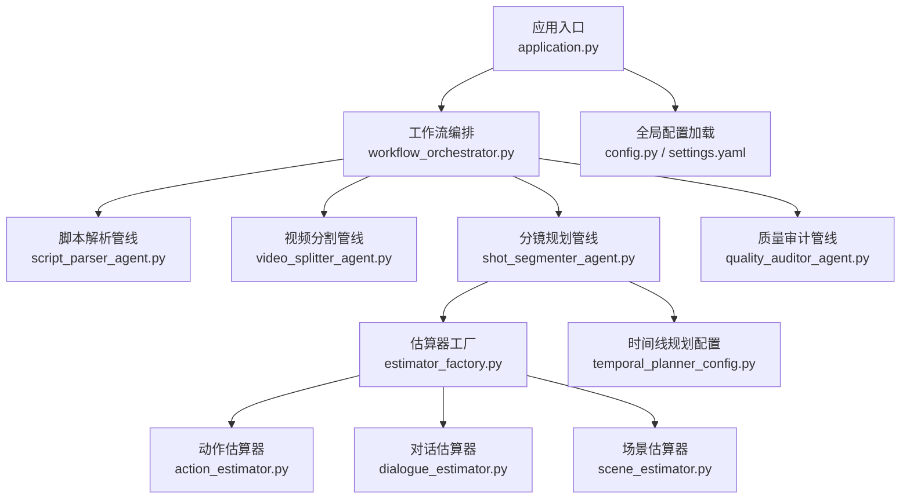
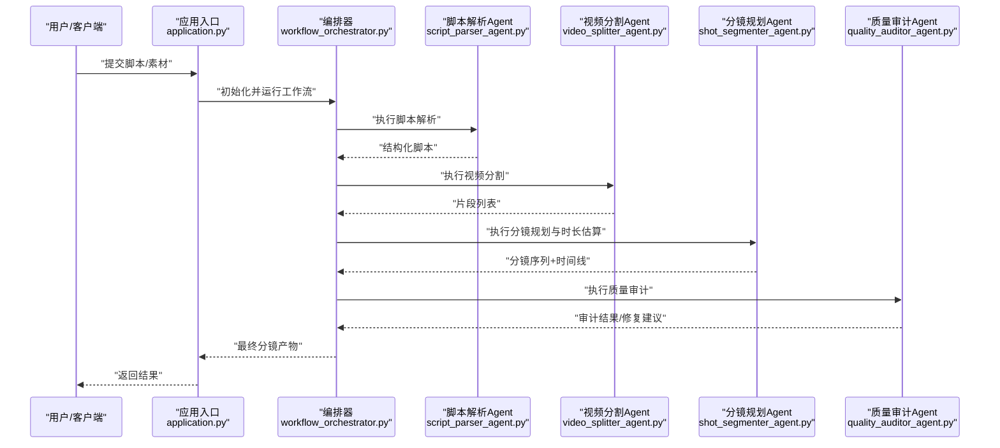
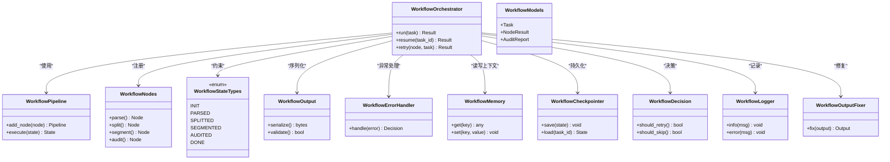
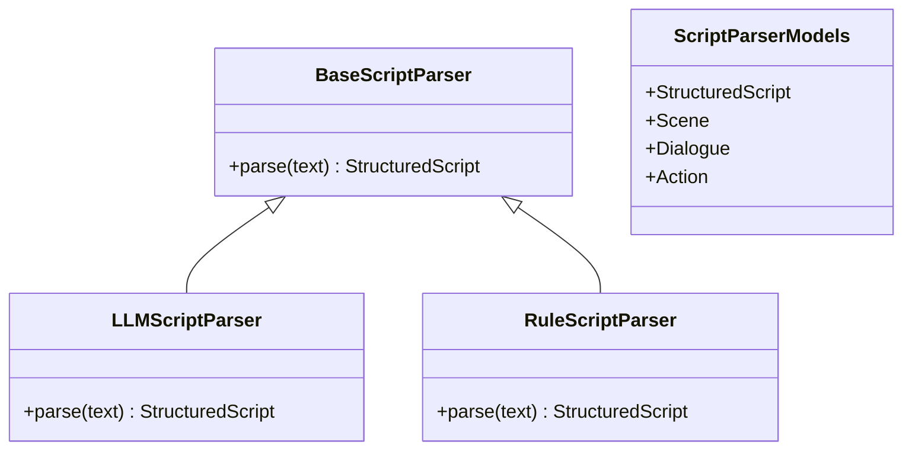
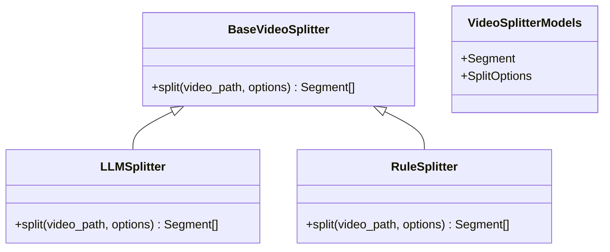
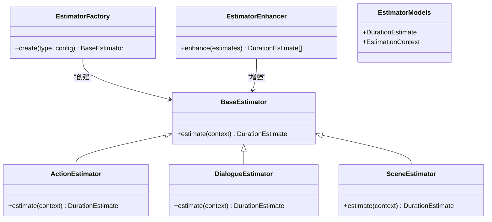
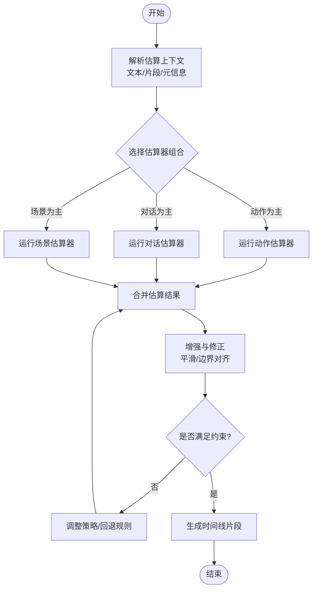
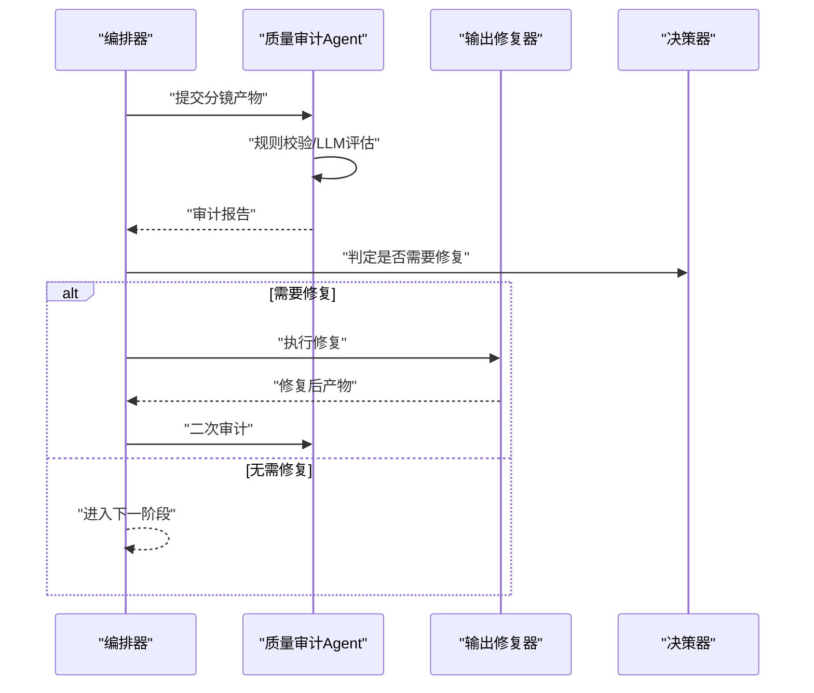
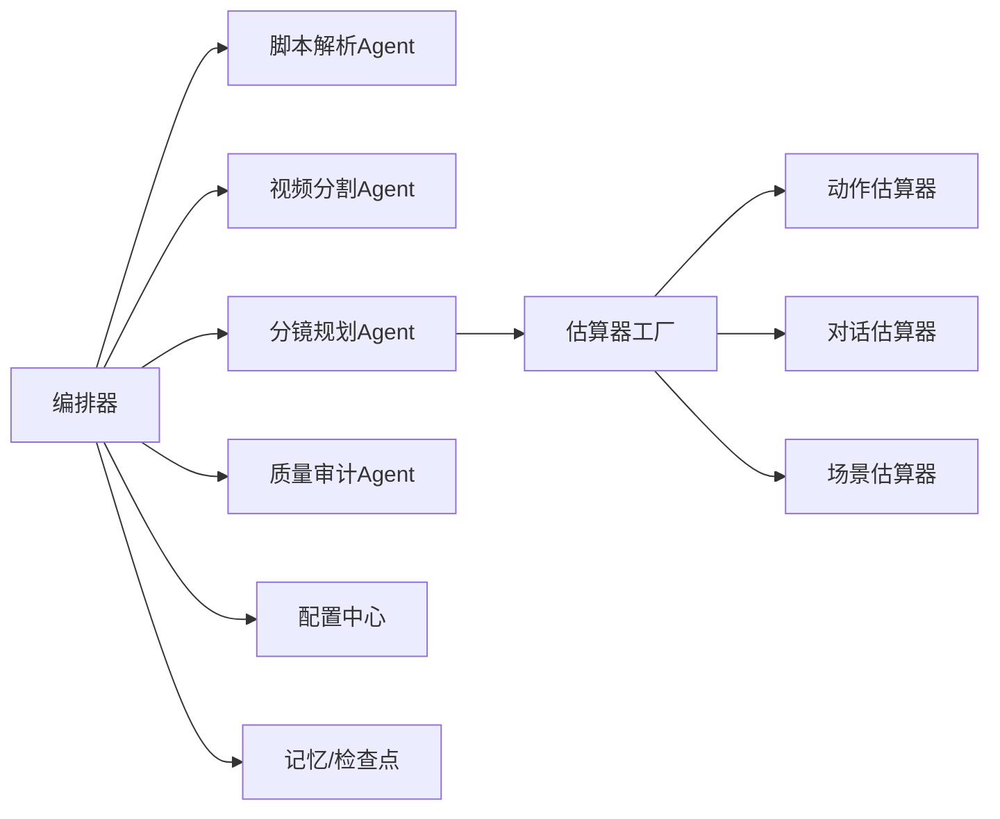

# 分镜生成系统

<cite>
**本文引用的文件**   
- [main.py](file://main.py)
- [README_zh.md](file://README_zh.md)
- [src/penshot/app/application.py](file://src/penshot/app/application.py)
- [src/penshot/config/config.py](file://src/penshot/config/config.py)
- [src/penshot/config/settings.yaml](file://src/penshot/config/settings.yaml)
- [src/penshot/shot_config.py](file://src/penshot/shot_config.py)
- [src/penshot/shot_context.py](file://src/penshot/shot_context.py)
- [src/penshot/agent/script_parser_agent.py](file://src/penshot/agent/script_parser_agent.py)
- [src/penshot/agent/video_splitter_agent.py](file://src/penshot/agent/video_splitter_agent.py)
- [src/penshot/agent/shot_segmenter_agent.py](file://src/penshot/agent/shot_segmenter_agent.py)
- [src/penshot/agent/quality_auditor_agent.py](file://src/penshot/agent/quality_auditor_agent.py)
- [src/penshot/agent/workflow/workflow_orchestrator.py](file://src/penshot/agent/workflow/workflow_orchestrator.py)
- [src/penshot/agent/workflow/workflow_pipeline.py](file://src/penshot/agent/workflow/workflow_pipeline.py)
- [src/penshot/agent/workflow/workflow_nodes.py](file://src/penshot/agent/workflow/workflow_nodes.py)
- [src/penshot/agent/workflow/workflow_state_types.py](file://src/penshot/agent/workflow/workflow_state_types.py)
- [src/penshot/agent/workflow/workflow_output.py](file://src/penshot/agent/workflow/workflow_output.py)
- [src/penshot/agent/workflow/workflow_error_handler.py](file://src/penshot/agent/workflow/workflow_error_handler.py)
- [src/penshot/agent/workflow/workflow_memory.py](file://src/penshot/agent/workflow/workflow_memory.py)
- [src/penshot/agent/workflow/workflow_checkpointer.py](file://src/penshot/agent/workflow/workflow_checkpointer.py)
- [src/penshot/agent/workflow/workflow_decision.py](file://src/penshot/agent/workflow/workflow_decision.py)
- [src/penshot/agent/workflow/workflow_logger.py](file://src/penshot/agent/workflow/workflow_logger.py)
- [src/penshot/agent/workflow/workflow_models.py](file://src/penshot/agent/workflow/workflow_models.py)
- [src/penshot/agent/workflow/workflow_output_fixer.py](file://src/penshot/agent/workflow/workflow_output_fixer.py)
- [src/penshot/agent/script_parser/base_script_parser.py](file://src/penshot/agent/script_parser/base_script_parser.py)
- [src/penshot/agent/script_parser/llm_script_parser.py](file://src/penshot/agent/script_parser/llm_script_parser.py)
- [src/penshot/agent/script_parser/rule_script_parser.py](file://src/penshot/agent/script_parser/rule_script_parser.py)
- [src/penshot/agent/script_parser/script_parser_models.py](file://src/penshot/agent/script_parser/script_parser_models.py)
- [src/penshot/agent/video_splitter/base_video_splitter.py](file://src/penshot/agent/video_splitter/base_video_splitter.py)
- [src/penshot/agent/video_splitter/llm_video_splitter.py](file://src/penshot/agent/video_splitter/llm_video_splitter.py)
- [src/penshot/agent/video_splitter/rule_video_splitter.py](file://src/penshot/agent/video_splitter/rule_video_splitter.py)
- [src/penshot/agent/video_splitter/video_splitter_models.py](file://src/penshot/agent/video_splitter/video_splitter_models.py)
- [src/penshot/agent/shot_segmenter/base_shot_segmenter.py](file://src/penshot/agent/shot_segmenter/base_shot_segmenter.py)
- [src/penshot/agent/shot_segmenter/llm_shot_segmenter.py](file://src/penshot/agent/shot_segmenter/llm_shot_segmenter.py)
- [src/penshot/agent/shot_segmenter/rule_shot_segmenter.py](file://src/penshot/agent/shot_segmenter/rule_shot_segmenter.py)
- [src/penshot/agent/shot_segmenter/shot_segmenter_models.py](file://src/penshot/agent/shot_segmenter/shot_segmenter_models.py)
- [src/penshot/agent/shot_segmenter/estimator/base_estimator.py](file://src/penshot/agent/shot_segmenter/estimator/base_estimator.py)
- [src/penshot/agent/shot_segmenter/estimator/action_estimator.py](file://src/penshot/agent/shot_segmenter/estimator/action_estimator.py)
- [src/penshot/agent/shot_segmenter/estimator/dialogue_estimator.py](file://src/penshot/agent/shot_segmenter/estimator/dialogue_estimator.py)
- [src/penshot/agent/shot_segmenter/estimator/scene_estimator.py](file://src/penshot/agent/shot_segmenter/estimator/scene_estimator.py)
- [src/penshot/agent/shot_segmenter/estimator/estimator_factory.py](file://src/penshot/agent/shot_segmenter/estimator/estimator_factory.py)
- [src/penshot/agent/shot_segmenter/estimator/estimator_enhancer.py](file://src/penshot/agent/shot_segmenter/estimator/estimator_enhancer.py)
- [src/penshot/agent/shot_segmenter/estimator/estimator_models.py](file://src/penshot/agent/shot_segmenter/estimator/estimator_models.py)
- [src/penshot/config/action_duration_config.py](file://src/penshot/config/action_duration_config.py)
- [src/penshot/config/duration_estimator_config.yaml](file://src/penshot/config/duration_estimator_config.yaml)
- [src/penshot/config/action_duration_config.yaml](file://src/penshot/config/action_duration_config.yaml)
- [src/penshot/config/keyword_config.py](file://src/penshot/config/keyword_config.py)
- [src/penshot/config/script_parser_config.py](file://src/penshot/config/script_parser_config.py)
- [src/penshot/config/temporal_planner_config.py](file://src/penshot/config/temporal_planner_config.py)
- [src/penshot/tools/action_duration_tool.py](file://src/penshot/tools/action_duration_tool.py)
- [src/penshot/tools/script_assessor_tool.py](file://src/penshot/tools/script_assessor_tool.py)
- [src/penshot/tools/script_parser_tool.py](file://src/penshot/tools/script_parser_tool.py)
- [examples/json_demo/shot_segmenter_result.json](file://examples/json_demo/shot_segmenter_result.json)
- [examples/json_demo/video_splitter_result.json](file://examples/json_demo/video_splitter_result.json)
- [examples/json_demo/script_parser_result.json](file://examples/json_demo/script_parser_result.json)
- [examples/json_demo/quality_auditor_result.json](file://examples/json_demo/quality_auditor_result.json)
- [tests/planner/test_duration_estimator.py](file://tests/planner/test_duration_estimator.py)
- [tests/planner/test_hybrid_estimator.py](file://tests/planner/test_hybrid_estimator.py)
- [tests/planner/test_rule_action_estimator.py](file://tests/planner/test_rule_action_estimator.py)
- [tests/planner/test_rule_dialogue_estimator.py](file://tests/planner/test_rule_dialogue_estimator.py)
- [tests/planner/test_rule_scene_estimator.py](file://tests/planner/test_rule_scene_estimator.py)
- [tests/planner/test_temporal_planner.py](file://tests/planner/test_temporal_planner.py)
</cite>

## 目录
1. [简介](#简介)
2. [项目结构](#项目结构)
3. [核心组件](#核心组件)
4. [架构总览](#架构总览)
5. [详细组件分析](#详细组件分析)
6. [依赖关系分析](#依赖关系分析)
7. [性能与调优](#性能与调优)
8. [故障排查指南](#故障排查指南)
9. [结论](#结论)
10. [附录](#附录)

## 简介
本系统是一个AI驱动的分镜生成平台，围绕“脚本解析—视频分割—分镜规划—时长估算—质量审计”的流水线构建。其核心能力包括：
- 场景分析与结构化脚本抽取
- 基于规则与LLM的视频切分策略
- 多类型估算器（动作、对话、场景）协同进行时长估算
- 时间线规划与分镜序列生成
- 质量控制与可修复输出机制
- 可插拔的工作流编排与记忆/检查点支持

该系统强调可配置性、可扩展性与工程化落地，提供REST/MCP接口、示例数据与测试套件，便于集成到生产环境。

## 项目结构
仓库采用分层与按功能域组织相结合的结构：
- src/penshot：核心实现，包含应用入口、配置、Agent、工作流、工具、提示词模板等
- examples：示例与演示，含JSON样例与多种集成方式
- tests：单元测试、集成测试与基准测试
- docs：架构与设计文档
- scripts：CLI与运维脚本

图表来源
- [src/penshot/app/application.py](file://src/penshot/app/application.py)
- [src/penshot/agent/workflow/workflow_orchestrator.py](file://src/penshot/agent/workflow/workflow_orchestrator.py)
- [src/penshot/agent/script_parser_agent.py](file://src/penshot/agent/script_parser_agent.py)
- [src/penshot/agent/video_splitter_agent.py](file://src/penshot/agent/video_splitter_agent.py)
- [src/penshot/agent/shot_segmenter_agent.py](file://src/penshot/agent/shot_segmenter_agent.py)
- [src/penshot/agent/quality_auditor_agent.py](file://src/penshot/agent/quality_auditor_agent.py)
- [src/penshot/agent/shot_segmenter/estimator/estimator_factory.py](file://src/penshot/agent/shot_segmenter/estimator/estimator_factory.py)
- [src/penshot/agent/shot_segmenter/estimator/action_estimator.py](file://src/penshot/agent/shot_segmenter/estimator/action_estimator.py)
- [src/penshot/agent/shot_segmenter/estimator/dialogue_estimator.py](file://src/penshot/agent/shot_segmenter/estimator/dialogue_estimator.py)
- [src/penshot/agent/shot_segmenter/estimator/scene_estimator.py](file://src/penshot/agent/shot_segmenter/estimator/scene_estimator.py)
- [src/penshot/config/temporal_planner_config.py](file://src/penshot/config/temporal_planner_config.py)
- [src/penshot/config/config.py](file://src/penshot/config/config.py)
- [src/penshot/config/settings.yaml](file://src/penshot/config/settings.yaml)

章节来源
- [README_zh.md](file://README_zh.md)
- [src/penshot/app/application.py](file://src/penshot/app/application.py)
- [src/penshot/config/config.py](file://src/penshot/config/config.py)
- [src/penshot/config/settings.yaml](file://src/penshot/config/settings.yaml)

## 核心组件
- 应用与应用上下文
  - application.py负责启动与装配；shot_config.py与shot_context.py承载分镜任务的全局配置与运行时上下文。
- 工作流编排
  - workflow_orchestrator.py定义阶段顺序、决策分支与错误处理；pipeline/nodes/state/output/checkpointer/memory/logger等模块协作完成状态推进与持久化。
- Agent层
  - script_parser_agent.py、video_splitter_agent.py、shot_segmenter_agent.py、quality_auditor_agent.py分别封装对应阶段的调用逻辑与模型选择。
- 估算器体系
  - base_estimator.py为抽象基类；action/dialogue/scene_estimator.py为具体实现；estimator_factory.py根据配置动态创建；estimator_enhancer.py提供增强能力；estimator_models.py定义输入输出契约。
- 配置与知识
  - temporal_planner_config.py、duration_estimator_config.yaml、action_duration_config.yaml、keyword_config.py、script_parser_config.py等提供参数化控制。
- 工具层
  - action_duration_tool.py、script_assessor_tool.py、script_parser_tool.py为Agent提供外部能力。

章节来源
- [src/penshot/app/application.py](file://src/penshot/app/application.py)
- [src/penshot/shot_config.py](file://src/penshot/shot_config.py)
- [src/penshot/shot_context.py](file://src/penshot/shot_context.py)
- [src/penshot/agent/workflow/workflow_orchestrator.py](file://src/penshot/agent/workflow/workflow_orchestrator.py)
- [src/penshot/agent/workflow/workflow_pipeline.py](file://src/penshot/agent/workflow/workflow_pipeline.py)
- [src/penshot/agent/workflow/workflow_nodes.py](file://src/penshot/agent/workflow/workflow_nodes.py)
- [src/penshot/agent/workflow/workflow_state_types.py](file://src/penshot/agent/workflow/workflow_state_types.py)
- [src/penshot/agent/workflow/workflow_output.py](file://src/penshot/agent/workflow/workflow_output.py)
- [src/penshot/agent/workflow/workflow_error_handler.py](file://src/penshot/agent/workflow/workflow_error_handler.py)
- [src/penshot/agent/workflow/workflow_memory.py](file://src/penshot/agent/workflow/workflow_memory.py)
- [src/penshot/agent/workflow/workflow_checkpointer.py](file://src/penshot/agent/workflow/workflow_checkpointer.py)
- [src/penshot/agent/workflow/workflow_decision.py](file://src/penshot/agent/workflow/workflow_decision.py)
- [src/penshot/agent/workflow/workflow_logger.py](file://src/penshot/agent/workflow/workflow_logger.py)
- [src/penshot/agent/workflow/workflow_models.py](file://src/penshot/agent/workflow/workflow_models.py)
- [src/penshot/agent/workflow/workflow_output_fixer.py](file://src/penshot/agent/workflow/workflow_output_fixer.py)
- [src/penshot/agent/script_parser_agent.py](file://src/penshot/agent/script_parser_agent.py)
- [src/penshot/agent/video_splitter_agent.py](file://src/penshot/agent/video_splitter_agent.py)
- [src/penshot/agent/shot_segmenter_agent.py](file://src/penshot/agent/shot_segmenter_agent.py)
- [src/penshot/agent/quality_auditor_agent.py](file://src/penshot/agent/quality_auditor_agent.py)
- [src/penshot/agent/shot_segmenter/estimator/base_estimator.py](file://src/penshot/agent/shot_segmenter/estimator/base_estimator.py)
- [src/penshot/agent/shot_segmenter/estimator/action_estimator.py](file://src/penshot/agent/shot_segmenter/estimator/action_estimator.py)
- [src/penshot/agent/shot_segmenter/estimator/dialogue_estimator.py](file://src/penshot/agent/shot_segmenter/estimator/dialogue_estimator.py)
- [src/penshot/agent/shot_segmenter/estimator/scene_estimator.py](file://src/penshot/agent/shot_segmenter/estimator/scene_estimator.py)
- [src/penshot/agent/shot_segmenter/estimator/estimator_factory.py](file://src/penshot/agent/shot_segmenter/estimator/estimator_factory.py)
- [src/penshot/agent/shot_segmenter/estimator/estimator_enhancer.py](file://src/penshot/agent/shot_segmenter/estimator/estimator_enhancer.py)
- [src/penshot/agent/shot_segmenter/estimator/estimator_models.py](file://src/penshot/agent/shot_segmenter/estimator/estimator_models.py)
- [src/penshot/config/temporal_planner_config.py](file://src/penshot/config/temporal_planner_config.py)
- [src/penshot/config/duration_estimator_config.yaml](file://src/penshot/config/duration_estimator_config.yaml)
- [src/penshot/config/action_duration_config.yaml](file://src/penshot/config/action_duration_config.yaml)
- [src/penshot/config/keyword_config.py](file://src/penshot/config/keyword_config.py)
- [src/penshot/config/script_parser_config.py](file://src/penshot/config/script_parser_config.py)
- [src/penshot/tools/action_duration_tool.py](file://src/penshot/tools/action_duration_tool.py)
- [src/penshot/tools/script_assessor_tool.py](file://src/penshot/tools/script_assessor_tool.py)
- [src/penshot/tools/script_parser_tool.py](file://src/penshot/tools/script_parser_tool.py)

## 架构总览
系统以“任务驱动+工作流编排”为核心，各Agent作为阶段节点，通过共享上下文传递中间产物，最终产出分镜序列与时间线。

图表来源
- [src/penshot/app/application.py](file://src/penshot/app/application.py)
- [src/penshot/agent/workflow/workflow_orchestrator.py](file://src/penshot/agent/workflow/workflow_orchestrator.py)
- [src/penshot/agent/script_parser_agent.py](file://src/penshot/agent/script_parser_agent.py)
- [src/penshot/agent/video_splitter_agent.py](file://src/penshot/agent/video_splitter_agent.py)
- [src/penshot/agent/shot_segmenter_agent.py](file://src/penshot/agent/shot_segmenter_agent.py)
- [src/penshot/agent/quality_auditor_agent.py](file://src/penshot/agent/quality_auditor_agent.py)

## 详细组件分析

### 工作流编排与状态机
- 编排器负责阶段调度、异常恢复、重试与回滚；节点定义每个阶段的输入/输出契约；状态类型约束流转；输出与修复器保证产物一致性；记忆与检查点支持断点续跑与可观测性。
- 关键职责
  - 阶段顺序与条件分支
  - 错误分类与降级策略
  - 中间态持久化与恢复
  - 日志与指标采集

图表来源
- [src/penshot/agent/workflow/workflow_orchestrator.py](file://src/penshot/agent/workflow/workflow_orchestrator.py)
- [src/penshot/agent/workflow/workflow_pipeline.py](file://src/penshot/agent/workflow/workflow_pipeline.py)
- [src/penshot/agent/workflow/workflow_nodes.py](file://src/penshot/agent/workflow/workflow_nodes.py)
- [src/penshot/agent/workflow/workflow_state_types.py](file://src/penshot/agent/workflow/workflow_state_types.py)
- [src/penshot/agent/workflow/workflow_output.py](file://src/penshot/agent/workflow/workflow_output.py)
- [src/penshot/agent/workflow/workflow_error_handler.py](file://src/penshot/agent/workflow/workflow_error_handler.py)
- [src/penshot/agent/workflow/workflow_memory.py](file://src/penshot/agent/workflow/workflow_memory.py)
- [src/penshot/agent/workflow/workflow_checkpointer.py](file://src/penshot/agent/workflow/workflow_checkpointer.py)
- [src/penshot/agent/workflow/workflow_decision.py](file://src/penshot/agent/workflow/workflow_decision.py)
- [src/penshot/agent/workflow/workflow_logger.py](file://src/penshot/agent/workflow/workflow_logger.py)
- [src/penshot/agent/workflow/workflow_models.py](file://src/penshot/agent/workflow/workflow_models.py)
- [src/penshot/agent/workflow/workflow_output_fixer.py](file://src/penshot/agent/workflow/workflow_output_fixer.py)

章节来源
- [src/penshot/agent/workflow/workflow_orchestrator.py](file://src/penshot/agent/workflow/workflow_orchestrator.py)
- [src/penshot/agent/workflow/workflow_pipeline.py](file://src/penshot/agent/workflow/workflow_pipeline.py)
- [src/penshot/agent/workflow/workflow_nodes.py](file://src/penshot/agent/workflow/workflow_nodes.py)
- [src/penshot/agent/workflow/workflow_state_types.py](file://src/penshot/agent/workflow/workflow_state_types.py)
- [src/penshot/agent/workflow/workflow_output.py](file://src/penshot/agent/workflow/workflow_output.py)
- [src/penshot/agent/workflow/workflow_error_handler.py](file://src/penshot/agent/workflow/workflow_error_handler.py)
- [src/penshot/agent/workflow/workflow_memory.py](file://src/penshot/agent/workflow/workflow_memory.py)
- [src/penshot/agent/workflow/workflow_checkpointer.py](file://src/penshot/agent/workflow/workflow_checkpointer.py)
- [src/penshot/agent/workflow/workflow_decision.py](file://src/penshot/agent/workflow/workflow_decision.py)
- [src/penshot/agent/workflow/workflow_logger.py](file://src/penshot/agent/workflow/workflow_logger.py)
- [src/penshot/agent/workflow/workflow_models.py](file://src/penshot/agent/workflow/workflow_models.py)
- [src/penshot/agent/workflow/workflow_output_fixer.py](file://src/penshot/agent/workflow/workflow_output_fixer.py)

### 脚本解析管线
- 目标：将自然语言或半结构化脚本转换为结构化元素（场景、角色、对白、动作等），供后续分割与规划使用。
- 实现要点
  - 抽象基类统一输入输出契约
  - LLM与规则两种实现并行可选
  - 配置项控制解析粒度与关键词库

图表来源
- [src/penshot/agent/script_parser/base_script_parser.py](file://src/penshot/agent/script_parser/base_script_parser.py)
- [src/penshot/agent/script_parser/llm_script_parser.py](file://src/penshot/agent/script_parser/llm_script_parser.py)
- [src/penshot/agent/script_parser/rule_script_parser.py](file://src/penshot/agent/script_parser/rule_script_parser.py)
- [src/penshot/agent/script_parser/script_parser_models.py](file://src/penshot/agent/script_parser/script_parser_models.py)

章节来源
- [src/penshot/agent/script_parser_agent.py](file://src/penshot/agent/script_parser_agent.py)
- [src/penshot/agent/script_parser/base_script_parser.py](file://src/penshot/agent/script_parser/base_script_parser.py)
- [src/penshot/agent/script_parser/llm_script_parser.py](file://src/penshot/agent/script_parser/llm_script_parser.py)
- [src/penshot/agent/script_parser/rule_script_parser.py](file://src/penshot/agent/script_parser/rule_script_parser.py)
- [src/penshot/agent/script_parser/script_parser_models.py](file://src/penshot/agent/script_parser/script_parser_models.py)
- [src/penshot/config/script_parser_config.py](file://src/penshot/config/script_parser_config.py)

### 视频分割管线
- 目标：依据内容语义与节奏对长视频进行切分，形成可独立处理的片段集合。
- 实现要点
  - 抽象基类定义切分接口
  - LLM与规则两种策略可切换
  - 输出片段携带起止时间与元信息

图表来源
- [src/penshot/agent/video_splitter/base_video_splitter.py](file://src/penshot/agent/video_splitter/base_video_splitter.py)
- [src/penshot/agent/video_splitter/llm_video_splitter.py](file://src/penshot/agent/video_splitter/llm_video_splitter.py)
- [src/penshot/agent/video_splitter/rule_video_splitter.py](file://src/penshot/agent/video_splitter/rule_video_splitter.py)
- [src/penshot/agent/video_splitter/video_splitter_models.py](file://src/penshot/agent/video_splitter/video_splitter_models.py)

章节来源
- [src/penshot/agent/video_splitter_agent.py](file://src/penshot/agent/video_splitter_agent.py)
- [src/penshot/agent/video_splitter/base_video_splitter.py](file://src/penshot/agent/video_splitter/base_video_splitter.py)
- [src/penshot/agent/video_splitter/llm_video_splitter.py](file://src/penshot/agent/video_splitter/llm_video_splitter.py)
- [src/penshot/agent/video_splitter/rule_video_splitter.py](file://src/penshot/agent/video_splitter/rule_video_splitter.py)
- [src/penshot/agent/video_splitter/video_splitter_models.py](file://src/penshot/agent/video_splitter/video_splitter_models.py)

### 分镜规划与时长估算
- 目标：在片段基础上生成镜头级分镜，并为每个分镜估算时长，形成时间线。
- 估算器家族
  - 动作估算器：识别动作密度与复杂度，映射为时长区间
  - 对话估算器：基于台词长度、语速与停顿模式估算
  - 场景估算器：考虑场景转换、空镜与转场需求
  - 工厂与增强：按配置选择估算器组合并进行后处理修正
- 时间线规划：结合各估算器输出，进行冲突消解与边界对齐，确保总时长与节奏合理

图表来源
- [src/penshot/agent/shot_segmenter/base_shot_segmenter.py](file://src/penshot/agent/shot_segmenter/base_shot_segmenter.py)
- [src/penshot/agent/shot_segmenter/llm_shot_segmenter.py](file://src/penshot/agent/shot_segmenter/llm_shot_segmenter.py)
- [src/penshot/agent/shot_segmenter/rule_shot_segmenter.py](file://src/penshot/agent/shot_segmenter/rule_shot_segmenter.py)
- [src/penshot/agent/shot_segmenter/shot_segmenter_models.py](file://src/penshot/agent/shot_segmenter/shot_segmenter_models.py)
- [src/penshot/agent/shot_segmenter/estimator/base_estimator.py](file://src/penshot/agent/shot_segmenter/estimator/base_estimator.py)
- [src/penshot/agent/shot_segmenter/estimator/action_estimator.py](file://src/penshot/agent/shot_segmenter/estimator/action_estimator.py)
- [src/penshot/agent/shot_segmenter/estimator/dialogue_estimator.py](file://src/penshot/agent/shot_segmenter/estimator/dialogue_estimator.py)
- [src/penshot/agent/shot_segmenter/estimator/scene_estimator.py](file://src/penshot/agent/shot_segmenter/estimator/scene_estimator.py)
- [src/penshot/agent/shot_segmenter/estimator/estimator_factory.py](file://src/penshot/agent/shot_segmenter/estimator/estimator_factory.py)
- [src/penshot/agent/shot_segmenter/estimator/estimator_enhancer.py](file://src/penshot/agent/shot_segmenter/estimator/estimator_enhancer.py)
- [src/penshot/agent/shot_segmenter/estimator/estimator_models.py](file://src/penshot/agent/shot_segmenter/estimator/estimator_models.py)

章节来源
- [src/penshot/agent/shot_segmenter_agent.py](file://src/penshot/agent/shot_segmenter_agent.py)
- [src/penshot/agent/shot_segmenter/base_shot_segmenter.py](file://src/penshot/agent/shot_segmenter/base_shot_segmenter.py)
- [src/penshot/agent/shot_segmenter/llm_shot_segmenter.py](file://src/penshot/agent/shot_segmenter/llm_shot_segmenter.py)
- [src/penshot/agent/shot_segmenter/rule_shot_segmenter.py](file://src/penshot/agent/shot_segmenter/rule_shot_segmenter.py)
- [src/penshot/agent/shot_segmenter/shot_segmenter_models.py](file://src/penshot/agent/shot_segmenter/shot_segmenter_models.py)
- [src/penshot/agent/shot_segmenter/estimator/base_estimator.py](file://src/penshot/agent/shot_segmenter/estimator/base_estimator.py)
- [src/penshot/agent/shot_segmenter/estimator/action_estimator.py](file://src/penshot/agent/shot_segmenter/estimator/action_estimator.py)
- [src/penshot/agent/shot_segmenter/estimator/dialogue_estimator.py](file://src/penshot/agent/shot_segmenter/estimator/dialogue_estimator.py)
- [src/penshot/agent/shot_segmenter/estimator/scene_estimator.py](file://src/penshot/agent/shot_segmenter/estimator/scene_estimator.py)
- [src/penshot/agent/shot_segmenter/estimator/estimator_factory.py](file://src/penshot/agent/shot_segmenter/estimator/estimator_factory.py)
- [src/penshot/agent/shot_segmenter/estimator/estimator_enhancer.py](file://src/penshot/agent/shot_segmenter/estimator/estimator_enhancer.py)
- [src/penshot/agent/shot_segmenter/estimator/estimator_models.py](file://src/penshot/agent/shot_segmenter/estimator/estimator_models.py)
- [src/penshot/config/temporal_planner_config.py](file://src/penshot/config/temporal_planner_config.py)
- [src/penshot/config/duration_estimator_config.yaml](file://src/penshot/config/duration_estimator_config.yaml)
- [src/penshot/config/action_duration_config.yaml](file://src/penshot/config/action_duration_config.yaml)
- [src/penshot/config/keyword_config.py](file://src/penshot/config/keyword_config.py)

#### 时长估算流程（算法视角）

图表来源
- [src/penshot/agent/shot_segmenter/estimator/estimator_factory.py](file://src/penshot/agent/shot_segmenter/estimator/estimator_factory.py)
- [src/penshot/agent/shot_segmenter/estimator/action_estimator.py](file://src/penshot/agent/shot_segmenter/estimator/action_estimator.py)
- [src/penshot/agent/shot_segmenter/estimator/dialogue_estimator.py](file://src/penshot/agent/shot_segmenter/estimator/dialogue_estimator.py)
- [src/penshot/agent/shot_segmenter/estimator/scene_estimator.py](file://src/penshot/agent/shot_segmenter/estimator/scene_estimator.py)
- [src/penshot/agent/shot_segmenter/estimator/estimator_enhancer.py](file://src/penshot/agent/shot_segmenter/estimator/estimator_enhancer.py)
- [src/penshot/config/duration_estimator_config.yaml](file://src/penshot/config/duration_estimator_config.yaml)

### 质量审计与修复
- 目标：对分镜产物进行一致性、完整性与可用性校验，必要时触发自动修复或人工干预。
- 机制
  - 规则审计与LLM审计双通道
  - 输出修复器对格式与字段进行补全/校正
  - 审计结果纳入工作流决策，决定是否重试或跳过

图表来源
- [src/penshot/agent/quality_auditor_agent.py](file://src/penshot/agent/quality_auditor_agent.py)
- [src/penshot/agent/workflow/workflow_output_fixer.py](file://src/penshot/agent/workflow/workflow_output_fixer.py)
- [src/penshot/agent/workflow/workflow_decision.py](file://src/penshot/agent/workflow/workflow_decision.py)

章节来源
- [src/penshot/agent/quality_auditor_agent.py](file://src/penshot/agent/quality_auditor_agent.py)
- [src/penshot/agent/workflow/workflow_output_fixer.py](file://src/penshot/agent/workflow/workflow_output_fixer.py)
- [src/penshot/agent/workflow/workflow_decision.py](file://src/penshot/agent/workflow/workflow_decision.py)

### 配置与参数化
- 全局配置
  - settings.yaml与config.py提供基础开关、路径与后端参数
- 领域配置
  - duration_estimator_config.yaml：估算器权重、阈值、平滑策略
  - action_duration_config.yaml：动作类别到时长的映射表
  - keyword_config.py：关键词库与匹配策略
  - script_parser_config.py：解析粒度、语言与模板选择
  - temporal_planner_config.py：时间线规划约束（最小/最大时长、过渡时长、节奏因子）
- 运行时上下文
  - shot_config.py与shot_context.py承载任务级配置与缓存键

章节来源
- [src/penshot/config/config.py](file://src/penshot/config/config.py)
- [src/penshot/config/settings.yaml](file://src/penshot/config/settings.yaml)
- [src/penshot/config/duration_estimator_config.yaml](file://src/penshot/config/duration_estimator_config.yaml)
- [src/penshot/config/action_duration_config.yaml](file://src/penshot/config/action_duration_config.yaml)
- [src/penshot/config/keyword_config.py](file://src/penshot/config/keyword_config.py)
- [src/penshot/config/script_parser_config.py](file://src/penshot/config/script_parser_config.py)
- [src/penshot/config/temporal_planner_config.py](file://src/penshot/config/temporal_planner_config.py)
- [src/penshot/shot_config.py](file://src/penshot/shot_config.py)
- [src/penshot/shot_context.py](file://src/penshot/shot_context.py)

### 工具与外部能力
- action_duration_tool.py：提供动作时长查询与批量估算
- script_assessor_tool.py：脚本可读性/复杂度评估
- script_parser_tool.py：辅助解析与格式化

章节来源
- [src/penshot/tools/action_duration_tool.py](file://src/penshot/tools/action_duration_tool.py)
- [src/penshot/tools/script_assessor_tool.py](file://src/penshot/tools/script_assessor_tool.py)
- [src/penshot/tools/script_parser_tool.py](file://src/penshot/tools/script_parser_tool.py)

## 依赖关系分析
- 内部耦合
  - 工作流编排与各Agent强耦合，但通过统一的State/Model契约降低直接依赖
  - 估算器通过工厂与增强器解耦，便于替换与扩展
- 外部依赖
  - LLM客户端由上层注入，Agent仅依赖抽象接口
  - 配置与知识库通过配置中心与工具层访问

图表来源
- [src/penshot/agent/workflow/workflow_orchestrator.py](file://src/penshot/agent/workflow/workflow_orchestrator.py)
- [src/penshot/agent/script_parser_agent.py](file://src/penshot/agent/script_parser_agent.py)
- [src/penshot/agent/video_splitter_agent.py](file://src/penshot/agent/video_splitter_agent.py)
- [src/penshot/agent/shot_segmenter_agent.py](file://src/penshot/agent/shot_segmenter_agent.py)
- [src/penshot/agent/quality_auditor_agent.py](file://src/penshot/agent/quality_auditor_agent.py)
- [src/penshot/agent/shot_segmenter/estimator/estimator_factory.py](file://src/penshot/agent/shot_segmenter/estimator/estimator_factory.py)
- [src/penshot/agent/shot_segmenter/estimator/action_estimator.py](file://src/penshot/agent/shot_segmenter/estimator/action_estimator.py)
- [src/penshot/agent/shot_segmenter/estimator/dialogue_estimator.py](file://src/penshot/agent/shot_segmenter/estimator/dialogue_estimator.py)
- [src/penshot/agent/shot_segmenter/estimator/scene_estimator.py](file://src/penshot/agent/shot_segmenter/estimator/scene_estimator.py)
- [src/penshot/config/config.py](file://src/penshot/config/config.py)
- [src/penshot/agent/workflow/workflow_memory.py](file://src/penshot/agent/workflow/workflow_memory.py)
- [src/penshot/agent/workflow/workflow_checkpointer.py](file://src/penshot/agent/workflow/workflow_checkpointer.py)

## 性能与调优
- 估算器策略
  - 针对对话密集型内容提高对话估算器权重；动作密集型提升动作估算器权重；场景切换频繁时启用场景估算器补偿
  - 使用增强器进行边界平滑与冲突消解，减少时间线抖动
- 配置调优
  - 在duration_estimator_config.yaml中调节权重与阈值；在action_duration_config.yaml中细化动作类别映射
  - 在temporal_planner_config.py中设置最小/最大时长、过渡时长与节奏因子，平衡叙事节奏与剪辑可行性
- 资源与并发
  - 利用工作流记忆与检查点实现断点续跑，避免重复计算
  - 对LLM调用增加缓存与限流，结合规则估算器做降级
- 监控与回归
  - 通过日志与审计结果建立回归基线，持续优化参数

[本节为通用指导，不直接分析具体文件]

## 故障排查指南
- 常见问题定位
  - 解析失败：检查脚本解析配置与关键词库；查看审计报告中字段缺失情况
  - 分割不合理：调整分割策略与阈值；对比规则与LLM实现差异
  - 时长偏差大：核对动作/对话/场景估算器权重与映射表；启用增强器进行修正
  - 时间线冲突：调整规划约束与过渡时长；检查边界对齐逻辑
- 诊断手段
  - 启用工作流日志与检查点，定位失败节点
  - 使用示例JSON产物对比期望结构，快速发现差异
  - 借助测试用例复现实例，逐步缩小范围

章节来源
- [src/penshot/agent/workflow/workflow_logger.py](file://src/penshot/agent/workflow/workflow_logger.py)
- [src/penshot/agent/workflow/workflow_checkpointer.py](file://src/penshot/agent/workflow/workflow_checkpointer.py)
- [examples/json_demo/shot_segmenter_result.json](file://examples/json_demo/shot_segmenter_result.json)
- [examples/json_demo/video_splitter_result.json](file://examples/json_demo/video_splitter_result.json)
- [examples/json_demo/script_parser_result.json](file://examples/json_demo/script_parser_result.json)
- [examples/json_demo/quality_auditor_result.json](file://examples/json_demo/quality_auditor_result.json)

## 结论
本系统通过“解析—分割—规划—估算—审计”的闭环，实现了从脚本到分镜的自动化生成。其模块化设计使估算器与工作流具备高度可插拔性，配合丰富的配置与工具链，能够适配不同风格与节奏的视频内容。建议在工程中优先完善配置治理与回归测试，持续提升稳定性与效果。

[本节为总结性内容，不直接分析具体文件]

## 附录
- 示例产物参考
  - 分镜规划结果：[shot_segmenter_result.json](file://examples/json_demo/shot_segmenter_result.json)
  - 视频分割结果：[video_splitter_result.json](file://examples/json_demo/video_splitter_result.json)
  - 脚本解析结果：[script_parser_result.json](file://examples/json_demo/script_parser_result.json)
  - 质量审计结果：[quality_auditor_result.json](file://examples/json_demo/quality_auditor_result.json)
- 测试与验证
  - 时长估算器测试：[test_duration_estimator.py](file://tests/planner/test_duration_estimator.py)
  - 混合估算器测试：[test_hybrid_estimator.py](file://tests/planner/test_hybrid_estimator.py)
  - 规则估算器测试（动作/对话/场景）：[test_rule_action_estimator.py](file://tests/planner/test_rule_action_estimator.py)、[test_rule_dialogue_estimator.py](file://tests/planner/test_rule_dialogue_estimator.py)、[test_rule_scene_estimator.py](file://tests/planner/test_rule_scene_estimator.py)
  - 时间线规划测试：[test_temporal_planner.py](file://tests/planner/test_temporal_planner.py)