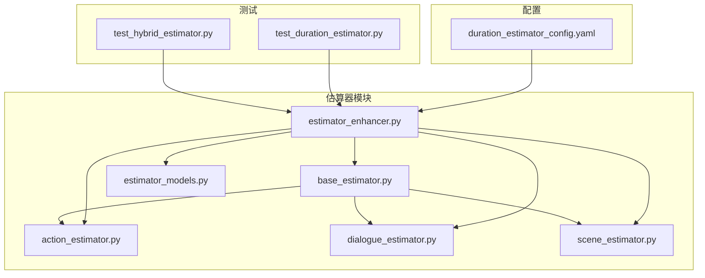
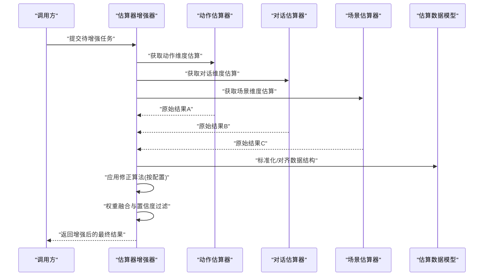
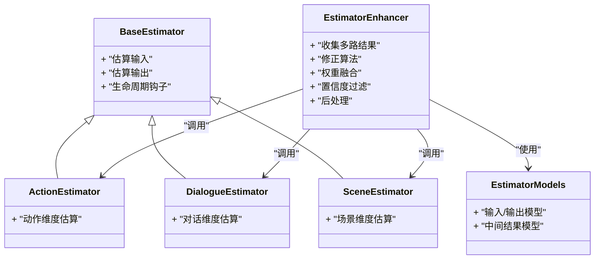
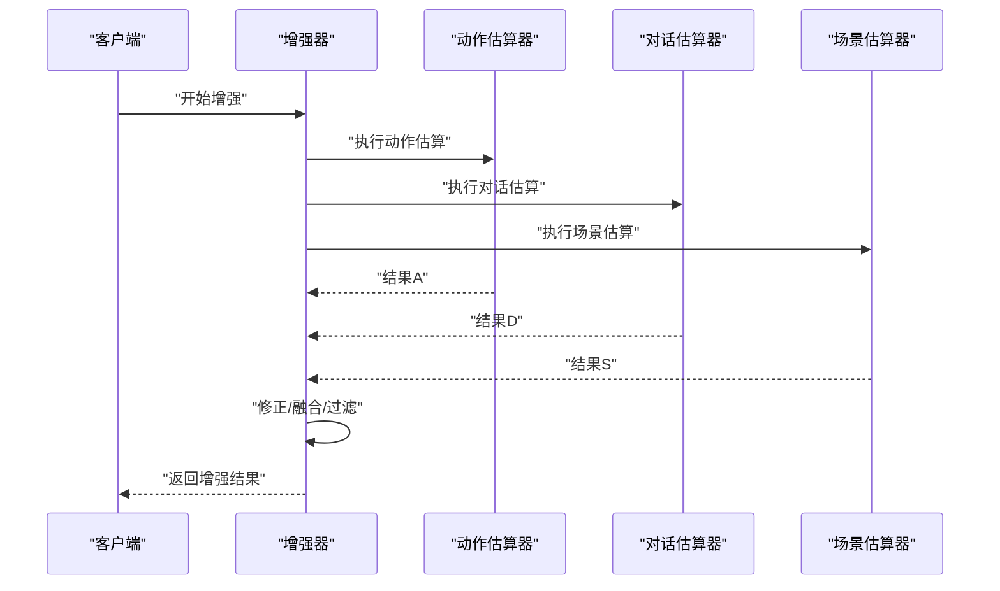
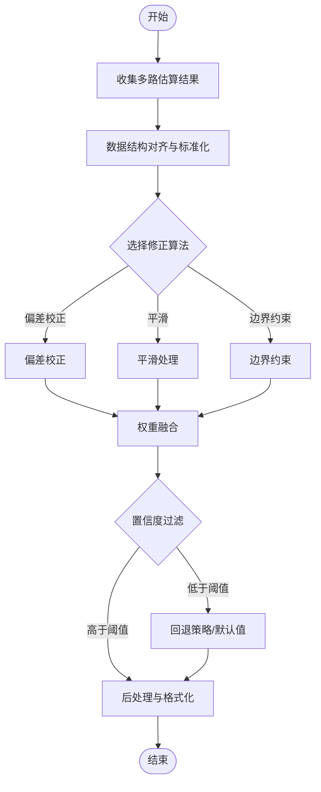
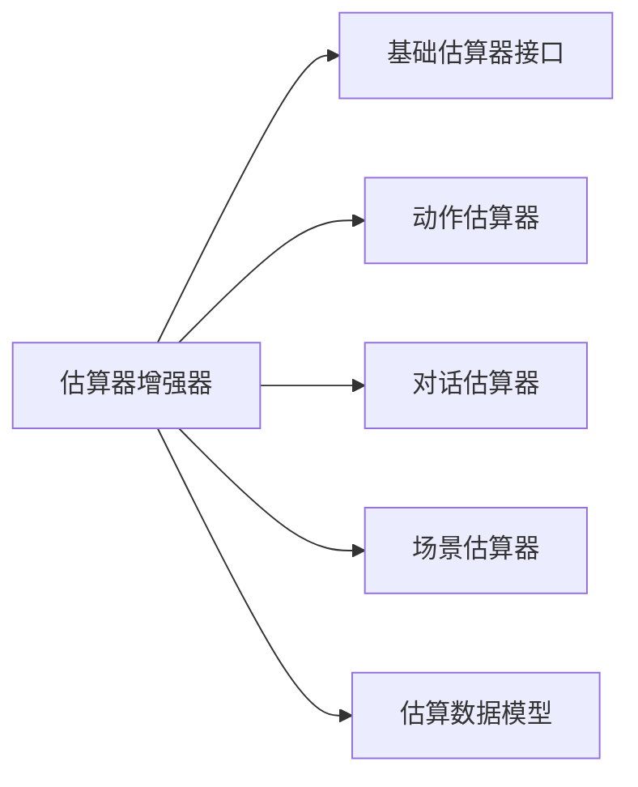

# 估算器增强器

<cite>
**本文引用的文件**   
- [estimator_enhancer.py](file://src/penshot/neopen/agent/shot_segmenter/estimator/estimator_enhancer.py)
- [base_estimator.py](file://src/penshot/neopen/agent/shot_segmenter/estimator/base_estimator.py)
- [action_estimator.py](file://src/penshot/neopen/agent/shot_segmenter/estimator/action_estimator.py)
- [dialogue_estimator.py](file://src/penshot/neopen/agent/shot_segmenter/estimator/dialogue_estimator.py)
- [scene_estimator.py](file://src/penshot/neopen/agent/shot_segmenter/estimator/scene_estimator.py)
- [estimator_models.py](file://src/penshot/neopen/agent/shot_segmenter/estimator/estimator_models.py)
- [duration_estimator_config.yaml](file://src/penshot/neopen/config/zh/duration_estimator_config.yaml)
- [test_hybrid_estimator.py](file://tests/planner/test_hybrid_estimator.py)
- [test_duration_estimator.py](file://tests/planner/test_duration_estimator.py)
</cite>

## 目录
1. [简介](#简介)
2. [项目结构](#项目结构)
3. [核心组件](#核心组件)
4. [架构总览](#架构总览)
5. [详细组件分析](#详细组件分析)
6. [依赖关系分析](#依赖关系分析)
7. [性能考量](#性能考量)
8. [故障排查指南](#故障排查指南)
9. [结论](#结论)
10. [附录](#附录)

## 简介
本文件围绕“估算器增强器”进行系统化文档化，聚焦于估算结果的修正、优化与后处理逻辑。内容涵盖：
- 增强机制的设计与实现要点
- 配置项说明（修正算法、权重调整、置信度阈值）
- 不同增强策略的应用场景与效果评估方法
- 自定义增强器的开发与集成方式
- 实际项目中的应用案例与性能优化建议

## 项目结构
估算器增强相关代码位于 shot_segmenter/estimator 子模块中，包含基础抽象、具体估算器以及增强器编排与后处理逻辑；同时提供配置与测试用例以验证增强行为。

图表来源
- [estimator_enhancer.py](file://src/penshot/neopen/agent/shot_segmenter/estimator/estimator_enhancer.py)
- [base_estimator.py](file://src/penshot/neopen/agent/shot_segmenter/estimator/base_estimator.py)
- [action_estimator.py](file://src/penshot/neopen/agent/shot_segmenter/estimator/action_estimator.py)
- [dialogue_estimator.py](file://src/penshot/neopen/agent/shot_segmenter/estimator/dialogue_estimator.py)
- [scene_estimator.py](file://src/penshot/neopen/agent/shot_segmenter/estimator/scene_estimator.py)
- [estimator_models.py](file://src/penshot/neopen/agent/shot_segmenter/estimator/estimator_models.py)
- [duration_estimator_config.yaml](file://src/penshot/neopen/config/zh/duration_estimator_config.yaml)
- [test_hybrid_estimator.py](file://tests/planner/test_hybrid_estimator.py)
- [test_duration_estimator.py](file://tests/planner/test_duration_estimator.py)

章节来源
- [estimator_enhancer.py](file://src/penshot/neopen/agent/shot_segmenter/estimator/estimator_enhancer.py)
- [base_estimator.py](file://src/penshot/neopen/agent/shot_segmenter/estimator/base_estimator.py)
- [action_estimator.py](file://src/penshot/neopen/agent/shot_segmenter/estimator/action_estimator.py)
- [dialogue_estimator.py](file://src/penshot/neopen/agent/shot_segmenter/estimator/dialogue_estimator.py)
- [scene_estimator.py](file://src/penshot/neopen/agent/shot_segmenter/estimator/scene_estimator.py)
- [estimator_models.py](file://src/penshot/neopen/agent/shot_segmenter/estimator/estimator_models.py)
- [duration_estimator_config.yaml](file://src/penshot/neopen/config/zh/duration_estimator_config.yaml)
- [test_hybrid_estimator.py](file://tests/planner/test_hybrid_estimator.py)
- [test_duration_estimator.py](file://tests/planner/test_duration_estimator.py)

## 核心组件
- 基础估算器接口：定义统一的估算输入输出契约与生命周期钩子，便于增强器统一接入。
- 具体估算器：动作、对话、场景三类估算器分别负责不同维度的时长或片段估计。
- 估算器增强器：对多路估算结果进行融合、修正与后处理，支持可配置的修正算法、权重与置信度阈值。
- 数据模型：封装估算输入、中间结果与最终输出的结构化类型，确保增强前后数据一致性。
- 配置文件：集中管理增强策略参数（如修正算法、权重、阈值等）。

章节来源
- [base_estimator.py](file://src/penshot/neopen/agent/shot_segmenter/estimator/base_estimator.py)
- [action_estimator.py](file://src/penshot/neopen/agent/shot_segmenter/estimator/action_estimator.py)
- [dialogue_estimator.py](file://src/penshot/neopen/agent/shot_segmenter/estimator/dialogue_estimator.py)
- [scene_estimator.py](file://src/penshot/neopen/agent/shot_segmenter/estimator/scene_estimator.py)
- [estimator_models.py](file://src/penshot/neopen/agent/shot_segmenter/estimator/estimator_models.py)
- [estimator_enhancer.py](file://src/penshot/neopen/agent/shot_segmenter/estimator/estimator_enhancer.py)
- [duration_estimator_config.yaml](file://src/penshot/neopen/config/zh/duration_estimator_config.yaml)

## 架构总览
增强器作为“结果融合与后处理”层，位于各具体估算器之上，接收来自多个估算器的原始结果，依据配置执行修正与加权融合，并输出经过校验与标准化的最终结果。

图表来源
- [estimator_enhancer.py](file://src/penshot/neopen/agent/shot_segmenter/estimator/estimator_enhancer.py)
- [action_estimator.py](file://src/penshot/neopen/agent/shot_segmenter/estimator/action_estimator.py)
- [dialogue_estimator.py](file://src/penshot/neopen/agent/shot_segmenter/estimator/dialogue_estimator.py)
- [scene_estimator.py](file://src/penshot/neopen/agent/shot_segmenter/estimator/scene_estimator.py)
- [estimator_models.py](file://src/penshot/neopen/agent/shot_segmenter/estimator/estimator_models.py)

## 详细组件分析

### 增强器类图与职责
增强器通过组合多个具体估算器，并提供统一的增强入口。其内部通常包含：
- 结果收集与对齐：将不同估算器的输出统一到相同的数据结构中
- 修正策略：根据配置选择修正算法（如偏差校正、平滑、边界约束等）
- 权重融合：按策略对各维度结果进行加权合并
- 置信度过滤：基于阈值剔除低置信度片段或回退到默认策略
- 后处理：规范化输出格式、时间戳对齐、冲突消解

图表来源
- [base_estimator.py](file://src/penshot/neopen/agent/shot_segmenter/estimator/base_estimator.py)
- [action_estimator.py](file://src/penshot/neopen/agent/shot_segmenter/estimator/action_estimator.py)
- [dialogue_estimator.py](file://src/penshot/neopen/agent/shot_segmenter/estimator/dialogue_estimator.py)
- [scene_estimator.py](file://src/penshot/neopen/agent/shot_segmenter/estimator/scene_estimator.py)
- [estimator_enhancer.py](file://src/penshot/neopen/agent/shot_segmenter/estimator/estimator_enhancer.py)
- [estimator_models.py](file://src/penshot/neopen/agent/shot_segmenter/estimator/estimator_models.py)

章节来源
- [base_estimator.py](file://src/penshot/neopen/agent/shot_segmenter/estimator/base_estimator.py)
- [action_estimator.py](file://src/penshot/neopen/agent/shot_segmenter/estimator/action_estimator.py)
- [dialogue_estimator.py](file://src/penshot/neopen/agent/shot_segmenter/estimator/dialogue_estimator.py)
- [scene_estimator.py](file://src/penshot/neopen/agent/shot_segmenter/estimator/scene_estimator.py)
- [estimator_enhancer.py](file://src/penshot/neopen/agent/shot_segmenter/estimator/estimator_enhancer.py)
- [estimator_models.py](file://src/penshot/neopen/agent/shot_segmenter/estimator/estimator_models.py)

### 增强流程时序
增强器在接收到任务后，依次触发各估算器，随后进入修正与融合阶段，最后输出标准化结果。

图表来源
- [estimator_enhancer.py](file://src/penshot/neopen/agent/shot_segmenter/estimator/estimator_enhancer.py)
- [action_estimator.py](file://src/penshot/neopen/agent/shot_segmenter/estimator/action_estimator.py)
- [dialogue_estimator.py](file://src/penshot/neopen/agent/shot_segmenter/estimator/dialogue_estimator.py)
- [scene_estimator.py](file://src/penshot/neopen/agent/shot_segmenter/estimator/scene_estimator.py)

章节来源
- [estimator_enhancer.py](file://src/penshot/neopen/agent/shot_segmenter/estimator/estimator_enhancer.py)
- [action_estimator.py](file://src/penshot/neopen/agent/shot_segmenter/estimator/action_estimator.py)
- [dialogue_estimator.py](file://src/penshot/neopen/agent/shot_segmenter/estimator/dialogue_estimator.py)
- [scene_estimator.py](file://src/penshot/neopen/agent/shot_segmenter/estimator/scene_estimator.py)

### 关键处理流程图（修正与融合）
该流程图展示增强器内部的典型处理路径，包括数据对齐、修正算法选择、权重融合与置信度过滤。

图表来源
- [estimator_enhancer.py](file://src/penshot/neopen/agent/shot_segmenter/estimator/estimator_enhancer.py)
- [estimator_models.py](file://src/penshot/neopen/agent/shot_segmenter/estimator/estimator_models.py)

章节来源
- [estimator_enhancer.py](file://src/penshot/neopen/agent/shot_segmenter/estimator/estimator_enhancer.py)
- [estimator_models.py](file://src/penshot/neopen/agent/shot_segmenter/estimator/estimator_models.py)

### 配置选项说明
增强器支持通过配置文件控制以下关键选项：
- 修正算法：选择偏差校正、平滑或边界约束等策略
- 权重调整：为不同估算维度分配权重，影响融合结果
- 置信度阈值：用于过滤低置信度片段或触发回退策略
- 其他策略开关：如是否启用特定后处理步骤

章节来源
- [duration_estimator_config.yaml](file://src/penshot/neopen/config/zh/duration_estimator_config.yaml)

### 应用场景与效果评估
- 动作主导片段：当动作信息显著时，提高动作估算权重，配合偏差校正提升准确性
- 对话主导片段：对话密度高时，侧重对话估算，并使用平滑减少抖动
- 场景切换频繁：引入边界约束避免跨场景的误判，结合置信度阈值过滤不稳定片段
- 混合场景：采用动态权重与多策略组合，并通过离线评测集对比不同配置的效果

章节来源
- [test_hybrid_estimator.py](file://tests/planner/test_hybrid_estimator.py)
- [test_duration_estimator.py](file://tests/planner/test_duration_estimator.py)

### 自定义增强器开发指南
- 继承基础估算器接口：遵循统一的输入输出契约，确保增强器可无缝接入
- 实现估算逻辑：在子类中完成具体维度的估算计算
- 注册与装配：将新估算器注入增强器，并在配置中声明权重与策略
- 单元测试覆盖：为新估算器编写测试，验证其在不同场景下的表现
- 集成与回归：在端到端测试中验证增强器整体行为，确保不破坏既有功能

章节来源
- [base_estimator.py](file://src/penshot/neopen/agent/shot_segmenter/estimator/base_estimator.py)
- [estimator_enhancer.py](file://src/penshot/neopen/agent/shot_segmenter/estimator/estimator_enhancer.py)
- [test_hybrid_estimator.py](file://tests/planner/test_hybrid_estimator.py)
- [test_duration_estimator.py](file://tests/planner/test_duration_estimator.py)

## 依赖关系分析
增强器与各估算器之间存在明确的依赖关系：增强器依赖基础接口与具体估算器实现，并通过数据模型保证前后端一致性。

图表来源
- [estimator_enhancer.py](file://src/penshot/neopen/agent/shot_segmenter/estimator/estimator_enhancer.py)
- [base_estimator.py](file://src/penshot/neopen/agent/shot_segmenter/estimator/base_estimator.py)
- [action_estimator.py](file://src/penshot/neopen/agent/shot_segmenter/estimator/action_estimator.py)
- [dialogue_estimator.py](file://src/penshot/neopen/agent/shot_segmenter/estimator/dialogue_estimator.py)
- [scene_estimator.py](file://src/penshot/neopen/agent/shot_segmenter/estimator/scene_estimator.py)
- [estimator_models.py](file://src/penshot/neopen/agent/shot_segmenter/estimator/estimator_models.py)

章节来源
- [estimator_enhancer.py](file://src/penshot/neopen/agent/shot_segmenter/estimator/estimator_enhancer.py)
- [base_estimator.py](file://src/penshot/neopen/agent/shot_segmenter/estimator/base_estimator.py)
- [action_estimator.py](file://src/penshot/neopen/agent/shot_segmenter/estimator/action_estimator.py)
- [dialogue_estimator.py](file://src/penshot/neopen/agent/shot_segmenter/estimator/dialogue_estimator.py)
- [scene_estimator.py](file://src/penshot/neopen/agent/shot_segmenter/estimator/scene_estimator.py)
- [estimator_models.py](file://src/penshot/neopen/agent/shot_segmenter/estimator/estimator_models.py)

## 性能考量
- 并行调用：在安全前提下，对无状态的具体估算器进行并发调用以降低延迟
- 增量更新：对长序列任务采用滑动窗口与增量融合，避免全量重算
- 缓存策略：对稳定片段的结果进行缓存，减少重复计算
- 阈值调优：合理设置置信度阈值，平衡召回率与准确率
- 资源限制：对大样本任务实施批处理与内存上限保护

[本节为通用指导，无需列出具体文件来源]

## 故障排查指南
- 结果不一致：检查数据对齐与标准化步骤，确认各估算器输出结构一致
- 低置信度过多：降低置信度阈值或调整权重，观察回退策略是否生效
- 融合异常：核对修正算法选择与权重配置，必要时切换到更保守的策略
- 性能退化：启用并行与缓存，监控耗时热点，定位瓶颈环节
- 回归问题：运行端到端测试，确认新增或修改未破坏既有行为

章节来源
- [test_hybrid_estimator.py](file://tests/planner/test_hybrid_estimator.py)
- [test_duration_estimator.py](file://tests/planner/test_duration_estimator.py)

## 结论
估算器增强器通过统一的修正、融合与后处理流程，有效提升了多源估算结果的稳定性与准确性。合理的配置与策略选择是取得良好效果的关键。建议在真实业务场景中持续评估与迭代，结合离线评测与在线指标不断优化。

[本节为总结性内容，无需列出具体文件来源]

## 附录
- 术语表
  - 修正算法：对原始估算结果进行纠偏或平滑的处理方法
  - 权重融合：按策略对不同维度结果进行加权合并
  - 置信度阈值：用于过滤低质量结果的临界值
  - 回退策略：当置信度不足时采用的默认或保守方案
- 参考测试
  - 混合估算器测试：验证多策略组合效果
  - 时长估算器测试：验证单维度估算与增强后的差异

章节来源
- [test_hybrid_estimator.py](file://tests/planner/test_hybrid_estimator.py)
- [test_duration_estimator.py](file://tests/planner/test_duration_estimator.py)