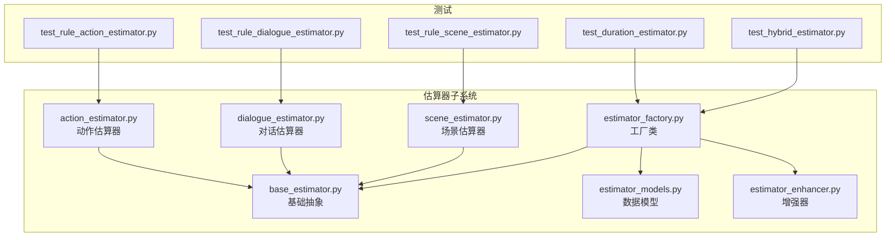
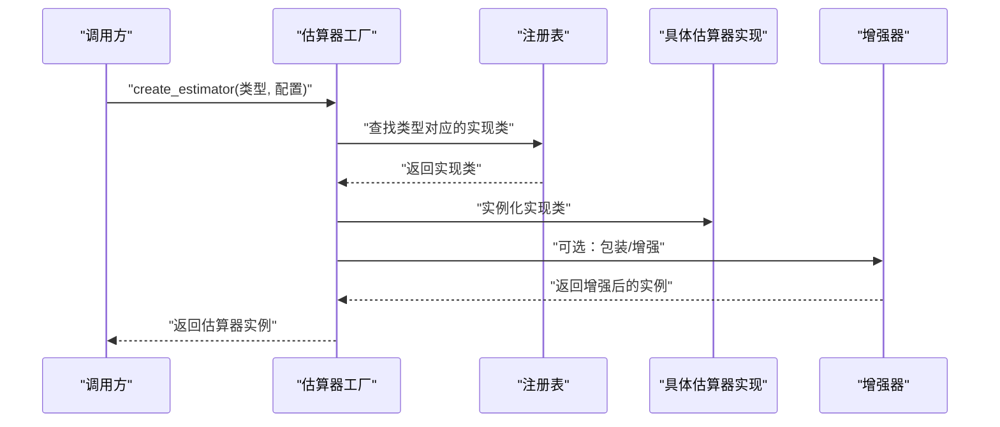
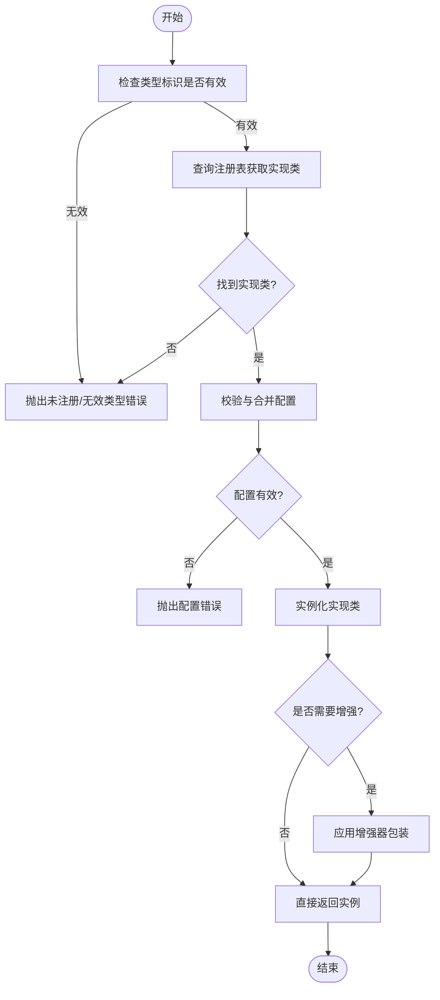
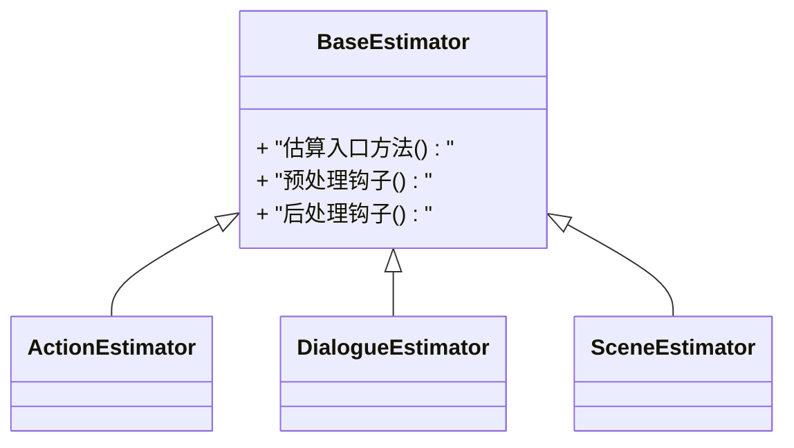
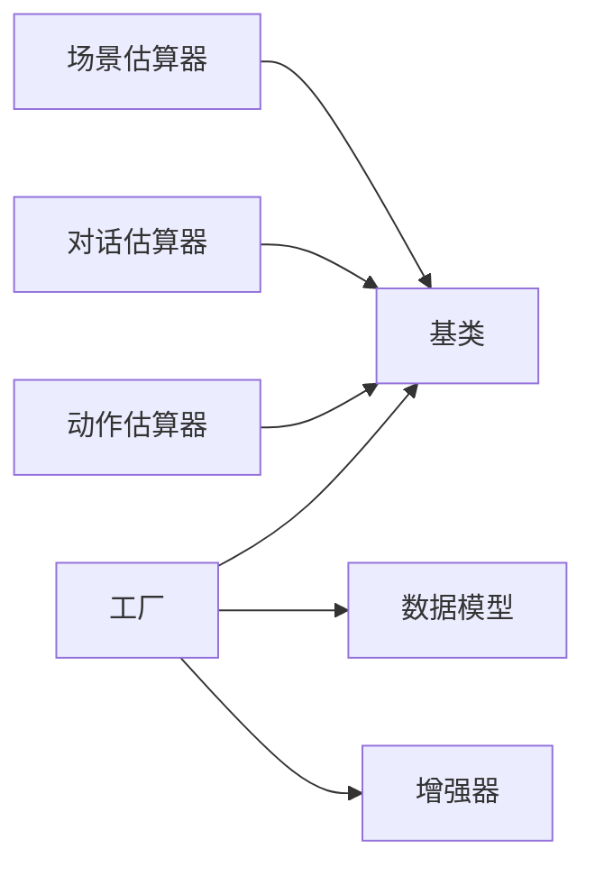

# 估算器工厂

<cite>
**本文引用的文件**   
- [src/penshot/neopen/agent/shot_segmenter/estimator/estimator_factory.py](file://src/penshot/neopen/agent/shot_segmenter/estimator/estimator_factory.py)
- [src/penshot/neopen/agent/shot_segmenter/estimator/base_estimator.py](file://src/penshot/neopen/agent/shot_segmenter/estimator/base_estimator.py)
- [src/penshot/neopen/agent/shot_segmenter/estimator/action_estimator.py](file://src/penshot/neopen/agent/shot_segmenter/estimator/action_estimator.py)
- [src/penshot/neopen/agent/shot_segmenter/estimator/dialogue_estimator.py](file://src/penshot/neopen/agent/shot_segmenter/estimator/dialogue_estimator.py)
- [src/penshot/neopen/agent/shot_segmenter/estimator/scene_estimator.py](file://src/penshot/neopen/agent/shot_segmenter/estimator/scene_estimator.py)
- [src/penshot/neopen/agent/shot_segmenter/estimator/estimator_models.py](file://src/penshot/neopen/agent/shot_segmenter/estimator/estimator_models.py)
- [src/penshot/neopen/agent/shot_segmenter/estimator/estimator_enhancer.py](file://src/penshot/neopen/agent/shot_segmenter/estimator/estimator_enhancer.py)
- [tests/planner/test_rule_action_estimator.py](file://tests/planner/test_rule_action_estimator.py)
- [tests/planner/test_rule_dialogue_estimator.py](file://tests/planner/test_rule_dialogue_estimator.py)
- [tests/planner/test_rule_scene_estimator.py](file://tests/planner/test_rule_scene_estimator.py)
- [tests/planner/test_duration_estimator.py](file://tests/planner/test_duration_estimator.py)
- [tests/planner/test_hybrid_estimator.py](file://tests/planner/test_hybrid_estimator.py)
</cite>

## 目录
1. [简介](#简介)
2. [项目结构](#项目结构)
3. [核心组件](#核心组件)
4. [架构总览](#架构总览)
5. [详细组件分析](#详细组件分析)
6. [依赖分析](#依赖分析)
7. [性能考虑](#性能考虑)
8. [故障排查指南](#故障排查指南)
9. [结论](#结论)
10. [附录](#附录)

## 简介
本文件围绕“估算器工厂”进行系统化文档化，聚焦于以下目标：
- 深入解析估算器工厂模式的设计与实现原理，包括动态创建、注册机制与配置管理。
- 详细说明工厂类的核心方法 create_estimator() 与 register_estimator() 的使用方式。
- 解释估算器的选择策略与优先级机制。
- 提供自定义估算器的注册方法与扩展指南。
- 结合测试用例总结最佳实践。

该模块位于视频分镜脚本处理链路中的“镜头分段器（Shot Segmenter）”子系统中，负责根据场景、动作、对话等维度对剧本片段进行时长或切分的估算。

## 项目结构
与估算器工厂相关的代码主要分布在 shot_segmenter/estimator 目录下，包含基础抽象、多种具体估算器实现、工厂类、模型定义以及增强器。测试集中在 tests/planner 下，覆盖规则型与混合估算器。

图表来源
- [src/penshot/neopen/agent/shot_segmenter/estimator/estimator_factory.py](file://src/penshot/neopen/agent/shot_segmenter/estimator/estimator_factory.py)
- [src/penshot/neopen/agent/shot_segmenter/estimator/base_estimator.py](file://src/penshot/neopen/agent/shot_segmenter/estimator/base_estimator.py)
- [src/penshot/neopen/agent/shot_segmenter/estimator/action_estimator.py](file://src/penshot/neopen/agent/shot_segmenter/estimator/action_estimator.py)
- [src/penshot/neopen/agent/shot_segmenter/estimator/dialogue_estimator.py](file://src/penshot/neopen/agent/shot_segmenter/estimator/dialogue_estimator.py)
- [src/penshot/neopen/agent/shot_segmenter/estimator/scene_estimator.py](file://src/penshot/neopen/agent/shot_segmenter/estimator/scene_estimator.py)
- [src/penshot/neopen/agent/shot_segmenter/estimator/estimator_models.py](file://src/penshot/neopen/agent/shot_segmenter/estimator/estimator_models.py)
- [src/penshot/neopen/agent/shot_segmenter/estimator/estimator_enhancer.py](file://src/penshot/neopen/agent/shot_segmenter/estimator/estimator_enhancer.py)
- [tests/planner/test_rule_action_estimator.py](file://tests/planner/test_rule_action_estimator.py)
- [tests/planner/test_rule_dialogue_estimator.py](file://tests/planner/test_rule_dialogue_estimator.py)
- [tests/planner/test_rule_scene_estimator.py](file://tests/planner/test_rule_scene_estimator.py)
- [tests/planner/test_duration_estimator.py](file://tests/planner/test_duration_estimator.py)
- [tests/planner/test_hybrid_estimator.py](file://tests/planner/test_hybrid_estimator.py)

章节来源
- [src/penshot/neopen/agent/shot_segmenter/estimator/estimator_factory.py](file://src/penshot/neopen/agent/shot_segmenter/estimator/estimator_factory.py)
- [src/penshot/neopen/agent/shot_segmenter/estimator/base_estimator.py](file://src/penshot/neopen/agent/shot_segmenter/estimator/base_estimator.py)
- [src/penshot/neopen/agent/shot_segmenter/estimator/estimator_models.py](file://src/penshot/neopen/agent/shot_segmenter/estimator/estimator_models.py)
- [src/penshot/neopen/agent/shot_segmenter/estimator/estimator_enhancer.py](file://src/penshot/neopen/agent/shot_segmenter/estimator/estimator_enhancer.py)
- [tests/planner/test_duration_estimator.py](file://tests/planner/test_duration_estimator.py)
- [tests/planner/test_hybrid_estimator.py](file://tests/planner/test_hybrid_estimator.py)

## 核心组件
- 基础抽象基类：定义所有估算器必须实现的接口与通用行为，确保工厂可统一创建与调用。
- 工厂类：维护估算器类型到实现的映射，提供动态创建与注册能力，并支持按名称或策略选择具体实现。
- 具体估算器：针对动作、对话、场景等不同维度的估算逻辑实现。
- 数据模型：封装估算输入输出结构，保证工厂与上层调用之间的契约稳定。
- 增强器：在估算前后提供横切能力（如日志、缓存、后处理）。

章节来源
- [src/penshot/neopen/agent/shot_segmenter/estimator/base_estimator.py](file://src/penshot/neopen/agent/shot_segmenter/estimator/base_estimator.py)
- [src/penshot/neopen/agent/shot_segmenter/estimator/estimator_factory.py](file://src/penshot/neopen/agent/shot_segmenter/estimator/estimator_factory.py)
- [src/penshot/neopen/agent/shot_segmenter/estimator/estimator_models.py](file://src/penshot/neopen/agent/shot_segmenter/estimator/estimator_models.py)
- [src/penshot/neopen/agent/shot_segmenter/estimator/estimator_enhancer.py](file://src/penshot/neopen/agent/shot_segmenter/estimator/estimator_enhancer.py)

## 架构总览
下图展示了估算器工厂的运行时交互：上层通过工厂请求创建指定类型的估算器实例；工厂依据注册表返回对应实现；增强器可在创建前后注入额外能力。

图表来源
- [src/penshot/neopen/agent/shot_segmenter/estimator/estimator_factory.py](file://src/penshot/neopen/agent/shot_segmenter/estimator/estimator_factory.py)
- [src/penshot/neopen/agent/shot_segmenter/estimator/estimator_enhancer.py](file://src/penshot/neopen/agent/shot_segmenter/estimator/estimator_enhancer.py)

## 详细组件分析

### 工厂类与注册机制
- 动态创建：通过 create_estimator() 接收类型标识与配置参数，从内部注册表中定位实现类并实例化。
- 注册机制：通过 register_estimator() 将新的实现类以键值形式注册到工厂，支持覆盖已有注册项。
- 选择策略与优先级：当存在多个候选实现时，工厂可按优先级顺序尝试匹配，优先返回高优先级实现；若未显式指定类型，则回退到默认实现。
- 配置管理：工厂在创建实例前可对配置进行校验与合并，确保实现所需参数完整可用。

图表来源
- [src/penshot/neopen/agent/shot_segmenter/estimator/estimator_factory.py](file://src/penshot/neopen/agent/shot_segmenter/estimator/estimator_factory.py)

章节来源
- [src/penshot/neopen/agent/shot_segmenter/estimator/estimator_factory.py](file://src/penshot/neopen/agent/shot_segmenter/estimator/estimator_factory.py)

### 基础抽象与多态
- 基类定义了统一的估算接口与生命周期钩子，确保不同估算器具备一致的调用方式。
- 子类通过继承基类实现特定估算逻辑，并在需要时重写增强点（如预处理、后处理）。

图表来源
- [src/penshot/neopen/agent/shot_segmenter/estimator/base_estimator.py](file://src/penshot/neopen/agent/shot_segmenter/estimator/base_estimator.py)
- [src/penshot/neopen/agent/shot_segmenter/estimator/action_estimator.py](file://src/penshot/neopen/agent/shot_segmenter/estimator/action_estimator.py)
- [src/penshot/neopen/agent/shot_segmenter/estimator/dialogue_estimator.py](file://src/penshot/neopen/agent/shot_segmenter/estimator/dialogue_estimator.py)
- [src/penshot/neopen/agent/shot_segmenter/estimator/scene_estimator.py](file://src/penshot/neopen/agent/shot_segmenter/estimator/scene_estimator.py)

章节来源
- [src/penshot/neopen/agent/shot_segmenter/estimator/base_estimator.py](file://src/penshot/neopen/agent/shot_segmenter/estimator/base_estimator.py)
- [src/penshot/neopen/agent/shot_segmenter/estimator/action_estimator.py](file://src/penshot/neopen/agent/shot_segmenter/estimator/action_estimator.py)
- [src/penshot/neopen/agent/shot_segmenter/estimator/dialogue_estimator.py](file://src/penshot/neopen/agent/shot_segmenter/estimator/dialogue_estimator.py)
- [src/penshot/neopen/agent/shot_segmenter/estimator/scene_estimator.py](file://src/penshot/neopen/agent/shot_segmenter/estimator/scene_estimator.py)

### 数据模型与增强器
- 数据模型：定义估算输入（如文本片段、上下文信息）与输出（如时长估计、切分建议），为工厂与上层提供稳定的数据结构契约。
- 增强器：在估算流程中提供横切能力，例如日志记录、指标收集、结果缓存、异常兜底等。

章节来源
- [src/penshot/neopen/agent/shot_segmenter/estimator/estimator_models.py](file://src/penshot/neopen/agent/shot_segmenter/estimator/estimator_models.py)
- [src/penshot/neopen/agent/shot_segmenter/estimator/estimator_enhancer.py](file://src/penshot/neopen/agent/shot_segmenter/estimator/estimator_enhancer.py)

### 使用示例与最佳实践
- 动态创建：通过工厂的 create_estimator() 传入类型标识与配置，获得可直接调用的估算器实例。
- 注册新实现：通过 register_estimator() 将自定义实现类注册到工厂，以便后续按类型创建。
- 选择策略：优先显式指定类型；若未指定，工厂按优先级回退到默认实现。
- 配置管理：在创建前校验必要字段，避免运行时缺失导致异常。
- 增强能力：按需启用增强器，提升可观测性与稳定性。

章节来源
- [src/penshot/neopen/agent/shot_segmenter/estimator/estimator_factory.py](file://src/penshot/neopen/agent/shot_segmenter/estimator/estimator_factory.py)
- [tests/planner/test_duration_estimator.py](file://tests/planner/test_duration_estimator.py)
- [tests/planner/test_hybrid_estimator.py](file://tests/planner/test_hybrid_estimator.py)

### 测试用例与验证
- 规则型估算器测试：分别覆盖动作、对话、场景三类规则估算器的基本路径与边界条件。
- 工厂与混合估算器测试：验证工厂的动态创建、注册覆盖、优先级选择与增强器集成。

章节来源
- [tests/planner/test_rule_action_estimator.py](file://tests/planner/test_rule_action_estimator.py)
- [tests/planner/test_rule_dialogue_estimator.py](file://tests/planner/test_rule_dialogue_estimator.py)
- [tests/planner/test_rule_scene_estimator.py](file://tests/planner/test_rule_scene_estimator.py)
- [tests/planner/test_duration_estimator.py](file://tests/planner/test_duration_estimator.py)
- [tests/planner/test_hybrid_estimator.py](file://tests/planner/test_hybrid_estimator.py)

## 依赖分析
- 内聚性：工厂仅关注创建与注册，不耦合具体估算逻辑，保持高内聚低耦合。
- 耦合关系：工厂依赖基类与数据模型；具体估算器依赖基类与模型；增强器作为可选依赖。
- 外部依赖：无强外部依赖，便于替换与扩展。

图表来源
- [src/penshot/neopen/agent/shot_segmenter/estimator/estimator_factory.py](file://src/penshot/neopen/agent/shot_segmenter/estimator/estimator_factory.py)
- [src/penshot/neopen/agent/shot_segmenter/estimator/base_estimator.py](file://src/penshot/neopen/agent/shot_segmenter/estimator/base_estimator.py)
- [src/penshot/neopen/agent/shot_segmenter/estimator/estimator_models.py](file://src/penshot/neopen/agent/shot_segmenter/estimator/estimator_models.py)
- [src/penshot/neopen/agent/shot_segmenter/estimator/estimator_enhancer.py](file://src/penshot/neopen/agent/shot_segmenter/estimator/estimator_enhancer.py)

章节来源
- [src/penshot/neopen/agent/shot_segmenter/estimator/estimator_factory.py](file://src/penshot/neopen/agent/shot_segmenter/estimator/estimator_factory.py)
- [src/penshot/neopen/agent/shot_segmenter/estimator/base_estimator.py](file://src/penshot/neopen/agent/shot_segmenter/estimator/base_estimator.py)
- [src/penshot/neopen/agent/shot_segmenter/estimator/estimator_models.py](file://src/penshot/neopen/agent/shot_segmenter/estimator/estimator_models.py)
- [src/penshot/neopen/agent/shot_segmenter/estimator/estimator_enhancer.py](file://src/penshot/neopen/agent/shot_segmenter/estimator/estimator_enhancer.py)

## 性能考虑
- 注册表查找应为 O(1) 或近似常数时间，避免在热点路径中进行线性扫描。
- 配置校验应在创建阶段完成，减少运行时分支判断开销。
- 增强器应轻量且可插拔，避免引入不必要的 I/O 或阻塞操作。
- 对于高频估算场景，可结合缓存策略降低重复计算成本。

[本节为通用指导，无需源码引用]

## 故障排查指南
- 未注册类型：当 create_estimator() 找不到对应实现时，检查 register_estimator() 是否正确调用，确认类型标识一致。
- 配置缺失：若报错提示缺少必要字段，核对传入配置的必填项与类型约束。
- 优先级冲突：当同一类型有多个实现注册时，确认优先级设置是否符合预期，必要时覆盖旧实现。
- 增强器异常：若启用增强器后出现异常，逐步禁用增强器定位问题源。

章节来源
- [src/penshot/neopen/agent/shot_segmenter/estimator/estimator_factory.py](file://src/penshot/neopen/agent/shot_segmenter/estimator/estimator_factory.py)
- [tests/planner/test_duration_estimator.py](file://tests/planner/test_duration_estimator.py)
- [tests/planner/test_hybrid_estimator.py](file://tests/planner/test_hybrid_estimator.py)

## 结论
估算器工厂通过清晰的抽象与注册机制，实现了估算器的动态创建与灵活扩展。配合数据模型与增强器，系统具备良好的可维护性与可扩展性。遵循本文的最佳实践与测试策略，可有效保障估算器链路的稳定性与性能。

[本节为总结性内容，无需源码引用]

## 附录
- 自定义估算器注册步骤：
  - 继承基类并实现估算接口。
  - 使用 register_estimator() 将新实现注册到工厂。
  - 在 create_estimator() 中通过类型标识创建实例。
- 常见配置项说明：
  - 类型标识：用于唯一标识估算器实现。
  - 优先级：控制多实现时的选择顺序。
  - 增强开关：决定是否启用增强器包装。

章节来源
- [src/penshot/neopen/agent/shot_segmenter/estimator/estimator_factory.py](file://src/penshot/neopen/agent/shot_segmenter/estimator/estimator_factory.py)
- [src/penshot/neopen/agent/shot_segmenter/estimator/base_estimator.py](file://src/penshot/neopen/agent/shot_segmenter/estimator/base_estimator.py)
- [tests/planner/test_rule_action_estimator.py](file://tests/planner/test_rule_action_estimator.py)
- [tests/planner/test_rule_dialogue_estimator.py](file://tests/planner/test_rule_dialogue_estimator.py)
- [tests/planner/test_rule_scene_estimator.py](file://tests/planner/test_rule_scene_estimator.py)