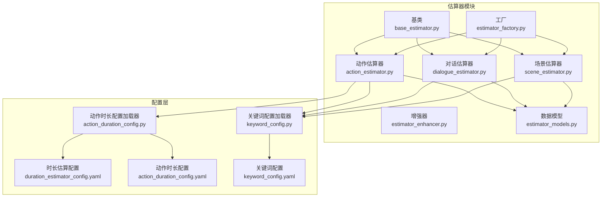
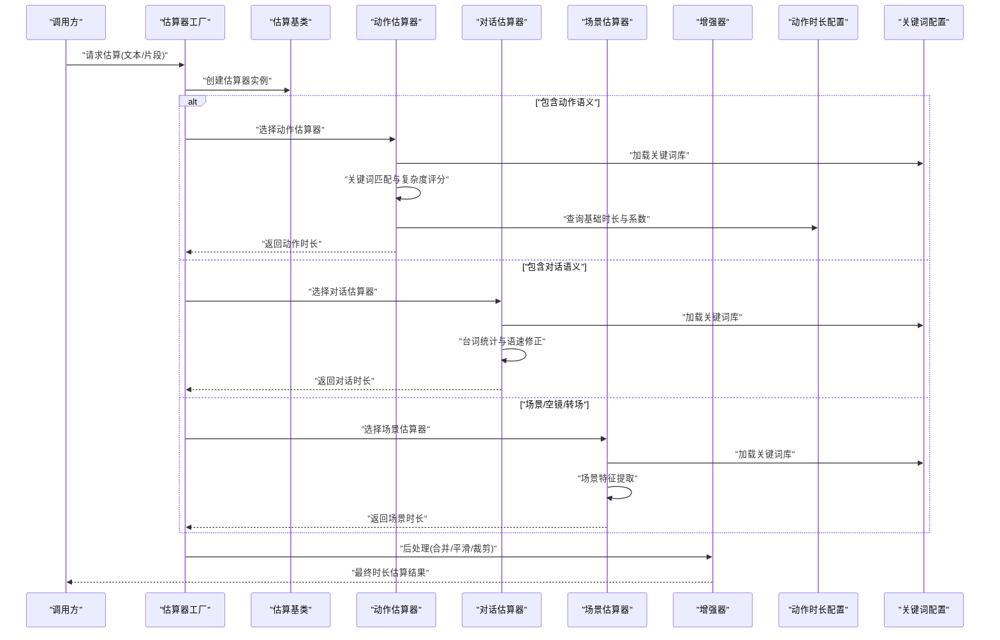
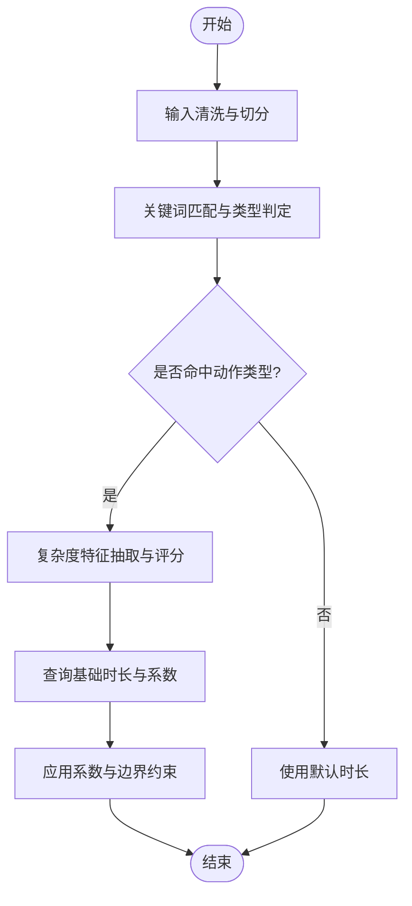
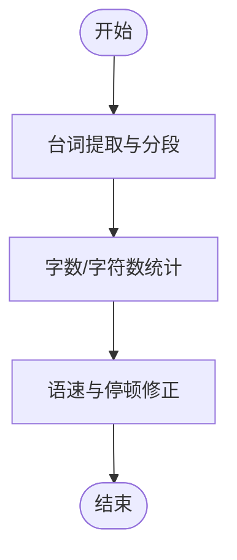
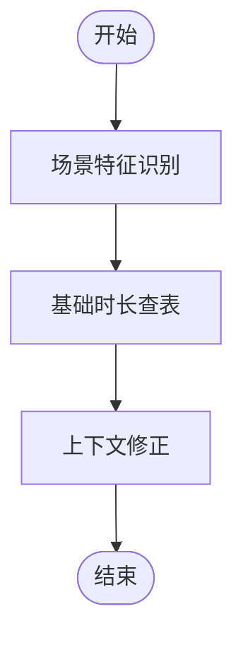
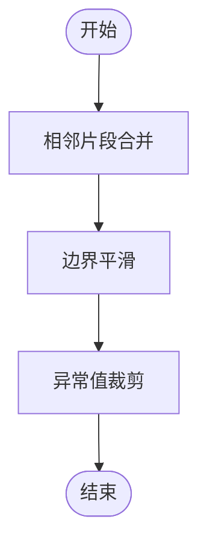
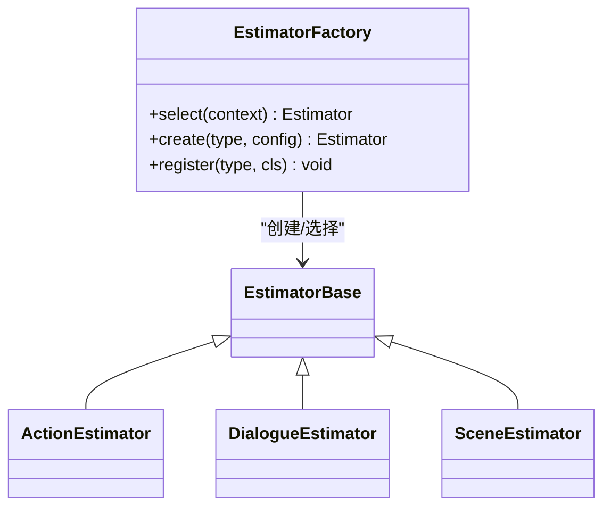
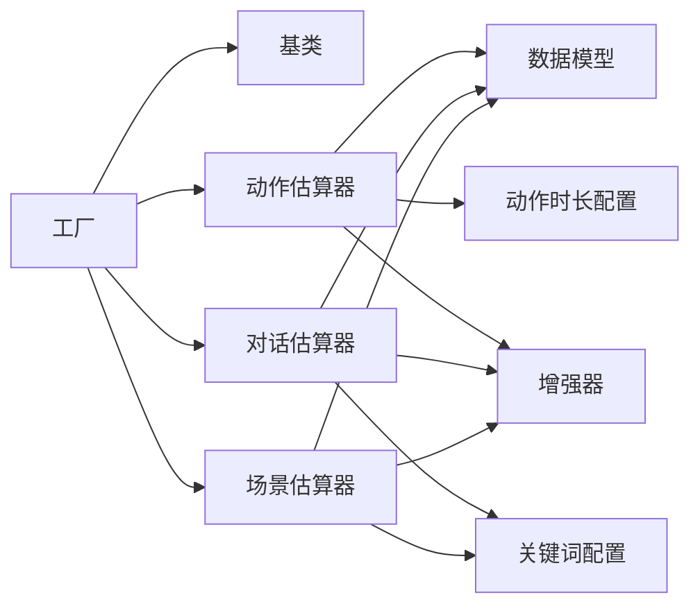

# 动作估算器

<cite>
**本文引用的文件**   
- [action_estimator.py](file://src/penshot/neopen/agent/shot_segmenter/estimator/action_estimator.py)
- [base_estimator.py](file://src/penshot/neopen/agent/shot_segmenter/estimator/base_estimator.py)
- [dialogue_estimator.py](file://src/penshot/neopen/agent/shot_segmenter/estimator/dialogue_estimator.py)
- [scene_estimator.py](file://src/penshot/neopen/agent/shot_segmenter/estimator/scene_estimator.py)
- [estimator_enhancer.py](file://src/penshot/neopen/agent/shot_segmenter/estimator/estimator_enhancer.py)
- [estimator_factory.py](file://src/penshot/neopen/agent/shot_segmenter/estimator/estimator_factory.py)
- [estimator_models.py](file://src/penshot/neopen/agent/shot_segmenter/estimator/estimator_models.py)
- [action_duration_config.py](file://src/penshot/neopen/config/action_duration_config.py)
- [keyword_config.py](file://src/penshot/neopen/config/keyword_config.py)
- [duration_estimator_config.yaml](file://src/penshot/neopen/config/zh/duration_estimator_config.yaml)
- [action_duration_config.yaml](file://src/penshot/neopen/config/zh/action_duration_config.yaml)
- [keyword_config.yaml](file://src/penshot/neopen/config/zh/keyword_config.yaml)
- [test_action_duration.py](file://tests/planner/test_action_duration.py)
- [test_rule_action_estimator.py](file://tests/planner/test_rule_action_estimator.py)
- [test_rule_dialogue_estimator.py](file://tests/planner/test_rule_dialogue_estimator.py)
- [test_rule_scene_estimator.py](file://tests/planner/test_rule_scene_estimator.py)
</cite>

## 目录
1. [简介](#简介)
2. [项目结构](#项目结构)
3. [核心组件](#核心组件)
4. [架构总览](#架构总览)
5. [详细组件分析](#详细组件分析)
6. [依赖关系分析](#依赖关系分析)
7. [性能考虑](#性能考虑)
8. [故障排查指南](#故障排查指南)
9. [结论](#结论)
10. [附录](#附录)

## 简介
本文件面向“基于动作描述的视频时长估算”能力，聚焦于动作估算器的算法与工程实现。内容覆盖：
- 动作类型识别（打斗、追逐、对话、场景等）
- 复杂度分析与时间计算逻辑
- 配置参数体系（关键词库、基础时长、复杂度系数等）
- 不同动作类型的估算规则与精度评估方法
- 调优建议与实际应用场景示例

该估算器以“规则为主、可配置化”为核心思想，通过关键词匹配与结构化规则对动作片段进行时长预估，便于在脚本解析、分镜规划、视频剪辑辅助等场景中快速落地。

## 项目结构
动作估算器位于镜头分割子系统的估算模块中，采用“基类抽象 + 多策略实现 + 工厂装配”的结构组织方式；同时配套独立的配置加载器与 YAML 配置文件，支持按语言与环境灵活调整。

图表来源
- [base_estimator.py](file://src/penshot/neopen/agent/shot_segmenter/estimator/base_estimator.py)
- [action_estimator.py](file://src/penshot/neopen/agent/shot_segmenter/estimator/action_estimator.py)
- [dialogue_estimator.py](file://src/penshot/neopen/agent/shot_segmenter/estimator/dialogue_estimator.py)
- [scene_estimator.py](file://src/penshot/neopen/agent/shot_segmenter/estimator/scene_estimator.py)
- [estimator_enhancer.py](file://src/penshot/neopen/agent/shot_segmenter/estimator/estimator_enhancer.py)
- [estimator_factory.py](file://src/penshot/neopen/agent/shot_segmenter/estimator/estimator_factory.py)
- [estimator_models.py](file://src/penshot/neopen/agent/shot_segmenter/estimator/estimator_models.py)
- [action_duration_config.py](file://src/penshot/neopen/config/action_duration_config.py)
- [keyword_config.py](file://src/penshot/neopen/config/keyword_config.py)
- [duration_estimator_config.yaml](file://src/penshot/neopen/config/zh/duration_estimator_config.yaml)
- [action_duration_config.yaml](file://src/penshot/neopen/config/zh/action_duration_config.yaml)
- [keyword_config.yaml](file://src/penshot/neopen/config/zh/keyword_config.yaml)

章节来源
- [action_estimator.py](file://src/penshot/neopen/agent/shot_segmenter/estimator/action_estimator.py)
- [base_estimator.py](file://src/penshot/neopen/agent/shot_segmenter/estimator/base_estimator.py)
- [dialogue_estimator.py](file://src/penshot/neopen/agent/shot_segmenter/estimator/dialogue_estimator.py)
- [scene_estimator.py](file://src/penshot/neopen/agent/shot_segmenter/estimator/scene_estimator.py)
- [estimator_enhancer.py](file://src/penshot/neopen/agent/shot_segmenter/estimator/estimator_enhancer.py)
- [estimator_factory.py](file://src/penshot/neopen/agent/shot_segmenter/estimator/estimator_factory.py)
- [estimator_models.py](file://src/penshot/neopen/agent/shot_segmenter/estimator/estimator_models.py)
- [action_duration_config.py](file://src/penshot/neopen/config/action_duration_config.py)
- [keyword_config.py](file://src/penshot/neopen/config/keyword_config.py)
- [duration_estimator_config.yaml](file://src/penshot/neopen/config/zh/duration_estimator_config.yaml)
- [action_duration_config.yaml](file://src/penshot/neopen/config/zh/action_duration_config.yaml)
- [keyword_config.yaml](file://src/penshot/neopen/config/zh/keyword_config.yaml)

## 核心组件
- 基类 EstimatorBase：定义统一的估算接口、输入输出规范与通用校验流程，确保各具体估算器行为一致。
- 动作估算器 ActionEstimator：基于动作关键词与规则，对打斗、追逐、追逐+打斗复合等动作类型进行时长估算。
- 对话估算器 DialogueEstimator：依据台词长度、语速、停顿等规则估算对话时长。
- 场景估算器 SceneEstimator：针对场景切换、空镜、转场等给出基础时长与修正系数。
- 增强器 EstimatorEnhancer：提供后处理与组合策略，如跨段合并、边界平滑、异常值裁剪等。
- 工厂 EstimatorFactory：根据输入上下文或配置选择并实例化合适的估算器。
- 数据模型 EstimatorModels：封装估算输入、中间特征与输出结果的数据结构。
- 配置加载器：
  - 动作时长配置加载器：负责加载动作相关的基础时长、复杂度系数、阈值等。
  - 关键词配置加载器：负责加载中英文动作/对话/场景关键词集合。
- YAML 配置：
  - duration_estimator_config.yaml：全局时长估算策略与默认参数。
  - action_duration_config.yaml：动作类型到基础时长与系数的映射。
  - keyword_config.yaml：动作、对话、场景关键词库。

章节来源
- [base_estimator.py](file://src/penshot/neopen/agent/shot_segmenter/estimator/base_estimator.py)
- [action_estimator.py](file://src/penshot/neopen/agent/shot_segmenter/estimator/action_estimator.py)
- [dialogue_estimator.py](file://src/penshot/neopen/agent/shot_segmenter/estimator/dialogue_estimator.py)
- [scene_estimator.py](file://src/penshot/neopen/agent/shot_segmenter/estimator/scene_estimator.py)
- [estimator_enhancer.py](file://src/penshot/neopen/agent/shot_segmenter/estimator/estimator_enhancer.py)
- [estimator_factory.py](file://src/penshot/neopen/agent/shot_segmenter/estimator/estimator_factory.py)
- [estimator_models.py](file://src/penshot/neopen/agent/shot_segmenter/estimator/estimator_models.py)
- [action_duration_config.py](file://src/penshot/neopen/config/action_duration_config.py)
- [keyword_config.py](file://src/penshot/neopen/config/keyword_config.py)
- [duration_estimator_config.yaml](file://src/penshot/neopen/config/zh/duration_estimator_config.yaml)
- [action_duration_config.yaml](file://src/penshot/neopen/config/zh/action_duration_config.yaml)
- [keyword_config.yaml](file://src/penshot/neopen/config/zh/keyword_config.yaml)

## 架构总览
下图展示了从输入文本到最终时长估算的端到端流程，包括关键词匹配、复杂度评分、基础时长查表、系数修正与后处理。

图表来源
- [estimator_factory.py](file://src/penshot/neopen/agent/shot_segmenter/estimator/estimator_factory.py)
- [base_estimator.py](file://src/penshot/neopen/agent/shot_segmenter/estimator/base_estimator.py)
- [action_estimator.py](file://src/penshot/neopen/agent/shot_segmenter/estimator/action_estimator.py)
- [dialogue_estimator.py](file://src/penshot/neopen/agent/shot_segmenter/estimator/dialogue_estimator.py)
- [scene_estimator.py](file://src/penshot/neopen/agent/shot_segmenter/estimator/scene_estimator.py)
- [estimator_enhancer.py](file://src/penshot/neopen/agent/shot_segmenter/estimator/estimator_enhancer.py)
- [action_duration_config.py](file://src/penshot/neopen/config/action_duration_config.py)
- [keyword_config.py](file://src/penshot/neopen/config/keyword_config.py)

## 详细组件分析

### 动作估算器（ActionEstimator）
- 功能要点
  - 基于关键词库识别动作类型（打斗、追逐、追逐+打斗等）。
  - 计算复杂度评分（动词密度、修饰词强度、对象数量、重复度等）。
  - 查询基础时长与复杂度系数，得到最终时长。
- 关键流程
  - 输入清洗与分句/分词
  - 关键词命中与类型判定
  - 复杂度特征抽取与评分
  - 基础时长查表与系数应用
  - 边界约束与异常值处理
- 复杂度与性能
  - 关键词匹配为线性扫描，可通过索引优化；复杂度评分涉及局部窗口统计，整体近似 O(n)。
- 错误处理
  - 未命中关键词时回退到默认时长；数值越界进行裁剪；缺失配置项使用安全默认值。

图表来源
- [action_estimator.py](file://src/penshot/neopen/agent/shot_segmenter/estimator/action_estimator.py)
- [keyword_config.py](file://src/penshot/neopen/config/keyword_config.py)
- [action_duration_config.py](file://src/penshot/neopen/config/action_duration_config.py)

章节来源
- [action_estimator.py](file://src/penshot/neopen/agent/shot_segmenter/estimator/action_estimator.py)
- [keyword_config.py](file://src/penshot/neopen/config/keyword_config.py)
- [action_duration_config.py](file://src/penshot/neopen/config/action_duration_config.py)

### 对话估算器（DialogueEstimator）
- 功能要点
  - 基于台词长度、标点分布、说话人标记等估算对话时长。
  - 结合语速修正与停顿补偿。
- 关键流程
  - 台词提取与分段
  - 字数/字符数统计
  - 语速与停顿修正
  - 输出时长
- 适用场景
  - 对白密集段落、访谈、会议记录等。

图表来源
- [dialogue_estimator.py](file://src/penshot/neopen/agent/shot_segmenter/estimator/dialogue_estimator.py)
- [keyword_config.py](file://src/penshot/neopen/config/keyword_config.py)

章节来源
- [dialogue_estimator.py](file://src/penshot/neopen/agent/shot_segmenter/estimator/dialogue_estimator.py)
- [keyword_config.py](file://src/penshot/neopen/config/keyword_config.py)

### 场景估算器（SceneEstimator）
- 功能要点
  - 针对场景切换、空镜、转场等给出基础时长与修正系数。
  - 结合上下文连贯性进行微调。
- 关键流程
  - 场景特征识别（环境词、方位词、时间词等）
  - 基础时长查表
  - 上下文修正与输出

图表来源
- [scene_estimator.py](file://src/penshot/neopen/agent/shot_segmenter/estimator/scene_estimator.py)
- [keyword_config.py](file://src/penshot/neopen/config/keyword_config.py)

章节来源
- [scene_estimator.py](file://src/penshot/neopen/agent/shot_segmenter/estimator/scene_estimator.py)
- [keyword_config.py](file://src/penshot/neopen/config/keyword_config.py)

### 增强器（EstimatorEnhancer）
- 功能要点
  - 后处理：相邻片段合并、边界平滑、异常值裁剪、总量约束。
  - 可选：置信度加权、多源融合。
- 典型策略
  - 滑动窗口合并短片段
  - 上限/下限裁剪
  - 跨段一致性检查

图表来源
- [estimator_enhancer.py](file://src/penshot/neopen/agent/shot_segmenter/estimator/estimator_enhancer.py)

章节来源
- [estimator_enhancer.py](file://src/penshot/neopen/agent/shot_segmenter/estimator/estimator_enhancer.py)

### 工厂（EstimatorFactory）
- 功能要点
  - 根据输入上下文或配置选择合适估算器（动作/对话/场景）。
  - 统一初始化与生命周期管理。
- 决策依据
  - 关键词命中优先级
  - 预设策略开关
  - 运行时配置

图表来源
- [estimator_factory.py](file://src/penshot/neopen/agent/shot_segmenter/estimator/estimator_factory.py)
- [base_estimator.py](file://src/penshot/neopen/agent/shot_segmenter/estimator/base_estimator.py)
- [action_estimator.py](file://src/penshot/neopen/agent/shot_segmenter/estimator/action_estimator.py)
- [dialogue_estimator.py](file://src/penshot/neopen/agent/shot_segmenter/estimator/dialogue_estimator.py)
- [scene_estimator.py](file://src/penshot/neopen/agent/shot_segmenter/estimator/scene_estimator.py)

章节来源
- [estimator_factory.py](file://src/penshot/neopen/agent/shot_segmenter/estimator/estimator_factory.py)
- [base_estimator.py](file://src/penshot/neopen/agent/shot_segmenter/estimator/base_estimator.py)

### 数据模型（EstimatorModels）
- 作用
  - 定义估算输入、中间特征与输出结果的标准化数据结构。
  - 保证各估算器之间数据交换的一致性。
- 典型字段
  - 输入：原始文本、片段元信息、上下文摘要
  - 中间：关键词命中列表、复杂度评分、类型标签
  - 输出：时长秒数、置信度、备注说明

章节来源
- [estimator_models.py](file://src/penshot/neopen/agent/shot_segmenter/estimator/estimator_models.py)

## 依赖关系分析
- 内部依赖
  - 各估算器均依赖基类提供的统一接口与校验逻辑。
  - 工厂负责实例化与路由，降低耦合。
  - 增强器作为后处理环节，独立于具体估算器。
- 外部依赖
  - 配置加载器读取 YAML 配置，提供关键词库与时长参数。
  - 测试用例验证不同估算器的正确性与鲁棒性。

图表来源
- [estimator_factory.py](file://src/penshot/neopen/agent/shot_segmenter/estimator/estimator_factory.py)
- [base_estimator.py](file://src/penshot/neopen/agent/shot_segmenter/estimator/base_estimator.py)
- [action_estimator.py](file://src/penshot/neopen/agent/shot_segmenter/estimator/action_estimator.py)
- [dialogue_estimator.py](file://src/penshot/neopen/agent/shot_segmenter/estimator/dialogue_estimator.py)
- [scene_estimator.py](file://src/penshot/neopen/agent/shot_segmenter/estimator/scene_estimator.py)
- [estimator_models.py](file://src/penshot/neopen/agent/shot_segmenter/estimator/estimator_models.py)
- [action_duration_config.py](file://src/penshot/neopen/config/action_duration_config.py)
- [keyword_config.py](file://src/penshot/neopen/config/keyword_config.py)
- [estimator_enhancer.py](file://src/penshot/neopen/agent/shot_segmenter/estimator/estimator_enhancer.py)

章节来源
- [estimator_factory.py](file://src/penshot/neopen/agent/shot_segmenter/estimator/estimator_factory.py)
- [base_estimator.py](file://src/penshot/neopen/agent/shot_segmenter/estimator/base_estimator.py)
- [action_estimator.py](file://src/penshot/neopen/agent/shot_segmenter/estimator/action_estimator.py)
- [dialogue_estimator.py](file://src/penshot/neopen/agent/shot_segmenter/estimator/dialogue_estimator.py)
- [scene_estimator.py](file://src/penshot/neopen/agent/shot_segmenter/estimator/scene_estimator.py)
- [estimator_models.py](file://src/penshot/neopen/agent/shot_segmenter/estimator/estimator_models.py)
- [action_duration_config.py](file://src/penshot/neopen/config/action_duration_config.py)
- [keyword_config.py](file://src/penshot/neopen/config/keyword_config.py)
- [estimator_enhancer.py](file://src/penshot/neopen/agent/shot_segmenter/estimator/estimator_enhancer.py)

## 性能考虑
- 关键词匹配优化
  - 将关键词构建为前缀树或倒排索引，降低匹配成本。
  - 对长文本进行分块并行处理。
- 复杂度评分
  - 使用滑动窗口与增量统计避免重复计算。
- 配置缓存
  - 对 YAML 配置进行内存缓存，减少 IO 开销。
- 后处理批量化
  - 批量合并与裁剪，减少循环次数。

[本节为通用性能建议，不直接分析具体文件]

## 故障排查指南
- 常见问题
  - 关键词未命中导致时长偏短：检查关键词库是否完整、大小写与繁简字差异。
  - 时长异常过大或过小：检查基础时长与系数配置、边界裁剪策略。
  - 多类型冲突：调整工厂选择优先级或增加互斥规则。
- 定位步骤
  - 启用日志输出，查看关键词命中与复杂度评分。
  - 打印中间特征与最终时长，确认修正系数应用是否正确。
  - 使用单元测试回归验证。

章节来源
- [test_action_duration.py](file://tests/planner/test_action_duration.py)
- [test_rule_action_estimator.py](file://tests/planner/test_rule_action_estimator.py)
- [test_rule_dialogue_estimator.py](file://tests/planner/test_rule_dialogue_estimator.py)
- [test_rule_scene_estimator.py](file://tests/planner/test_rule_scene_estimator.py)

## 结论
动作估算器以规则驱动与配置化为核心，具备易扩展、易调优的特点。通过关键词库、基础时长与复杂度系数的协同，能够在多种动作类型下给出合理的时长估算。配合增强器的后处理策略，可进一步提升稳定性与可用性。建议在真实业务数据上持续校准配置，并结合测试用例保障质量。

[本节为总结性内容，不直接分析具体文件]

## 附录

### 配置参数清单
- 动作时长配置（YAML）
  - 基础时长：各动作类型对应的基准秒数
  - 复杂度系数：用于放大或缩小基础时长
  - 阈值与边界：最小/最大时长限制
- 关键词配置（YAML）
  - 动作关键词：打斗、追逐、追击、搏斗等
  - 对话关键词：台词、对白、旁白等
  - 场景关键词：空镜、转场、远景、近景等
- 全局时长估算配置（YAML）
  - 默认策略：优先选择哪种估算器
  - 后处理开关：合并、平滑、裁剪等

章节来源
- [duration_estimator_config.yaml](file://src/penshot/neopen/config/zh/duration_estimator_config.yaml)
- [action_duration_config.yaml](file://src/penshot/neopen/config/zh/action_duration_config.yaml)
- [keyword_config.yaml](file://src/penshot/neopen/config/zh/keyword_config.yaml)
- [action_duration_config.py](file://src/penshot/neopen/config/action_duration_config.py)
- [keyword_config.py](file://src/penshot/neopen/config/keyword_config.py)

### 估算规则与精度评估
- 估算规则
  - 动作类型：打斗、追逐、追逐+打斗复合
  - 复杂度维度：动词密度、修饰强度、对象数量、重复度
  - 对话规则：字数/字符数、语速、停顿
  - 场景规则：空镜、转场、环境描写
- 精度评估方法
  - 指标：平均绝对误差（MAE）、均方根误差（RMSE）、相对误差
  - 数据集：标注真实时长与估算时长对比
  - 分层评估：按动作类型、片段长度、场景复杂度分组统计

章节来源
- [test_action_duration.py](file://tests/planner/test_action_duration.py)
- [test_rule_action_estimator.py](file://tests/planner/test_rule_action_estimator.py)
- [test_rule_dialogue_estimator.py](file://tests/planner/test_rule_dialogue_estimator.py)
- [test_rule_scene_estimator.py](file://tests/planner/test_rule_scene_estimator.py)

### 调优方法与实战示例
- 调优方法
  - 关键词扩充：补充领域术语与同义词
  - 系数校准：基于历史数据回归拟合复杂度系数
  - 策略切换：在不同场景下启用不同的估算器组合
- 实战示例
  - 短视频脚本：提高对话估算权重，缩短空镜时长
  - 动作片分镜：提升打斗复杂度系数，延长高潮段落
  - 纪录片剪辑：增加场景估算权重，合理分配转场时长

章节来源
- [action_estimator.py](file://src/penshot/neopen/agent/shot_segmenter/estimator/action_estimator.py)
- [dialogue_estimator.py](file://src/penshot/neopen/agent/shot_segmenter/estimator/dialogue_estimator.py)
- [scene_estimator.py](file://src/penshot/neopen/agent/shot_segmenter/estimator/scene_estimator.py)
- [estimator_enhancer.py](file://src/penshot/neopen/agent/shot_segmenter/estimator/estimator_enhancer.py)
- [estimator_factory.py](file://src/penshot/neopen/agent/shot_segmenter/estimator/estimator_factory.py)