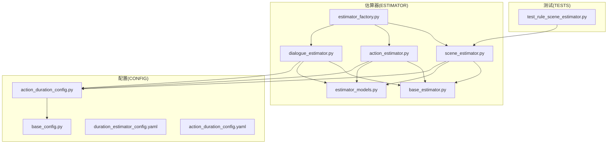
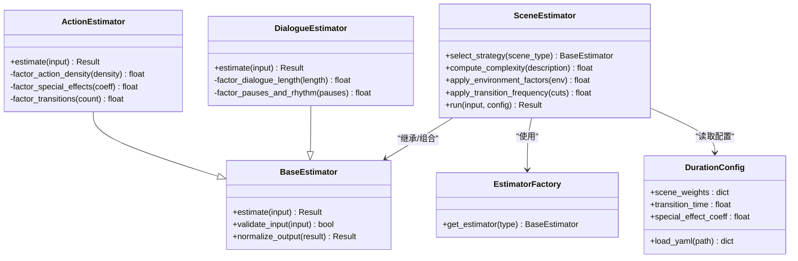
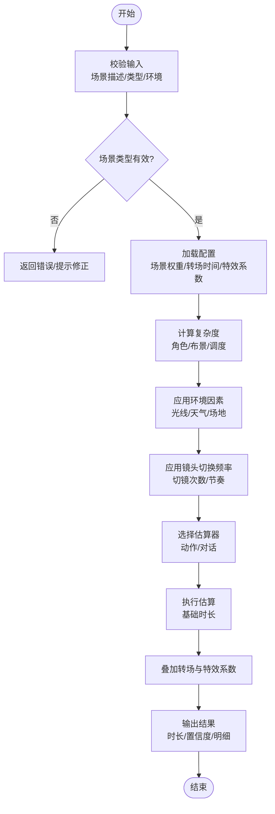
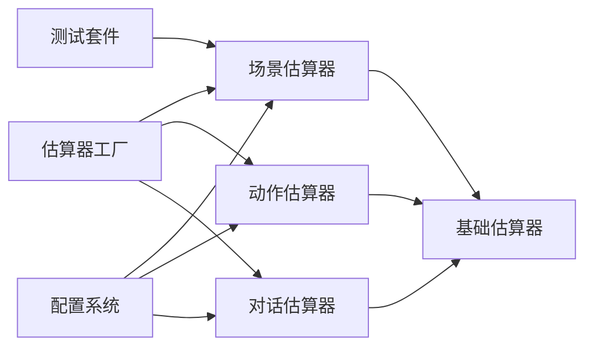

# 场景估算器

<cite>
**本文引用的文件**   
- [src/penshot/neopen/agent/shot_segmenter/estimator/scene_estimator.py](file://src/penshot/neopen/agent/shot_segmenter/estimator/scene_estimator.py)
- [src/penshot/neopen/agent/shot_segmenter/estimator/base_estimator.py](file://src/penshot/neopen/agent/shot_segmenter/estimator/base_estimator.py)
- [src/penshot/neopen/agent/shot_segmenter/estimator/action_estimator.py](file://src/penshot/neopen/agent/shot_segmenter/estimator/action_estimator.py)
- [src/penshot/neopen/agent/shot_segmenter/estimator/dialogue_estimator.py](file://src/penshot/neopen/agent/shot_segmenter/estimator/dialogue_estimator.py)
- [src/penshot/neopen/agent/shot_segmenter/estimator/estimator_factory.py](file://src/penshot/neopen/agent/shot_segmenter/estimator/estimator_factory.py)
- [src/penshot/neopen/agent/shot_segmenter/estimator/estimator_models.py](file://src/penshot/neopen/agent/shot_segmenter/estimator/estimator_models.py)
- [src/penshot/neopen/config/action_duration_config.py](file://src/penshot/neopen/config/action_duration_config.py)
- [src/penshot/neopen/config/base_config.py](file://src/penshot/neopen/config/base_config.py)
- [src/penshot/neopen/config/__init__.py](file://src/penshot/neopen/config/__init__.py)
- [src/penshot/neopen/config/zh/duration_estimator_config.yaml](file://src/penshot/neopen/config/zh/duration_estimator_config.yaml)
- [src/penshot/neopen/config/zh/action_duration_config.yaml](file://src/penshot/neopen/config/zh/action_duration_config.yaml)
- [tests/planner/test_rule_scene_estimator.py](file://tests/planner/test_rule_scene_estimator.py)
</cite>

## 目录
1. [简介](#简介)
2. [项目结构](#项目结构)
3. [核心组件](#核心组件)
4. [架构总览](#架构总览)
5. [详细组件分析](#详细组件分析)
6. [依赖关系分析](#依赖关系分析)
7. [性能考量](#性能考量)
8. [故障排查指南](#故障排查指南)
9. [结论](#结论)
10. [附录](#附录)

## 简介
本文件围绕“场景估算器”提供系统化、可落地的技术文档，聚焦于基于场景描述的时长估算方法。内容涵盖：
- 场景复杂度分析、环境因素考虑与镜头切换频率对时长的影响
- 配置参数体系（场景类型权重、转场时间、特效影响系数等）
- 不同场景类型的估算规则（室内戏、室外戏、动作场面、文戏等）
- 调优技巧与实际使用建议

该估算器位于分镜分割子系统中，作为多策略估算框架的一部分，支持规则与可扩展的增强逻辑，便于在不同制作风格与拍摄条件下进行灵活适配。

## 项目结构
场景估算器相关代码集中在 shot_segmenter/estimator 目录下，并与配置模块协同工作。关键路径如下：
- 估算器实现：scene_estimator.py、base_estimator.py、action_estimator.py、dialogue_estimator.py、estimator_factory.py、estimator_models.py
- 配置加载与模型：config/action_duration_config.py、config/base_config.py、config/zh/*.yaml
- 测试用例：tests/planner/test_rule_scene_estimator.py

图表来源
- [src/penshot/neopen/agent/shot_segmenter/estimator/scene_estimator.py](file://src/penshot/neopen/agent/shot_segmenter/estimator/scene_estimator.py)
- [src/penshot/neopen/agent/shot_segmenter/estimator/base_estimator.py](file://src/penshot/neopen/agent/shot_segmenter/estimator/base_estimator.py)
- [src/penshot/neopen/agent/shot_segmenter/estimator/action_estimator.py](file://src/penshot/neopen/agent/shot_segmenter/estimator/action_estimator.py)
- [src/penshot/neopen/agent/shot_segmenter/estimator/dialogue_estimator.py](file://src/penshot/neopen/agent/shot_segmenter/estimator/dialogue_estimator.py)
- [src/penshot/neopen/agent/shot_segmenter/estimator/estimator_factory.py](file://src/penshot/neopen/agent/shot_segmenter/estimator/estimator_factory.py)
- [src/penshot/neopen/agent/shot_segmenter/estimator/estimator_models.py](file://src/penshot/neopen/agent/shot_segmenter/estimator/estimator_models.py)
- [src/penshot/neopen/config/action_duration_config.py](file://src/penshot/neopen/config/action_duration_config.py)
- [src/penshot/neopen/config/base_config.py](file://src/penshot/neopen/config/base_config.py)
- [src/penshot/neopen/config/zh/duration_estimator_config.yaml](file://src/penshot/neopen/config/zh/duration_estimator_config.yaml)
- [src/penshot/neopen/config/zh/action_duration_config.yaml](file://src/penshot/neopen/config/zh/action_duration_config.yaml)
- [tests/planner/test_rule_scene_estimator.py](file://tests/planner/test_rule_scene_estimator.py)

章节来源
- [src/penshot/neopen/agent/shot_segmenter/estimator/scene_estimator.py](file://src/penshot/neopen/agent/shot_segmenter/estimator/scene_estimator.py)
- [src/penshot/neopen/agent/shot_segmenter/estimator/base_estimator.py](file://src/penshot/neopen/agent/shot_segmenter/estimator/base_estimator.py)
- [src/penshot/neopen/agent/shot_segmenter/estimator/action_estimator.py](file://src/penshot/neopen/agent/shot_segmenter/estimator/action_estimator.py)
- [src/penshot/neopen/agent/shot_segmenter/estimator/dialogue_estimator.py](file://src/penshot/neopen/agent/shot_segmenter/estimator/dialogue_estimator.py)
- [src/penshot/neopen/agent/shot_segmenter/estimator/estimator_factory.py](file://src/penshot/neopen/agent/shot_segmenter/estimator/estimator_factory.py)
- [src/penshot/neopen/agent/shot_segmenter/estimator/estimator_models.py](file://src/penshot/neopen/agent/shot_segmenter/estimator/estimator_models.py)
- [src/penshot/neopen/config/action_duration_config.py](file://src/penshot/neopen/config/action_duration_config.py)
- [src/penshot/neopen/config/base_config.py](file://src/penshot/neopen/config/base_config.py)
- [src/penshot/neopen/config/zh/duration_estimator_config.yaml](file://src/penshot/neopen/config/zh/duration_estimator_config.yaml)
- [src/penshot/neopen/config/zh/action_duration_config.yaml](file://src/penshot/neopen/config/zh/action_duration_config.yaml)
- [tests/planner/test_rule_scene_estimator.py](file://tests/planner/test_rule_scene_estimator.py)

## 核心组件
- 场景估算器（Scene Estimator）
  - 负责根据场景描述、类型与环境信息计算预估时长，并输出结构化结果。
  - 通过工厂模式选择具体估算策略（如动作、对话等），并可扩展新的估算器。
- 基础估算器（Base Estimator）
  - 定义统一的估算接口、输入输出模型与通用校验逻辑。
- 动作估算器（Action Estimator）
  - 针对动作场面，结合动作密度、复杂程度、特效与转场等因素进行估算。
- 对话估算器（Dialogue Estimator）
  - 针对文戏/对白为主的场景，依据台词长度、节奏与停顿等进行估算。
- 估算模型（Estimator Models）
  - 统一定义输入数据结构与输出结果字段，确保各估算器一致的数据契约。
- 配置系统（Config System）
  - 提供场景类型权重、转场时间、特效影响系数等可调参数，支持 YAML 配置与运行时覆盖。

章节来源
- [src/penshot/neopen/agent/shot_segmenter/estimator/scene_estimator.py](file://src/penshot/neopen/agent/shot_segmenter/estimator/scene_estimator.py)
- [src/penshot/neopen/agent/shot_segmenter/estimator/base_estimator.py](file://src/penshot/neopen/agent/shot_segmenter/estimator/base_estimator.py)
- [src/penshot/neopen/agent/shot_segmenter/estimator/action_estimator.py](file://src/penshot/neopen/agent/shot_segmenter/estimator/action_estimator.py)
- [src/penshot/neopen/agent/shot_segmenter/estimator/dialogue_estimator.py](file://src/penshot/neopen/agent/shot_segmenter/estimator/dialogue_estimator.py)
- [src/penshot/neopen/agent/shot_segmenter/estimator/estimator_models.py](file://src/penshot/neopen/agent/shot_segmenter/estimator/estimator_models.py)
- [src/penshot/neopen/config/action_duration_config.py](file://src/penshot/neopen/config/action_duration_config.py)
- [src/penshot/neopen/config/base_config.py](file://src/penshot/neopen/config/base_config.py)
- [src/penshot/neopen/config/zh/duration_estimator_config.yaml](file://src/penshot/neopen/config/zh/duration_estimator_config.yaml)
- [src/penshot/neopen/config/zh/action_duration_config.yaml](file://src/penshot/neopen/config/zh/action_duration_config.yaml)

## 架构总览
场景估算器采用“工厂+策略”的架构：上层通过工厂获取具体估算器实例，各估算器遵循统一接口处理输入并返回标准化结果。配置系统为估算过程提供可插拔的参数源。

图表来源
- [src/penshot/neopen/agent/shot_segmenter/estimator/base_estimator.py](file://src/penshot/neopen/agent/shot_segmenter/estimator/base_estimator.py)
- [src/penshot/neopen/agent/shot_segmenter/estimator/scene_estimator.py](file://src/penshot/neopen/agent/shot_segmenter/estimator/scene_estimator.py)
- [src/penshot/neopen/agent/shot_segmenter/estimator/action_estimator.py](file://src/penshot/neopen/agent/shot_segmenter/estimator/action_estimator.py)
- [src/penshot/neopen/agent/shot_segmenter/estimator/dialogue_estimator.py](file://src/penshot/neopen/agent/shot_segmenter/estimator/dialogue_estimator.py)
- [src/penshot/neopen/agent/shot_segmenter/estimator/estimator_factory.py](file://src/penshot/neopen/agent/shot_segmenter/estimator/estimator_factory.py)
- [src/penshot/neopen/config/action_duration_config.py](file://src/penshot/neopen/config/action_duration_config.py)

## 详细组件分析

### 场景估算器（Scene Estimator）
- 职责
  - 解析场景描述，识别场景类型（室内戏、室外戏、动作场面、文戏等）。
  - 计算场景复杂度（角色数量、道具/布景复杂度、调度难度等）。
  - 应用环境因素（光线、天气、场地限制等）与镜头切换频率（切镜次数、节奏）。
  - 调用具体估算器（动作/对话）得到基础时长，再叠加转场时间与特效影响。
- 关键流程
  - 输入校验与标准化
  - 场景类型判定与权重加载
  - 复杂度与环境因子计算
  - 选择并执行具体估算器
  - 合并转场与特效系数，输出最终时长
- 输出
  - 标准化结果对象，包含预估时长、置信度、影响因素明细等。

图表来源
- [src/penshot/neopen/agent/shot_segmenter/estimator/scene_estimator.py](file://src/penshot/neopen/agent/shot_segmenter/estimator/scene_estimator.py)
- [src/penshot/neopen/config/action_duration_config.py](file://src/penshot/neopen/config/action_duration_config.py)

章节来源
- [src/penshot/neopen/agent/shot_segmenter/estimator/scene_estimator.py](file://src/penshot/neopen/agent/shot_segmenter/estimator/scene_estimator.py)
- [src/penshot/neopen/config/action_duration_config.py](file://src/penshot/neopen/config/action_duration_config.py)

### 动作估算器（Action Estimator）
- 适用场景
  - 动作场面、追逐、打斗、爆炸、特技等。
- 估算要点
  - 动作密度（单位时间内动作事件数量）
  - 特效影响系数（CGI、爆破、威亚等）
  - 转场次数与节奏（快速剪辑增加时长）
- 输出
  - 基础时长与分项贡献（动作密度、特效、转场等）

章节来源
- [src/penshot/neopen/agent/shot_segmenter/estimator/action_estimator.py](file://src/penshot/neopen/agent/shot_segmenter/estimator/action_estimator.py)
- [src/penshot/neopen/config/action_duration_config.py](file://src/penshot/neopen/config/action_duration_config.py)

### 对话估算器（Dialogue Estimator）
- 适用场景
  - 文戏、对白为主、内心独白、访谈等。
- 估算要点
  - 台词长度与语速
  - 停顿与节奏（情绪、留白）
  - 镜头切换频率（正反打、过肩等）
- 输出
  - 基础时长与分项贡献（台词长度、停顿、切镜等）

章节来源
- [src/penshot/neopen/agent/shot_segmenter/estimator/dialogue_estimator.py](file://src/penshot/neopen/agent/shot_segmenter/estimator/dialogue_estimator.py)

### 估算模型（Estimator Models）
- 输入模型
  - 场景描述文本、场景类型标签、环境信息（室内/室外、天气、光线）、镜头切换统计（切镜次数/间隔）、动作/对话特征指标。
- 输出模型
  - 预估时长（秒）、置信度（0~1）、影响因素明细（权重、系数、贡献值）、估算器版本与配置快照。
- 设计原则
  - 强类型约束、字段必填校验、可扩展字段预留。

章节来源
- [src/penshot/neopen/agent/shot_segmenter/estimator/estimator_models.py](file://src/penshot/neopen/agent/shot_segmenter/estimator/estimator_models.py)

### 工厂与策略（Estimator Factory）
- 职责
  - 根据场景类型或用户指定策略返回对应估算器实例。
  - 支持注册新估算器，保持开闭原则。
- 使用方式
  - 上层仅依赖工厂接口，不直接耦合具体估算器实现。

章节来源
- [src/penshot/neopen/agent/shot_segmenter/estimator/estimator_factory.py](file://src/penshot/neopen/agent/shot_segmenter/estimator/estimator_factory.py)

### 配置系统（Duration Config）
- 配置项
  - 场景类型权重：不同场景类型的基础权重（室内戏、室外戏、动作场面、文戏等）
  - 转场时间：每次切镜的平均附加时长
  - 特效影响系数：特效强度对时长的放大比例
  - 其他：默认语速、默认停顿、复杂度阈值等
- 加载机制
  - 从 YAML 文件加载默认配置，支持运行时覆盖与优先级管理。
- 典型文件
  - duration_estimator_config.yaml：估算器通用配置
  - action_duration_config.yaml：动作相关细化配置

章节来源
- [src/penshot/neopen/config/action_duration_config.py](file://src/penshot/neopen/config/action_duration_config.py)
- [src/penshot/neopen/config/base_config.py](file://src/penshot/neopen/config/base_config.py)
- [src/penshot/neopen/config/zh/duration_estimator_config.yaml](file://src/penshot/neopen/config/zh/duration_estimator_config.yaml)
- [src/penshot/neopen/config/zh/action_duration_config.yaml](file://src/penshot/neopen/config/zh/action_duration_config.yaml)

## 依赖关系分析
- 内部依赖
  - 场景估算器依赖基础估算器接口与估算模型；动作/对话估算器继承基础估算器。
  - 工厂负责按类型创建具体估算器实例。
  - 配置系统为所有估算器提供统一参数源。
- 外部依赖
  - YAML 配置文件用于加载默认参数。
  - 测试套件验证估算器行为与边界条件。

图表来源
- [src/penshot/neopen/agent/shot_segmenter/estimator/scene_estimator.py](file://src/penshot/neopen/agent/shot_segmenter/estimator/scene_estimator.py)
- [src/penshot/neopen/agent/shot_segmenter/estimator/base_estimator.py](file://src/penshot/neopen/agent/shot_segmenter/estimator/base_estimator.py)
- [src/penshot/neopen/agent/shot_segmenter/estimator/action_estimator.py](file://src/penshot/neopen/agent/shot_segmenter/estimator/action_estimator.py)
- [src/penshot/neopen/agent/shot_segmenter/estimator/dialogue_estimator.py](file://src/penshot/neopen/agent/shot_segmenter/estimator/dialogue_estimator.py)
- [src/penshot/neopen/agent/shot_segmenter/estimator/estimator_factory.py](file://src/penshot/neopen/agent/shot_segmenter/estimator/estimator_factory.py)
- [src/penshot/neopen/config/action_duration_config.py](file://src/penshot/neopen/config/action_duration_config.py)
- [tests/planner/test_rule_scene_estimator.py](file://tests/planner/test_rule_scene_estimator.py)

章节来源
- [src/penshot/neopen/agent/shot_segmenter/estimator/scene_estimator.py](file://src/penshot/neopen/agent/shot_segmenter/estimator/scene_estimator.py)
- [src/penshot/neopen/agent/shot_segmenter/estimator/base_estimator.py](file://src/penshot/neopen/agent/shot_segmenter/estimator/base_estimator.py)
- [src/penshot/neopen/agent/shot_segmenter/estimator/action_estimator.py](file://src/penshot/neopen/agent/shot_segmenter/estimator/action_estimator.py)
- [src/penshot/neopen/agent/shot_segmenter/estimator/dialogue_estimator.py](file://src/penshot/neopen/agent/shot_segmenter/estimator/dialogue_estimator.py)
- [src/penshot/neopen/agent/shot_segmenter/estimator/estimator_factory.py](file://src/penshot/neopen/agent/shot_segmenter/estimator/estimator_factory.py)
- [src/penshot/neopen/config/action_duration_config.py](file://src/penshot/neopen/config/action_duration_config.py)
- [tests/planner/test_rule_scene_estimator.py](file://tests/planner/test_rule_scene_estimator.py)

## 性能考量
- 复杂度计算优化
  - 对场景描述进行轻量级特征提取（词频、关键词匹配），避免重型 NLP 推理。
- 缓存策略
  - 对相同场景类型与环境的估算结果进行短期缓存，减少重复计算。
- 并行估算
  - 在批量处理多个场景时，可对独立场景并行估算以提升吞吐。
- 配置热更新
  - 支持运行时重载配置，无需重启服务即可调整权重与系数。

[本节为通用指导，不涉及具体文件分析]

## 故障排查指南
- 常见问题
  - 输入缺失或不合法：检查场景描述、类型标签与环境信息是否齐全。
  - 配置未生效：确认 YAML 路径正确且优先级覆盖顺序符合预期。
  - 估算结果异常：查看输出中的置信度与影响因素明细，定位主导因素。
- 调试建议
  - 启用详细日志，记录输入、中间因子与最终结果。
  - 使用测试套件回归验证，确保变更不影响既有行为。
- 参考测试
  - 规则场景估算器测试用例可用于复现与验证边界情况。

章节来源
- [tests/planner/test_rule_scene_estimator.py](file://tests/planner/test_rule_scene_estimator.py)

## 结论
场景估算器通过“工厂+策略”的架构与可配置的系统，提供了稳定、可扩展的时长估算能力。其核心在于：
- 以场景类型为基础，结合复杂度、环境与切镜频率进行综合评估
- 通过动作与对话两类估算器覆盖主要创作形态
- 借助配置系统实现灵活的权重与系数调优

建议在真实项目中持续收集拍摄与后期数据，迭代优化权重与系数，以获得更贴近实际的估算结果。

[本节为总结性内容，不涉及具体文件分析]

## 附录

### 场景类型与估算规则（示例说明）
- 室内戏
  - 特点：可控环境、布景相对固定、灯光与机位调度较稳定
  - 估算要点：台词长度、少量切镜、低特效影响
- 室外戏
  - 特点：自然光变化、天气不确定、场地限制较多
  - 估算要点：环境因素权重提升、可能增加转场与等待时间
- 动作场面
  - 特点：高动作密度、特效多、切镜频繁
  - 估算要点：动作密度与特效系数显著放大时长
- 文戏
  - 特点：对白为主、节奏较慢、强调表演与情绪
  - 估算要点：台词长度与停顿节奏为主要驱动因素

[本节为概念性说明，不涉及具体文件分析]

### 配置参数清单（字段说明）
- 场景类型权重
  - 作用：决定不同类型的基础时长基准
  - 范围：正数，越大表示越耗时
- 转场时间
  - 作用：每次切镜的附加时长
  - 范围：秒，通常较小但累积效应明显
- 特效影响系数
  - 作用：特效强度对时长的放大比例
  - 范围：大于等于 1，越大特效越耗时
- 默认语速与停顿
  - 作用：对话估算的基线参数
  - 范围：语速（字/分钟）、停顿（秒）

章节来源
- [src/penshot/neopen/config/zh/duration_estimator_config.yaml](file://src/penshot/neopen/config/zh/duration_estimator_config.yaml)
- [src/penshot/neopen/config/zh/action_duration_config.yaml](file://src/penshot/neopen/config/zh/action_duration_config.yaml)

### 实际使用建议
- 先粗后细
  - 先用默认配置获得粗略估算，再根据项目风格微调权重与系数。
- 关注置信度
  - 低置信度意味着不确定性较高，应人工复核或补充更多上下文。
- 建立反馈闭环
  - 将实际拍摄时长与估算结果对比，持续校准配置。
- 分层估算
  - 对长段落先按场景类型估算，再在段落内按镜头细分，提高精度。

[本节为通用指导，不涉及具体文件分析]