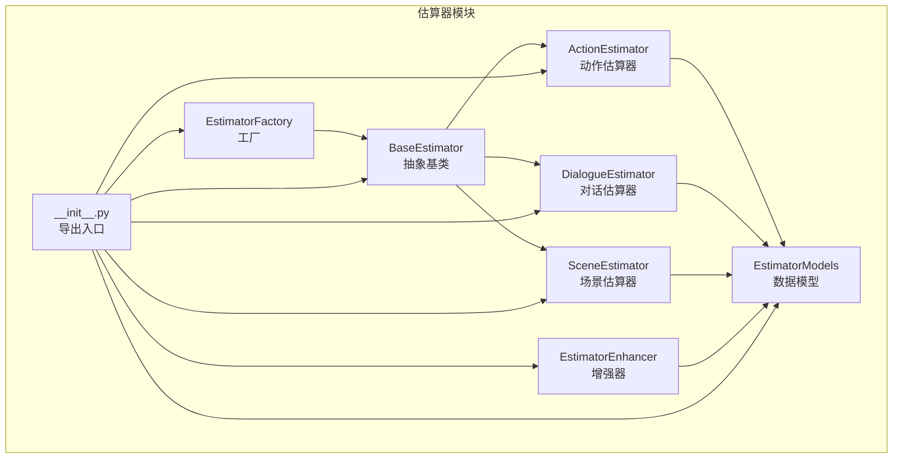
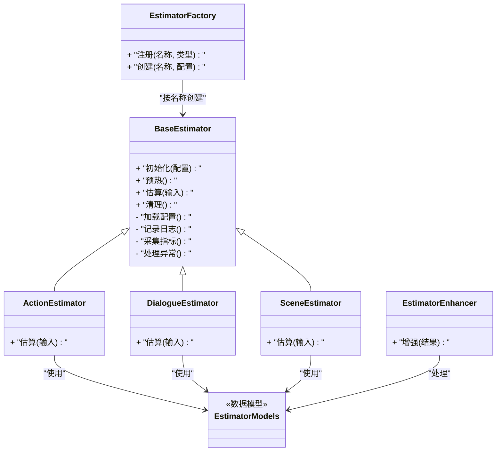
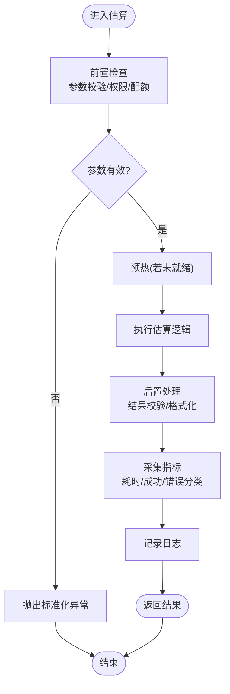
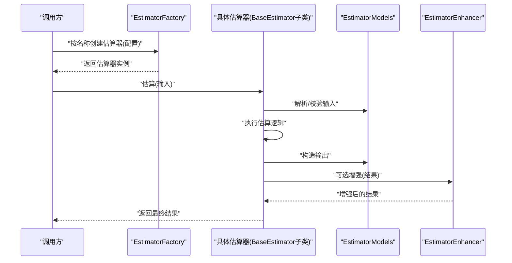
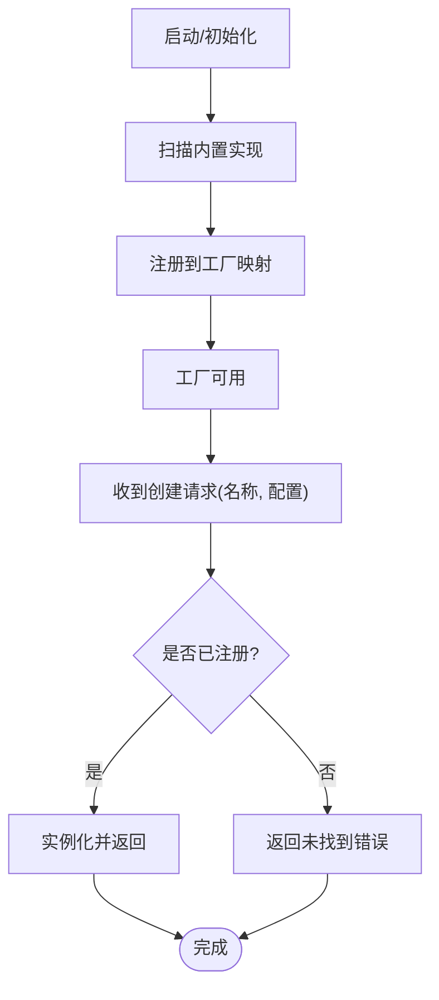
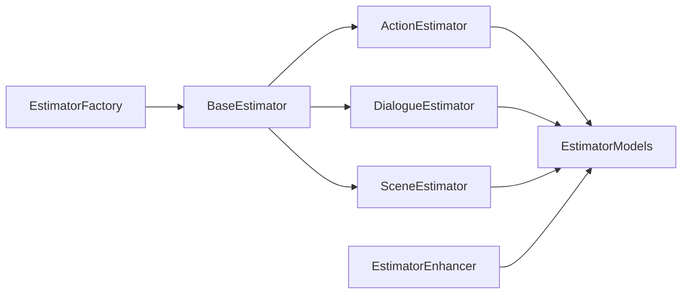

# 基础估算器

<cite>
**本文引用的文件**   
- [base_estimator.py](file://src/penshot/neopen/agent/shot_segmenter/estimator/base_estimator.py)
- [action_estimator.py](file://src/penshot/neopen/agent/shot_segmenter/estimator/action_estimator.py)
- [dialogue_estimator.py](file://src/penshot/neopen/agent/shot_segmenter/estimator/dialogue_estimator.py)
- [scene_estimator.py](file://src/penshot/neopen/agent/shot_segmenter/estimator/scene_estimator.py)
- [estimator_factory.py](file://src/penshot/neopen/agent/shot_segmenter/estimator/estimator_factory.py)
- [estimator_models.py](file://src/penshot/neopen/agent/shot_segmenter/estimator/estimator_models.py)
- [estimator_enhancer.py](file://src/penshot/neopen/agent/shot_segmenter/estimator/estimator_enhancer.py)
- [__init__.py](file://src/penshot/neopen/agent/shot_segmenter/estimator/__init__.py)
</cite>

## 目录
1. [简介](#简介)
2. [项目结构](#项目结构)
3. [核心组件](#核心组件)
4. [架构总览](#架构总览)
5. [详细组件分析](#详细组件分析)
6. [依赖关系分析](#依赖关系分析)
7. [性能考虑](#性能考虑)
8. [故障排查指南](#故障排查指南)
9. [结论](#结论)
10. [附录](#附录)

## 简介
本文件聚焦于“基础估算器”体系，围绕 BaseEstimator 抽象类的设计与实现，系统阐述统一接口规范、生命周期管理、错误处理机制，以及配置管理、日志记录与性能监控等通用能力。同时给出自定义估算器的开发指南与最佳实践，并说明估算器注册机制与工厂模式的实现细节，帮助读者快速扩展新的估算策略（如动作、对话、场景等）。

## 项目结构
估算器模块位于 shot_segmenter/estimator 子包中，采用“基类 + 具体实现 + 工厂 + 模型 + 增强器”的分层组织方式：
- 基类与模型：定义统一接口、数据模型与通用行为
- 具体估算器：提供不同维度的估算逻辑（动作、对话、场景）
- 工厂与注册：按名称动态创建估算器实例
- 增强器：对估算结果进行后处理或增强

图表来源
- [base_estimator.py](file://src/penshot/neopen/agent/shot_segmenter/estimator/base_estimator.py)
- [action_estimator.py](file://src/penshot/neopen/agent/shot_segmenter/estimator/action_estimator.py)
- [dialogue_estimator.py](file://src/penshot/neopen/agent/shot_segmenter/estimator/dialogue_estimator.py)
- [scene_estimator.py](file://src/penshot/neopen/agent/shot_segmenter/estimator/scene_estimator.py)
- [estimator_factory.py](file://src/penshot/neopen/agent/shot_segmenter/estimator/estimator_factory.py)
- [estimator_models.py](file://src/penshot/neopen/agent/shot_segmenter/estimator/estimator_models.py)
- [estimator_enhancer.py](file://src/penshot/neopen/agent/shot_segmenter/estimator/estimator_enhancer.py)
- [__init__.py](file://src/penshot/neopen/agent/shot_segmenter/estimator/__init__.py)

章节来源
- [base_estimator.py](file://src/penshot/neopen/agent/shot_segmenter/estimator/base_estimator.py)
- [estimator_models.py](file://src/penshot/neopen/agent/shot_segmenter/estimator/estimator_models.py)
- [estimator_factory.py](file://src/penshot/neopen/agent/shot_segmenter/estimator/estimator_factory.py)
- [estimator_enhancer.py](file://src/penshot/neopen/agent/shot_segmenter/estimator/estimator_enhancer.py)
- [action_estimator.py](file://src/penshot/neopen/agent/shot_segmenter/estimator/action_estimator.py)
- [dialogue_estimator.py](file://src/penshot/neopen/agent/shot_segmenter/estimator/dialogue_estimator.py)
- [scene_estimator.py](file://src/penshot/neopen/agent/shot_segmenter/estimator/scene_estimator.py)
- [__init__.py](file://src/penshot/neopen/agent/shot_segmenter/estimator/__init__.py)

## 核心组件
- BaseEstimator 抽象基类
  - 职责：定义统一的估算接口、生命周期钩子、配置加载、日志与指标收集、异常规范化与重试策略等
  - 关键能力：
    - 统一接口：标准化输入输出契约，确保各估算器可被同一流程编排调用
    - 生命周期：初始化、预热、执行、清理等阶段的可插拔钩子
    - 配置管理：从配置源读取参数并校验，支持默认值与覆盖
    - 日志记录：结构化日志、上下文追踪、分级输出
    - 性能监控：耗时统计、成功率、错误分类计数
    - 错误处理：异常捕获、降级策略、重试与熔断建议
- 具体估算器
  - ActionEstimator：基于规则或模型的“动作”维度估算
  - DialogueEstimator：基于规则或模型的“对话”维度估算
  - SceneEstimator：基于规则或模型的“场景”维度估算
- EstimatorModels 数据模型
  - 定义估算输入、中间态与输出的标准数据结构，保证上下游一致
- EstimatorFactory 工厂与注册
  - 维护类型到实现的映射，支持按名称动态创建实例，便于扩展
- EstimatorEnhancer 增强器
  - 对估算结果进行后处理（如归一化、裁剪、合并、平滑等）

章节来源
- [base_estimator.py](file://src/penshot/neopen/agent/shot_segmenter/estimator/base_estimator.py)
- [action_estimator.py](file://src/penshot/neopen/agent/shot_segmenter/estimator/action_estimator.py)
- [dialogue_estimator.py](file://src/penshot/neopen/agent/shot_segmenter/estimator/dialogue_estimator.py)
- [scene_estimator.py](file://src/penshot/neopen/agent/shot_segmenter/estimator/scene_estimator.py)
- [estimator_models.py](file://src/penshot/neopen/agent/shot_segmenter/estimator/estimator_models.py)
- [estimator_factory.py](file://src/penshot/neopen/agent/shot_segmenter/estimator/estimator_factory.py)
- [estimator_enhancer.py](file://src/penshot/neopen/agent/shot_segmenter/estimator/estimator_enhancer.py)

## 架构总览
估算器整体采用“统一接口 + 多实现 + 工厂创建 + 可选增强”的架构模式，既保证一致性，又具备高可扩展性。

图表来源
- [base_estimator.py](file://src/penshot/neopen/agent/shot_segmenter/estimator/base_estimator.py)
- [action_estimator.py](file://src/penshot/neopen/agent/shot_segmenter/estimator/action_estimator.py)
- [dialogue_estimator.py](file://src/penshot/neopen/agent/shot_segmenter/estimator/dialogue_estimator.py)
- [scene_estimator.py](file://src/penshot/neopen/agent/shot_segmenter/estimator/scene_estimator.py)
- [estimator_factory.py](file://src/penshot/neopen/agent/shot_segmenter/estimator/estimator_factory.py)
- [estimator_models.py](file://src/penshot/neopen/agent/shot_segmenter/estimator/estimator_models.py)
- [estimator_enhancer.py](file://src/penshot/neopen/agent/shot_segmenter/estimator/estimator_enhancer.py)

## 详细组件分析

### BaseEstimator 抽象基类
- 设计理念
  - 通过抽象基类收敛所有估算器的共性能力，降低重复代码，提升一致性与可维护性
  - 将“配置、日志、指标、异常、生命周期”等横切关注点下沉至基类，具体实现仅聚焦业务逻辑
- 核心接口
  - 初始化：接收配置对象，完成内部状态准备
  - 预热：在首次估算前执行必要的资源准备（如缓存、索引、模型加载）
  - 估算：核心方法，接收标准输入，返回标准输出
  - 清理：释放资源，关闭连接，清理临时状态
- 通用功能
  - 配置管理：提供配置加载、校验、默认值合并与覆盖机制
  - 日志记录：结构化日志输出，包含上下文信息（如任务ID、估算器名、输入摘要）
  - 性能监控：记录耗时、吞吐、错误率等指标，便于观测与告警
  - 错误处理：统一异常捕获、分类、降级与重试策略，避免上层感知底层差异
- 生命周期钩子
  - 提供可重写钩子，允许子类在特定阶段注入额外逻辑（如预热阶段的模型加载）

图表来源
- [base_estimator.py](file://src/penshot/neopen/agent/shot_segmenter/estimator/base_estimator.py)

章节来源
- [base_estimator.py](file://src/penshot/neopen/agent/shot_segmenter/estimator/base_estimator.py)

### 具体估算器：Action / Dialogue / Scene
- 共同点
  - 继承自 BaseEstimator，复用统一接口、生命周期、配置、日志与指标
  - 使用 EstimatorModels 定义的输入/输出模型，确保数据契约一致
- 差异化
  - ActionEstimator：侧重动作相关特征的提取与时长/强度估算
  - DialogueEstimator：侧重对话语义、节奏与情感特征的分析
  - SceneEstimator：侧重场景切换、环境变化与镜头语言判断
- 扩展建议
  - 新增估算器时，仅需实现核心估算方法与必要配置项，其余由基类接管

图表来源
- [estimator_factory.py](file://src/penshot/neopen/agent/shot_segmenter/estimator/estimator_factory.py)
- [base_estimator.py](file://src/penshot/neopen/agent/shot_segmenter/estimator/base_estimator.py)
- [estimator_models.py](file://src/penshot/neopen/agent/shot_segmenter/estimator/estimator_models.py)
- [estimator_enhancer.py](file://src/penshot/neopen/agent/shot_segmenter/estimator/estimator_enhancer.py)
- [action_estimator.py](file://src/penshot/neopen/agent/shot_segmenter/estimator/action_estimator.py)
- [dialogue_estimator.py](file://src/penshot/neopen/agent/shot_segmenter/estimator/dialogue_estimator.py)
- [scene_estimator.py](file://src/penshot/neopen/agent/shot_segmenter/estimator/scene_estimator.py)

章节来源
- [action_estimator.py](file://src/penshot/neopen/agent/shot_segmenter/estimator/action_estimator.py)
- [dialogue_estimator.py](file://src/penshot/neopen/agent/shot_segmenter/estimator/dialogue_estimator.py)
- [scene_estimator.py](file://src/penshot/neopen/agent/shot_segmenter/estimator/scene_estimator.py)
- [estimator_models.py](file://src/penshot/neopen/agent/shot_segmenter/estimator/estimator_models.py)
- [estimator_enhancer.py](file://src/penshot/neopen/agent/shot_segmenter/estimator/estimator_enhancer.py)

### 估算器工厂与注册机制
- 设计要点
  - 集中式注册表：维护“名称 -> 类型”的映射，支持运行时动态注册
  - 工厂创建：根据名称与配置创建对应估算器实例，封装异常与缺失处理
  - 扩展友好：新增估算器只需注册即可被外部发现与使用
- 典型流程
  - 启动时自动扫描并注册内置估算器
  - 运行期可按需注册第三方估算器
  - 创建失败时返回明确错误信息，便于定位问题

图表来源
- [estimator_factory.py](file://src/penshot/neopen/agent/shot_segmenter/estimator/estimator_factory.py)
- [__init__.py](file://src/penshot/neopen/agent/shot_segmenter/estimator/__init__.py)

章节来源
- [estimator_factory.py](file://src/penshot/neopen/agent/shot_segmenter/estimator/estimator_factory.py)
- [__init__.py](file://src/penshot/neopen/agent/shot_segmenter/estimator/__init__.py)

### 数据模型与增强器
- 数据模型
  - 定义统一的输入结构（如文本片段、上下文、元数据）与输出结构（如估算值、置信度、标签）
  - 提供校验与转换工具，确保跨模块数据一致性
- 增强器
  - 对估算结果进行后处理，包括数值裁剪、平滑、合并相邻区间、去噪等
  - 可组合多个增强步骤，形成增强流水线

章节来源
- [estimator_models.py](file://src/penshot/neopen/agent/shot_segmenter/estimator/estimator_models.py)
- [estimator_enhancer.py](file://src/penshot/neopen/agent/shot_segmenter/estimator/estimator_enhancer.py)

## 依赖关系分析
- 内聚与耦合
  - BaseEstimator 作为核心基类，被所有具体估算器依赖，体现高内聚
  - 具体估算器仅依赖数据模型与可选增强器，保持低耦合
  - 工厂与注册表解耦了“名称到实现”的绑定，便于扩展
- 外部依赖
  - 日志与指标通常来自公共工具库；配置来自配置中心或本地文件
  - 估算器可与 LLM 客户端或其他服务交互，但应通过适配器隔离

图表来源
- [base_estimator.py](file://src/penshot/neopen/agent/shot_segmenter/estimator/base_estimator.py)
- [action_estimator.py](file://src/penshot/neopen/agent/shot_segmenter/estimator/action_estimator.py)
- [dialogue_estimator.py](file://src/penshot/neopen/agent/shot_segmenter/estimator/dialogue_estimator.py)
- [scene_estimator.py](file://src/penshot/neopen/agent/shot_segmenter/estimator/scene_estimator.py)
- [estimator_models.py](file://src/penshot/neopen/agent/shot_segmenter/estimator/estimator_models.py)
- [estimator_enhancer.py](file://src/penshot/neopen/agent/shot_segmenter/estimator/estimator_enhancer.py)
- [estimator_factory.py](file://src/penshot/neopen/agent/shot_segmenter/estimator/estimator_factory.py)

章节来源
- [base_estimator.py](file://src/penshot/neopen/agent/shot_segmenter/estimator/base_estimator.py)
- [estimator_factory.py](file://src/penshot/neopen/agent/shot_segmenter/estimator/estimator_factory.py)
- [estimator_models.py](file://src/penshot/neopen/agent/shot_segmenter/estimator/estimator_models.py)
- [estimator_enhancer.py](file://src/penshot/neopen/agent/shot_segmenter/estimator/estimator_enhancer.py)

## 性能考虑
- 预热与缓存
  - 在预热阶段加载模型、构建索引或预取数据，减少首请求延迟
  - 对热点数据进行缓存，注意失效策略与内存占用控制
- 并发与批处理
  - 估算器内部应避免阻塞操作，必要时使用异步或线程池
  - 批量估算可降低开销，提高吞吐
- 指标与观测
  - 记录关键指标（耗时分布、错误率、缓存命中率），结合告警阈值优化
- 资源限制
  - 设置超时、重试上限与熔断策略，防止雪崩效应

[本节为通用指导，不直接分析具体文件]

## 故障排查指南
- 常见问题
  - 未找到估算器：检查工厂注册表是否正确注册该名称
  - 配置缺失或格式错误：确认配置键存在且类型正确，查看日志中的校验错误
  - 估算结果为空或异常：检查输入是否符合模型约束，查看增强器是否过度裁剪
  - 性能退化：观察指标，定位瓶颈（I/O、模型推理、锁竞争）
- 定位手段
  - 开启更详细的日志级别，关注上下文信息与堆栈
  - 复现最小用例，逐步缩小范围
  - 对比不同估算器在同一输入下的表现，定位实现差异

章节来源
- [base_estimator.py](file://src/penshot/neopen/agent/shot_segmenter/estimator/base_estimator.py)
- [estimator_factory.py](file://src/penshot/neopen/agent/shot_segmenter/estimator/estimator_factory.py)

## 结论
BaseEstimator 抽象类通过统一接口、生命周期管理与通用横切能力，为各类估算器提供了稳定可靠的基座。配合工厂注册与数据模型，系统具备良好的扩展性与可观测性。遵循本文的开发指南与最佳实践，可高效地实现新估算器并保持与现有流程无缝集成。

[本节为总结性内容，不直接分析具体文件]

## 附录
- 自定义估算器开发清单
  - 继承 BaseEstimator，实现核心估算方法
  - 使用 EstimatorModels 定义输入/输出结构
  - 在工厂中注册新估算器名称与类型
  - 编写单元测试，覆盖正常路径与异常路径
  - 添加日志与指标埋点，便于上线后观测
- 最佳实践
  - 保持估算器无副作用或显式声明副作用
  - 对长耗时操作设置超时与重试上限
  - 对敏感信息进行脱敏后再记录日志
  - 合理拆分增强步骤，避免单步过重

[本节为补充信息，不直接分析具体文件]