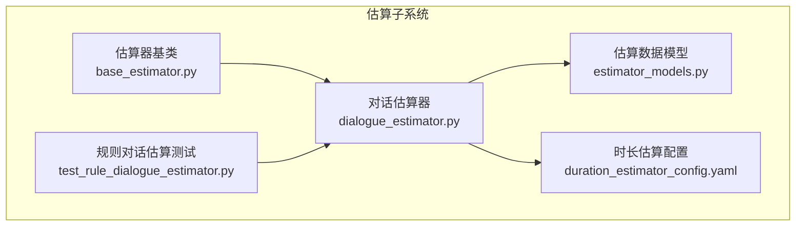
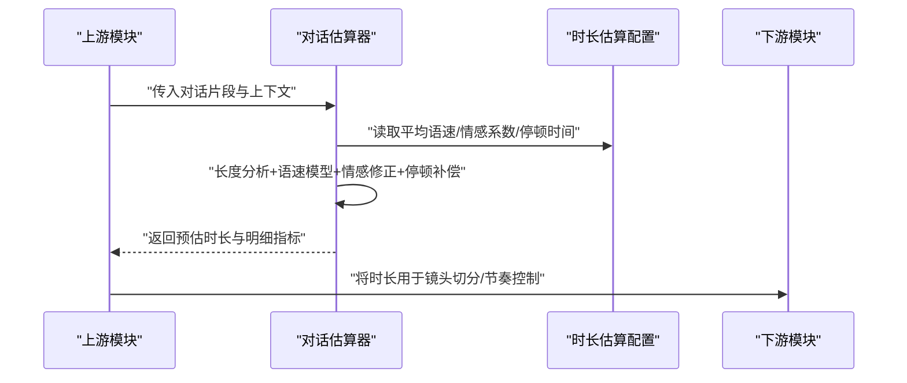
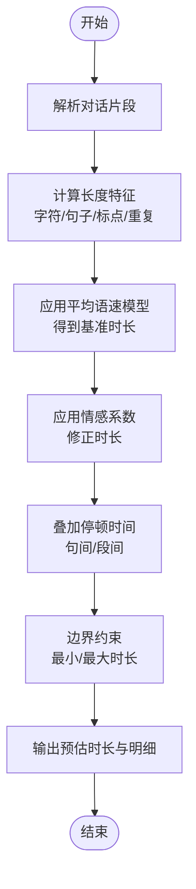
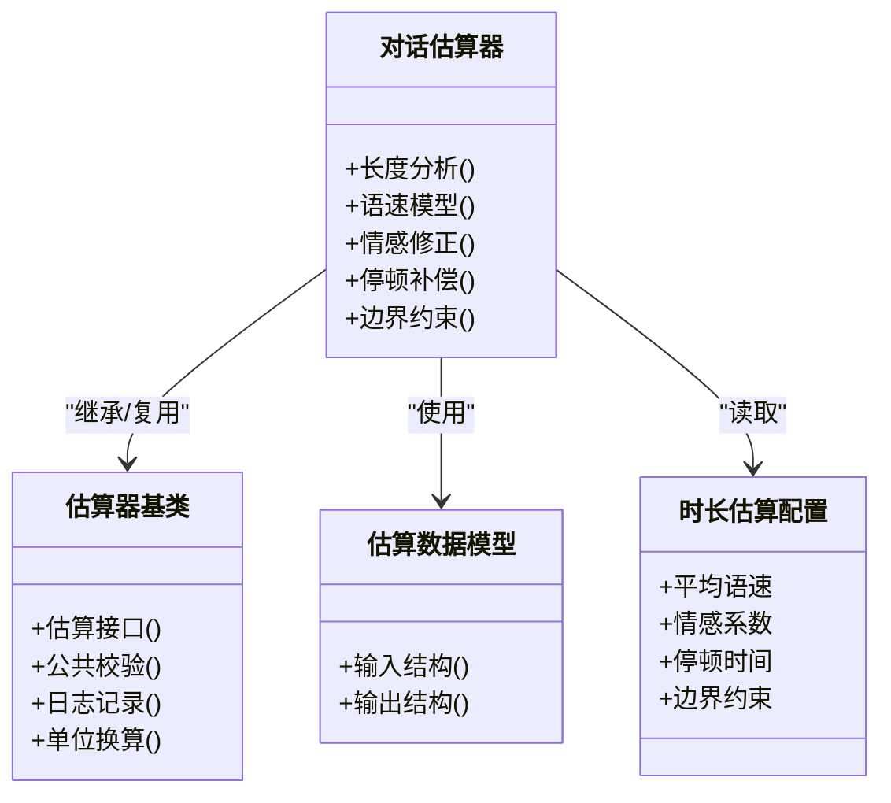

# 对话估算器

<cite>
**本文引用的文件**   
- [dialogue_estimator.py](file://src/penshot/neopen/agent/shot_segmenter/estimator/dialogue_estimator.py)
- [base_estimator.py](file://src/penshot/neopen/agent/shot_segmenter/estimator/base_estimator.py)
- [estimator_models.py](file://src/penshot/neopen/agent/shot_segmenter/estimator/estimator_models.py)
- [duration_estimator_config.yaml](file://src/penshot/neopen/config/zh/duration_estimator_config.yaml)
- [test_rule_dialogue_estimator.py](file://tests/planner/test_rule_dialogue_estimator.py)
</cite>

## 目录
1. [简介](#简介)
2. [项目结构](#项目结构)
3. [核心组件](#核心组件)
4. [架构总览](#架构总览)
5. [详细组件分析](#详细组件分析)
6. [依赖关系分析](#依赖关系分析)
7. [性能考虑](#性能考虑)
8. [故障排查指南](#故障排查指南)
9. [结论](#结论)
10. [附录](#附录)

## 简介
本文件面向“对话估算器”，聚焦于基于对话内容的时长估算算法与工程实现。文档覆盖以下要点：
- 对话长度分析与语速模型
- 情感强度对时长的影响
- 配置项说明（平均语速、情感系数、停顿时间等）
- 不同场景的估算策略（紧张对话、轻松聊天、正式会议等）
- 精度优化方法与落地案例

## 项目结构
对话估算器位于分镜切分模块的估算子系统中，采用“基类抽象 + 规则/混合实现”的分层设计。关键路径如下：
- 估算器基类：定义统一接口与通用能力
- 对话估算器：提供基于规则的对话时长估算
- 数据模型：封装输入输出结构与字段约束
- 配置文件：集中管理语速、情感、停顿等参数
- 测试用例：覆盖典型场景与边界条件

图表来源
- [base_estimator.py](file://src/penshot/neopen/agent/shot_segmenter/estimator/base_estimator.py)
- [dialogue_estimator.py](file://src/penshot/neopen/agent/shot_segmenter/estimator/dialogue_estimator.py)
- [estimator_models.py](file://src/penshot/neopen/agent/shot_segmenter/estimator/estimator_models.py)
- [duration_estimator_config.yaml](file://src/penshot/neopen/config/zh/duration_estimator_config.yaml)
- [test_rule_dialogue_estimator.py](file://tests/planner/test_rule_dialogue_estimator.py)

章节来源
- [dialogue_estimator.py](file://src/penshot/neopen/agent/shot_segmenter/estimator/dialogue_estimator.py)
- [base_estimator.py](file://src/penshot/neopen/agent/shot_segmenter/estimator/base_estimator.py)
- [estimator_models.py](file://src/penshot/neopen/agent/shot_segmenter/estimator/estimator_models.py)
- [duration_estimator_config.yaml](file://src/penshot/neopen/config/zh/duration_estimator_config.yaml)
- [test_rule_dialogue_estimator.py](file://tests/planner/test_rule_dialogue_estimator.py)

## 核心组件
- 估算器基类
  - 职责：定义统一的估算接口、公共校验与日志记录、结果聚合与单位换算等基础能力。
  - 关键点：为具体估算器提供一致的输入输出契约与扩展点。
- 对话估算器
  - 职责：基于对话文本特征（长度、标点、语气词、重复、停顿标记等）与配置参数进行时长估算。
  - 关键点：支持按说话人分段、合并相邻短句、应用情感系数与停顿补偿。
- 估算数据模型
  - 职责：规范对话估算的输入（如对话片段、说话人信息、上下文提示）与输出（如预估时长、置信度、细分指标）。
  - 关键点：确保各阶段数据结构一致，便于测试与集成。
- 时长估算配置
  - 职责：集中管理平均语速、情感系数、停顿时间、最小/最大时长阈值等可调参数。
  - 关键点：通过配置文件驱动行为，便于在不同场景中快速切换策略。

章节来源
- [base_estimator.py](file://src/penshot/neopen/agent/shot_segmenter/estimator/base_estimator.py)
- [dialogue_estimator.py](file://src/penshot/neopen/agent/shot_segmenter/estimator/dialogue_estimator.py)
- [estimator_models.py](file://src/penshot/neopen/agent/shot_segmenter/estimator/estimator_models.py)
- [duration_estimator_config.yaml](file://src/penshot/neopen/config/zh/duration_estimator_config.yaml)

## 架构总览
对话估算器在分镜切分流程中作为“时长估算”环节的一部分，接收上游脚本解析或人工标注的对话片段，结合配置输出预估时长，供后续镜头规划使用。

图表来源
- [dialogue_estimator.py](file://src/penshot/neopen/agent/shot_segmenter/estimator/dialogue_estimator.py)
- [duration_estimator_config.yaml](file://src/penshot/neopen/config/zh/duration_estimator_config.yaml)

## 详细组件分析

### 对话估算器（规则实现）
- 输入
  - 对话片段：包含说话人、台词文本、可选的语气/情绪标签或上下文提示
  - 上下文：如场景类型、角色关系、是否含动作描述等
- 处理逻辑
  - 长度分析：统计字符数、句子数、标点密度、重复短语比例
  - 语速模型：依据平均语速将文本量转换为基准时长
  - 情感修正：根据情感强度调整时长（高情感通常更慢或更强调，低情感更快）
  - 停顿补偿：在句间、段落间插入停顿时间，避免过短估计
  - 边界约束：应用最小/最大时长限制，保证合理性
- 输出
  - 预估时长（秒）、置信度、细分指标（如基准时长、情感修正量、停顿总量）

图表来源
- [dialogue_estimator.py](file://src/penshot/neopen/agent/shot_segmenter/estimator/dialogue_estimator.py)

章节来源
- [dialogue_estimator.py](file://src/penshot/neopen/agent/shot_segmenter/estimator/dialogue_estimator.py)

### 估算器基类
- 职责
  - 定义统一的估算接口（输入/输出契约）
  - 提供公共校验、日志、单位换算、结果聚合等能力
- 扩展点
  - 子类可重写特定步骤（如情感修正、停顿策略）以适配不同场景

章节来源
- [base_estimator.py](file://src/penshot/neopen/agent/shot_segmenter/estimator/base_estimator.py)

### 估算数据模型
- 输入模型
  - 对话片段：文本、说话人、可选元数据（情绪、场景）
- 输出模型
  - 预估时长、置信度、细分指标（基准时长、情感修正、停顿总量）
- 作用
  - 保障上下游数据结构稳定，便于测试与可视化

章节来源
- [estimator_models.py](file://src/penshot/neopen/agent/shot_segmenter/estimator/estimator_models.py)

### 配置项说明（时长估算）
- 平均语速
  - 含义：单位时间内可表达的文本量（如字/秒），用于将文本长度转为基准时长
  - 建议范围：依据语言与内容类型调优；中文日常对话常见区间需结合实际语料校准
- 情感系数
  - 含义：根据情感强度对基准时长进行乘性修正
  - 取值建议：大于1表示放慢/强调，小于1表示加快/平淡
- 停顿时间
  - 含义：句间/段间默认停顿时长，可按层级设置
  - 建议：正式会议更长，轻松聊天更短
- 边界约束
  - 最小/最大时长：防止极端值导致不合理结果
- 其他
  - 场景开关：针对不同场景启用不同的默认参数组合

章节来源
- [duration_estimator_config.yaml](file://src/penshot/neopen/config/zh/duration_estimator_config.yaml)

### 不同对话场景的估算策略
- 紧张对话
  - 特点：语速快、停顿少、情感强度高
  - 策略：提高平均语速、降低停顿时间、适度放大情感系数
- 轻松聊天
  - 特点：语速中等、偶有停顿、情感波动小
  - 策略：使用默认语速与停顿，情感系数接近1
- 正式会议
  - 特点：语速较慢、停顿较多、表达严谨
  - 策略：降低平均语速、增加停顿时间、情感系数适中

章节来源
- [duration_estimator_config.yaml](file://src/penshot/neopen/config/zh/duration_estimator_config.yaml)
- [dialogue_estimator.py](file://src/penshot/neopen/agent/shot_segmenter/estimator/dialogue_estimator.py)

### 精度优化方法
- 语料校准
  - 收集真实对话录音转写，统计不同场景的平均语速与停顿分布，反推配置参数
- 分层停顿
  - 区分句内、句间、段落级停顿，按语义层次差异化设置
- 情感细粒度
  - 引入更细粒度的情感标签（如愤怒、悲伤、喜悦），分别映射到不同修正系数
- 说话人差异
  - 针对主要角色建立个性化语速与停顿偏好
- 动态阈值
  - 根据上下文自动调整最小/最大时长，避免固定阈值导致的偏差
- 评估闭环
  - 构建离线评测集，持续对比预测与真实时长，迭代参数与策略

[本节为通用指导，不直接分析具体文件]

### 实际应用案例
- 短视频脚本预排期
  - 输入：多段对话脚本
  - 处理：按场景加载配置，调用对话估算器得到每段时长
  - 输出：总时长与分段时长，辅助剪辑节奏与字幕排版
- 直播/会议录制切分
  - 输入：实时转写的对话流
  - 处理：按说话人与语义单元切分，估算每段时长并生成时间戳
  - 输出：结构化时间轴，便于回放与检索

[本节为概念性说明，不直接分析具体文件]

## 依赖关系分析
- 内部依赖
  - 对话估算器依赖估算器基类提供的统一接口与工具
  - 对话估算器依赖数据模型进行输入输出序列化与校验
  - 对话估算器依赖配置中心读取参数
- 外部依赖
  - 无强耦合外部库，主要依赖配置与文本处理工具

图表来源
- [base_estimator.py](file://src/penshot/neopen/agent/shot_segmenter/estimator/base_estimator.py)
- [dialogue_estimator.py](file://src/penshot/neopen/agent/shot_segmenter/estimator/dialogue_estimator.py)
- [estimator_models.py](file://src/penshot/neopen/agent/shot_segmenter/estimator/estimator_models.py)
- [duration_estimator_config.yaml](file://src/penshot/neopen/config/zh/duration_estimator_config.yaml)

章节来源
- [base_estimator.py](file://src/penshot/neopen/agent/shot_segmenter/estimator/base_estimator.py)
- [dialogue_estimator.py](file://src/penshot/neopen/agent/shot_segmenter/estimator/dialogue_estimator.py)
- [estimator_models.py](file://src/penshot/neopen/agent/shot_segmenter/estimator/estimator_models.py)
- [duration_estimator_config.yaml](file://src/penshot/neopen/config/zh/duration_estimator_config.yaml)

## 性能考虑
- 文本预处理
  - 尽量在内存中进行字符串统计与分割，避免频繁I/O
- 批量估算
  - 对大量对话片段进行批处理，减少配置读取与对象创建开销
- 缓存策略
  - 对相同场景的配置与常用参数进行缓存，避免重复加载
- 并行化
  - 在无共享状态的前提下，对独立片段进行并行估算

[本节为通用指导，不直接分析具体文件]

## 故障排查指南
- 常见问题
  - 预估时长异常偏短/偏长：检查平均语速与情感系数是否合理，确认停顿时间是否被正确叠加
  - 边界约束触发：核对最小/最大时长阈值是否符合业务预期
  - 配置未生效：确认配置文件路径与键名是否正确，是否存在覆盖冲突
- 定位方法
  - 开启详细日志，查看长度特征、基准时长、情感修正量与停顿总量的中间值
  - 使用单元测试样例逐步验证输入与输出，缩小问题范围
- 回归测试
  - 维护代表性场景的测试集，每次参数调整后运行回归，确保稳定性

章节来源
- [test_rule_dialogue_estimator.py](file://tests/planner/test_rule_dialogue_estimator.py)

## 结论
对话估算器通过“长度分析 + 语速模型 + 情感修正 + 停顿补偿”的组合策略，能够在多种对话场景下给出合理的时长预估。借助可配置的参数体系与清晰的输入输出模型，系统具备良好的可扩展性与可维护性。建议在实际项目中结合真实语料持续校准参数，并建立评测闭环以提升精度与鲁棒性。

[本节为总结性内容，不直接分析具体文件]

## 附录
- 术语
  - 平均语速：单位时间内可表达的文本量
  - 情感系数：对基准时长进行乘性修正的参数
  - 停顿时间：句间/段间的默认停顿时长
- 参考路径
  - 估算器实现：[dialogue_estimator.py](file://src/penshot/neopen/agent/shot_segmenter/estimator/dialogue_estimator.py)
  - 基类接口：[base_estimator.py](file://src/penshot/neopen/agent/shot_segmenter/estimator/base_estimator.py)
  - 数据模型：[estimator_models.py](file://src/penshot/neopen/agent/shot_segmenter/estimator/estimator_models.py)
  - 配置项：[duration_estimator_config.yaml](file://src/penshot/neopen/config/zh/duration_estimator_config.yaml)
  - 测试用例：[test_rule_dialogue_estimator.py](file://tests/planner/test_rule_dialogue_estimator.py)