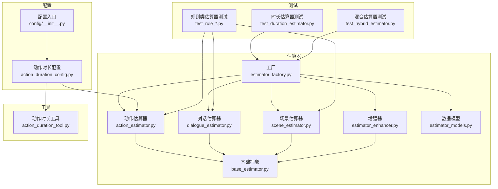
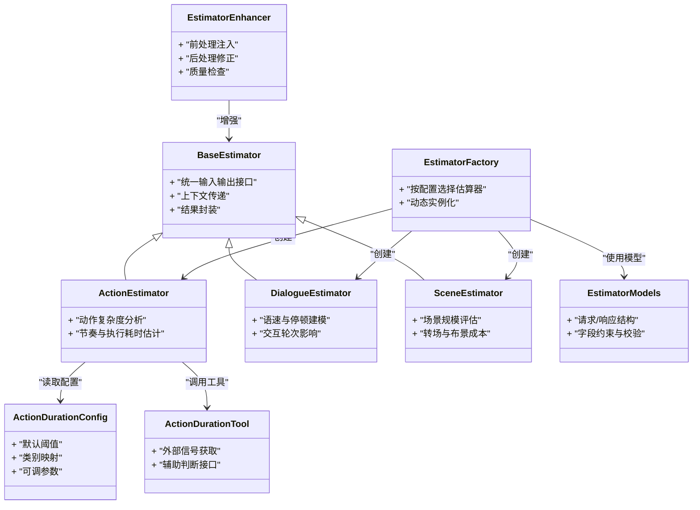
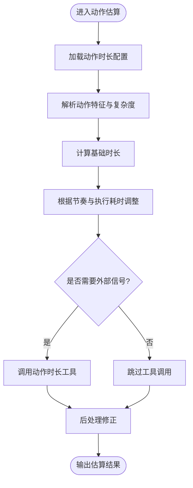
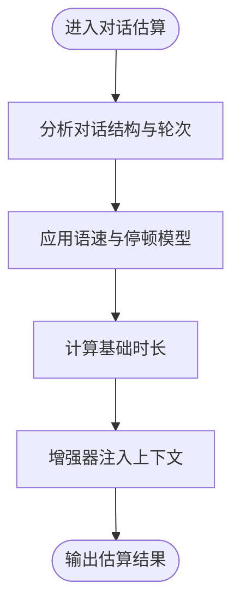
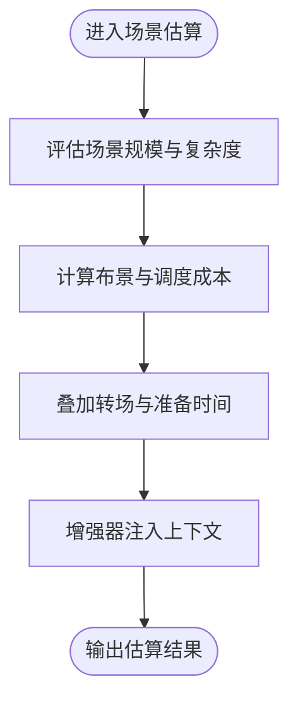
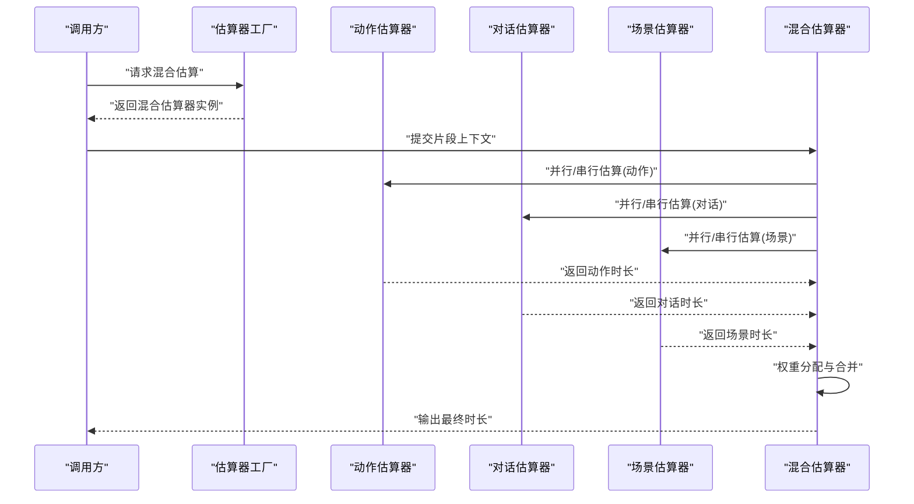
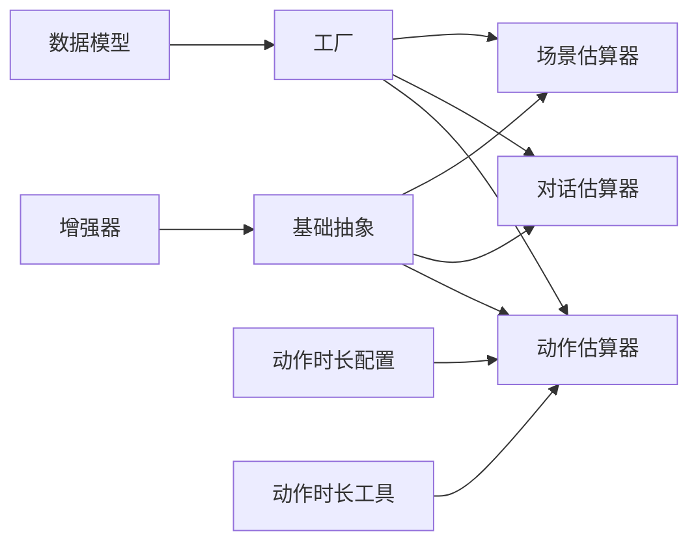

# 时长估算器

<cite>
**本文引用的文件**   
- [src/penshot/neopen/agent/shot_segmenter/estimator/action_estimator.py](file://src/penshot/neopen/agent/shot_segmenter/estimator/action_estimator.py)
- [src/penshot/neopen/agent/shot_segmenter/estimator/dialogue_estimator.py](file://src/penshot/neopen/agent/shot_segmenter/estimator/dialogue_estimator.py)
- [src/penshot/neopen/agent/shot_segmenter/estimator/scene_estimator.py](file://src/penshot/neopen/agent/shot_segmenter/estimator/scene_estimator.py)
- [src/penshot/neopen/agent/shot_segmenter/estimator/base_estimator.py](file://src/penshot/neopen/agent/shot_segmenter/estimator/base_estimator.py)
- [src/penshot/neopen/agent/shot_segmenter/estimator/estimator_factory.py](file://src/penshot/neopen/agent/shot_segmenter/estimator/estimator_factory.py)
- [src/penshot/neopen/agent/shot_segmenter/estimator/estimator_models.py](file://src/penshot/neopen/agent/shot_segmenter/estimator/estimator_models.py)
- [src/penshot/neopen/agent/shot_segmenter/estimator/estimator_enhancer.py](file://src/penshot/neopen/agent/shot_segmenter/estimator/estimator_enhancer.py)
- [src/penshot/neopen/config/action_duration_config.py](file://src/penshot/neopen/config/action_duration_config.py)
- [src/penshot/neopen/config/__init__.py](file://src/penshot/neopen/config/__init__.py)
- [src/penshot/neopen/tools/action_duration_tool.py](file://src/penshot/neopen/tools/action_duration_tool.py)
- [tests/planner/test_duration_estimator.py](file://tests/planner/test_duration_estimator.py)
- [tests/planner/test_hybrid_estimator.py](file://tests/planner/test_hybrid_estimator.py)
- [tests/planner/test_rule_action_estimator.py](file://tests/planner/test_rule_action_estimator.py)
- [tests/planner/test_rule_dialogue_estimator.py](file://tests/planner/test_rule_dialogue_estimator.py)
- [tests/planner/test_rule_scene_estimator.py](file://tests/planner/test_rule_scene_estimator.py)
</cite>

## 目录
1. [简介](#简介)
2. [项目结构](#项目结构)
3. [核心组件](#核心组件)
4. [架构总览](#架构总览)
5. [详细组件分析](#详细组件分析)
6. [依赖关系分析](#依赖关系分析)
7. [性能考量](#性能考量)
8. [故障排查指南](#故障排查指南)
9. [结论](#结论)
10. [附录](#附录)

## 简介
本文件围绕“时长估算器”子系统，系统性梳理其算法实现、组合策略与调优方法。该子系统位于镜头分段模块的估算层，提供动作估算器、对话估算器、场景估算器以及混合估算器等多种能力，用于对剧本片段进行时长预测，为后续的分镜规划与资源调度提供依据。文档将覆盖：
- 各估算器的适用场景、精度特点与配置参数
- 估算器组合策略与权重分配机制
- 估算精度的评估方法与调优技巧
- 不同剧本类型下的效果对比与最佳实践

## 项目结构
时长估算器相关代码主要分布在以下路径：
- 估算器实现与工厂：src/penshot/neopen/agent/shot_segmenter/estimator
- 配置模型与加载：src/penshot/neopen/config
- 工具集成（动作时长）：src/penshot/neopen/tools
- 测试用例：tests/planner

图表来源
- [src/penshot/neopen/agent/shot_segmenter/estimator/action_estimator.py](file://src/penshot/neopen/agent/shot_segmenter/estimator/action_estimator.py)
- [src/penshot/neopen/agent/shot_segmenter/estimator/dialogue_estimator.py](file://src/penshot/neopen/agent/shot_segmenter/estimator/dialogue_estimator.py)
- [src/penshot/neopen/agent/shot_segmenter/estimator/scene_estimator.py](file://src/penshot/neopen/agent/shot_segmenter/estimator/scene_estimator.py)
- [src/penshot/neopen/agent/shot_segmenter/estimator/base_estimator.py](file://src/penshot/neopen/agent/shot_segmenter/estimator/base_estimator.py)
- [src/penshot/neopen/agent/shot_segmenter/estimator/estimator_enhancer.py](file://src/penshot/neopen/agent/shot_segmenter/estimator/estimator_enhancer.py)
- [src/penshot/neopen/agent/shot_segmenter/estimator/estimator_factory.py](file://src/penshot/neopen/agent/shot_segmenter/estimator/estimator_factory.py)
- [src/penshot/neopen/agent/shot_segmenter/estimator/estimator_models.py](file://src/penshot/neopen/agent/shot_segmenter/estimator/estimator_models.py)
- [src/penshot/neopen/config/action_duration_config.py](file://src/penshot/neopen/config/action_duration_config.py)
- [src/penshot/neopen/config/__init__.py](file://src/penshot/neopen/config/__init__.py)
- [src/penshot/neopen/tools/action_duration_tool.py](file://src/penshot/neopen/tools/action_duration_tool.py)
- [tests/planner/test_duration_estimator.py](file://tests/planner/test_duration_estimator.py)
- [tests/planner/test_hybrid_estimator.py](file://tests/planner/test_hybrid_estimator.py)
- [tests/planner/test_rule_action_estimator.py](file://tests/planner/test_rule_action_estimator.py)
- [tests/planner/test_rule_dialogue_estimator.py](file://tests/planner/test_rule_dialogue_estimator.py)
- [tests/planner/test_rule_scene_estimator.py](file://tests/planner/test_rule_scene_estimator.py)

章节来源
- [src/penshot/neopen/agent/shot_segmenter/estimator/action_estimator.py](file://src/penshot/neopen/agent/shot_segmenter/estimator/action_estimator.py)
- [src/penshot/neopen/agent/shot_segmenter/estimator/dialogue_estimator.py](file://src/penshot/neopen/agent/shot_segmenter/estimator/dialogue_estimator.py)
- [src/penshot/neopen/agent/shot_segmenter/estimator/scene_estimator.py](file://src/penshot/neopen/agent/shot_segmenter/estimator/scene_estimator.py)
- [src/penshot/neopen/agent/shot_segmenter/estimator/base_estimator.py](file://src/penshot/neopen/agent/shot_segmenter/estimator/base_estimator.py)
- [src/penshot/neopen/agent/shot_segmenter/estimator/estimator_factory.py](file://src/penshot/neopen/agent/shot_segmenter/estimator/estimator_factory.py)
- [src/penshot/neopen/agent/shot_segmenter/estimator/estimator_models.py](file://src/penshot/neopen/agent/shot_segmenter/estimator/estimator_models.py)
- [src/penshot/neopen/config/action_duration_config.py](file://src/penshot/neopen/config/action_duration_config.py)
- [src/penshot/neopen/config/__init__.py](file://src/penshot/neopen/config/__init__.py)
- [src/penshot/neopen/tools/action_duration_tool.py](file://src/penshot/neopen/tools/action_duration_tool.py)
- [tests/planner/test_duration_estimator.py](file://tests/planner/test_duration_estimator.py)
- [tests/planner/test_hybrid_estimator.py](file://tests/planner/test_hybrid_estimator.py)
- [tests/planner/test_rule_action_estimator.py](file://tests/planner/test_rule_action_estimator.py)
- [tests/planner/test_rule_dialogue_estimator.py](file://tests/planner/test_rule_dialogue_estimator.py)
- [tests/planner/test_rule_scene_estimator.py](file://tests/planner/test_rule_scene_estimator.py)

## 核心组件
- 基础抽象与数据模型
  - 基础估算器定义了统一的输入输出接口、上下文传递与结果封装规范，确保各具体估算器可被统一编排与替换。
  - 估算器数据模型集中定义请求/响应结构、字段约束与校验逻辑，保证跨模块一致的数据契约。
- 具体估算器
  - 动作估算器：面向动作描述密集的片段，结合动作复杂度、节奏与执行耗时等特征进行时长估计。
  - 对话估算器：面向对白为主的片段，考虑语速、停顿、情绪与交互轮次等因素。
  - 场景估算器：面向场景切换、环境构建与转场较多的片段，考虑场景规模、布景复杂度与调度成本。
  - 混合估算器：融合多种估算器结果，通过权重或策略组合提升整体鲁棒性与精度。
- 工厂与增强器
  - 工厂负责按配置或运行时条件选择并实例化合适的估算器，支持动态扩展。
  - 增强器在估算前后注入上下文信息、后处理修正与质量检查，提高稳定性。
- 配置与工具
  - 动作时长配置提供默认阈值、类别映射与可调参数，便于在不同业务域中快速适配。
  - 动作时长工具对外暴露标准化接口，供上层流程调用以获取外部信号或辅助判断。

章节来源
- [src/penshot/neopen/agent/shot_segmenter/estimator/base_estimator.py](file://src/penshot/neopen/agent/shot_segmenter/estimator/base_estimator.py)
- [src/penshot/neopen/agent/shot_segmenter/estimator/estimator_models.py](file://src/penshot/neopen/agent/shot_segmenter/estimator/estimator_models.py)
- [src/penshot/neopen/agent/shot_segmenter/estimator/action_estimator.py](file://src/penshot/neopen/agent/shot_segmenter/estimator/action_estimator.py)
- [src/penshot/neopen/agent/shot_segmenter/estimator/dialogue_estimator.py](file://src/penshot/neopen/agent/shot_segmenter/estimator/dialogue_estimator.py)
- [src/penshot/neopen/agent/shot_segmenter/estimator/scene_estimator.py](file://src/penshot/neopen/agent/shot_segmenter/estimator/scene_estimator.py)
- [src/penshot/neopen/agent/shot_segmenter/estimator/estimator_enhancer.py](file://src/penshot/neopen/agent/shot_segmenter/estimator/estimator_enhancer.py)
- [src/penshot/neopen/agent/shot_segmenter/estimator/estimator_factory.py](file://src/penshot/neopen/agent/shot_segmenter/estimator/estimator_factory.py)
- [src/penshot/neopen/config/action_duration_config.py](file://src/penshot/neopen/config/action_duration_config.py)
- [src/penshot/neopen/tools/action_duration_tool.py](file://src/penshot/neopen/tools/action_duration_tool.py)

## 架构总览
下图展示了估算器子系统与配置、工具及测试之间的交互关系。

图表来源
- [src/penshot/neopen/agent/shot_segmenter/estimator/base_estimator.py](file://src/penshot/neopen/agent/shot_segmenter/estimator/base_estimator.py)
- [src/penshot/neopen/agent/shot_segmenter/estimator/action_estimator.py](file://src/penshot/neopen/agent/shot_segmenter/estimator/action_estimator.py)
- [src/penshot/neopen/agent/shot_segmenter/estimator/dialogue_estimator.py](file://src/penshot/neopen/agent/shot_segmenter/estimator/dialogue_estimator.py)
- [src/penshot/neopen/agent/shot_segmenter/estimator/scene_estimator.py](file://src/penshot/neopen/agent/shot_segmenter/estimator/scene_estimator.py)
- [src/penshot/neopen/agent/shot_segmenter/estimator/estimator_enhancer.py](file://src/penshot/neopen/agent/shot_segmenter/estimator/estimator_enhancer.py)
- [src/penshot/neopen/agent/shot_segmenter/estimator/estimator_factory.py](file://src/penshot/neopen/agent/shot_segmenter/estimator/estimator_factory.py)
- [src/penshot/neopen/agent/shot_segmenter/estimator/estimator_models.py](file://src/penshot/neopen/agent/shot_segmenter/estimator/estimator_models.py)
- [src/penshot/neopen/config/action_duration_config.py](file://src/penshot/neopen/config/action_duration_config.py)
- [src/penshot/neopen/tools/action_duration_tool.py](file://src/penshot/neopen/tools/action_duration_tool.py)

## 详细组件分析

### 动作估算器
- 适用场景
  - 动作密集、节奏变化明显的片段，如打斗、追逐、复杂调度等。
- 精度特点
  - 对动作复杂度与执行耗时的敏感度较高；在动作描述清晰时表现稳定。
- 关键实现要点
  - 基于动作类别与复杂度特征进行时长估计，结合节奏因子与执行时间模型。
  - 可通过动作时长配置调整阈值与类别映射，以适应不同风格或平台要求。
  - 可选调用动作时长工具以引入外部信号或辅助判断。
- 配置参数
  - 参考动作时长配置中的默认阈值、类别映射与可调参数。
- 典型问题与修复
  - 若动作描述模糊，建议增加上下文信息或启用增强器进行后处理修正。

图表来源
- [src/penshot/neopen/agent/shot_segmenter/estimator/action_estimator.py](file://src/penshot/neopen/agent/shot_segmenter/estimator/action_estimator.py)
- [src/penshot/neopen/config/action_duration_config.py](file://src/penshot/neopen/config/action_duration_config.py)
- [src/penshot/neopen/tools/action_duration_tool.py](file://src/penshot/neopen/tools/action_duration_tool.py)

章节来源
- [src/penshot/neopen/agent/shot_segmenter/estimator/action_estimator.py](file://src/penshot/neopen/agent/shot_segmenter/estimator/action_estimator.py)
- [src/penshot/neopen/config/action_duration_config.py](file://src/penshot/neopen/config/action_duration_config.py)
- [src/penshot/neopen/tools/action_duration_tool.py](file://src/penshot/neopen/tools/action_duration_tool.py)

### 对话估算器
- 适用场景
  - 对白为主、交互轮次较多、语速与停顿变化显著的片段。
- 精度特点
  - 对语速、停顿与情绪波动敏感；在对话密度高时具备较好稳定性。
- 关键实现要点
  - 基于对话长度、语速模型与停顿分布估计时长，考虑交互轮次带来的额外开销。
  - 可与增强器配合，注入上下文信息以提升鲁棒性。
- 配置参数
  - 通常包含语速基准、停顿阈值与情绪系数等可调项（由具体实现与配置决定）。
- 典型问题与修复
  - 对于含大量潜台词或沉默的片段，建议调整停顿阈值与情绪系数。

图表来源
- [src/penshot/neopen/agent/shot_segmenter/estimator/dialogue_estimator.py](file://src/penshot/neopen/agent/shot_segmenter/estimator/dialogue_estimator.py)
- [src/penshot/neopen/agent/shot_segmenter/estimator/estimator_enhancer.py](file://src/penshot/neopen/agent/shot_segmenter/estimator/estimator_enhancer.py)

章节来源
- [src/penshot/neopen/agent/shot_segmenter/estimator/dialogue_estimator.py](file://src/penshot/neopen/agent/shot_segmenter/estimator/dialogue_estimator.py)
- [src/penshot/neopen/agent/shot_segmenter/estimator/estimator_enhancer.py](file://src/penshot/neopen/agent/shot_segmenter/estimator/estimator_enhancer.py)

### 场景估算器
- 适用场景
  - 场景切换频繁、环境构建复杂、转场成本高的片段。
- 精度特点
  - 对场景规模与布景复杂度敏感；在大规模场景或复杂调度下更具优势。
- 关键实现要点
  - 基于场景规模、布景复杂度与调度成本进行时长估计，考虑转场与准备时间。
  - 可与增强器协作，补充上下文信息与质量检查。
- 配置参数
  - 通常包含场景复杂度阈值、转场惩罚与准备时间等可调项（由具体实现与配置决定）。
- 典型问题与修复
  - 对于简略场景描述，建议增加前置信息或启用增强器进行修正。

图表来源
- [src/penshot/neopen/agent/shot_segmenter/estimator/scene_estimator.py](file://src/penshot/neopen/agent/shot_segmenter/estimator/scene_estimator.py)
- [src/penshot/neopen/agent/shot_segmenter/estimator/estimator_enhancer.py](file://src/penshot/neopen/agent/shot_segmenter/estimator/estimator_enhancer.py)

章节来源
- [src/penshot/neopen/agent/shot_segmenter/estimator/scene_estimator.py](file://src/penshot/neopen/agent/shot_segmenter/estimator/scene_estimator.py)
- [src/penshot/neopen/agent/shot_segmenter/estimator/estimator_enhancer.py](file://src/penshot/neopen/agent/shot_segmenter/estimator/estimator_enhancer.py)

### 混合估算器
- 适用场景
  - 多类型元素并存、单一估算器难以覆盖全部特征的复杂片段。
- 精度特点
  - 通过组合策略与权重分配提升鲁棒性与整体精度，降低单一模型的偏差风险。
- 关键实现要点
  - 从工厂获取多个估算器实例，分别计算后按权重或策略合并结果。
  - 支持动态权重调整与后处理修正，适应不同剧本类型与业务目标。
- 配置参数
  - 包含各子估算器的权重、合并策略与阈值控制（由具体实现与配置决定）。
- 典型问题与修复
  - 当某子估算器异常时，应启用降级策略或回退到备选估算器。

图表来源
- [src/penshot/neopen/agent/shot_segmenter/estimator/estimator_factory.py](file://src/penshot/neopen/agent/shot_segmenter/estimator/estimator_factory.py)
- [src/penshot/neopen/agent/shot_segmenter/estimator/action_estimator.py](file://src/penshot/neopen/agent/shot_segmenter/estimator/action_estimator.py)
- [src/penshot/neopen/agent/shot_segmenter/estimator/dialogue_estimator.py](file://src/penshot/neopen/agent/shot_segmenter/estimator/dialogue_estimator.py)
- [src/penshot/neopen/agent/shot_segmenter/estimator/scene_estimator.py](file://src/penshot/neopen/agent/shot_segmenter/estimator/scene_estimator.py)

章节来源
- [src/penshot/neopen/agent/shot_segmenter/estimator/estimator_factory.py](file://src/penshot/neopen/agent/shot_segmenter/estimator/estimator_factory.py)
- [src/penshot/neopen/agent/shot_segmenter/estimator/action_estimator.py](file://src/penshot/neopen/agent/shot_segmenter/estimator/action_estimator.py)
- [src/penshot/neopen/agent/shot_segmenter/estimator/dialogue_estimator.py](file://src/penshot/neopen/agent/shot_segmenter/estimator/dialogue_estimator.py)
- [src/penshot/neopen/agent/shot_segmenter/estimator/scene_estimator.py](file://src/penshot/neopen/agent/shot_segmenter/estimator/scene_estimator.py)

### 基础抽象与数据模型
- 基础抽象
  - 定义统一接口：输入上下文、输出结果、错误处理与日志记录。
  - 支持增强器注入与后处理，便于扩展与替换。
- 数据模型
  - 集中管理请求/响应结构、字段约束与校验逻辑，确保跨模块一致性。
  - 为工厂与混合估算器提供稳定的契约基础。

章节来源
- [src/penshot/neopen/agent/shot_segmenter/estimator/base_estimator.py](file://src/penshot/neopen/agent/shot_segmenter/estimator/base_estimator.py)
- [src/penshot/neopen/agent/shot_segmenter/estimator/estimator_models.py](file://src/penshot/neopen/agent/shot_segmenter/estimator/estimator_models.py)

## 依赖关系分析
- 内部依赖
  - 各具体估算器均依赖基础抽象与数据模型，保证接口一致与结果可比较。
  - 工厂依赖具体估算器与模型，负责实例化与选择策略。
  - 增强器依赖基础抽象，提供通用增强能力。
- 外部依赖
  - 动作估算器可能依赖动作时长配置与工具，以引入外部信号或辅助判断。
- 潜在耦合点
  - 工厂与具体估算器的绑定需保持松耦合，避免硬编码导致扩展困难。
  - 配置变更应通过配置入口统一管理，减少分散修改的风险。

图表来源
- [src/penshot/neopen/agent/shot_segmenter/estimator/base_estimator.py](file://src/penshot/neopen/agent/shot_segmenter/estimator/base_estimator.py)
- [src/penshot/neopen/agent/shot_segmenter/estimator/estimator_models.py](file://src/penshot/neopen/agent/shot_segmenter/estimator/estimator_models.py)
- [src/penshot/neopen/agent/shot_segmenter/estimator/estimator_factory.py](file://src/penshot/neopen/agent/shot_segmenter/estimator/estimator_factory.py)
- [src/penshot/neopen/agent/shot_segmenter/estimator/action_estimator.py](file://src/penshot/neopen/agent/shot_segmenter/estimator/action_estimator.py)
- [src/penshot/neopen/agent/shot_segmenter/estimator/dialogue_estimator.py](file://src/penshot/neopen/agent/shot_segmenter/estimator/dialogue_estimator.py)
- [src/penshot/neopen/agent/shot_segmenter/estimator/scene_estimator.py](file://src/penshot/neopen/agent/shot_segmenter/estimator/scene_estimator.py)
- [src/penshot/neopen/config/action_duration_config.py](file://src/penshot/neopen/config/action_duration_config.py)
- [src/penshot/neopen/tools/action_duration_tool.py](file://src/penshot/neopen/tools/action_duration_tool.py)
- [src/penshot/neopen/agent/shot_segmenter/estimator/estimator_enhancer.py](file://src/penshot/neopen/agent/shot_segmenter/estimator/estimator_enhancer.py)

章节来源
- [src/penshot/neopen/agent/shot_segmenter/estimator/base_estimator.py](file://src/penshot/neopen/agent/shot_segmenter/estimator/base_estimator.py)
- [src/penshot/neopen/agent/shot_segmenter/estimator/estimator_models.py](file://src/penshot/neopen/agent/shot_segmenter/estimator/estimator_models.py)
- [src/penshot/neopen/agent/shot_segmenter/estimator/estimator_factory.py](file://src/penshot/neopen/agent/shot_segmenter/estimator/estimator_factory.py)
- [src/penshot/neopen/agent/shot_segmenter/estimator/action_estimator.py](file://src/penshot/neopen/agent/shot_segmenter/estimator/action_estimator.py)
- [src/penshot/neopen/agent/shot_segmenter/estimator/dialogue_estimator.py](file://src/penshot/neopen/agent/shot_segmenter/estimator/dialogue_estimator.py)
- [src/penshot/neopen/agent/shot_segmenter/estimator/scene_estimator.py](file://src/penshot/neopen/agent/shot_segmenter/estimator/scene_estimator.py)
- [src/penshot/neopen/config/action_duration_config.py](file://src/penshot/neopen/config/action_duration_config.py)
- [src/penshot/neopen/tools/action_duration_tool.py](file://src/penshot/neopen/tools/action_duration_tool.py)
- [src/penshot/neopen/agent/shot_segmenter/estimator/estimator_enhancer.py](file://src/penshot/neopen/agent/shot_segmenter/estimator/estimator_enhancer.py)

## 性能考量
- 并行与串行策略
  - 混合估算器可在资源允许的情况下并行调用多个子估算器以降低延迟；在资源紧张时采用串行策略。
- 缓存与复用
  - 对重复片段或相似上下文的结果进行缓存，减少重复计算。
- 配置优化
  - 合理设置阈值与权重，避免过度复杂的模型导致性能下降。
- 工具调用开销
  - 动作时长工具的调用应避免频繁触发，必要时批量处理或缓存结果。

[本节为通用指导，不直接分析具体文件]

## 故障排查指南
- 常见问题定位
  - 工厂无法实例化估算器：检查配置与依赖是否完整。
  - 估算结果异常：查看增强器日志与后处理修正步骤。
  - 工具调用失败：确认外部服务可用性与重试策略。
- 调试建议
  - 开启详细日志，记录输入上下文与中间结果。
  - 使用单元测试与回归测试验证配置变更的影响。
- 参考测试用例
  - 时长估算器测试、混合估算器测试与规则类估算器测试可作为行为基线与回归保障。

章节来源
- [tests/planner/test_duration_estimator.py](file://tests/planner/test_duration_estimator.py)
- [tests/planner/test_hybrid_estimator.py](file://tests/planner/test_hybrid_estimator.py)
- [tests/planner/test_rule_action_estimator.py](file://tests/planner/test_rule_action_estimator.py)
- [tests/planner/test_rule_dialogue_estimator.py](file://tests/planner/test_rule_dialogue_estimator.py)
- [tests/planner/test_rule_scene_estimator.py](file://tests/planner/test_rule_scene_estimator.py)

## 结论
时长估算器子系统通过模块化设计与工厂模式实现了灵活的估算能力组合。动作、对话与场景三类估算器各有侧重，混合估算器则通过权重与策略提升整体鲁棒性。借助增强器与配置体系，系统能够在不同剧本类型与业务目标下取得较好的精度与稳定性。建议在上线前结合测试用例进行充分验证，并根据实际反馈持续调优配置与权重。

[本节为总结性内容，不直接分析具体文件]

## 附录
- 估算精度评估方法
  - 指标建议：平均绝对误差、相对误差、分位数误差等。
  - 数据集划分：按剧本类型（动作、对话、场景）分层抽样，确保代表性。
  - 交叉验证：在不同时间段与样本上进行交叉验证，避免过拟合。
- 调优技巧
  - 逐步调整权重：先固定其他估算器权重，单独优化某一估算器权重。
  - 阈值校准：针对特定场景调整阈值，平衡召回与精度。
  - 增强器策略：在后处理阶段加入平滑与异常值剔除。
- 最佳实践
  - 明确业务目标：优先优化关键片段的估算精度。
  - 监控与告警：建立线上监控，及时发现偏差与异常。
  - 版本化管理：对配置与模型进行版本化管理，便于回溯与回滚。

[本节为通用指导，不直接分析具体文件]