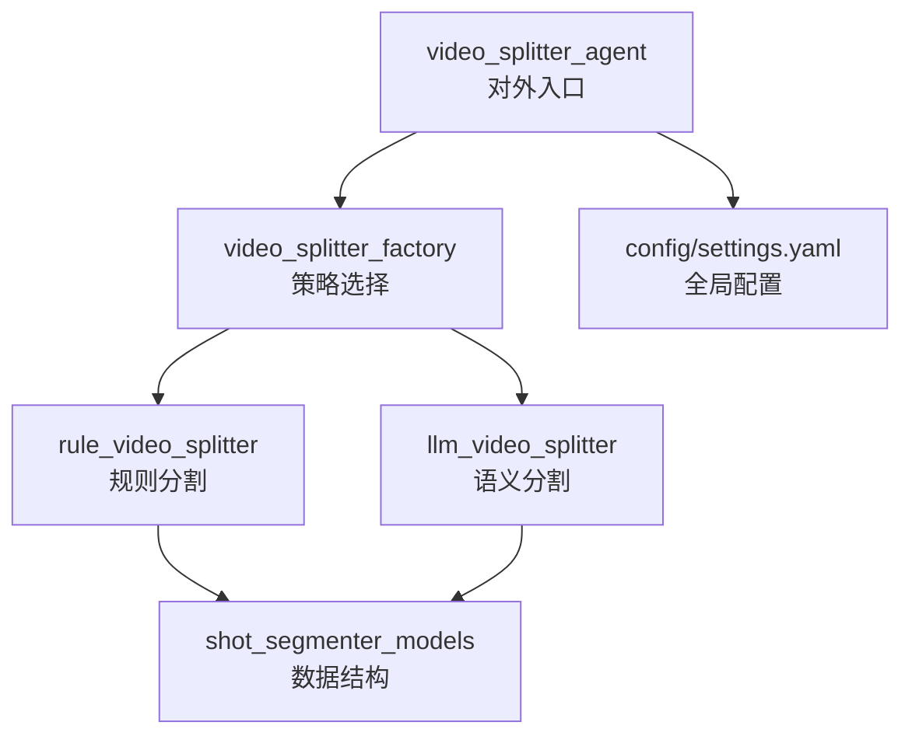
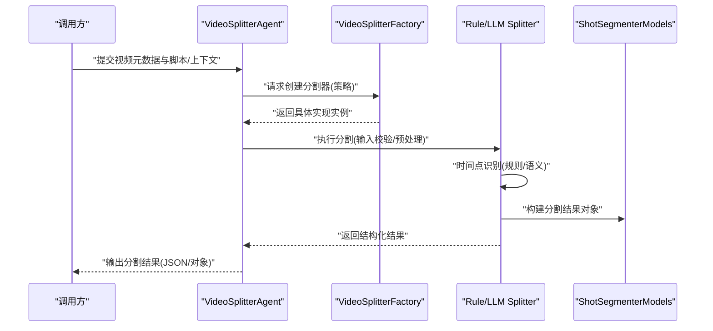
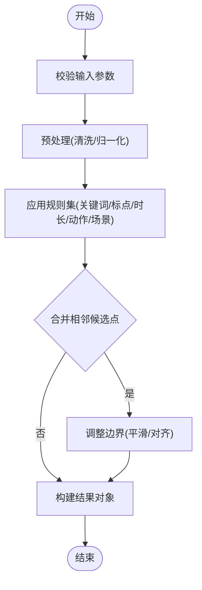
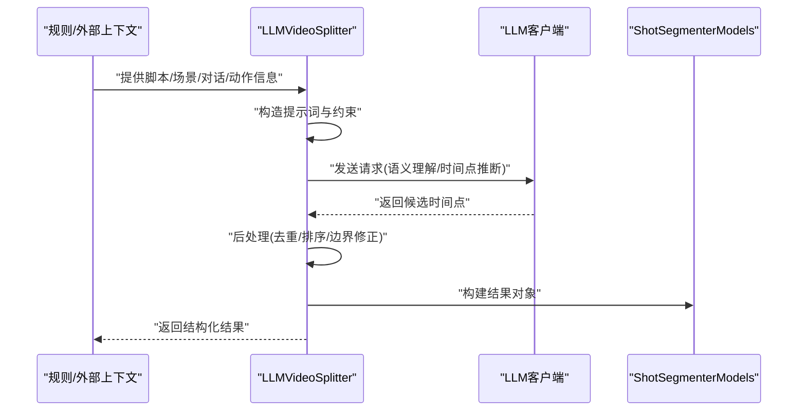
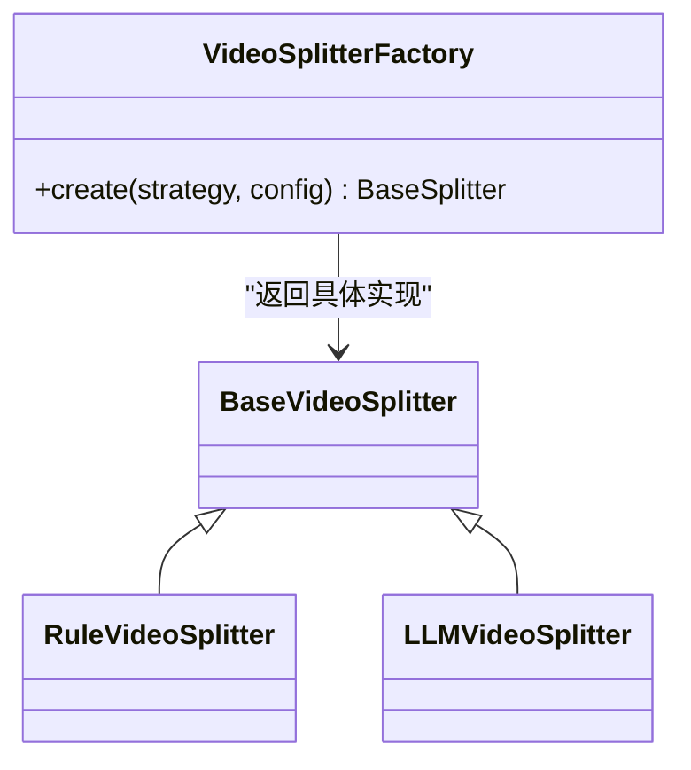
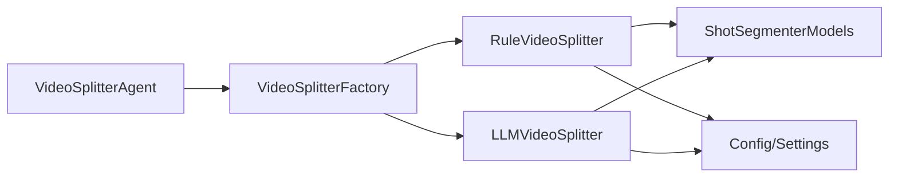

# 视频分割器

<cite>
**本文引用的文件**   
- [src/penshot/neopen/agent/video_splitter_agent.py](file://src/penshot/neopen/agent/video_splitter_agent.py)
- [src/penshot/neopen/agent/video_splitter/__init__.py](file://src/penshot/neopen/agent/video_splitter/__init__.py)
- [src/penshot/neopen/agent/video_splitter/base_video_splitter.py](file://src/penshot/neopen/agent/video_splitter/base_video_splitter.py)
- [src/penshot/neopen/agent/video_splitter/rule_video_splitter.py](file://src/penshot/neopen/agent/video_splitter/rule_video_splitter.py)
- [src/penshot/neopen/agent/video_splitter/llm_video_splitter.py](file://src/penshot/neopen/agent/video_splitter/llm_video_splitter.py)
- [src/penshot/neopen/agent/video_splitter/video_splitter_factory.py](file://src/penshot/neopen/agent/video_splitter/video_splitter_factory.py)
- [src/penshot/neopen/agent/video_splitter/shot_segmenter_models.py](file://src/penshot/neopen/agent/video_splitter/shot_segmenter_models.py)
- [examples/json_demo/video_splitter_result.json](file://examples/json_demo/video_splitter_result.json)
- [examples/direct_usage.py](file://examples/direct_usage.py)
- [src/penshot/config/config.py](file://src/penshot/config/config.py)
- [src/penshot/config/settings.yaml](file://src/penshot/config/settings.yaml)
</cite>

## 目录
1. [简介](#简介)
2. [项目结构](#项目结构)
3. [核心组件](#核心组件)
4. [架构总览](#架构总览)
5. [详细组件分析](#详细组件分析)
6. [依赖关系分析](#依赖关系分析)
7. [性能考量](#性能考量)
8. [故障排除指南](#故障排除指南)
9. [结论](#结论)
10. [附录](#附录)

## 简介
本文件面向“视频分割器”子系统，聚焦于将长视频按时间线切分为若干片段（镜头/段落）的能力。系统提供两类策略：
- 基于语义理解的时间点识别：通过大模型对脚本、场景与对话等上下文进行理解，推断合理的分割时间点。
- 基于规则的分割逻辑：依据关键词、标点、时长阈值、动作/场景变化等规则进行自动切分。

文档涵盖架构设计、数据流处理、输出格式、配置方法、质量评估标准与优化建议，并附带使用示例与故障排除指南。

## 项目结构
视频分割器位于 agent 子系统中，采用工厂模式统一创建不同实现，并通过 Agent 层对外暴露能力。关键目录与职责如下：
- video_splitter：核心实现，包含基类、规则实现、LLM 实现与工厂。
- video_splitter_agent：对外 Agent 封装，负责编排输入、调用分割器、返回结果。
- shot_segmenter_models：共享的数据模型定义，用于描述分割结果的结构。
- examples：示例与演示，包括直接调用与 JSON 示例输出。
- config：全局配置加载与设置。

图表来源
- [src/penshot/neopen/agent/video_splitter_agent.py](file://src/penshot/neopen/agent/video_splitter_agent.py)
- [src/penshot/neopen/agent/video_splitter/video_splitter_factory.py](file://src/penshot/neopen/agent/video_splitter/video_splitter_factory.py)
- [src/penshot/neopen/agent/video_splitter/rule_video_splitter.py](file://src/penshot/neopen/agent/video_splitter/rule_video_splitter.py)
- [src/penshot/neopen/agent/video_splitter/llm_video_splitter.py](file://src/penshot/neopen/agent/video_splitter/llm_video_splitter.py)
- [src/penshot/neopen/agent/video_splitter/shot_segmenter_models.py](file://src/penshot/neopen/agent/video_splitter/shot_segmenter_models.py)
- [src/penshot/config/settings.yaml](file://src/penshot/config/settings.yaml)

章节来源
- [src/penshot/neopen/agent/video_splitter_agent.py](file://src/penshot/neopen/agent/video_splitter_agent.py)
- [src/penshot/neopen/agent/video_splitter/video_splitter_factory.py](file://src/penshot/neopen/agent/video_splitter/video_splitter_factory.py)
- [src/penshot/neopen/agent/video_splitter/rule_video_splitter.py](file://src/penshot/neopen/agent/video_splitter/rule_video_splitter.py)
- [src/penshot/neopen/agent/video_splitter/llm_video_splitter.py](file://src/penshot/neopen/agent/video_splitter/llm_video_splitter.py)
- [src/penshot/neopen/agent/video_splitter/shot_segmenter_models.py](file://src/penshot/neopen/agent/video_splitter/shot_segmenter_models.py)
- [src/penshot/config/settings.yaml](file://src/penshot/config/settings.yaml)

## 核心组件
- 基类 VideoSplitterBase：定义统一的接口契约，包括输入校验、分割主流程、结果规范化与错误处理钩子。
- 规则分割 RuleVideoSplitter：基于关键词、标点、时长阈值、动作/场景标记等规则进行时间点识别与切分。
- LLM 分割 LLMVideoSplitter：结合脚本解析、场景/对话估计等上下文，利用大模型生成或修正分割时间点。
- 工厂 VideoSplitterFactory：根据配置或参数动态选择规则或 LLM 实现。
- 数据模型 ShotSegmenterModels：定义分割结果的字段与约束，确保输出一致性。
- Agent 封装 VideoSplitterAgent：聚合输入、调用工厂获取具体实现、执行分割并返回结构化结果。

章节来源
- [src/penshot/neopen/agent/video_splitter/base_video_splitter.py](file://src/penshot/neopen/agent/video_splitter/base_video_splitter.py)
- [src/penshot/neopen/agent/video_splitter/rule_video_splitter.py](file://src/penshot/neopen/agent/video_splitter/rule_video_splitter.py)
- [src/penshot/neopen/agent/video_splitter/llm_video_splitter.py](file://src/penshot/neopen/agent/video_splitter/llm_video_splitter.py)
- [src/penshot/neopen/agent/video_splitter/video_splitter_factory.py](file://src/penshot/neopen/agent/video_splitter/video_splitter_factory.py)
- [src/penshot/neopen/agent/video_splitter/shot_segmenter_models.py](file://src/penshot/neopen/agent/video_splitter/shot_segmenter_models.py)
- [src/penshot/neopen/agent/video_splitter_agent.py](file://src/penshot/neopen/agent/video_splitter_agent.py)

## 架构总览
视频分割器的整体流程从 Agent 进入，经工厂选择策略，再由具体实现完成时间点识别与分段，最终输出标准化结果。

图表来源
- [src/penshot/neopen/agent/video_splitter_agent.py](file://src/penshot/neopen/agent/video_splitter_agent.py)
- [src/penshot/neopen/agent/video_splitter/video_splitter_factory.py](file://src/penshot/neopen/agent/video_splitter/video_splitter_factory.py)
- [src/penshot/neopen/agent/video_splitter/rule_video_splitter.py](file://src/penshot/neopen/agent/video_splitter/rule_video_splitter.py)
- [src/penshot/neopen/agent/video_splitter/llm_video_splitter.py](file://src/penshot/neopen/agent/video_splitter/llm_video_splitter.py)
- [src/penshot/neopen/agent/video_splitter/shot_segmenter_models.py](file://src/penshot/neopen/agent/video_splitter/shot_segmenter_models.py)

## 详细组件分析

### 基类与接口契约
- 职责：定义统一的输入校验、分割主流程、结果规范化与异常处理钩子；为规则与 LLM 实现提供一致的扩展点。
- 关键点：
  - 输入参数校验（如视频时长、脚本长度、上下文完整性）。
  - 分割主流程模板方法（预处理→时间点识别→后处理→结果组装）。
  - 可插拔的错误处理与日志记录。
  - 结果对象构造遵循统一的数据模型。

章节来源
- [src/penshot/neopen/agent/video_splitter/base_video_splitter.py](file://src/penshot/neopen/agent/video_splitter/base_video_splitter.py)

### 规则分割器（RuleVideoSplitter）
- 职责：基于明确的规则进行时间点识别与切分。
- 典型规则维度：
  - 文本层面：关键词、标点符号、段落边界。
  - 时长层面：最小/最大片段时长阈值、静默段检测。
  - 内容层面：动作/场景标记、对话切换标志。
- 优点：确定性强、速度快、资源消耗低。
- 局限：对复杂语义与跨句意连贯性处理能力有限。

图表来源
- [src/penshot/neopen/agent/video_splitter/rule_video_splitter.py](file://src/penshot/neopen/agent/video_splitter/rule_video_splitter.py)
- [src/penshot/neopen/agent/video_splitter/shot_segmenter_models.py](file://src/penshot/neopen/agent/video_splitter/shot_segmenter_models.py)

章节来源
- [src/penshot/neopen/agent/video_splitter/rule_video_splitter.py](file://src/penshot/neopen/agent/video_splitter/rule_video_splitter.py)
- [src/penshot/neopen/agent/video_splitter/shot_segmenter_models.py](file://src/penshot/neopen/agent/video_splitter/shot_segmenter_models.py)

### LLM 分割器（LLMVideoSplitter）
- 职责：结合脚本解析、场景/对话估计等上下文，利用大模型进行语义理解与时间点推断。
- 典型流程：
  - 收集上下文（脚本、场景标签、对话轮次、动作事件）。
  - 构造提示词与约束，调用 LLM 生成候选时间点。
  - 后处理（去重、排序、边界修正），输出结构化结果。
- 优点：对复杂语义与叙事结构更敏感，能处理跨句意连贯。
- 局限：延迟较高、成本更高、需要稳定的 LLM 服务。

图表来源
- [src/penshot/neopen/agent/video_splitter/llm_video_splitter.py](file://src/penshot/neopen/agent/video_splitter/llm_video_splitter.py)
- [src/penshot/neopen/agent/video_splitter/shot_segmenter_models.py](file://src/penshot/neopen/agent/video_splitter/shot_segmenter_models.py)

章节来源
- [src/penshot/neopen/agent/video_splitter/llm_video_splitter.py](file://src/penshot/neopen/agent/video_splitter/llm_video_splitter.py)
- [src/penshot/neopen/agent/video_splitter/shot_segmenter_models.py](file://src/penshot/neopen/agent/video_splitter/shot_segmenter_models.py)

### 工厂与策略选择（VideoSplitterFactory）
- 职责：根据配置或运行时参数选择规则或 LLM 实现，屏蔽底层差异。
- 选择依据：
  - 配置项（如 strategy=rule|llm）。
  - 输入特征（如脚本复杂度、上下文完整度）。
  - 性能要求（延迟/成本预算）。

图表来源
- [src/penshot/neopen/agent/video_splitter/video_splitter_factory.py](file://src/penshot/neopen/agent/video_splitter/video_splitter_factory.py)
- [src/penshot/neopen/agent/video_splitter/base_video_splitter.py](file://src/penshot/neopen/agent/video_splitter/base_video_splitter.py)
- [src/penshot/neopen/agent/video_splitter/rule_video_splitter.py](file://src/penshot/neopen/agent/video_splitter/rule_video_splitter.py)
- [src/penshot/neopen/agent/video_splitter/llm_video_splitter.py](file://src/penshot/neopen/agent/video_splitter/llm_video_splitter.py)

章节来源
- [src/penshot/neopen/agent/video_splitter/video_splitter_factory.py](file://src/penshot/neopen/agent/video_splitter/video_splitter_factory.py)
- [src/penshot/neopen/agent/video_splitter/base_video_splitter.py](file://src/penshot/neopen/agent/video_splitter/base_video_splitter.py)

### 数据模型（ShotSegmenterModels）
- 职责：定义分割结果的标准结构，确保各实现输出一致。
- 关键字段（概念说明）：
  - 片段标识、起止时间戳、片段类型（场景/对话/动作）、置信度、备注。
  - 可选：关联的脚本行号、关键词、动作/场景标签。
- 作用：便于下游消费（渲染、编辑、评测）与统一存储。

章节来源
- [src/penshot/neopen/agent/video_splitter/shot_segmenter_models.py](file://src/penshot/neopen/agent/video_splitter/shot_segmenter_models.py)

### Agent 封装（VideoSplitterAgent）
- 职责：对外暴露统一 API，负责输入校验、策略选择、执行分割与结果返回。
- 特点：
  - 支持多策略切换与配置注入。
  - 统一错误处理与日志记录。
  - 与上层工作流集成（任务编排、记忆、工具调用）。

章节来源
- [src/penshot/neopen/agent/video_splitter_agent.py](file://src/penshot/neopen/agent/video_splitter_agent.py)

## 依赖关系分析
- 内部依赖：
  - Agent 依赖工厂与具体实现。
  - 具体实现依赖数据模型与配置。
- 外部依赖：
  - LLM 客户端（由 LLM 分割器调用）。
  - 配置文件（settings.yaml 与 config.py 加载）。

图表来源
- [src/penshot/neopen/agent/video_splitter_agent.py](file://src/penshot/neopen/agent/video_splitter_agent.py)
- [src/penshot/neopen/agent/video_splitter/video_splitter_factory.py](file://src/penshot/neopen/agent/video_splitter/video_splitter_factory.py)
- [src/penshot/neopen/agent/video_splitter/rule_video_splitter.py](file://src/penshot/neopen/agent/video_splitter/rule_video_splitter.py)
- [src/penshot/neopen/agent/video_splitter/llm_video_splitter.py](file://src/penshot/neopen/agent/video_splitter/llm_video_splitter.py)
- [src/penshot/neopen/agent/video_splitter/shot_segmenter_models.py](file://src/penshot/neopen/agent/video_splitter/shot_segmenter_models.py)
- [src/penshot/config/config.py](file://src/penshot/config/config.py)
- [src/penshot/config/settings.yaml](file://src/penshot/config/settings.yaml)

章节来源
- [src/penshot/neopen/agent/video_splitter_agent.py](file://src/penshot/neopen/agent/video_splitter_agent.py)
- [src/penshot/neopen/agent/video_splitter/video_splitter_factory.py](file://src/penshot/neopen/agent/video_splitter/video_splitter_factory.py)
- [src/penshot/neopen/agent/video_splitter/rule_video_splitter.py](file://src/penshot/neopen/agent/video_splitter/rule_video_splitter.py)
- [src/penshot/neopen/agent/video_splitter/llm_video_splitter.py](file://src/penshot/neopen/agent/video_splitter/llm_video_splitter.py)
- [src/penshot/neopen/agent/video_splitter/shot_segmenter_models.py](file://src/penshot/neopen/agent/video_splitter/shot_segmenter_models.py)
- [src/penshot/config/config.py](file://src/penshot/config/config.py)
- [src/penshot/config/settings.yaml](file://src/penshot/config/settings.yaml)

## 性能考量
- 规则分割：
  - 优势：低延迟、低资源占用，适合批量与实时场景。
  - 优化：规则缓存、并行扫描、阈值自适应。
- LLM 分割：
  - 优势：语义理解强，适合复杂叙事与跨句意连贯。
  - 优化：提示词精简、批量请求、结果缓存、重试与降级策略。
- 混合策略：
  - 先用规则快速粗切，再用 LLM 精修边界，平衡效率与质量。

[本节为通用指导，不直接分析具体文件]

## 故障排除指南
- 常见问题：
  - 输入不完整或缺失关键字段：检查 Agent 输入校验与默认值。
  - 规则误切或漏切：调整关键词库、阈值与合并策略。
  - LLM 超时或失败：配置重试、降级到规则策略、增加超时与限流。
  - 输出不一致：确认数据模型版本与序列化格式。
- 定位步骤：
  - 查看日志与中间结果（预处理、候选点、后处理）。
  - 对比规则与 LLM 的结果差异，定位问题来源。
  - 使用示例脚本复现问题，逐步缩小范围。

章节来源
- [src/penshot/neopen/agent/video_splitter/base_video_splitter.py](file://src/penshot/neopen/agent/video_splitter/base_video_splitter.py)
- [src/penshot/neopen/agent/video_splitter/rule_video_splitter.py](file://src/penshot/neopen/agent/video_splitter/rule_video_splitter.py)
- [src/penshot/neopen/agent/video_splitter/llm_video_splitter.py](file://src/penshot/neopen/agent/video_splitter/llm_video_splitter.py)
- [src/penshot/neopen/agent/video_splitter/shot_segmenter_models.py](file://src/penshot/neopen/agent/video_splitter/shot_segmenter_models.py)

## 结论
视频分割器通过“规则+语义”的双轨策略，兼顾效率与质量。基类抽象与工厂模式使系统具备良好的可扩展性与可维护性。建议在工程实践中采用混合策略与降级机制，并结合质量评估指标持续优化。

[本节为总结，不直接分析具体文件]

## 附录

### 配置方法与策略选择
- 策略选择：
  - 通过配置项指定 strategy=rule|llm，或由 Agent 根据输入特征自动选择。
- 关键配置项（概念说明）：
  - 规则阈值（最小/最大片段时长、关键词权重）。
  - LLM 参数（模型、温度、最大令牌数、重试次数）。
  - 输出格式（JSON/对象）、是否包含置信度与备注。
- 配置文件位置：
  - settings.yaml 与 config.py 提供全局设置与加载逻辑。

章节来源
- [src/penshot/config/config.py](file://src/penshot/config/config.py)
- [src/penshot/config/settings.yaml](file://src/penshot/config/settings.yaml)

### 输出格式与示例
- 输出结构：
  - 遵循 ShotSegmenterModels 定义，包含片段起止时间、类型、置信度与备注等字段。
- 示例结果：
  - 参考示例 JSON 文件，了解实际输出结构与字段含义。

章节来源
- [src/penshot/neopen/agent/video_splitter/shot_segmenter_models.py](file://src/penshot/neopen/agent/video_splitter/shot_segmenter_models.py)
- [examples/json_demo/video_splitter_result.json](file://examples/json_demo/video_splitter_result.json)

### 使用示例
- 直接调用：
  - 参考 direct_usage.py，展示如何初始化 Agent、选择策略、传入输入并获取结果。
- 端到端流程：
  - 从输入准备、策略选择、执行分割到结果消费的完整链路。

章节来源
- [examples/direct_usage.py](file://examples/direct_usage.py)
- [src/penshot/neopen/agent/video_splitter_agent.py](file://src/penshot/neopen/agent/video_splitter_agent.py)

### 质量评估标准与优化建议
- 评估指标（概念说明）：
  - 时间点准确率（与人工标注对比）、片段完整性、边界平滑度、语义连贯性。
- 优化建议：
  - 规则侧：完善关键词库、引入上下文窗口、动态阈值。
  - LLM 侧：改进提示词、增加约束与校验、引入后处理规则。
  - 混合策略：先粗切再精修，结合置信度过滤与人工复核。

[本节为通用指导，不直接分析具体文件]