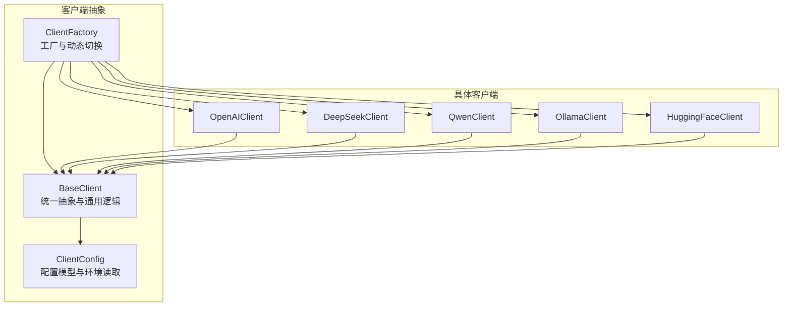
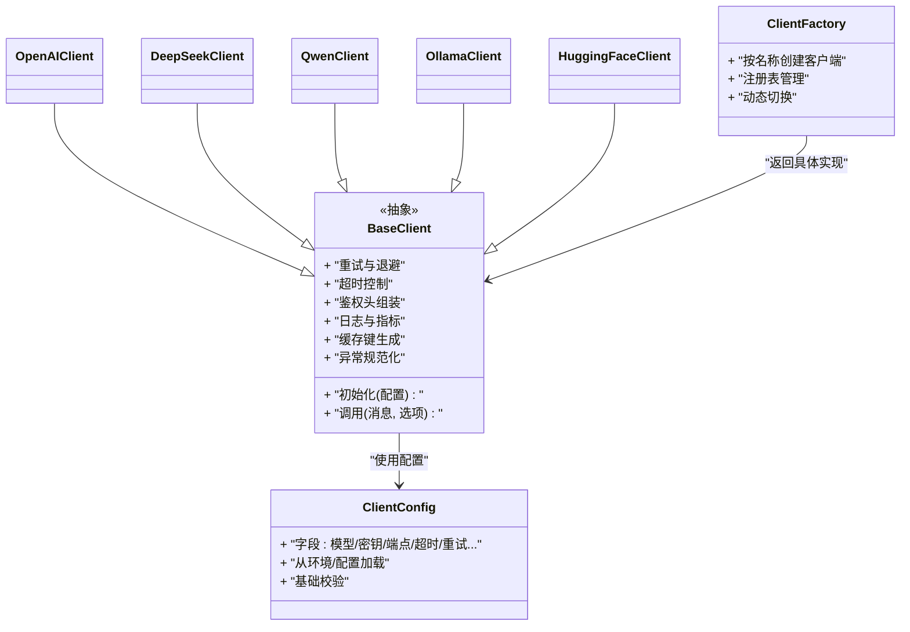
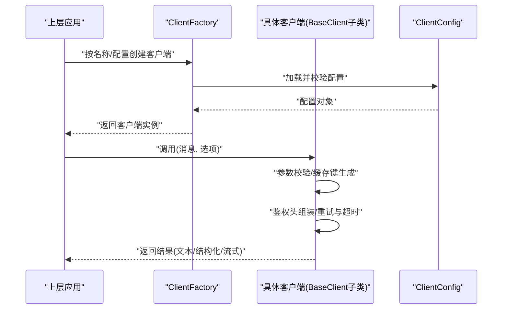
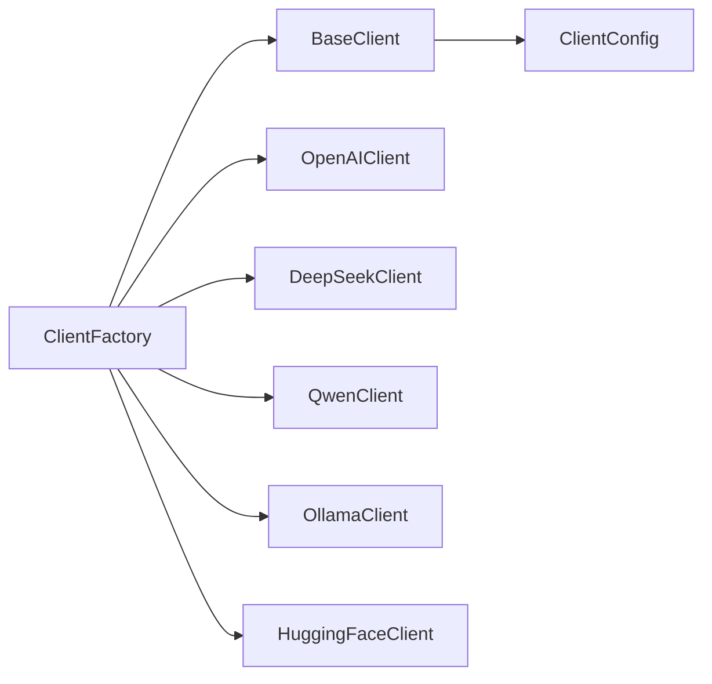

# LLM客户端实现

<cite>
**本文引用的文件**   
- [base_client.py](file://src/penshot/app/client/base_client.py)
- [client_config.py](file://src/penshot/app/client/client_config.py)
- [client_factory.py](file://src/penshot/app/client/client_factory.py)
- [openai_client.py](file://src/penshot/app/client/llm/openai_client.py)
- [deepseek_client.py](file://src/penshot/app/client/llm/deepseek_client.py)
- [qwen_client.py](file://src/penshot/app/client/llm/qwen_client.py)
- [ollama_client.py](file://src/penshot/app/client/llm/ollama_client.py)
- [huggingface_client.py](file://src/penshot/app/client/llm/huggingface_client.py)
</cite>

## 目录
1. [简介](#简介)
2. [项目结构](#项目结构)
3. [核心组件](#核心组件)
4. [架构总览](#架构总览)
5. [详细组件分析](#详细组件分析)
6. [依赖关系分析](#依赖关系分析)
7. [性能考虑](#性能考虑)
8. [故障排查指南](#故障排查指南)
9. [结论](#结论)
10. [附录：新客户端集成指南](#附录新客户端集成指南)

## 简介
本文件面向需要理解与扩展LLM客户端实现的开发者，聚焦于统一抽象接口设计、具体客户端差异、工厂模式与动态切换机制，并提供新客户端的集成开发指南、认证配置、请求格式转换、错误处理策略以及性能优化建议。目标是在不侵入上层业务的前提下，实现对OpenAI、DeepSeek、Qwen、Ollama、HuggingFace等主流模型的统一接入与灵活切换。

## 项目结构
LLM客户端相关代码位于应用层的客户端模块中，采用“基类+具体实现+工厂”的分层组织方式：
- 抽象与配置
  - base_client.py：定义统一抽象接口与通用能力（重试、超时、鉴权、日志、缓存键生成等）
  - client_config.py：封装各客户端的配置模型与环境变量读取
  - client_factory.py：提供按名称或配置动态创建客户端实例的工厂方法
- 具体客户端实现
  - openai_client.py：适配OpenAI兼容API
  - deepseek_client.py：适配DeepSeek API
  - qwen_client.py：适配通义千问（Qwen）API
  - ollama_client.py：适配本地Ollama服务
  - huggingface_client.py：适配HuggingFace推理端点

图表来源
- [base_client.py](file://src/penshot/app/client/base_client.py)
- [client_config.py](file://src/penshot/app/client/client_config.py)
- [client_factory.py](file://src/penshot/app/client/client_factory.py)
- [openai_client.py](file://src/penshot/app/client/llm/openai_client.py)
- [deepseek_client.py](file://src/penshot/app/client/llm/deepseek_client.py)
- [qwen_client.py](file://src/penshot/app/client/llm/qwen_client.py)
- [ollama_client.py](file://src/penshot/app/client/llm/ollama_client.py)
- [huggingface_client.py](file://src/penshot/app/client/llm/huggingface_client.py)

章节来源
- [base_client.py](file://src/penshot/app/client/base_client.py)
- [client_config.py](file://src/penshot/app/client/client_config.py)
- [client_factory.py](file://src/penshot/app/client/client_factory.py)
- [openai_client.py](file://src/penshot/app/client/llm/openai_client.py)
- [deepseek_client.py](file://src/penshot/app/client/llm/deepseek_client.py)
- [qwen_client.py](file://src/penshot/app/client/llm/qwen_client.py)
- [ollama_client.py](file://src/penshot/app/client/llm/ollama_client.py)
- [huggingface_client.py](file://src/penshot/app/client/llm/huggingface_client.py)

## 核心组件
- BaseClient（统一抽象）
  - 职责：定义统一的调用入口、参数校验、重试与退避、超时控制、鉴权头组装、日志与指标埋点、缓存键生成、异常规范化等。
  - 扩展点：子类需实现的具体发送逻辑（如HTTP请求构造、流式响应处理、工具函数调用映射等）。
- ClientConfig（配置模型）
  - 职责：为不同客户端提供类型安全的配置对象，支持从环境变量或配置文件加载默认值，并做基础校验。
- ClientFactory（工厂）
  - 职责：根据名称或配置选择并实例化具体客户端；维护注册表；支持运行时动态切换。

章节来源
- [base_client.py](file://src/penshot/app/client/base_client.py)
- [client_config.py](file://src/penshot/app/client/client_config.py)
- [client_factory.py](file://src/penshot/app/client/client_factory.py)

## 架构总览
整体采用“抽象-实现-工厂”的三层结构，上层通过工厂获取客户端实例，屏蔽底层差异。

图表来源
- [base_client.py](file://src/penshot/app/client/base_client.py)
- [client_config.py](file://src/penshot/app/client/client_config.py)
- [client_factory.py](file://src/penshot/app/client/client_factory.py)
- [openai_client.py](file://src/penshot/app/client/llm/openai_client.py)
- [deepseek_client.py](file://src/penshot/app/client/llm/deepseek_client.py)
- [qwen_client.py](file://src/penshot/app/client/llm/qwen_client.py)
- [ollama_client.py](file://src/penshot/app/client/llm/ollama_client.py)
- [huggingface_client.py](file://src/penshot/app/client/llm/huggingface_client.py)

## 详细组件分析

### BaseClient 基类
- 统一抽象接口
  - 定义标准调用签名，包括消息列表、生成参数、工具调用、流式输出等。
  - 提供通用的参数校验、默认值填充、缓存键生成。
- 通用能力
  - 重试与指数退避：对可重试错误进行自动重试，避免瞬时失败影响稳定性。
  - 超时控制：区分连接超时与读取超时，防止长时间阻塞。
  - 鉴权头组装：根据配置注入Authorization或其他必要头部。
  - 日志与指标：记录请求/响应摘要、耗时、状态码、错误码等。
  - 异常规范化：将不同供应商的错误转换为统一异常类型，便于上层处理。
- 扩展点
  - 子类仅需实现“如何发送请求与解析响应”，其余通用逻辑由基类承担。

章节来源
- [base_client.py](file://src/penshot/app/client/base_client.py)

### 客户端配置 ClientConfig
- 配置项
  - 典型字段：模型名称、API密钥、服务端点、超时、最大重试次数、并发限制、缓存开关等。
- 加载与校验
  - 支持从环境变量或配置文件加载，缺失必填项时给出明确提示。
  - 提供默认值与范围校验，减少运行期错误。

章节来源
- [client_config.py](file://src/penshot/app/client/client_config.py)

### 客户端工厂 ClientFactory
- 动态切换
  - 通过名称或配置选择具体客户端实现，支持在运行时切换后端。
- 注册表
  - 集中管理已注册的客户端类型，新增客户端后需在注册表中登记。
- 生命周期
  - 负责实例化与必要的初始化工作，确保客户端可用。

章节来源
- [client_factory.py](file://src/penshot/app/client/client_factory.py)

### OpenAI 客户端
- 适配要点
  - 遵循OpenAI兼容的消息结构与参数命名。
  - 支持流式与非流式响应，工具调用映射到统一接口。
- 差异化处理
  - 针对OpenAI特有的参数（如top_p、frequency_penalty等）进行透传与默认值设置。
- 错误处理
  - 将OpenAI错误码映射为统一异常，包含重试建议。

章节来源
- [openai_client.py](file://src/penshot/app/client/llm/openai_client.py)

### DeepSeek 客户端
- 适配要点
  - 对齐DeepSeek的端点与参数约定，必要时做字段名映射。
- 差异化处理
  - 针对其特有参数（如温度、TopK等）进行规范化处理。
- 错误处理
  - 捕获并转换特定错误码，补充上下文信息以便定位问题。

章节来源
- [deepseek_client.py](file://src/penshot/app/client/llm/deepseek_client.py)

### Qwen 客户端
- 适配要点
  - 适配通义千问的API规范，包括消息格式与可选参数。
- 差异化处理
  - 对Qwen特有的功能（如系统提示、工具调用）进行桥接。
- 错误处理
  - 将平台错误转换为统一异常，保留原始错误码与消息。

章节来源
- [qwen_client.py](file://src/penshot/app/client/llm/qwen_client.py)

### Ollama 客户端
- 适配要点
  - 对接本地Ollama服务，通常基于REST或流式接口。
- 差异化处理
  - 处理本地服务的特殊行为（如模型加载、会话保持、流式分块）。
- 错误处理
  - 针对连接失败、模型不存在等场景给出明确错误信息。

章节来源
- [ollama_client.py](file://src/penshot/app/client/llm/ollama_client.py)

### HuggingFace 客户端
- 适配要点
  - 适配HuggingFace推理端点的请求结构与认证方式。
- 差异化处理
  - 处理大模型推理的特殊参数与分页/流式输出。
- 错误处理
  - 将服务不可用、配额不足等错误标准化，便于上层重试或降级。

章节来源
- [huggingface_client.py](file://src/penshot/app/client/llm/huggingface_client.py)

### 调用流程时序图（以工厂创建并调用为例）

图表来源
- [client_factory.py](file://src/penshot/app/client/client_factory.py)
- [client_config.py](file://src/penshot/app/client/client_config.py)
- [base_client.py](file://src/penshot/app/client/base_client.py)

## 依赖关系分析
- 耦合与内聚
  - BaseClient高度内聚通用逻辑，具体客户端仅关注协议差异，降低耦合度。
  - ClientFactory集中管理实例化与注册，避免散落的if-else分支。
- 外部依赖
  - 各客户端可能依赖不同的HTTP库或SDK，但通过统一异常与配置隔离，不影响上层。
- 潜在循环依赖
  - 当前分层清晰，未见循环依赖迹象。

图表来源
- [client_factory.py](file://src/penshot/app/client/client_factory.py)
- [base_client.py](file://src/penshot/app/client/base_client.py)
- [client_config.py](file://src/penshot/app/client/client_config.py)
- [openai_client.py](file://src/penshot/app/client/llm/openai_client.py)
- [deepseek_client.py](file://src/penshot/app/client/llm/deepseek_client.py)
- [qwen_client.py](file://src/penshot/app/client/llm/qwen_client.py)
- [ollama_client.py](file://src/penshot/app/client/llm/ollama_client.py)
- [huggingface_client.py](file://src/penshot/app/client/llm/huggingface_client.py)

章节来源
- [client_factory.py](file://src/penshot/app/client/client_factory.py)
- [base_client.py](file://src/penshot/app/client/base_client.py)
- [client_config.py](file://src/penshot/app/client/client_config.py)

## 性能考虑
- 连接复用与池化
  - 复用HTTP连接，减少握手开销；合理设置连接池大小。
- 并发与限流
  - 控制并发请求数，避免触发远端限流；结合令牌桶或滑动窗口进行速率控制。
- 超时与重试
  - 细粒度设置连接/读取超时；对幂等请求启用指数退避重试。
- 缓存
  - 对相同输入（含生成参数）启用响应缓存，显著降低重复请求成本。
- 流式输出
  - 优先使用流式接口，降低首字延迟，提升交互体验。
- 序列化与压缩
  - 合理使用JSON压缩与最小化payload，减少网络传输体积。

[本节为通用指导，无需源码引用]

## 故障排查指南
- 常见问题
  - 认证失败：检查密钥、端点URL、域名与端口是否正确；确认鉴权头是否被正确注入。
  - 超时/连接失败：调整超时阈值；检查网络连通性与代理设置。
  - 限流/配额不足：降低并发或增加重试间隔；监控上游配额使用情况。
  - 参数不兼容：核对目标平台的参数命名与取值范围，必要时在客户端内进行映射。
- 诊断手段
  - 开启详细日志，记录请求摘要、响应状态码与错误码。
  - 使用统一的异常类型与堆栈信息快速定位问题。
  - 对关键路径添加指标埋点（耗时、成功率、错误分布）。

章节来源
- [base_client.py](file://src/penshot/app/client/base_client.py)
- [client_config.py](file://src/penshot/app/client/client_config.py)

## 结论
通过统一抽象与工厂模式，本项目实现了多LLM供应商的一致接入与灵活切换。BaseClient承载通用能力，具体客户端专注协议适配，配合完善的配置与错误处理，既保证了稳定性，也提升了可扩展性。建议在新增客户端时严格遵循统一接口与错误规范，并结合性能优化实践，以获得更好的用户体验与资源利用率。

[本节为总结，无需源码引用]

## 附录：新客户端集成指南
- 步骤概览
  1. 新建客户端类并继承BaseClient，实现发送与解析逻辑。
  2. 在ClientFactory中注册新客户端类型，支持按名称创建。
  3. 在ClientConfig中为新客户端添加必要配置项，完成加载与校验。
  4. 编写单元测试覆盖正常路径、错误路径与边界条件。
- 认证配置
  - 在配置中声明密钥、端点、自定义头部等；从环境变量或配置文件安全加载。
  - 在BaseClient中统一组装鉴权头，避免在各客户端重复实现。
- 请求格式转换
  - 将统一消息模型转换为目标平台要求的格式；注意字段名、枚举值与必填项。
  - 对于工具调用、系统提示等特性，做好映射与兼容性处理。
- 错误处理策略
  - 捕获平台特定错误，转换为统一异常；记录错误码与上下文。
  - 对可重试错误启用指数退避；对不可重试错误快速失败并上报。
- 性能优化建议
  - 启用连接复用与合理的并发限制；对热点请求启用缓存。
  - 优先使用流式接口；合理设置超时与重试策略。
- 最佳实践
  - 保持客户端无状态，避免在客户端内部保存长生命周期状态。
  - 所有对外暴露的接口遵循统一签名与返回值约定。
  - 完善日志与指标，便于线上问题定位与容量规划。

章节来源
- [base_client.py](file://src/penshot/app/client/base_client.py)
- [client_config.py](file://src/penshot/app/client/client_config.py)
- [client_factory.py](file://src/penshot/app/client/client_factory.py)