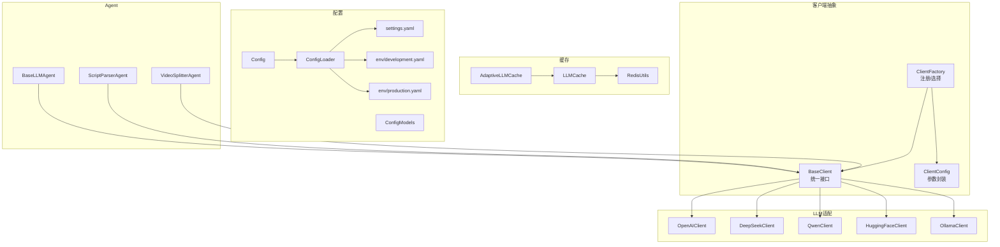
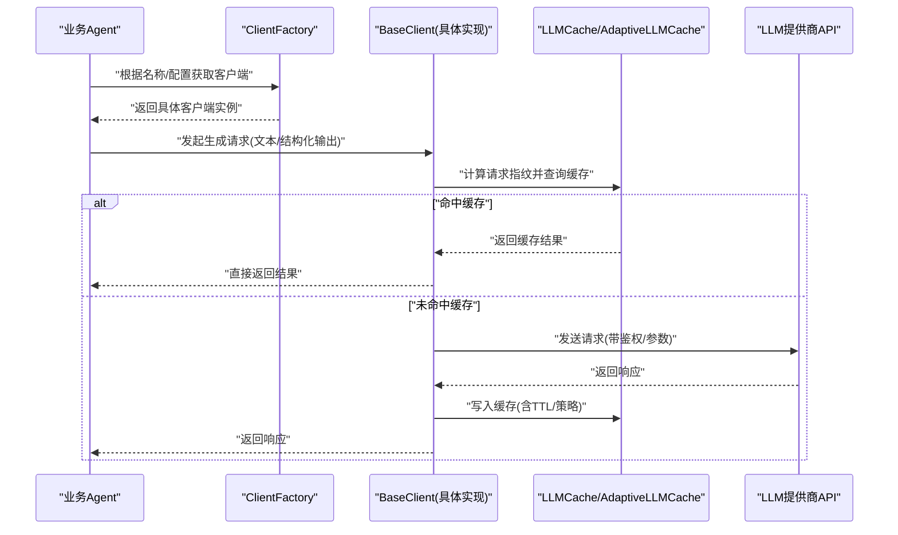
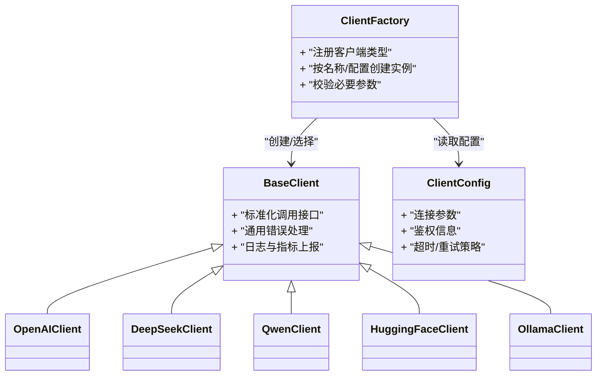
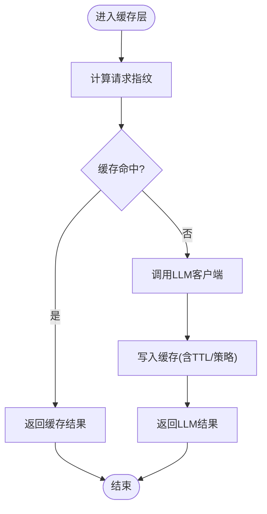
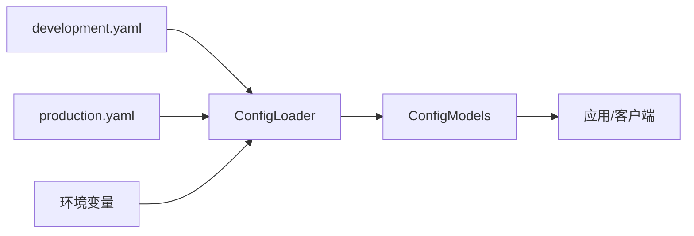
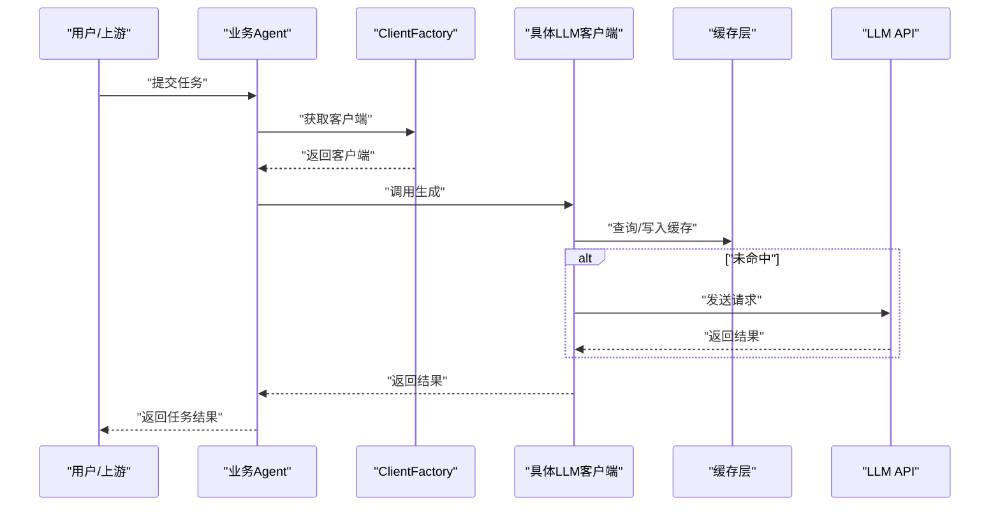
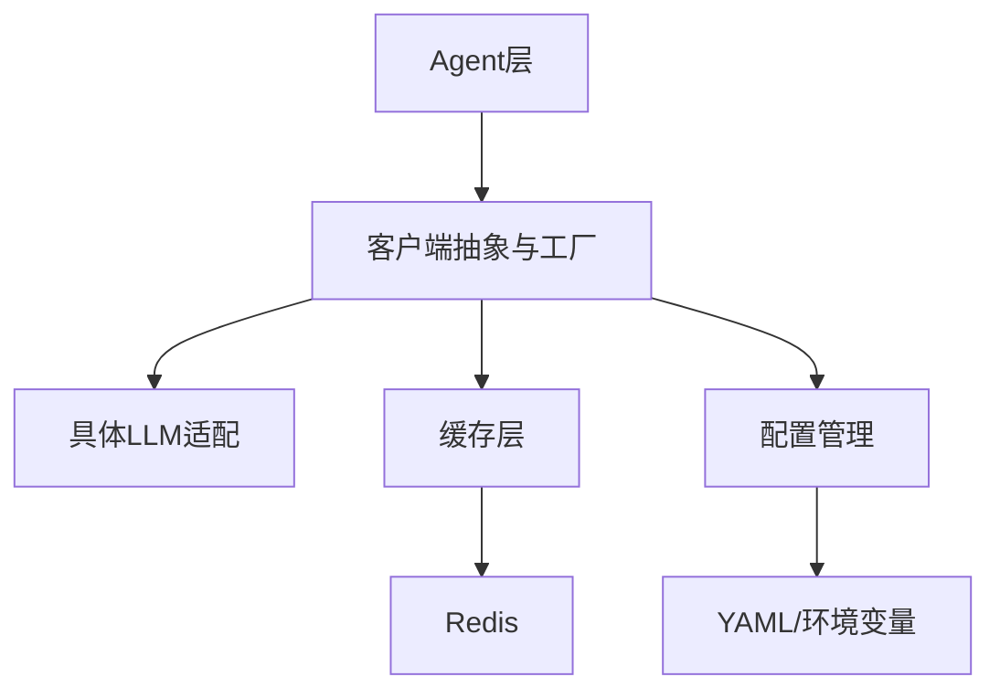

# 大语言模型集成

<cite>
**本文引用的文件**   
- [src/penshot/app/client/base_client.py](file://src/penshot/app/client/base_client.py)
- [src/penshot/app/client/client_factory.py](file://src/penshot/app/client/client_factory.py)
- [src/penshot/app/client/client_config.py](file://src/penshot/app/client/client_config.py)
- [src/penshot/app/client/llm/openai_client.py](file://src/penshot/app/client/llm/openai_client.py)
- [src/penshot/app/client/llm/deepseek_client.py](file://src/penshot/app/client/llm/deepseek_client.py)
- [src/penshot/app/client/llm/qwen_client.py](file://src/penshot/app/client/llm/qwen_client.py)
- [src/penshot/app/client/llm/huggingface_client.py](file://src/penshot/app/client/llm/huggingface_client.py)
- [src/penshot/app/client/llm/ollama_client.py](file://src/penshot/app/client/llm/ollama_client.py)
- [src/penshot/app/cache/llm_cache.py](file://src/penshot/app/cache/llm_cache.py)
- [src/penshot/app/cache/adaptive_llm_cache.py](file://src/penshot/app/cache/adaptive_llm_cache.py)
- [src/penshot/config/config.py](file://src/penshot/config/config.py)
- [src/penshot/config/config_loader.py](file://src/penshot/config/config_loader.py)
- [src/penshot/config/config_models.py](file://src/penshot/config/config_models.py)
- [src/penshot/config/settings.yaml](file://src/penshot/config/settings.yaml)
- [src/penshot/config/env/development.yaml](file://src/penshot/config/env/development.yaml)
- [src/penshot/config/env/production.yaml](file://src/penshot/config/env/production.yaml)
- [src/penshot/utils/env_utils.py](file://src/penshot/utils/env_utils.py)
- [src/penshot/utils/redis_utils.py](file://src/penshot/utils/redis_utils.py)
- [src/penshot/app/agent/base_llm_agent.py](file://src/penshot/app/agent/base_llm_agent.py)
- [src/penshot/app/agent/script_parser_agent.py](file://src/penshot/app/agent/script_parser_agent.py)
- [src/penshot/app/agent/video_splitter_agent.py](file://src/penshot/app/agent/video_splitter_agent.py)
- [examples/direct_usage.py](file://examples/direct_usage.py)
</cite>

## 目录
1. [简介](#简介)
2. [项目结构](#项目结构)
3. [核心组件](#核心组件)
4. [架构总览](#架构总览)
5. [详细组件分析](#详细组件分析)
6. [依赖关系分析](#依赖关系分析)
7. [性能与缓存优化](#性能与缓存优化)
8. [配置管理与动态切换](#配置管理与动态切换)
9. [新LLM客户端集成指南](#新llm客户端集成指南)
10. [成本控制与安全考虑](#成本控制与安全考虑)
11. [模型对比与使用建议](#模型对比与使用建议)
12. [故障排查指南](#故障排查指南)
13. [结论](#结论)

## 简介
本文件面向“大语言模型集成”主题，系统性阐述多LLM客户端的统一抽象设计、主流模型适配（OpenAI、DeepSeek、Qwen等）、缓存策略与性能优化、配置管理与动态切换机制，并提供新LLM客户端的集成指南。同时涵盖成本控制、安全考量以及不同模型的性能对比与使用建议，帮助读者快速理解并高效扩展系统能力。

## 项目结构
围绕LLM集成的关键目录与职责如下：
- 客户端抽象与工厂：定义统一接口、注册与选择具体实现
- LLM适配层：针对各厂商/平台的具体实现
- 缓存层：请求级缓存与自适应策略
- 配置层：集中式配置加载与环境化设置
- Agent层：业务Agent通过统一客户端调用LLM
- 工具与辅助：环境变量读取、Redis缓存工具等

图表来源
- [src/penshot/app/client/base_client.py](file://src/penshot/app/client/base_client.py)
- [src/penshot/app/client/client_factory.py](file://src/penshot/app/client/client_factory.py)
- [src/penshot/app/client/client_config.py](file://src/penshot/app/client/client_config.py)
- [src/penshot/app/client/llm/openai_client.py](file://src/penshot/app/client/llm/openai_client.py)
- [src/penshot/app/client/llm/deepseek_client.py](file://src/penshot/app/client/llm/deepseek_client.py)
- [src/penshot/app/client/llm/qwen_client.py](file://src/penshot/app/client/llm/qwen_client.py)
- [src/penshot/app/client/llm/huggingface_client.py](file://src/penshot/app/client/llm/huggingface_client.py)
- [src/penshot/app/client/llm/ollama_client.py](file://src/penshot/app/client/llm/ollama_client.py)
- [src/penshot/app/cache/llm_cache.py](file://src/penshot/app/cache/llm_cache.py)
- [src/penshot/app/cache/adaptive_llm_cache.py](file://src/penshot/app/cache/adaptive_llm_cache.py)
- [src/penshot/utils/redis_utils.py](file://src/penshot/utils/redis_utils.py)
- [src/penshot/config/config.py](file://src/penshot/config/config.py)
- [src/penshot/config/config_loader.py](file://src/penshot/config/config_loader.py)
- [src/penshot/config/config_models.py](file://src/penshot/config/config_models.py)
- [src/penshot/config/settings.yaml](file://src/penshot/config/settings.yaml)
- [src/penshot/config/env/development.yaml](file://src/penshot/config/env/development.yaml)
- [src/penshot/config/env/production.yaml](file://src/penshot/config/env/production.yaml)
- [src/penshot/app/agent/base_llm_agent.py](file://src/penshot/app/agent/base_llm_agent.py)
- [src/penshot/app/agent/script_parser_agent.py](file://src/penshot/app/agent/script_parser_agent.py)
- [src/penshot/app/agent/video_splitter_agent.py](file://src/penshot/app/agent/video_splitter_agent.py)

章节来源
- [src/penshot/app/client/base_client.py](file://src/penshot/app/client/base_client.py)
- [src/penshot/app/client/client_factory.py](file://src/penshot/app/client/client_factory.py)
- [src/penshot/app/client/client_config.py](file://src/penshot/app/client/client_config.py)
- [src/penshot/app/cache/llm_cache.py](file://src/penshot/app/cache/llm_cache.py)
- [src/penshot/app/cache/adaptive_llm_cache.py](file://src/penshot/app/cache/adaptive_llm_cache.py)
- [src/penshot/config/config.py](file://src/penshot/config/config.py)
- [src/penshot/config/config_loader.py](file://src/penshot/config/config_loader.py)
- [src/penshot/config/config_models.py](file://src/penshot/config/config_models.py)
- [src/penshot/config/settings.yaml](file://src/penshot/config/settings.yaml)
- [src/penshot/config/env/development.yaml](file://src/penshot/config/env/development.yaml)
- [src/penshot/config/env/production.yaml](file://src/penshot/config/env/production.yaml)
- [src/penshot/app/agent/base_llm_agent.py](file://src/penshot/app/agent/base_llm_agent.py)
- [src/penshot/app/agent/script_parser_agent.py](file://src/penshot/app/agent/script_parser_agent.py)
- [src/penshot/app/agent/video_splitter_agent.py](file://src/penshot/app/agent/video_splitter_agent.py)

## 核心组件
- 统一客户端抽象：提供一致的调用接口，屏蔽底层差异
- 客户端工厂：按名称或配置动态创建并返回具体客户端实例
- 客户端配置：封装各模型所需的连接参数、鉴权信息、超时与重试等
- LLM适配实现：分别对接OpenAI、DeepSeek、Qwen、HuggingFace、Ollama等平台
- 缓存层：对LLM请求进行键控缓存，支持本地与Redis后端，含自适应策略
- 配置管理：集中加载YAML/环境变量，支持环境隔离与热更新
- Agent集成：业务Agent通过统一接口调用LLM，无需关心具体实现

章节来源
- [src/penshot/app/client/base_client.py](file://src/penshot/app/client/base_client.py)
- [src/penshot/app/client/client_factory.py](file://src/penshot/app/client/client_factory.py)
- [src/penshot/app/client/client_config.py](file://src/penshot/app/client/client_config.py)
- [src/penshot/app/cache/llm_cache.py](file://src/penshot/app/cache/llm_cache.py)
- [src/penshot/app/cache/adaptive_llm_cache.py](file://src/penshot/app/cache/adaptive_llm_cache.py)
- [src/penshot/config/config.py](file://src/penshot/config/config.py)
- [src/penshot/config/config_loader.py](file://src/penshot/config/config_loader.py)
- [src/penshot/config/config_models.py](file://src/penshot/config/config_models.py)

## 架构总览
下图展示了从Agent到具体LLM客户端的调用路径，以及缓存与配置的参与方式。

图表来源
- [src/penshot/app/client/client_factory.py](file://src/penshot/app/client/client_factory.py)
- [src/penshot/app/client/base_client.py](file://src/penshot/app/client/base_client.py)
- [src/penshot/app/cache/llm_cache.py](file://src/penshot/app/cache/llm_cache.py)
- [src/penshot/app/cache/adaptive_llm_cache.py](file://src/penshot/app/cache/adaptive_llm_cache.py)
- [src/penshot/app/agent/base_llm_agent.py](file://src/penshot/app/agent/base_llm_agent.py)

## 详细组件分析

### 统一客户端抽象与工厂
- 统一接口：定义标准化的调用方法、参数结构与返回值约定，确保上层Agent无感知切换
- 工厂模式：维护客户端注册表，支持按名称或配置项动态创建实例；便于新增客户端时仅做注册
- 配置封装：将鉴权、端点、超时、重试、并发等参数集中管理，避免散落在各处

图表来源
- [src/penshot/app/client/base_client.py](file://src/penshot/app/client/base_client.py)
- [src/penshot/app/client/client_factory.py](file://src/penshot/app/client/client_factory.py)
- [src/penshot/app/client/client_config.py](file://src/penshot/app/client/client_config.py)
- [src/penshot/app/client/llm/openai_client.py](file://src/penshot/app/client/llm/openai_client.py)
- [src/penshot/app/client/llm/deepseek_client.py](file://src/penshot/app/client/llm/deepseek_client.py)
- [src/penshot/app/client/llm/qwen_client.py](file://src/penshot/app/client/llm/qwen_client.py)
- [src/penshot/app/client/llm/huggingface_client.py](file://src/penshot/app/client/llm/huggingface_client.py)
- [src/penshot/app/client/llm/ollama_client.py](file://src/penshot/app/client/llm/ollama_client.py)

章节来源
- [src/penshot/app/client/base_client.py](file://src/penshot/app/client/base_client.py)
- [src/penshot/app/client/client_factory.py](file://src/penshot/app/client/client_factory.py)
- [src/penshot/app/client/client_config.py](file://src/penshot/app/client/client_config.py)

### LLM适配实现要点
- OpenAI适配：遵循其标准消息格式与流式/非流式接口约定，处理速率限制与重试
- DeepSeek适配：映射至其API规范，注意模型名与参数差异
- Qwen适配：对齐其接口契约，处理可能的额外字段
- HuggingFace/Ollama适配：用于本地或私有部署场景，关注端点、认证与资源占用

章节来源
- [src/penshot/app/client/llm/openai_client.py](file://src/penshot/app/client/llm/openai_client.py)
- [src/penshot/app/client/llm/deepseek_client.py](file://src/penshot/app/client/llm/deepseek_client.py)
- [src/penshot/app/client/llm/qwen_client.py](file://src/penshot/app/client/llm/qwen_client.py)
- [src/penshot/app/client/llm/huggingface_client.py](file://src/penshot/app/client/llm/huggingface_client.py)
- [src/penshot/app/client/llm/ollama_client.py](file://src/penshot/app/client/llm/ollama_client.py)

### 缓存策略与自适应优化
- 请求指纹：基于输入、模型、关键参数生成稳定键值，保证命中率与一致性
- 存储后端：支持内存与Redis，结合TTL控制过期与一致性
- 自适应策略：根据历史命中率、延迟、成本等指标动态调整缓存策略（如TTL、是否缓存）
- 失效与清理：支持主动失效与定时清理，避免脏读与内存膨胀

图表来源
- [src/penshot/app/cache/llm_cache.py](file://src/penshot/app/cache/llm_cache.py)
- [src/penshot/app/cache/adaptive_llm_cache.py](file://src/penshot/app/cache/adaptive_llm_cache.py)
- [src/penshot/utils/redis_utils.py](file://src/penshot/utils/redis_utils.py)

章节来源
- [src/penshot/app/cache/llm_cache.py](file://src/penshot/app/cache/llm_cache.py)
- [src/penshot/app/cache/adaptive_llm_cache.py](file://src/penshot/app/cache/adaptive_llm_cache.py)
- [src/penshot/utils/redis_utils.py](file://src/penshot/utils/redis_utils.py)

### 配置管理与动态切换
- 配置加载：集中读取YAML与环境变量，支持开发/生产等多环境
- 配置模型：强类型校验与默认值，提升可维护性
- 动态切换：通过工厂按名称或配置项选择具体客户端，运行时可切换
- 密钥管理：优先从环境变量注入，避免硬编码

图表来源
- [src/penshot/config/config_loader.py](file://src/penshot/config/config_loader.py)
- [src/penshot/config/config_models.py](file://src/penshot/config/config_models.py)
- [src/penshot/config/settings.yaml](file://src/penshot/config/settings.yaml)
- [src/penshot/config/env/development.yaml](file://src/penshot/config/env/development.yaml)
- [src/penshot/config/env/production.yaml](file://src/penshot/config/env/production.yaml)
- [src/penshot/utils/env_utils.py](file://src/penshot/utils/env_utils.py)

章节来源
- [src/penshot/config/config.py](file://src/penshot/config/config.py)
- [src/penshot/config/config_loader.py](file://src/penshot/config/config_loader.py)
- [src/penshot/config/config_models.py](file://src/penshot/config/config_models.py)
- [src/penshot/config/settings.yaml](file://src/penshot/config/settings.yaml)
- [src/penshot/config/env/development.yaml](file://src/penshot/config/env/development.yaml)
- [src/penshot/config/env/production.yaml](file://src/penshot/config/env/production.yaml)
- [src/penshot/utils/env_utils.py](file://src/penshot/utils/env_utils.py)

### Agent集成示例
- 基础LLM Agent：封装通用逻辑，如提示词组装、结果解析、错误重试
- 任务型Agent：脚本解析、视频拆分等任务通过统一客户端调用LLM，保持解耦

图表来源
- [src/penshot/app/agent/base_llm_agent.py](file://src/penshot/app/agent/base_llm_agent.py)
- [src/penshot/app/agent/script_parser_agent.py](file://src/penshot/app/agent/script_parser_agent.py)
- [src/penshot/app/agent/video_splitter_agent.py](file://src/penshot/app/agent/video_splitter_agent.py)
- [src/penshot/app/client/client_factory.py](file://src/penshot/app/client/client_factory.py)
- [src/penshot/app/cache/llm_cache.py](file://src/penshot/app/cache/llm_cache.py)

章节来源
- [src/penshot/app/agent/base_llm_agent.py](file://src/penshot/app/agent/base_llm_agent.py)
- [src/penshot/app/agent/script_parser_agent.py](file://src/penshot/app/agent/script_parser_agent.py)
- [src/penshot/app/agent/video_splitter_agent.py](file://src/penshot/app/agent/video_splitter_agent.py)

## 依赖关系分析
- 低耦合高内聚：Agent不感知具体LLM实现，通过工厂与统一接口解耦
- 可扩展性：新增客户端仅需实现统一接口并在工厂注册
- 外部依赖：Redis用于分布式缓存，环境变量用于敏感信息注入

图表来源
- [src/penshot/app/agent/base_llm_agent.py](file://src/penshot/app/agent/base_llm_agent.py)
- [src/penshot/app/client/client_factory.py](file://src/penshot/app/client/client_factory.py)
- [src/penshot/app/cache/llm_cache.py](file://src/penshot/app/cache/llm_cache.py)
- [src/penshot/utils/redis_utils.py](file://src/penshot/utils/redis_utils.py)
- [src/penshot/config/config_loader.py](file://src/penshot/config/config_loader.py)

章节来源
- [src/penshot/app/client/client_factory.py](file://src/penshot/app/client/client_factory.py)
- [src/penshot/app/cache/llm_cache.py](file://src/penshot/app/cache/llm_cache.py)
- [src/penshot/utils/redis_utils.py](file://src/penshot/utils/redis_utils.py)
- [src/penshot/config/config_loader.py](file://src/penshot/config/config_loader.py)

## 性能与缓存优化
- 缓存命中率：合理设计请求指纹与TTL，减少重复调用
- 自适应策略：依据实时指标动态调整缓存行为，平衡延迟与一致性
- 并发与限流：在客户端层实现重试与退避，避免雪崩
- 本地与分布式缓存：小流量可用内存，大规模场景用Redis

[本节为通用性能指导，不直接分析具体文件]

## 配置管理与动态切换
- 环境隔离：通过配置文件与环境变量区分开发/生产
- 动态切换：运行时按名称或配置项选择客户端，无需重启服务
- 参数校验：配置模型提供强类型校验与默认值，降低配置错误风险

章节来源
- [src/penshot/config/config.py](file://src/penshot/config/config.py)
- [src/penshot/config/config_loader.py](file://src/penshot/config/config_loader.py)
- [src/penshot/config/config_models.py](file://src/penshot/config/config_models.py)
- [src/penshot/config/settings.yaml](file://src/penshot/config/settings.yaml)
- [src/penshot/config/env/development.yaml](file://src/penshot/config/env/development.yaml)
- [src/penshot/config/env/production.yaml](file://src/penshot/config/env/production.yaml)
- [src/penshot/utils/env_utils.py](file://src/penshot/utils/env_utils.py)

## 新LLM客户端集成指南
步骤概览：
1. 实现统一接口：继承BaseClient，实现标准化调用方法与错误处理
2. 封装配置：在ClientConfig中增加必要参数，提供默认值与校验
3. 注册客户端：在ClientFactory中注册新客户端类型，支持按名称创建
4. 接入缓存：复用现有缓存层，确保请求指纹与TTL策略一致
5. 配置注入：通过YAML与环境变量注入鉴权与端点信息
6. 验证与测试：编写单元测试与端到端用例，覆盖成功/失败/超时/限流场景
7. 文档与示例：补充使用示例与最佳实践

章节来源
- [src/penshot/app/client/base_client.py](file://src/penshot/app/client/base_client.py)
- [src/penshot/app/client/client_config.py](file://src/penshot/app/client/client_config.py)
- [src/penshot/app/client/client_factory.py](file://src/penshot/app/client/client_factory.py)
- [src/penshot/app/cache/llm_cache.py](file://src/penshot/app/cache/llm_cache.py)
- [src/penshot/config/config_loader.py](file://src/penshot/config/config_loader.py)
- [examples/direct_usage.py](file://examples/direct_usage.py)

## 成本控制与安全考虑
- 成本控制
  - 启用缓存以减少重复调用
  - 合理设置模型参数（如温度、最大长度）以平衡质量与成本
  - 监控Token用量与费用，设置预算与告警
- 安全
  - 密钥通过环境变量注入，避免硬编码
  - 最小权限原则，限制访问范围
  - 传输加密与签名校验，防止中间人攻击
  - 输入过滤与输出校验，防范注入与越权

[本节为通用安全与成本指导，不直接分析具体文件]

## 模型对比与使用建议
- OpenAI：生态完善、功能丰富，适合复杂推理与结构化输出
- DeepSeek：中文能力强、性价比优，适合对话与内容生成
- Qwen：开源友好、部署灵活，适合私有化与定制化
- HuggingFace/Ollama：本地部署、可控性强，适合离线与合规场景

建议：
- 小规模/快速验证：优先使用云端模型（OpenAI/Qwen），配合缓存降低成本
- 中文场景：评估DeepSeek与Qwen，结合业务需求选择
- 私有化/合规：采用HuggingFace/Ollama，结合缓存与限流保障稳定性

[本节为概念性对比与建议，不直接分析具体文件]

## 故障排查指南
常见问题与定位思路：
- 鉴权失败：检查环境变量与配置中的密钥是否正确注入
- 网络异常：确认端点可达性与证书配置，查看重试与退避策略
- 缓存问题：核对请求指纹生成规则与TTL设置，检查Redis连通性
- 限流/配额：观察服务端返回码与日志，调整并发与重试策略
- 性能瓶颈：分析缓存命中率与延迟，评估是否需要扩容或优化参数

章节来源
- [src/penshot/utils/env_utils.py](file://src/penshot/utils/env_utils.py)
- [src/penshot/utils/redis_utils.py](file://src/penshot/utils/redis_utils.py)
- [src/penshot/config/config_loader.py](file://src/penshot/config/config_loader.py)

## 结论
通过统一抽象与工厂模式，本项目实现了多LLM客户端的可插拔集成；借助缓存与自适应策略显著提升性能与成本效益；配置管理与动态切换增强了系统的可运维性与灵活性。按照本文档的集成指南，可快速扩展新的LLM客户端，并在安全与成本之间取得良好平衡。