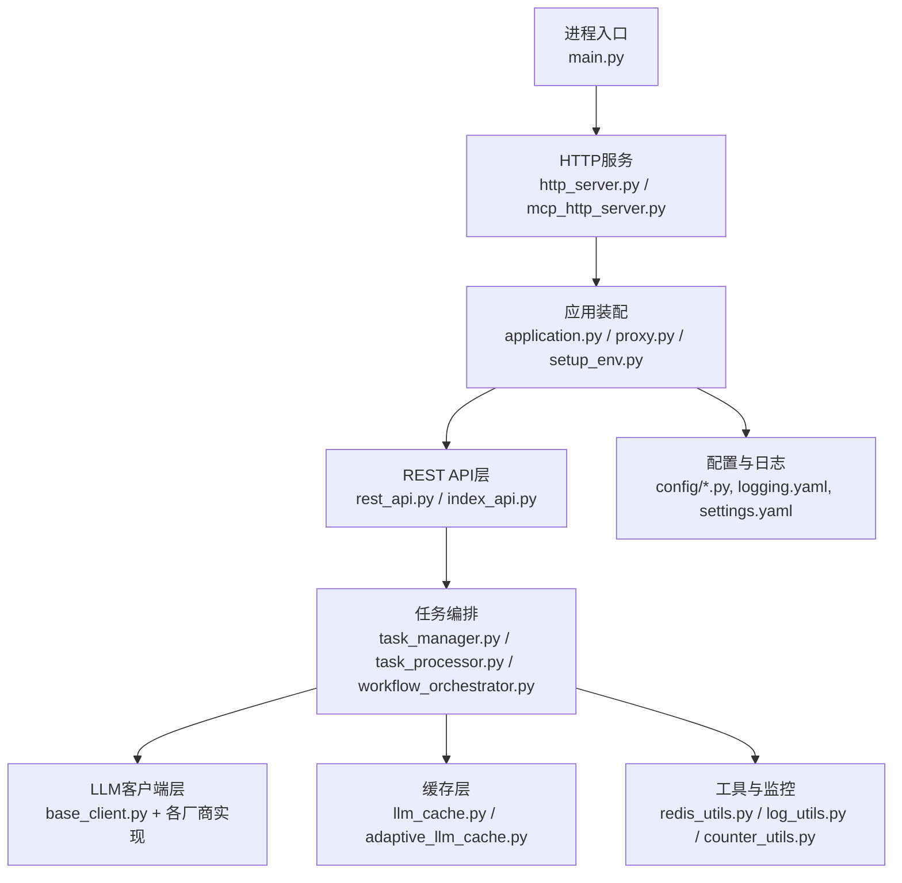
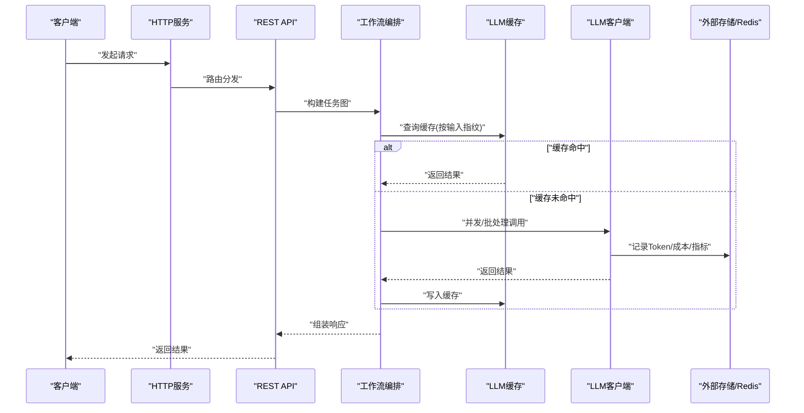
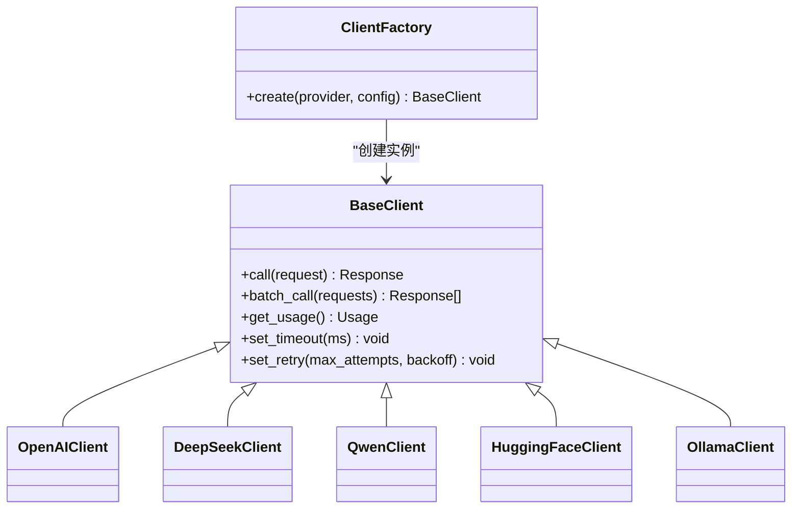
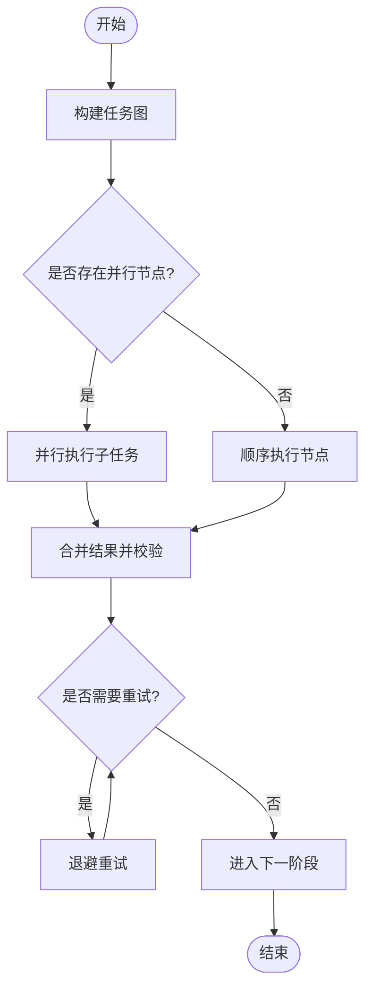
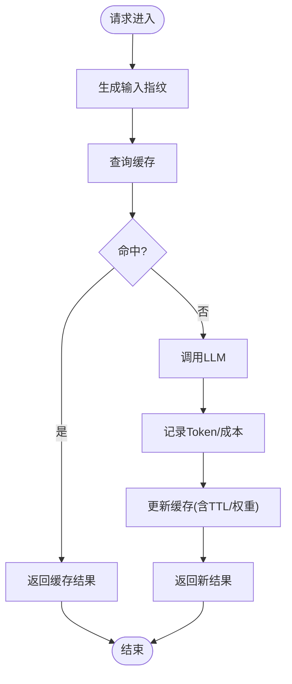
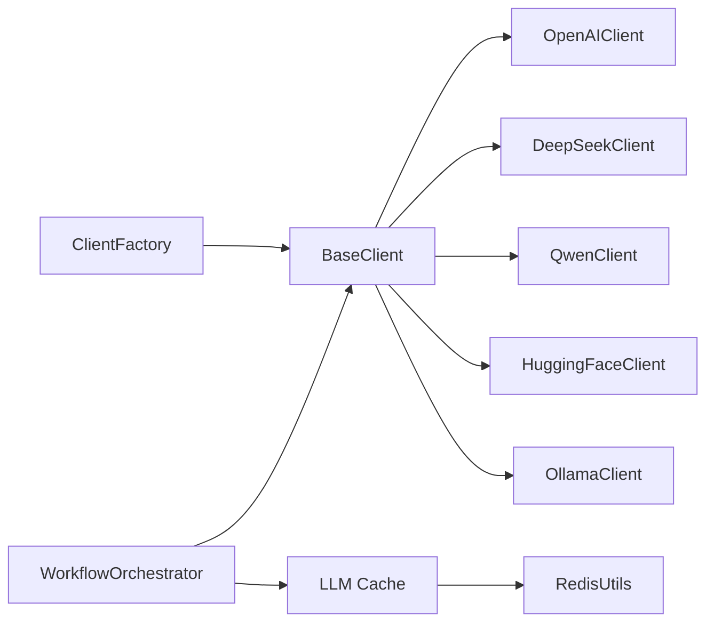

# 性能优化与成本控制

<cite>
**本文引用的文件**   
- [main.py](file://main.py)
- [http_server.py](file://src/penshot/http_server.py)
- [mcp_http_server.py](file://src/penshot/mcp_http_server.py)
- [application.py](file://src/penshot/app/application.py)
- [proxy.py](file://src/penshot/app/proxy.py)
- [setup_env.py](file://src/penshot/app/setup_env.py)
- [config.py](file://src/penshot/config/config.py)
- [config_loader.py](file://src/penshot/config/config_loader.py)
- [config_models.py](file://src/penshot/config/config_models.py)
- [logging.yaml](file://src/penshot/config/logging.yaml)
- [settings.yaml](file://src/penshot/config/settings.yaml)
- [base_client.py](file://src/penshot/client/base_client.py)
- [client_config.py](file://src/penshot/client/client_config.py)
- [client_factory.py](file://src/penshot/client/client_factory.py)
- [openai_client.py](file://src/penshot/client/llm/openai_client.py)
- [deepseek_client.py](file://src/penshot/client/llm/deepseek_client.py)
- [qwen_client.py](file://src/penshot/client/llm/qwen_client.py)
- [huggingface_client.py](file://src/penshot/client/llm/huggingface_client.py)
- [ollama_client.py](file://src/penshot/client/llm/ollama_client.py)
- [workflow_orchestrator.py](file://src/penshot/neopen/agent/workflow/workflow_orchestrator.py)
- [workflow_pipeline.py](file://src/penshot/neopen/agent/workflow/workflow_pipeline.py)
- [workflow_error_handler.py](file://src/penshot/neopen/agent/workflow/workflow_error_handler.py)
- [workflow_logger.py](file://src/penshot/neopen/agent/workflow/workflow_logger.py)
- [adaptive_llm_cache.py](file://src/penshot/neopen/cache/adaptive_llm_cache.py)
- [llm_cache.py](file://src/penshot/neopen/cache/llm_cache.py)
- [redis_utils.py](file://src/penshot/utils/redis_utils.py)
- [log_utils.py](file://src/penshot/utils/log_utils.py)
- [counter_utils.py](file://src/penshot/utils/counter_utils.py)
- [task_manager.py](file://src/penshot/task/task_manager.py)
- [task_processor.py](file://src/penshot/task/task_processor.py)
- [task_lifecycle_service.py](file://src/penshot/task/task_lifecycle_service.py)
- [rest_api.py](file://src/penshot/api/rest_api.py)
- [index_api.py](file://src/penshot/api/index_api.py)
</cite>

## 目录
1. [简介](#简介)
2. [项目结构](#项目结构)
3. [核心组件](#核心组件)
4. [架构总览](#架构总览)
5. [详细组件分析](#详细组件分析)
6. [依赖关系分析](#依赖关系分析)
7. [性能考虑](#性能考虑)
8. [故障排查指南](#故障排查指南)
9. [结论](#结论)
10. [附录](#附录)

## 简介
本文件聚焦于大语言模型（LLM）在视频脚本代理系统中的性能优化与成本控制。围绕请求批处理与并发控制、连接池与限流、Token统计与成本计算、响应时间优化（异步与超时）、监控指标与日志分析、成本控制策略与预算管理等主题，结合仓库中的客户端实现、工作流编排、缓存与工具模块进行系统化说明，并提供可操作的优化建议与排障指引。

## 项目结构
系统采用分层与模块化组织：
- 应用入口与HTTP服务：负责进程启动、中间件装配、路由注册与生命周期管理
- LLM客户端层：统一抽象不同厂商/本地模型的调用接口，封装重试、超时、鉴权等横切关注点
- 工作流编排层：将多步任务（解析、分镜、质量审计等）组合为可观测、可恢复的流水线
- 配置与日志：集中式配置加载、结构化日志与告警埋点
- 缓存与工具：通用Redis工具、计数器、日志增强等

图表来源
- [main.py:1-200](file://main.py#L1-L200)
- [http_server.py:1-200](file://src/penshot/http_server.py#L1-L200)
- [mcp_http_server.py:1-200](file://src/penshot/mcp_http_server.py#L1-L200)
- [application.py:1-200](file://src/penshot/app/application.py#L1-L200)
- [proxy.py:1-200](file://src/penshot/app/proxy.py#L1-L200)
- [setup_env.py:1-200](file://src/penshot/app/setup_env.py#L1-L200)
- [rest_api.py:1-200](file://src/penshot/api/rest_api.py#L1-L200)
- [index_api.py:1-200](file://src/penshot/api/index_api.py#L1-L200)
- [task_manager.py:1-200](file://src/penshot/task/task_manager.py#L1-L200)
- [task_processor.py:1-200](file://src/penshot/task/task_processor.py#L1-L200)
- [workflow_orchestrator.py:1-200](file://src/penshot/neopen/agent/workflow/workflow_orchestrator.py#L1-L200)
- [llm_cache.py:1-200](file://src/penshot/neopen/cache/llm_cache.py#L1-L200)
- [adaptive_llm_cache.py:1-200](file://src/penshot/neopen/cache/adaptive_llm_cache.py#L1-L200)
- [config.py:1-200](file://src/penshot/config/config.py#L1-L200)
- [logging.yaml:1-200](file://src/penshot/config/logging.yaml#L1-L200)
- [settings.yaml:1-200](file://src/penshot/config/settings.yaml#L1-L200)
- [redis_utils.py:1-200](file://src/penshot/utils/redis_utils.py#L1-L200)
- [log_utils.py:1-200](file://src/penshot/utils/log_utils.py#L1-L200)
- [counter_utils.py:1-200](file://src/penshot/utils/counter_utils.py#L1-L200)

章节来源
- [main.py:1-200](file://main.py#L1-L200)
- [http_server.py:1-200](file://src/penshot/http_server.py#L1-L200)
- [mcp_http_server.py:1-200](file://src/penshot/mcp_http_server.py#L1-L200)
- [application.py:1-200](file://src/penshot/app/application.py#L1-L200)
- [proxy.py:1-200](file://src/penshot/app/proxy.py#L1-L200)
- [setup_env.py:1-200](file://src/penshot/app/setup_env.py#L1-L200)
- [config.py:1-200](file://src/penshot/config/config.py#L1-L200)
- [logging.yaml:1-200](file://src/penshot/config/logging.yaml#L1-L200)
- [settings.yaml:1-200](file://src/penshot/config/settings.yaml#L1-L200)

## 核心组件
- HTTP服务与应用装配：提供REST/MCP接口，挂载中间件（鉴权、限流、日志、追踪），初始化配置与依赖注入
- LLM客户端抽象与各厂商实现：统一调用签名、错误码映射、重试与超时、Token统计与计费字段收集
- 工作流编排与任务调度：将复杂流程拆分为节点，支持并行执行、失败重试、状态持久化与回滚
- 缓存层：基于键值存储的LLM结果缓存与自适应策略，降低重复请求成本
- 配置与日志：集中式YAML/环境变量配置，结构化日志输出与指标上报
- 工具与监控：Redis工具、计数器、日志增强，支撑限流、配额与成本统计

章节来源
- [http_server.py:1-200](file://src/penshot/http_server.py#L1-L200)
- [mcp_http_server.py:1-200](file://src/penshot/mcp_http_server.py#L1-L200)
- [application.py:1-200](file://src/penshot/app/application.py#L1-L200)
- [proxy.py:1-200](file://src/penshot/app/proxy.py#L1-L200)
- [setup_env.py:1-200](file://src/penshot/app/setup_env.py#L1-L200)
- [base_client.py:1-200](file://src/penshot/client/base_client.py#L1-L200)
- [client_config.py:1-200](file://src/penshot/client/client_config.py#L1-L200)
- [client_factory.py:1-200](file://src/penshot/client/client_factory.py#L1-L200)
- [openai_client.py:1-200](file://src/penshot/client/llm/openai_client.py#L1-L200)
- [deepseek_client.py:1-200](file://src/penshot/client/llm/deepseek_client.py#L1-L200)
- [qwen_client.py:1-200](file://src/penshot/client/llm/qwen_client.py#L1-L200)
- [huggingface_client.py:1-200](file://src/penshot/client/llm/huggingface_client.py#L1-L200)
- [ollama_client.py:1-200](file://src/penshot/client/llm/ollama_client.py#L1-L200)
- [workflow_orchestrator.py:1-200](file://src/penshot/neopen/agent/workflow/workflow_orchestrator.py#L1-L200)
- [workflow_pipeline.py:1-200](file://src/penshot/neopen/agent/workflow/workflow_pipeline.py#L1-L200)
- [workflow_error_handler.py:1-200](file://src/penshot/neopen/agent/workflow/workflow_error_handler.py#L1-L200)
- [workflow_logger.py:1-200](file://src/penshot/neopen/agent/workflow/workflow_logger.py#L1-L200)
- [llm_cache.py:1-200](file://src/penshot/neopen/cache/llm_cache.py#L1-L200)
- [adaptive_llm_cache.py:1-200](file://src/penshot/neopen/cache/adaptive_llm_cache.py#L1-L200)
- [redis_utils.py:1-200](file://src/penshot/utils/redis_utils.py#L1-L200)
- [log_utils.py:1-200](file://src/penshot/utils/log_utils.py#L1-L200)
- [counter_utils.py:1-200](file://src/penshot/utils/counter_utils.py#L1-L200)

## 架构总览
从请求到响应的关键路径包括：HTTP接入→API路由→任务编排→LLM调用→缓存命中/未命中→结果返回。性能与成本的关键控制点在：
- 并发与批处理：在编排层对独立子任务并行执行；在客户端层对批量请求合并
- 连接池与限流：通过客户端配置与全局限流器限制并发度与速率
- 缓存与去重：基于输入指纹的缓存命中减少重复调用
- 监控与日志：全链路耗时、错误率、Token用量与成本分摊

图表来源
- [http_server.py:1-200](file://src/penshot/http_server.py#L1-L200)
- [rest_api.py:1-200](file://src/penshot/api/rest_api.py#L1-L200)
- [workflow_orchestrator.py:1-200](file://src/penshot/neopen/agent/workflow/workflow_orchestrator.py#L1-L200)
- [llm_cache.py:1-200](file://src/penshot/neopen/cache/llm_cache.py#L1-L200)
- [adaptive_llm_cache.py:1-200](file://src/penshot/neopen/cache/adaptive_llm_cache.py#L1-L200)
- [base_client.py:1-200](file://src/penshot/client/base_client.py#L1-L200)
- [openai_client.py:1-200](file://src/penshot/client/llm/openai_client.py#L1-L200)
- [redis_utils.py:1-200](file://src/penshot/utils/redis_utils.py#L1-L200)

## 详细组件分析

### LLM客户端抽象与厂商实现
- 统一抽象：定义标准调用接口、参数校验、错误码映射、重试与超时、Token统计与成本字段收集
- 厂商适配：OpenAI、DeepSeek、Qwen、HuggingFace、Ollama等具体实现，差异在于鉴权、流式与非流式、计费字段
- 工厂模式：根据配置动态创建客户端实例，便于灰度切换与A/B测试

图表来源
- [base_client.py:1-200](file://src/penshot/client/base_client.py#L1-L200)
- [client_factory.py:1-200](file://src/penshot/client/client_factory.py#L1-L200)
- [openai_client.py:1-200](file://src/penshot/client/llm/openai_client.py#L1-L200)
- [deepseek_client.py:1-200](file://src/penshot/client/llm/deepseek_client.py#L1-L200)
- [qwen_client.py:1-200](file://src/penshot/client/llm/qwen_client.py#L1-L200)
- [huggingface_client.py:1-200](file://src/penshot/client/llm/huggingface_client.py#L1-L200)
- [ollama_client.py:1-200](file://src/penshot/client/llm/ollama_client.py#L1-L200)

章节来源
- [base_client.py:1-200](file://src/penshot/client/base_client.py#L1-L200)
- [client_config.py:1-200](file://src/penshot/client/client_config.py#L1-L200)
- [client_factory.py:1-200](file://src/penshot/client/client_factory.py#L1-L200)
- [openai_client.py:1-200](file://src/penshot/client/llm/openai_client.py#L1-L200)
- [deepseek_client.py:1-200](file://src/penshot/client/llm/deepseek_client.py#L1-L200)
- [qwen_client.py:1-200](file://src/penshot/client/llm/qwen_client.py#L1-L200)
- [huggingface_client.py:1-200](file://src/penshot/client/llm/huggingface_client.py#L1-L200)
- [ollama_client.py:1-200](file://src/penshot/client/llm/ollama_client.py#L1-L200)

### 工作流编排与任务调度
- 编排器：将复杂流程建模为有向无环图，支持并行节点、条件分支、重试与补偿
- 管道：节点间数据传递与状态共享，保证幂等与可恢复
- 错误处理：统一异常分类、降级策略与告警
- 日志：结构化事件日志，包含阶段耗时、资源使用与上下文ID

图表来源
- [workflow_orchestrator.py:1-200](file://src/penshot/neopen/agent/workflow/workflow_orchestrator.py#L1-L200)
- [workflow_pipeline.py:1-200](file://src/penshot/neopen/agent/workflow/workflow_pipeline.py#L1-L200)
- [workflow_error_handler.py:1-200](file://src/penshot/neopen/agent/workflow/workflow_error_handler.py#L1-L200)
- [workflow_logger.py:1-200](file://src/penshot/neopen/agent/workflow/workflow_logger.py#L1-L200)

章节来源
- [workflow_orchestrator.py:1-200](file://src/penshot/neopen/agent/workflow/workflow_orchestrator.py#L1-L200)
- [workflow_pipeline.py:1-200](file://src/penshot/neopen/agent/workflow/workflow_pipeline.py#L1-L200)
- [workflow_error_handler.py:1-200](file://src/penshot/neopen/agent/workflow/workflow_error_handler.py#L1-L200)
- [workflow_logger.py:1-200](file://src/penshot/neopen/agent/workflow/workflow_logger.py#L1-L200)

### 缓存层与自适应策略
- 基础缓存：基于输入指纹的键值缓存，支持TTL与失效策略
- 自适应缓存：根据命中率、延迟与成本自动调整缓存粒度与保留策略
- 存储后端：Redis或内存，提供分布式一致性能力

图表来源
- [llm_cache.py:1-200](file://src/penshot/neopen/cache/llm_cache.py#L1-L200)
- [adaptive_llm_cache.py:1-200](file://src/penshot/neopen/cache/adaptive_llm_cache.py#L1-L200)
- [redis_utils.py:1-200](file://src/penshot/utils/redis_utils.py#L1-L200)

章节来源
- [llm_cache.py:1-200](file://src/penshot/neopen/cache/llm_cache.py#L1-L200)
- [adaptive_llm_cache.py:1-200](file://src/penshot/neopen/cache/adaptive_llm_cache.py#L1-L200)
- [redis_utils.py:1-200](file://src/penshot/utils/redis_utils.py#L1-L200)

### 配置与日志
- 配置加载：YAML与环境变量融合，支持多环境（开发/生产）
- 日志配置：结构化输出、分级过滤、采样与轮转
- 设置项：限流、超时、重试、缓存、连接池等关键开关

章节来源
- [config.py:1-200](file://src/penshot/config/config.py#L1-L200)
- [config_loader.py:1-200](file://src/penshot/config/config_loader.py#L1-L200)
- [config_models.py:1-200](file://src/penshot/config/config_models.py#L1-L200)
- [logging.yaml:1-200](file://src/penshot/config/logging.yaml#L1-L200)
- [settings.yaml:1-200](file://src/penshot/config/settings.yaml#L1-L200)

### API与服务入口
- REST API：提供任务提交、状态查询、结果获取等接口
- MCP服务器：面向Agent的工具协议入口
- 应用装配：中间件链、依赖注入、健康检查与优雅关闭

章节来源
- [rest_api.py:1-200](file://src/penshot/api/rest_api.py#L1-L200)
- [index_api.py:1-200](file://src/penshot/api/index_api.py#L1-L200)
- [http_server.py:1-200](file://src/penshot/http_server.py#L1-L200)
- [mcp_http_server.py:1-200](file://src/penshot/mcp_http_server.py#L1-L200)
- [application.py:1-200](file://src/penshot/app/application.py#L1-L200)
- [proxy.py:1-200](file://src/penshot/app/proxy.py#L1-L200)
- [setup_env.py:1-200](file://src/penshot/app/setup_env.py#L1-L200)

## 依赖关系分析
- 低耦合高内聚：客户端抽象与厂商实现解耦，通过工厂按需创建
- 编排与调用分离：工作流不关心具体LLM实现细节，仅依赖统一接口
- 外部依赖：Redis用于缓存与限流计数，日志与指标可对接外部系统

图表来源
- [client_factory.py:1-200](file://src/penshot/client/client_factory.py#L1-L200)
- [base_client.py:1-200](file://src/penshot/client/base_client.py#L1-L200)
- [openai_client.py:1-200](file://src/penshot/client/llm/openai_client.py#L1-L200)
- [deepseek_client.py:1-200](file://src/penshot/client/llm/deepseek_client.py#L1-L200)
- [qwen_client.py:1-200](file://src/penshot/client/llm/qwen_client.py#L1-L200)
- [huggingface_client.py:1-200](file://src/penshot/client/llm/huggingface_client.py#L1-L200)
- [ollama_client.py:1-200](file://src/penshot/client/llm/ollama_client.py#L1-L200)
- [workflow_orchestrator.py:1-200](file://src/penshot/neopen/agent/workflow/workflow_orchestrator.py#L1-L200)
- [llm_cache.py:1-200](file://src/penshot/neopen/cache/llm_cache.py#L1-L200)
- [redis_utils.py:1-200](file://src/penshot/utils/redis_utils.py#L1-L200)

章节来源
- [client_factory.py:1-200](file://src/penshot/client/client_factory.py#L1-L200)
- [base_client.py:1-200](file://src/penshot/client/base_client.py#L1-L200)
- [workflow_orchestrator.py:1-200](file://src/penshot/neopen/agent/workflow/workflow_orchestrator.py#L1-L200)
- [llm_cache.py:1-200](file://src/penshot/neopen/cache/llm_cache.py#L1-L200)
- [redis_utils.py:1-200](file://src/penshot/utils/redis_utils.py#L1-L200)

## 性能考虑
- 请求批处理与并发控制
  - 在编排层对独立子任务并行执行，缩短端到端时延
  - 在客户端层对相似请求进行批处理，提升吞吐并降低首包开销
  - 通过令牌桶/漏桶限流器控制QPS，避免上游限流与雪崩
- 连接池管理
  - 复用底层HTTP连接，减少握手与TLS开销
  - 根据模型提供方限制最大并发与队列长度，防止过载
- Token统计与成本计算
  - 统一采集输入/输出Token数、函数调用次数、缓存命中次数
  - 按模型单价计算单次成本，聚合至任务/用户/租户维度
  - 对不同模型计费策略进行对比（如按Token、按调用次数、按时长）
- 响应时间优化
  - 异步处理：非阻塞I/O与协程并发，提高CPU与网络利用率
  - 超时控制：分层超时（网关、编排、客户端），快速失败与降级
  - 缓存优先：热点输入直接命中缓存，显著降低P95/P99延迟
- 监控指标与日志分析
  - 指标：QPS、延迟分位、错误率、缓存命中率、Token用量、成本
  - 日志：结构化事件、关联ID、阶段耗时、资源占用
  - 告警：阈值触发与趋势预测，提前发现瓶颈
- 成本控制与预算管理
  - 预算上限：按日/周/月设定预算，达到阈值后降级或拒绝
  - 模型选择：根据任务复杂度与SLA选择性价比最优模型
  - 缓存策略：自适应调整TTL与粒度，平衡命中率与新鲜度
- 瓶颈识别与优化建议
  - 定位热点：通过分布式追踪与火焰图识别慢节点
  - 容量规划：压测评估峰值并发与资源需求
  - 优化方向：批处理窗口、连接池大小、重试退避、缓存策略

[本节为通用指导，无需特定文件引用]

## 故障排查指南
- 常见问题
  - 上游限流：观察限流器计数与错误码，调整QPS与重试退避
  - 超时频繁：检查分层超时配置与下游延迟分布
  - 缓存失效：核对指纹生成规则与TTL策略
  - 成本飙升：核查Token统计口径与模型单价配置
- 诊断步骤
  - 查看结构化日志与关联ID，定位问题阶段
  - 检查指标面板：QPS、延迟、错误率、缓存命中率、Token与成本
  - 复现与压测：构造最小用例，验证修复效果
- 恢复策略
  - 快速降级：切换到轻量模型或规则引擎
  - 熔断隔离：对不稳定上游进行熔断与隔离
  - 回滚变更：版本回退与配置热更新

章节来源
- [workflow_error_handler.py:1-200](file://src/penshot/neopen/agent/workflow/workflow_error_handler.py#L1-L200)
- [workflow_logger.py:1-200](file://src/penshot/neopen/agent/workflow/workflow_logger.py#L1-L200)
- [log_utils.py:1-200](file://src/penshot/utils/log_utils.py#L1-L200)
- [counter_utils.py:1-200](file://src/penshot/utils/counter_utils.py#L1-L200)
- [redis_utils.py:1-200](file://src/penshot/utils/redis_utils.py#L1-L200)

## 结论
通过在编排层实现并行与批处理、在客户端层统一抽象与限流、在缓存层引入自适应策略，并结合完善的监控与日志体系，可在保障SLA的前提下显著降低延迟与成本。建议持续进行压测与容量规划，结合业务特性动态调优限流、超时、重试与缓存策略，建立预算管理与模型选择的治理机制，确保系统在增长过程中保持高性能与可控成本。

[本节为总结性内容，无需特定文件引用]

## 附录
- 术语
  - QPS：每秒查询数
  - P95/P99：延迟分位数
  - TTL：生存时间
  - SLA：服务等级协议
- 参考配置项（示例）
  - 限流：最大QPS、突发容量、退避策略
  - 超时：网关超时、编排超时、客户端超时
  - 重试：最大尝试次数、退避倍数、抖动范围
  - 缓存：TTL、最大条目数、命中率目标
  - 连接池：最大连接数、空闲回收周期
  - 成本：模型单价、预算上限、告警阈值

[本节为补充信息，无需特定文件引用]