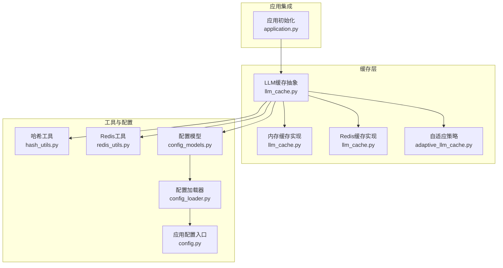
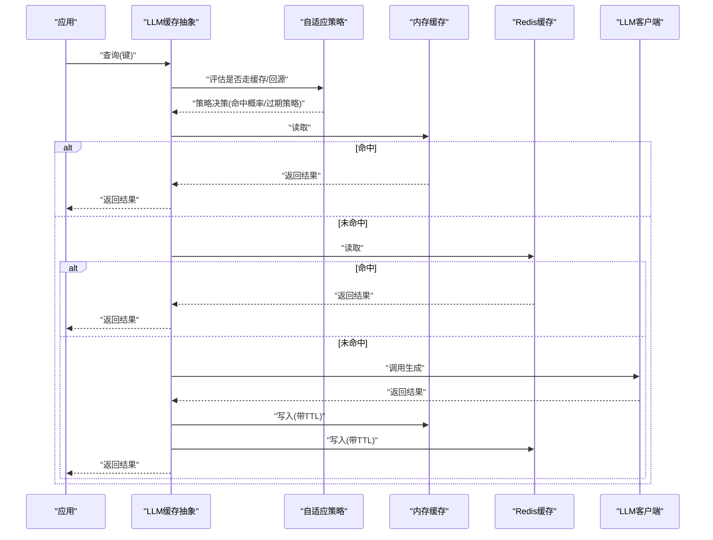
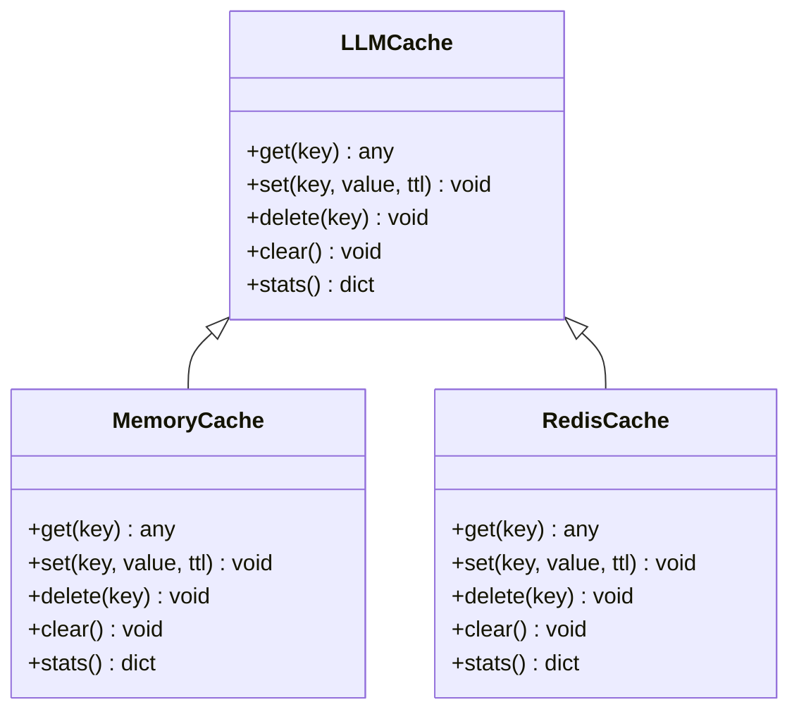
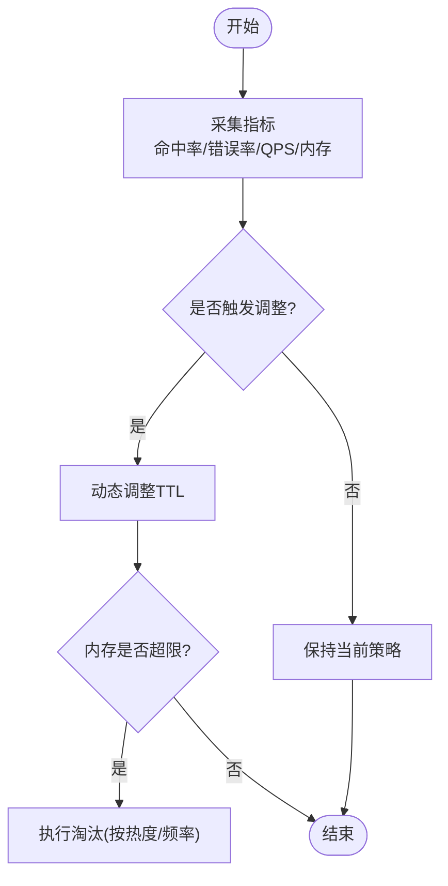
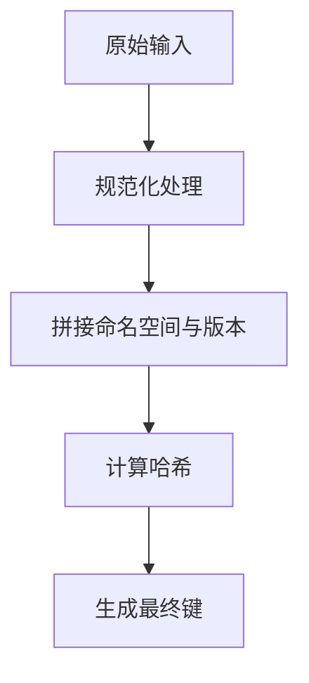
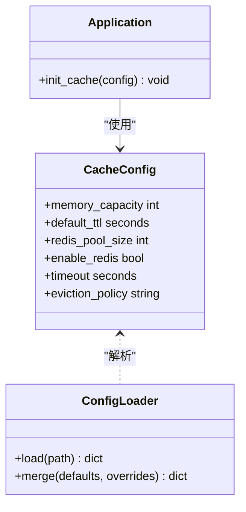
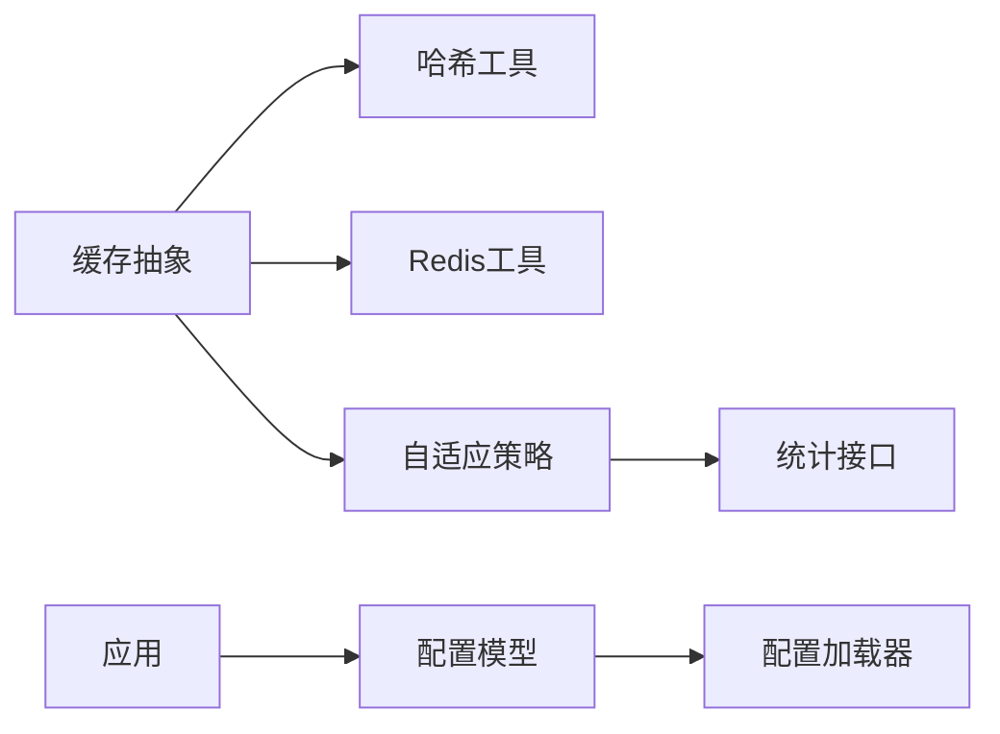

# 缓存系统

<cite>
**本文引用的文件**   
- [src/penshot/neopen/cache/adaptive_llm_cache.py](file://src/penshot/neopen/cache/adaptive_llm_cache.py)
- [src/penshot/neopen/cache/llm_cache.py](file://src/penshot/neopen/cache/llm_cache.py)
- [src/penshot/utils/redis_utils.py](file://src/penshot/utils/redis_utils.py)
- [src/penshot/utils/hash_utils.py](file://src/penshot/utils/hash_utils.py)
- [src/penshot/config/config.py](file://src/penshot/config/config.py)
- [src/penshot/config/config_loader.py](file://src/penshot/config/config_loader.py)
- [src/penshot/config/config_models.py](file://src/penshot/config/config_models.py)
- [src/penshot/app/application.py](file://src/penshot/app/application.py)
</cite>

## 目录
1. [简介](#简介)
2. [项目结构](#项目结构)
3. [核心组件](#核心组件)
4. [架构总览](#架构总览)
5. [详细组件分析](#详细组件分析)
6. [依赖关系分析](#依赖关系分析)
7. [性能考量](#性能考量)
8. [故障排查指南](#故障排查指南)
9. [结论](#结论)
10. [附录](#附录)

## 简介
本文件面向LLM缓存系统的实现与使用，聚焦多级缓存（内存+Redis）的架构设计、自适应策略（命中率监控、动态过期时间、智能淘汰）、键生成与序列化机制、配置管理与调优、一致性与容错、以及监控与调试方法。文档以仓库中现有实现为依据，提供可操作的指导与可视化图示，帮助读者快速理解并高效使用该系统。

## 项目结构
缓存相关代码位于 neopen 子模块下，围绕两级缓存抽象与适配层展开：
- 缓存抽象与实现：内存缓存与Redis缓存
- 自适应策略：基于命中统计与负载指标的动态调整
- 工具与配置：键哈希、Redis连接、配置加载与模型定义
- 应用集成：在应用启动时初始化缓存与策略

图表来源
- [src/penshot/neopen/cache/llm_cache.py](file://src/penshot/neopen/cache/llm_cache.py)
- [src/penshot/neopen/cache/adaptive_llm_cache.py](file://src/penshot/neopen/cache/adaptive_llm_cache.py)
- [src/penshot/utils/hash_utils.py](file://src/penshot/utils/hash_utils.py)
- [src/penshot/utils/redis_utils.py](file://src/penshot/utils/redis_utils.py)
- [src/penshot/config/config_models.py](file://src/penshot/config/config_models.py)
- [src/penshot/config/config_loader.py](file://src/penshot/config/config_loader.py)
- [src/penshot/config/config.py](file://src/penshot/config/config.py)
- [src/penshot/app/application.py](file://src/penshot/app/application.py)

章节来源
- [src/penshot/neopen/cache/llm_cache.py](file://src/penshot/neopen/cache/llm_cache.py)
- [src/penshot/neopen/cache/adaptive_llm_cache.py](file://src/penshot/neopen/cache/adaptive_llm_cache.py)
- [src/penshot/utils/hash_utils.py](file://src/penshot/utils/hash_utils.py)
- [src/penshot/utils/redis_utils.py](file://src/penshot/utils/redis_utils.py)
- [src/penshot/config/config_models.py](file://src/penshot/config/config_models.py)
- [src/penshot/config/config_loader.py](file://src/penshot/config/config_loader.py)
- [src/penshot/config/config.py](file://src/penshot/config/config.py)
- [src/penshot/app/application.py](file://src/penshot/app/application.py)

## 核心组件
- 缓存抽象接口：统一 get/set/del/clear/stats 等能力，屏蔽底层存储差异
- 内存缓存：进程内字典或有序容器，低延迟、容量受限
- Redis缓存：分布式共享、持久化、支持TTL与原子操作
- 自适应策略：根据命中率、QPS、错误率等指标动态调整过期时间与淘汰阈值
- 键生成与序列化：对输入上下文进行规范化与哈希，确保键唯一且稳定；结果对象序列化为字节串或JSON
- 配置管理：通过配置模型与加载器注入缓存参数（如容量、TTL、连接池大小、开关）
- 应用集成：在应用生命周期中完成缓存实例化、预热与优雅关闭

章节来源
- [src/penshot/neopen/cache/llm_cache.py](file://src/penshot/neopen/cache/llm_cache.py)
- [src/penshot/neopen/cache/adaptive_llm_cache.py](file://src/penshot/neopen/cache/adaptive_llm_cache.py)
- [src/penshot/utils/hash_utils.py](file://src/penshot/utils/hash_utils.py)
- [src/penshot/utils/redis_utils.py](file://src/penshot/utils/redis_utils.py)
- [src/penshot/config/config_models.py](file://src/penshot/config/config_models.py)
- [src/penshot/config/config_loader.py](file://src/penshot/config/config_loader.py)
- [src/penshot/config/config.py](file://src/penshot/config/config.py)

## 架构总览
下图展示请求从应用进入，经自适应策略路由到多级缓存，再到LLM客户端的完整流程。

图表来源
- [src/penshot/neopen/cache/llm_cache.py](file://src/penshot/neopen/cache/llm_cache.py)
- [src/penshot/neopen/cache/adaptive_llm_cache.py](file://src/penshot/neopen/cache/adaptive_llm_cache.py)

## 详细组件分析

### 缓存抽象与实现（内存与Redis）
- 抽象接口：定义统一的读写、删除、清理与统计方法，便于上层无感切换
- 内存缓存：
  - 数据结构：线程安全字典或LRU容器，按容量上限控制
  - 过期策略：本地TTL或惰性失效
  - 适用场景：热点键、短生命周期数据
- Redis缓存：
  - 数据结构：字符串/Hash/列表等，结合TTL与原子命令
  - 一致性：写后读强一致可通过“先写内存再写Redis”的顺序保证
  - 适用场景：跨进程共享、持久化、高并发读

图表来源
- [src/penshot/neopen/cache/llm_cache.py](file://src/penshot/neopen/cache/llm_cache.py)

章节来源
- [src/penshot/neopen/cache/llm_cache.py](file://src/penshot/neopen/cache/llm_cache.py)

### 自适应缓存策略
- 监控指标：命中率、平均响应时间、错误率、QPS、内存占用
- 动态过期：根据命中率与错误率自动缩短或延长TTL
- 智能淘汰：当内存接近上限时，优先淘汰冷数据（低频访问、长TTL）
- 降级与熔断：当Redis不可用时，自动退化为纯内存模式

图表来源
- [src/penshot/neopen/cache/adaptive_llm_cache.py](file://src/penshot/neopen/cache/adaptive_llm_cache.py)

章节来源
- [src/penshot/neopen/cache/adaptive_llm_cache.py](file://src/penshot/neopen/cache/adaptive_llm_cache.py)

### 缓存键生成策略
- 规范化：将输入参数标准化（排序、去重、类型转换），避免等价请求产生不同键
- 哈希：对规范化后的内容计算稳定哈希值，作为最终键的一部分
- 命名空间：为不同业务域添加前缀，防止键冲突
- 版本化：在键中包含模型或提示模板版本号，便于灰度与回滚

图表来源
- [src/penshot/utils/hash_utils.py](file://src/penshot/utils/hash_utils.py)

章节来源
- [src/penshot/utils/hash_utils.py](file://src/penshot/utils/hash_utils.py)

### 数据序列化机制
- 序列化目标：将Python对象转换为字节串或JSON字符串，便于跨进程与跨语言共享
- 兼容性：选择稳定的编码格式，避免版本升级导致反序列化失败
- 压缩：对大对象启用压缩以降低网络与存储开销
- 校验：可选地加入校验和，提升健壮性

章节来源
- [src/penshot/neopen/cache/llm_cache.py](file://src/penshot/neopen/cache/llm_cache.py)

### 配置管理与参数说明
- 配置模型：集中定义缓存相关字段（容量、TTL、连接池、开关、超时等）
- 配置加载：从YAML/环境变量加载并合并默认值
- 运行时更新：支持热更新部分参数（如TTL、开关），无需重启服务

图表来源
- [src/penshot/config/config_models.py](file://src/penshot/config/config_models.py)
- [src/penshot/config/config_loader.py](file://src/penshot/config/config_loader.py)
- [src/penshot/config/config.py](file://src/penshot/config/config.py)
- [src/penshot/app/application.py](file://src/penshot/app/application.py)

章节来源
- [src/penshot/config/config_models.py](file://src/penshot/config/config_models.py)
- [src/penshot/config/config_loader.py](file://src/penshot/config/config_loader.py)
- [src/penshot/config/config.py](file://src/penshot/config/config.py)
- [src/penshot/app/application.py](file://src/penshot/app/application.py)

### Redis集成与连接管理
- 连接池：复用连接，降低握手开销
- 重试与超时：对网络抖动进行指数退避重试
- 健康检查：周期性探测可用性，异常时自动降级
- 键空间隔离：通过命名空间与数据库索引隔离多租户或多环境

章节来源
- [src/penshot/utils/redis_utils.py](file://src/penshot/utils/redis_utils.py)
- [src/penshot/neopen/cache/llm_cache.py](file://src/penshot/neopen/cache/llm_cache.py)

## 依赖关系分析
- 耦合关系：
  - 缓存抽象依赖哈希工具与Redis工具
  - 自适应策略依赖缓存统计接口
  - 配置模型被应用与缓存层共同消费
- 外部依赖：
  - Redis服务端（连接池、TTL、原子操作）
  - 配置中心或文件系统（YAML/环境变量）

图表来源
- [src/penshot/neopen/cache/llm_cache.py](file://src/penshot/neopen/cache/llm_cache.py)
- [src/penshot/neopen/cache/adaptive_llm_cache.py](file://src/penshot/neopen/cache/adaptive_llm_cache.py)
- [src/penshot/utils/hash_utils.py](file://src/penshot/utils/hash_utils.py)
- [src/penshot/utils/redis_utils.py](file://src/penshot/utils/redis_utils.py)
- [src/penshot/config/config_models.py](file://src/penshot/config/config_models.py)
- [src/penshot/config/config_loader.py](file://src/penshot/config/config_loader.py)
- [src/penshot/app/application.py](file://src/penshot/app/application.py)

章节来源
- [src/penshot/neopen/cache/llm_cache.py](file://src/penshot/neopen/cache/llm_cache.py)
- [src/penshot/neopen/cache/adaptive_llm_cache.py](file://src/penshot/neopen/cache/adaptive_llm_cache.py)
- [src/penshot/utils/hash_utils.py](file://src/penshot/utils/hash_utils.py)
- [src/penshot/utils/redis_utils.py](file://src/penshot/utils/redis_utils.py)
- [src/penshot/config/config_models.py](file://src/penshot/config/config_models.py)
- [src/penshot/config/config_loader.py](file://src/penshot/config/config_loader.py)
- [src/penshot/app/application.py](file://src/penshot/app/application.py)

## 性能考量
- 命中率优化：合理设置TTL与淘汰策略，减少冷数据占用
- 序列化成本：对大对象启用压缩，避免频繁编解码
- 连接池：增大Redis连接池以提升并发吞吐
- 异步化：将写Redis与统计上报异步化，降低主路径延迟
- 热点保护：对高频键采用本地副本或预取策略

[本节为通用性能建议，不直接分析具体文件]

## 故障排查指南
- 常见问题定位：
  - 命中率骤降：检查键生成是否变化、TTL是否过短
  - Redis不可用：查看连接池状态与健康检查日志
  - 内存溢出：确认淘汰策略是否生效、容量是否过小
- 诊断手段：
  - 暴露统计接口：输出命中率、QPS、错误率、内存占用
  - 键分布分析：统计Top键与过期分布
  - 链路追踪：记录一次请求在内存/Redis/LLM的路径与耗时
- 恢复策略：
  - 自动降级：Redis异常时仅使用内存缓存
  - 限流与熔断：在高错误率时限制回源流量
  - 滚动重启：在配置变更后平滑更新

章节来源
- [src/penshot/neopen/cache/adaptive_llm_cache.py](file://src/penshot/neopen/cache/adaptive_llm_cache.py)
- [src/penshot/neopen/cache/llm_cache.py](file://src/penshot/neopen/cache/llm_cache.py)
- [src/penshot/utils/redis_utils.py](file://src/penshot/utils/redis_utils.py)

## 结论
该缓存系统通过抽象接口统一了内存与Redis两种后端，结合自适应策略实现了动态TTL与智能淘汰，提升了整体命中率与稳定性。配合完善的配置管理与监控能力，可在生产环境中获得良好的性能与可维护性。建议在上线前充分压测，并根据业务特征微调策略参数。

[本节为总结性内容，不直接分析具体文件]

## 附录
- 最佳实践清单：
  - 为每个业务域设置独立命名空间
  - 对关键键增加版本字段，便于灰度与回滚
  - 定期巡检命中率与错误率，及时调整TTL与容量
  - 对大对象启用压缩，权衡CPU与带宽
- 参考实现路径：
  - 缓存抽象与实现：[src/penshot/neopen/cache/llm_cache.py](file://src/penshot/neopen/cache/llm_cache.py)
  - 自适应策略：[src/penshot/neopen/cache/adaptive_llm_cache.py](file://src/penshot/neopen/cache/adaptive_llm_cache.py)
  - 键生成与序列化：[src/penshot/utils/hash_utils.py](file://src/penshot/utils/hash_utils.py)
  - Redis集成：[src/penshot/utils/redis_utils.py](file://src/penshot/utils/redis_utils.py)
  - 配置模型与加载：[src/penshot/config/config_models.py](file://src/penshot/config/config_models.py)、[src/penshot/config/config_loader.py](file://src/penshot/config/config_loader.py)
  - 应用集成：[src/penshot/app/application.py](file://src/penshot/app/application.py)