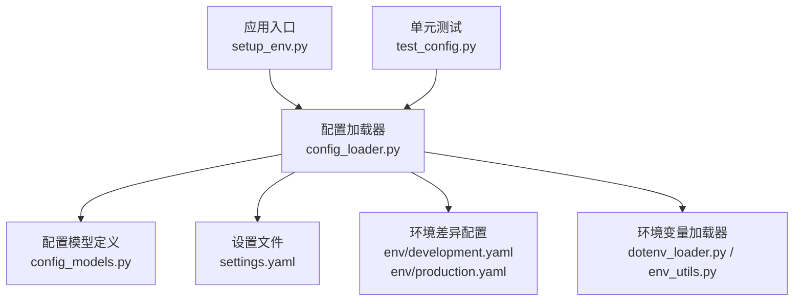
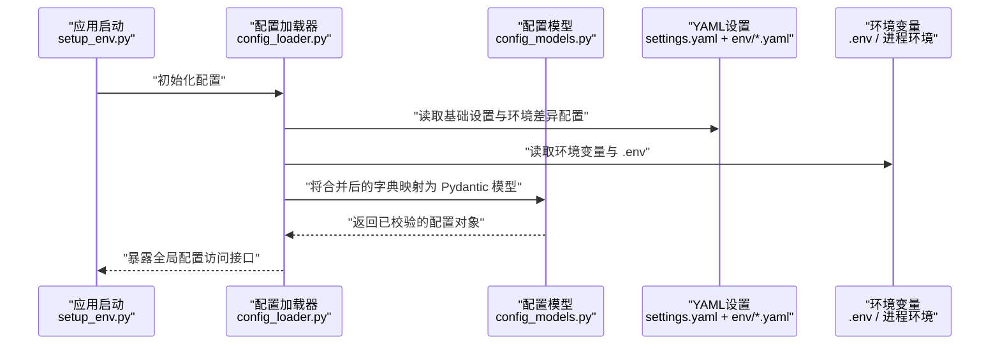
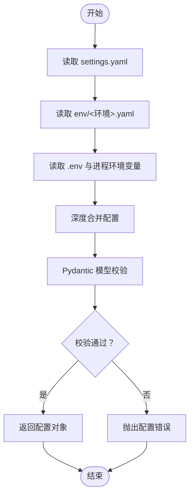
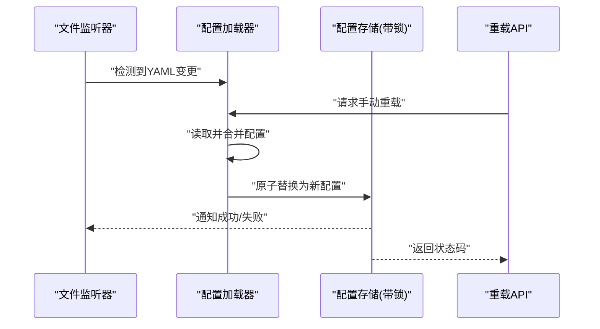
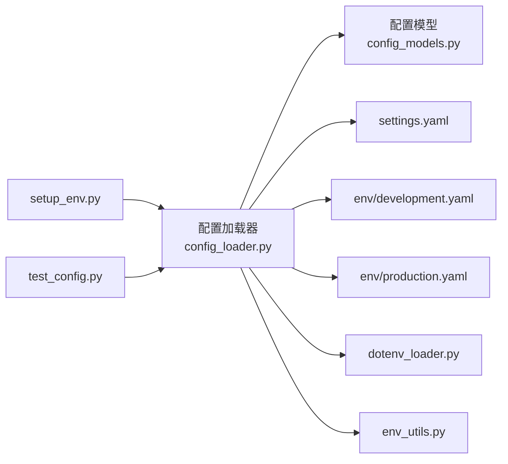

# 配置管理

<cite>
**本文引用的文件**   
- [src/penshot/config/config.py](file://src/penshot/config/config.py)
- [src/penshot/config/config_loader.py](file://src/penshot/config/config_loader.py)
- [src/penshot/config/config_models.py](file://src/penshot/config/config_models.py)
- [src/penshot/config/settings.yaml](file://src/penshot/config/settings.yaml)
- [src/penshot/config/env/development.yaml](file://src/penshot/config/env/development.yaml)
- [src/penshot/config/env/production.yaml](file://src/penshot/config/env/production.yaml)
- [src/penshot/utils/dotenv_loader.py](file://src/penshot/utils/dotenv_loader.py)
- [src/penshot/utils/env_utils.py](file://src/penshot/utils/env_utils.py)
- [src/penshot/app/setup_env.py](file://src/penshot/app/setup_env.py)
- [tests/test_config.py](file://tests/test_config.py)
</cite>

## 目录
1. [简介](#简介)
2. [项目结构](#项目结构)
3. [核心组件](#核心组件)
4. [架构总览](#架构总览)
5. [详细组件分析](#详细组件分析)
6. [依赖关系分析](#依赖关系分析)
7. [性能考虑](#性能考虑)
8. [故障排查指南](#故障排查指南)
9. [结论](#结论)
10. [附录](#附录)

## 简介
本文件面向 LLM 应用与视频剪辑代理项目的“配置管理”子系统，系统性阐述多环境配置设计、模型定义与校验、加载器与环境变量优先级、热重载与动态更新机制、安全与敏感信息保护、以及迁移与版本管理策略。文档旨在帮助开发者快速理解并正确使用配置体系，同时为后续演进提供可操作的指导。

## 项目结构
配置相关代码集中在 src/penshot/config 目录下，配套的环境配置文件位于 env 子目录；环境变量加载工具位于 utils；应用启动时进行环境初始化；测试覆盖配置行为。

图示来源
- [src/penshot/app/setup_env.py](file://src/penshot/app/setup_env.py)
- [src/penshot/config/config_loader.py](file://src/penshot/config/config_loader.py)
- [src/penshot/config/config_models.py](file://src/penshot/config/config_models.py)
- [src/penshot/config/settings.yaml](file://src/penshot/config/settings.yaml)
- [src/penshot/config/env/development.yaml](file://src/penshot/config/env/development.yaml)
- [src/penshot/config/env/production.yaml](file://src/penshot/config/env/production.yaml)
- [src/penshot/utils/dotenv_loader.py](file://src/penshot/utils/dotenv_loader.py)
- [src/penshot/utils/env_utils.py](file://src/penshot/utils/env_utils.py)
- [tests/test_config.py](file://tests/test_config.py)

章节来源
- [src/penshot/config/config.py](file://src/penshot/config/config.py)
- [src/penshot/config/config_loader.py](file://src/penshot/config/config_loader.py)
- [src/penshot/config/config_models.py](file://src/penshot/config/config_models.py)
- [src/penshot/config/settings.yaml](file://src/penshot/config/settings.yaml)
- [src/penshot/config/env/development.yaml](file://src/penshot/config/env/development.yaml)
- [src/penshot/config/env/production.yaml](file://src/penshot/config/env/production.yaml)
- [src/penshot/utils/dotenv_loader.py](file://src/penshot/utils/dotenv_loader.py)
- [src/penshot/utils/env_utils.py](file://src/penshot/utils/env_utils.py)
- [src/penshot/app/setup_env.py](file://src/penshot/app/setup_env.py)
- [tests/test_config.py](file://tests/test_config.py)

## 核心组件
- 配置模型（Pydantic）：集中定义配置项类型、默认值、约束与校验逻辑，确保配置在加载阶段即完成强类型校验。
- 配置加载器：负责合并多个数据源（YAML 设置、环境差异配置、环境变量），按优先级生成最终配置对象。
- 环境变量工具：提供 .env 文件加载与键值解析能力，支持从进程环境读取与覆写。
- 应用初始化：在应用启动早期注入配置，供全局模块使用。
- 测试用例：覆盖关键路径，验证配置合并、校验与错误处理。

章节来源
- [src/penshot/config/config_models.py](file://src/penshot/config/config_models.py)
- [src/penshot/config/config_loader.py](file://src/penshot/config/config_loader.py)
- [src/penshot/utils/dotenv_loader.py](file://src/penshot/utils/dotenv_loader.py)
- [src/penshot/utils/env_utils.py](file://src/penshot/utils/env_utils.py)
- [src/penshot/app/setup_env.py](file://src/penshot/app/setup_env.py)
- [tests/test_config.py](file://tests/test_config.py)

## 架构总览
下图展示了配置加载的整体流程：从应用启动到最终生成强类型配置对象，期间涉及多数据源合并与严格校验。

图示来源
- [src/penshot/app/setup_env.py](file://src/penshot/app/setup_env.py)
- [src/penshot/config/config_loader.py](file://src/penshot/config/config_loader.py)
- [src/penshot/config/config_models.py](file://src/penshot/config/config_models.py)
- [src/penshot/config/settings.yaml](file://src/penshot/config/settings.yaml)
- [src/penshot/config/env/development.yaml](file://src/penshot/config/env/development.yaml)
- [src/penshot/config/env/production.yaml](file://src/penshot/config/env/production.yaml)
- [src/penshot/utils/dotenv_loader.py](file://src/penshot/utils/dotenv_loader.py)
- [src/penshot/utils/env_utils.py](file://src/penshot/utils/env_utils.py)

## 详细组件分析

### 配置模型定义与校验（Pydantic）
- 职责：以强类型方式声明配置项，包括必填字段、默认值、取值范围、枚举约束、嵌套结构等。
- 优势：在加载阶段即可捕获非法配置，避免运行时异常；便于 IDE 提示与静态检查。
- 建议：
  - 对敏感字段（如密钥）使用专用类型或标记，避免日志打印。
  - 对数值型配置增加范围校验，防止越界导致资源耗尽。
  - 对字符串型配置增加格式校验（如 URL、邮箱）。
  - 对布尔开关类配置提供清晰的语义命名与默认值。

章节来源
- [src/penshot/config/config_models.py](file://src/penshot/config/config_models.py)

### 配置加载器实现原理
- 数据源与优先级（从高到低）：
  1) 环境变量（含 .env 文件）
  2) 环境差异配置（development.yaml / production.yaml）
  3) 基础设置（settings.yaml）
- 合并策略：
  - 采用深度合并，保留未显式覆盖的默认值。
  - 对列表/映射类型进行增量合并或替换，依据具体字段语义决定。
- 校验流程：
  - 将合并结果映射为 Pydantic 模型，触发所有约束与自定义校验。
  - 失败时抛出明确错误，包含字段名与原因，便于定位。
- 扩展点：
  - 新增数据源（如远程配置中心）可在加载器中插入步骤。
  - 新增字段应在模型中同步声明，并在加载后自动生效。

图示来源
- [src/penshot/config/config_loader.py](file://src/penshot/config/config_loader.py)
- [src/penshot/config/settings.yaml](file://src/penshot/config/settings.yaml)
- [src/penshot/config/env/development.yaml](file://src/penshot/config/env/development.yaml)
- [src/penshot/config/env/production.yaml](file://src/penshot/config/env/production.yaml)
- [src/penshot/utils/dotenv_loader.py](file://src/penshot/utils/dotenv_loader.py)
- [src/penshot/utils/env_utils.py](file://src/penshot/utils/env_utils.py)
- [src/penshot/config/config_models.py](file://src/penshot/config/config_models.py)

章节来源
- [src/penshot/config/config_loader.py](file://src/penshot/config/config_loader.py)
- [src/penshot/config/config_models.py](file://src/penshot/config/config_models.py)
- [src/penshot/utils/dotenv_loader.py](file://src/penshot/utils/dotenv_loader.py)
- [src/penshot/utils/env_utils.py](file://src/penshot/utils/env_utils.py)

### 多环境差异化配置
- 开发环境（development.yaml）：
  - 倾向更宽松的超时、更高的日志级别、本地调试开关。
  - 可能启用缓存降级或模拟服务。
- 生产环境（production.yaml）：
  - 强调稳定性与安全性：严格的超时、限流、最小化日志输出。
  - 强制开启加密传输、鉴权、审计等特性。
- 切换方式：
  - 通过环境变量指定当前环境（如 APP_ENV=development|production）。
  - 加载器根据环境选择对应差异配置进行合并。

章节来源
- [src/penshot/config/env/development.yaml](file://src/penshot/config/env/development.yaml)
- [src/penshot/config/env/production.yaml](file://src/penshot/config/env/production.yaml)
- [src/penshot/config/config_loader.py](file://src/penshot/config/config_loader.py)

### 环境变量优先级规则
- 最高优先级：进程环境变量与 .env 文件中的同名键，直接覆盖 YAML 配置。
- 命名约定：
  - 建议使用大写前缀区分系统与应用配置（例如 APP_XXX、LLM_XXX）。
  - 对敏感信息统一使用特定命名空间（如 SECRET_、KEY_）。
- 解析顺序：
  - 先加载 .env，再读取进程环境，最后合并 YAML。
  - 若同一键多次出现，遵循“后覆盖前”的规则。

章节来源
- [src/penshot/utils/dotenv_loader.py](file://src/penshot/utils/dotenv_loader.py)
- [src/penshot/utils/env_utils.py](file://src/penshot/utils/env_utils.py)
- [src/penshot/config/config_loader.py](file://src/penshot/config/config_loader.py)

### 配置热重载与动态更新
- 目标：在不重启进程的前提下，动态刷新部分非敏感配置（如日志级别、功能开关、阈值）。
- 推荐方案：
  - 基于文件系统监听（如 inotify/watchdog）检测 YAML 变更，触发重新加载。
  - 提供 API 端点用于手动触发重载，并记录审计日志。
  - 对热更新的配置项建立白名单，禁止热更新敏感字段。
- 并发与一致性：
  - 使用读写锁保护配置快照，避免读多写少场景下的竞态条件。
  - 提供原子替换策略：先生成新配置对象，再原子切换引用。
- 回滚与容错：
  - 新配置校验失败时保持旧配置不变，并记录告警。
  - 提供最近 N 次配置快照，支持快速回滚。

图示来源
- [src/penshot/config/config_loader.py](file://src/penshot/config/config_loader.py)
- [src/penshot/config/config_models.py](file://src/penshot/config/config_models.py)

章节来源
- [src/penshot/config/config_loader.py](file://src/penshot/config/config_loader.py)
- [src/penshot/config/config_models.py](file://src/penshot/config/config_models.py)

### 配置安全与敏感信息保护
- 最佳实践：
  - 不在日志、错误消息或监控指标中输出敏感字段。
  - 对密钥类配置使用专用类型或掩码显示。
  - 限制 .env 文件的权限，避免被其他用户读取。
  - 在生产环境禁用 .env 文件，仅使用受控的环境变量注入。
- 传输与存储：
  - 优先使用平台提供的密钥管理服务（如 KMS、Secrets Manager）。
  - 对持久化的配置快照进行加密存储。
- 访问控制：
  - 提供最小权限原则的配置读取接口。
  - 对热重载操作进行鉴权与审计。

章节来源
- [src/penshot/config/config_models.py](file://src/penshot/config/config_models.py)
- [src/penshot/utils/dotenv_loader.py](file://src/penshot/utils/dotenv_loader.py)
- [src/penshot/utils/env_utils.py](file://src/penshot/utils/env_utils.py)

### 配置迁移与版本管理
- 版本化策略：
  - 为配置模型引入版本号字段，兼容历史版本。
  - 在加载器中实现迁移脚本，将旧结构转换为新结构。
- 兼容性：
  - 新增字段提供默认值，避免破坏性变更。
  - 废弃字段保留一段时间并给出警告，逐步移除。
- 发布流程：
  - 在 CI 中运行配置迁移测试，确保向后兼容。
  - 发布说明中包含配置变更清单与升级指引。

章节来源
- [src/penshot/config/config_models.py](file://src/penshot/config/config_models.py)
- [src/penshot/config/config_loader.py](file://src/penshot/config/config_loader.py)

## 依赖关系分析
配置子系统内部依赖清晰，外部依赖主要为 YAML 解析与 .env 加载库。

图示来源
- [src/penshot/config/config_loader.py](file://src/penshot/config/config_loader.py)
- [src/penshot/config/config_models.py](file://src/penshot/config/config_models.py)
- [src/penshot/config/settings.yaml](file://src/penshot/config/settings.yaml)
- [src/penshot/config/env/development.yaml](file://src/penshot/config/env/development.yaml)
- [src/penshot/config/env/production.yaml](file://src/penshot/config/env/production.yaml)
- [src/penshot/utils/dotenv_loader.py](file://src/penshot/utils/dotenv_loader.py)
- [src/penshot/utils/env_utils.py](file://src/penshot/utils/env_utils.py)
- [src/penshot/app/setup_env.py](file://src/penshot/app/setup_env.py)
- [tests/test_config.py](file://tests/test_config.py)

章节来源
- [src/penshot/config/config_loader.py](file://src/penshot/config/config_loader.py)
- [src/penshot/config/config_models.py](file://src/penshot/config/config_models.py)
- [src/penshot/config/settings.yaml](file://src/penshot/config/settings.yaml)
- [src/penshot/config/env/development.yaml](file://src/penshot/config/env/development.yaml)
- [src/penshot/config/env/production.yaml](file://src/penshot/config/env/production.yaml)
- [src/penshot/utils/dotenv_loader.py](file://src/penshot/utils/dotenv_loader.py)
- [src/penshot/utils/env_utils.py](file://src/penshot/utils/env_utils.py)
- [src/penshot/app/setup_env.py](file://src/penshot/app/setup_env.py)
- [tests/test_config.py](file://tests/test_config.py)

## 性能考虑
- 加载时机：在应用启动阶段一次性加载，避免频繁 I/O。
- 合并开销：深度合并复杂度与配置层级成正比，建议控制层级不超过 3 层。
- 校验成本：Pydantic 校验在首次构建模型时执行，后续读取为 O(1)。
- 热重载频率：限制单位时间内的重载次数，避免抖动。
- 内存占用：配置对象通常较小，注意避免在热重载过程中创建过多临时对象。

[本节为通用指导，不直接分析具体文件]

## 故障排查指南
- 常见错误：
  - 缺少必填字段：检查 .env 与 YAML 是否完整。
  - 类型不匹配：确认环境变量值为正确类型（数字、布尔、字符串）。
  - 校验失败：查看错误信息中的字段名与约束描述。
- 定位方法：
  - 启用更高日志级别，观察配置加载过程。
  - 使用测试用例复现问题，缩小范围。
  - 对比开发与生产环境的差异配置，确认覆盖是否正确。
- 恢复措施：
  - 回滚至上一份有效配置快照。
  - 修正 .env 或 YAML 后重试重载。

章节来源
- [tests/test_config.py](file://tests/test_config.py)
- [src/penshot/config/config_loader.py](file://src/penshot/config/config_loader.py)
- [src/penshot/config/config_models.py](file://src/penshot/config/config_models.py)

## 结论
本配置管理体系以 Pydantic 模型为核心，结合多数据源合并与严格校验，实现了高可靠、易维护的配置管理。通过环境变量优先级、多环境差异化配置与可选的热重载机制，既满足开发效率，又保障生产稳定性。建议在后续迭代中完善迁移脚本、审计与密钥管理集成，进一步提升安全性与可观测性。

[本节为总结性内容，不直接分析具体文件]

## 附录
- 术语：
  - 配置快照：某时刻的有效配置对象副本。
  - 深度合并：递归合并嵌套结构，保留未覆盖的默认值。
  - 热重载：在不重启进程的情况下动态更新配置。
- 参考路径：
  - 配置模型定义：[src/penshot/config/config_models.py](file://src/penshot/config/config_models.py)
  - 配置加载器：[src/penshot/config/config_loader.py](file://src/penshot/config/config_loader.py)
  - 环境变量工具：[src/penshot/utils/dotenv_loader.py](file://src/penshot/utils/dotenv_loader.py)、[src/penshot/utils/env_utils.py](file://src/penshot/utils/env_utils.py)
  - 应用初始化：[src/penshot/app/setup_env.py](file://src/penshot/app/setup_env.py)
  - 测试用例：[tests/test_config.py](file://tests/test_config.py)