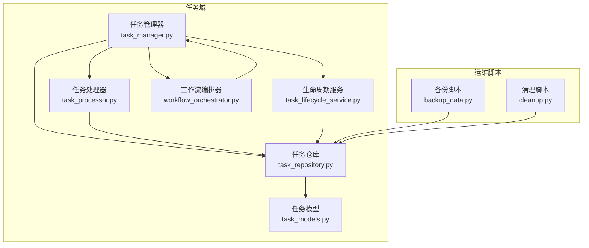
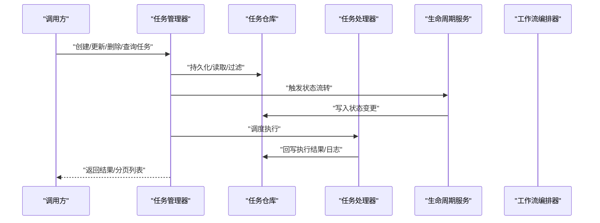
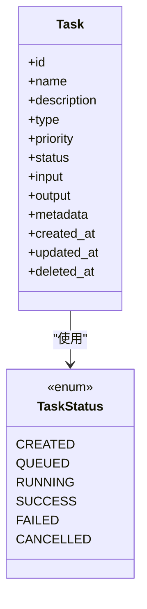
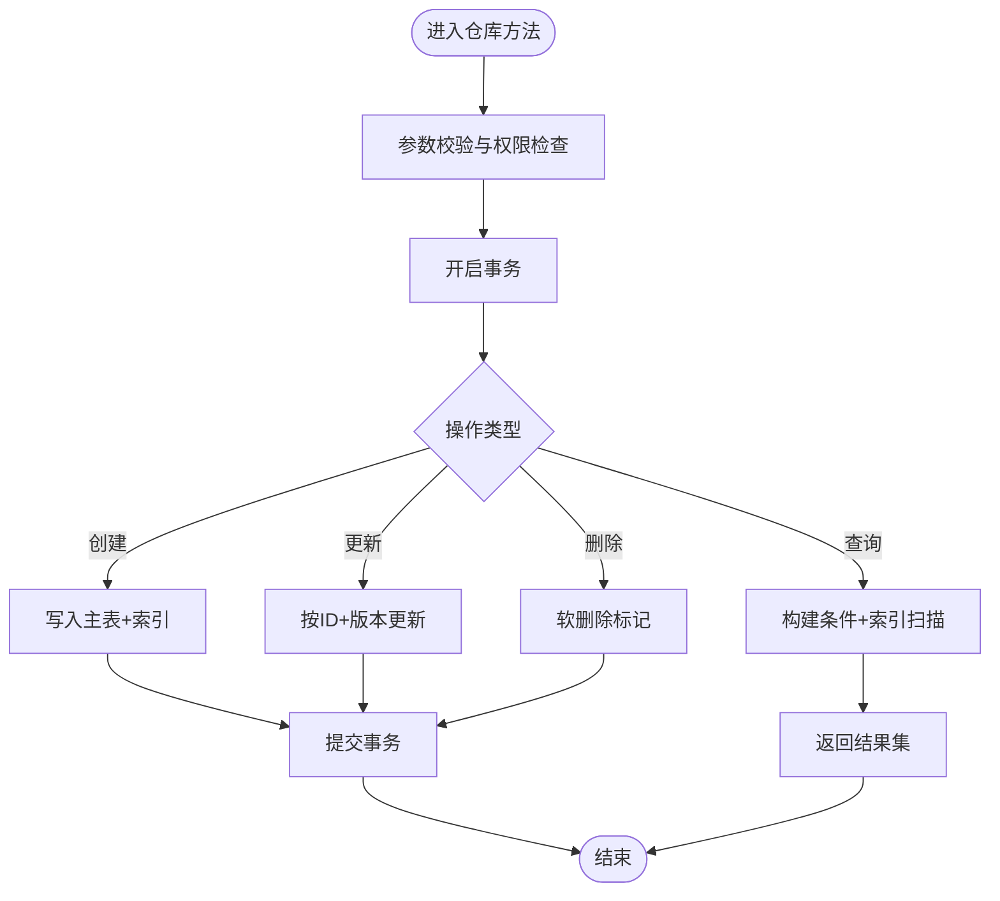
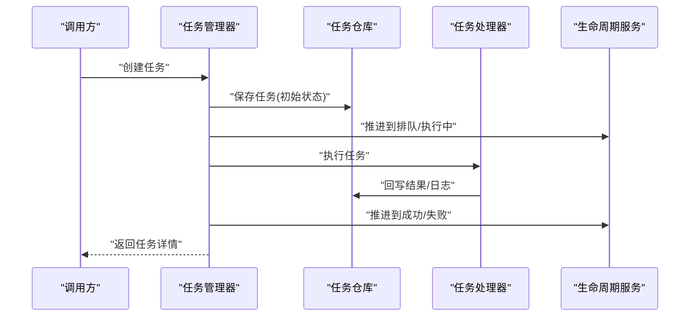
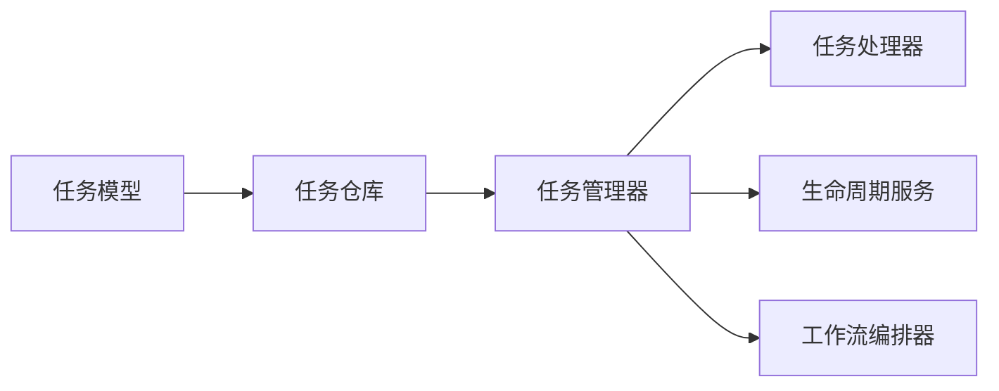

# 任务仓库

<cite>
**本文引用的文件**   
- [task_repository.py](file://src/penshot/task/task_repository.py)
- [task_models.py](file://src/penshot/task/task_models.py)
- [task_manager.py](file://src/penshot/task/task_manager.py)
- [task_lifecycle_service.py](file://src/penshot/task/task_lifecycle_service.py)
- [task_processor.py](file://src/penshot/task/task_processor.py)
- [workflow_orchestrator.py](file://src/penshot/neopen/agent/workflow/workflow_orchestrator.py)
- [backup_data.py](file://scripts/backup_data.py)
- [cleanup.py](file://scripts/cleanup.py)
</cite>

## 目录
1. [简介](#简介)
2. [项目结构](#项目结构)
3. [核心组件](#核心组件)
4. [架构总览](#架构总览)
5. [详细组件分析](#详细组件分析)
6. [依赖关系分析](#依赖关系分析)
7. [性能考虑](#性能考虑)
8. [故障排查指南](#故障排查指南)
9. [结论](#结论)
10. [附录](#附录)

## 简介
本文件围绕“任务仓库”展开，聚焦任务持久化存储的设计与实现、CRUD 接口与数据访问模式、查询与过滤能力、一致性保证与并发控制、备份恢复与迁移策略，以及大规模任务数据的查询优化建议。文档以代码级事实为依据，辅以可视化图示，帮助读者快速理解并高效使用任务系统。

## 项目结构
任务相关代码集中在 src/penshot/task 目录下，核心包括：
- 数据模型定义（任务实体、状态枚举等）
- 任务仓库（持久化与索引）
- 任务管理器（生命周期编排与对外 API）
- 任务处理器（执行与结果落盘）
- 工作流编排器（跨阶段协调）

图表来源
- [task_manager.py](file://src/penshot/task/task_manager.py)
- [task_repository.py](file://src/penshot/task/task_repository.py)
- [task_processor.py](file://src/penshot/task/task_processor.py)
- [task_models.py](file://src/penshot/task/task_models.py)
- [task_lifecycle_service.py](file://src/penshot/task/task_lifecycle_service.py)
- [workflow_orchestrator.py](file://src/penshot/neopen/agent/workflow/workflow_orchestrator.py)
- [backup_data.py](file://scripts/backup_data.py)
- [cleanup.py](file://scripts/cleanup.py)

章节来源
- [task_repository.py](file://src/penshot/task/task_repository.py)
- [task_models.py](file://src/penshot/task/task_models.py)
- [task_manager.py](file://src/penshot/task/task_manager.py)
- [task_lifecycle_service.py](file://src/penshot/task/task_lifecycle_service.py)
- [task_processor.py](file://src/penshot/task/task_processor.py)
- [workflow_orchestrator.py](file://src/penshot/neopen/agent/workflow/workflow_orchestrator.py)
- [backup_data.py](file://scripts/backup_data.py)
- [cleanup.py](file://scripts/cleanup.py)

## 核心组件
- 任务模型：定义任务实体字段、状态枚举、关联关系与约束，作为所有持久化与交互的契约。
- 任务仓库：提供任务的增删改查、批量操作、条件查询与过滤、分页与排序、索引维护、事务与并发控制。
- 任务管理器：封装业务语义，组合仓库与处理器，暴露统一的 CRUD 与生命周期管理接口。
- 任务处理器：负责具体执行逻辑与结果回写，确保执行过程可追踪、可重试、可补偿。
- 生命周期服务：驱动任务从创建到完成/失败的状态流转，保障状态机一致性与幂等性。
- 工作流编排器：在复杂多阶段任务中协调节点顺序、分支与异常处理。

章节来源
- [task_models.py](file://src/penshot/task/task_models.py)
- [task_repository.py](file://src/penshot/task/task_repository.py)
- [task_manager.py](file://src/penshot/task/task_manager.py)
- [task_processor.py](file://src/penshot/task/task_processor.py)
- [task_lifecycle_service.py](file://src/penshot/task/task_lifecycle_service.py)
- [workflow_orchestrator.py](file://src/penshot/neopen/agent/workflow/workflow_orchestrator.py)

## 架构总览
下图展示任务系统在运行时的主要交互路径：上层通过任务管理器发起请求，仓库负责数据存取与索引，处理器执行业务动作并回写结果，生命周期与工作流编排器共同保证流程正确性。

图表来源
- [task_manager.py](file://src/penshot/task/task_manager.py)
- [task_repository.py](file://src/penshot/task/task_repository.py)
- [task_processor.py](file://src/penshot/task/task_processor.py)
- [task_lifecycle_service.py](file://src/penshot/task/task_lifecycle_service.py)
- [workflow_orchestrator.py](file://src/penshot/neopen/agent/workflow/workflow_orchestrator.py)

## 详细组件分析

### 数据模型与存储结构
- 任务实体包含唯一标识、名称/描述、类型、优先级、状态、输入输出、时间戳、扩展元数据等字段。
- 状态采用枚举表示，覆盖创建、排队、执行中、成功、失败、取消等关键阶段。
- 为常用查询维度建立索引键，如任务类型、状态、创建时间、更新时间、标签/分类等复合键。
- 支持软删除标记与审计字段，便于合规与回溯。

图表来源
- [task_models.py](file://src/penshot/task/task_models.py)

章节来源
- [task_models.py](file://src/penshot/task/task_models.py)

### 任务仓库（持久化与索引）
职责与能力
- 提供原子化的 CRUD 接口，支持批量插入/更新、条件查询、分页与排序。
- 维护二级索引，加速按类型、状态、时间范围、标签等维度的检索。
- 提供事务边界与隔离级别配置，保证读写一致性与并发安全。
- 支持软删除与历史版本快照，便于审计与恢复。

典型操作
- 创建任务：校验必填字段、生成 ID、写入主表与索引、返回完整实体。
- 更新任务：基于乐观锁或版本号避免覆盖；对关键字段变更记录审计日志。
- 删除任务：软删除标记，保留历史；可选归档至冷存储。
- 查询与过滤：支持多条件组合、模糊匹配、范围查询、聚合统计。
- 分页与排序：按时间或优先级排序，游标式分页提升大表性能。

并发与一致性
- 使用行级锁或乐观锁机制防止竞态条件。
- 关键路径包裹在事务中，必要时引入幂等键避免重复提交。
- 读写分离场景下，提供最终一致性策略与延迟读规避方案。

图表来源
- [task_repository.py](file://src/penshot/task/task_repository.py)

章节来源
- [task_repository.py](file://src/penshot/task/task_repository.py)

### 任务管理器（CRUD 与生命周期编排）
职责与能力
- 统一对外暴露任务 CRUD 接口，屏蔽底层仓库细节。
- 编排任务生命周期：创建后入队、调度执行、状态推进、失败重试与补偿。
- 提供批量导入导出、异步任务提交与回调通知能力。
- 集成工作流编排器，支持复杂多阶段任务。

典型流程
- 创建任务：构造任务对象 -> 调用仓库保存 -> 初始化状态 -> 返回。
- 启动执行：将任务置为执行中 -> 调度处理器 -> 监听结果 -> 更新状态。
- 查询任务：组合过滤器 -> 调用仓库查询 -> 组装响应。

图表来源
- [task_manager.py](file://src/penshot/task/task_manager.py)
- [task_repository.py](file://src/penshot/task/task_repository.py)
- [task_processor.py](file://src/penshot/task/task_processor.py)
- [task_lifecycle_service.py](file://src/penshot/task/task_lifecycle_service.py)

章节来源
- [task_manager.py](file://src/penshot/task/task_manager.py)
- [task_lifecycle_service.py](file://src/penshot/task/task_lifecycle_service.py)
- [task_processor.py](file://src/penshot/task/task_processor.py)

### 任务处理器（执行与结果回写）
职责与能力
- 根据任务类型选择具体处理器实现。
- 执行前准备上下文、资源与依赖；执行后持久化中间结果与最终产物。
- 支持重试、超时、熔断与降级策略。
- 记录结构化日志与指标，便于观测与排障。

章节来源
- [task_processor.py](file://src/penshot/task/task_processor.py)

### 工作流编排器（多阶段任务协调）
职责与能力
- 定义节点、边与条件分支，编排复杂任务流程。
- 提供全局状态机、错误传播与补偿机制。
- 与任务管理器协作，将阶段结果映射为任务状态演进。

章节来源
- [workflow_orchestrator.py](file://src/penshot/neopen/agent/workflow/workflow_orchestrator.py)

## 依赖关系分析
- 模块内聚：任务模型独立于存储实现，仓库仅依赖模型契约，降低耦合。
- 外部依赖：仓库可能依赖数据库/缓存/消息队列等基础设施，通过抽象层隔离。
- 循环依赖：通过事件或回调解耦处理器与编排器，避免直接双向引用。

图表来源
- [task_models.py](file://src/penshot/task/task_models.py)
- [task_repository.py](file://src/penshot/task/task_repository.py)
- [task_manager.py](file://src/penshot/task/task_manager.py)
- [task_processor.py](file://src/penshot/task/task_processor.py)
- [task_lifecycle_service.py](file://src/penshot/task/task_lifecycle_service.py)
- [workflow_orchestrator.py](file://src/penshot/neopen/agent/workflow/workflow_orchestrator.py)

章节来源
- [task_repository.py](file://src/penshot/task/task_repository.py)
- [task_manager.py](file://src/penshot/task/task_manager.py)

## 性能考虑
- 索引设计
  - 针对高频查询维度建立单列与复合索引，如 (type, status)、(created_at, priority)。
  - 对字符串字段使用前缀索引或倒排索引，平衡空间与查询成本。
- 分页与游标
  - 使用基于时间戳或主键的游标分页，避免深分页带来的性能退化。
- 读写分离与缓存
  - 热点查询走缓存层，设置合理 TTL 与失效策略；写路径保持强一致。
- 批处理与合并
  - 批量写入与索引重建分时段进行，减少在线负载抖动。
- 连接池与并发
  - 调整连接池大小与超时，限制并发度，避免雪崩。
- 监控与告警
  - 跟踪慢查询、锁等待、队列积压等关键指标，及时扩容与优化。

[本节为通用性能建议，不直接分析具体文件]

## 故障排查指南
常见问题与定位步骤
- 任务状态不一致
  - 检查事务边界与幂等键，确认是否存在并发更新冲突。
  - 查看生命周期服务的状态机日志，定位异常分支。
- 查询缓慢
  - 核对索引命中情况，评估是否缺少必要复合索引。
  - 检查分页深度与过滤条件复杂度，尝试游标分页。
- 执行失败与重试风暴
  - 观察处理器重试退避策略与熔断阈值，避免无限重试。
  - 检查外部依赖可用性，启用降级与短路。
- 数据丢失或损坏
  - 使用备份脚本验证最近一次备份完整性。
  - 对比审计日志与快照，定位差异点。

章节来源
- [task_repository.py](file://src/penshot/task/task_repository.py)
- [task_lifecycle_service.py](file://src/penshot/task/task_lifecycle_service.py)
- [task_processor.py](file://src/penshot/task/task_processor.py)

## 结论
任务仓库以清晰的模型契约与高内聚的仓库实现为核心，配合任务管理器与处理器形成完整的任务生命周期闭环。通过合理的索引设计与并发控制，可在大规模数据场景下保持稳定与高性能。结合备份、恢复与迁移策略，可进一步提升系统的可靠性与可运维性。

[本节为总结性内容，不直接分析具体文件]

## 附录

### 备份、恢复与迁移策略
- 备份
  - 定期全量与增量备份，校验备份完整性与可恢复性。
  - 将备份副本异地存放，满足容灾要求。
- 恢复
  - 制定 RTO/RPO 目标，演练恢复流程。
  - 恢复后执行一致性校验与回归测试。
- 迁移
  - 变更前进行灰度与回滚预案。
  - 使用幂等迁移脚本，支持断点续跑与版本回退。

章节来源
- [backup_data.py](file://scripts/backup_data.py)
- [cleanup.py](file://scripts/cleanup.py)