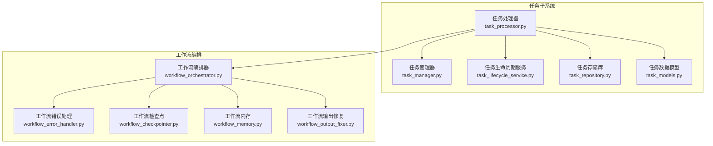
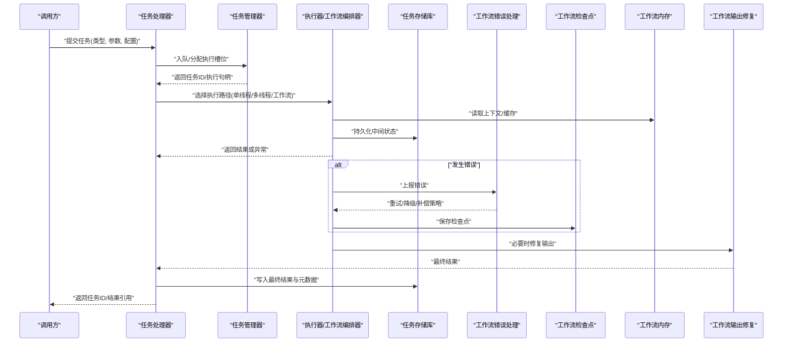
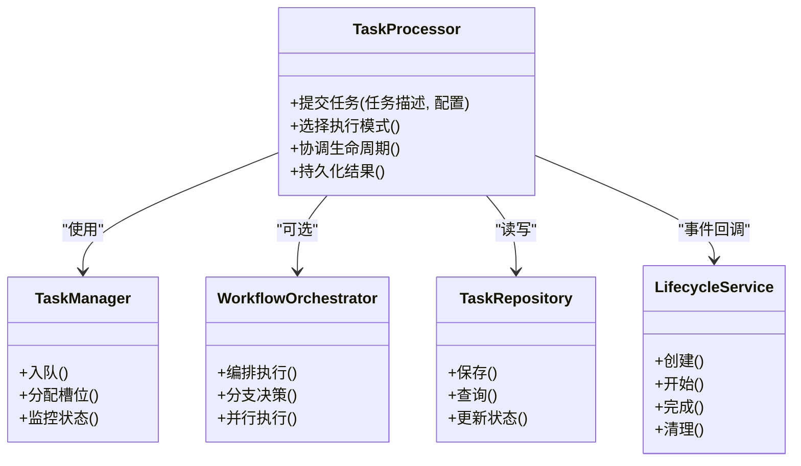
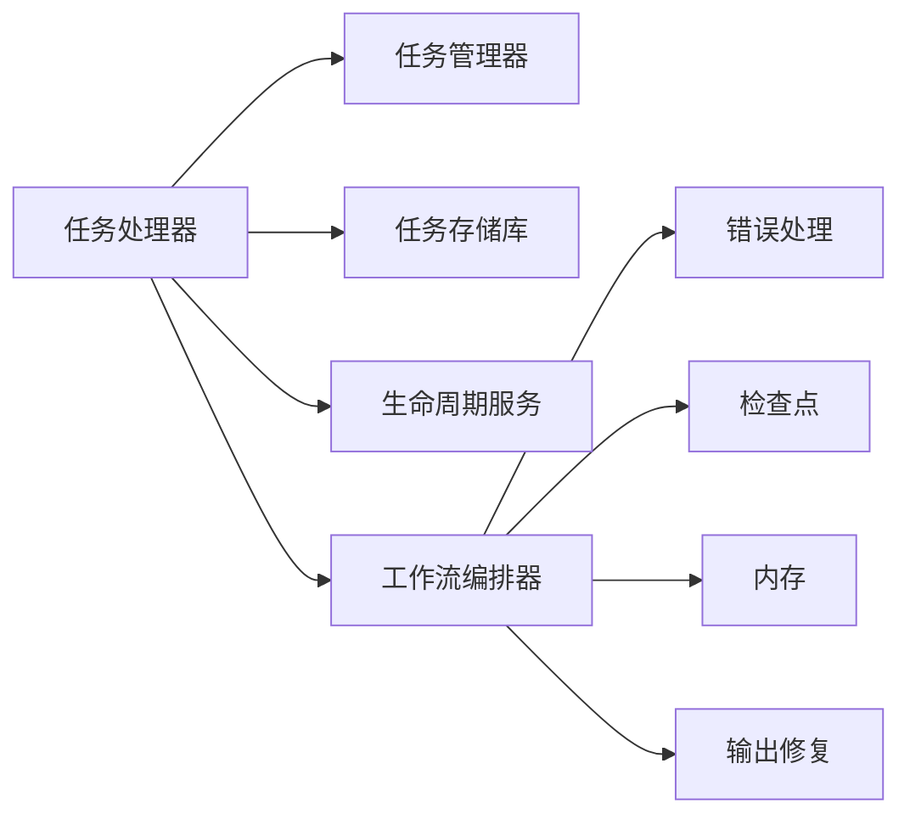

# 任务处理器

<cite>
**本文引用的文件**   
- [task_processor.py](file://src/penshot/neopen/task/task_processor.py)
- [task_manager.py](file://src/penshot/neopen/task/task_manager.py)
- [task_lifecycle_service.py](file://src/penshot/neopen/task/task_lifecycle_service.py)
- [task_repository.py](file://src/penshot/neopen/task/task_repository.py)
- [task_models.py](file://src/penshot/neopen/task/task_models.py)
- [workflow_orchestrator.py](file://src/penshot/neopen/agent/workflow/workflow_orchestrator.py)
- [workflow_error_handler.py](file://src/penshot/neopen/agent/workflow/workflow_error_handler.py)
- [workflow_checkpointer.py](file://src/penshot/neopen/agent/workflow/workflow_checkpointer.py)
- [workflow_memory.py](file://src/penshot/neopen/agent/workflow/workflow_memory.py)
- [workflow_output_fixer.py](file://src/penshot/neopen/agent/workflow/workflow_output_fixer.py)
- [test_task_factory.py](file://tests/task/test_task_factory.py)
- [test_task_lifecycle_service.py](file://tests/task/test_task_lifecycle_service.py)
</cite>

## 目录
1. [简介](#简介)
2. [项目结构](#项目结构)
3. [核心组件](#核心组件)
4. [架构总览](#架构总览)
5. [详细组件分析](#详细组件分析)
6. [依赖关系分析](#依赖关系分析)
7. [性能考量](#性能考量)
8. [故障排查指南](#故障排查指南)
9. [结论](#结论)
10. [附录](#附录)

## 简介
本文件围绕“任务处理器”展开，系统阐述其架构设计与执行模型（单线程与多线程）、任务分发算法与负载均衡策略、配置项与性能调优参数、自定义任务处理器的开发指南与最佳实践、异常处理与错误恢复机制，以及长时间运行与资源密集型任务的应对方案。文档以仓库中的任务子系统为核心，结合工作流编排与持久化能力，提供从概念到代码的完整说明。

## 项目结构
任务处理器位于 neopen 子系统的 task 模块中，并与 workflow 编排层紧密协作。关键目录与职责如下：
- src/penshot/neopen/task：任务生命周期、调度、存储与工厂等核心实现
- src/penshot/neopen/agent/workflow：工作流编排、错误处理、检查点与输出修复等
- tests/task：任务相关单元测试与集成测试

图表来源
- [task_processor.py](file://src/penshot/neopen/task/task_processor.py)
- [task_manager.py](file://src/penshot/neopen/task/task_manager.py)
- [task_lifecycle_service.py](file://src/penshot/neopen/task/task_lifecycle_service.py)
- [task_repository.py](file://src/penshot/neopen/task/task_repository.py)
- [task_models.py](file://src/penshot/neopen/task/task_models.py)
- [workflow_orchestrator.py](file://src/penshot/neopen/agent/workflow/workflow_orchestrator.py)
- [workflow_error_handler.py](file://src/penshot/neopen/agent/workflow/workflow_error_handler.py)
- [workflow_checkpointer.py](file://src/penshot/neopen/agent/workflow/workflow_checkpointer.py)
- [workflow_memory.py](file://src/penshot/neopen/agent/workflow/workflow_memory.py)
- [workflow_output_fixer.py](file://src/penshot/neopen/agent/workflow/workflow_output_fixer.py)

章节来源
- [task_processor.py](file://src/penshot/neopen/task/task_processor.py)
- [task_manager.py](file://src/penshot/neopen/task/task_manager.py)
- [task_lifecycle_service.py](file://src/penshot/neopen/task/task_lifecycle_service.py)
- [task_repository.py](file://src/penshot/neopen/task/task_repository.py)
- [task_models.py](file://src/penshot/neopen/task/task_models.py)
- [workflow_orchestrator.py](file://src/penshot/neopen/agent/workflow/workflow_orchestrator.py)
- [workflow_error_handler.py](file://src/penshot/neopen/agent/workflow/workflow_error_handler.py)
- [workflow_checkpointer.py](file://src/penshot/neopen/agent/workflow/workflow_checkpointer.py)
- [workflow_memory.py](file://src/penshot/neopen/agent/workflow/workflow_memory.py)
- [workflow_output_fixer.py](file://src/penshot/neopen/agent/workflow/workflow_output_fixer.py)

## 核心组件
- 任务处理器：负责接收任务、解析配置、选择执行模式（单线程/多线程）、分派到具体执行器或工作流编排器，并协调结果回写与状态更新。
- 任务管理器：维护任务队列、并发控制、优先级与重试策略，提供任务提交、查询与取消接口。
- 任务生命周期服务：定义任务从创建、入队、执行、完成到清理的全生命周期钩子与事件。
- 任务存储库：抽象任务持久化与检索，支持本地存储或外部存储后端。
- 任务数据模型：统一的任务描述、上下文、结果与元数据结构。
- 工作流编排器：将复杂任务拆分为节点序列或图，进行顺序/并行执行与分支决策。
- 工作流错误处理：捕获异常、分类错误、触发重试或降级路径。
- 工作流检查点：周期性保存中间状态，支持断点续跑。
- 工作流内存：在进程内缓存中间结果与上下文，提升吞吐。
- 工作流输出修复：对不合规输出进行自动修正或提示人工干预。

章节来源
- [task_processor.py](file://src/penshot/neopen/task/task_processor.py)
- [task_manager.py](file://src/penshot/neopen/task/task_manager.py)
- [task_lifecycle_service.py](file://src/penshot/neopen/task/task_lifecycle_service.py)
- [task_repository.py](file://src/penshot/neopen/task/task_repository.py)
- [task_models.py](file://src/penshot/neopen/task/task_models.py)
- [workflow_orchestrator.py](file://src/penshot/neopen/agent/workflow/workflow_orchestrator.py)
- [workflow_error_handler.py](file://src/penshot/neopen/agent/workflow/workflow_error_handler.py)
- [workflow_checkpointer.py](file://src/penshot/neopen/agent/workflow/workflow_checkpointer.py)
- [workflow_memory.py](file://src/penshot/neopen/agent/workflow/workflow_memory.py)
- [workflow_output_fixer.py](file://src/penshot/neopen/agent/workflow/workflow_output_fixer.py)

## 架构总览
任务处理器作为入口，将请求路由至合适的执行路径：简单任务直接执行；复杂任务交由工作流编排器按图执行。执行过程中通过任务管理器进行并发控制与队列管理，并通过存储库持久化状态。错误由工作流错误处理器统一捕获与恢复，检查点保障长任务可中断续跑，内存组件加速热点数据访问，输出修复器保证最终结果的可用性。

图表来源
- [task_processor.py](file://src/penshot/neopen/task/task_processor.py)
- [task_manager.py](file://src/penshot/neopen/task/task_manager.py)
- [workflow_orchestrator.py](file://src/penshot/neopen/agent/workflow/workflow_orchestrator.py)
- [workflow_error_handler.py](file://src/penshot/neopen/agent/workflow/workflow_error_handler.py)
- [workflow_checkpointer.py](file://src/penshot/neopen/agent/workflow/workflow_checkpointer.py)
- [workflow_memory.py](file://src/penshot/neopen/agent/workflow/workflow_memory.py)
- [workflow_output_fixer.py](file://src/penshot/neopen/agent/workflow/workflow_output_fixer.py)
- [task_repository.py](file://src/penshot/neopen/task/task_repository.py)

## 详细组件分析

### 任务处理器（TaskProcessor）
- 职责
  - 解析任务类型与执行策略（单线程/多线程/工作流）
  - 根据负载与资源情况选择执行器
  - 协调任务生命周期事件与结果回写
- 关键流程
  - 接收任务 -> 校验与标准化 -> 选择执行模式 -> 提交到任务管理器 -> 监听执行状态 -> 持久化结果 -> 返回响应
- 并发模型
  - 单线程：适用于轻量、串行依赖强的任务
  - 多线程：适用于 I/O 密集或可并行化的计算任务
  - 工作流：适用于多阶段、有分支与条件判断的复杂任务
- 配置要点
  - 最大并发数、队列容量、超时时间、重试次数、检查点间隔、输出修复开关等

图表来源
- [task_processor.py](file://src/penshot/neopen/task/task_processor.py)
- [task_manager.py](file://src/penshot/neopen/task/task_manager.py)
- [workflow_orchestrator.py](file://src/penshot/neopen/agent/workflow/workflow_orchestrator.py)
- [task_repository.py](file://src/penshot/neopen/task/task_repository.py)
- [task_lifecycle_service.py](file://src/penshot/neopen/task/task_lifecycle_service.py)

章节来源
- [task_processor.py](file://src/penshot/neopen/task/task_processor.py)
- [task_manager.py](file://src/penshot/neopen/task/task_manager.py)
- [task_lifecycle_service.py](file://src/penshot/neopen/task/task_lifecycle_service.py)
- [task_repository.py](file://src/penshot/neopen/task/task_repository.py)
- [task_models.py](file://src/penshot/neopen/task/task_models.py)

### 任务管理器（TaskManager）
- 职责
  - 维护任务队列与执行槽位
  - 控制并发度与优先级
  - 提供任务提交、查询、取消与统计接口
- 关键特性
  - 队列容量限制与背压
  - 动态扩缩容（基于 CPU/IO 指标）
  - 任务优先级与公平调度
- 与任务处理器的交互
  - 处理器提交任务后，管理器分配槽位并返回句柄供后续查询

章节来源
- [task_manager.py](file://src/penshot/neopen/task/task_manager.py)

### 任务生命周期服务（LifecycleService）
- 职责
  - 定义任务各阶段的钩子：创建、入队、开始、进行中、完成、失败、清理
  - 提供扩展点用于审计、监控与告警
- 典型用法
  - 在开始阶段记录耗时与资源占用
  - 在失败阶段收集诊断信息
  - 在清理阶段释放临时资源

章节来源
- [task_lifecycle_service.py](file://src/penshot/neopen/task/task_lifecycle_service.py)

### 任务存储库（TaskRepository）
- 职责
  - 抽象任务数据的持久化与检索
  - 支持事务性更新与一致性保证
- 设计要点
  - 读写分离（读多写少场景）
  - 批量写入优化
  - 索引与分页查询

章节来源
- [task_repository.py](file://src/penshot/neopen/task/task_repository.py)

### 任务数据模型（TaskModels）
- 职责
  - 统一任务描述、上下文、结果与元数据结构
  - 为序列化、校验与版本兼容提供基础
- 关键字段
  - 任务 ID、类型、参数、状态、错误信息、结果引用、时间戳等

章节来源
- [task_models.py](file://src/penshot/neopen/task/task_models.py)

### 工作流编排器（WorkflowOrchestrator）
- 职责
  - 将复杂任务分解为节点序列或图
  - 支持顺序、并行、分支与汇聚
  - 与错误处理、检查点、内存与输出修复协同
- 执行模型
  - 同步/异步混合执行
  - 节点级重试与熔断
  - 中间状态快照

章节来源
- [workflow_orchestrator.py](file://src/penshot/neopen/agent/workflow/workflow_orchestrator.py)

### 工作流错误处理（WorkflowErrorHandler）
- 职责
  - 捕获与分类异常
  - 触发重试、降级、补偿或人工介入
- 策略
  - 指数退避重试
  - 快速失败与熔断
  - 错误聚合与报告

章节来源
- [workflow_error_handler.py](file://src/penshot/neopen/agent/workflow/workflow_error_handler.py)

### 工作流检查点（WorkflowCheckpointer）
- 职责
  - 周期性保存中间状态
  - 支持断点续跑与回滚
- 关键点
  - 检查点粒度与频率权衡
  - 幂等性与一致性

章节来源
- [workflow_checkpointer.py](file://src/penshot/neopen/agent/workflow/workflow_checkpointer.py)

### 工作流内存（WorkflowMemory）
- 职责
  - 进程内缓存热点上下文与中间结果
  - 减少重复计算与 I/O
- 策略
  - TTL 过期与淘汰
  - 内存上限与压缩

章节来源
- [workflow_memory.py](file://src/penshot/neopen/agent/workflow/workflow_memory.py)

### 工作流输出修复（WorkflowOutputFixer）
- 职责
  - 检测并自动修复不合规输出
  - 提供规则与启发式修复策略
- 适用场景
  - LLM 输出格式不稳定
  - 下游强约束解析

章节来源
- [workflow_output_fixer.py](file://src/penshot/neopen/agent/workflow/workflow_output_fixer.py)

## 依赖关系分析
任务处理器与工作流编排、错误处理、检查点、内存与输出修复之间存在明确的依赖关系。下图展示了主要模块间的耦合与协作方式。

图表来源
- [task_processor.py](file://src/penshot/neopen/task/task_processor.py)
- [task_manager.py](file://src/penshot/neopen/task/task_manager.py)
- [task_repository.py](file://src/penshot/neopen/task/task_repository.py)
- [task_lifecycle_service.py](file://src/penshot/neopen/task/task_lifecycle_service.py)
- [workflow_orchestrator.py](file://src/penshot/neopen/agent/workflow/workflow_orchestrator.py)
- [workflow_error_handler.py](file://src/penshot/neopen/agent/workflow/workflow_error_handler.py)
- [workflow_checkpointer.py](file://src/penshot/neopen/agent/workflow/workflow_checkpointer.py)
- [workflow_memory.py](file://src/penshot/neopen/agent/workflow/workflow_memory.py)
- [workflow_output_fixer.py](file://src/penshot/neopen/agent/workflow/workflow_output_fixer.py)

章节来源
- [task_processor.py](file://src/penshot/neopen/task/task_processor.py)
- [task_manager.py](file://src/penshot/neopen/task/task_manager.py)
- [task_repository.py](file://src/penshot/neopen/task/task_repository.py)
- [task_lifecycle_service.py](file://src/penshot/neopen/task/task_lifecycle_service.py)
- [workflow_orchestrator.py](file://src/penshot/neopen/agent/workflow/workflow_orchestrator.py)
- [workflow_error_handler.py](file://src/penshot/neopen/agent/workflow/workflow_error_handler.py)
- [workflow_checkpointer.py](file://src/penshot/neopen/agent/workflow/workflow_checkpointer.py)
- [workflow_memory.py](file://src/penshot/neopen/agent/workflow/workflow_memory.py)
- [workflow_output_fixer.py](file://src/penshot/neopen/agent/workflow/workflow_output_fixer.py)

## 性能考量
- 并发与队列
  - 合理设置最大并发数与队列容量，避免 OOM 与背压
  - 针对 I/O 密集任务提高并发，CPU 密集任务适度降低并发
- 负载均衡
  - 基于任务类型与资源需求进行分流
  - 动态扩缩容与弹性伸缩
- 检查点与内存
  - 调整检查点频率，平衡持久化开销与恢复成本
  - 启用内存缓存以减少重复计算
- 错误恢复
  - 采用指数退避与熔断，避免雪崩
  - 对可重试错误进行自动重试，不可重试错误快速失败
- 长时间运行与资源密集型任务
  - 拆分大任务为子任务并行处理
  - 使用增量处理与流式输出
  - 定期保存检查点，支持中断续跑

[本节为通用指导，无需特定文件来源]

## 故障排查指南
- 常见问题定位
  - 任务堆积：检查队列容量与并发配置
  - 频繁重试：查看错误分类与重试策略
  - 输出不一致：启用输出修复与校验
  - 内存泄漏：检查内存缓存与对象生命周期
- 诊断手段
  - 利用生命周期钩子采集指标
  - 通过检查点恢复最近一致状态
  - 使用错误处理器聚合异常堆栈与上下文
- 恢复策略
  - 重启失败节点并加载检查点
  - 降级到规则引擎或模板输出
  - 人工介入修正输入或参数

章节来源
- [workflow_error_handler.py](file://src/penshot/neopen/agent/workflow/workflow_error_handler.py)
- [workflow_checkpointer.py](file://src/penshot/neopen/agent/workflow/workflow_checkpointer.py)
- [workflow_output_fixer.py](file://src/penshot/neopen/agent/workflow/workflow_output_fixer.py)
- [task_lifecycle_service.py](file://src/penshot/neopen/task/task_lifecycle_service.py)

## 结论
任务处理器通过清晰的模块化设计与灵活的执行模型，能够胜任从简单任务到复杂工作流的多样化场景。配合任务管理器、存储库与生命周期服务，实现了高可用与可扩展的任务处理能力。工作流编排、错误处理、检查点、内存与输出修复共同构成了稳健的执行环境，适合长时间运行与资源密集型任务。

[本节为总结性内容，无需特定文件来源]

## 附录

### 配置选项与性能调优参数
- 执行模式
  - 单线程：串行执行，适合强依赖与轻量任务
  - 多线程：并行执行，适合 I/O 密集与可并行任务
  - 工作流：图编排，适合多阶段与分支逻辑
- 队列与并发
  - 最大并发数、队列容量、优先级权重
- 超时与重试
  - 任务超时、节点超时、重试次数、退避策略
- 检查点与内存
  - 检查点间隔、内存上限、TTL 与淘汰策略
- 输出修复
  - 修复开关、规则集、人工介入阈值

章节来源
- [task_processor.py](file://src/penshot/neopen/task/task_processor.py)
- [task_manager.py](file://src/penshot/neopen/task/task_manager.py)
- [workflow_orchestrator.py](file://src/penshot/neopen/agent/workflow/workflow_orchestrator.py)
- [workflow_checkpointer.py](file://src/penshot/neopen/agent/workflow/workflow_checkpointer.py)
- [workflow_memory.py](file://src/penshot/neopen/agent/workflow/workflow_memory.py)
- [workflow_output_fixer.py](file://src/penshot/neopen/agent/workflow/workflow_output_fixer.py)

### 自定义任务处理器开发指南与最佳实践
- 步骤
  - 继承任务处理器基类或实现相应接口
  - 注册任务类型与执行器映射
  - 实现生命周期钩子与错误处理
  - 编写单元测试与集成测试
- 最佳实践
  - 保持幂等与可重入
  - 明确输入输出契约与校验
  - 合理使用检查点与内存缓存
  - 对资源密集型任务进行限流与隔离

章节来源
- [task_processor.py](file://src/penshot/neopen/task/task_processor.py)
- [task_lifecycle_service.py](file://src/penshot/neopen/task/task_lifecycle_service.py)
- [test_task_factory.py](file://tests/task/test_task_factory.py)
- [test_task_lifecycle_service.py](file://tests/task/test_task_lifecycle_service.py)

### 任务分发算法与负载均衡策略
- 分发算法
  - 基于任务类型的静态路由
  - 基于资源需求的动态路由
  - 基于优先级的加权轮询
- 负载均衡
  - 节点健康检查与剔除
  - 动态扩缩容与弹性伸缩
  - 热点任务亲和与反亲和

章节来源
- [task_manager.py](file://src/penshot/neopen/task/task_manager.py)
- [workflow_orchestrator.py](file://src/penshot/neopen/agent/workflow/workflow_orchestrator.py)

### 长时间运行与资源密集型任务处理
- 策略
  - 任务拆分与并行化
  - 流式处理与增量持久化
  - 检查点与断点续跑
  - 资源隔离与配额限制
- 监控与告警
  - 关键指标采集与阈值告警
  - 异常聚合与根因分析

章节来源
- [workflow_checkpointer.py](file://src/penshot/neopen/agent/workflow/workflow_checkpointer.py)
- [workflow_memory.py](file://src/penshot/neopen/agent/workflow/workflow_memory.py)
- [workflow_error_handler.py](file://src/penshot/neopen/agent/workflow/workflow_error_handler.py)