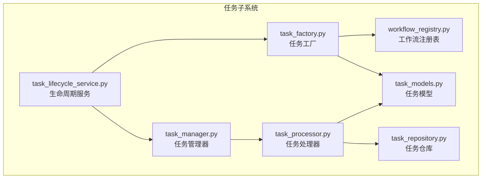
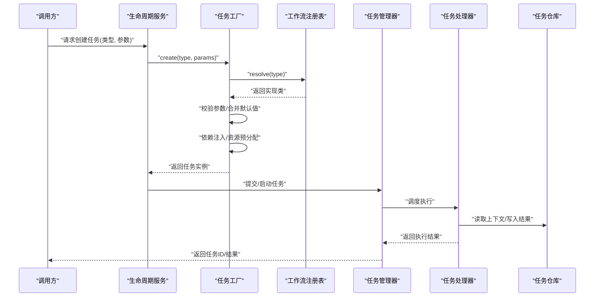
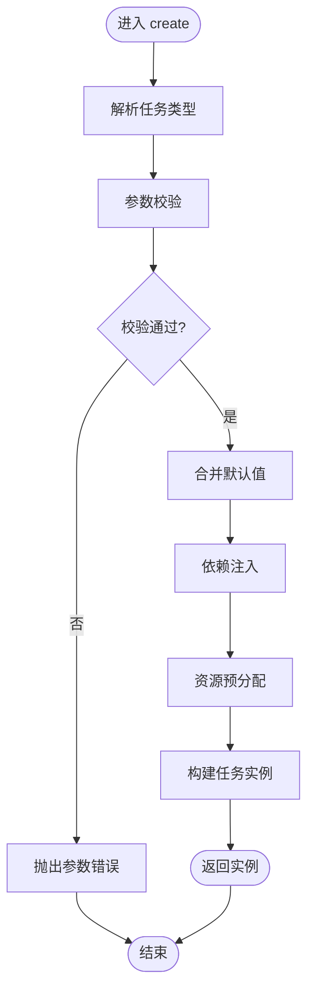
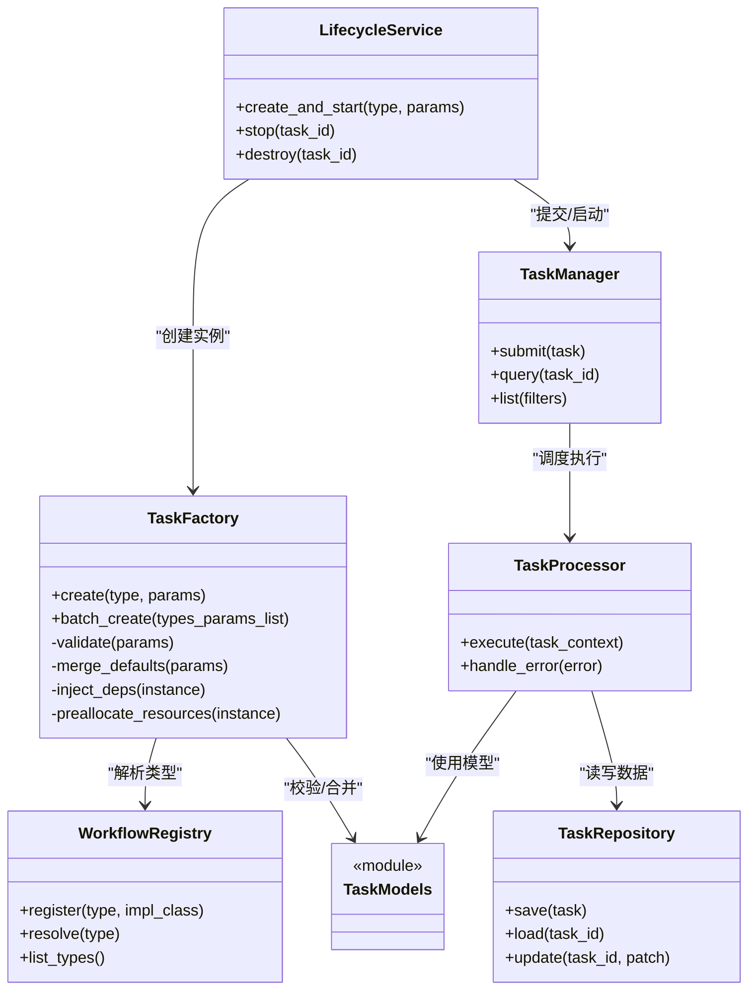
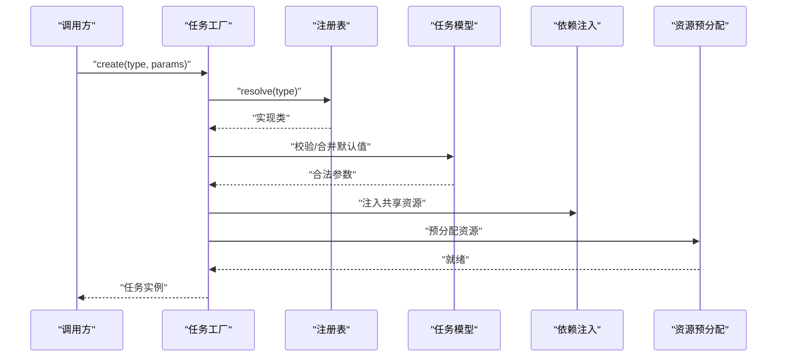

# 任务工厂

<cite>
**本文引用的文件**   
- [src/penshot/neopen/task/task_factory.py](file://src/penshot/neopen/task/task_factory.py)
- [src/penshot/neopen/task/task_manager.py](file://src/penshot/neopen/task/task_manager.py)
- [src/penshot/neopen/task/task_processor.py](file://src/penshot/neopen/task/task_processor.py)
- [src/penshot/neopen/task/task_repository.py](file://src/penshot/neopen/task/task_repository.py)
- [src/penshot/neopen/task/task_lifecycle_service.py](file://src/penshot/neopen/task/task_lifecycle_service.py)
- [src/penshot/neopen/task/workflow_registry.py](file://src/penshot/neopen/task/workflow_registry.py)
- [src/penshot/neopen/task/task_models.py](file://src/penshot/neopen/task/task_models.py)
- [tests/task/test_task_factory.py](file://tests/task/test_task_factory.py)
</cite>

## 目录
1. [简介](#简介)
2. [项目结构](#项目结构)
3. [核心组件](#核心组件)
4. [架构总览](#架构总览)
5. [详细组件分析](#详细组件分析)
6. [依赖关系分析](#依赖关系分析)
7. [性能考虑](#性能考虑)
8. [故障排查指南](#故障排查指南)
9. [结论](#结论)
10. [附录](#附录)

## 简介
本文件围绕“任务工厂”的设计与实现，系统性阐述任务实例的创建、注册、参数校验、默认值处理、依赖注入与资源预分配策略，并提供自定义任务类型的扩展指南与批量优化建议。文档面向不同技术背景的读者，既提供高层概览，也深入到代码级结构与数据流。

## 项目结构
任务工厂位于 neopen 子系统的 task 模块中，围绕“工厂方法 + 注册表 + 生命周期服务 + 处理器/仓库”的组合模式组织：
- 工厂层：负责根据类型选择具体任务类并构造实例
- 注册表：维护任务类型到实现的映射
- 生命周期服务：管理任务的创建、启动、停止、销毁等阶段
- 处理器/仓库：承载执行逻辑与持久化访问
- 模型定义：统一任务输入输出与状态模型

图表来源
- [src/penshot/neopen/task/task_factory.py](file://src/penshot/neopen/task/task_factory.py)
- [src/penshot/neopen/task/workflow_registry.py](file://src/penshot/neopen/task/workflow_registry.py)
- [src/penshot/neopen/task/task_lifecycle_service.py](file://src/penshot/neopen/task/task_lifecycle_service.py)
- [src/penshot/neopen/task/task_manager.py](file://src/penshot/neopen/task/task_manager.py)
- [src/penshot/neopen/task/task_processor.py](file://src/penshot/neopen/task/task_processor.py)
- [src/penshot/neopen/task/task_repository.py](file://src/penshot/neopen/task/task_repository.py)
- [src/penshot/neopen/task/task_models.py](file://src/penshot/neopen/task/task_models.py)

章节来源
- [src/penshot/neopen/task/task_factory.py](file://src/penshot/neopen/task/task_factory.py)
- [src/penshot/neopen/task/workflow_registry.py](file://src/penshot/neopen/task/workflow_registry.py)
- [src/penshot/neopen/task/task_lifecycle_service.py](file://src/penshot/neopen/task/task_lifecycle_service.py)
- [src/penshot/neopen/task/task_manager.py](file://src/penshot/neopen/task/task_manager.py)
- [src/penshot/neopen/task/task_processor.py](file://src/penshot/neopen/task/task_processor.py)
- [src/penshot/neopen/task/task_repository.py](file://src/penshot/neopen/task/task_repository.py)
- [src/penshot/neopen/task/task_models.py](file://src/penshot/neopen/task/task_models.py)

## 核心组件
- 任务工厂：依据任务类型解析配置，完成参数校验、默认值合并、依赖注入与实例化；支持批量创建与缓存复用。
- 工作流注册表：集中维护任务类型到实现类的映射，提供新增/覆盖/查询能力。
- 生命周期服务：封装任务从创建到销毁的全流程钩子，协调工厂与管理器。
- 任务管理器：对外暴露任务提交、调度、状态查询等接口。
- 任务处理器：执行业务逻辑，读写任务仓库，产出结果。
- 任务仓库：抽象持久化与检索，屏蔽底层存储差异。
- 任务模型：统一描述任务输入、输出、状态与元数据。

章节来源
- [src/penshot/neopen/task/task_factory.py](file://src/penshot/neopen/task/task_factory.py)
- [src/penshot/neopen/task/workflow_registry.py](file://src/penshot/neopen/task/workflow_registry.py)
- [src/penshot/neopen/task/task_lifecycle_service.py](file://src/penshot/neopen/task/task_lifecycle_service.py)
- [src/penshot/neopen/task/task_manager.py](file://src/penshot/neopen/task/task_manager.py)
- [src/penshot/neopen/task/task_processor.py](file://src/penshot/neopen/task/task_processor.py)
- [src/penshot/neopen/task/task_repository.py](file://src/penshot/neopen/task/task_repository.py)
- [src/penshot/neopen/task/task_models.py](file://src/penshot/neopen/task/task_models.py)

## 架构总览
下图展示任务创建与执行的端到端流程：调用方通过生命周期服务或任务管理器发起创建，工厂解析类型并构建实例，随后由处理器驱动执行，并通过仓库持久化中间态与结果。

图表来源
- [src/penshot/neopen/task/task_lifecycle_service.py](file://src/penshot/neopen/task/task_lifecycle_service.py)
- [src/penshot/neopen/task/task_factory.py](file://src/penshot/neopen/task/task_factory.py)
- [src/penshot/neopen/task/workflow_registry.py](file://src/penshot/neopen/task/workflow_registry.py)
- [src/penshot/neopen/task/task_manager.py](file://src/penshot/neopen/task/task_manager.py)
- [src/penshot/neopen/task/task_processor.py](file://src/penshot/neopen/task/task_processor.py)
- [src/penshot/neopen/task/task_repository.py](file://src/penshot/neopen/task/task_repository.py)

## 详细组件分析

### 任务工厂（TaskFactory）
职责与行为
- 类型解析：基于注册表将字符串类型映射到具体任务类
- 参数校验：对必填字段、取值范围、格式进行验证
- 默认值处理：按优先级合并用户参数与系统默认值
- 依赖注入：为任务实例注入共享资源（如配置、客户端、缓存）
- 资源预分配：在创建阶段完成昂贵资源的预热或连接池初始化
- 批量创建：支持一次性创建多个任务实例，内部可复用公共依赖

关键流程（参数校验与默认值合并）

图表来源
- [src/penshot/neopen/task/task_factory.py](file://src/penshot/neopen/task/task_factory.py)
- [src/penshot/neopen/task/workflow_registry.py](file://src/penshot/neopen/task/workflow_registry.py)

章节来源
- [src/penshot/neopen/task/task_factory.py](file://src/penshot/neopen/task/task_factory.py)
- [src/penshot/neopen/task/workflow_registry.py](file://src/penshot/neopen/task/workflow_registry.py)

### 工作流注册表（WorkflowRegistry）
职责与行为
- 注册：将任务类型字符串与实现类绑定
- 覆盖：允许在特定环境下替换实现
- 查询：根据类型快速定位实现类
- 扫描：支持自动发现与动态加载（若实现包含该机制）

使用要点
- 在应用启动时完成基础类型注册
- 插件式扩展通过二次注册覆盖默认实现
- 避免循环依赖，注册表应保持轻量

章节来源
- [src/penshot/neopen/task/workflow_registry.py](file://src/penshot/neopen/task/workflow_registry.py)

### 生命周期服务（LifecycleService）
职责与行为
- 编排：串联工厂创建、管理器提交、处理器执行、仓库落盘
- 钩子：在创建前后、启动前后、销毁前后提供扩展点
- 事务性：保证创建与初始化的原子性
- 异常恢复：捕获并转换异常，提供统一错误语义

章节来源
- [src/penshot/neopen/task/task_lifecycle_service.py](file://src/penshot/neopen/task/task_lifecycle_service.py)

### 任务管理器（TaskManager）
职责与行为
- 提交：接收任务实例并纳入调度队列
- 状态：提供查询、分页、过滤等能力
- 并发：控制并发度、背压与限流
- 监控：记录指标与日志

章节来源
- [src/penshot/neopen/task/task_manager.py](file://src/penshot/neopen/task/task_manager.py)

### 任务处理器（TaskProcessor）
职责与行为
- 执行：驱动业务逻辑，调用外部服务或工具
- 上下文：读取任务上下文与历史状态
- 结果：标准化输出，触发后续节点或回调
- 容错：重试、降级与熔断

章节来源
- [src/penshot/neopen/task/task_processor.py](file://src/penshot/neopen/task/task_processor.py)

### 任务仓库（TaskRepository）
职责与行为
- 持久化：保存任务输入、中间态与结果
- 检索：按 ID、类型、时间窗口等条件查询
- 一致性：保证读写一致性与幂等性

章节来源
- [src/penshot/neopen/task/task_repository.py](file://src/penshot/neopen/task/task_repository.py)

### 任务模型（TaskModels）
职责与行为
- 输入模型：定义任务参数、约束与默认值
- 输出模型：定义结构化结果与错误码
- 状态模型：定义任务生命周期状态机

章节来源
- [src/penshot/neopen/task/task_models.py](file://src/penshot/neopen/task/task_models.py)

## 依赖关系分析
- 松耦合：工厂仅依赖注册表与模型，不感知具体实现细节
- 可扩展：新增任务类型只需注册新映射，无需改动工厂主流程
- 可测试：各组件均可独立 Mock，便于单元测试与集成测试

图表来源
- [src/penshot/neopen/task/task_factory.py](file://src/penshot/neopen/task/task_factory.py)
- [src/penshot/neopen/task/workflow_registry.py](file://src/penshot/neopen/task/workflow_registry.py)
- [src/penshot/neopen/task/task_lifecycle_service.py](file://src/penshot/neopen/task/task_lifecycle_service.py)
- [src/penshot/neopen/task/task_manager.py](file://src/penshot/neopen/task/task_manager.py)
- [src/penshot/neopen/task/task_processor.py](file://src/penshot/neopen/task/task_processor.py)
- [src/penshot/neopen/task/task_repository.py](file://src/penshot/neopen/task/task_repository.py)
- [src/penshot/neopen/task/task_models.py](file://src/penshot/neopen/task/task_models.py)

章节来源
- [src/penshot/neopen/task/task_factory.py](file://src/penshot/neopen/task/task_factory.py)
- [src/penshot/neopen/task/workflow_registry.py](file://src/penshot/neopen/task/workflow_registry.py)
- [src/penshot/neopen/task/task_lifecycle_service.py](file://src/penshot/neopen/task/task_lifecycle_service.py)
- [src/penshot/neopen/task/task_manager.py](file://src/penshot/neopen/task/task_manager.py)
- [src/penshot/neopen/task/task_processor.py](file://src/penshot/neopen/task/task_processor.py)
- [src/penshot/neopen/task/task_repository.py](file://src/penshot/neopen/task/task_repository.py)
- [src/penshot/neopen/task/task_models.py](file://src/penshot/neopen/task/task_models.py)

## 性能考虑
- 批量创建
  - 复用公共依赖：在 batch_create 中共享配置、连接池、缓存句柄
  - 并行化：对无副作用的创建步骤采用并发，注意限制并发度以避免资源争用
  - 惰性初始化：对昂贵资源采用延迟加载，首次使用时再分配
- 参数校验与默认值
  - 将校验规则与默认值集中在模型层，减少重复逻辑
  - 使用增量合并策略，避免全量拷贝
- 注册表查询
  - 保持 O(1) 查找，避免在热点路径引入额外计算
- 处理器执行
  - 批量化 I/O：合并多次写操作
  - 超时与重试：合理设置退避策略，避免雪崩
- 监控与观测
  - 记录创建耗时、失败率、资源占用，用于容量规划与调优

[本节为通用指导，不涉及具体文件]

## 故障排查指南
- 常见错误
  - 类型未注册：检查注册表是否完成初始化与覆盖
  - 参数校验失败：核对必填字段、类型与取值范围
  - 依赖注入失败：确认共享资源可用且权限正确
  - 资源预分配失败：检查连接池、缓存、外部服务可达性
- 诊断步骤
  - 开启调试日志，关注工厂创建链路与异常堆栈
  - 使用最小复现用例隔离问题
  - 逐步注释依赖注入与资源预分配，定位瓶颈
- 恢复策略
  - 对可重试错误实施指数退避
  - 对不可恢复错误快速失败并告警
  - 保留上下文快照以便回溯

章节来源
- [src/penshot/neopen/task/task_factory.py](file://src/penshot/neopen/task/task_factory.py)
- [src/penshot/neopen/task/task_lifecycle_service.py](file://src/penshot/neopen/task/task_lifecycle_service.py)
- [src/penshot/neopen/task/task_processor.py](file://src/penshot/neopen/task/task_processor.py)

## 结论
任务工厂以“注册表 + 工厂方法 + 生命周期服务”为核心，实现了高内聚、低耦合的任务创建与执行体系。通过统一的参数校验与默认值合并、完善的依赖注入与资源预分配策略，以及可扩展的注册机制，系统具备良好的可维护性与扩展性。配合批量优化与监控手段，可在复杂场景下保持稳定与高性能。

[本节为总结，不涉及具体文件]

## 附录

### 自定义任务类型扩展指南
- 步骤
  - 定义任务模型：在模型文件中声明输入/输出/状态
  - 实现任务处理器：编写业务逻辑与错误处理
  - 注册任务类型：在注册表中绑定类型字符串与实现类
  - 可选：在生命周期服务中增加钩子以接入审计、埋点
- 最佳实践
  - 保持处理器无状态或显式管理状态
  - 将外部依赖通过依赖注入传入，便于测试
  - 为每个任务类型提供单测与集成用例

章节来源
- [src/penshot/neopen/task/workflow_registry.py](file://src/penshot/neopen/task/workflow_registry.py)
- [src/penshot/neopen/task/task_processor.py](file://src/penshot/neopen/task/task_processor.py)
- [src/penshot/neopen/task/task_models.py](file://src/penshot/neopen/task/task_models.py)

### 任务创建过程参考时序

图表来源
- [src/penshot/neopen/task/task_factory.py](file://src/penshot/neopen/task/task_factory.py)
- [src/penshot/neopen/task/workflow_registry.py](file://src/penshot/neopen/task/workflow_registry.py)
- [src/penshot/neopen/task/task_models.py](file://src/penshot/neopen/task/task_models.py)

### 测试与验证
- 单元测试：针对工厂的参数校验、默认值合并、依赖注入进行断言
- 集成测试：端到端验证创建、启动、执行、销毁全流程
- 回归用例：覆盖边界参数、异常路径与并发场景

章节来源
- [tests/task/test_task_factory.py](file://tests/task/test_task_factory.py)