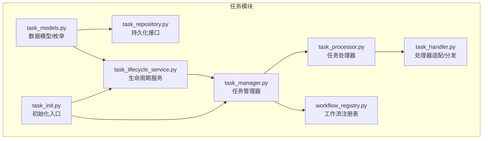
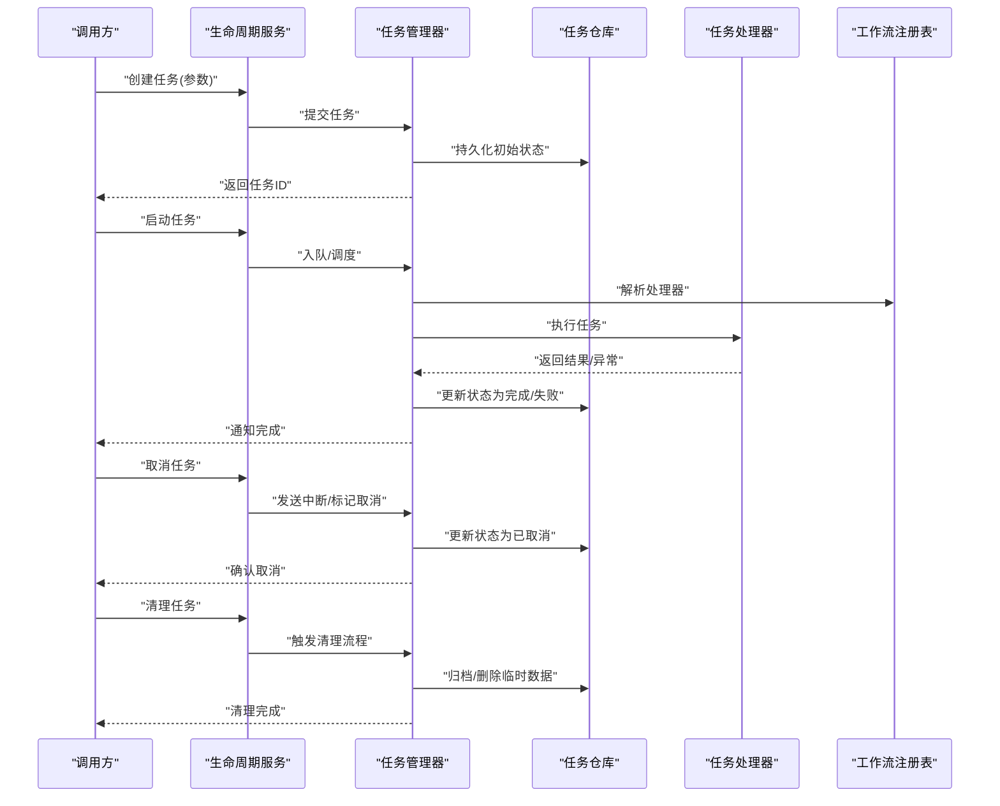
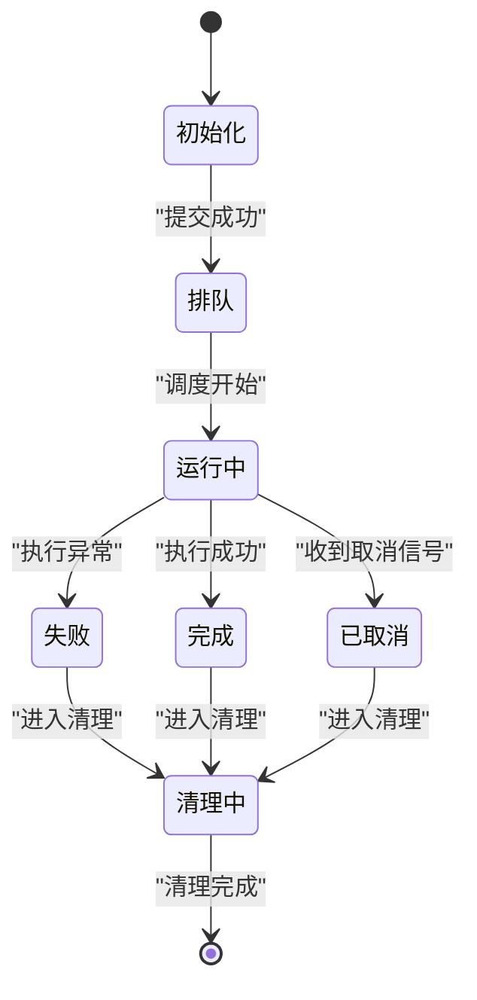
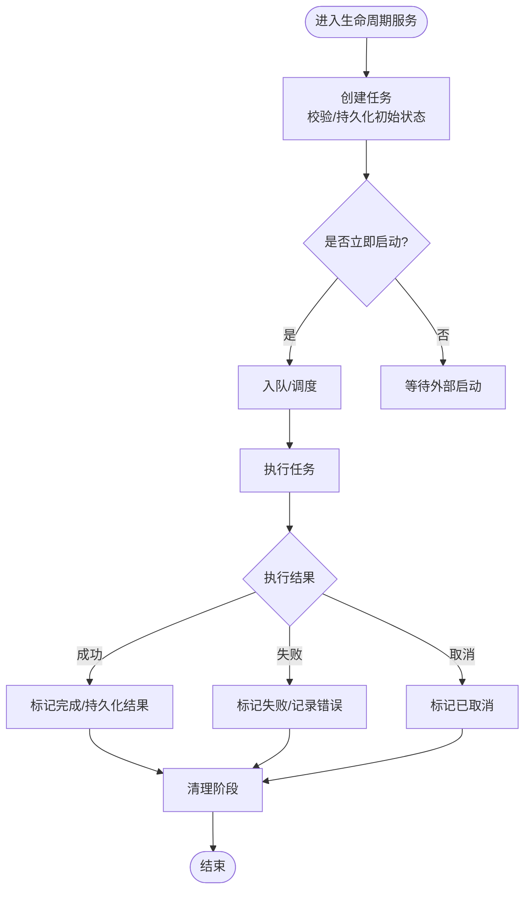
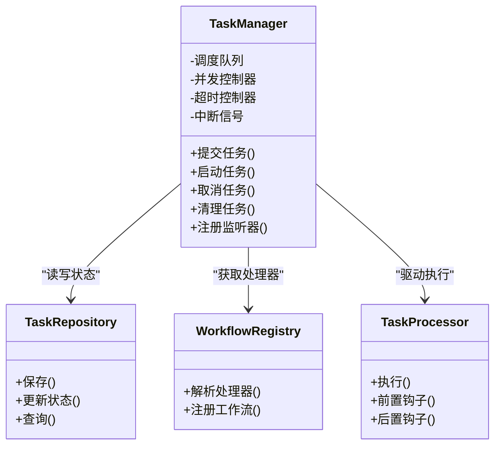
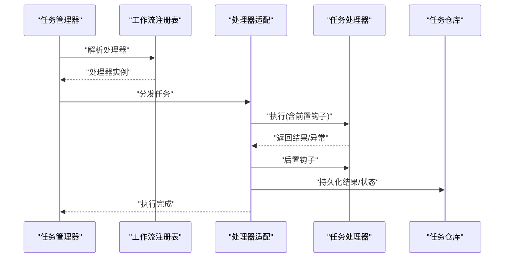
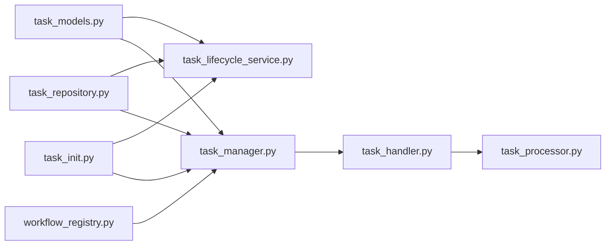

# 任务生命周期管理

<cite>
**本文引用的文件**   
- [src/penshot/neopen/task/task_lifecycle_service.py](file://src/penshot/neopen/task/task_lifecycle_service.py)
- [src/penshot/neopen/task/task_manager.py](file://src/penshot/neopen/task/task_manager.py)
- [src/penshot/neopen/task/task_processor.py](file://src/penshot/neopen/task/task_processor.py)
- [src/penshot/neopen/task/task_handler.py](file://src/penshot/neopen/task/task_handler.py)
- [src/penshot/neopen/task/task_models.py](file://src/penshot/neopen/task/task_models.py)
- [src/penshot/neopen/task/task_repository.py](file://src/penshot/neopen/task/task_repository.py)
- [src/penshot/neopen/task/workflow_registry.py](file://src/penshot/neopen/task/workflow_registry.py)
- [src/penshot/neopen/task/task_init.py](file://src/penshot/neopen/task/task_init.py)
- [tests/task/test_task_lifecycle_service.py](file://tests/task/test_task_lifecycle_service.py)
</cite>

## 目录
1. [简介](#简介)
2. [项目结构](#项目结构)
3. [核心组件](#核心组件)
4. [架构总览](#架构总览)
5. [详细组件分析](#详细组件分析)
6. [依赖关系分析](#依赖关系分析)
7. [性能考虑](#性能考虑)
8. [故障排查指南](#故障排查指南)
9. [结论](#结论)
10. [附录](#附录)

## 简介
本文件聚焦于“任务生命周期管理”的设计与实现，覆盖任务的完整生命周期：初始化、排队、执行、完成与清理；阐述任务状态机的设计与验证规则；说明钩子与回调机制的使用方式；并给出超时处理、中断机制与优雅关闭策略的实践建议。同时提供监控任务状态变化与调试生命周期问题的方法，帮助读者快速定位问题并优化系统稳定性与可观测性。

## 项目结构
任务生命周期相关代码集中在 neopen/task 目录下，围绕“模型定义—仓库持久化—管理器编排—处理器执行—服务编排”的层次组织，辅以工作流注册表与初始化入口。

图表来源
- [src/penshot/neopen/task/task_models.py](file://src/penshot/neopen/task/task_models.py)
- [src/penshot/neopen/task/task_repository.py](file://src/penshot/neopen/task/task_repository.py)
- [src/penshot/neopen/task/task_lifecycle_service.py](file://src/penshot/neopen/task/task_lifecycle_service.py)
- [src/penshot/neopen/task/task_manager.py](file://src/penshot/neopen/task/task_manager.py)
- [src/penshot/neopen/task/task_processor.py](file://src/penshot/neopen/task/task_processor.py)
- [src/penshot/neopen/task/task_handler.py](file://src/penshot/neopen/task/task_handler.py)
- [src/penshot/neopen/task/workflow_registry.py](file://src/penshot/neopen/task/workflow_registry.py)
- [src/penshot/neopen/task/task_init.py](file://src/penshot/neopen/task/task_init.py)

章节来源
- [src/penshot/neopen/task/task_models.py](file://src/penshot/neopen/task/task_models.py)
- [src/penshot/neopen/task/task_lifecycle_service.py](file://src/penshot/neopen/task/task_lifecycle_service.py)
- [src/penshot/neopen/task/task_manager.py](file://src/penshot/neopen/task/task_manager.py)
- [src/penshot/neopen/task/task_processor.py](file://src/penshot/neopen/task/task_processor.py)
- [src/penshot/neopen/task/task_handler.py](file://src/penshot/neopen/task/task_handler.py)
- [src/penshot/neopen/task/task_repository.py](file://src/penshot/neopen/task/task_repository.py)
- [src/penshot/neopen/task/workflow_registry.py](file://src/penshot/neopen/task/workflow_registry.py)
- [src/penshot/neopen/task/task_init.py](file://src/penshot/neopen/task/task_init.py)

## 核心组件
- 数据模型与状态枚举：定义任务实体、上下文、结果以及状态机枚举，作为全链路的状态契约。
- 仓库层：抽象任务数据的读写与查询能力，屏蔽底层存储差异。
- 生命周期服务：对外暴露创建、启动、暂停、恢复、取消、完成、清理等高层操作，协调状态转换与副作用。
- 任务管理器：维护任务集合、调度队列、并发控制、超时与中断信号、监听器/钩子注册。
- 任务处理器：封装具体业务逻辑的执行流程，支持前置/后置钩子、错误处理与结果落盘。
- 处理器适配/分发：根据任务类型或工作流选择具体处理器，统一调用约定。
- 工作流注册表：管理工作流与处理器映射，支持动态扩展。
- 初始化入口：负责加载配置、注册工作流、启动必要资源（如队列、存储、日志）。

章节来源
- [src/penshot/neopen/task/task_models.py](file://src/penshot/neopen/task/task_models.py)
- [src/penshot/neopen/task/task_repository.py](file://src/penshot/neopen/task/task_repository.py)
- [src/penshot/neopen/task/task_lifecycle_service.py](file://src/penshot/neopen/task/task_lifecycle_service.py)
- [src/penshot/neopen/task/task_manager.py](file://src/penshot/neopen/task/task_manager.py)
- [src/penshot/neopen/task/task_processor.py](file://src/penshot/neopen/task/task_processor.py)
- [src/penshot/neopen/task/task_handler.py](file://src/penshot/neopen/task/task_handler.py)
- [src/penshot/neopen/task/workflow_registry.py](file://src/penshot/neopen/task/workflow_registry.py)
- [src/penshot/neopen/task/task_init.py](file://src/penshot/neopen/task/task_init.py)

## 架构总览
下图展示了任务从创建到清理的关键路径与组件交互。

图表来源
- [src/penshot/neopen/task/task_lifecycle_service.py](file://src/penshot/neopen/task/task_lifecycle_service.py)
- [src/penshot/neopen/task/task_manager.py](file://src/penshot/neopen/task/task_manager.py)
- [src/penshot/neopen/task/task_repository.py](file://src/penshot/neopen/task/task_repository.py)
- [src/penshot/neopen/task/task_processor.py](file://src/penshot/neopen/task/task_processor.py)
- [src/penshot/neopen/task/workflow_registry.py](file://src/penshot/neopen/task/workflow_registry.py)

## 详细组件分析

### 任务状态机设计
- 状态定义：通过枚举集中管理所有合法状态，包括初始化、排队、运行中、完成、失败、已取消、清理中等。
- 转换规则：每个转换需满足前驱状态约束与后置条件校验，避免非法跳转。
- 一致性保障：状态变更必须原子写入仓库，并在内存中同步更新，确保读一致。
- 可观测性：每次状态变更记录审计日志，便于追踪与回放。

图表来源
- [src/penshot/neopen/task/task_models.py](file://src/penshot/neopen/task/task_models.py)
- [src/penshot/neopen/task/task_lifecycle_service.py](file://src/penshot/neopen/task/task_lifecycle_service.py)

章节来源
- [src/penshot/neopen/task/task_models.py](file://src/penshot/neopen/task/task_models.py)
- [src/penshot/neopen/task/task_lifecycle_service.py](file://src/penshot/neopen/task/task_lifecycle_service.py)

### 生命周期服务（创建/启动/取消/完成/清理）
- 职责边界：对外暴露统一的 API，内部协调管理器、仓库与处理器，保证状态转换的合法性与副作用顺序。
- 关键流程：
  - 创建：校验输入、生成唯一 ID、持久化初始状态、返回任务句柄。
  - 启动：将任务加入调度队列，触发处理器执行。
  - 取消：向处理器发送中断信号，更新状态为已取消。
  - 完成：接收执行结果，持久化结果并更新状态。
  - 清理：释放资源、归档数据、删除临时文件。
- 错误处理：对不可恢复错误进行兜底，确保状态机不卡死。

图表来源
- [src/penshot/neopen/task/task_lifecycle_service.py](file://src/penshot/neopen/task/task_lifecycle_service.py)
- [src/penshot/neopen/task/task_manager.py](file://src/penshot/neopen/task/task_manager.py)
- [src/penshot/neopen/task/task_repository.py](file://src/penshot/neopen/task/task_repository.py)

章节来源
- [src/penshot/neopen/task/task_lifecycle_service.py](file://src/penshot/neopen/task/task_lifecycle_service.py)
- [src/penshot/neopen/task/task_manager.py](file://src/penshot/neopen/task/task_manager.py)
- [src/penshot/neopen/task/task_repository.py](file://src/penshot/neopen/task/task_repository.py)

### 任务管理器（调度/并发/超时/中断）
- 任务集合：维护任务实例、状态缓存、优先级与权重。
- 调度队列：支持 FIFO/优先级队列，按策略分配处理器。
- 并发控制：限制最大并行度，防止资源耗尽。
- 超时处理：为任务设置执行超时，超时后触发取消与清理。
- 中断机制：通过信号或标志位通知处理器尽快退出。
- 监听器：注册状态变更回调，用于告警与指标上报。

图表来源
- [src/penshot/neopen/task/task_manager.py](file://src/penshot/neopen/task/task_manager.py)
- [src/penshot/neopen/task/task_repository.py](file://src/penshot/neopen/task/task_repository.py)
- [src/penshot/neopen/task/workflow_registry.py](file://src/penshot/neopen/task/workflow_registry.py)
- [src/penshot/neopen/task/task_processor.py](file://src/penshot/neopen/task/task_processor.py)

章节来源
- [src/penshot/neopen/task/task_manager.py](file://src/penshot/neopen/task/task_manager.py)
- [src/penshot/neopen/task/task_repository.py](file://src/penshot/neopen/task/task_repository.py)
- [src/penshot/neopen/task/workflow_registry.py](file://src/penshot/neopen/task/workflow_registry.py)
- [src/penshot/neopen/task/task_processor.py](file://src/penshot/neopen/task/task_processor.py)

### 任务处理器与适配器（执行/钩子/错误处理）
- 处理器：封装具体业务逻辑，提供统一执行接口，支持前置/后置钩子、重试与回滚。
- 适配器/分发：根据任务类型或工作流名称选择处理器，统一调用约定。
- 错误处理：捕获异常并转换为标准错误对象，记录堆栈与上下文，便于诊断。
- 结果持久化：将中间结果与最终结果写入仓库，供后续审计与回放。

图表来源
- [src/penshot/neopen/task/task_handler.py](file://src/penshot/neopen/task/task_handler.py)
- [src/penshot/neopen/task/workflow_registry.py](file://src/penshot/neopen/task/workflow_registry.py)
- [src/penshot/neopen/task/task_processor.py](file://src/penshot/neopen/task/task_processor.py)
- [src/penshot/neopen/task/task_repository.py](file://src/penshot/neopen/task/task_repository.py)

章节来源
- [src/penshot/neopen/task/task_handler.py](file://src/penshot/neopen/task/task_handler.py)
- [src/penshot/neopen/task/workflow_registry.py](file://src/penshot/neopen/task/workflow_registry.py)
- [src/penshot/neopen/task/task_processor.py](file://src/penshot/neopen/task/task_processor.py)
- [src/penshot/neopen/task/task_repository.py](file://src/penshot/neopen/task/task_repository.py)

### 初始化入口与装配
- 配置加载：读取环境配置，初始化日志、存储、队列等基础设施。
- 工作流注册：扫描并注册处理器与工作流映射。
- 资源启动：启动必要的后台服务（如调度器、监控采集器）。
- 健康检查：提供就绪与存活探针，便于容器编排。

章节来源
- [src/penshot/neopen/task/task_init.py](file://src/penshot/neopen/task/task_init.py)

## 依赖关系分析
- 低耦合高内聚：模型与仓库解耦，服务层仅依赖抽象接口，便于替换存储与测试。
- 明确边界：处理器只关注业务执行，状态变更由管理器与服务层负责。
- 可扩展性：通过注册表与工作流模式，新增处理器无需修改核心流程。

图表来源
- [src/penshot/neopen/task/task_models.py](file://src/penshot/neopen/task/task_models.py)
- [src/penshot/neopen/task/task_lifecycle_service.py](file://src/penshot/neopen/task/task_lifecycle_service.py)
- [src/penshot/neopen/task/task_manager.py](file://src/penshot/neopen/task/task_manager.py)
- [src/penshot/neopen/task/task_repository.py](file://src/penshot/neopen/task/task_repository.py)
- [src/penshot/neopen/task/workflow_registry.py](file://src/penshot/neopen/task/workflow_registry.py)
- [src/penshot/neopen/task/task_handler.py](file://src/penshot/neopen/task/task_handler.py)
- [src/penshot/neopen/task/task_processor.py](file://src/penshot/neopen/task/task_processor.py)
- [src/penshot/neopen/task/task_init.py](file://src/penshot/neopen/task/task_init.py)

章节来源
- [src/penshot/neopen/task/task_models.py](file://src/penshot/neopen/task/task_models.py)
- [src/penshot/neopen/task/task_lifecycle_service.py](file://src/penshot/neopen/task/task_lifecycle_service.py)
- [src/penshot/neopen/task/task_manager.py](file://src/penshot/neopen/task/task_manager.py)
- [src/penshot/neopen/task/task_repository.py](file://src/penshot/neopen/task/task_repository.py)
- [src/penshot/neopen/task/workflow_registry.py](file://src/penshot/neopen/task/workflow_registry.py)
- [src/penshot/neopen/task/task_handler.py](file://src/penshot/neopen/task/task_handler.py)
- [src/penshot/neopen/task/task_processor.py](file://src/penshot/neopen/task/task_processor.py)
- [src/penshot/neopen/task/task_init.py](file://src/penshot/neopen/task/task_init.py)

## 性能考虑
- 并发度调优：根据 CPU/IO 特性调整最大并行度，避免上下文切换开销过大。
- 队列背压：当消费者慢时，及时限流或丢弃非关键任务，保护系统稳定。
- 批处理与合并：对频繁的小任务进行聚合，减少持久化与网络往返。
- 结果缓存：对幂等任务启用短期缓存，降低重复计算。
- 监控与采样：对热点路径采样日志与指标，避免全量日志带来的 IO 压力。

[本节为通用指导，不涉及具体文件分析]

## 故障排查指南
- 状态不一致：检查状态转换是否经过服务层统一入口，确认持久化与内存同步顺序。
- 任务卡住：查看是否有未释放锁或阻塞 IO，确认超时与中断信号是否生效。
- 处理器异常：核对错误对象与堆栈信息，确认前置/后置钩子是否抛出异常导致状态未更新。
- 资源泄漏：在清理阶段增加资源释放断言，确保文件句柄、连接池正确关闭。
- 回归测试：使用测试用例覆盖常见状态转换路径，确保新改动不影响既有行为。

章节来源
- [tests/task/test_task_lifecycle_service.py](file://tests/task/test_task_lifecycle_service.py)

## 结论
通过清晰的状态机、分层职责与可扩展的处理器注册机制，任务生命周期管理实现了高内聚、低耦合与强一致性的目标。配合完善的钩子、超时与中断机制，系统在复杂场景下仍能提供稳定的执行体验与良好的可观测性。建议在上线前完善监控指标与告警策略，持续优化并发与资源使用效率。

[本节为总结性内容，不涉及具体文件分析]

## 附录
- 最佳实践
  - 始终通过生命周期服务进行状态变更，避免绕过校验。
  - 在处理器中尽量保持幂等，便于重试与恢复。
  - 为关键路径添加审计日志与指标埋点。
  - 合理设置超时与重试次数，避免雪崩。
- 常见问题
  - 状态卡在运行中：检查中断信号与清理流程是否被正确触发。
  - 结果未持久化：确认后置钩子与仓库写入是否成功。
  - 处理器无法解析：检查工作流注册表是否正确加载。

[本节为补充信息，不涉及具体文件分析]