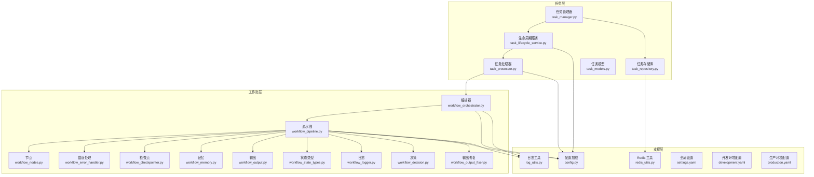
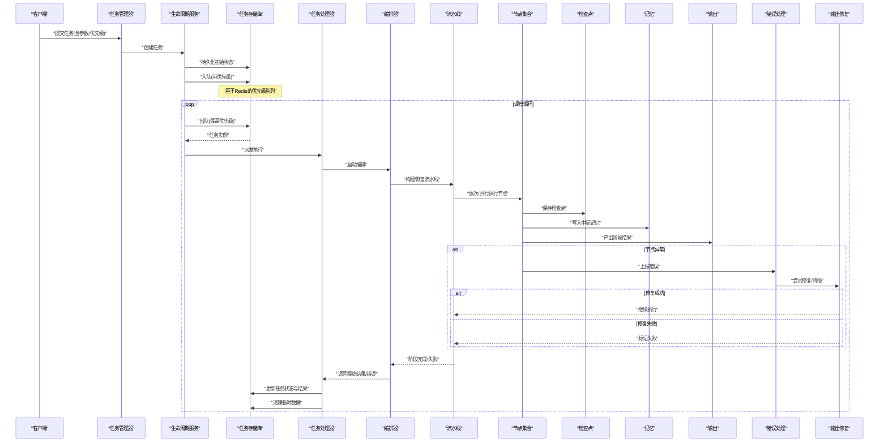
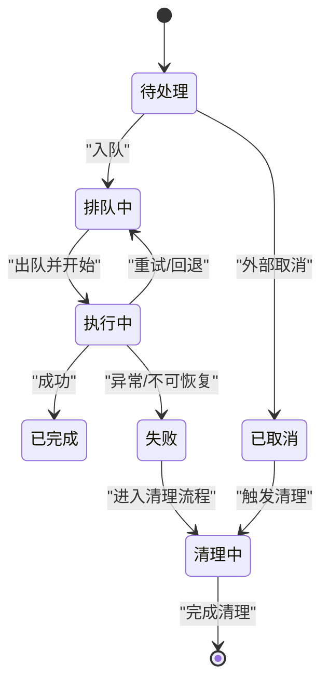
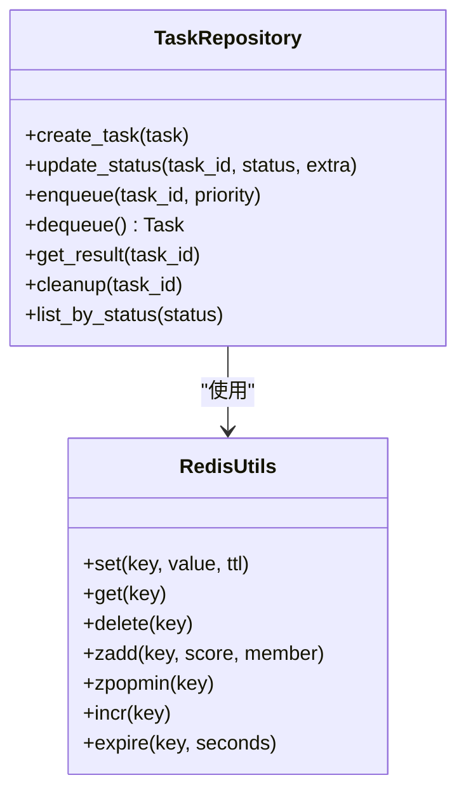
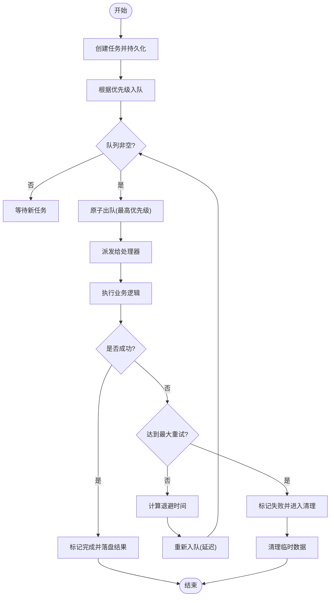
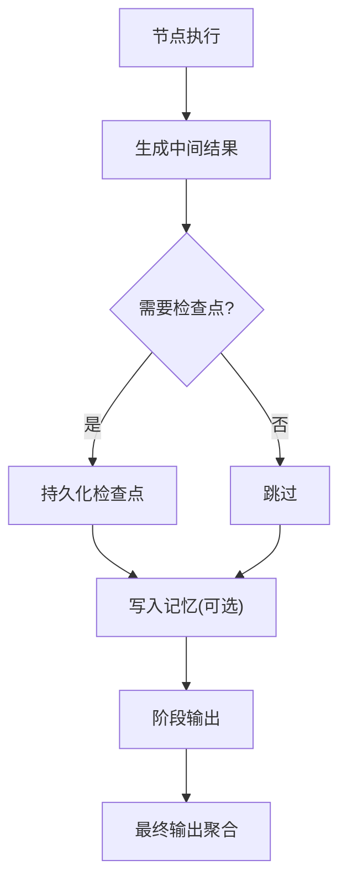
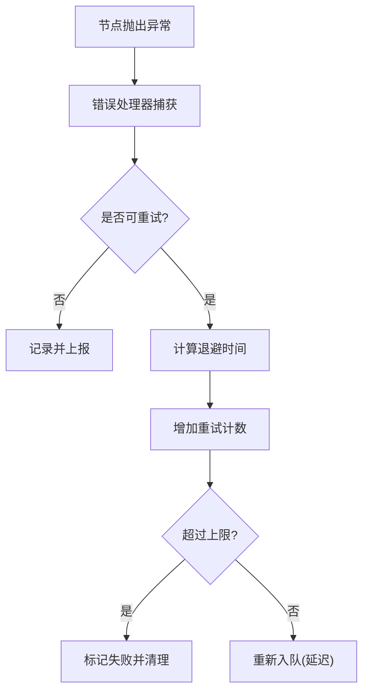
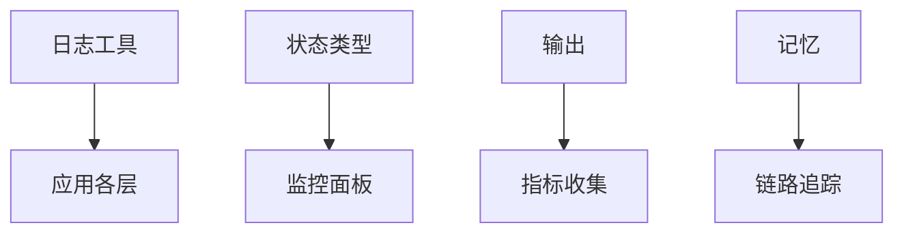
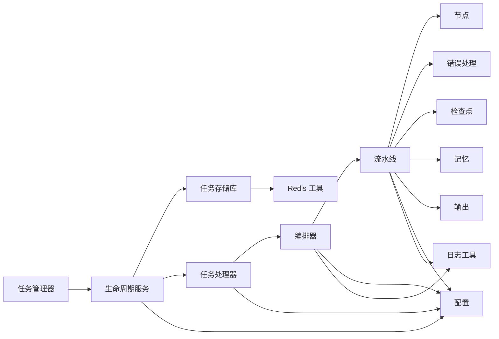

# 任务管理系统

<cite>
**本文引用的文件**   
- [task_manager.py](file://src/penshot/app/task/task_manager.py)
- [task_lifecycle_service.py](file://src/penshot/app/task/task_lifecycle_service.py)
- [task_processor.py](file://src/penshot/app/task/task_processor.py)
- [task_repository.py](file://src/penshot/app/task/task_repository.py)
- [task_models.py](file://src/penshot/app/task/task_models.py)
- [workflow_orchestrator.py](file://src/penshot/app/agent/workflow/workflow_orchestrator.py)
- [workflow_pipeline.py](file://src/penshot/app/agent/workflow/workflow_pipeline.py)
- [workflow_error_handler.py](file://src/penshot/app/agent/workflow/workflow_error_handler.py)
- [workflow_checkpointer.py](file://src/penshot/app/agent/workflow/workflow_checkpointer.py)
- [workflow_memory.py](file://src/penshot/app/agent/workflow/workflow_memory.py)
- [workflow_output.py](file://src/penshot/app/agent/workflow/workflow_output.py)
- [workflow_state_types.py](file://src/penshot/app/agent/workflow/workflow_state_types.py)
- [workflow_logger.py](file://src/penshot/app/agent/workflow/workflow_logger.py)
- [workflow_nodes.py](file://src/penshot/app/agent/workflow/workflow_nodes.py)
- [workflow_decision.py](file://src/penshot/app/agent/workflow/workflow_decision.py)
- [workflow_output_fixer.py](file://src/penshot/app/agent/workflow/workflow_output_fixer.py)
- [redis_utils.py](file://src/penshot/utils/redis_utils.py)
- [log_utils.py](file://src/penshot/utils/log_utils.py)
- [config.py](file://src/penshot/config/config.py)
- [settings.yaml](file://src/penshot/config/settings.yaml)
- [development.yaml](file://src/penshot/config/env/development.yaml)
- [production.yaml](file://src/penshot/config/env/production.yaml)
</cite>

## 目录
1. [简介](#简介)
2. [项目结构](#项目结构)
3. [核心组件](#核心组件)
4. [架构总览](#架构总览)
5. [详细组件分析](#详细组件分析)
6. [依赖关系分析](#依赖关系分析)
7. [性能考虑](#性能考虑)
8. [故障排查指南](#故障排查指南)
9. [结论](#结论)
10. [附录](#附录)

## 简介
本文件围绕“任务管理系统”的目标，系统化阐述任务的生命周期管理（创建、调度、执行、监控、清理）、任务队列与并发控制、优先级与资源分配、状态跟踪与进度监控、失败重试与错误恢复，以及大规模任务处理的优化与调优。文档以仓库中的任务与工作流实现为依据，结合配置与工具模块，提供从高层到代码级的完整说明。

## 项目结构
任务相关能力集中在 src/penshot/app/task 与 src/penshot/app/agent/workflow 两个子包中：
- task 子包负责任务的建模、持久化、生命周期服务、处理器与工厂等；
- workflow 子包负责工作流编排、节点执行、检查点、记忆、输出与错误处理等；
- utils 提供 Redis 与日志等通用能力；
- config 提供配置加载与环境差异化设置。

图表来源
- [task_manager.py](file://src/penshot/app/task/task_manager.py)
- [task_lifecycle_service.py](file://src/penshot/app/task/task_lifecycle_service.py)
- [task_processor.py](file://src/penshot/app/task/task_processor.py)
- [task_repository.py](file://src/penshot/app/task/task_repository.py)
- [task_models.py](file://src/penshot/app/task/task_models.py)
- [workflow_orchestrator.py](file://src/penshot/app/agent/workflow/workflow_orchestrator.py)
- [workflow_pipeline.py](file://src/penshot/app/agent/workflow/workflow_pipeline.py)
- [workflow_error_handler.py](file://src/penshot/app/agent/workflow/workflow_error_handler.py)
- [workflow_checkpointer.py](file://src/penshot/app/agent/workflow/workflow_checkpointer.py)
- [workflow_memory.py](file://src/penshot/app/agent/workflow/workflow_memory.py)
- [workflow_output.py](file://src/penshot/app/agent/workflow/workflow_output.py)
- [workflow_state_types.py](file://src/penshot/app/agent/workflow/workflow_state_types.py)
- [workflow_logger.py](file://src/penshot/app/agent/workflow/workflow_logger.py)
- [workflow_nodes.py](file://src/penshot/app/agent/workflow/workflow_nodes.py)
- [workflow_decision.py](file://src/penshot/app/agent/workflow/workflow_decision.py)
- [workflow_output_fixer.py](file://src/penshot/app/agent/workflow/workflow_output_fixer.py)
- [redis_utils.py](file://src/penshot/utils/redis_utils.py)
- [log_utils.py](file://src/penshot/utils/log_utils.py)
- [config.py](file://src/penshot/config/config.py)
- [settings.yaml](file://src/penshot/config/settings.yaml)
- [development.yaml](file://src/penshot/config/env/development.yaml)
- [production.yaml](file://src/penshot/config/env/production.yaml)

章节来源
- [task_manager.py](file://src/penshot/app/task/task_manager.py)
- [task_lifecycle_service.py](file://src/penshot/app/task/task_lifecycle_service.py)
- [task_processor.py](file://src/penshot/app/task/task_processor.py)
- [task_repository.py](file://src/penshot/app/task/task_repository.py)
- [task_models.py](file://src/penshot/app/task/task_models.py)
- [workflow_orchestrator.py](file://src/penshot/app/agent/workflow/workflow_orchestrator.py)
- [workflow_pipeline.py](file://src/penshot/app/agent/workflow/workflow_pipeline.py)
- [workflow_error_handler.py](file://src/penshot/app/agent/workflow/workflow_error_handler.py)
- [workflow_checkpointer.py](file://src/penshot/app/agent/workflow/workflow_checkpointer.py)
- [workflow_memory.py](file://src/penshot/app/agent/workflow/workflow_memory.py)
- [workflow_output.py](file://src/penshot/app/agent/workflow/workflow_output.py)
- [workflow_state_types.py](file://src/penshot/app/agent/workflow/workflow_state_types.py)
- [workflow_logger.py](file://src/penshot/app/agent/workflow/workflow_logger.py)
- [workflow_nodes.py](file://src/penshot/app/agent/workflow/workflow_nodes.py)
- [workflow_decision.py](file://src/penshot/app/agent/workflow/workflow_decision.py)
- [workflow_output_fixer.py](file://src/penshot/app/agent/workflow/workflow_output_fixer.py)
- [redis_utils.py](file://src/penshot/utils/redis_utils.py)
- [log_utils.py](file://src/penshot/utils/log_utils.py)
- [config.py](file://src/penshot/config/config.py)
- [settings.yaml](file://src/penshot/config/settings.yaml)
- [development.yaml](file://src/penshot/config/env/development.yaml)
- [production.yaml](file://src/penshot/config/env/production.yaml)

## 核心组件
- 任务模型与状态：定义任务实体、状态枚举、元数据与扩展字段，贯穿创建、调度、执行、监控与清理全链路。
- 任务存储库：封装任务数据的读写与查询，支持基于 Redis 的队列与状态存储，提供原子操作与一致性保障。
- 任务生命周期服务：协调任务从创建到终态的流转，包括入队、出队、执行、完成、失败与清理。
- 任务处理器：将具体业务逻辑包装为可调度单元，负责参数校验、上下文装配、调用编排与结果落盘。
- 工作流编排器与流水线：将多个节点按有向图或顺序组合，驱动任务执行并维护中间状态与检查点。
- 错误处理与输出修复：统一捕获异常、记录诊断信息，并在可能时进行自动修复或降级。
- 记忆与检查点：持久化中间状态，支持断点续跑与幂等重放。
- 配置与环境：通过配置文件与环境变量注入并发度、超时、重试策略等关键参数。

章节来源
- [task_models.py](file://src/penshot/app/task/task_models.py)
- [task_repository.py](file://src/penshot/app/task/task_repository.py)
- [task_lifecycle_service.py](file://src/penshot/app/task/task_lifecycle_service.py)
- [task_processor.py](file://src/penshot/app/task/task_processor.py)
- [workflow_orchestrator.py](file://src/penshot/app/agent/workflow/workflow_orchestrator.py)
- [workflow_pipeline.py](file://src/penshot/app/agent/workflow/workflow_pipeline.py)
- [workflow_error_handler.py](file://src/penshot/app/agent/workflow/workflow_error_handler.py)
- [workflow_output_fixer.py](file://src/penshot/app/agent/workflow/workflow_output_fixer.py)
- [workflow_checkpointer.py](file://src/penshot/app/agent/workflow/workflow_checkpointer.py)
- [workflow_memory.py](file://src/penshot/app/agent/workflow/workflow_memory.py)
- [config.py](file://src/penshot/config/config.py)
- [settings.yaml](file://src/penshot/config/settings.yaml)
- [development.yaml](file://src/penshot/config/env/development.yaml)
- [production.yaml](file://src/penshot/config/env/production.yaml)

## 架构总览
任务系统采用“任务层 + 工作流层 + 支撑层”的分层设计：
- 任务层负责任务抽象、持久化与生命周期管理；
- 工作流层负责复杂任务的编排、节点执行、状态推进与容错；
- 支撑层提供配置、日志、缓存/队列等基础设施。

图表来源
- [task_manager.py](file://src/penshot/app/task/task_manager.py)
- [task_lifecycle_service.py](file://src/penshot/app/task/task_lifecycle_service.py)
- [task_repository.py](file://src/penshot/app/task/task_repository.py)
- [task_processor.py](file://src/penshot/app/task/task_processor.py)
- [workflow_orchestrator.py](file://src/penshot/app/agent/workflow/workflow_orchestrator.py)
- [workflow_pipeline.py](file://src/penshot/app/agent/workflow/workflow_pipeline.py)
- [workflow_nodes.py](file://src/penshot/app/agent/workflow/workflow_nodes.py)
- [workflow_checkpointer.py](file://src/penshot/app/agent/workflow/workflow_checkpointer.py)
- [workflow_memory.py](file://src/penshot/app/agent/workflow/workflow_memory.py)
- [workflow_output.py](file://src/penshot/app/agent/workflow/workflow_output.py)
- [workflow_error_handler.py](file://src/penshot/app/agent/workflow/workflow_error_handler.py)
- [workflow_output_fixer.py](file://src/penshot/app/agent/workflow/workflow_output_fixer.py)

## 详细组件分析

### 任务模型与状态机
- 任务模型包含标识、类型、输入、输出、元数据、优先级、重试次数、时间戳等字段，用于贯穿全生命周期。
- 状态机涵盖待处理、排队中、执行中、已完成、失败、已取消、清理中等典型状态，确保状态转换的可追溯性与幂等性。

图表来源
- [task_models.py](file://src/penshot/app/task/task_models.py)

章节来源
- [task_models.py](file://src/penshot/app/task/task_models.py)

### 任务存储库与队列机制
- 使用 Redis 作为底层存储，提供任务列表、状态键、结果键、检查点键等命名空间。
- 队列采用有序集合或列表结构承载优先级与 FIFO 语义，保证高并发下的原子出队与去重。
- 提供事务与锁机制，避免重复消费与竞态条件。

图表来源
- [task_repository.py](file://src/penshot/app/task/task_repository.py)
- [redis_utils.py](file://src/penshot/utils/redis_utils.py)

章节来源
- [task_repository.py](file://src/penshot/app/task/task_repository.py)
- [redis_utils.py](file://src/penshot/utils/redis_utils.py)

### 任务生命周期服务
- 负责创建任务、入队、出队、执行委派、状态推进、重试判定与清理。
- 与配置联动，读取并发度、超时、最大重试次数、退避策略等参数。
- 提供监控指标采集点（如入队/出队计数、耗时统计）。

图表来源
- [task_lifecycle_service.py](file://src/penshot/app/task/task_lifecycle_service.py)
- [task_repository.py](file://src/penshot/app/task/task_repository.py)
- [config.py](file://src/penshot/config/config.py)

章节来源
- [task_lifecycle_service.py](file://src/penshot/app/task/task_lifecycle_service.py)
- [task_repository.py](file://src/penshot/app/task/task_repository.py)
- [config.py](file://src/penshot/config/config.py)

### 任务处理器与工作流编排
- 任务处理器负责参数校验、上下文装配、调用编排与结果归集。
- 编排器根据任务类型选择对应的工作流定义，流水线负责节点调度、状态推进与检查点保存。
- 节点可并行或串行执行，支持分支与汇聚，决策节点根据中间结果决定后续路径。

```mermaid
classDiagram
class TaskProcessor {
+execute(task) Result
-validate_params(params)
-build_context(task)
-collect_results(nodes)
}
class Orchestrator {
+run(workflow_def, context)
-select_workflow(type)
-handle_errors(errors)
}
class Pipeline {
+execute_nodes(nodes)
+save_checkpoint(state)
+restore_checkpoint(id)
+emit_output(stage, data)
}
class Node {
+run(context) Context
+on_error(e) bool
}
class DecisionNode {
+route(context) string
}
class OutputFixer {
+fix(output) output
+fallback(output) output
}
class ErrorHandler {
+capture(e) Log
+classify(e) Severity
+suggest_recovery(e) Action
}
TaskProcessor --> Orchestrator : "委托"
Orchestrator --> Pipeline : "构建/运行"
Pipeline --> Node : "调度"
Pipeline --> DecisionNode : "路由"
Pipeline --> ErrorHandler : "上报异常"
Pipeline --> OutputFixer : "尝试修复"
```

图表来源
- [task_processor.py](file://src/penshot/app/task/task_processor.py)
- [workflow_orchestrator.py](file://src/penshot/app/agent/workflow/workflow_orchestrator.py)
- [workflow_pipeline.py](file://src/penshot/app/agent/workflow/workflow_pipeline.py)
- [workflow_nodes.py](file://src/penshot/app/agent/workflow/workflow_nodes.py)
- [workflow_decision.py](file://src/penshot/app/agent/workflow/workflow_decision.py)
- [workflow_error_handler.py](file://src/penshot/app/agent/workflow/workflow_error_handler.py)
- [workflow_output_fixer.py](file://src/penshot/app/agent/workflow/workflow_output_fixer.py)

章节来源
- [task_processor.py](file://src/penshot/app/task/task_processor.py)
- [workflow_orchestrator.py](file://src/penshot/app/agent/workflow/workflow_orchestrator.py)
- [workflow_pipeline.py](file://src/penshot/app/agent/workflow/workflow_pipeline.py)
- [workflow_nodes.py](file://src/penshot/app/agent/workflow/workflow_nodes.py)
- [workflow_decision.py](file://src/penshot/app/agent/workflow/workflow_decision.py)
- [workflow_error_handler.py](file://src/penshot/app/agent/workflow/workflow_error_handler.py)
- [workflow_output_fixer.py](file://src/penshot/app/agent/workflow/workflow_output_fixer.py)

### 检查点、记忆与输出
- 检查点：在关键阶段保存中间状态，支持断点续跑与幂等重放。
- 记忆：短期/长期记忆用于跨节点共享上下文，减少重复计算。
- 输出：阶段性输出与最终输出分离，便于监控与回溯。

图表来源
- [workflow_checkpointer.py](file://src/penshot/app/agent/workflow/workflow_checkpointer.py)
- [workflow_memory.py](file://src/penshot/app/agent/workflow/workflow_memory.py)
- [workflow_output.py](file://src/penshot/app/agent/workflow/workflow_output.py)

章节来源
- [workflow_checkpointer.py](file://src/penshot/app/agent/workflow/workflow_checkpointer.py)
- [workflow_memory.py](file://src/penshot/app/agent/workflow/workflow_memory.py)
- [workflow_output.py](file://src/penshot/app/agent/workflow/workflow_output.py)

### 错误处理与重试策略
- 错误分类：区分可重试与不可重试错误，记录堆栈与上下文。
- 重试策略：指数退避、抖动、最大重试次数限制。
- 输出修复：对结构化输出进行格式修正或降级策略，提高成功率。

图表来源
- [workflow_error_handler.py](file://src/penshot/app/agent/workflow/workflow_error_handler.py)
- [workflow_output_fixer.py](file://src/penshot/app/agent/workflow/workflow_output_fixer.py)
- [task_lifecycle_service.py](file://src/penshot/app/task/task_lifecycle_service.py)

章节来源
- [workflow_error_handler.py](file://src/penshot/app/agent/workflow/workflow_error_handler.py)
- [workflow_output_fixer.py](file://src/penshot/app/agent/workflow/workflow_output_fixer.py)
- [task_lifecycle_service.py](file://src/penshot/app/task/task_lifecycle_service.py)

### 监控与日志
- 日志工具：统一日志格式、分级与采样，支持结构化字段。
- 状态类型：标准化状态码与消息，便于前端展示与告警。
- 输出与记忆：为监控面板提供细粒度指标与追踪 ID。

图表来源
- [log_utils.py](file://src/penshot/utils/log_utils.py)
- [workflow_state_types.py](file://src/penshot/app/agent/workflow/workflow_state_types.py)
- [workflow_output.py](file://src/penshot/app/agent/workflow/workflow_output.py)
- [workflow_memory.py](file://src/penshot/app/agent/workflow/workflow_memory.py)

章节来源
- [log_utils.py](file://src/penshot/utils/log_utils.py)
- [workflow_state_types.py](file://src/penshot/app/agent/workflow/workflow_state_types.py)
- [workflow_output.py](file://src/penshot/app/agent/workflow/workflow_output.py)
- [workflow_memory.py](file://src/penshot/app/agent/workflow/workflow_memory.py)

## 依赖关系分析
- 任务层依赖存储库与配置；工作流层依赖编排器、流水线、节点、错误处理、检查点、记忆与输出；支撑层提供 Redis、日志与配置。
- 耦合关系清晰，职责单一，便于横向扩展与替换实现。

图表来源
- [task_manager.py](file://src/penshot/app/task/task_manager.py)
- [task_lifecycle_service.py](file://src/penshot/app/task/task_lifecycle_service.py)
- [task_repository.py](file://src/penshot/app/task/task_repository.py)
- [task_processor.py](file://src/penshot/app/task/task_processor.py)
- [workflow_orchestrator.py](file://src/penshot/app/agent/workflow/workflow_orchestrator.py)
- [workflow_pipeline.py](file://src/penshot/app/agent/workflow/workflow_pipeline.py)
- [workflow_nodes.py](file://src/penshot/app/agent/workflow/workflow_nodes.py)
- [workflow_error_handler.py](file://src/penshot/app/agent/workflow/workflow_error_handler.py)
- [workflow_checkpointer.py](file://src/penshot/app/agent/workflow/workflow_checkpointer.py)
- [workflow_memory.py](file://src/penshot/app/agent/workflow/workflow_memory.py)
- [workflow_output.py](file://src/penshot/app/agent/workflow/workflow_output.py)
- [redis_utils.py](file://src/penshot/utils/redis_utils.py)
- [config.py](file://src/penshot/config/config.py)
- [log_utils.py](file://src/penshot/utils/log_utils.py)

章节来源
- [task_manager.py](file://src/penshot/app/task/task_manager.py)
- [task_lifecycle_service.py](file://src/penshot/app/task/task_lifecycle_service.py)
- [task_repository.py](file://src/penshot/app/task/task_repository.py)
- [task_processor.py](file://src/penshot/app/task/task_processor.py)
- [workflow_orchestrator.py](file://src/penshot/app/agent/workflow/workflow_orchestrator.py)
- [workflow_pipeline.py](file://src/penshot/app/agent/workflow/workflow_pipeline.py)
- [workflow_nodes.py](file://src/penshot/app/agent/workflow/workflow_nodes.py)
- [workflow_error_handler.py](file://src/penshot/app/agent/workflow/workflow_error_handler.py)
- [workflow_checkpointer.py](file://src/penshot/app/agent/workflow/workflow_checkpointer.py)
- [workflow_memory.py](file://src/penshot/app/agent/workflow/workflow_memory.py)
- [workflow_output.py](file://src/penshot/app/agent/workflow/workflow_output.py)
- [redis_utils.py](file://src/penshot/utils/redis_utils.py)
- [config.py](file://src/penshot/config/config.py)
- [log_utils.py](file://src/penshot/utils/log_utils.py)

## 性能考虑
- 并发控制：通过配置项控制消费者数量与节点并行度，避免资源争用与过载。
- 优先级队列：使用有序集合或优先级堆，确保高优先级任务优先执行。
- 批处理与合并：对 I/O 密集型节点进行批量处理，降低网络与磁盘开销。
- 检查点粒度：合理设置检查点频率，平衡恢复成本与中断损失。
- 内存与序列化：控制中间结果大小，必要时分片或外存化。
- 背压与限流：在下游服务受限场景下实施令牌桶或滑动窗口限流。
- 监控与告警：采集吞吐、延迟、错误率与队列长度，建立阈值告警。

[本节为通用指导，不直接分析具体文件]

## 故障排查指南
- 常见问题定位：
  - 任务堆积：检查队列长度、消费者数量与节点耗时。
  - 频繁重试：查看错误分类与退避策略，确认是否为瞬时错误。
  - 状态不一致：核对检查点与任务状态同步逻辑。
  - 输出异常：启用输出修复与降级策略，观察修复成功率。
- 诊断手段：
  - 使用日志工具检索关键事件与堆栈。
  - 通过状态类型与输出接口获取任务详情。
  - 利用记忆与检查点复现问题路径。

章节来源
- [log_utils.py](file://src/penshot/utils/log_utils.py)
- [workflow_state_types.py](file://src/penshot/app/agent/workflow/workflow_state_types.py)
- [workflow_output.py](file://src/penshot/app/agent/workflow/workflow_output.py)
- [workflow_memory.py](file://src/penshot/app/agent/workflow/workflow_memory.py)
- [workflow_error_handler.py](file://src/penshot/app/agent/workflow/workflow_error_handler.py)
- [workflow_output_fixer.py](file://src/penshot/app/agent/workflow/workflow_output_fixer.py)

## 结论
该任务管理系统以清晰的层次划分与模块化设计，实现了从任务创建到清理的全生命周期管理。借助 Redis 队列、检查点与记忆机制，系统在可靠性与可恢复性方面具备良好基础。通过配置驱动的并发与重试策略，能够适配不同规模与负载场景。建议在生产环境中完善监控与告警体系，持续优化节点并行度与检查点粒度，以提升整体吞吐与稳定性。

[本节为总结性内容，不直接分析具体文件]

## 附录
- 配置项参考：
  - 全局设置：settings.yaml
  - 环境差异：development.yaml、production.yaml
  - 配置加载：config.py

章节来源
- [settings.yaml](file://src/penshot/config/settings.yaml)
- [development.yaml](file://src/penshot/config/env/development.yaml)
- [production.yaml](file://src/penshot/config/env/production.yaml)
- [config.py](file://src/penshot/config/config.py)