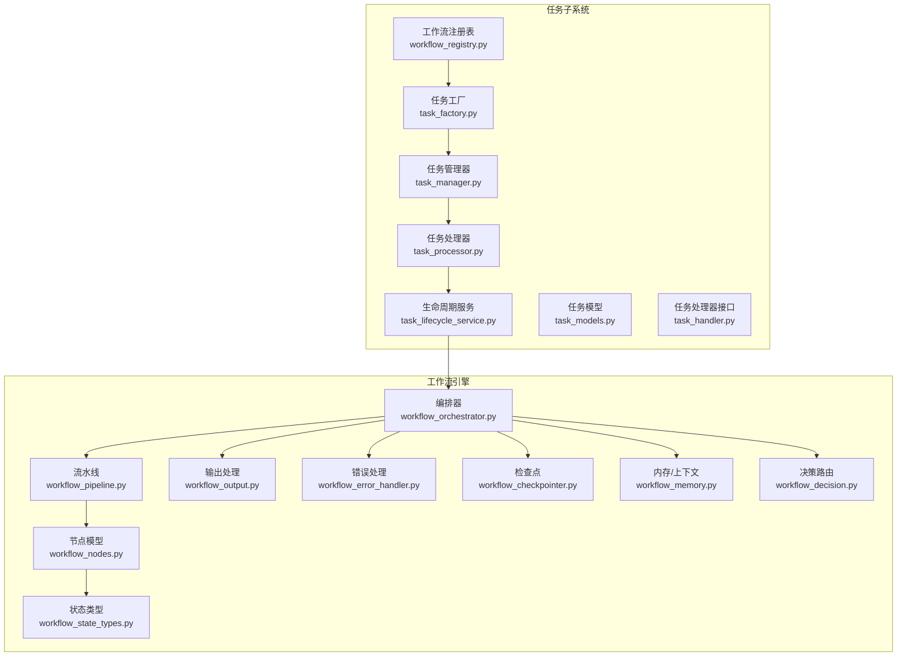
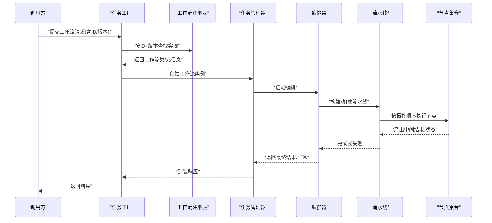
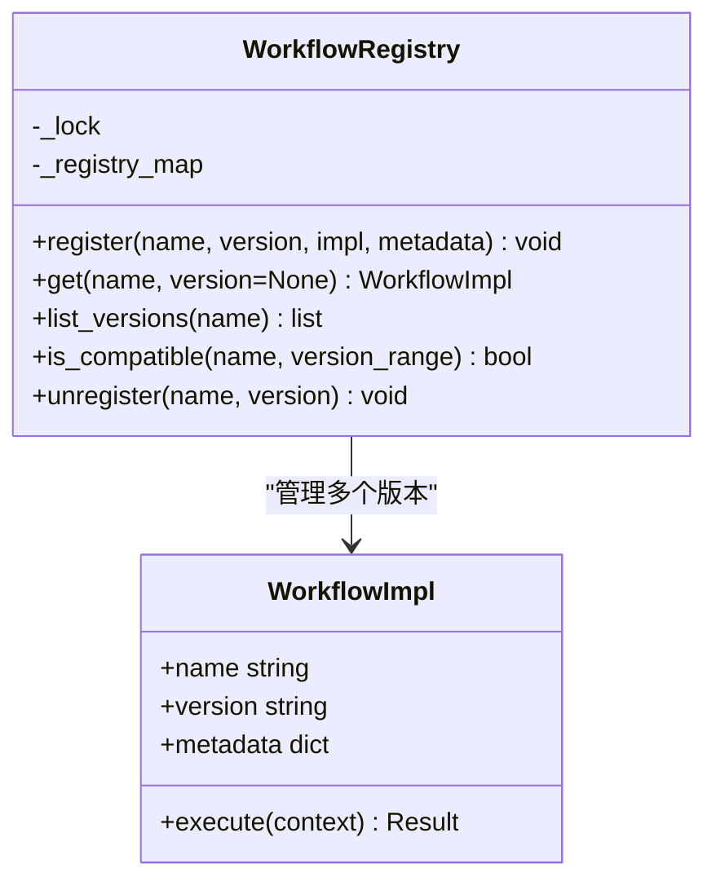
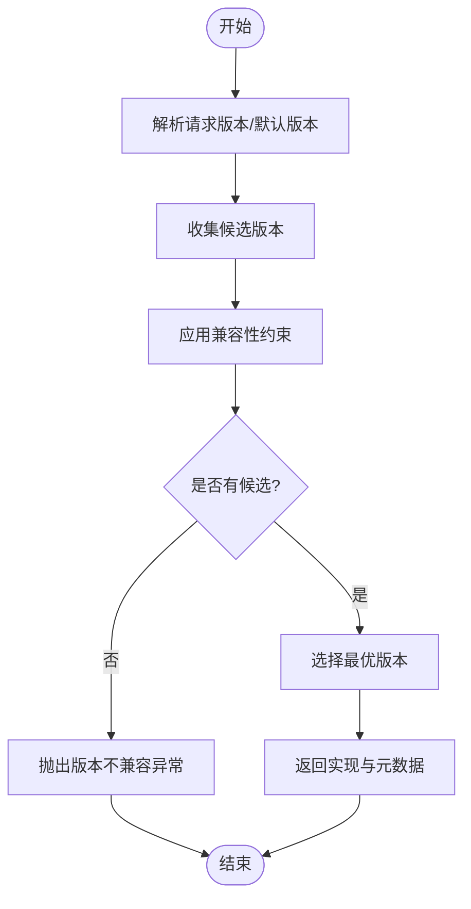
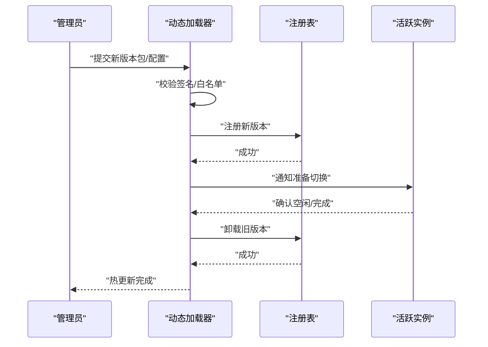
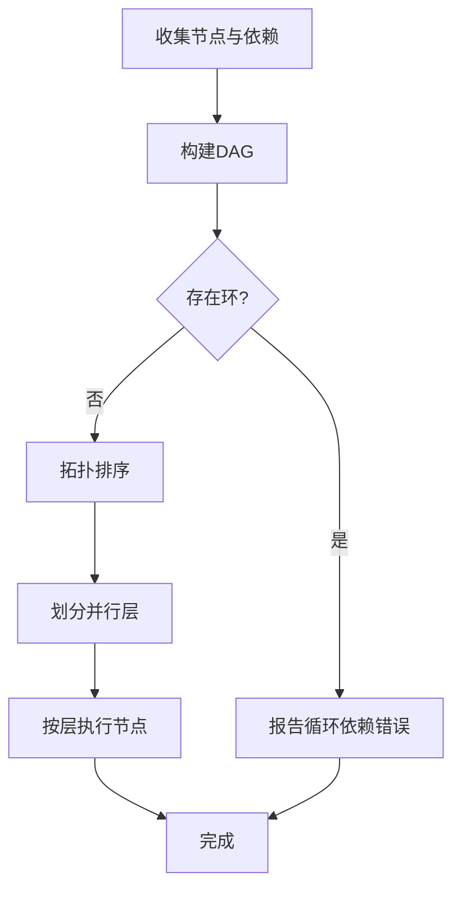
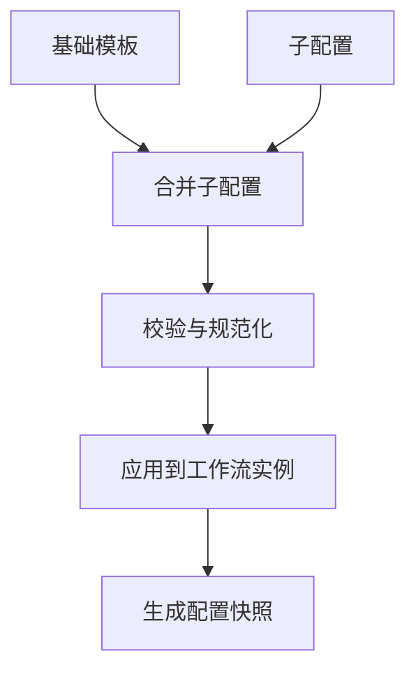
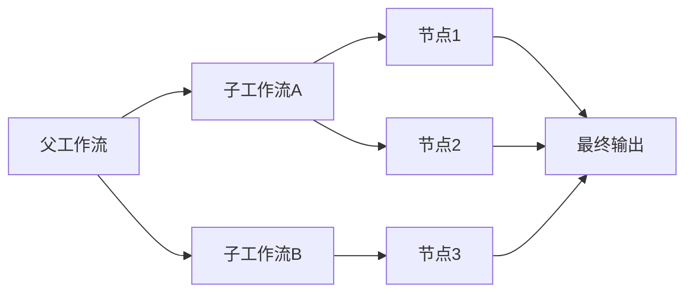
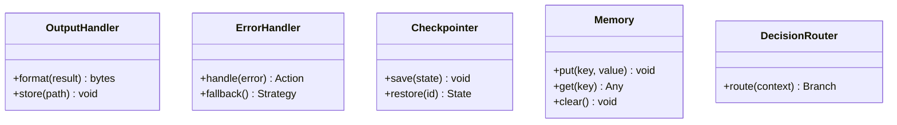
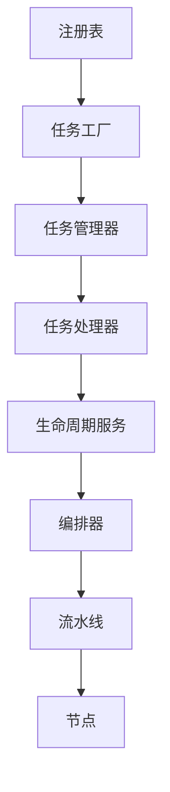

# 工作流注册表

<cite>
**本文引用的文件**   
- [src/penshot/neopen/task/workflow_registry.py](file://src/penshot/neopen/task/workflow_registry.py)
- [src/penshot/neopen/task/task_factory.py](file://src/penshot/neopen/task/task_factory.py)
- [src/penshot/neopen/task/task_manager.py](file://src/penshot/neopen/task/task_manager.py)
- [src/penshot/neopen/task/task_processor.py](file://src/penshot/neopen/task/task_processor.py)
- [src/penshot/neopen/task/task_lifecycle_service.py](file://src/penshot/neopen/task/task_lifecycle_service.py)
- [src/penshot/neopen/task/task_models.py](file://src/penshot/neopen/task/task_models.py)
- [src/penshot/neopen/task/task_handler.py](file://src/penshot/neopen/task/task_handler.py)
- [src/penshot/neopen/agent/workflow/workflow_orchestrator.py](file://src/penshot/neopen/agent/workflow/workflow_orchestrator.py)
- [src/penshot/neopen/agent/workflow/workflow_pipeline.py](file://src/penshot/neopen/agent/workflow/workflow_pipeline.py)
- [src/penshot/neopen/agent/workflow/workflow_nodes.py](file://src/penshot/neopen/agent/workflow/workflow_nodes.py)
- [src/penshot/neopen/agent/workflow/workflow_state_types.py](file://src/penshot/neopen/agent/workflow/workflow_state_types.py)
- [src/penshot/neopen/agent/workflow/workflow_output.py](file://src/penshot/neopen/agent/workflow/workflow_output.py)
- [src/penshot/neopen/agent/workflow/workflow_error_handler.py](file://src/penshot/neopen/agent/workflow/workflow_error_handler.py)
- [src/penshot/neopen/agent/workflow/workflow_checkpointer.py](file://src/penshot/neopen/agent/workflow/workflow_checkpointer.py)
- [src/penshot/neopen/agent/workflow/workflow_memory.py](file://src/penshot/neopen/agent/workflow/workflow_memory.py)
- [src/penshot/neopen/agent/workflow/workflow_decision.py](file://src/penshot/neopen/agent/workflow/workflow_decision.py)
- [tests/task/test_workflow_registry.py](file://tests/task/test_workflow_registry.py)
</cite>

## 目录
1. [简介](#简介)
2. [项目结构](#项目结构)
3. [核心组件](#核心组件)
4. [架构总览](#架构总览)
5. [详细组件分析](#详细组件分析)
6. [依赖关系分析](#依赖关系分析)
7. [性能考虑](#性能考虑)
8. [故障排查指南](#故障排查指南)
9. [结论](#结论)
10. [附录](#附录)

## 简介
本文件围绕“工作流注册表”的设计与实现，系统性阐述其在系统中的职责、发现与注册机制、版本控制与兼容性检查、动态加载与热更新方案、依赖解析与执行顺序确定算法，以及模板管理与配置继承机制。同时给出复杂工作流组合与嵌套结构的构建方法，帮助读者从概念到代码层面全面理解并扩展系统能力。

## 项目结构
工作流注册表位于任务子系统内，并与工作流编排器、流水线、节点模型等紧密协作。下图展示与注册表相关的核心模块及其交互关系。

图表来源
- [src/penshot/neopen/task/workflow_registry.py](file://src/penshot/neopen/task/workflow_registry.py)
- [src/penshot/neopen/task/task_factory.py](file://src/penshot/neopen/task/task_factory.py)
- [src/penshot/neopen/task/task_manager.py](file://src/penshot/neopen/task/task_manager.py)
- [src/penshot/neopen/task/task_processor.py](file://src/penshot/neopen/task/task_processor.py)
- [src/penshot/neopen/task/task_lifecycle_service.py](file://src/penshot/neopen/task/task_lifecycle_service.py)
- [src/penshot/neopen/task/task_models.py](file://src/penshot/neopen/task/task_models.py)
- [src/penshot/neopen/task/task_handler.py](file://src/penshot/neopen/task/task_handler.py)
- [src/penshot/neopen/agent/workflow/workflow_orchestrator.py](file://src/penshot/neopen/agent/workflow/workflow_orchestrator.py)
- [src/penshot/neopen/agent/workflow/workflow_pipeline.py](file://src/penshot/neopen/agent/workflow/workflow_pipeline.py)
- [src/penshot/neopen/agent/workflow/workflow_nodes.py](file://src/penshot/neopen/agent/workflow/workflow_nodes.py)
- [src/penshot/neopen/agent/workflow/workflow_state_types.py](file://src/penshot/neopen/agent/workflow/workflow_state_types.py)
- [src/penshot/neopen/agent/workflow/workflow_output.py](file://src/penshot/neopen/agent/workflow/workflow_output.py)
- [src/penshot/neopen/agent/workflow/workflow_error_handler.py](file://src/penshot/neopen/agent/workflow/workflow_error_handler.py)
- [src/penshot/neopen/agent/workflow/workflow_checkpointer.py](file://src/penshot/neopen/agent/workflow/workflow_checkpointer.py)
- [src/penshot/neopen/agent/workflow/workflow_memory.py](file://src/penshot/neopen/agent/workflow/workflow_memory.py)
- [src/penshot/neopen/agent/workflow/workflow_decision.py](file://src/penshot/neopen/agent/workflow/workflow_decision.py)

章节来源
- [src/penshot/neopen/task/workflow_registry.py](file://src/penshot/neopen/task/workflow_registry.py)
- [src/penshot/neopen/agent/workflow/workflow_orchestrator.py](file://src/penshot/neopen/agent/workflow/workflow_orchestrator.py)

## 核心组件
- 工作流注册表：负责工作流的发现、注册、查询、版本选择与兼容校验，提供线程安全的访问接口。
- 任务工厂：根据请求中的工作流标识与版本，向注册表获取具体实现并实例化。
- 任务管理器/处理器/生命周期服务：协调工作流的生命周期（创建、调度、执行、终止），并将结果回写。
- 工作流编排器/流水线/节点：定义工作流的结构、执行顺序、数据流转与状态管理。
- 输出/错误/检查点/记忆/决策：支撑工作流运行时的稳定性、可观测性与容错恢复。

章节来源
- [src/penshot/neopen/task/workflow_registry.py](file://src/penshot/neopen/task/workflow_registry.py)
- [src/penshot/neopen/task/task_factory.py](file://src/penshot/neopen/task/task_factory.py)
- [src/penshot/neopen/task/task_manager.py](file://src/penshot/neopen/task/task_manager.py)
- [src/penshot/neopen/task/task_processor.py](file://src/penshot/neopen/task/task_processor.py)
- [src/penshot/neopen/task/task_lifecycle_service.py](file://src/penshot/neopen/task/task_lifecycle_service.py)
- [src/penshot/neopen/agent/workflow/workflow_orchestrator.py](file://src/penshot/neopen/agent/workflow/workflow_orchestrator.py)

## 架构总览
下图展示了从请求进入、工作流解析、注册表查询到编排执行的端到端流程。

图表来源
- [src/penshot/neopen/task/task_factory.py](file://src/penshot/neopen/task/task_factory.py)
- [src/penshot/neopen/task/workflow_registry.py](file://src/penshot/neopen/task/workflow_registry.py)
- [src/penshot/neopen/task/task_manager.py](file://src/penshot/neopen/task/task_manager.py)
- [src/penshot/neopen/agent/workflow/workflow_orchestrator.py](file://src/penshot/neopen/agent/workflow/workflow_orchestrator.py)
- [src/penshot/neopen/agent/workflow/workflow_pipeline.py](file://src/penshot/neopen/agent/workflow/workflow_pipeline.py)
- [src/penshot/neopen/agent/workflow/workflow_nodes.py](file://src/penshot/neopen/agent/workflow/workflow_nodes.py)

## 详细组件分析

### 工作流注册表设计与实现
- 作用与职责
  - 维护工作流名称到实现的映射，支持多版本共存。
  - 提供按名称和版本的精确查询、默认版本选择、兼容范围匹配。
  - 暴露注册/反注册接口，支持运行时动态加载与热更新。
  - 保证并发安全，避免竞态条件导致的重复注册或覆盖。
- 关键设计要点
  - 版本策略：采用语义化版本或主版本号隔离，确保向后兼容。
  - 兼容性检查：基于版本区间与变更日志进行断言，拒绝不兼容版本。
  - 发现机制：支持包扫描、配置文件声明、API显式注册等多种方式。
  - 元数据管理：记录作者、描述、依赖、输入输出契约、迁移脚本等。
- 典型接口
  - 注册：将工作流实现与其元数据绑定。
  - 查询：按名称与版本获取实现；若未指定版本则返回默认或最高兼容版本。
  - 列表：列出某工作流的所有可用版本及元信息。
  - 卸载：在受控条件下移除旧版本，释放资源。
- 并发与一致性
  - 使用读写锁或原子操作保护内部映射。
  - 注册时进行幂等性检查，避免重复注册。
  - 卸载前检查是否仍有活跃实例引用。

图表来源
- [src/penshot/neopen/task/workflow_registry.py](file://src/penshot/neopen/task/workflow_registry.py)

章节来源
- [src/penshot/neopen/task/workflow_registry.py](file://src/penshot/neopen/task/workflow_registry.py)
- [tests/task/test_workflow_registry.py](file://tests/task/test_workflow_registry.py)

### 版本控制与兼容性检查
- 版本策略
  - 主版本：破坏性变更时递增，要求消费者显式升级。
  - 次版本：新增功能但保持向后兼容。
  - 修订号：仅修复缺陷，严格兼容。
- 兼容性规则
  - 输入/输出契约不变或可自动适配。
  - 依赖项版本区间满足当前环境。
  - 迁移脚本可无感升级状态。
- 检查流程
  - 解析请求版本或默认版本。
  - 计算候选版本集合。
  - 应用兼容性约束过滤。
  - 选择最优版本（如最高兼容）。
  - 返回实现与元数据。

图表来源
- [src/penshot/neopen/task/workflow_registry.py](file://src/penshot/neopen/task/workflow_registry.py)

章节来源
- [src/penshot/neopen/task/workflow_registry.py](file://src/penshot/neopen/task/workflow_registry.py)

### 动态加载与热更新
- 动态加载
  - 通过包扫描或配置清单发现新工作流实现。
  - 按需导入模块，避免冷启动开销。
  - 注册后立即可被查询与使用。
- 热更新
  - 在受控窗口内卸载旧版本，再注册新版本。
  - 等待活跃实例完成或优雅终止。
  - 切换流量至新版本，保留回滚能力。
- 安全与审计
  - 对加载来源进行白名单校验。
  - 记录加载事件与变更轨迹。

图表来源
- [src/penshot/neopen/task/workflow_registry.py](file://src/penshot/neopen/task/workflow_registry.py)

章节来源
- [src/penshot/neopen/task/workflow_registry.py](file://src/penshot/neopen/task/workflow_registry.py)

### 依赖关系解析与执行顺序确定
- 依赖建模
  - 以有向无环图（DAG）表示节点间依赖。
  - 每个节点声明其输入/输出与前置节点集合。
- 解析算法
  - 拓扑排序确定执行顺序。
  - 检测循环依赖并报错。
  - 并行度优化：同一层级节点可并发执行。
- 执行保障
  - 节点级重试与熔断。
  - 中间结果持久化与断点续跑。
  - 超时与资源配额控制。

图表来源
- [src/penshot/neopen/agent/workflow/workflow_pipeline.py](file://src/penshot/neopen/agent/workflow/workflow_pipeline.py)
- [src/penshot/neopen/agent/workflow/workflow_nodes.py](file://src/penshot/neopen/agent/workflow/workflow_nodes.py)

章节来源
- [src/penshot/neopen/agent/workflow/workflow_pipeline.py](file://src/penshot/neopen/agent/workflow/workflow_pipeline.py)
- [src/penshot/neopen/agent/workflow/workflow_nodes.py](file://src/penshot/neopen/agent/workflow/workflow_nodes.py)

### 模板管理与配置继承
- 模板体系
  - 基础模板定义通用结构与默认参数。
  - 派生模板通过继承与覆盖定制行为。
  - 支持按环境（开发/测试/生产）选择不同模板集。
- 配置继承
  - 自顶向下合并：子配置覆盖父配置同名键。
  - 深拷贝与不可变视图，防止副作用。
  - 校验链：在合并后进行完整性与合法性校验。
- 最佳实践
  - 明确标注必填/可选字段与默认值。
  - 为关键路径配置添加注释与示例。
  - 使用配置快照便于回溯与对比。

图表来源
- [src/penshot/neopen/task/task_models.py](file://src/penshot/neopen/task/task_models.py)
- [src/penshot/neopen/agent/workflow/workflow_orchestrator.py](file://src/penshot/neopen/agent/workflow/workflow_orchestrator.py)

章节来源
- [src/penshot/neopen/task/task_models.py](file://src/penshot/neopen/task/task_models.py)
- [src/penshot/neopen/agent/workflow/workflow_orchestrator.py](file://src/penshot/neopen/agent/workflow/workflow_orchestrator.py)

### 复杂工作流组合与嵌套结构
- 组合模式
  - 将多个工作流作为子流程嵌入父流程。
  - 通过输入/输出桥接实现数据贯通。
- 嵌套结构
  - 支持多级嵌套，形成树状或图状结构。
  - 统一的状态机与上下文传递。
- 编排策略
  - 串行、并行、条件分支、循环与重试。
  - 全局错误处理与局部补偿。
- 可视化与调试
  - 生成执行计划与依赖图。
  - 提供步骤级日志与指标采集。

图表来源
- [src/penshot/neopen/agent/workflow/workflow_orchestrator.py](file://src/penshot/neopen/agent/workflow/workflow_orchestrator.py)
- [src/penshot/neopen/agent/workflow/workflow_pipeline.py](file://src/penshot/neopen/agent/workflow/workflow_pipeline.py)

章节来源
- [src/penshot/neopen/agent/workflow/workflow_orchestrator.py](file://src/penshot/neopen/agent/workflow/workflow_orchestrator.py)
- [src/penshot/neopen/agent/workflow/workflow_pipeline.py](file://src/penshot/neopen/agent/workflow/workflow_pipeline.py)

### 运行时支撑：输出、错误、检查点、记忆与决策
- 输出处理：标准化结果格式、序列化与归档。
- 错误处理：分类异常、降级策略与告警。
- 检查点：周期性保存状态，支持中断恢复。
- 记忆/上下文：跨节点共享数据与作用域隔离。
- 决策路由：基于上下文与策略动态选择分支。

图表来源
- [src/penshot/neopen/agent/workflow/workflow_output.py](file://src/penshot/neopen/agent/workflow/workflow_output.py)
- [src/penshot/neopen/agent/workflow/workflow_error_handler.py](file://src/penshot/neopen/agent/workflow/workflow_error_handler.py)
- [src/penshot/neopen/agent/workflow/workflow_checkpointer.py](file://src/penshot/neopen/agent/workflow/workflow_checkpointer.py)
- [src/penshot/neopen/agent/workflow/workflow_memory.py](file://src/penshot/neopen/agent/workflow/workflow_memory.py)
- [src/penshot/neopen/agent/workflow/workflow_decision.py](file://src/penshot/neopen/agent/workflow/workflow_decision.py)

章节来源
- [src/penshot/neopen/agent/workflow/workflow_output.py](file://src/penshot/neopen/agent/workflow/workflow_output.py)
- [src/penshot/neopen/agent/workflow/workflow_error_handler.py](file://src/penshot/neopen/agent/workflow/workflow_error_handler.py)
- [src/penshot/neopen/agent/workflow/workflow_checkpointer.py](file://src/penshot/neopen/agent/workflow/workflow_checkpointer.py)
- [src/penshot/neopen/agent/workflow/workflow_memory.py](file://src/penshot/neopen/agent/workflow/workflow_memory.py)
- [src/penshot/neopen/agent/workflow/workflow_decision.py](file://src/penshot/neopen/agent/workflow/workflow_decision.py)

## 依赖关系分析
- 组件耦合
  - 注册表与任务工厂强耦合：工厂依赖注册表解析实现。
  - 编排器与流水线/节点松耦合：通过接口与协议通信。
- 外部依赖
  - 配置系统与模板库。
  - 存储后端（检查点、输出归档）。
  - 监控与日志系统。
- 潜在风险
  - 循环依赖需通过接口解耦。
  - 大对象在节点间传递应使用引用或流式传输。

图表来源
- [src/penshot/neopen/task/workflow_registry.py](file://src/penshot/neopen/task/workflow_registry.py)
- [src/penshot/neopen/task/task_factory.py](file://src/penshot/neopen/task/task_factory.py)
- [src/penshot/neopen/task/task_manager.py](file://src/penshot/neopen/task/task_manager.py)
- [src/penshot/neopen/task/task_processor.py](file://src/penshot/neopen/task/task_processor.py)
- [src/penshot/neopen/task/task_lifecycle_service.py](file://src/penshot/neopen/task/task_lifecycle_service.py)
- [src/penshot/neopen/agent/workflow/workflow_orchestrator.py](file://src/penshot/neopen/agent/workflow/workflow_orchestrator.py)
- [src/penshot/neopen/agent/workflow/workflow_pipeline.py](file://src/penshot/neopen/agent/workflow/workflow_pipeline.py)
- [src/penshot/neopen/agent/workflow/workflow_nodes.py](file://src/penshot/neopen/agent/workflow/workflow_nodes.py)

章节来源
- [src/penshot/neopen/task/workflow_registry.py](file://src/penshot/neopen/task/workflow_registry.py)
- [src/penshot/neopen/task/task_factory.py](file://src/penshot/neopen/task/task_factory.py)
- [src/penshot/neopen/task/task_manager.py](file://src/penshot/neopen/task/task_manager.py)
- [src/penshot/neopen/task/task_processor.py](file://src/penshot/neopen/task/task_processor.py)
- [src/penshot/neopen/task/task_lifecycle_service.py](file://src/penshot/neopen/task/task_lifecycle_service.py)
- [src/penshot/neopen/agent/workflow/workflow_orchestrator.py](file://src/penshot/neopen/agent/workflow/workflow_orchestrator.py)
- [src/penshot/neopen/agent/workflow/workflow_pipeline.py](file://src/penshot/neopen/agent/workflow/workflow_pipeline.py)
- [src/penshot/neopen/agent/workflow/workflow_nodes.py](file://src/penshot/neopen/agent/workflow/workflow_nodes.py)

## 性能考虑
- 注册表查询
  - 使用哈希索引与缓存命中，降低查找延迟。
  - 批量查询与懒加载减少内存占用。
- 执行效率
  - 并行执行无依赖节点，提升吞吐。
  - 批处理与流式处理结合，降低GC压力。
- 资源管理
  - 连接池与对象复用。
  - 超时与限流保护后端服务。
- 可观测性
  - 关键路径埋点与指标上报。
  - 慢查询与热点节点定位。

[本节为通用指导，无需特定文件来源]

## 故障排查指南
- 常见问题
  - 版本不兼容：检查版本区间与契约变更。
  - 循环依赖：查看DAG构建日志与节点声明。
  - 热更新失败：确认无活跃实例引用与回滚策略。
  - 输出异常：核对输出格式化与存储路径权限。
- 诊断工具
  - 启用详细日志与追踪ID。
  - 导出执行计划与中间状态。
  - 回放检查点验证恢复路径。

章节来源
- [src/penshot/neopen/agent/workflow/workflow_error_handler.py](file://src/penshot/neopen/agent/workflow/workflow_error_handler.py)
- [src/penshot/neopen/agent/workflow/workflow_checkpointer.py](file://src/penshot/neopen/agent/workflow/workflow_checkpointer.py)
- [src/penshot/neopen/agent/workflow/workflow_output.py](file://src/penshot/neopen/agent/workflow/workflow_output.py)

## 结论
工作流注册表是整个系统的枢纽，承担发现、注册、版本管理与兼容校验的核心职责。配合任务工厂、编排器与流水线，实现了高内聚、低耦合的可扩展架构。通过严格的版本策略、依赖解析与热更新机制，系统在灵活性与稳定性之间取得平衡。建议在生产环境中完善监控与回滚策略，持续优化性能与可观测性。

[本节为总结，无需特定文件来源]

## 附录
- 术语
  - 工作流：一组有序节点的集合，用于完成特定业务目标。
  - 节点：最小执行单元，具备输入/输出与副作用。
  - 版本：工作流实现的语义化版本标识。
  - 兼容：在不改变契约的前提下允许的功能演进。
- 参考
  - 单元测试用例：验证注册表行为与边界条件。

章节来源
- [tests/task/test_workflow_registry.py](file://tests/task/test_workflow_registry.py)