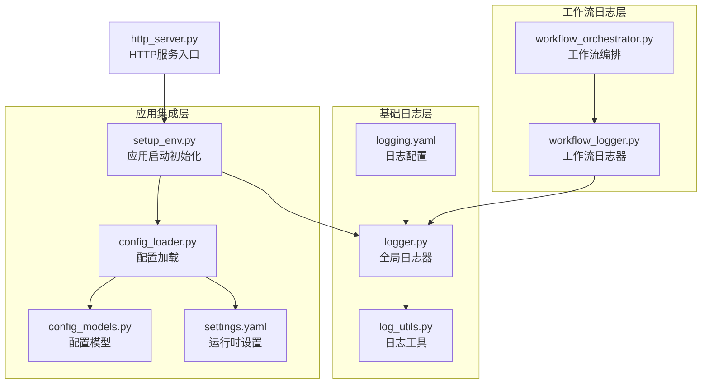
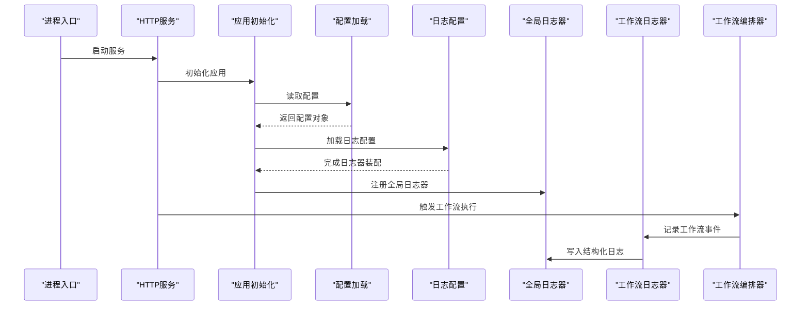
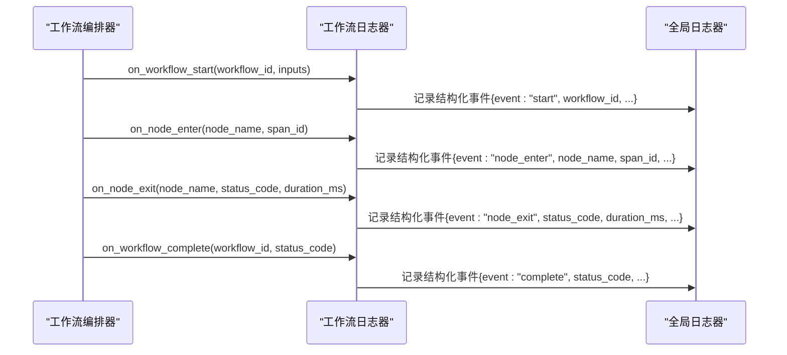
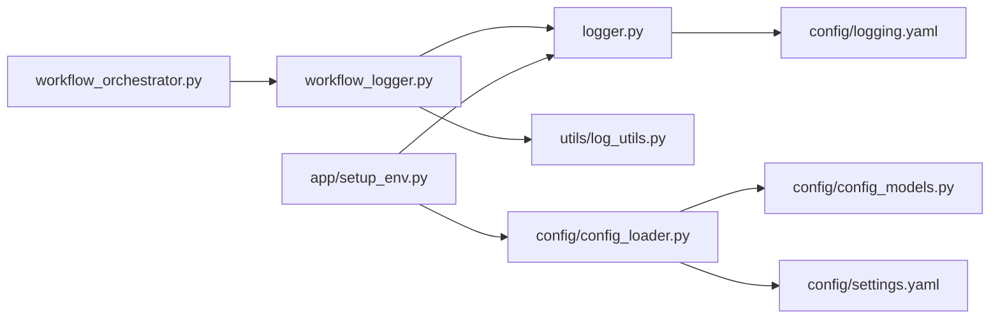

# 工作流日志系统

<cite>
**本文引用的文件**   
- [src/penshot/logger.py](file://src/penshot/logger.py)
- [src/penshot/config/logging.yaml](file://src/penshot/config/logging.yaml)
- [src/penshot/utils/log_utils.py](file://src/penshot/utils/log_utils.py)
- [src/penshot/neopen/agent/workflow/workflow_logger.py](file://src/penshot/neopen/agent/workflow/workflow_logger.py)
- [src/penshot/neopen/agent/workflow/workflow_orchestrator.py](file://src/penshot/neopen/agent/workflow/workflow_orchestrator.py)
- [src/penshot/app/setup_env.py](file://src/penshot/app/setup_env.py)
- [src/penshot/config/config_loader.py](file://src/penshot/config/config_loader.py)
- [src/penshot/config/config_models.py](file://src/penshot/config/config_models.py)
- [src/penshot/config/settings.yaml](file://src/penshot/config/settings.yaml)
- [src/penshot/http_server.py](file://src/penshot/http_server.py)
</cite>

## 目录
1. [简介](#简介)
2. [项目结构](#项目结构)
3. [核心组件](#核心组件)
4. [架构总览](#架构总览)
5. [详细组件分析](#详细组件分析)
6. [依赖关系分析](#依赖关系分析)
7. [性能考虑](#性能考虑)
8. [故障排查指南](#故障排查指南)
9. [结论](#结论)
10. [附录](#附录)

## 简介
本文件面向“视频拍摄代理”项目中工作流执行过程的日志系统，系统性阐述以下主题：
- 结构化日志的设计模式与字段规范
- 日志级别控制与过滤策略
- 日志聚合与分析工具的使用建议
- 性能监控指标与追踪ID（Trace ID）的贯穿方案
- 日志查询与调试最佳实践
- 分布式环境下的日志收集方案

目标读者包括开发者、运维工程师与数据分析师。文档以代码级事实为依据，辅以可视化图示，帮助快速定位问题并提升可观测性。

## 项目结构
本项目将日志能力拆分为三层：
- 基础日志层：提供统一的日志器初始化、配置加载与通用工具方法
- 应用集成层：在应用启动时完成日志配置注入，确保所有模块使用统一日志器
- 工作流日志层：在工作流编排与节点执行过程中记录结构化事件、上下文与指标

图表来源
- [src/penshot/config/logging.yaml](file://src/penshot/config/logging.yaml)
- [src/penshot/logger.py](file://src/penshot/logger.py)
- [src/penshot/utils/log_utils.py](file://src/penshot/utils/log_utils.py)
- [src/penshot/app/setup_env.py](file://src/penshot/app/setup_env.py)
- [src/penshot/config/config_loader.py](file://src/penshot/config/config_loader.py)
- [src/penshot/config/config_models.py](file://src/penshot/config/config_models.py)
- [src/penshot/config/settings.yaml](file://src/penshot/config/settings.yaml)
- [src/penshot/neopen/agent/workflow/workflow_logger.py](file://src/penshot/neopen/agent/workflow/workflow_logger.py)
- [src/penshot/neopen/agent/workflow/workflow_orchestrator.py](file://src/penshot/neopen/agent/workflow/workflow_orchestrator.py)
- [src/penshot/http_server.py](file://src/penshot/http_server.py)

章节来源
- [src/penshot/logger.py](file://src/penshot/logger.py)
- [src/penshot/config/logging.yaml](file://src/penshot/config/logging.yaml)
- [src/penshot/utils/log_utils.py](file://src/penshot/utils/log_utils.py)
- [src/penshot/neopen/agent/workflow/workflow_logger.py](file://src/penshot/neopen/agent/workflow/workflow_logger.py)
- [src/penshot/neopen/agent/workflow/workflow_orchestrator.py](file://src/penshot/neopen/agent/workflow/workflow_orchestrator.py)
- [src/penshot/app/setup_env.py](file://src/penshot/app/setup_env.py)
- [src/penshot/config/config_loader.py](file://src/penshot/config/config_loader.py)
- [src/penshot/config/config_models.py](file://src/penshot/config/config_models.py)
- [src/penshot/config/settings.yaml](file://src/penshot/config/settings.yaml)
- [src/penshot/http_server.py](file://src/penshot/http_server.py)

## 核心组件
- 全局日志器与配置加载
  - 负责从配置文件加载日志策略（输出目标、格式、级别），并提供统一入口供各模块获取 logger 实例
  - 支持按模块名进行级别控制与过滤
- 日志工具集
  - 提供结构化字段构建、时间戳、线程/进程标识、请求/任务追踪ID等辅助方法
- 工作流日志器
  - 围绕工作流生命周期（开始、节点进入/退出、错误、完成）记录结构化事件
  - 自动注入工作流ID、节点名称、耗时、状态码等关键维度
- 应用启动集成
  - 在应用启动阶段完成日志配置注入，保证后续所有模块使用同一套日志器
- 工作流编排器
  - 在工作流调度中调用工作流日志器，形成端到端的事件链路

章节来源
- [src/penshot/logger.py](file://src/penshot/logger.py)
- [src/penshot/utils/log_utils.py](file://src/penshot/utils/log_utils.py)
- [src/penshot/neopen/agent/workflow/workflow_logger.py](file://src/penshot/neopen/agent/workflow/workflow_logger.py)
- [src/penshot/neopen/agent/workflow/workflow_orchestrator.py](file://src/penshot/neopen/agent/workflow/workflow_orchestrator.py)
- [src/penshot/app/setup_env.py](file://src/penshot/app/setup_env.py)

## 架构总览
下图展示了从应用启动到工作流执行的日志路径，以及配置加载与全局日志器的装配关系。

图表来源
- [src/penshot/http_server.py](file://src/penshot/http_server.py)
- [src/penshot/app/setup_env.py](file://src/penshot/app/setup_env.py)
- [src/penshot/config/config_loader.py](file://src/penshot/config/config_loader.py)
- [src/penshot/config/logging.yaml](file://src/penshot/config/logging.yaml)
- [src/penshot/logger.py](file://src/penshot/logger.py)
- [src/penshot/neopen/agent/workflow/workflow_logger.py](file://src/penshot/neopen/agent/workflow/workflow_logger.py)
- [src/penshot/neopen/agent/workflow/workflow_orchestrator.py](file://src/penshot/neopen/agent/workflow/workflow_orchestrator.py)

## 详细组件分析

### 全局日志器与配置加载
- 职责
  - 从 YAML 配置加载日志策略（控制台/文件/JSON 输出、格式化模板、模块级别）
  - 暴露统一的 get_logger(name) 接口，便于各模块按需获取
- 设计要点
  - 基于模块名的分级控制，避免全量 DEBUG 导致性能抖动
  - 默认启用 JSON 结构化输出，便于下游聚合与分析
- 关键实现位置
  - 日志器初始化与配置加载逻辑
  - 配置项定义与默认值

章节来源
- [src/penshot/logger.py](file://src/penshot/logger.py)
- [src/penshot/config/logging.yaml](file://src/penshot/config/logging.yaml)

### 日志工具集
- 职责
  - 提供结构化字段构造器（如 trace_id、span_id、task_id、node_name、status_code、duration_ms 等）
  - 封装时间戳、线程/进程信息、异常堆栈序列化等通用能力
- 设计要点
  - 字段命名遵循一致约定，便于索引与聚合
  - 对敏感信息进行脱敏处理（如用户输入、密钥片段）
- 关键实现位置
  - 工具函数与常量定义

章节来源
- [src/penshot/utils/log_utils.py](file://src/penshot/utils/log_utils.py)

### 工作流日志器
- 职责
  - 围绕工作流生命周期记录事件：开始、节点进入/退出、重试、失败、完成
  - 自动附加上下文：工作流ID、节点名、输入摘要、输出摘要、耗时、状态码
- 设计要点
  - 事件驱动的结构化日志，包含标准字段集合
  - 支持采样与节流，避免高频节点产生海量日志
- 关键实现位置
  - 工作流日志器类与方法
  - 与编排器的集成点

章节来源
- [src/penshot/neopen/agent/workflow/workflow_logger.py](file://src/penshot/neopen/agent/workflow/workflow_logger.py)
- [src/penshot/neopen/agent/workflow/workflow_orchestrator.py](file://src/penshot/neopen/agent/workflow/workflow_orchestrator.py)

### 应用启动集成
- 职责
  - 在应用启动时完成日志配置注入，确保所有子模块共享同一日志器
  - 根据运行环境（开发/生产）选择不同日志策略
- 关键实现位置
  - 应用初始化脚本
  - 配置加载与模型定义
  - 运行时设置文件

章节来源
- [src/penshot/app/setup_env.py](file://src/penshot/app/setup_env.py)
- [src/penshot/config/config_loader.py](file://src/penshot/config/config_loader.py)
- [src/penshot/config/config_models.py](file://src/penshot/config/config_models.py)
- [src/penshot/config/settings.yaml](file://src/penshot/config/settings.yaml)

### 工作流编排器中的日志接入
- 职责
  - 在工作流编排的关键路径上调用工作流日志器，形成完整链路
  - 为每个工作流实例生成唯一ID，并在节点间传递
- 关键实现位置
  - 编排器主流程与节点调度处

章节来源
- [src/penshot/neopen/agent/workflow/workflow_orchestrator.py](file://src/penshot/neopen/agent/workflow/workflow_orchestrator.py)
- [src/penshot/neopen/agent/workflow/workflow_logger.py](file://src/penshot/neopen/agent/workflow/workflow_logger.py)

#### 工作流日志事件序列图

图表来源
- [src/penshot/neopen/agent/workflow/workflow_orchestrator.py](file://src/penshot/neopen/agent/workflow/workflow_orchestrator.py)
- [src/penshot/neopen/agent/workflow/workflow_logger.py](file://src/penshot/neopen/agent/workflow/workflow_logger.py)
- [src/penshot/logger.py](file://src/penshot/logger.py)

## 依赖关系分析
- 耦合与内聚
  - 工作流日志器仅依赖全局日志器与日志工具，保持高内聚
  - 编排器通过工作流日志器间接依赖日志基础设施，降低直接耦合
- 外部依赖
  - 日志输出目标由配置决定（控制台/文件/JSON），便于替换为远程收集器
- 潜在循环依赖
  - 当前分层清晰，未见循环导入；若新增模块需遵循“上层依赖下层”的原则

图表来源
- [src/penshot/neopen/agent/workflow/workflow_logger.py](file://src/penshot/neopen/agent/workflow/workflow_logger.py)
- [src/penshot/logger.py](file://src/penshot/logger.py)
- [src/penshot/utils/log_utils.py](file://src/penshot/utils/log_utils.py)
- [src/penshot/neopen/agent/workflow/workflow_orchestrator.py](file://src/penshot/neopen/agent/workflow/workflow_orchestrator.py)
- [src/penshot/app/setup_env.py](file://src/penshot/app/setup_env.py)
- [src/penshot/config/config_loader.py](file://src/penshot/config/config_loader.py)
- [src/penshot/config/config_models.py](file://src/penshot/config/config_models.py)
- [src/penshot/config/settings.yaml](file://src/penshot/config/settings.yaml)
- [src/penshot/config/logging.yaml](file://src/penshot/config/logging.yaml)

章节来源
- [src/penshot/neopen/agent/workflow/workflow_logger.py](file://src/penshot/neopen/agent/workflow/workflow_logger.py)
- [src/penshot/logger.py](file://src/penshot/logger.py)
- [src/penshot/utils/log_utils.py](file://src/penshot/utils/log_utils.py)
- [src/penshot/neopen/agent/workflow/workflow_orchestrator.py](file://src/penshot/neopen/agent/workflow/workflow_orchestrator.py)
- [src/penshot/app/setup_env.py](file://src/penshot/app/setup_env.py)
- [src/penshot/config/config_loader.py](file://src/penshot/config/config_loader.py)
- [src/penshot/config/config_models.py](file://src/penshot/config/config_models.py)
- [src/penshot/config/settings.yaml](file://src/penshot/config/settings.yaml)
- [src/penshot/config/logging.yaml](file://src/penshot/config/logging.yaml)

## 性能考虑
- 结构化日志开销
  - 优先使用轻量字段与摘要，避免大对象序列化
  - 对高频节点采用采样或节流策略
- I/O 优化
  - 生产环境建议使用异步写入或批量落盘
  - 合理设置缓冲大小与刷新频率
- 级别控制
  - 默认 INFO，仅在需要时开启 DEBUG
  - 针对特定模块临时提升级别，避免全局影响
- 追踪成本
  - 追踪ID生成应高效且唯一，避免额外网络或数据库访问

[本节为通用指导，不直接分析具体文件]

## 故障排查指南
- 常见问题
  - 日志缺失：检查应用启动是否完成日志器初始化
  - 级别过高：确认模块级别配置与实际运行环境匹配
  - 追踪断裂：确认工作流ID与节点Span ID是否正确传递
- 定位步骤
  - 通过工作流ID检索整条链路日志
  - 聚焦节点级别的 status_code 与 duration_ms 定位瓶颈
  - 结合异常堆栈与输入摘要快速复现问题
- 建议工具
  - 本地：基于文件的 JSON 日志 + 命令行筛选
  - 集群：集中式日志平台（如 ELK/Loki）+ 告警规则

章节来源
- [src/penshot/app/setup_env.py](file://src/penshot/app/setup_env.py)
- [src/penshot/neopen/agent/workflow/workflow_logger.py](file://src/penshot/neopen/agent/workflow/workflow_logger.py)
- [src/penshot/neopen/agent/workflow/workflow_orchestrator.py](file://src/penshot/neopen/agent/workflow/workflow_orchestrator.py)

## 结论
通过将日志能力分层解耦、统一配置与结构化输出，并结合工作流生命周期的事件化记录，本项目实现了高内聚、低耦合的可观测体系。配合合理的级别控制、追踪ID贯穿与性能优化策略，可在复杂分布式环境下有效支撑问题定位与性能分析。

[本节为总结性内容，不直接分析具体文件]

## 附录

### 结构化日志字段规范（建议）
- 通用字段
  - timestamp：ISO 8601 时间戳
  - level：日志级别（DEBUG/INFO/WARN/ERROR）
  - module：模块名
  - pid/tid：进程/线程标识
  - trace_id：工作流/请求级追踪ID
  - span_id：节点/操作级跨度ID
- 工作流相关
  - event：事件类型（start/node_enter/node_exit/complete/error）
  - workflow_id：工作流实例ID
  - node_name：节点名称
  - status_code：状态码（成功/失败/重试）
  - duration_ms：耗时（毫秒）
  - input_summary/output_summary：输入/输出摘要（脱敏）
- 性能指标
  - cpu_usage、memory_usage、io_bytes：可选的环境指标

[本节为概念性说明，不直接分析具体文件]

### 日志级别控制与过滤策略
- 全局默认级别：INFO
- 模块级别覆盖：通过配置按模块名调整
- 动态调整：支持热更新（若平台具备该能力）
- 过滤规则：基于字段（如 module、level、status_code）进行筛选

章节来源
- [src/penshot/config/logging.yaml](file://src/penshot/config/logging.yaml)
- [src/penshot/logger.py](file://src/penshot/logger.py)

### 日志聚合与分析工具使用方法
- 本地分析
  - 使用命令行工具（如 jq/grep/awk）对 JSON 日志进行筛选与统计
- 集中式平台
  - 将 JSON 日志投递至 ELK/Loki 等平台
  - 建立索引与仪表盘，关注工作流成功率、平均耗时、错误分布
- 告警规则
  - 基于错误率、超时阈值、资源占用等指标设置告警

[本节为通用指导，不直接分析具体文件]

### 分布式环境下的日志收集方案
- 采集方式
  - 侧车/Agent 模式：在每个容器/主机部署采集器，转发至中心平台
- 可靠性
  - 本地缓冲与重试机制，防止丢日志
- 一致性
  - 统一时间源与时区，确保跨节点时间对齐
- 安全
  - 传输加密与鉴权，敏感字段脱敏

[本节为通用指导，不直接分析具体文件]