# 工作流管理系统

<cite>
**本文引用的文件**   
- [workflow_orchestrator.py](file://src/penshot/neopen/agent/workflow/workflow_orchestrator.py)
- [workflow_pipeline.py](file://src/penshot/neopen/agent/workflow/workflow_pipeline.py)
- [workflow_state_types.py](file://src/penshot/neopen/agent/workflow/workflow_state_types.py)
- [workflow_models.py](file://src/penshot/neopen/agent/workflow/workflow_models.py)
- [workflow_nodes.py](file://src/penshot/neopen/agent/workflow/workflow_nodes.py)
- [workflow_checkpointer.py](file://src/penshot/neopen/agent/workflow/workflow_checkpointer.py)
- [workflow_error_handler.py](file://src/penshot/neopen/agent/workflow/workflow_error_handler.py)
- [workflow_logger.py](file://src/penshot/neopen/agent/workflow/workflow_logger.py)
- [workflow_memory.py](file://src/penshot/neopen/agent/workflow/workflow_memory.py)
- [workflow_output.py](file://src/penshot/neopen/agent/workflow/workflow_output.py)
- [workflow_output_fixer.py](file://src/penshot/neopen/agent/workflow/workflow_output_fixer.py)
- [workflow_decision.py](file://src/penshot/neopen/agent/workflow/workflow_decision.py)
- [task_lifecycle_service.py](file://src/penshot/neopen/agent/task/task_lifecycle_service.py)
- [task_manager.py](file://src/penshot/neopen/agent/task/task_manager.py)
- [task_processor.py](file://src/penshot/neopen/agent/task/task_processor.py)
- [test_workflow_orchestrator.py](file://tests/workflow/test_workflow_orchestrator.py)
</cite>

## 目录
1. [简介](#简介)
2. [项目结构](#项目结构)
3. [核心组件](#核心组件)
4. [架构总览](#架构总览)
5. [详细组件分析](#详细组件分析)
6. [依赖关系分析](#依赖关系分析)
7. [性能考虑](#性能考虑)
8. [故障排查指南](#故障排查指南)
9. [结论](#结论)
10. [附录](#附录)

## 简介
本文件面向工作流管理系统的开发者与使用者，系统性阐述工作流编排器的设计与实现，覆盖任务调度、状态管理、错误处理、管道构建与执行、任务生命周期与并发控制、自定义工作流开发、性能监控与调试方法，以及复杂业务场景下的设计模式。文档以代码级事实为依据，辅以可视化图示，帮助读者快速理解并高效扩展系统能力。

## 项目结构
工作流相关代码集中在 neopen.agent.workflow 包中，围绕“编排器-管道-节点-状态-检查点-错误处理-日志-记忆-输出”等职责进行分层组织；任务层在 neopen.task 下提供生命周期服务、任务管理器与处理器，与工作流编排器协同完成端到端执行。

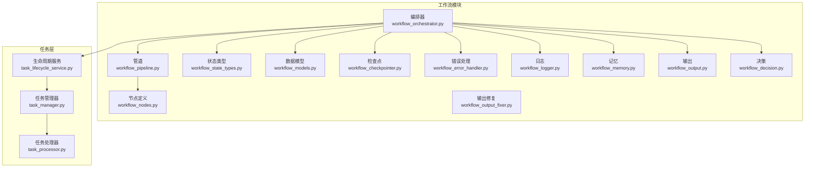

图表来源
- [workflow_orchestrator.py](file://src/penshot/neopen/agent/workflow/workflow_orchestrator.py)
- [workflow_pipeline.py](file://src/penshot/neopen/agent/workflow/workflow_pipeline.py)
- [workflow_nodes.py](file://src/penshot/neopen/agent/workflow/workflow_nodes.py)
- [workflow_state_types.py](file://src/penshot/neopen/agent/workflow/workflow_state_types.py)
- [workflow_models.py](file://src/penshot/neopen/agent/workflow/workflow_models.py)
- [workflow_checkpointer.py](file://src/penshot/neopen/agent/workflow/workflow_checkpointer.py)
- [workflow_error_handler.py](file://src/penshot/neopen/agent/workflow/workflow_error_handler.py)
- [workflow_logger.py](file://src/penshot/neopen/agent/workflow/workflow_logger.py)
- [workflow_memory.py](file://src/penshot/neopen/agent/workflow/workflow_memory.py)
- [workflow_output.py](file://src/penshot/neopen/agent/workflow/workflow_output.py)
- [workflow_output_fixer.py](file://src/penshot/neopen/agent/workflow/workflow_output_fixer.py)
- [workflow_decision.py](file://src/penshot/neopen/agent/workflow/workflow_decision.py)
- [task_lifecycle_service.py](file://src/penshot/neopen/agent/task/task_lifecycle_service.py)
- [task_manager.py](file://src/penshot/neopen/agent/task/task_manager.py)
- [task_processor.py](file://src/penshot/neopen/agent/task/task_processor.py)

章节来源
- [workflow_orchestrator.py](file://src/penshot/neopen/agent/workflow/workflow_orchestrator.py)
- [workflow_pipeline.py](file://src/penshot/neopen/agent/workflow/workflow_pipeline.py)
- [workflow_state_types.py](file://src/penshot/neopen/agent/workflow/workflow_state_types.py)
- [workflow_models.py](file://src/penshot/neopen/agent/workflow/workflow_models.py)
- [workflow_nodes.py](file://src/penshot/neopen/agent/workflow/workflow_nodes.py)
- [workflow_checkpointer.py](file://src/penshot/neopen/agent/workflow/workflow_checkpointer.py)
- [workflow_error_handler.py](file://src/penshot/neopen/agent/workflow/workflow_error_handler.py)
- [workflow_logger.py](file://src/penshot/neopen/agent/workflow/workflow_logger.py)
- [workflow_memory.py](file://src/penshot/neopen/agent/workflow/workflow_memory.py)
- [workflow_output.py](file://src/penshot/neopen/agent/workflow/workflow_output.py)
- [workflow_output_fixer.py](file://src/penshot/neopen/agent/workflow/workflow_output_fixer.py)
- [workflow_decision.py](file://src/penshot/neopen/agent/workflow/workflow_decision.py)
- [task_lifecycle_service.py](file://src/penshot/neopen/agent/task/task_lifecycle_service.py)
- [task_manager.py](file://src/penshot/neopen/agent/task/task_manager.py)
- [task_processor.py](file://src/penshot/neopen/agent/task/task_processor.py)

## 核心组件
- 编排器：负责工作流的创建、注册、执行、恢复与结果收集，协调管道、状态、检查点、错误处理、日志、记忆与输出。
- 管道：按拓扑顺序组装节点，支持并行度控制、重试策略、超时与熔断等执行语义。
- 节点：可插拔的任务单元，封装输入校验、执行逻辑、输出规范化与副作用。
- 状态：集中维护工作流实例的全局状态（如阶段、指标、上下文），保证一致性与可观测性。
- 检查点：持久化中间状态，支持断点续跑与回滚。
- 错误处理：统一异常捕获、分类、降级与补偿策略。
- 日志：结构化记录关键事件与指标，便于追踪与审计。
- 记忆：跨节点共享的短期/长期上下文，避免重复计算与提升一致性。
- 输出：标准化最终产物，支持多格式与版本兼容。
- 输出修复：对不合规或损坏的输出进行自动修复与二次验证。
- 决策：基于规则或外部信号决定分支、重试、跳过或终止。

章节来源
- [workflow_orchestrator.py](file://src/penshot/neopen/agent/workflow/workflow_orchestrator.py)
- [workflow_pipeline.py](file://src/penshot/neopen/agent/workflow/workflow_pipeline.py)
- [workflow_nodes.py](file://src/penshot/neopen/agent/workflow/workflow_nodes.py)
- [workflow_state_types.py](file://src/penshot/neopen/agent/workflow/workflow_state_types.py)
- [workflow_models.py](file://src/penshot/neopen/agent/workflow/workflow_models.py)
- [workflow_checkpointer.py](file://src/penshot/neopen/agent/workflow/workflow_checkpointer.py)
- [workflow_error_handler.py](file://src/penshot/neopen/agent/workflow/workflow_error_handler.py)
- [workflow_logger.py](file://src/penshot/neopen/agent/workflow/workflow_logger.py)
- [workflow_memory.py](file://src/penshot/neopen/agent/workflow/workflow_memory.py)
- [workflow_output.py](file://src/penshot/neopen/agent/workflow/workflow_output.py)
- [workflow_output_fixer.py](file://src/penshot/neopen/agent/workflow/workflow_output_fixer.py)
- [workflow_decision.py](file://src/penshot/neopen/agent/workflow/workflow_decision.py)

## 架构总览
下图展示从请求进入编排器到管道执行、状态更新、检查点落盘、错误处理与输出产出的完整链路。

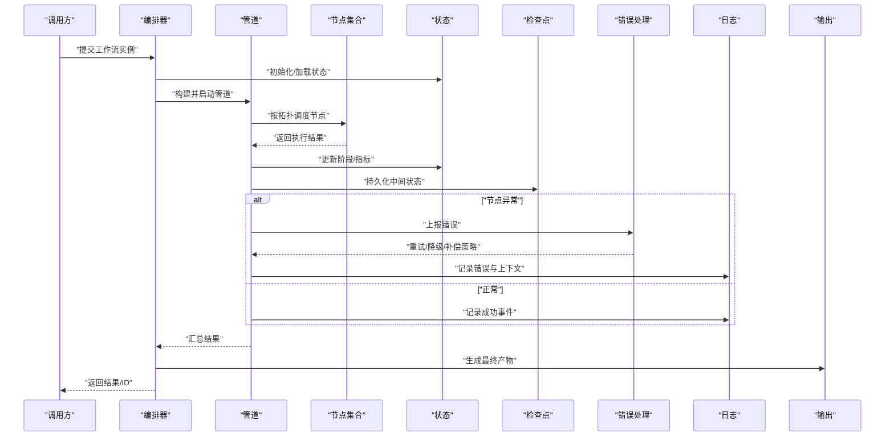

图表来源
- [workflow_orchestrator.py](file://src/penshot/neopen/agent/workflow/workflow_orchestrator.py)
- [workflow_pipeline.py](file://src/penshot/neopen/agent/workflow/workflow_pipeline.py)
- [workflow_nodes.py](file://src/penshot/neopen/agent/workflow/workflow_nodes.py)
- [workflow_state_types.py](file://src/penshot/neopen/agent/workflow/workflow_state_types.py)
- [workflow_checkpointer.py](file://src/penshot/neopen/agent/workflow/workflow_checkpointer.py)
- [workflow_error_handler.py](file://src/penshot/neopen/agent/workflow/workflow_error_handler.py)
- [workflow_logger.py](file://src/penshot/neopen/agent/workflow/workflow_logger.py)
- [workflow_output.py](file://src/penshot/neopen/agent/workflow/workflow_output.py)

## 详细组件分析

### 编排器（Orchestrator）
- 职责
  - 创建工作流实例，解析配置，注册节点与边。
  - 驱动管道执行，聚合各节点结果，维护全局状态。
  - 对接检查点，支持中断恢复与幂等重放。
  - 集成错误处理与日志，暴露查询与诊断接口。
- 关键流程
  - 启动：初始化状态与记忆，加载检查点（若存在）。
  - 执行：按拓扑顺序或依赖图调度节点，控制并发度与超时。
  - 收尾：合并输出、触发决策、持久化最终状态。
- 并发与资源
  - 通过管道层并发控制限制同时运行的节点数，避免资源争用。
  - 使用内存/外部存储作为检查点，确保失败恢复的一致性。
- 与任务层的协作
  - 通过任务生命周期服务协调任务的创建、调度、完成与清理。
  - 借助任务管理器与处理器完成具体业务逻辑的执行与结果回写。

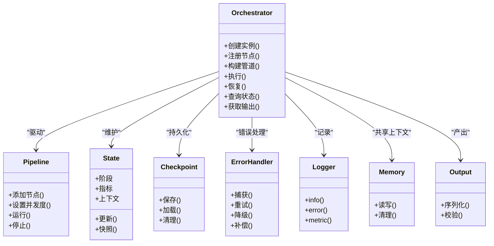

图表来源
- [workflow_orchestrator.py](file://src/penshot/neopen/agent/workflow/workflow_orchestrator.py)
- [workflow_pipeline.py](file://src/penshot/neopen/agent/workflow/workflow_pipeline.py)
- [workflow_state_types.py](file://src/penshot/neopen/agent/workflow/workflow_state_types.py)
- [workflow_checkpointer.py](file://src/penshot/neopen/agent/workflow/workflow_checkpointer.py)
- [workflow_error_handler.py](file://src/penshot/neopen/agent/workflow/workflow_error_handler.py)
- [workflow_logger.py](file://src/penshot/neopen/agent/workflow/workflow_logger.py)
- [workflow_memory.py](file://src/penshot/neopen/agent/workflow/workflow_memory.py)
- [workflow_output.py](file://src/penshot/neopen/agent/workflow/workflow_output.py)

章节来源
- [workflow_orchestrator.py](file://src/penshot/neopen/agent/workflow/workflow_orchestrator.py)
- [task_lifecycle_service.py](file://src/penshot/neopen/agent/task/task_lifecycle_service.py)
- [task_manager.py](file://src/penshot/neopen/agent/task/task_manager.py)
- [task_processor.py](file://src/penshot/neopen/agent/task/task_processor.py)

### 管道（Pipeline）
- 职责
  - 将多个节点按拓扑连接，形成有向无环图（DAG）。
  - 根据依赖关系与并发度调度节点执行。
  - 提供重试、超时、熔断与回退策略。
- 执行机制
  - 拓扑排序确定可执行集合。
  - 在每轮选择就绪节点，按并发上限并行执行。
  - 节点完成后更新依赖计数，推进下一批。
- 容错
  - 节点异常时交由错误处理组件进行重试或降级。
  - 支持部分失败时的补偿与局部恢复。

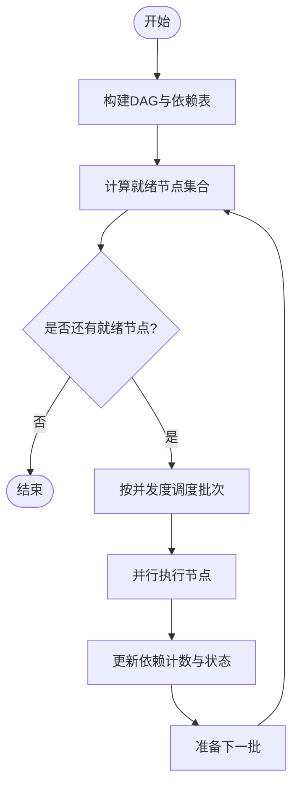

图表来源
- [workflow_pipeline.py](file://src/penshot/neopen/agent/workflow/workflow_pipeline.py)
- [workflow_nodes.py](file://src/penshot/neopen/agent/workflow/workflow_nodes.py)
- [workflow_error_handler.py](file://src/penshot/neopen/agent/workflow/workflow_error_handler.py)

章节来源
- [workflow_pipeline.py](file://src/penshot/neopen/agent/workflow/workflow_pipeline.py)
- [workflow_nodes.py](file://src/penshot/neopen/agent/workflow/workflow_nodes.py)
- [workflow_error_handler.py](file://src/penshot/neopen/agent/workflow/workflow_error_handler.py)

### 节点（Node）
- 职责
  - 定义输入契约、执行逻辑与输出规范。
  - 可选地访问记忆、读取检查点、写入日志与指标。
- 设计要点
  - 幂等：同一输入多次执行应得到相同结果。
  - 可恢复：支持中途失败后从最近检查点继续。
  - 可观测：记录关键步骤与耗时。
- 典型节点类型
  - 转换节点：对数据进行清洗、格式化或增强。
  - 评估节点：质量审核、规则校验与评分。
  - 决策节点：根据条件分支或路由到不同子流程。

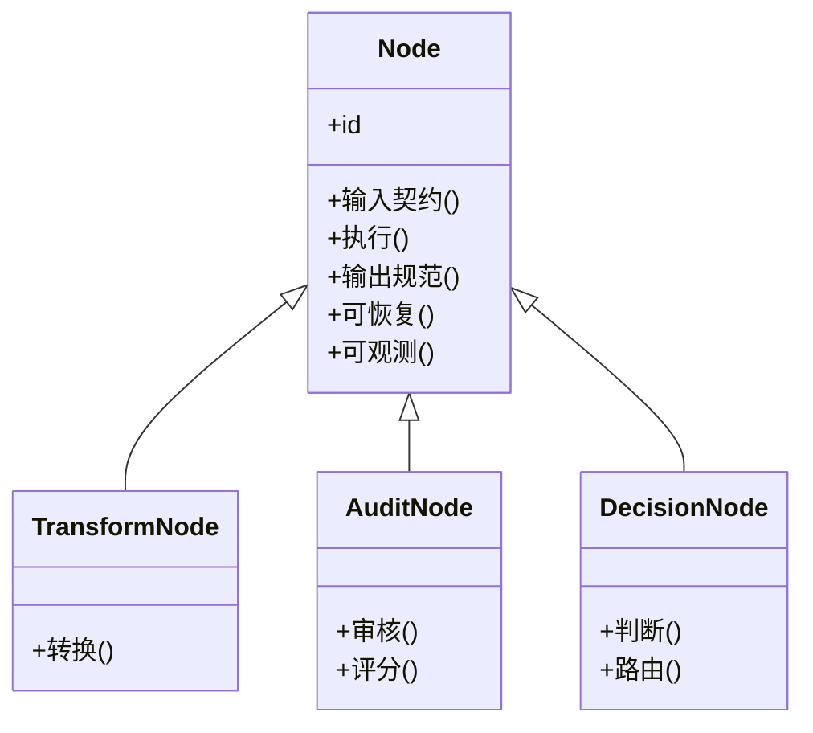

图表来源
- [workflow_nodes.py](file://src/penshot/neopen/agent/workflow/workflow_nodes.py)
- [workflow_models.py](file://src/penshot/neopen/agent/workflow/workflow_models.py)

章节来源
- [workflow_nodes.py](file://src/penshot/neopen/agent/workflow/workflow_nodes.py)
- [workflow_models.py](file://src/penshot/neopen/agent/workflow/workflow_models.py)

### 状态与模型（State & Models）
- 状态类型
  - 阶段：如初始化、运行中、暂停、完成、失败。
  - 指标：吞吐、延迟、错误率、重试次数等。
  - 上下文：跨节点的共享数据与元信息。
- 数据模型
  - 工作流实例、节点实例、执行记录、检查结果等。
- 一致性
  - 通过检查点快照与事务式更新保障状态一致性。

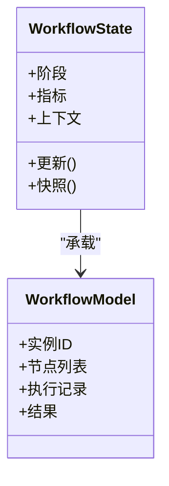

图表来源
- [workflow_state_types.py](file://src/penshot/neopen/agent/workflow/workflow_state_types.py)
- [workflow_models.py](file://src/penshot/neopen/agent/workflow/workflow_models.py)

章节来源
- [workflow_state_types.py](file://src/penshot/neopen/agent/workflow/workflow_state_types.py)
- [workflow_models.py](file://src/penshot/neopen/agent/workflow/workflow_models.py)

### 检查点（Checkpoint）
- 功能
  - 定期或事件触发保存工作流与节点状态。
  - 支持加载历史快照以恢复执行。
- 策略
  - 增量保存减少开销。
  - 原子写入与校验保证完整性。
- 与恢复
  - 编排器在启动时优先尝试恢复，再决定是否从头执行。

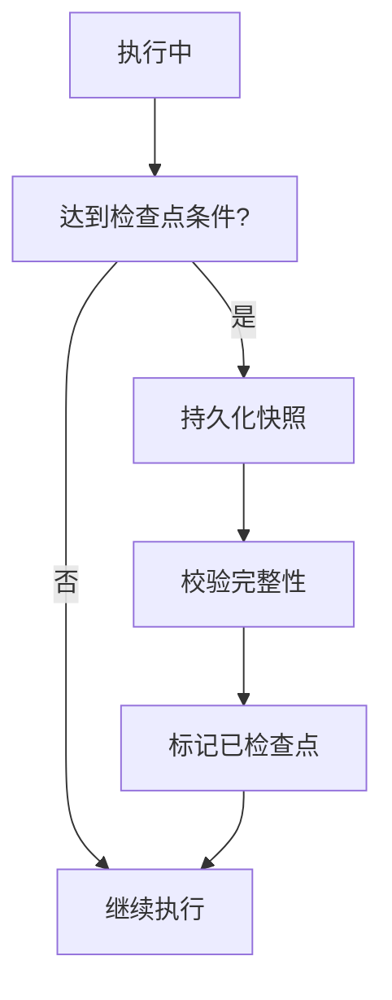

图表来源
- [workflow_checkpointer.py](file://src/penshot/neopen/agent/workflow/workflow_checkpointer.py)

章节来源
- [workflow_checkpointer.py](file://src/penshot/neopen/agent/workflow/workflow_checkpointer.py)

### 错误处理（ErrorHandler）
- 策略
  - 重试：指数退避与最大次数限制。
  - 降级：使用缓存或默认值继续流程。
  - 补偿：撤销已完成但后续失败的副作用。
- 分类
  - 可恢复错误：网络抖动、临时资源不足。
  - 不可恢复错误：参数非法、数据损坏。
- 与日志和监控
  - 记录错误上下文、堆栈与指标，便于定位与告警。

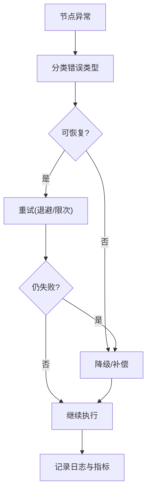

图表来源
- [workflow_error_handler.py](file://src/penshot/neopen/agent/workflow/workflow_error_handler.py)
- [workflow_logger.py](file://src/penshot/neopen/agent/workflow/workflow_logger.py)

章节来源
- [workflow_error_handler.py](file://src/penshot/neopen/agent/workflow/workflow_error_handler.py)
- [workflow_logger.py](file://src/penshot/neopen/agent/workflow/workflow_logger.py)

### 日志与记忆（Logger & Memory）
- 日志
  - 结构化事件：开始、结束、错误、指标。
  - 关联ID：贯穿一次工作流执行的唯一标识。
- 记忆
  - 短期记忆：当前工作流实例内共享。
  - 长期记忆：跨实例复用，加速相似任务。
  - 清理策略：过期淘汰与容量限制。

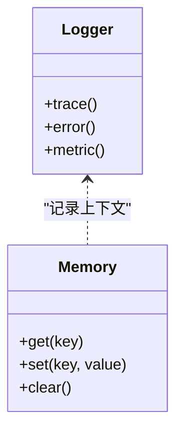

图表来源
- [workflow_logger.py](file://src/penshot/neopen/agent/workflow/workflow_logger.py)
- [workflow_memory.py](file://src/penshot/neopen/agent/workflow/workflow_memory.py)

章节来源
- [workflow_logger.py](file://src/penshot/neopen/agent/workflow/workflow_logger.py)
- [workflow_memory.py](file://src/penshot/neopen/agent/workflow/workflow_memory.py)

### 输出与输出修复（Output & OutputFixer）
- 输出
  - 标准化最终产物，支持多种格式与版本。
  - 校验与签名，确保下游消费安全。
- 输出修复
  - 自动修复常见格式错误与缺失字段。
  - 二次验证与回退策略。

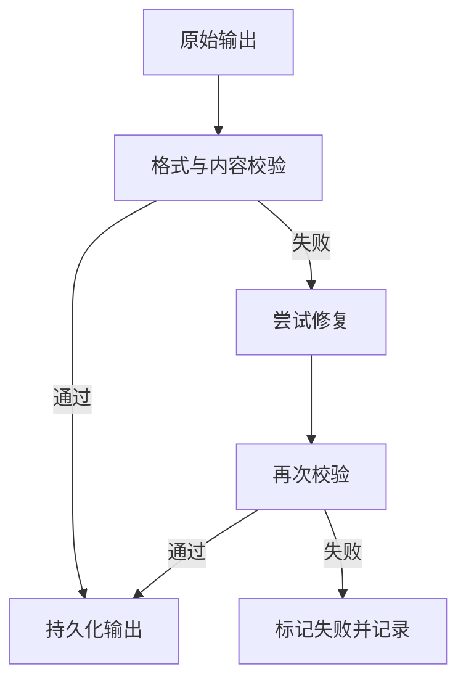

图表来源
- [workflow_output.py](file://src/penshot/neopen/agent/workflow/workflow_output.py)
- [workflow_output_fixer.py](file://src/penshot/neopen/agent/workflow/workflow_output_fixer.py)

章节来源
- [workflow_output.py](file://src/penshot/neopen/agent/workflow/workflow_output.py)
- [workflow_output_fixer.py](file://src/penshot/neopen/agent/workflow/workflow_output_fixer.py)

### 决策（Decision）
- 作用
  - 基于规则或外部信号决定分支、重试、跳过或终止。
- 示例
  - 质量阈值低于标准则进入人工复核或重新生成。
  - 外部依赖不可用时切换备用路径。

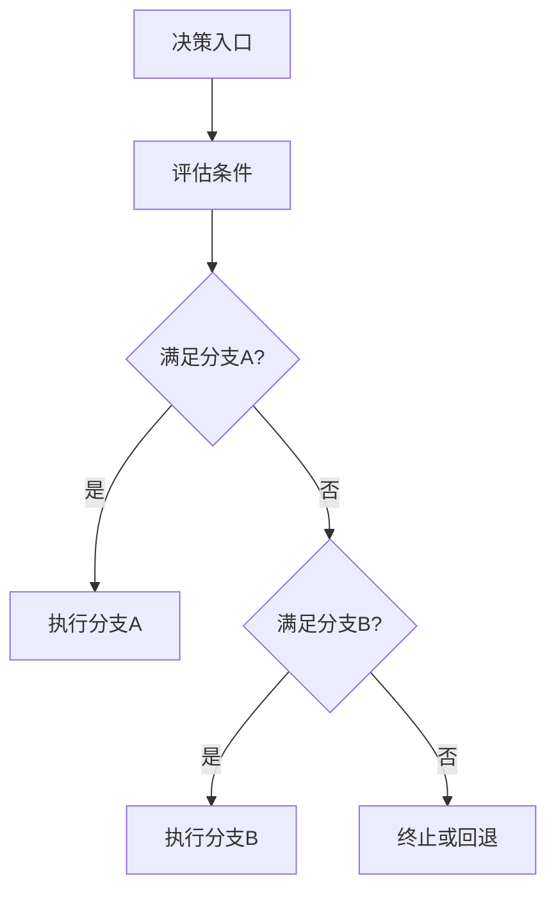

图表来源
- [workflow_decision.py](file://src/penshot/neopen/agent/workflow/workflow_decision.py)

章节来源
- [workflow_decision.py](file://src/penshot/neopen/agent/workflow/workflow_decision.py)

### 任务生命周期与并发控制（Task Lifecycle & Concurrency）
- 生命周期服务
  - 负责任务的创建、调度、完成、清理与状态同步。
- 任务管理器
  - 维护任务队列、优先级与资源配额。
- 任务处理器
  - 执行具体业务逻辑，返回结果并上报状态。
- 并发策略
  - 基于线程池或进程池控制并发度。
  - 背压与限流防止过载。

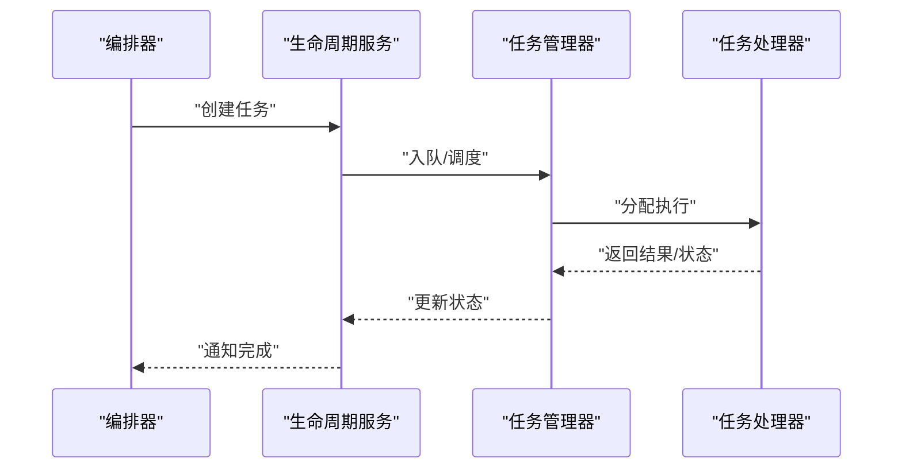

图表来源
- [task_lifecycle_service.py](file://src/penshot/neopen/agent/task/task_lifecycle_service.py)
- [task_manager.py](file://src/penshot/neopen/agent/task/task_manager.py)
- [task_processor.py](file://src/penshot/neopen/agent/task/task_processor.py)

章节来源
- [task_lifecycle_service.py](file://src/penshot/neopen/agent/task/task_lifecycle_service.py)
- [task_manager.py](file://src/penshot/neopen/agent/task/task_manager.py)
- [task_processor.py](file://src/penshot/neopen/agent/task/task_processor.py)

## 依赖关系分析
- 内部依赖
  - 编排器强依赖管道、状态、检查点、错误处理、日志、记忆与输出。
  - 管道依赖节点定义与错误处理。
  - 任务层通过生命周期服务与编排器交互。
- 耦合与内聚
  - 高内聚：每个组件职责清晰，接口稳定。
  - 低耦合：通过抽象接口与事件/消息解耦。
- 潜在循环依赖
  - 应避免节点直接反向依赖编排器，改为通过管道回调或事件总线通信。

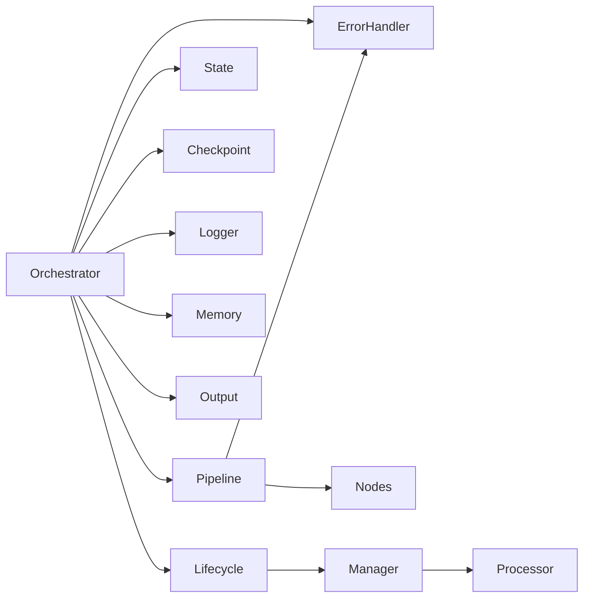

图表来源
- [workflow_orchestrator.py](file://src/penshot/neopen/agent/workflow/workflow_orchestrator.py)
- [workflow_pipeline.py](file://src/penshot/neopen/agent/workflow/workflow_pipeline.py)
- [workflow_nodes.py](file://src/penshot/neopen/agent/workflow/workflow_nodes.py)
- [workflow_state_types.py](file://src/penshot/neopen/agent/workflow/workflow_state_types.py)
- [workflow_checkpointer.py](file://src/penshot/neopen/agent/workflow/workflow_checkpointer.py)
- [workflow_error_handler.py](file://src/penshot/neopen/agent/workflow/workflow_error_handler.py)
- [workflow_logger.py](file://src/penshot/neopen/agent/workflow/workflow_logger.py)
- [workflow_memory.py](file://src/penshot/neopen/agent/workflow/workflow_memory.py)
- [workflow_output.py](file://src/penshot/neopen/agent/workflow/workflow_output.py)
- [task_lifecycle_service.py](file://src/penshot/neopen/agent/task/task_lifecycle_service.py)
- [task_manager.py](file://src/penshot/neopen/agent/task/task_manager.py)
- [task_processor.py](file://src/penshot/neopen/agent/task/task_processor.py)

章节来源
- [workflow_orchestrator.py](file://src/penshot/neopen/agent/workflow/workflow_orchestrator.py)
- [workflow_pipeline.py](file://src/penshot/neopen/agent/workflow/workflow_pipeline.py)
- [workflow_nodes.py](file://src/penshot/neopen/agent/workflow/workflow_nodes.py)
- [workflow_state_types.py](file://src/penshot/neopen/agent/workflow/workflow_state_types.py)
- [workflow_checkpointer.py](file://src/penshot/neopen/agent/workflow/workflow_checkpointer.py)
- [workflow_error_handler.py](file://src/penshot/neopen/agent/workflow/workflow_error_handler.py)
- [workflow_logger.py](file://src/penshot/neopen/agent/workflow/workflow_logger.py)
- [workflow_memory.py](file://src/penshot/neopen/agent/workflow/workflow_memory.py)
- [workflow_output.py](file://src/penshot/neopen/agent/workflow/workflow_output.py)
- [task_lifecycle_service.py](file://src/penshot/neopen/agent/task/task_lifecycle_service.py)
- [task_manager.py](file://src/penshot/neopen/agent/task/task_manager.py)
- [task_processor.py](file://src/penshot/neopen/agent/task/task_processor.py)

## 性能考虑
- 并发度调优
  - 根据CPU/IO特性调整节点并发度，避免上下文切换与锁竞争。
- 检查点频率
  - 平衡恢复成本与持久化开销，采用增量与异步落盘。
- 记忆容量
  - 设置容量上限与淘汰策略，防止内存膨胀。
- 错误重试
  - 合理设置退避与最大次数，避免雪崩效应。
- 输出优化
  - 批量序列化与压缩，减少I/O压力。

[本节为通用指导，无需源码引用]

## 故障排查指南
- 常见问题
  - 节点反复失败：检查错误分类与重试策略，查看日志中的错误上下文。
  - 状态不一致：核对检查点快照与状态更新顺序，确认原子性。
  - 输出不合法：启用输出修复与二次校验，定位缺陷节点。
- 诊断工具
  - 使用日志与指标接口检索特定工作流实例的执行轨迹。
  - 通过检查点导出与回放复现问题。
- 测试与回归
  - 参考单元测试用例，构造边界输入与异常场景，验证健壮性。

章节来源
- [workflow_error_handler.py](file://src/penshot/neopen/agent/workflow/workflow_error_handler.py)
- [workflow_logger.py](file://src/penshot/neopen/agent/workflow/workflow_logger.py)
- [workflow_checkpointer.py](file://src/penshot/neopen/agent/workflow/workflow_checkpointer.py)
- [workflow_output_fixer.py](file://src/penshot/neopen/agent/workflow/workflow_output_fixer.py)
- [test_workflow_orchestrator.py](file://tests/workflow/test_workflow_orchestrator.py)

## 结论
本工作流管理系统以编排器为核心，结合管道、节点、状态、检查点、错误处理、日志、记忆与输出等组件，提供了可扩展、可恢复、可观测的工作流执行框架。通过合理的并发控制与错误策略，能够支撑复杂业务场景的稳定运行。建议在生产环境中结合监控与告警体系，持续优化性能与可靠性。

[本节为总结，无需源码引用]

## 附录
- 自定义工作流开发指南
  - 定义节点：实现输入契约、执行逻辑与输出规范，确保幂等与可恢复。
  - 构建管道：按依赖关系添加节点，设置并发度与重试策略。
  - 注册编排器：将管道与状态、检查点、错误处理、日志、记忆与输出装配。
  - 运行与恢复：启动执行，必要时从检查点恢复。
  - 测试与验证：编写单测与集成测试，覆盖正常与异常路径。
- 复杂业务场景设计模式
  - 分片与汇聚：将大数据集切分为片段并行处理，最后汇聚结果。
  - 条件分支：依据质量评估或外部信号动态选择执行路径。
  - 重试与降级：对不稳定依赖实施重试与降级策略，保障主流程稳定。
  - 人工介入：在关键节点引入人工审核与干预，提高可控性。

[本节为概念性指导，无需源码引用]