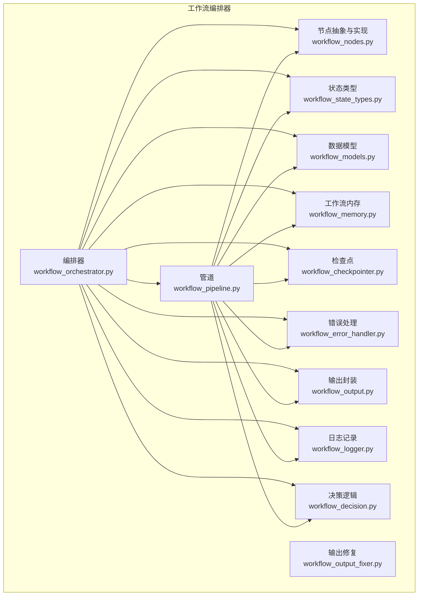
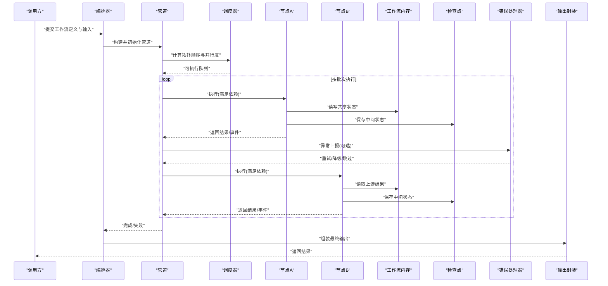
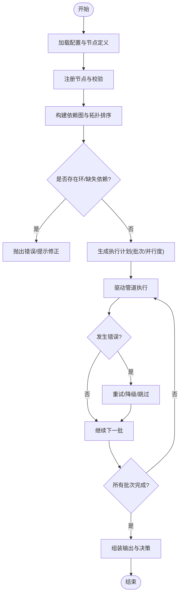
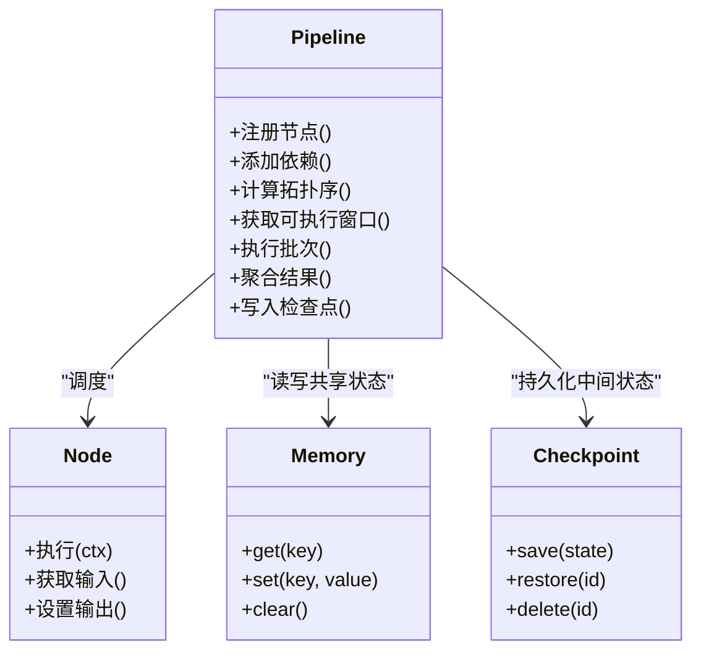
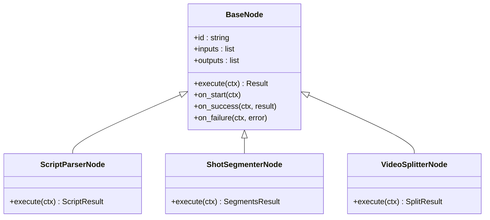
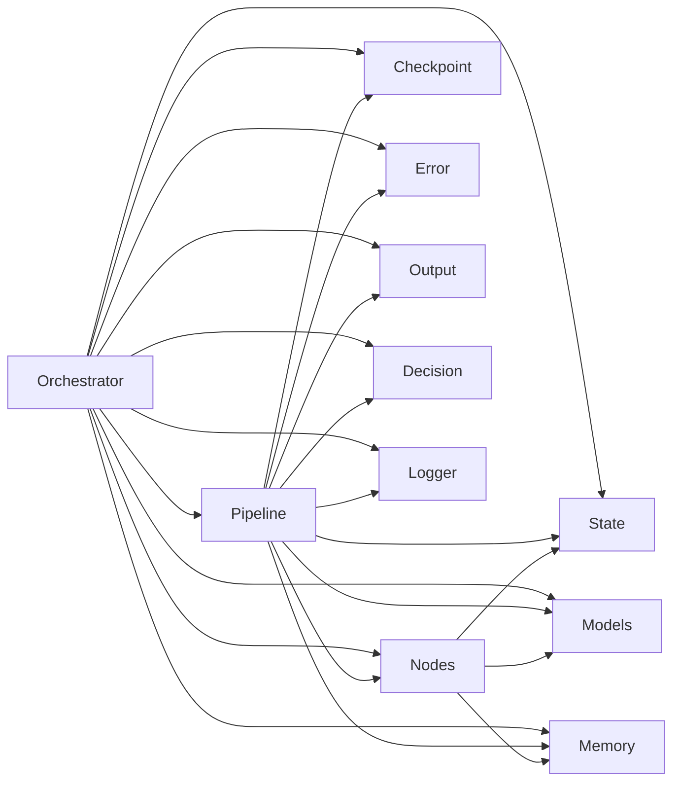
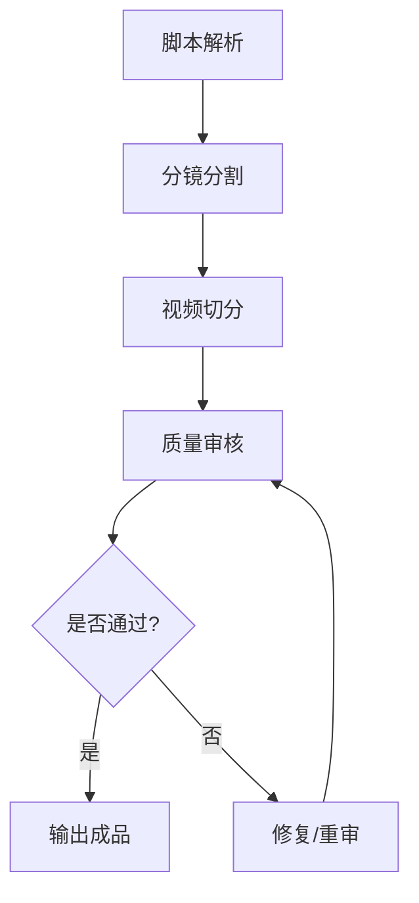

# 工作流编排器

<cite>
**本文引用的文件**   
- [workflow_orchestrator.py](file://src/penshot/neopen/agent/workflow/workflow_orchestrator.py)
- [workflow_pipeline.py](file://src/penshot/neopen/agent/workflow/workflow_pipeline.py)
- [workflow_nodes.py](file://src/penshot/neopen/agent/workflow/workflow_nodes.py)
- [workflow_state_types.py](file://src/penshot/neopen/agent/workflow/workflow_state_types.py)
- [workflow_models.py](file://src/penshot/neopen/agent/workflow/workflow_models.py)
- [workflow_memory.py](file://src/penshot/neopen/agent/workflow/workflow_memory.py)
- [workflow_checkpointer.py](file://src/penshot/neopen/agent/workflow/workflow_checkpointer.py)
- [workflow_error_handler.py](file://src/penshot/neopen/agent/workflow/workflow_error_handler.py)
- [workflow_output.py](file://src/penshot/neopen/agent/workflow/workflow_output.py)
- [workflow_output_fixer.py](file://src/penshot/neopen/agent/workflow/workflow_output_fixer.py)
- [workflow_logger.py](file://src/penshot/neopen/agent/workflow/workflow_logger.py)
- [workflow_decision.py](file://src/penshot/neopen/agent/workflow/workflow_decision.py)
- [test_workflow_orchestrator.py](file://tests/workflow/test_workflow_orchestrator.py)
</cite>

## 目录
1. [简介](#简介)
2. [项目结构](#项目结构)
3. [核心组件](#核心组件)
4. [架构总览](#架构总览)
5. [详细组件分析](#详细组件分析)
6. [依赖关系分析](#依赖关系分析)
7. [性能考虑](#性能考虑)
8. [故障排查指南](#故障排查指南)
9. [结论](#结论)
10. [附录](#附录)

## 简介
本文件面向“工作流编排器”的深入文档，聚焦以下目标：
- 核心架构设计：节点调度、依赖管理、执行顺序控制
- 管道构建与执行流程：从定义到运行、从输入到输出
- 节点间通信与数据传递：状态模型、内存与会话持久化
- 自定义节点创建指南与最佳实践
- 并发处理机制与性能优化策略
- 复杂业务场景编排示例（以脚本解析、分镜分割、视频切分为例）

## 项目结构
工作流编排器位于 neopen.agent.workflow 子包中，围绕“编排器-管道-节点-状态-记忆-检查点-错误处理-输出-决策-日志”等模块组织。测试用例位于 tests/workflow 下，用于验证编排器的关键路径。

图表来源
- [workflow_orchestrator.py](file://src/penshot/neopen/agent/workflow/workflow_orchestrator.py)
- [workflow_pipeline.py](file://src/penshot/neopen/agent/workflow/workflow_pipeline.py)
- [workflow_nodes.py](file://src/penshot/neopen/agent/workflow/workflow_nodes.py)
- [workflow_state_types.py](file://src/penshot/neopen/agent/workflow/workflow_state_types.py)
- [workflow_models.py](file://src/penshot/neopen/agent/workflow/workflow_models.py)
- [workflow_memory.py](file://src/penshot/neopen/agent/workflow/workflow_memory.py)
- [workflow_checkpointer.py](file://src/penshot/neopen/agent/workflow/workflow_checkpointer.py)
- [workflow_error_handler.py](file://src/penshot/neopen/agent/workflow/workflow_error_handler.py)
- [workflow_output.py](file://src/penshot/neopen/agent/workflow/workflow_output.py)
- [workflow_output_fixer.py](file://src/penshot/neopen/agent/workflow/workflow_output_fixer.py)
- [workflow_logger.py](file://src/penshot/neopen/agent/workflow/workflow_logger.py)
- [workflow_decision.py](file://src/penshot/neopen/agent/workflow/workflow_decision.py)

章节来源
- [workflow_orchestrator.py](file://src/penshot/neopen/agent/workflow/workflow_orchestrator.py)
- [workflow_pipeline.py](file://src/penshot/neopen/agent/workflow/workflow_pipeline.py)
- [workflow_nodes.py](file://src/penshot/neopen/agent/workflow/workflow_nodes.py)
- [workflow_state_types.py](file://src/penshot/neopen/agent/workflow/workflow_state_types.py)
- [workflow_models.py](file://src/penshot/neopen/agent/workflow/workflow_models.py)
- [workflow_memory.py](file://src/penshot/neopen/agent/workflow/workflow_memory.py)
- [workflow_checkpointer.py](file://src/penshot/neopen/agent/workflow/workflow_checkpointer.py)
- [workflow_error_handler.py](file://src/penshot/neopen/agent/workflow/workflow_error_handler.py)
- [workflow_output.py](file://src/penshot/neopen/agent/workflow/workflow_output.py)
- [workflow_output_fixer.py](file://src/penshot/neopen/agent/workflow/workflow_output_fixer.py)
- [workflow_logger.py](file://src/penshot/neopen/agent/workflow/workflow_logger.py)
- [workflow_decision.py](file://src/penshot/neopen/agent/workflow/workflow_decision.py)

## 核心组件
- 编排器（Orchestrator）：负责加载配置、注册节点、构建有向无环图（DAG）、计算执行顺序、驱动管道执行、协调错误与恢复、汇总输出。
- 管道（Pipeline）：承载节点序列与依赖关系，提供拓扑排序、并行度控制、阶段划分、中间结果缓存与检查点写入。
- 节点（Nodes）：统一抽象接口，定义输入/输出契约、上下文访问、副作用处理、重试与超时策略。
- 状态与模型（State & Models）：定义工作流全局状态、节点局部状态、输入输出数据结构、决策与事件模型。
- 内存（Memory）：提供会话级与工作流级键值存储，支持跨节点共享数据与临时变量。
- 检查点（Checkpointer）：持久化中间状态，支持断点续跑与回滚。
- 错误处理（Error Handler）：统一异常捕获、降级策略、重试与补偿动作。
- 输出（Output & Fixer）：标准化最终输出格式，提供自动修复与校验。
- 决策（Decision）：基于规则或外部信号决定分支走向、是否继续、是否需要人工介入。
- 日志（Logger）：结构化日志、指标采集、审计追踪。

章节来源
- [workflow_orchestrator.py](file://src/penshot/neopen/agent/workflow/workflow_orchestrator.py)
- [workflow_pipeline.py](file://src/penshot/neopen/agent/workflow/workflow_pipeline.py)
- [workflow_nodes.py](file://src/penshot/neopen/agent/workflow/workflow_nodes.py)
- [workflow_state_types.py](file://src/penshot/neopen/agent/workflow/workflow_state_types.py)
- [workflow_models.py](file://src/penshot/neopen/agent/workflow/workflow_models.py)
- [workflow_memory.py](file://src/penshot/neopen/agent/workflow/workflow_memory.py)
- [workflow_checkpointer.py](file://src/penshot/neopen/agent/workflow/workflow_checkpointer.py)
- [workflow_error_handler.py](file://src/penshot/neopen/agent/workflow/workflow_error_handler.py)
- [workflow_output.py](file://src/penshot/neopen/agent/workflow/workflow_output.py)
- [workflow_output_fixer.py](file://src/penshot/neopen/agent/workflow/workflow_output_fixer.py)
- [workflow_decision.py](file://src/penshot/neopen/agent/workflow/workflow_decision.py)
- [workflow_logger.py](file://src/penshot/neopen/agent/workflow/workflow_logger.py)

## 架构总览
下图展示了编排器如何驱动管道执行，以及各组件之间的交互关系。

图表来源
- [workflow_orchestrator.py](file://src/penshot/neopen/agent/workflow/workflow_orchestrator.py)
- [workflow_pipeline.py](file://src/penshot/neopen/agent/workflow/workflow_pipeline.py)
- [workflow_nodes.py](file://src/penshot/neopen/agent/workflow/workflow_nodes.py)
- [workflow_memory.py](file://src/penshot/neopen/agent/workflow/workflow_memory.py)
- [workflow_checkpointer.py](file://src/penshot/neopen/agent/workflow/workflow_checkpointer.py)
- [workflow_error_handler.py](file://src/penshot/neopen/agent/workflow/workflow_error_handler.py)
- [workflow_output.py](file://src/penshot/neopen/agent/workflow/workflow_output.py)

## 详细组件分析

### 编排器（Orchestrator）
职责
- 接收工作流定义（节点列表、边/依赖、参数、策略）
- 注册与校验节点，构建内部表示
- 生成执行计划（拓扑序、并行窗口）
- 驱动管道执行，收集事件与指标
- 协调错误处理、检查点恢复、输出组装

关键流程
- 初始化：加载配置、注册节点工厂、注入内存与检查点
- 构建：解析依赖、检测环、计算入度、生成批次
- 执行：按批次调度、等待依赖就绪、并发执行、更新状态
- 收尾：合并输出、触发决策、持久化检查点、清理资源

图表来源
- [workflow_orchestrator.py](file://src/penshot/neopen/agent/workflow/workflow_orchestrator.py)
- [workflow_pipeline.py](file://src/penshot/neopen/agent/workflow/workflow_pipeline.py)
- [workflow_error_handler.py](file://src/penshot/neopen/agent/workflow/workflow_error_handler.py)
- [workflow_decision.py](file://src/penshot/neopen/agent/workflow/workflow_decision.py)

章节来源
- [workflow_orchestrator.py](file://src/penshot/neopen/agent/workflow/workflow_orchestrator.py)
- [workflow_pipeline.py](file://src/penshot/neopen/agent/workflow/workflow_pipeline.py)
- [workflow_error_handler.py](file://src/penshot/neopen/agent/workflow/workflow_error_handler.py)
- [workflow_decision.py](file://src/penshot/neopen/agent/workflow/workflow_decision.py)

### 管道（Pipeline）
职责
- 维护节点集合与依赖边
- 计算拓扑序与可执行窗口
- 管理并发执行与资源限制
- 聚合中间结果与事件
- 与检查点、内存、错误处理协作

关键点
- 依赖解析：将声明式依赖转换为可执行队列
- 并行窗口：根据资源上限与依赖约束动态推进
- 中间态：在内存中缓存节点输出，供下游消费
- 容错：对失败节点进行重试、跳过或补偿

图表来源
- [workflow_pipeline.py](file://src/penshot/neopen/agent/workflow/workflow_pipeline.py)
- [workflow_nodes.py](file://src/penshot/neopen/agent/workflow/workflow_nodes.py)
- [workflow_memory.py](file://src/penshot/neopen/agent/workflow/workflow_memory.py)
- [workflow_checkpointer.py](file://src/penshot/neopen/agent/workflow/workflow_checkpointer.py)

章节来源
- [workflow_pipeline.py](file://src/penshot/neopen/agent/workflow/workflow_pipeline.py)
- [workflow_nodes.py](file://src/penshot/neopen/agent/workflow/workflow_nodes.py)
- [workflow_memory.py](file://src/penshot/neopen/agent/workflow/workflow_memory.py)
- [workflow_checkpointer.py](file://src/penshot/neopen/agent/workflow/workflow_checkpointer.py)

### 节点（Nodes）
职责
- 定义统一的执行接口与生命周期钩子
- 声明输入/输出契约与依赖
- 访问工作流上下文与内存
- 处理副作用（I/O、外部服务调用）
- 支持重试、超时、熔断等策略

最佳实践
- 幂等性：同一输入多次执行应得到一致结果
- 小粒度：单一职责，便于复用与组合
- 明确契约：输入输出使用强类型模型，避免隐式约定
- 可观测性：记录关键指标与事件，便于排障

图表来源
- [workflow_nodes.py](file://src/penshot/neopen/agent/workflow/workflow_nodes.py)
- [workflow_models.py](file://src/penshot/neopen/agent/workflow/workflow_models.py)

章节来源
- [workflow_nodes.py](file://src/penshot/neopen/agent/workflow/workflow_nodes.py)
- [workflow_models.py](file://src/penshot/neopen/agent/workflow/workflow_models.py)

### 状态与模型（State & Models）
- 全局状态：包含工作流ID、版本、阶段、指标、事件流
- 节点状态：每个节点的输入快照、输出、错误信息、耗时
- 数据模型：脚本、分镜、片段等实体的结构化定义

作用
- 为编排器与管道提供一致的视图
- 作为检查点与输出的序列化基础
- 支撑决策与审计

章节来源
- [workflow_state_types.py](file://src/penshot/neopen/agent/workflow/workflow_state_types.py)
- [workflow_models.py](file://src/penshot/neopen/agent/workflow/workflow_models.py)

### 内存（Memory）
- 会话级键值存储，支持跨节点共享
- 提供原子操作与过期策略（可选）
- 与检查点配合，实现状态一致性

章节来源
- [workflow_memory.py](file://src/penshot/neopen/agent/workflow/workflow_memory.py)

### 检查点（Checkpointer）
- 支持保存/恢复/删除工作流状态
- 与管道批次对齐，保证一致性
- 可用于断点续跑与回滚

章节来源
- [workflow_checkpointer.py](file://src/penshot/neopen/agent/workflow/workflow_checkpointer.py)

### 错误处理（Error Handler）
- 统一捕获异常，分类处理（重试、跳过、降级）
- 提供补偿动作与告警
- 与编排器协同，决定是否终止或继续

章节来源
- [workflow_error_handler.py](file://src/penshot/neopen/agent/workflow/workflow_error_handler.py)

### 输出（Output & Fixer）
- 标准化最终输出结构，确保下游稳定消费
- 自动修复常见格式问题（如JSON不完整）
- 提供校验与审计字段

章节来源
- [workflow_output.py](file://src/penshot/neopen/agent/workflow/workflow_output.py)
- [workflow_output_fixer.py](file://src/penshot/neopen/agent/workflow/workflow_output_fixer.py)

### 决策（Decision）
- 基于规则或外部信号决定分支走向
- 支持人工介入与审批流程
- 与编排器联动，动态调整执行路径

章节来源
- [workflow_decision.py](file://src/penshot/neopen/agent/workflow/workflow_decision.py)

### 日志（Logger）
- 结构化日志、指标采集、审计追踪
- 支持分级与采样，降低开销

章节来源
- [workflow_logger.py](file://src/penshot/neopen/agent/workflow/workflow_logger.py)

## 依赖关系分析
- 编排器依赖管道、节点、状态、内存、检查点、错误处理、输出、决策、日志
- 管道依赖节点、状态、内存、检查点、错误处理、输出、决策、日志
- 节点依赖状态、模型、内存
- 检查点与内存为基础设施，被多组件复用

图表来源
- [workflow_orchestrator.py](file://src/penshot/neopen/agent/workflow/workflow_orchestrator.py)
- [workflow_pipeline.py](file://src/penshot/neopen/agent/workflow/workflow_pipeline.py)
- [workflow_nodes.py](file://src/penshot/neopen/agent/workflow/workflow_nodes.py)
- [workflow_state_types.py](file://src/penshot/neopen/agent/workflow/workflow_state_types.py)
- [workflow_models.py](file://src/penshot/neopen/agent/workflow/workflow_models.py)
- [workflow_memory.py](file://src/penshot/neopen/agent/workflow/workflow_memory.py)
- [workflow_checkpointer.py](file://src/penshot/neopen/agent/workflow/workflow_checkpointer.py)
- [workflow_error_handler.py](file://src/penshot/neopen/agent/workflow/workflow_error_handler.py)
- [workflow_output.py](file://src/penshot/neopen/agent/workflow/workflow_output.py)
- [workflow_decision.py](file://src/penshot/neopen/agent/workflow/workflow_decision.py)
- [workflow_logger.py](file://src/penshot/neopen/agent/workflow/workflow_logger.py)

章节来源
- [workflow_orchestrator.py](file://src/penshot/neopen/agent/workflow/workflow_orchestrator.py)
- [workflow_pipeline.py](file://src/penshot/neopen/agent/workflow/workflow_pipeline.py)
- [workflow_nodes.py](file://src/penshot/neopen/agent/workflow/workflow_nodes.py)
- [workflow_state_types.py](file://src/penshot/neopen/agent/workflow/workflow_state_types.py)
- [workflow_models.py](file://src/penshot/neopen/agent/workflow/workflow_models.py)
- [workflow_memory.py](file://src/penshot/neopen/agent/workflow/workflow_memory.py)
- [workflow_checkpointer.py](file://src/penshot/neopen/agent/workflow/workflow_checkpointer.py)
- [workflow_error_handler.py](file://src/penshot/neopen/agent/workflow/workflow_error_handler.py)
- [workflow_output.py](file://src/penshot/neopen/agent/workflow/workflow_output.py)
- [workflow_decision.py](file://src/penshot/neopen/agent/workflow/workflow_decision.py)
- [workflow_logger.py](file://src/penshot/neopen/agent/workflow/workflow_logger.py)

## 性能考虑
- 拓扑排序与批次推进：减少等待时间，最大化并行度
- 资源限流：控制并发窗口，避免过载
- 中间结果缓存：避免重复计算，提升吞吐
- 检查点粒度：平衡持久化开销与恢复成本
- 日志采样：在高吞吐场景下降低IO压力
- 节点幂等：支持安全重试，提高鲁棒性

[本节为通用指导，不直接分析具体文件]

## 故障排查指南
常见问题与定位方法
- 依赖缺失或环：检查节点声明与依赖边，确认拓扑排序成功
- 节点执行失败：查看错误处理器日志与重试策略，必要时启用降级
- 输出不一致：核对输出模型与修复器配置，检查内存共享键冲突
- 性能瓶颈：观察批次大小与并发度，评估检查点频率与日志级别

章节来源
- [workflow_error_handler.py](file://src/penshot/neopen/agent/workflow/workflow_error_handler.py)
- [workflow_output_fixer.py](file://src/penshot/neopen/agent/workflow/workflow_output_fixer.py)
- [workflow_logger.py](file://src/penshot/neopen/agent/workflow/workflow_logger.py)
- [test_workflow_orchestrator.py](file://tests/workflow/test_workflow_orchestrator.py)

## 结论
工作流编排器通过清晰的组件边界与统一的状态模型，实现了高内聚、低耦合的可扩展架构。借助拓扑排序与批次推进，系统能够在保证正确性的前提下获得良好并发性能；结合检查点与错误处理，具备较强的容错与恢复能力。遵循节点幂等与小粒度原则，可进一步提升系统的稳定性与可维护性。

[本节为总结，不直接分析具体文件]

## 附录

### 自定义节点创建指南
步骤
- 继承节点基类，实现执行接口
- 声明输入/输出契约，使用强类型模型
- 在工作流内存中读写共享状态，注意键命名规范
- 处理异常与副作用，记录必要日志
- 在编排器中注册节点，并在管道中声明依赖

最佳实践
- 保持幂等与可重试
- 最小化副作用，优先纯函数
- 明确错误语义，区分可恢复与不可恢复错误
- 使用检查点保存关键中间结果

章节来源
- [workflow_nodes.py](file://src/penshot/neopen/agent/workflow/workflow_nodes.py)
- [workflow_memory.py](file://src/penshot/neopen/agent/workflow/workflow_memory.py)
- [workflow_checkpointer.py](file://src/penshot/neopen/agent/workflow/workflow_checkpointer.py)
- [workflow_error_handler.py](file://src/penshot/neopen/agent/workflow/workflow_error_handler.py)

### 复杂业务场景编排示例
典型链路
- 脚本解析：将自然语言脚本解析为结构化任务
- 分镜分割：依据剧情与对话切分为镜头单元
- 视频切分：按镜头时长与内容切分为片段
- 质量审核：对输出进行规则或模型校验
- 连续性守护：跨片段一致性检查与修复

图表来源
- [workflow_nodes.py](file://src/penshot/neopen/agent/workflow/workflow_nodes.py)
- [workflow_decision.py](file://src/penshot/neopen/agent/workflow/workflow_decision.py)
- [workflow_output.py](file://src/penshot/neopen/agent/workflow/workflow_output.py)
- [workflow_output_fixer.py](file://src/penshot/neopen/agent/workflow/workflow_output_fixer.py)

章节来源
- [workflow_nodes.py](file://src/penshot/neopen/agent/workflow/workflow_nodes.py)
- [workflow_decision.py](file://src/penshot/neopen/agent/workflow/workflow_decision.py)
- [workflow_output.py](file://src/penshot/neopen/agent/workflow/workflow_output.py)
- [workflow_output_fixer.py](file://src/penshot/neopen/agent/workflow/workflow_output_fixer.py)