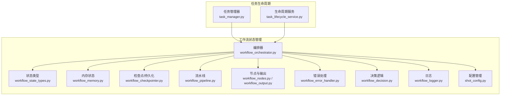
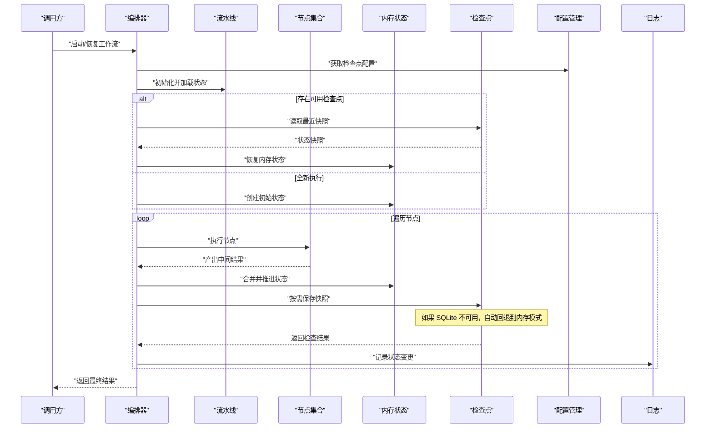
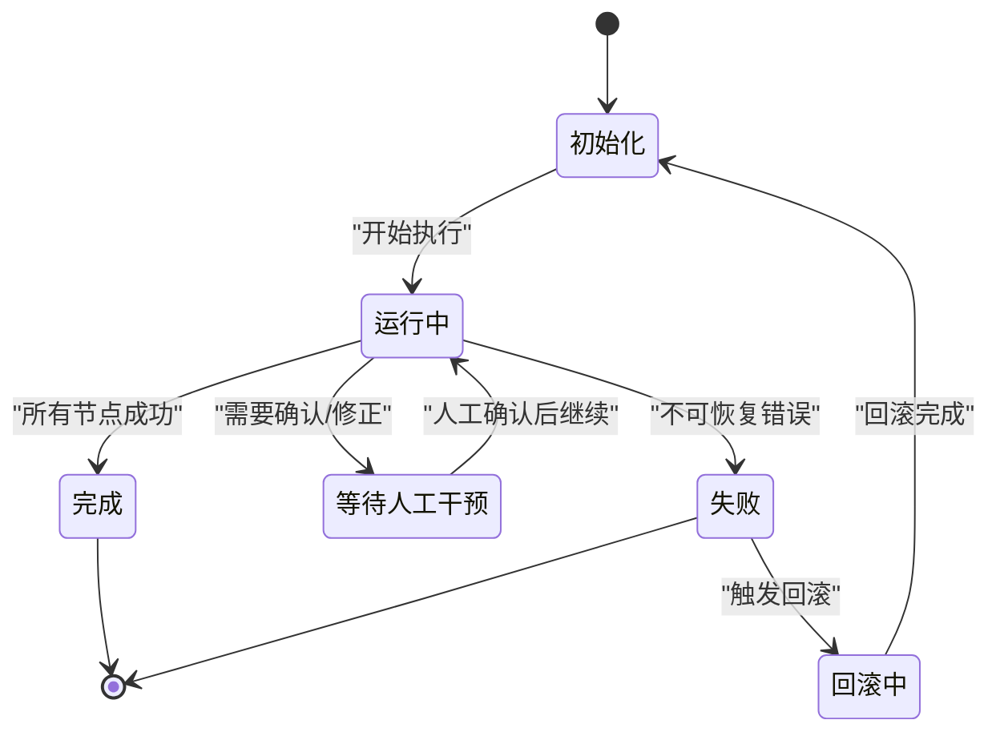
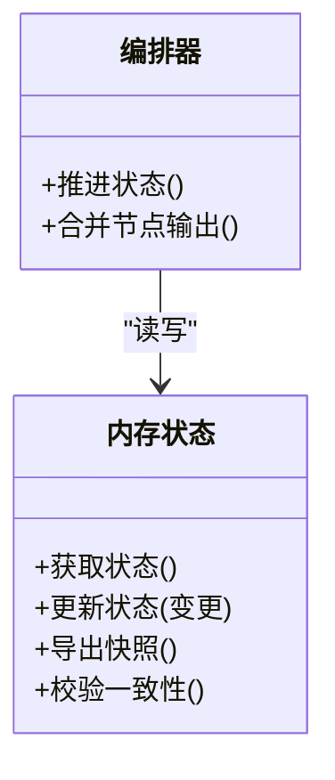
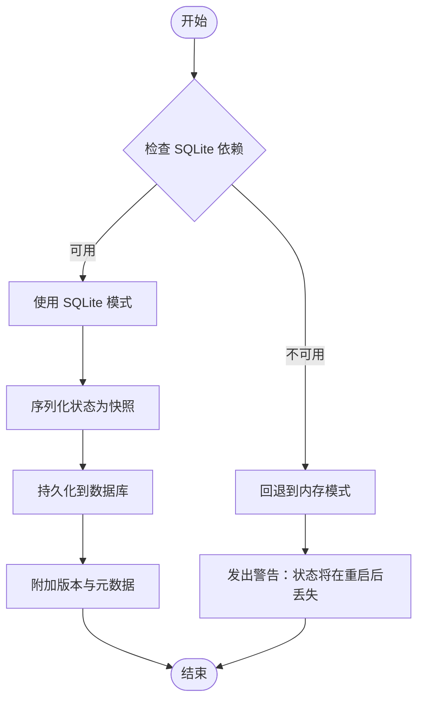
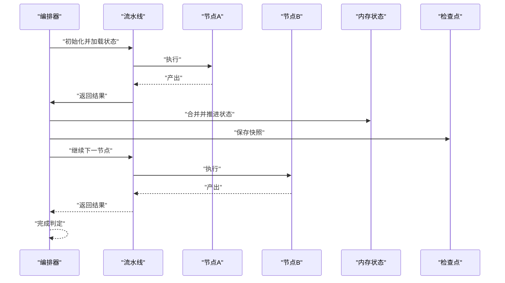
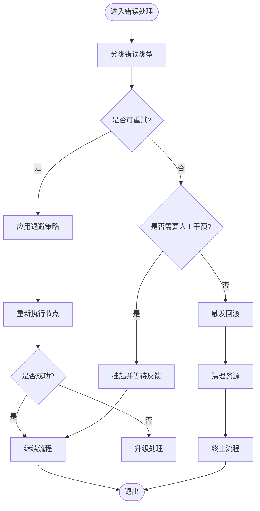
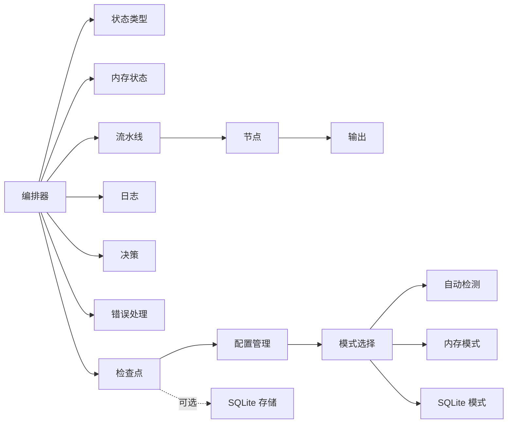

# 状态管理系统

<cite>
**本文引用的文件**   
- [workflow_state_types.py](file://src/penshot/neopen/agent/workflow/workflow_state_types.py)
- [workflow_memory.py](file://src/penshot/neopen/agent/workflow/workflow_memory.py)
- [workflow_checkpointer.py](file://src/penshot/neopen/agent/workflow/workflow_checkpointer.py)
- [workflow_orchestrator.py](file://src/penshot/neopen/agent/workflow/workflow_orchestrator.py)
- [workflow_pipeline.py](file://src/penshot/neopen/agent/workflow/workflow_pipeline.py)
- [workflow_nodes.py](file://src/penshot/neopen/agent/workflow/workflow_nodes.py)
- [workflow_output.py](file://src/penshot/neopen/agent/workflow/workflow_output.py)
- [workflow_error_handler.py](file://src/penshot/neopen/agent/workflow/workflow_error_handler.py)
- [workflow_decision.py](file://src/penshot/neopen/agent/workflow/workflow_decision.py)
- [workflow_logger.py](file://src/penshot/neopen/agent/workflow/workflow_logger.py)
- [task_manager.py](file://src/penshot/neopen/task/task_manager.py)
- [task_lifecycle_service.py](file://src/penshot/neopen/task/task_lifecycle_service.py)
- [test_workflow_orchestrator.py](file://tests/workflow/test_workflow_orchestrator.py)
- [shot_config.py](file://src/penshot/neopen/shot_config.py)
</cite>

## 更新摘要
**所做更改**   
- 更新了检查点系统的优雅降级机制说明
- 添加了 langgraph-checkpoint-sqlite 依赖缺失时的自动回退行为
- 增强了检查点模式配置和自动检测功能的描述
- 更新了故障排查指南以包含新的降级场景

## 目录
1. [简介](#简介)
2. [项目结构](#项目结构)
3. [核心组件](#核心组件)
4. [架构总览](#架构总览)
5. [详细组件分析](#详细组件分析)
6. [依赖关系分析](#依赖关系分析)
7. [性能考虑](#性能考虑)
8. [故障排查指南](#故障排查指南)
9. [结论](#结论)
10. [附录](#附录)

## 简介
本文件围绕工作流状态管理子系统，系统性阐述以下主题：
- 工作流状态的类型定义与状态转换规则
- 内存状态管理与持久化存储机制
- 检查点系统的设计与实现（快照创建、恢复与管理）
- 状态一致性保证与并发访问控制策略
- 状态迁移与版本兼容性处理
- 最佳实践与性能优化技巧

该子系统位于工作流编排层，负责在任务执行过程中维护状态、提供可恢复能力、保障一致性与可扩展性。**最新更新**：检查点系统现已支持优雅降级，当 SQLite 持久化不可用时自动回退到内存模式，确保系统在各种环境下的稳定性。

## 项目结构
状态管理相关代码主要集中于 workflow 子模块，并与任务生命周期服务协作。关键文件包括：
- 状态类型与模型：workflow_state_types.py
- 内存状态容器：workflow_memory.py
- 检查点（快照）持久化：workflow_checkpointer.py
- 编排与调度：workflow_orchestrator.py、workflow_pipeline.py
- 节点与输出：workflow_nodes.py、workflow_output.py
- 错误处理与决策：workflow_error_handler.py、workflow_decision.py
- 日志：workflow_logger.py
- 任务生命周期集成：task_manager.py、task_lifecycle_service.py
- 测试用例：test_workflow_orchestrator.py
- 配置管理：shot_config.py

**图表来源**
- [workflow_state_types.py](file://src/penshot/neopen/agent/workflow/workflow_state_types.py)
- [workflow_memory.py](file://src/penshot/neopen/agent/workflow/workflow_memory.py)
- [workflow_checkpointer.py](file://src/penshot/neopen/agent/workflow/workflow_checkpointer.py)
- [workflow_orchestrator.py](file://src/penshot/neopen/agent/workflow/workflow_orchestrator.py)
- [workflow_pipeline.py](file://src/penshot/neopen/agent/workflow/workflow_pipeline.py)
- [workflow_nodes.py](file://src/penshot/neopen/agent/workflow/workflow_nodes.py)
- [workflow_output.py](file://src/penshot/neopen/agent/workflow/workflow_output.py)
- [workflow_error_handler.py](file://src/penshot/neopen/agent/workflow/workflow_error_handler.py)
- [workflow_decision.py](file://src/penshot/neopen/agent/workflow/workflow_decision.py)
- [workflow_logger.py](file://src/penshot/neopen/agent/workflow/workflow_logger.py)
- [shot_config.py](file://src/penshot/neopen/shot_config.py)
- [task_manager.py](file://src/penshot/neopen/task/task_manager.py)
- [task_lifecycle_service.py](file://src/penshot/neopen/task/task_lifecycle_service.py)

## 核心组件
- 状态类型与模型：集中定义工作流运行时的数据结构、枚举与约束，确保各组件对状态语义的一致理解。
- 内存状态：提供线程安全的运行时状态容器，支持增量更新、查询与快照导出。
- 检查点系统：将当前状态序列化为持久化快照，支持按时间或事件触发保存与恢复。**新增**：支持优雅降级，当 SQLite 不可用时自动回退到内存模式。
- 编排器：协调节点执行、状态推进、错误处理与决策分支，驱动流水线前进。
- 流水线：封装节点拓扑与执行顺序，暴露统一的启动、暂停、恢复接口。
- 节点与输出：具体业务节点的状态消费与产出，遵循统一的状态契约。
- 错误处理与决策：捕获异常、降级策略、重试与回滚，以及基于状态的条件跳转。
- 日志：记录状态变更、检查点操作与关键路径指标，便于审计与排障。
- 配置管理：提供检查点模式的灵活配置，支持自动检测、内存模式和 SQLite 模式。

## 架构总览
下图展示状态管理在编排流程中的位置与交互关系，强调"内存状态 + 检查点"的双轨机制，以及新增的优雅降级能力。

**图表来源**
- [workflow_orchestrator.py](file://src/penshot/neopen/agent/workflow/workflow_orchestrator.py)
- [workflow_pipeline.py](file://src/penshot/neopen/agent/workflow/workflow_pipeline.py)
- [workflow_memory.py](file://src/penshot/neopen/agent/workflow/workflow_memory.py)
- [workflow_checkpointer.py](file://src/penshot/neopen/agent/workflow/workflow_checkpointer.py)
- [workflow_nodes.py](file://src/penshot/neopen/agent/workflow/workflow_nodes.py)
- [workflow_logger.py](file://src/penshot/neopen/agent/workflow/workflow_logger.py)
- [shot_config.py](file://src/penshot/neopen/shot_config.py)

## 详细组件分析

### 状态类型与转换规则
- 状态类型定义：通过集中化的类型与模型文件，明确工作流各阶段的数据结构与约束，避免歧义。
- 状态机与转换：编排器依据节点产出与决策逻辑推进状态；错误处理器在失败时触发回退或重试分支；决策模块根据条件选择后续路径。
- 建议的转换规范：
  - 原子性：一次转换仅涉及最小必要字段更新，降低冲突概率。
  - 幂等性：同一转换多次执行不改变最终状态。
  - 可观测性：每次转换附带元数据（时间戳、原因、来源节点）。

**图表来源**
- [workflow_state_types.py](file://src/penshot/neopen/agent/workflow/workflow_state_types.py)
- [workflow_orchestrator.py](file://src/penshot/neopen/agent/workflow/workflow_orchestrator.py)
- [workflow_decision.py](file://src/penshot/neopen/agent/workflow/workflow_decision.py)
- [workflow_error_handler.py](file://src/penshot/neopen/agent/workflow/workflow_error_handler.py)

**章节来源**
- [workflow_state_types.py](file://src/penshot/neopen/agent/workflow/workflow_state_types.py)
- [workflow_orchestrator.py](file://src/penshot/neopen/agent/workflow/workflow_orchestrator.py)
- [workflow_decision.py](file://src/penshot/neopen/agent/workflow/workflow_decision.py)
- [workflow_error_handler.py](file://src/penshot/neopen/agent/workflow/workflow_error_handler.py)

### 内存状态管理
- 职责：维护运行时状态，提供增删改查与快照导出能力。
- 并发安全：采用锁或原子操作保护共享状态，避免竞态条件。
- 增量更新：只写入变更字段，减少序列化开销。
- 一致性校验：在提交前进行完整性与约束检查，失败则拒绝更新。

**图表来源**
- [workflow_memory.py](file://src/penshot/neopen/agent/workflow/workflow_memory.py)
- [workflow_orchestrator.py](file://src/penshot/neopen/agent/workflow/workflow_orchestrator.py)

**章节来源**
- [workflow_memory.py](file://src/penshot/neopen/agent/workflow/workflow_memory.py)
- [workflow_orchestrator.py](file://src/penshot/neopen/agent/workflow/workflow_orchestrator.py)

### 检查点系统与持久化
- 设计目标：支持断点续跑、故障恢复与审计回溯。
- 快照策略：
  - 触发时机：节点完成、固定时间间隔、关键里程碑。
  - 内容范围：最小必要状态集，必要时包含外部资源句柄信息。
  - 版本标记：为快照附加版本标识，便于迁移与兼容。
- 恢复流程：优先加载最新有效快照，校验后重建内存状态。
- **新增功能**：优雅降级机制
  - 自动检测 SQLite 依赖可用性
  - 当 `langgraph-checkpoint-sqlite` 未安装时自动回退到内存模式
  - 提供明确的警告信息告知用户状态持久化限制
  - 支持配置驱动的存储模式选择

**图表来源**
- [workflow_checkpointer.py](file://src/penshot/neopen/agent/workflow/workflow_checkpointer.py)
- [workflow_orchestrator.py](file://src/penshot/neopen/agent/workflow/workflow_orchestrator.py)
- [shot_config.py](file://src/penshot/neopen/shot_config.py)

**章节来源**
- [workflow_checkpointer.py](file://src/penshot/neopen/agent/workflow/workflow_checkpointer.py)
- [workflow_orchestrator.py](file://src/penshot/neopen/agent/workflow/workflow_orchestrator.py)
- [shot_config.py](file://src/penshot/neopen/shot_config.py)

### 编排器与流水线
- 编排器职责：
  - 协调节点执行顺序与并行度
  - 管理状态推进、错误处理与决策分支
  - 触发检查点保存与恢复
- 流水线职责：
  - 定义节点拓扑与输入输出契约
  - 提供统一的启动、暂停、恢复接口

**图表来源**
- [workflow_orchestrator.py](file://src/penshot/neopen/agent/workflow/workflow_orchestrator.py)
- [workflow_pipeline.py](file://src/penshot/neopen/agent/workflow/workflow_pipeline.py)
- [workflow_nodes.py](file://src/penshot/neopen/agent/workflow/workflow_nodes.py)
- [workflow_memory.py](file://src/penshot/neopen/agent/workflow/workflow_memory.py)
- [workflow_checkpointer.py](file://src/penshot/neopen/agent/workflow/workflow_checkpointer.py)

**章节来源**
- [workflow_orchestrator.py](file://src/penshot/neopen/agent/workflow/workflow_orchestrator.py)
- [workflow_pipeline.py](file://src/penshot/neopen/agent/workflow/workflow_pipeline.py)
- [workflow_nodes.py](file://src/penshot/neopen/agent/workflow/workflow_nodes.py)

### 错误处理与决策
- 错误分类：可重试、需人工干预、不可恢复。
- 处理策略：
  - 可重试：指数退避与最大重试次数限制
  - 人工干预：挂起状态并通知上游
  - 不可恢复：触发回滚与清理
- 决策逻辑：基于当前状态与上下文决定下一步动作（继续、回退、终止）。

**图表来源**
- [workflow_error_handler.py](file://src/penshot/neopen/agent/workflow/workflow_error_handler.py)
- [workflow_decision.py](file://src/penshot/neopen/agent/workflow/workflow_decision.py)

**章节来源**
- [workflow_error_handler.py](file://src/penshot/neopen/agent/workflow/workflow_error_handler.py)
- [workflow_decision.py](file://src/penshot/neopen/agent/workflow/workflow_decision.py)

### 输出与日志
- 输出管理：节点产出经统一包装，确保下游消费的一致性。
- 日志记录：记录状态变更、检查点操作、错误与决策路径，便于追踪与审计。

**章节来源**
- [workflow_output.py](file://src/penshot/neopen/agent/workflow/workflow_output.py)
- [workflow_logger.py](file://src/penshot/neopen/agent/workflow/workflow_logger.py)

### 与任务生命周期的集成
- 任务管理器与生命周期服务负责工作流的创建、调度与监控，状态管理为其提供运行时状态与恢复能力。
- 典型交互：
  - 创建任务时初始化状态
  - 执行期间周期性保存检查点
  - 任务恢复时从检查点重建状态

**章节来源**
- [task_manager.py](file://src/penshot/neopen/task/task_manager.py)
- [task_lifecycle_service.py](file://src/penshot/neopen/task/task_lifecycle_service.py)

### 配置管理
- 检查点模式配置：支持 `auto`、`memory`、`sqlite` 三种模式
- 自动检测：默认模式下自动检测 SQLite 可用性
- 存储路径配置：可自定义检查点存储目录
- 连接池管理：支持 SQLite 连接池和超时配置

**章节来源**
- [shot_config.py](file://src/penshot/neopen/shot_config.py)

## 依赖关系分析
- 内聚与耦合：
  - 编排器对状态类型、内存状态、检查点与日志有强依赖
  - 节点与输出模块相对独立，通过统一接口与编排器解耦
- 外部依赖：
  - 持久化存储（文件系统/对象存储/数据库）由检查点抽象
  - 任务生命周期服务作为上层控制器
  - **新增**：可选的 `langgraph-checkpoint-sqlite` 依赖，支持优雅降级

**图表来源**
- [workflow_orchestrator.py](file://src/penshot/neopen/agent/workflow/workflow_orchestrator.py)
- [workflow_state_types.py](file://src/penshot/neopen/agent/workflow/workflow_state_types.py)
- [workflow_memory.py](file://src/penshot/neopen/agent/workflow/workflow_memory.py)
- [workflow_checkpointer.py](file://src/penshot/neopen/agent/workflow/workflow_checkpointer.py)
- [workflow_logger.py](file://src/penshot/neopen/agent/workflow/workflow_logger.py)
- [workflow_decision.py](file://src/penshot/neopen/agent/workflow/workflow_decision.py)
- [workflow_error_handler.py](file://src/penshot/neopen/agent/workflow/workflow_error_handler.py)
- [workflow_pipeline.py](file://src/penshot/neopen/agent/workflow/workflow_pipeline.py)
- [workflow_nodes.py](file://src/penshot/neopen/agent/workflow/workflow_nodes.py)
- [workflow_output.py](file://src/penshot/neopen/agent/workflow/workflow_output.py)
- [shot_config.py](file://src/penshot/neopen/shot_config.py)

**章节来源**
- [workflow_orchestrator.py](file://src/penshot/neopen/agent/workflow/workflow_orchestrator.py)
- [workflow_state_types.py](file://src/penshot/neopen/agent/workflow/workflow_state_types.py)
- [workflow_memory.py](file://src/penshot/neopen/agent/workflow/workflow_memory.py)
- [workflow_checkpointer.py](file://src/penshot/neopen/agent/workflow/workflow_checkpointer.py)
- [workflow_logger.py](file://src/penshot/neopen/agent/workflow/workflow_logger.py)
- [workflow_decision.py](file://src/penshot/neopen/agent/workflow/workflow_decision.py)
- [workflow_error_handler.py](file://src/penshot/neopen/agent/workflow/workflow_error_handler.py)
- [workflow_pipeline.py](file://src/penshot/neopen/agent/workflow/workflow_pipeline.py)
- [workflow_nodes.py](file://src/penshot/neopen/agent/workflow/workflow_nodes.py)
- [workflow_output.py](file://src/penshot/neopen/agent/workflow/workflow_output.py)
- [shot_config.py](file://src/penshot/neopen/shot_config.py)

## 性能考虑
- 状态更新批量化：合并多次小更新为批量提交，减少锁竞争与序列化开销。
- 检查点频率调优：平衡恢复粒度与持久化成本，避免频繁 I/O。
- 选择性快照：仅序列化必要字段，剔除大对象或可重建数据。
- 并发控制：使用细粒度锁或无锁结构，提升高并发下的吞吐。
- 缓存热点：对常用状态片段进行内存缓存，缩短读取延迟。
- 异步持久化：将检查点写入放入后台队列，避免阻塞主流程。
- **新增**：优雅降级的性能影响
  - 内存模式比 SQLite 模式更快但无持久化
  - 自动检测仅在初始化时执行，不影响运行时性能
  - 降级过程对用户透明，无需额外配置

## 故障排查指南
- 常见问题定位：
  - 状态不一致：核对状态校验与原子更新路径
  - 检查点损坏：验证版本与完整性校验，尝试回退至上一快照
  - 死锁或卡顿：检查锁粒度与超时设置
  - 恢复失败：确认快照可用性与依赖资源可达性
  - **新增**：检查点降级问题
    - 确认 `langgraph-checkpoint-sqlite` 是否正确安装
    - 检查 SQLite 数据库文件权限和磁盘空间
    - 查看日志中的降级警告信息
    - 验证配置文件中的检查点模式设置
- 诊断手段：
  - 启用详细日志，关注状态变更与检查点操作
  - 使用测试用例复现问题，聚焦编排器与检查点交互
  - 检查配置文件的检查点模式设置
  - 验证 SQLite 依赖的可用性

**章节来源**
- [workflow_error_handler.py](file://src/penshot/neopen/agent/workflow/workflow_error_handler.py)
- [workflow_checkpointer.py](file://src/penshot/neopen/agent/workflow/workflow_checkpointer.py)
- [workflow_orchestrator.py](file://src/penshot/neopen/agent/workflow/workflow_orchestrator.py)
- [test_workflow_orchestrator.py](file://tests/workflow/test_workflow_orchestrator.py)
- [shot_config.py](file://src/penshot/neopen/shot_config.py)

## 结论
状态管理系统以"类型定义 + 内存状态 + 检查点"为核心，结合编排器的统一调度与错误处理、决策逻辑，实现了可靠、可恢复且可扩展的工作流执行环境。**最新更新**：通过引入优雅降级机制，系统在 `langgraph-checkpoint-sqlite` 依赖不可用时能够自动回退到内存模式，确保了部署环境的灵活性和系统的鲁棒性。通过合理的并发控制、性能优化与完善的日志与测试支撑，可在复杂业务场景下保持稳定与高效。

## 附录
- 最佳实践清单：
  - 明确状态边界与转换规则，保持幂等与原子性
  - 合理设置检查点触发策略，兼顾恢复与性能
  - 使用版本化快照，支持平滑迁移与兼容
  - 完善日志与指标，建立可观测性
  - 编写覆盖关键路径的测试用例，持续回归验证
  - **新增**：在生产环境中正确配置检查点模式
    - 开发环境可使用内存模式快速迭代
    - 生产环境建议安装 SQLite 依赖以获得持久化能力
    - 监控检查点降级告警，及时修复环境问题
    - 定期清理旧检查点文件，避免磁盘占用过多