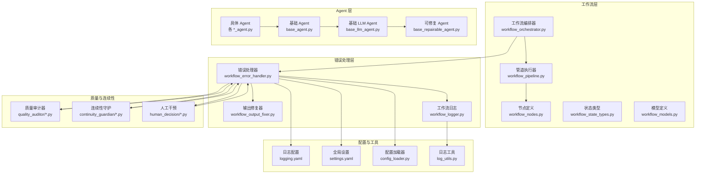
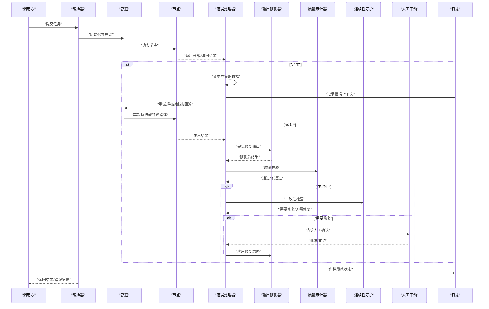
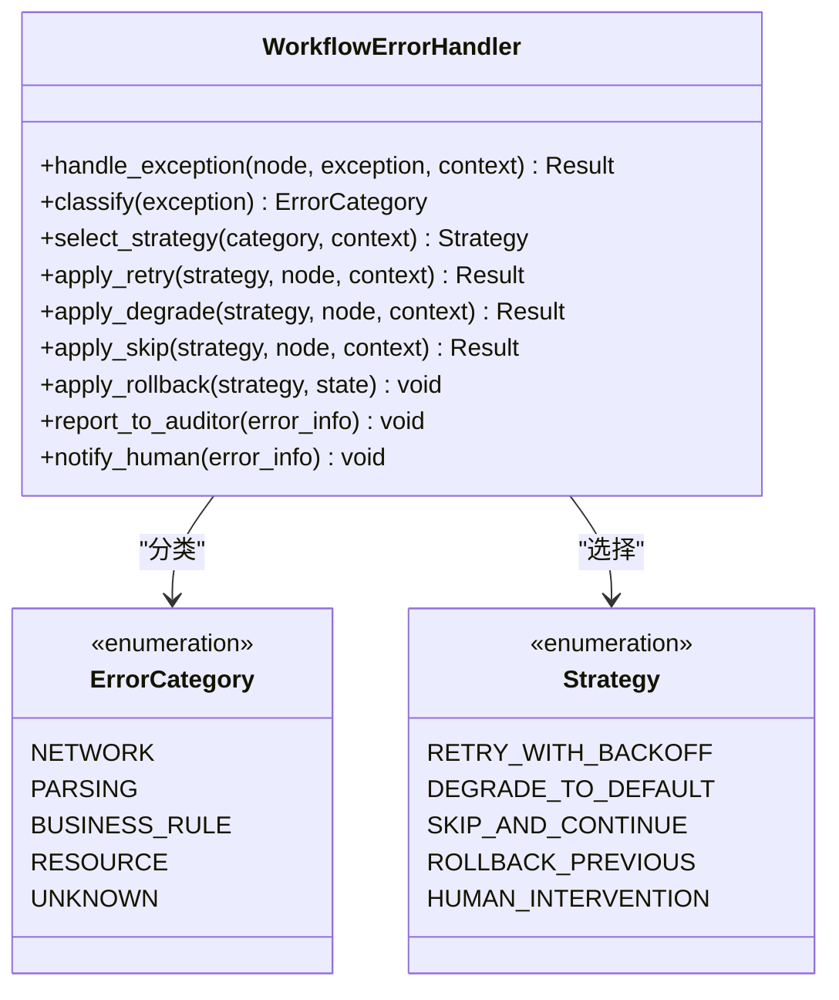
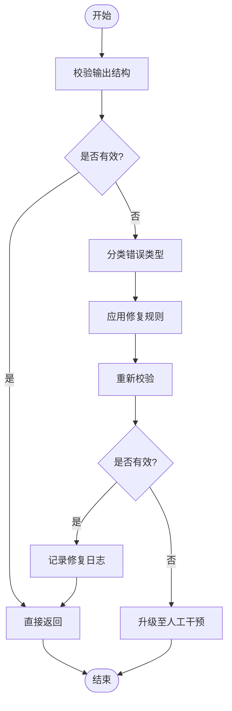
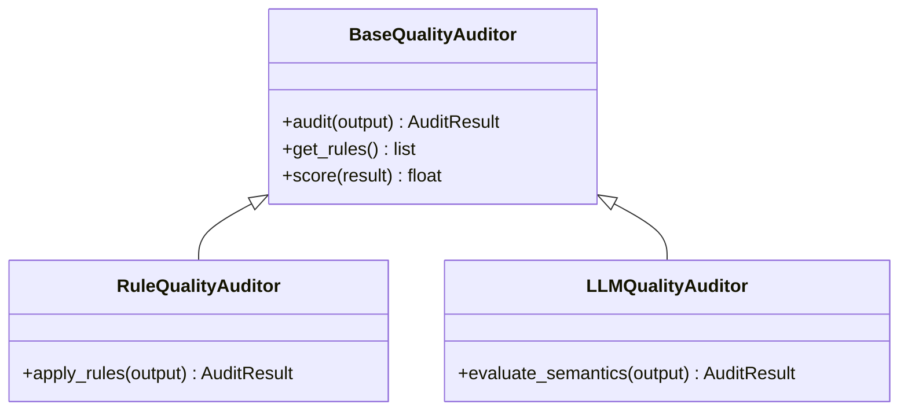
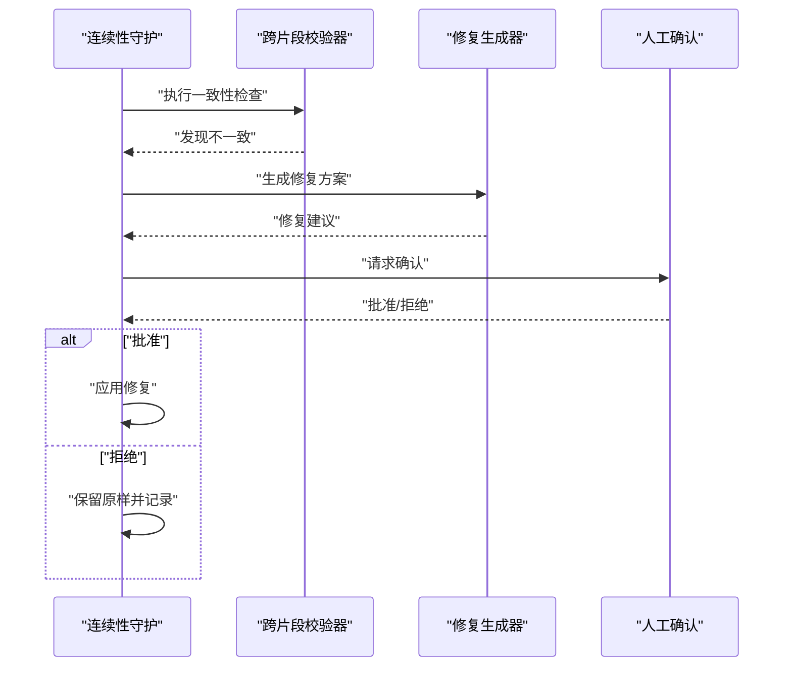
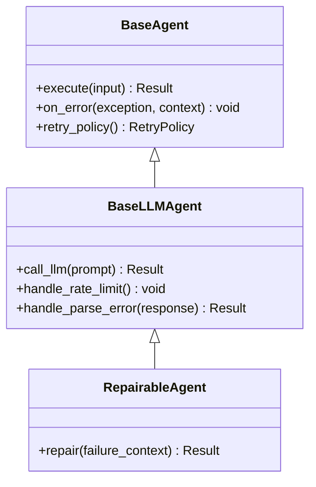
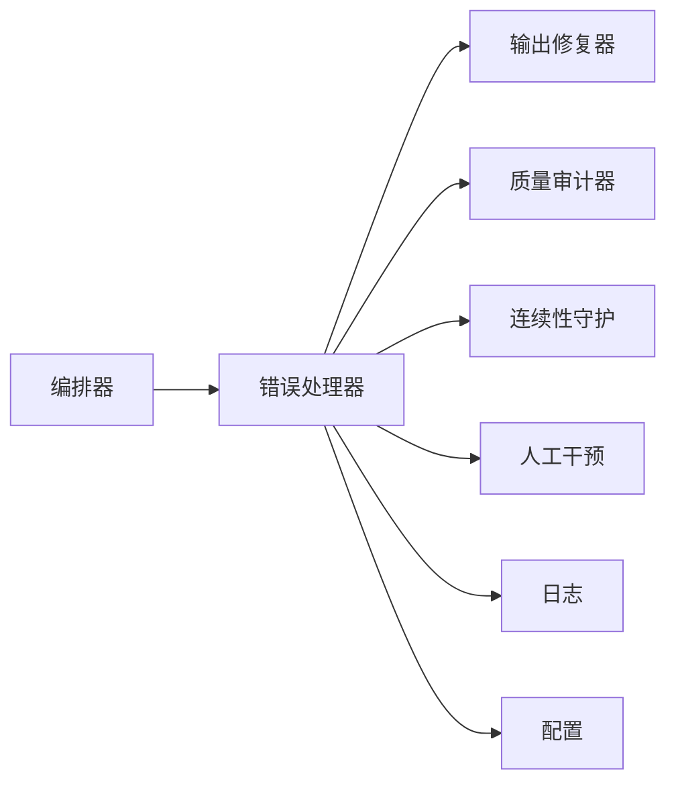

# 错误处理机制

<cite>
**本文引用的文件**   
- [workflow_error_handler.py](file://src/penshot/neopen/agent/workflow/workflow_error_handler.py)
- [workflow_output_fixer.py](file://src/penshot/neopen/agent/workflow/workflow_output_fixer.py)
- [workflow_logger.py](file://src/penshot/neopen/agent/workflow/workflow_logger.py)
- [workflow_orchestrator.py](file://src/penshot/neopen/agent/workflow/workflow_orchestrator.py)
- [workflow_pipeline.py](file://src/penshot/neopen/agent/workflow/workflow_pipeline.py)
- [workflow_state_types.py](file://src/penshot/neopen/agent/workflow/workflow_state_types.py)
- [workflow_models.py](file://src/penshot/neopen/agent/workflow/workflow_models.py)
- [base_agent.py](file://src/penshot/neopen/agent/base_agent.py)
- [base_llm_agent.py](file://src/penshot/neopen/agent/base_llm_agent.py)
- [base_repairable_agent.py](file://src/penshot/neopen/agent/base_repairable_agent.py)
- [prompt_converter_agent.py](file://src/penshot/neopen/agent/prompt_converter_agent.py)
- [quality_auditor_agent.py](file://src/penshot/neopen/agent/quality_auditor_agent.py)
- [script_parser_agent.py](file://src/penshot/neopen/agent/script_parser_agent.py)
- [shot_segmenter_agent.py](file://src/penshot/neopen/agent/shot_segmenter_agent.py)
- [video_splitter_agent.py](file://src/penshot/neopen/agent/video_splitter_agent.py)
- [continuity_guardian_checker.py](file://src/penshot/neopen/agent/continuity_guardian/continuity_guardian_checker.py)
- [continuity_repair_generator.py](file://src/penshot/neopen/agent/continuity_guardian/continuity_repair_generator.py)
- [cross_chunk_validator.py](file://src/penshot/neopen/agent/continuity_guardian/cross_chunk_validator.py)
- [human_decision_intervention.py](file://src/penshot/neopen/agent/human_decision/human_decision_intervention.py)
- [llm_quality_auditor.py](file://src/penshot/neopen/agent/quality_auditor/llm_quality_auditor.py)
- [rule_quality_auditor.py](file://src/penshot/neopen/agent/quality_auditor/rule_quality_auditor.py)
- [base_quality_auditor.py](file://src/penshot/neopen/agent/quality_auditor/base_quality_auditor.py)
- [logging.yaml](file://src/penshot/config/logging.yaml)
- [settings.yaml](file://src/penshot/config/settings.yaml)
- [config_loader.py](file://src/penshot/config/config_loader.py)
- [log_utils.py](file://src/penshot/utils/log_utils.py)
</cite>

## 目录
1. [简介](#简介)
2. [项目结构](#项目结构)
3. [核心组件](#核心组件)
4. [架构总览](#架构总览)
5. [详细组件分析](#详细组件分析)
6. [依赖关系分析](#依赖关系分析)
7. [性能考虑](#性能考虑)
8. [故障排查指南](#故障排查指南)
9. [结论](#结论)
10. [附录](#附录)

## 简介
本文件系统化阐述视频分镜代理项目的错误处理机制，覆盖异常捕获、分类与处理策略；错误恢复与自动修复；输出结果验证与修正算法；日志记录与监控告警配置；常见错误诊断与解决方案；自定义错误处理器开发指南；以及容错设计与故障转移策略。目标是帮助开发者快速定位问题、提升系统鲁棒性并实现可观测性与可维护性。

## 项目结构
错误处理相关能力主要分布在以下模块：
- 工作流编排与节点执行：负责在节点执行过程中捕获异常、触发重试、降级与回滚。
- 错误处理器与输出修复器：提供统一的错误分类、恢复策略与结构化修复流程。
- 审计与连续性守护：对关键质量指标进行校验，失败时触发修复或人工干预。
- 日志与配置：集中式日志配置、分级输出与外部告警集成点。

图表来源
- [workflow_orchestrator.py](file://src/penshot/neopen/agent/workflow/workflow_orchestrator.py)
- [workflow_pipeline.py](file://src/penshot/neopen/agent/workflow/workflow_pipeline.py)
- [workflow_error_handler.py](file://src/penshot/neopen/agent/workflow/workflow_error_handler.py)
- [workflow_output_fixer.py](file://src/penshot/neopen/agent/workflow/workflow_output_fixer.py)
- [workflow_logger.py](file://src/penshot/neopen/agent/workflow/workflow_logger.py)
- [workflow_state_types.py](file://src/penshot/neopen/agent/workflow/workflow_state_types.py)
- [workflow_models.py](file://src/penshot/neopen/agent/workflow/workflow_models.py)
- [base_agent.py](file://src/penshot/neopen/agent/base_agent.py)
- [base_llm_agent.py](file://src/penshot/neopen/agent/base_llm_agent.py)
- [base_repairable_agent.py](file://src/penshot/neopen/agent/base_repairable_agent.py)
- [quality_auditor/*.py](file://src/penshot/neopen/agent/quality_auditor/)
- [continuity_guardian/*.py](file://src/penshot/neopen/agent/continuity_guardian/)
- [human_decision/*.py](file://src/penshot/neopen/agent/human_decision/)
- [logging.yaml](file://src/penshot/config/logging.yaml)
- [settings.yaml](file://src/penshot/config/settings.yaml)
- [config_loader.py](file://src/penshot/config/config_loader.py)
- [log_utils.py](file://src/penshot/utils/log_utils.py)

章节来源
- [workflow_orchestrator.py](file://src/penshot/neopen/agent/workflow/workflow_orchestrator.py)
- [workflow_pipeline.py](file://src/penshot/neopen/agent/workflow/workflow_pipeline.py)
- [workflow_error_handler.py](file://src/penshot/neopen/agent/workflow/workflow_error_handler.py)
- [workflow_output_fixer.py](file://src/penshot/neopen/agent/workflow/workflow_output_fixer.py)
- [workflow_logger.py](file://src/penshot/neopen/agent/workflow/workflow_logger.py)
- [workflow_state_types.py](file://src/penshot/neopen/agent/workflow/workflow_state_types.py)
- [workflow_models.py](file://src/penshot/neopen/agent/workflow/workflow_models.py)
- [logging.yaml](file://src/penshot/config/logging.yaml)
- [settings.yaml](file://src/penshot/config/settings.yaml)
- [config_loader.py](file://src/penshot/config/config_loader.py)
- [log_utils.py](file://src/penshot/utils/log_utils.py)

## 核心组件
- 工作流编排器：负责任务调度、节点生命周期管理、异常边界控制与整体恢复策略。
- 错误处理器：统一捕获异常、分类（网络、解析、业务、资源等）、选择恢复策略（重试、降级、跳过、回滚）。
- 输出修复器：基于规则与启发式算法对结构化输出进行修正，确保下游可用性。
- 质量审计器：对关键输出进行规则与模型双重校验，失败时触发修复或人工介入。
- 连续性守护：跨片段一致性检查与修复生成，保障长脚本场景的连贯性。
- 人工干预：在高风险或不确定场景下引入人类决策，避免自动化误判。
- 日志与配置：集中化日志输出、分级与采样、外部告警通道接入。

章节来源
- [workflow_orchestrator.py](file://src/penshot/neopen/agent/workflow/workflow_orchestrator.py)
- [workflow_error_handler.py](file://src/penshot/neopen/agent/workflow/workflow_error_handler.py)
- [workflow_output_fixer.py](file://src/penshot/neopen/agent/workflow/workflow_output_fixer.py)
- [llm_quality_auditor.py](file://src/penshot/neopen/agent/quality_auditor/llm_quality_auditor.py)
- [rule_quality_auditor.py](file://src/penshot/neopen/agent/quality_auditor/rule_quality_auditor.py)
- [base_quality_auditor.py](file://src/penshot/neopen/agent/quality_auditor/base_quality_auditor.py)
- [continuity_guardian_checker.py](file://src/penshot/neopen/agent/continuity_guardian/continuity_guardian_checker.py)
- [continuity_repair_generator.py](file://src/penshot/neopen/agent/continuity_guardian/continuity_repair_generator.py)
- [cross_chunk_validator.py](file://src/penshot/neopen/agent/continuity_guardian/cross_chunk_validator.py)
- [human_decision_intervention.py](file://src/penshot/neopen/agent/human_decision/human_decision_intervention.py)
- [logging.yaml](file://src/penshot/config/logging.yaml)
- [settings.yaml](file://src/penshot/config/settings.yaml)
- [config_loader.py](file://src/penshot/config/config_loader.py)
- [log_utils.py](file://src/penshot/utils/log_utils.py)

## 架构总览
错误处理贯穿“编排—执行—校验—修复—归档”的全链路。编排器在节点执行前后注入错误处理钩子；错误处理器根据异常类型与上下文决定重试、降级或回滚；输出修复器对结构化数据进行二次修正；质量审计与连续性守护作为后置校验，必要时触发修复或人工干预；所有过程通过日志与配置系统进行可观测与调优。

图表来源
- [workflow_orchestrator.py](file://src/penshot/neopen/agent/workflow/workflow_orchestrator.py)
- [workflow_pipeline.py](file://src/penshot/neopen/agent/workflow/workflow_pipeline.py)
- [workflow_error_handler.py](file://src/penshot/neopen/agent/workflow/workflow_error_handler.py)
- [workflow_output_fixer.py](file://src/penshot/neopen/agent/workflow/workflow_output_fixer.py)
- [llm_quality_auditor.py](file://src/penshot/neopen/agent/quality_auditor/llm_quality_auditor.py)
- [rule_quality_auditor.py](file://src/penshot/neopen/agent/quality_auditor/rule_quality_auditor.py)
- [continuity_guardian_checker.py](file://src/penshot/neopen/agent/continuity_guardian/continuity_guardian_checker.py)
- [continuity_repair_generator.py](file://src/penshot/neopen/agent/continuity_guardian/continuity_repair_generator.py)
- [human_decision_intervention.py](file://src/penshot/neopen/agent/human_decision/human_decision_intervention.py)
- [workflow_logger.py](file://src/penshot/neopen/agent/workflow/workflow_logger.py)

## 详细组件分析

### 错误处理器（WorkflowErrorHandler）
职责与行为
- 异常捕获与分类：区分网络超时、服务不可用、解析失败、业务规则违反、资源不足等类别。
- 恢复策略：按策略选择重试（含退避）、降级（使用默认值或缓存）、跳过（标记为部分成功）、回滚（撤销已变更状态）。
- 上下文增强：附加任务ID、节点名、输入摘要、时间戳、堆栈信息，便于追踪。
- 与审计和修复联动：将错误上报至质量审计器与输出修复器，触发后续修复流程。

图表来源
- [workflow_error_handler.py](file://src/penshot/neopen/agent/workflow/workflow_error_handler.py)

章节来源
- [workflow_error_handler.py](file://src/penshot/neopen/agent/workflow/workflow_error_handler.py)

### 输出修复器（WorkflowOutputFixer）
职责与行为
- 结构化输出校验：检查必填字段、类型约束、范围限制、关联完整性。
- 启发式修正：缺失字段填充默认值、格式标准化、冗余清理、冲突合并。
- 版本兼容：对不同版本的输出结构进行适配与迁移。
- 修复审计：记录每次修复的规则与原因，支持回溯与人工复核。

图表来源
- [workflow_output_fixer.py](file://src/penshot/neopen/agent/workflow/workflow_output_fixer.py)

章节来源
- [workflow_output_fixer.py](file://src/penshot/neopen/agent/workflow/workflow_output_fixer.py)

### 质量审计器（QualityAuditor）
职责与行为
- 规则审计：基于预定义规则集对输出进行静态检查。
- 模型审计：利用 LLM 进行语义与一致性评估。
- 阈值与评分：对质量进行打分，低于阈值触发修复或人工审核。
- 反馈闭环：将审计结果反馈至修复器与编排器，驱动迭代优化。

图表来源
- [base_quality_auditor.py](file://src/penshot/neopen/agent/quality_auditor/base_quality_auditor.py)
- [rule_quality_auditor.py](file://src/penshot/neopen/agent/quality_auditor/rule_quality_auditor.py)
- [llm_quality_auditor.py](file://src/penshot/neopen/agent/quality_auditor/llm_quality_auditor.py)

章节来源
- [base_quality_auditor.py](file://src/penshot/neopen/agent/quality_auditor/base_quality_auditor.py)
- [rule_quality_auditor.py](file://src/penshot/neopen/agent/quality_auditor/rule_quality_auditor.py)
- [llm_quality_auditor.py](file://src/penshot/neopen/agent/quality_auditor/llm_quality_auditor.py)

### 连续性守护（ContinuityGuardian）
职责与行为
- 跨片段一致性检查：对比相邻片段的主题、角色、时间线等要素。
- 修复生成：针对不一致处生成修复建议或补丁。
- 人工确认：对高风险修复请求发起人工审批流程。

图表来源
- [continuity_guardian_checker.py](file://src/penshot/neopen/agent/continuity_guardian/continuity_guardian_checker.py)
- [continuity_repair_generator.py](file://src/penshot/neopen/agent/continuity_guardian/continuity_repair_generator.py)
- [cross_chunk_validator.py](file://src/penshot/neopen/agent/continuity_guardian/cross_chunk_validator.py)
- [human_decision_intervention.py](file://src/penshot/neopen/agent/human_decision/human_decision_intervention.py)

章节来源
- [continuity_guardian_checker.py](file://src/penshot/neopen/agent/continuity_guardian/continuity_guardian_checker.py)
- [continuity_repair_generator.py](file://src/penshot/neopen/agent/continuity_guardian/continuity_repair_generator.py)
- [cross_chunk_validator.py](file://src/penshot/neopen/agent/continuity_guardian/cross_chunk_validator.py)
- [human_decision_intervention.py](file://src/penshot/neopen/agent/human_decision/human_decision_intervention.py)

### 人工干预（HumanDecisionIntervention）
职责与行为
- 风险识别：当错误严重性或不确定性超过阈值时触发。
- 交互协议：提供标准化的确认/拒绝接口与上下文说明。
- 决策记录：保存人类决策与理由，用于后续训练与审计。

章节来源
- [human_decision_intervention.py](file://src/penshot/neopen/agent/human_decision/human_decision_intervention.py)

### Agent 层的错误处理
- 基础 Agent 与 LLM Agent：封装通用异常捕获、重试与降级逻辑，屏蔽底层差异。
- 可修复 Agent：暴露修复接口，允许在特定错误场景下进行自我修复。
- 具体 Agent：在各业务节点中复用上述能力，保证一致的错误处理体验。

图表来源
- [base_agent.py](file://src/penshot/neopen/agent/base_agent.py)
- [base_llm_agent.py](file://src/penshot/neopen/agent/base_llm_agent.py)
- [base_repairable_agent.py](file://src/penshot/neopen/agent/base_repairable_agent.py)

章节来源
- [base_agent.py](file://src/penshot/neopen/agent/base_agent.py)
- [base_llm_agent.py](file://src/penshot/neopen/agent/base_llm_agent.py)
- [base_repairable_agent.py](file://src/penshot/neopen/agent/base_repairable_agent.py)
- [prompt_converter_agent.py](file://src/penshot/neopen/agent/prompt_converter_agent.py)
- [quality_auditor_agent.py](file://src/penshot/neopen/agent/quality_auditor_agent.py)
- [script_parser_agent.py](file://src/penshot/neopen/agent/script_parser_agent.py)
- [shot_segmenter_agent.py](file://src/penshot/neopen/agent/shot_segmenter_agent.py)
- [video_splitter_agent.py](file://src/penshot/neopen/agent/video_splitter_agent.py)

### 日志与配置
- 日志配置：通过 YAML 配置文件定义日志级别、输出目标、轮转策略与采样率。
- 全局设置：包含错误处理开关、重试次数、降级策略、人工干预阈值等。
- 配置加载器：在运行时动态加载配置，支持热更新与环境隔离。
- 日志工具：提供结构化日志、上下文注入与敏感信息脱敏。

章节来源
- [logging.yaml](file://src/penshot/config/logging.yaml)
- [settings.yaml](file://src/penshot/config/settings.yaml)
- [config_loader.py](file://src/penshot/config/config_loader.py)
- [log_utils.py](file://src/penshot/utils/log_utils.py)
- [workflow_logger.py](file://src/penshot/neopen/agent/workflow/workflow_logger.py)

## 依赖关系分析
错误处理组件之间的耦合度较低，主要通过接口与事件进行协作。编排器与错误处理器强耦合，错误处理器与修复器、审计器、守护器松耦合，便于扩展与替换。

图表来源
- [workflow_orchestrator.py](file://src/penshot/neopen/agent/workflow/workflow_orchestrator.py)
- [workflow_error_handler.py](file://src/penshot/neopen/agent/workflow/workflow_error_handler.py)
- [workflow_output_fixer.py](file://src/penshot/neopen/agent/workflow/workflow_output_fixer.py)
- [llm_quality_auditor.py](file://src/penshot/neopen/agent/quality_auditor/llm_quality_auditor.py)
- [rule_quality_auditor.py](file://src/penshot/neopen/agent/quality_auditor/rule_quality_auditor.py)
- [continuity_guardian_checker.py](file://src/penshot/neopen/agent/continuity_guardian/continuity_guardian_checker.py)
- [human_decision_intervention.py](file://src/penshot/neopen/agent/human_decision/human_decision_intervention.py)
- [workflow_logger.py](file://src/penshot/neopen/agent/workflow/workflow_logger.py)
- [config_loader.py](file://src/penshot/config/config_loader.py)

章节来源
- [workflow_orchestrator.py](file://src/penshot/neopen/agent/workflow/workflow_orchestrator.py)
- [workflow_error_handler.py](file://src/penshot/neopen/agent/workflow/workflow_error_handler.py)
- [workflow_output_fixer.py](file://src/penshot/neopen/agent/workflow/workflow_output_fixer.py)
- [llm_quality_auditor.py](file://src/penshot/neopen/agent/quality_auditor/llm_quality_auditor.py)
- [rule_quality_auditor.py](file://src/penshot/neopen/agent/quality_auditor/rule_quality_auditor.py)
- [continuity_guardian_checker.py](file://src/penshot/neopen/agent/continuity_guardian/continuity_guardian_checker.py)
- [human_decision_intervention.py](file://src/penshot/neopen/agent/human_decision/human_decision_intervention.py)
- [workflow_logger.py](file://src/penshot/neopen/agent/workflow/workflow_logger.py)
- [config_loader.py](file://src/penshot/config/config_loader.py)

## 性能考虑
- 重试退避：采用指数退避与抖动，避免雪崩效应。
- 降级优先：在网络或服务不稳定时优先降级，保障核心链路可用。
- 异步修复：非关键修复任务异步执行，减少主流程阻塞。
- 日志采样：在高吞吐场景下启用日志采样，降低 I/O 压力。
- 缓存命中：对重复错误的修复策略进行缓存，提高响应速度。

[本节为通用指导，不涉及具体文件分析]

## 故障排查指南
常见问题与解决思路
- 网络超时与服务不可用：检查重试次数与退避策略，确认服务健康与负载均衡配置。
- JSON 解析失败：启用输出修复器的结构化校验与修复规则，查看修复日志定位字段缺失或格式错误。
- 质量审计不通过：调整规则阈值或提示词模板，结合人工干预进行样本标注与回归测试。
- 连续性不一致：审查跨片段校验规则与修复生成策略，必要时引入更多上下文信息。
- 日志缺失或噪声过多：核对日志配置与采样率，增加必要上下文字段，过滤敏感信息。

章节来源
- [workflow_error_handler.py](file://src/penshot/neopen/agent/workflow/workflow_error_handler.py)
- [workflow_output_fixer.py](file://src/penshot/neopen/agent/workflow/workflow_output_fixer.py)
- [llm_quality_auditor.py](file://src/penshot/neopen/agent/quality_auditor/llm_quality_auditor.py)
- [rule_quality_auditor.py](file://src/penshot/neopen/agent/quality_auditor/rule_quality_auditor.py)
- [continuity_guardian_checker.py](file://src/penshot/neopen/agent/continuity_guardian/continuity_guardian_checker.py)
- [workflow_logger.py](file://src/penshot/neopen/agent/workflow/workflow_logger.py)
- [logging.yaml](file://src/penshot/config/logging.yaml)
- [settings.yaml](file://src/penshot/config/settings.yaml)

## 结论
该错误处理机制以编排器为中心，围绕错误处理器、输出修复器、质量审计与连续性守护构建起完整的容错体系。通过分层策略、可观测性与人工干预的结合，系统在复杂与不稳定环境下仍能保持高可用与高质量输出。建议在生产环境中持续优化规则与提示词，完善监控告警与演练机制，进一步提升系统的韧性与可维护性。

[本节为总结性内容，不涉及具体文件分析]

## 附录

### 自定义错误处理器开发指南
步骤
- 继承错误处理器基类或实现统一接口，定义新的异常分类与策略。
- 注册到编排器或管道，使其在节点执行时生效。
- 编写单元测试，覆盖典型异常与边界条件。
- 集成日志与审计，确保可观测性与可追溯性。

参考路径
- [workflow_error_handler.py](file://src/penshot/neopen/agent/workflow/workflow_error_handler.py)
- [workflow_orchestrator.py](file://src/penshot/neopen/agent/workflow/workflow_orchestrator.py)
- [workflow_pipeline.py](file://src/penshot/neopen/agent/workflow/workflow_pipeline.py)

### 监控告警配置方法
- 在日志配置中启用告警通道（如 Webhook、邮件、IM），设置告警级别与阈值。
- 在全局设置中开启错误统计与指标上报，配合监控系统进行可视化展示。
- 对关键错误类型配置独立告警规则，避免告警风暴。

参考路径
- [logging.yaml](file://src/penshot/config/logging.yaml)
- [settings.yaml](file://src/penshot/config/settings.yaml)
- [config_loader.py](file://src/penshot/config/config_loader.py)
- [log_utils.py](file://src/penshot/utils/log_utils.py)

### 容错设计与故障转移策略
- 多实现切换：在 LLM 客户端与解析器层面提供多实现，失败时自动切换到备用实现。
- 熔断与限流：对不稳定服务实施熔断与限流，保护系统整体稳定性。
- 数据一致性：在回滚与修复过程中保证事务性与幂等性，避免数据损坏。

参考路径
- [base_llm_agent.py](file://src/penshot/neopen/agent/base_llm_agent.py)
- [workflow_error_handler.py](file://src/penshot/neopen/agent/workflow/workflow_error_handler.py)
- [workflow_output_fixer.py](file://src/penshot/neopen/agent/workflow/workflow_output_fixer.py)