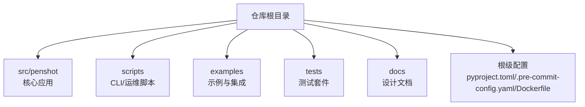
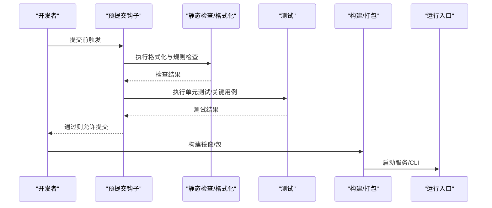
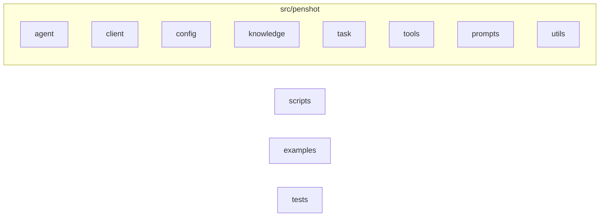
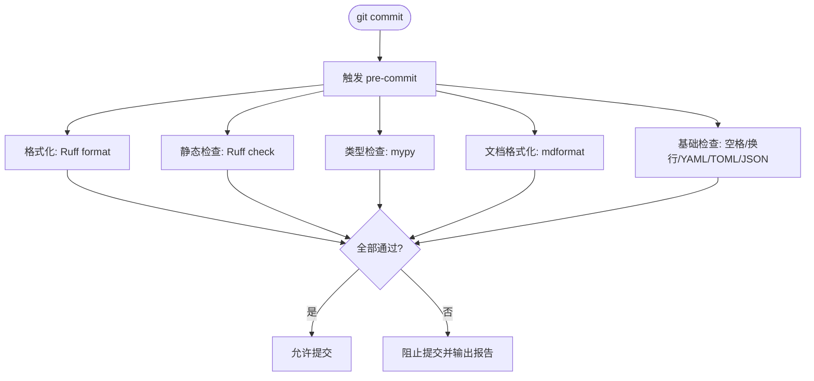
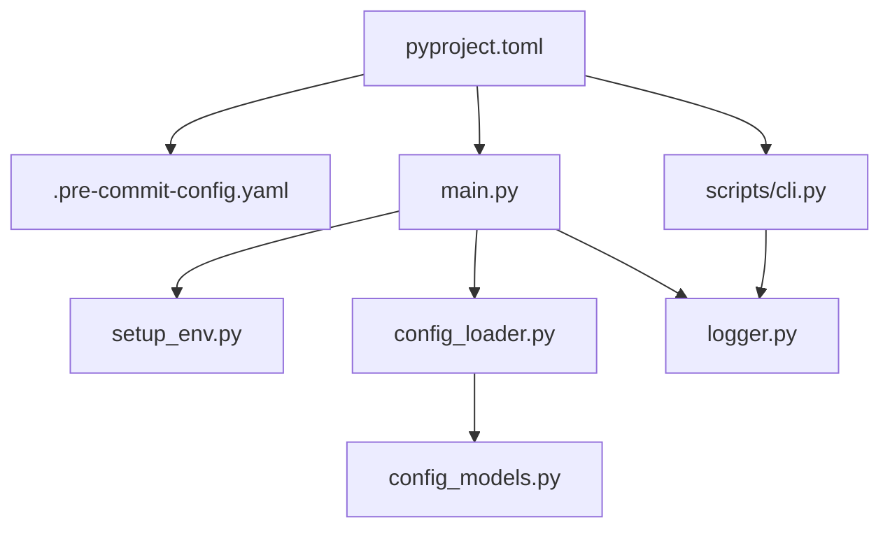

# 代码规范

<cite>
**本文引用的文件**   
- [pyproject.toml](file://pyproject.toml)
- [.pre-commit-config.yaml](file://.pre-commit-config.yaml)
- [.flake8](file://.flake8)
- [.claude/rules/10-python-quality.md](file://.claude/rules/10-python-quality.md)
- [CONTRIBUTING.md](file://CONTRIBUTING.md)
- [README_zh.md](file://README_zh.md)
- [src/penshot/app/setup_env.py](file://src/penshot/app/setup_env.py)
- [src/penshot/config/config_loader.py](file://src/penshot/config/config_loader.py)
- [src/penshot/config/config_models.py](file://src/penshot/config/config_models.py)
- [src/penshot/utils/log_utils.py](file://src/penshot/utils/log_utils.py)
- [src/penshot/logger.py](file://src/penshot/logger.py)
- [scripts/cli.py](file://scripts/cli.py)
- [main.py](file://main.py)
</cite>

## 更新摘要
**所做更改**
- 新增详细的 Python 代码质量标准章节，涵盖 flake8 配置、基于 Ruff 的 linting 系统
- 添加全面的 Python 质量指南，包括编码约定、测试标准和验证程序
- 更新了预提交钩子配置说明，反映当前使用的工具链
- 增强了代码质量检查流程的详细说明

## 目录
1. [简介](#简介)
2. [项目结构](#项目结构)
3. [核心组件](#核心组件)
4. [架构总览](#架构总览)
5. [详细组件分析](#详细组件分析)
6. [依赖分析](#依赖分析)
7. [性能考虑](#性能考虑)
8. [故障排查指南](#故障排查指南)
9. [结论](#结论)
10. [附录](#附录)

## 简介
本规范面向 Video Shot Agent 项目的 Python 开发与协作，目标是在团队内统一编码风格、构建与发布流程、Git 工作流与质量门禁。文档覆盖：
- Python 代码风格标准（命名约定、文件结构、注释规范）
- Git 工作流与分支管理策略（提交信息格式、代码审查流程）
- 预提交钩子配置与自动化检查工具使用
- 代码质量标准与最佳实践
- 实际示例与反例对比（以路径引用代替具体代码片段）

## 项目结构
仓库采用"功能域 + 分层"的混合组织方式：
- src/penshot：核心应用源码，按领域模块划分（agent、client、config、knowledge、task、tools、prompts、utils 等）
- scripts：CLI 与运维脚本
- examples：示例与集成演示
- tests：单元、集成与端到端测试
- docs：架构与设计文档
- 根级配置文件：pyproject.toml、.pre-commit-config.yaml、Dockerfile 等



[本节为概念性说明，无需来源]

## 核心组件
本节聚焦与代码规范直接相关的工程化组件：
- 构建与依赖声明：pyproject.toml
- 预提交钩子：.pre-commit-config.yaml
- 环境初始化与配置加载：setup_env.py、config_loader.py、config_models.py
- 日志与可观测性：logger.py、log_utils.py
- CLI 入口：scripts/cli.py、main.py

这些组件共同支撑了统一的开发体验与质量门禁。

**章节来源**
- [pyproject.toml](file://pyproject.toml)
- [.pre-commit-config.yaml](file://.pre-commit-config.yaml)
- [src/penshot/app/setup_env.py](file://src/penshot/app/setup_env.py)
- [src/penshot/config/config_loader.py](file://src/penshot/config/config_loader.py)
- [src/penshot/config/config_models.py](file://src/penshot/config/config_models.py)
- [src/penshot/utils/log_utils.py](file://src/penshot/utils/log_utils.py)
- [src/penshot/logger.py](file://src/penshot/logger.py)
- [scripts/cli.py](file://scripts/cli.py)
- [main.py](file://main.py)

## 架构总览
下图展示了从开发者本地到 CI 的关键质量门禁与运行入口的关系。



**图示来源**
- [.pre-commit-config.yaml](file://.pre-commit-config.yaml)
- [pyproject.toml](file://pyproject.toml)
- [scripts/cli.py](file://scripts/cli.py)
- [main.py](file://main.py)

## 详细组件分析

### Python 代码风格与命名约定
- 语言与版本
  - 建议锁定 Python 版本并在 pyproject.toml 中显式声明，避免环境差异导致的兼容性问题。
- 包与模块
  - 包名小写、下划线分隔；模块名小写、下划线分隔；类名大驼峰；函数/变量小写、下划线分隔；常量全大写、下划线分隔。
  - 每个包提供 __init__.py 作为稳定导出边界，避免隐式导入。
- 类型注解
  - 优先使用 typing 模块与 Pydantic 模型进行数据契约描述，减少运行时错误。
- 异常与错误码
  - 自定义异常继承自标准异常或业务基类，携带结构化上下文；对外接口返回明确的状态码与消息。
- 日志
  - 使用结构化日志，包含请求/任务标识、阶段、耗时与关键指标；避免在日志中输出敏感信息。
- 配置
  - 配置项集中定义与校验，区分环境与默认值；禁止硬编码。
- 注释与文档
  - 模块/类/函数需提供 docstring，说明职责、参数、返回值与副作用；复杂逻辑补充行内注释解释"为什么"。

**章节来源**
- [pyproject.toml](file://pyproject.toml)
- [src/penshot/config/config_models.py](file://src/penshot/config/config_models.py)
- [src/penshot/utils/log_utils.py](file://src/penshot/utils/log_utils.py)
- [src/penshot/logger.py](file://src/penshot/logger.py)

### 文件结构与组织原则
- 源码位于 src/penshot，按领域与层次拆分：
  - agent：智能体实现与编排
  - client：外部客户端封装
  - config：配置加载与模型
  - knowledge：知识管理与检索
  - task：任务生命周期与调度
  - tools：工具函数与外部能力封装
  - prompts：提示词模板与管理
  - utils：通用工具
- 测试与示例分离：
  - tests：按功能域组织测试
  - examples：独立可运行的示例
- 脚本与入口：
  - scripts：CLI 与运维脚本
  - main.py：应用主入口



**章节来源**
- [src/penshot/app/setup_env.py](file://src/penshot/app/setup_env.py)
- [src/penshot/config/config_loader.py](file://src/penshot/config/config_loader.py)
- [src/penshot/config/config_models.py](file://src/penshot/config/config_models.py)
- [src/penshot/utils/log_utils.py](file://src/penshot/utils/log_utils.py)
- [src/penshot/logger.py](file://src/penshot/logger.py)
- [scripts/cli.py](file://scripts/cli.py)
- [main.py](file://main.py)

### 注释规范
- 模块级 docstring：说明模块目的、依赖与使用方式
- 类/方法 docstring：职责、参数、返回值、异常、副作用
- 复杂算法/业务逻辑：补充"为什么"而非"是什么"
- 配置项：在模型或 YAML 旁提供可读性说明

**章节来源**
- [src/penshot/config/config_models.py](file://src/penshot/config/config_models.py)
- [src/penshot/config/config_loader.py](file://src/penshot/config/config_loader.py)

### Git 工作流与分支管理
- 分支模型
  - main：受保护的生产分支，仅接受合并
  - develop：集成分支，日常开发合并目标
  - feature/*：新功能分支
  - fix/*：缺陷修复分支
  - release/*：发布准备分支
  - hotfix/*：紧急修复分支
- 提交信息格式
  - 采用 Conventional Commits：<type>(<scope>): <subject>
  - type 包括 feat、fix、docs、style、refactor、perf、test、build、ci、chore、revert
  - subject 简洁明了，动词开头，不超过 72 字符
- 代码审查流程
  - 所有变更需通过 Pull Request 合并
  - 至少一名 reviewer 批准
  - 必须通过预提交与 CI 检查
- 标签与版本
  - 使用语义化版本号 vMAJOR.MINOR.PATCH
  - 发布分支打 tag 并生成变更日志

**章节来源**
- [CONTRIBUTING.md](file://CONTRIBUTING.md)
- [README_zh.md](file://README_zh.md)

### 预提交钩子与自动化检查
- 预提交钩子
  - 使用 pre-commit 框架，在 git commit 前自动执行格式化与检查
  - 当前配置使用 Ruff 进行代码检查和格式化，替代传统的 black/isort/flake8
- 检查项建议
  - 代码风格与一致性：Ruff（检查和格式化）
  - 类型检查：mypy
  - Markdown 格式化：mdformat
  - 基础文件检查：trailing-whitespace、end-of-file-fixer、check-yaml、check-toml、check-json
  - 安全扫描：detect-private-key
- 配置位置
  - .pre-commit-config.yaml 定义 hooks 与全局设置
  - pyproject.toml 声明依赖与工具配置



**图示来源**
- [.pre-commit-config.yaml](file://.pre-commit-config.yaml)
- [pyproject.toml](file://pyproject.toml)

**章节来源**
- [.pre-commit-config.yaml](file://.pre-commit-config.yaml)
- [pyproject.toml](file://pyproject.toml)

### Python 代码质量标准与最佳实践

#### 版本与工具配置
- Python 版本要求：Python 3.10+（在 pyproject.toml 中声明）
- 代码检查工具：Ruff（替代 flake8/black/isort）
- 类型检查：mypy
- 文档格式化：mdformat
- 测试框架：pytest（支持异步模式）

#### 编码约定
- 优先复用现有模块、类型、异常和依赖注入方式
- 保持异步路径非阻塞；不得在事件循环中直接执行已知的阻塞操作
- 公共函数和新增模块遵循中文注释与文档字符串约定，并补充必要的类型标注
- 异常应保留原始上下文；不要用宽泛捕获掩盖可定位的错误
- 不为不存在的边界场景增加无依据的 fallback、兼容层或抽象

#### 代码质量检查配置
- **Ruff 配置**：在 .pre-commit-config.yaml 中配置 ruff 和 ruff-format
- **Mypy 配置**：在 pyproject.toml 中配置严格的类型检查规则
- **Flake8 配置**：在 .flake8 中定义排除规则和最大行长度
- **测试配置**：在 pyproject.toml 中配置 pytest 选项和异步模式

#### 测试标准
- 测试框架和 asyncio 行为以 pyproject.toml 为准
- 先运行受影响范围的测试
- 不因项目配置已启用自动异步模式而强制新增无必要的 asyncio 标记
- 外部 LLM、Redis、Chroma 或其他服务需要相应环境；未配置时明确标记为未验证
- 不擅自增加覆盖率阈值，不把未执行的测试写成通过

#### 验证程序
推荐的验证顺序：
```bash
pytest <受影响的测试路径>
ruff check <受影响的路径>
ruff format --check <受影响的路径>
mypy src/
pre-commit run --all-files
```

根据改动范围选择命令，不要求每次默认执行全部慢速或外部依赖测试。

**章节来源**
- [.claude/rules/10-python-quality.md](file://.claude/rules/10-python-quality.md)
- [pyproject.toml](file://pyproject.toml)
- [.pre-commit-config.yaml](file://.pre-commit-config.yaml)
- [.flake8](file://.flake8)

### 示例与反例对比（以路径引用代替代码）
- 命名约定
  - 正例：模块与函数使用小写下划线，类使用大驼峰
    - 参考：[src/penshot/config/config_models.py](file://src/penshot/config/config_models.py)
  - 反例：混用大小写与驼峰
    - 参考：[src/penshot/utils/log_utils.py](file://src/penshot/utils/log_utils.py)
- 类型注解
  - 正例：函数签名与数据结构使用类型注解
    - 参考：[src/penshot/config/config_models.py](file://src/penshot/config/config_models.py)
  - 反例：缺失类型注解导致调用方推断困难
    - 参考：[src/penshot/utils/log_utils.py](file://src/penshot/utils/log_utils.py)
- 配置加载
  - 正例：集中加载与校验，区分环境
    - 参考：[src/penshot/config/config_loader.py](file://src/penshot/config/config_loader.py)
  - 反例：多处分散读取环境变量且未校验
    - 参考：[src/penshot/app/setup_env.py](file://src/penshot/app/setup_env.py)
- 日志记录
  - 正例：结构化字段、级别合理、避免敏感信息
    - 参考：[src/penshot/logger.py](file://src/penshot/logger.py)
  - 反例：打印大量调试信息到 stdout
    - 参考：[src/penshot/utils/log_utils.py](file://src/penshot/utils/log_utils.py)
- CLI 入口
  - 正例：参数解析清晰、错误处理完善
    - 参考：[scripts/cli.py](file://scripts/cli.py)
  - 反例：硬编码路径与魔法数字
    - 参考：[main.py](file://main.py)

**章节来源**
- [src/penshot/config/config_models.py](file://src/penshot/config/config_models.py)
- [src/penshot/config/config_loader.py](file://src/penshot/config/config_loader.py)
- [src/penshot/app/setup_env.py](file://src/penshot/app/setup_env.py)
- [src/penshot/logger.py](file://src/penshot/logger.py)
- [src/penshot/utils/log_utils.py](file://src/penshot/utils/log_utils.py)
- [scripts/cli.py](file://scripts/cli.py)
- [main.py](file://main.py)

## 依赖分析
- 构建与工具
  - pyproject.toml 声明项目元数据、依赖与工具配置
  - .pre-commit-config.yaml 定义本地质量门禁
- 运行入口
  - main.py 与 scripts/cli.py 提供不同运行模式
- 配置与环境
  - setup_env.py 负责环境初始化
  - config_loader.py 与 config_models.py 负责配置加载与校验



**图示来源**
- [pyproject.toml](file://pyproject.toml)
- [.pre-commit-config.yaml](file://.pre-commit-config.yaml)
- [main.py](file://main.py)
- [scripts/cli.py](file://scripts/cli.py)
- [src/penshot/app/setup_env.py](file://src/penshot/app/setup_env.py)
- [src/penshot/config/config_loader.py](file://src/penshot/config/config_loader.py)
- [src/penshot/config/config_models.py](file://src/penshot/config/config_models.py)
- [src/penshot/logger.py](file://src/penshot/logger.py)

**章节来源**
- [pyproject.toml](file://pyproject.toml)
- [.pre-commit-config.yaml](file://.pre-commit-config.yaml)
- [main.py](file://main.py)
- [scripts/cli.py](file://scripts/cli.py)
- [src/penshot/app/setup_env.py](file://src/penshot/app/setup_env.py)
- [src/penshot/config/config_loader.py](file://src/penshot/config/config_loader.py)
- [src/penshot/config/config_models.py](file://src/penshot/config/config_models.py)
- [src/penshot/logger.py](file://src/penshot/logger.py)

## 性能考虑
- 配置加载缓存：避免重复解析与 IO，首次加载后缓存结果
- 日志开销：生产环境降低日志级别，异步写入，避免阻塞主流程
- 依赖体积：按需引入，减少冷启动时间
- 资源隔离：容器化部署，限制 CPU/内存配额

[本节为通用指导，无需来源]

## 故障排查指南
- 预提交失败
  - 查看 pre-commit 输出定位失败的 hook
  - 手动运行对应工具定位问题
- 配置加载异常
  - 检查环境变量与配置文件路径
  - 确认 Pydantic 模型校验失败的具体字段
- 日志无输出或格式异常
  - 检查 logger 初始化与 log level
  - 确认日志文件权限与路径
- CLI 参数错误
  - 核对命令行参数与默认值
  - 查看错误堆栈与上下文日志
- 代码质量检查失败
  - 运行 ruff check 查看详细错误信息
  - 使用 ruff format 自动修复格式问题
  - 检查 mypy 类型错误并进行修复

**章节来源**
- [.pre-commit-config.yaml](file://.pre-commit-config.yaml)
- [src/penshot/config/config_loader.py](file://src/penshot/config/config_loader.py)
- [src/penshot/config/config_models.py](file://src/penshot/config/config_models.py)
- [src/penshot/logger.py](file://src/penshot/logger.py)
- [scripts/cli.py](file://scripts/cli.py)

## 结论
通过统一的代码风格、严格的预提交门禁、清晰的 Git 工作流与完善的配置/日志体系，Video Shot Agent 项目在可维护性与交付质量上具备坚实基础。本项目采用现代化的 Ruff 工具链替代传统工具，提供更高效的代码检查和格式化能力。建议在后续迭代中持续完善类型检查覆盖率、测试覆盖率与文档同步，进一步提升团队协作效率与系统稳定性。

[本节为总结性内容，无需来源]

## 附录
- 常用命令
  - 安装预提交钩子：参见 .pre-commit-config.yaml 与 README
  - 运行格式化与检查：参见 pyproject.toml 中的工具配置
  - 运行测试：参见测试目录结构与 conftest
  - 代码质量检查：ruff check, ruff format, mypy
- 参考文档
  - 贡献指南：CONTRIBUTING.md
  - 中文说明：README_zh.md
  - Python 质量规则：.claude/rules/10-python-quality.md

**章节来源**
- [CONTRIBUTING.md](file://CONTRIBUTING.md)
- [README_zh.md](file://README_zh.md)
- [.pre-commit-config.yaml](file://.pre-commit-config.yaml)
- [pyproject.toml](file://pyproject.toml)
- [.claude/rules/10-python-quality.md](file://.claude/rules/10-python-quality.md)