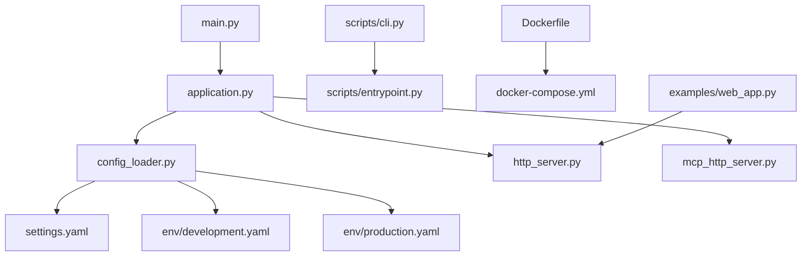
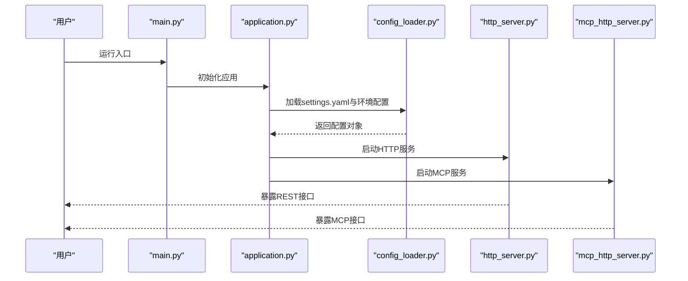
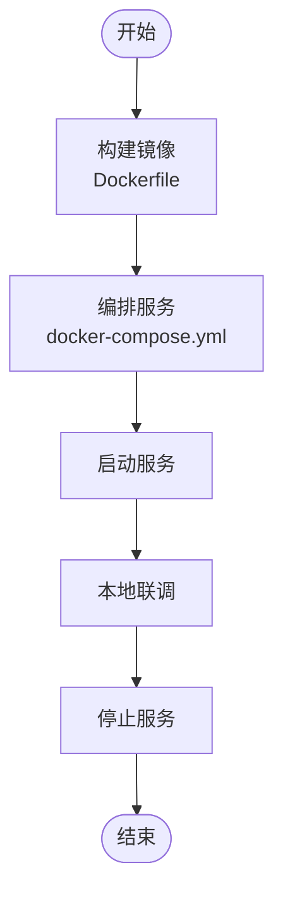
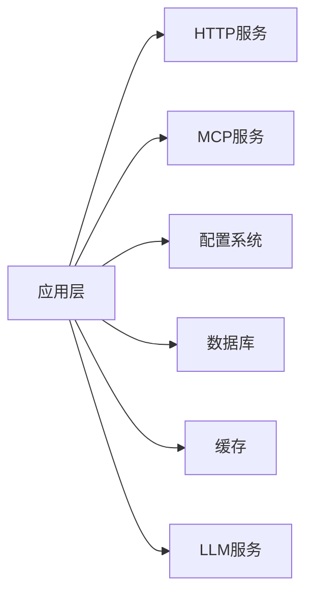

# 开发工作流程

<cite>
**本文引用的文件**   
- [README.md](file://README.md)
- [README_zh.md](file://README_zh.md)
- [CONTRIBUTING.md](file://CONTRIBUTING.md)
- [pyproject.toml](file://pyproject.toml)
- [Dockerfile](file://Dockerfile)
- [docker-compose.yml](file://docker-compose.yml)
- [.dockerignore](file://.dockerignore)
- [main.py](file://main.py)
- [src/penshot/app/application.py](file://src/penshot/app/application.py)
- [src/penshot/config/config_loader.py](file://src/penshot/config/config_loader.py)
- [src/penshot/config/settings.yaml](file://src/penshot/config/settings.yaml)
- [src/penshot/config/env/development.yaml](file://src/penshot/config/env/development.yaml)
- [src/penshot/config/env/production.yaml](file://src/penshot/config/env/production.yaml)
- [scripts/cli.py](file://scripts/cli.py)
- [scripts/entrypoint.py](file://scripts/entrypoint.py)
- [scripts/cleanup.py](file://scripts/cleanup.py)
- [scripts/download_reranker.py](file://scripts/download_reranker.py)
- [src/penshot/http_server.py](file://src/penshot/http_server.py)
- [src/penshot/mcp_http_server.py](file://src/penshot/mcp_http_server.py)
- [examples/web_app.py](file://examples/web_app.py)
</cite>

## 目录
1. [简介](#简介)
2. [项目结构](#项目结构)
3. [核心组件](#核心组件)
4. [架构总览](#架构总览)
5. [详细组件分析](#详细组件分析)
6. [依赖分析](#依赖分析)
7. [性能考虑](#性能考虑)
8. [故障排查指南](#故障排查指南)
9. [结论](#结论)
10. [附录](#附录)

## 简介
本指南面向Video Shot Agent的本地与容器化开发，覆盖环境搭建、配置管理、服务启动、热重载、数据库迁移与数据初始化、常用命令脚本，以及开源贡献流程。目标是帮助开发者快速上手并高效迭代。

## 项目结构
仓库采用分层组织：应用入口、配置中心、HTTP/MCP服务、任务与工作流、提示词与知识库、工具集、示例与测试等。关键路径如下：
- 应用入口与生命周期：main.py、application.py
- 配置加载与环境：config_loader.py、settings.yaml、env/*.yaml
- HTTP与MCP服务：http_server.py、mcp_http_server.py
- CLI与运维脚本：scripts/*
- Docker镜像与编排：Dockerfile、docker-compose.yml、.dockerignore
- 示例与演示：examples/*

图表来源
- [main.py:1-200](file://main.py#L1-L200)
- [src/penshot/app/application.py:1-200](file://src/penshot/app/application.py#L1-L200)
- [src/penshot/config/config_loader.py:1-200](file://src/penshot/config/config_loader.py#L1-L200)
- [src/penshot/config/settings.yaml:1-200](file://src/penshot/config/settings.yaml#L1-L200)
- [src/penshot/config/env/development.yaml:1-200](file://src/penshot/config/env/development.yaml#L1-L200)
- [src/penshot/config/env/production.yaml:1-200](file://src/penshot/config/env/production.yaml#L1-L200)
- [src/penshot/http_server.py:1-200](file://src/penshot/http_server.py#L1-L200)
- [src/penshot/mcp_http_server.py:1-200](file://src/penshot/mcp_http_server.py#L1-L200)
- [scripts/cli.py:1-200](file://scripts/cli.py#L1-L200)
- [scripts/entrypoint.py:1-200](file://scripts/entrypoint.py#L1-L200)
- [Dockerfile:1-200](file://Dockerfile#L1-L200)
- [docker-compose.yml:1-200](file://docker-compose.yml#L1-L200)
- [examples/web_app.py:1-200](file://examples/web_app.py#L1-L200)

章节来源
- [README.md:1-200](file://README.md#L1-L200)
- [README_zh.md:1-200](file://README_zh.md#L1-L200)
- [pyproject.toml:1-200](file://pyproject.toml#L1-L200)

## 核心组件
- 应用装配器：负责加载配置、初始化日志、注册服务与中间件、启动HTTP/MCP服务器。
- 配置系统：集中式YAML配置+环境变量注入，支持多环境（开发/生产）。
- HTTP服务：提供REST接口，供外部调用或前端集成。
- MCP服务：提供模型上下文协议接口，便于AI生态集成。
- CLI与脚本：提供一键启动、清理、下载资源等运维能力。
- Docker与编排：构建镜像、编排多服务（如数据库、缓存）以便本地联调。

章节来源
- [src/penshot/app/application.py:1-200](file://src/penshot/app/application.py#L1-L200)
- [src/penshot/config/config_loader.py:1-200](file://src/penshot/config/config_loader.py#L1-L200)
- [src/penshot/http_server.py:1-200](file://src/penshot/http_server.py#L1-L200)
- [src/penshot/mcp_http_server.py:1-200](file://src/penshot/mcp_http_server.py#L1-L200)
- [scripts/cli.py:1-200](file://scripts/cli.py#L1-L200)
- [scripts/entrypoint.py:1-200](file://scripts/entrypoint.py#L1-L200)

## 架构总览
下图展示从入口到服务的关键调用关系与配置加载顺序。

图表来源
- [main.py:1-200](file://main.py#L1-L200)
- [src/penshot/app/application.py:1-200](file://src/penshot/app/application.py#L1-L200)
- [src/penshot/config/config_loader.py:1-200](file://src/penshot/config/config_loader.py#L1-L200)
- [src/penshot/http_server.py:1-200](file://src/penshot/http_server.py#L1-L200)
- [src/penshot/mcp_http_server.py:1-200](file://src/penshot/mcp_http_server.py#L1-L200)

## 详细组件分析

### 本地开发环境搭建
- Python版本与包管理
  - 使用pyproject.toml声明依赖与可执行脚本。
  - 推荐使用虚拟环境隔离依赖。
- 安装依赖
  - 通过包管理器安装所有依赖与开发依赖。
- 配置文件设置
  - 基础配置位于settings.yaml；按环境选择development.yaml或production.yaml。
  - 可通过环境变量覆盖敏感项（如API密钥、数据库连接）。
- 启动方式
  - 直接运行入口main.py。
  - 或通过CLI脚本统一入口scripts/cli.py。
- 热重载
  - 在开发模式下启用自动重载（例如基于环境变量或配置开关），修改代码后无需手动重启。

章节来源
- [pyproject.toml:1-200](file://pyproject.toml#L1-L200)
- [src/penshot/config/settings.yaml:1-200](file://src/penshot/config/settings.yaml#L1-L200)
- [src/penshot/config/env/development.yaml:1-200](file://src/penshot/config/env/development.yaml#L1-L200)
- [src/penshot/config/env/production.yaml:1-200](file://src/penshot/config/env/production.yaml#L1-L200)
- [main.py:1-200](file://main.py#L1-L200)
- [scripts/cli.py:1-200](file://scripts/cli.py#L1-L200)

### 开发服务器与热重载
- 开发服务器
  - HTTP服务监听端口与路由由配置决定，默认可在本地访问。
  - MCP服务用于AI生态集成，按需开启。
- 热重载配置
  - 建议在开发环境开启自动重载，提升调试效率。
  - 结合IDE断点与日志输出进行问题定位。

章节来源
- [src/penshot/http_server.py:1-200](file://src/penshot/http_server.py#L1-L200)
- [src/penshot/mcp_http_server.py:1-200](file://src/penshot/mcp_http_server.py#L1-L200)
- [src/penshot/config/config_loader.py:1-200](file://src/penshot/config/config_loader.py#L1-L200)

### Docker开发环境
- 镜像构建
  - 使用Dockerfile定义构建步骤，包含依赖安装、工作目录与入口。
- 服务编排
  - docker-compose.yml编排主服务及依赖（如数据库、缓存），支持一键拉起。
- 忽略规则
  - .dockerignore排除不必要的文件，减小镜像体积。
- 常用操作
  - 构建镜像、启动/停止服务、查看日志、进入容器调试。

图表来源
- [Dockerfile:1-200](file://Dockerfile#L1-L200)
- [docker-compose.yml:1-200](file://docker-compose.yml#L1-L200)
- [.dockerignore:1-200](file://.dockerignore#L1-L200)

章节来源
- [Dockerfile:1-200](file://Dockerfile#L1-L200)
- [docker-compose.yml:1-200](file://docker-compose.yml#L1-L200)
- [.dockerignore:1-200](file://.dockerignore#L1-L200)

### 数据库迁移与数据初始化
- 迁移策略
  - 若使用SQL数据库，建议将迁移脚本纳入版本控制，并在CI中校验。
  - 在开发环境优先使用轻量级数据库（如SQLite）加速迭代。
- 数据初始化
  - 通过脚本或CLI命令导入种子数据，确保本地可复现。
- 注意事项
  - 避免在生产环境直接执行破坏性变更；遵循回滚策略。

章节来源
- [scripts/entrypoint.py:1-200](file://scripts/entrypoint.py#L1-L200)
- [scripts/cleanup.py:1-200](file://scripts/cleanup.py#L1-L200)

### 常用命令与脚本
- 启动服务
  - 通过入口main.py或CLI脚本scripts/cli.py启动。
- 资源下载
  - 使用scripts/download_reranker.py下载必要模型或索引。
- 清理与备份
  - scripts/cleanup.py清理临时文件与缓存。
  - scripts/backup_data.py备份数据（如有持久化存储）。
- 示例应用
  - examples/web_app.py提供Web端示例，便于快速验证接口。

章节来源
- [main.py:1-200](file://main.py#L1-L200)
- [scripts/cli.py:1-200](file://scripts/cli.py#L1-L200)
- [scripts/download_reranker.py:1-200](file://scripts/download_reranker.py#L1-L200)
- [scripts/cleanup.py:1-200](file://scripts/cleanup.py#L1-L200)
- [scripts/backup_data.py:1-200](file://scripts/backup_data.py#L1-L200)
- [examples/web_app.py:1-200](file://examples/web_app.py#L1-L200)

### 开源贡献流程与要求
- 贡献前准备
  - 阅读CONTRIBUTING.md了解提交规范、分支策略与审查流程。
- 提交流程
  - Fork仓库、创建功能分支、提交PR、等待审查与合并。
- 质量要求
  - 保持代码风格一致，补充必要的测试与文档更新。
- 行为准则与安全
  - 遵守SECURITY.md的安全披露流程。

章节来源
- [CONTRIBUTING.md:1-200](file://CONTRIBUTING.md#L1-L200)
- [SECURITY.md:1-200](file://SECURITY.md#L1-L200)

## 依赖分析
- 运行时依赖
  - Web框架、异步IO、配置解析、日志、客户端SDK等。
- 开发依赖
  - 测试框架、静态检查、格式化、类型检查等。
- 外部服务
  - 数据库、缓存、向量检索、LLM服务等，通过配置与环境变量接入。

图表来源
- [src/penshot/app/application.py:1-200](file://src/penshot/app/application.py#L1-L200)
- [src/penshot/http_server.py:1-200](file://src/penshot/http_server.py#L1-L200)
- [src/penshot/mcp_http_server.py:1-200](file://src/penshot/mcp_http_server.py#L1-L200)
- [src/penshot/config/config_loader.py:1-200](file://src/penshot/config/config_loader.py#L1-L200)

章节来源
- [pyproject.toml:1-200](file://pyproject.toml#L1-L200)

## 性能考虑
- 配置优化
  - 根据部署规模调整并发、超时与连接池参数。
- 缓存策略
  - 合理使用缓存减少重复计算与外部调用。
- 资源管理
  - 控制模型与索引大小，按需加载，避免内存峰值。
- 监控与日志
  - 完善结构化日志与指标上报，便于定位瓶颈。

[本节为通用指导，不直接分析具体文件]

## 故障排查指南
- 常见问题
  - 端口占用：检查HTTP/MCP服务端口是否被占用。
  - 配置错误：核对settings.yaml与环境变量覆盖是否正确。
  - 依赖缺失：确认虚拟环境与依赖安装完整。
- 定位方法
  - 查看服务日志与异常堆栈。
  - 使用CLI脚本进行最小化复现。
  - 在Docker环境中查看容器日志。

章节来源
- [src/penshot/config/config_loader.py:1-200](file://src/penshot/config/config_loader.py#L1-L200)
- [scripts/cli.py:1-200](file://scripts/cli.py#L1-L200)
- [Dockerfile:1-200](file://Dockerfile#L1-L200)
- [docker-compose.yml:1-200](file://docker-compose.yml#L1-L200)

## 结论
通过本指南，您可以完成Video Shot Agent的本地与容器化开发，掌握配置管理、服务启动、热重载、迁移与初始化、常用脚本与贡献流程。建议在实际开发中结合日志与测试持续改进稳定性与性能。

## 附录
- 参考文档
  - README与中文说明文档提供总体介绍与使用说明。
- 示例
  - examples目录下的脚本可用于快速验证与学习。

章节来源
- [README.md:1-200](file://README.md#L1-L200)
- [README_zh.md:1-200](file://README_zh.md#L1-L200)
- [examples/web_app.py:1-200](file://examples/web_app.py#L1-L200)