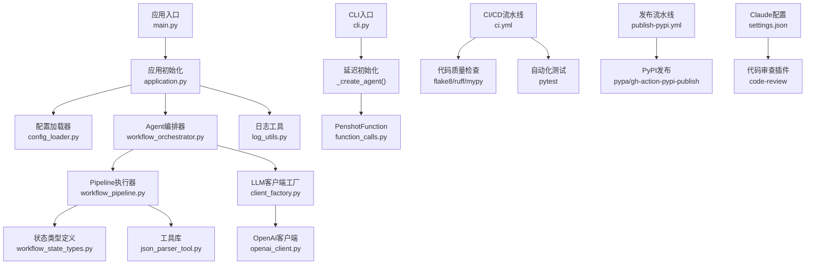
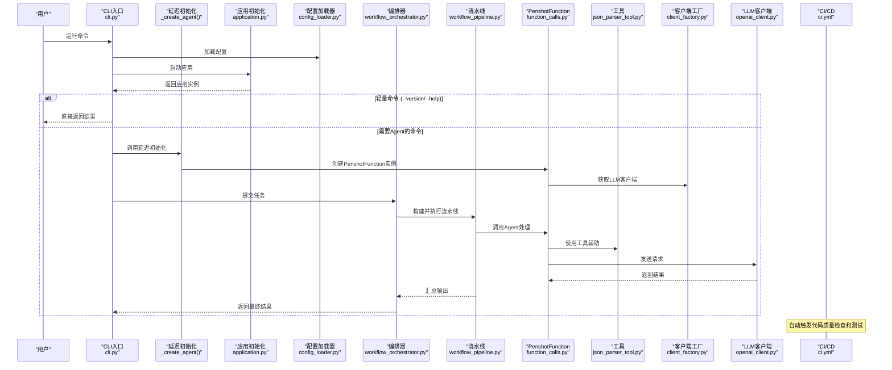
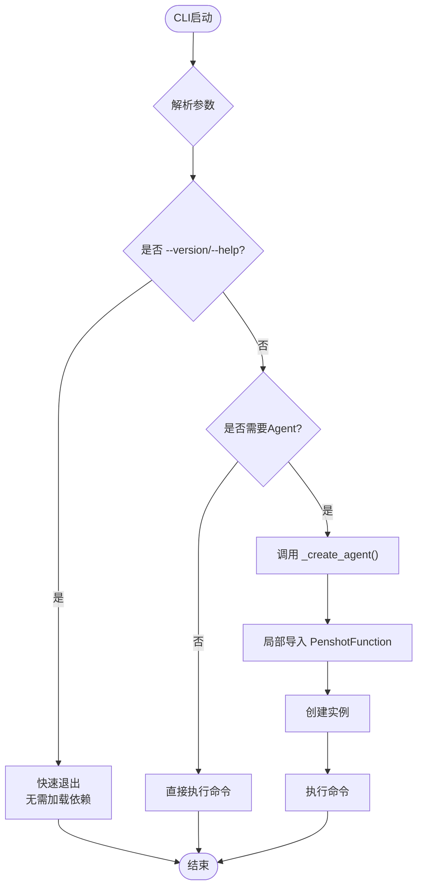
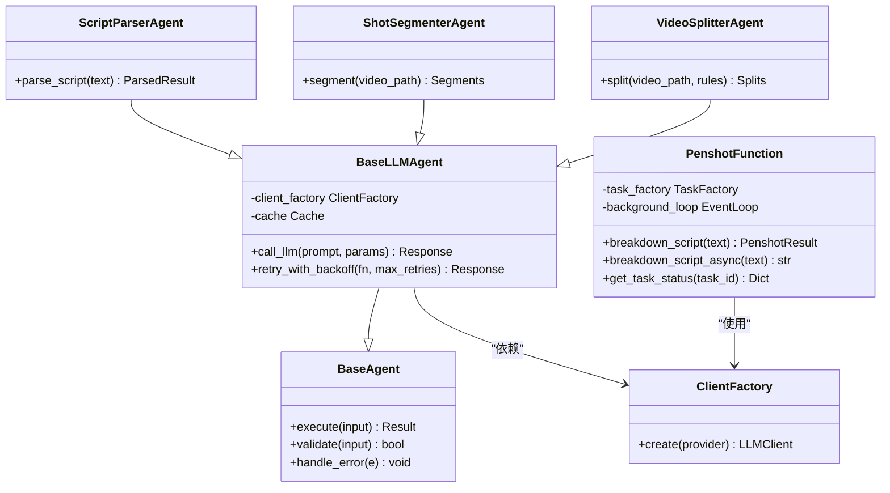
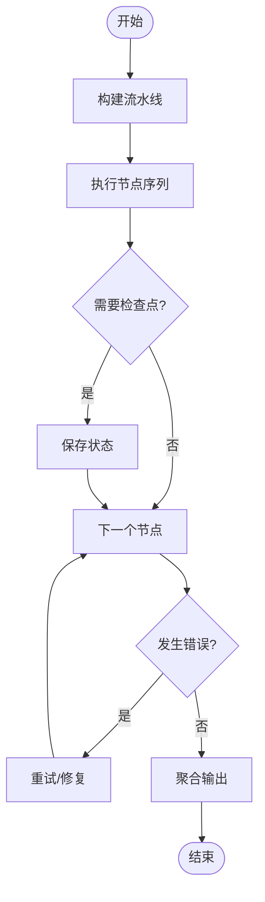
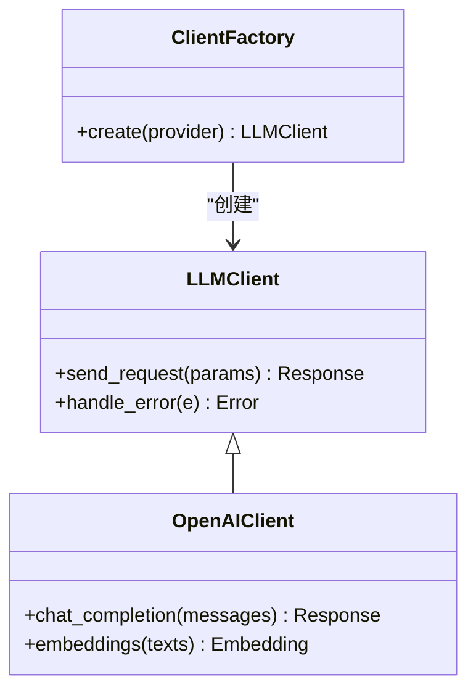
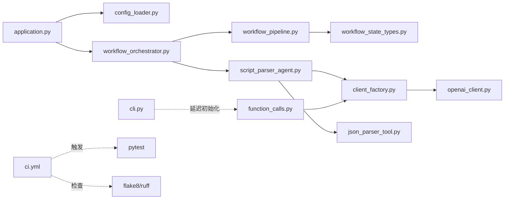
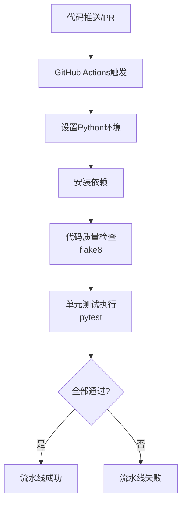
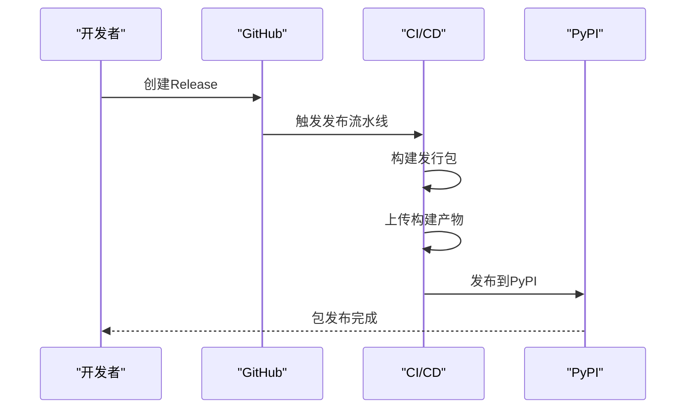
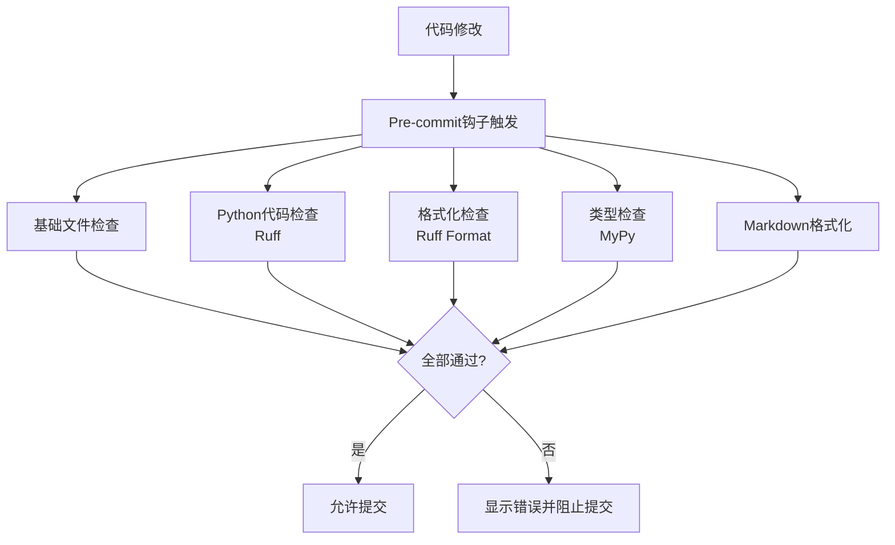

# 开发指南

<cite>
**本文引用的文件**   
- [README.md](file://README.md)
- [CONTRIBUTING.md](file://CONTRIBUTING.md)
- [pyproject.toml](file://pyproject.toml)
- [main.py](file://main.py)
- [src/penshot/cli.py](file://src/penshot/cli.py)
- [src/penshot/app/application.py](file://src/penshot/app/application.py)
- [src/penshot/config/config_loader.py](file://src/penshot/config/config_loader.py)
- [src/penshot/config/settings.yaml](file://src/penshot/config/settings.yaml)
- [src/penshot/neopen/agent/base_agent.py](file://src/penshot/neopen/agent/base_agent.py)
- [src/penshot/neopen/agent/base_llm_agent.py](file://src/penshot/neopen/agent/base_llm_agent.py)
- [src/penshot/neopen/agent/script_parser_agent.py](file://src/penshot/neopen/agent/script_parser_agent.py)
- [src/penshot/neopen/agent/shot_segmenter_agent.py](file://src/penshot/neopen/agent/shot_segmenter_agent.py)
- [src/penshot/neopen/agent/video_splitter_agent.py](file://src/penshot/neopen/agent/video_splitter_agent.py)
- [src/penshot/neopen/agent/workflow/workflow_orchestrator.py](file://src/penshot/neopen/agent/workflow/workflow_orchestrator.py)
- [src/penshot/neopen/agent/workflow/workflow_pipeline.py](file://src/penshot/neopen/agent/workflow/workflow_pipeline.py)
- [src/penshot/neopen/agent/workflow/workflow_state_types.py](file://src/penshot/neopen/agent/workflow/workflow_state_types.py)
- [src/penshot/neopen/client/client_factory.py](file://src/penshot/neopen/client/client_factory.py)
- [src/penshot/neopen/client/openai_client.py](file://src/penshot/neopen/client/openai_client.py)
- [src/penshot/api/function_calls.py](file://src/penshot/api/function_calls.py)
- [src/penshot/neopen/tools/json_parser_tool.py](file://src/penshot/neopen/tools/json_parser_tool.py)
- [src/penshot/utils/log_utils.py](file://src/penshot/utils/log_utils.py)
- [tests/conftest.py](file://tests/conftest.py)
- [tests/unit/test_utils.py](file://tests/unit/test_utils.py)
- [tests/task/test_task_factory.py](file://tests/task/test_task_factory.py)
- [tests/workflow/test_workflow_orchestrator.py](file://tests/workflow/test_workflow_orchestrator.py)
- [examples/direct_usage.py](file://examples/direct_usage.py)
- [examples/langgraph_integration.py](file://examples/langgraph_integration.py)
- [.github/workflows/ci.yml](file://.github/workflows/ci.yml)
- [.github/workflows/publish-pypi.yml](file://.github/workflows/publish-pypi.yml)
- [.flake8](file://.flake8)
- [.pre-commit-config.yaml](file://.pre-commit-config.yaml)
- [.claude/settings.json](file://.claude/settings.json)
- [CLAUDE.md](file://CLAUDE.md)
- [.claude/rules/10-python-quality.md](file://.claude/rules/10-python-quality.md)
</cite>

## 更新摘要
**变更内容**
- 新增完整的CI/CD流水线章节，包含GitHub Actions自动化工作流
- 添加Python代码质量标准配置（flake8、Ruff、Mypy）
- 增强Claude Code集成配置和插件设置
- 更新开发环境搭建流程，包含预提交钩子配置
- 完善代码审查和质量检查流程

## 目录
1. [简介](#简介)
2. [项目结构](#项目结构)
3. [核心组件](#核心组件)
4. [架构总览](#架构总览)
5. [详细组件分析](#详细组件分析)
6. [依赖关系分析](#依赖关系分析)
7. [性能考虑](#性能考虑)
8. [CI/CD流水线](#cicd流水线)
9. [代码质量标准](#代码质量标准)
10. [故障排查指南](#故障排查指南)
11. [结论](#结论)
12. [附录](#附录)

## 简介
本指南面向Video Shot Agent项目的开发者，提供从代码规范、Git工作流、测试要求到扩展新功能的完整实践说明。内容覆盖：
- 如何基于现有Agent基类与工厂机制快速实现自定义Agent
- 如何通过工具库扩展能力（如JSON解析、脚本评估等）
- 单元测试与集成测试的编写规范与最佳实践
- 调试技巧与性能分析方法
- 贡献代码的步骤与要求
- **新增**：完整的CI/CD流水线配置和自动化质量检查

**最新更新**：本项目已实现CLI性能优化，通过延迟初始化PenshotFunction agent，显著减少了`--version`和`--help`等轻量命令的启动时间和内存占用。同时新增了完整的CI/CD流水线，确保代码质量和自动化发布。

## 项目结构
项目采用分层与按功能域组织相结合的结构：
- src/penshot：核心源码
  - app：应用启动与配置加载
  - neopen：Agent、工作流、客户端、工具、知识、提示词等
  - utils：通用工具
  - api：对外API接口
- tests：单元、集成、端到端与基准测试
- examples：示例与演示
- scripts：CLI与运维脚本
- docs：架构与设计文档
- **.github/workflows**：CI/CD自动化流水线
- **.claude**：Claude Code集成配置



**图表来源**
- [main.py:1-200](file://main.py#L1-L200)
- [src/penshot/app/application.py:1-200](file://src/penshot/app/application.py#L1-L200)
- [src/penshot/config/config_loader.py:1-200](file://src/penshot/config/config_loader.py#L1-L200)
- [src/penshot/neopen/agent/workflow/workflow_orchestrator.py:1-200](file://src/penshot/neopen/agent/workflow/workflow_orchestrator.py#L1-L200)
- [src/penshot/neopen/agent/workflow/workflow_pipeline.py:1-200](file://src/penshot/neopen/agent/workflow/workflow_pipeline.py#L1-L200)
- [src/penshot/neopen/agent/workflow/workflow_state_types.py:1-200](file://src/penshot/neopen/agent/workflow/workflow_state_types.py#L1-L200)
- [src/penshot/neopen/client/client_factory.py:1-200](file://src/penshot/neopen/client/client_factory.py#L1-L200)
- [src/penshot/neopen/client/openai_client.py:1-200](file://src/penshot/neopen/client/openai_client.py#L1-L200)
- [src/penshot/neopen/tools/json_parser_tool.py:1-200](file://src/penshot/neopen/tools/json_parser_tool.py#L1-L200)
- [src/penshot/utils/log_utils.py:1-200](file://src/penshot/utils/log_utils.py#L1-L200)
- [src/penshot/cli.py:1-644](file://src/penshot/cli.py#L1-L644)
- [src/penshot/api/function_calls.py:1-526](file://src/penshot/api/function_calls.py#L1-L526)
- [.github/workflows/ci.yml:1-61](file://.github/workflows/ci.yml#L1-L61)
- [.github/workflows/publish-pypi.yml:1-71](file://.github/workflows/publish-pypi.yml#L1-L71)
- [.claude/settings.json:1-10](file://.claude/settings.json#L1-L10)

章节来源
- [README.md:1-200](file://README.md#L1-L200)
- [pyproject.toml:1-200](file://pyproject.toml#L1-L200)
- [main.py:1-200](file://main.py#L1-L200)
- [src/penshot/app/application.py:1-200](file://src/penshot/app/application.py#L1-L200)
- [src/penshot/config/config_loader.py:1-200](file://src/penshot/config/config_loader.py#L1-L200)
- [src/penshot/config/settings.yaml:1-200](file://src/penshot/config/settings.yaml#L1-L200)

## 核心组件
- 应用层
  - 应用初始化负责加载配置、注册服务、启动HTTP/MCP服务器等
  - 配置加载器支持多环境配置与YAML设置
- CLI层
  - **延迟初始化机制**：通过`_create_agent()`函数实现PenshotFunction的惰性创建
  - 避免轻量命令（`--version`、`--help`）触发全量重依赖初始化
  - 减少启动时间和内存占用
- Agent层
  - 抽象基类定义统一接口与生命周期
  - LLM Agent基类封装模型调用、重试、缓存等
  - PenshotFunction作为统一API接口，管理任务队列和并发控制
- 工作流层
  - 编排器负责节点调度、错误处理、记忆与检查点
  - Pipeline负责顺序/并行执行、输出修正与结果聚合
  - 状态类型定义贯穿各节点的数据契约
- 客户端层
  - 工厂模式创建不同LLM客户端（OpenAI、Ollama、Qwen等）
  - 客户端封装请求、响应、错误与速率限制
- 工具层
  - JSON解析、脚本评估、时长估算等可复用工具
- 日志与配置
  - 结构化日志、控制台颜色、环境变量加载
  - settings.yaml集中管理默认参数
- **CI/CD层**
  - GitHub Actions自动化流水线
  - 代码质量检查与测试自动化
  - PyPI包发布流程

**章节来源**
- [src/penshot/app/application.py:1-200](file://src/penshot/app/application.py#L1-L200)
- [src/penshot/config/config_loader.py:1-200](file://src/penshot/config/config_loader.py#L1-L200)
- [src/penshot/config/settings.yaml:1-200](file://src/penshot/config/settings.yaml#L1-L200)
- [src/penshot/cli.py:33-36](file://src/penshot/cli.py#L33-L36)
- [src/penshot/api/function_calls.py:47-94](file://src/penshot/api/function_calls.py#L47-L94)
- [src/penshot/neopen/agent/base_agent.py:1-200](file://src/penshot/neopen/agent/base_agent.py#L1-L200)
- [src/penshot/neopen/agent/base_llm_agent.py:1-200](file://src/penshot/neopen/agent/base_llm_agent.py#L1-L200)
- [src/penshot/neopen/agent/script_parser_agent.py:1-200](file://src/penshot/neopen/agent/script_parser_agent.py#L1-L200)
- [src/penshot/neopen/agent/shot_segmenter_agent.py:1-200](file://src/penshot/neopen/agent/shot_segmenter_agent.py#L1-L200)
- [src/penshot/neopen/agent/video_splitter_agent.py:1-200](file://src/penshot/neopen/agent/video_splitter_agent.py#L1-L200)
- [src/penshot/neopen/agent/workflow/workflow_orchestrator.py:1-200](file://src/penshot/neopen/agent/workflow/workflow_orchestrator.py#L1-L200)
- [src/penshot/neopen/agent/workflow/workflow_pipeline.py:1-200](file://src/penshot/neopen/agent/workflow/workflow_pipeline.py#L1-L200)
- [src/penshot/neopen/agent/workflow/workflow_state_types.py:1-200](file://src/penshot/neopen/agent/workflow/workflow_state_types.py#L1-L200)
- [src/penshot/neopen/client/client_factory.py:1-200](file://src/penshot/neopen/client/client_factory.py#L1-L200)
- [src/penshot/neopen/client/openai_client.py:1-200](file://src/penshot/neopen/client/openai_client.py#L1-L200)
- [src/penshot/neopen/tools/json_parser_tool.py:1-200](file://src/penshot/neopen/tools/json_parser_tool.py#L1-L200)
- [src/penshot/utils/log_utils.py:1-200](file://src/penshot/utils/log_utils.py#L1-L200)

## 架构总览
系统以"应用初始化 -> 配置加载 -> Agent编排 -> 工具调用 -> 客户端交互"为主线，结合工作流状态机驱动复杂任务。**新增延迟初始化机制**确保轻量命令的快速响应，**CI/CD流水线**确保代码质量和自动化发布。



**图表来源**
- [src/penshot/cli.py:33-36](file://src/penshot/cli.py#L33-L36)
- [src/penshot/cli.py:594-625](file://src/penshot/cli.py#L594-L625)
- [src/penshot/api/function_calls.py:47-94](file://src/penshot/api/function_calls.py#L47-L94)
- [src/penshot/app/application.py:1-200](file://src/penshot/app/application.py#L1-L200)
- [src/penshot/config/config_loader.py:1-200](file://src/penshot/config/config_loader.py#L1-L200)
- [src/penshot/neopen/agent/workflow/workflow_orchestrator.py:1-200](file://src/penshot/neopen/agent/workflow/workflow_orchestrator.py#L1-L200)
- [src/penshot/neopen/agent/workflow/workflow_pipeline.py:1-200](file://src/penshot/neopen/agent/workflow/workflow_pipeline.py#L1-L200)
- [src/penshot/neopen/client/client_factory.py:1-200](file://src/penshot/neopen/client/client_factory.py#L1-L200)
- [src/penshot/neopen/client/openai_client.py:1-200](file://src/penshot/neopen/client/openai_client.py#L1-L200)
- [.github/workflows/ci.yml:1-61](file://.github/workflows/ci.yml#L1-L61)

## 详细组件分析

### CLI延迟初始化机制
**新增** CLI层实现了智能的延迟初始化策略，通过`_create_agent()`函数在需要时才创建PenshotFunction实例。

- **设计要点**
  - 将PenshotFunction的导入和实例化推迟到实际使用时
  - 避免`--version`、`--help`等轻量命令触发昂贵的依赖加载
  - 减少内存占用和启动时间
- **实现方式**
  - 使用局部导入：`from penshot.api import PenshotFunction`在函数内部
  - 仅在需要时调用`_create_agent()`创建实例
  - 所有需要Agent的命令都通过此函数获取实例



**图表来源**
- [src/penshot/cli.py:33-36](file://src/penshot/cli.py#L33-L36)
- [src/penshot/cli.py:594-625](file://src/penshot/cli.py#L594-L625)

**章节来源**
- [src/penshot/cli.py:33-36](file://src/penshot/cli.py#L33-L36)
- [src/penshot/cli.py:177-191](file://src/penshot/cli.py#L177-L191)
- [src/penshot/cli.py:253-256](file://src/penshot/cli.py#L253-L256)
- [src/penshot/cli.py:294-297](file://src/penshot/cli.py#L294-L297)
- [src/penshot/cli.py:334-337](file://src/penshot/cli.py#L334-L337)
- [src/penshot/cli.py:345-382](file://src/penshot/cli.py#L345-L382)
- [src/penshot/cli.py:487-490](file://src/penshot/cli.py#L487-L490)

### Agent基类与LLM Agent
- 设计要点
  - 统一输入输出契约，便于编排器调度
  - LLM Agent封装重试、缓存、错误恢复
  - 子类仅需实现领域特定逻辑与提示词组装
- 扩展建议
  - 新增Agent时继承LLM Agent基类，注册到工厂或工作流
  - 通过工具增强能力，避免在Agent内硬编码外部依赖



**图表来源**
- [src/penshot/neopen/agent/base_agent.py:1-200](file://src/penshot/neopen/agent/base_agent.py#L1-L200)
- [src/penshot/neopen/agent/base_llm_agent.py:1-200](file://src/penshot/neopen/agent/base_llm_agent.py#L1-L200)
- [src/penshot/api/function_calls.py:47-94](file://src/penshot/api/function_calls.py#L47-L94)
- [src/penshot/neopen/agent/script_parser_agent.py:1-200](file://src/penshot/neopen/agent/script_parser_agent.py#L1-L200)
- [src/penshot/neopen/agent/shot_segmenter_agent.py:1-200](file://src/penshot/neopen/agent/shot_segmenter_agent.py#L1-L200)
- [src/penshot/neopen/agent/video_splitter_agent.py:1-200](file://src/penshot/neopen/agent/video_splitter_agent.py#L1-L200)
- [src/penshot/neopen/client/client_factory.py:1-200](file://src/penshot/neopen/client/client_factory.py#L1-L200)

**章节来源**
- [src/penshot/neopen/agent/base_agent.py:1-200](file://src/penshot/neopen/agent/base_agent.py#L1-L200)
- [src/penshot/neopen/agent/base_llm_agent.py:1-200](file://src/penshot/neopen/agent/base_llm_agent.py#L1-L200)
- [src/penshot/api/function_calls.py:47-94](file://src/penshot/api/function_calls.py#L47-L94)
- [src/penshot/neopen/agent/script_parser_agent.py:1-200](file://src/penshot/neopen/agent/script_parser_agent.py#L1-L200)
- [src/penshot/neopen/agent/shot_segmenter_agent.py:1-200](file://src/penshot/neopen/agent/shot_segmenter_agent.py#L1-L200)
- [src/penshot/neopen/agent/video_splitter_agent.py:1-200](file://src/penshot/neopen/agent/video_splitter_agent.py#L1-L200)
- [src/penshot/neopen/client/client_factory.py:1-200](file://src/penshot/neopen/client/client_factory.py#L1-L200)

### 工作流编排与流水线
- 编排器职责
  - 根据任务类型选择节点序列
  - 维护上下文、记忆与检查点
  - 统一错误处理与重试策略
- 流水线职责
  - 顺序/并行执行节点
  - 输出修正与结果聚合
  - 中间状态持久化
- 状态类型
  - 明确输入/输出契约，保证节点间数据一致性



**图表来源**
- [src/penshot/neopen/agent/workflow/workflow_orchestrator.py:1-200](file://src/penshot/neopen/agent/workflow/workflow_orchestrator.py#L1-L200)
- [src/penshot/neopen/agent/workflow/workflow_pipeline.py:1-200](file://src/penshot/neopen/agent/workflow/workflow_pipeline.py#L1-L200)
- [src/penshot/neopen/agent/workflow/workflow_state_types.py:1-200](file://src/penshot/neopen/agent/workflow/workflow_state_types.py#L1-L200)

**章节来源**
- [src/penshot/neopen/agent/workflow/workflow_orchestrator.py:1-200](file://src/penshot/neopen/agent/workflow/workflow_orchestrator.py#L1-L200)
- [src/penshot/neopen/agent/workflow/workflow_pipeline.py:1-200](file://src/penshot/neopen/agent/workflow/workflow_pipeline.py#L1-L200)
- [src/penshot/neopen/agent/workflow/workflow_state_types.py:1-200](file://src/penshot/neopen/agent/workflow/workflow_state_types.py#L1-L200)

### LLM客户端与工厂
- 工厂模式
  - 根据provider动态创建客户端实例
  - 统一管理认证、超时、重试等横切关注点
- OpenAI客户端
  - 封装API调用、错误码映射、速率限制
  - 支持流式与非流式响应



**图表来源**
- [src/penshot/neopen/client/client_factory.py:1-200](file://src/penshot/neopen/client/client_factory.py#L1-L200)
- [src/penshot/neopen/client/openai_client.py:1-200](file://src/penshot/neopen/client/openai_client.py#L1-L200)

**章节来源**
- [src/penshot/neopen/client/client_factory.py:1-200](file://src/penshot/neopen/client/client_factory.py#L1-L200)
- [src/penshot/neopen/client/openai_client.py:1-200](file://src/penshot/neopen/client/openai_client.py#L1-L200)

### 工具库扩展
- JSON解析工具
  - 安全解析LLM输出的JSON字符串
  - 提供容错与回退策略
- 其他工具
  - 脚本评估、时长估算、结果存储等
- 扩展方式
  - 遵循工具接口约定，注册到工具中心
  - 在Agent中按需注入使用

**章节来源**
- [src/penshot/neopen/tools/json_parser_tool.py:1-200](file://src/penshot/neopen/tools/json_parser_tool.py#L1-L200)

### 配置与环境
- 配置加载器
  - 支持多环境（开发/生产）
  - 合并默认值与用户覆盖
- settings.yaml
  - 集中管理默认参数、路径、开关
- 环境变量
  - 敏感信息通过环境变量注入

**章节来源**
- [src/penshot/config/config_loader.py:1-200](file://src/penshot/config/config_loader.py#L1-L200)
- [src/penshot/config/settings.yaml:1-200](file://src/penshot/config/settings.yaml#L1-L200)

## 依赖关系分析
- 模块耦合
  - 应用层依赖配置与工作流
  - Agent依赖客户端与工具
  - 工作流依赖状态类型与流水线
  - **CLI层通过延迟初始化解耦PenshotFunction依赖**
- 外部依赖
  - LLM提供商SDK（OpenAI等）
  - 日志与配置库
- 潜在循环依赖
  - 确保工具与Agent之间单向依赖，避免双向引用



**图表来源**
- [src/penshot/app/application.py:1-200](file://src/penshot/app/application.py#L1-L200)
- [src/penshot/config/config_loader.py:1-200](file://src/penshot/config/config_loader.py#L1-L200)
- [src/penshot/neopen/agent/workflow/workflow_orchestrator.py:1-200](file://src/penshot/neopen/agent/workflow/workflow_orchestrator.py#L1-L200)
- [src/penshot/neopen/agent/workflow/workflow_pipeline.py:1-200](file://src/penshot/neopen/agent/workflow/workflow_pipeline.py#L1-L200)
- [src/penshot/neopen/agent/workflow/workflow_state_types.py:1-200](file://src/penshot/neopen/agent/workflow/workflow_state_types.py#L1-L200)
- [src/penshot/neopen/agent/script_parser_agent.py:1-200](file://src/penshot/neopen/agent/script_parser_agent.py#L1-L200)
- [src/penshot/neopen/client/client_factory.py:1-200](file://src/penshot/neopen/client/client_factory.py#L1-L200)
- [src/penshot/neopen/client/openai_client.py:1-200](file://src/penshot/neopen/client/openai_client.py#L1-L200)
- [src/penshot/neopen/tools/json_parser_tool.py:1-200](file://src/penshot/neopen/tools/json_parser_tool.py#L1-L200)
- [src/penshot/cli.py:33-36](file://src/penshot/cli.py#L33-L36)
- [src/penshot/api/function_calls.py:1-526](file://src/penshot/api/function_calls.py#L1-L526)
- [.github/workflows/ci.yml:1-61](file://.github/workflows/ci.yml#L1-L61)

**章节来源**
- [pyproject.toml:1-200](file://pyproject.toml#L1-L200)

## 性能考虑
- **CLI性能优化**
  - **延迟初始化**：通过`_create_agent()`函数实现PenshotFunction的惰性创建
  - **快速启动**：`--version`和`--help`命令无需加载重型依赖
  - **内存优化**：避免不必要的对象创建和资源占用
- 客户端侧
  - 启用连接池与并发控制
  - 合理设置超时与重试退避
- 工作流侧
  - 对独立节点进行并行执行
  - 使用检查点减少重复计算
- 工具侧
  - 缓存高频结果（如嵌入向量）
  - 避免大对象在内存中频繁拷贝
- 日志与监控
  - 关键路径打点统计耗时
  - 采样记录高开销调用

**新增** CLI延迟初始化是本项目的重要性能优化特性：
- 启动时间减少：避免在轻量命令时加载大型依赖
- 内存占用降低：仅在需要时创建PenshotFunction实例
- 用户体验提升：命令响应更加迅速

**章节来源**
- [src/penshot/cli.py:33-36](file://src/penshot/cli.py#L33-L36)
- [src/penshot/cli.py:594-625](file://src/penshot/cli.py#L594-L625)
- [src/penshot/api/function_calls.py:47-94](file://src/penshot/api/function_calls.py#L47-L94)

## CI/CD流水线
**新增** 项目集成了完整的持续集成和持续部署流水线，确保代码质量和自动化发布。

### GitHub Actions工作流

#### 代码质量检查流水线 (ci.yml)
- **触发条件**：推送到main分支或针对main分支的Pull Request
- **执行环境**：Ubuntu + Python 3.10
- **主要步骤**：
  1. 代码检出与Python环境设置
  2. 依赖安装（包含开发依赖）
  3. 代码规范检查（flake8）
  4. 单元测试执行（pytest）



**图表来源**
- [.github/workflows/ci.yml:1-61](file://.github/workflows/ci.yml#L1-L61)

#### PyPI发布流水线 (publish-pypi.yml)
- **触发条件**：发布Release时自动触发
- **主要步骤**：
  1. 构建Python发行包
  2. 上传构建产物
  3. 发布到PyPI仓库



**图表来源**
- [.github/workflows/publish-pypi.yml:1-71](file://.github/workflows/publish-pypi.yml#L1-L71)

**章节来源**
- [.github/workflows/ci.yml:1-61](file://.github/workflows/ci.yml#L1-L61)
- [.github/workflows/publish-pypi.yml:1-71](file://.github/workflows/publish-pypi.yml#L1-L71)

## 代码质量标准
**新增** 项目建立了完善的代码质量标准体系，确保代码质量和一致性。

### Python代码质量工具

#### Flake8配置 (.flake8)
- **排除目录**：`.claude`, `.git`, `.qoder`, `__pycache__`, `build`, `tests`, `dist`, `*.egg-info`
- **行长度限制**：100字符
- **检查规则**：语法错误、未定义变量等严重问题

#### Pre-commit钩子 (.pre-commit-config.yaml)
- **基础检查**：
  - 尾随空格清理
  - 文件结尾换行符
  - YAML/TOML/JSON格式验证
  - 大文件检测（>5MB阻止提交）
  - 私钥检测
- **Python代码检查**：
  - Ruff代码检查与自动修复
  - Ruff格式化（替代Black）
  - MyPy静态类型检查
- **文档格式化**：
  - Markdown格式化和编号整理

#### Claude Code集成
- **启用插件**：
  - code-review@claude-plugins-official：代码审查
  - claude-md-management@claude-plugins-official：Markdown管理
  - claude-code-setup@claude-plugins-official：代码设置
  - skill-creator@claude-plugins-official：技能创建
  - commit-commands@claude-plugins-official：提交命令



**图表来源**
- [.pre-commit-config.yaml:1-55](file://.pre-commit-config.yaml#L1-L55)

**章节来源**
- [.flake8:1-19](file://.flake8#L1-L19)
- [.pre-commit-config.yaml:1-55](file://.pre-commit-config.yaml#L1-L55)
- [.claude/settings.json:1-10](file://.claude/settings.json#L1-L10)
- [.claude/rules/10-python-quality.md:1-37](file://.claude/rules/10-python-quality.md#L1-L37)

## 故障排查指南
- 常见问题
  - 配置缺失或格式错误：检查settings.yaml与环境变量
  - LLM调用失败：查看客户端错误码与重试次数
  - JSON解析异常：使用工具容错并记录原始输出
  - **CLI启动缓慢**：检查是否有不必要的依赖导入
  - **CI/CD失败**：检查代码质量检查结果和测试覆盖率
- 调试技巧
  - 开启详细日志，定位调用链
  - 使用示例脚本复现问题
  - 逐步断点验证状态转换
  - **性能分析**：使用`time`命令测量CLI启动时间
  - **本地预提交检查**：`pre-commit run --all-files`
- 参考位置
  - 日志工具与配置加载器
  - 工作流错误处理器与检查点
  - 客户端错误映射与重试逻辑
  - **CLI延迟初始化逻辑**
  - **CI/CD配置文件**

**章节来源**
- [src/penshot/utils/log_utils.py:1-200](file://src/penshot/utils/log_utils.py#L1-L200)
- [src/penshot/config/config_loader.py:1-200](file://src/penshot/config/config_loader.py#L1-L200)
- [src/penshot/neopen/agent/workflow/workflow_orchestrator.py:1-200](file://src/penshot/neopen/agent/workflow/workflow_orchestrator.py#L1-L200)
- [src/penshot/neopen/client/openai_client.py:1-200](file://src/penshot/neopen/client/openai_client.py#L1-L200)
- [src/penshot/cli.py:33-36](file://src/penshot/cli.py#L33-L36)
- [.github/workflows/ci.yml:1-61](file://.github/workflows/ci.yml#L1-L61)

## 结论
通过统一的Agent基类、工厂模式与可插拔工具体系，本项目提供了可扩展的视频分镜智能体框架。**最新的CLI性能优化**通过延迟初始化机制，显著提升了命令行工具的启动速度和用户体验。**新增的CI/CD流水线**确保了代码质量和自动化发布流程，配合完善的工作流编排与测试套件，开发者可以快速实现新功能并保持系统稳定。

**新增亮点**：
- CLI延迟初始化机制避免了不必要的资源消耗
- 完整的CI/CD流水线确保代码质量和自动化发布
- 严格的代码质量标准通过多种工具保障
- Claude Code集成提供智能代码审查和开发辅助
- 保持了向后兼容性，不影响现有功能
- 为未来更多性能优化奠定了基础

## 附录

### 代码规范与开发流程
- Git工作流
  - 分支策略：主分支保护，功能分支命名规范
  - 提交信息：语义化版本前缀（feat/fix/docs/test等）
  - 变更审查：至少一人审查，CI通过后合并
- 代码审查标准
  - 可读性与可维护性优先
  - 明确的输入输出契约与错误处理
  - 必要的注释与文档更新
  - **性能考量**：评估变更对启动时间和内存占用的影响
  - **代码质量**：通过Ruff、MyPy等工具检查
- 测试要求
  - 新增/修改必须包含相应测试
  - 覆盖率阈值与关键路径用例必测
  - 集成测试覆盖端到端流程
  - **性能测试**：验证延迟初始化效果
  - **CI/CD集成**：自动化测试和质量检查

**章节来源**
- [CONTRIBUTING.md:1-200](file://CONTRIBUTING.md#L1-L200)
- [.pre-commit-config.yaml:1-55](file://.pre-commit-config.yaml#L1-L55)
- [.github/workflows/ci.yml:1-61](file://.github/workflows/ci.yml#L1-L61)

### 单元测试与集成测试编写指南
- 单元测试
  - 针对工具与纯函数进行隔离测试
  - 使用fixtures与mock外部依赖
  - **CLI测试**：验证延迟初始化行为
  - **异步测试**：利用pytest的asyncio_mode=auto
- 集成测试
  - 模拟真实工作流执行
  - 校验状态转换与输出契约
  - **性能测试**：测量CLI启动时间和内存使用
  - **CI/CD测试**：确保在GitHub Actions环境中运行
- 参考样例
  - 工具测试、任务工厂测试、工作流编排测试

**章节来源**
- [tests/unit/test_utils.py:1-200](file://tests/unit/test_utils.py#L1-L200)
- [tests/task/test_task_factory.py:1-200](file://tests/task/test_task_factory.py#L1-L200)
- [tests/workflow/test_workflow_orchestrator.py:1-200](file://tests/workflow/test_workflow_orchestrator.py#L1-L200)
- [tests/conftest.py:1-200](file://tests/conftest.py#L1-L200)
- [pyproject.toml:244-254](file://pyproject.toml#L244-L254)

### 扩展新功能（自定义Agent与插件）
- 自定义Agent
  - 继承LLM Agent基类，实现领域逻辑
  - 注册到工作流或工厂，供编排器调用
  - **考虑性能影响**：评估Agent初始化成本
  - **代码质量**：遵循Ruff和MyPy检查规则
- 插件机制
  - 工具作为插件扩展，保持Agent轻量
  - 通过配置切换不同实现
  - **延迟加载**：对重型插件使用懒加载
- 工具库扩展
  - 遵循工具接口，提供容错与日志
  - 在Agent中按需注入使用
  - **测试覆盖**：为新工具编写单元测试

**章节来源**
- [src/penshot/neopen/agent/base_llm_agent.py:1-200](file://src/penshot/neopen/agent/base_llm_agent.py#L1-L200)
- [src/penshot/neopen/agent/script_parser_agent.py:1-200](file://src/penshot/neopen/agent/script_parser_agent.py#L1-L200)
- [src/penshot/neopen/tools/json_parser_tool.py:1-200](file://src/penshot/neopen/tools/json_parser_tool.py#L1-L200)
- [.claude/rules/10-python-quality.md:1-37](file://.claude/rules/10-python-quality.md#L1-L37)

### 实际开发案例与最佳实践
- 直接用法示例
  - 通过示例脚本快速体验核心流程
- LangGraph集成示例
  - 展示如何将Agent接入图式工作流
- CLI使用
  - 命令行参数与配置文件联动
  - **性能优化实践**：延迟初始化模式的应用
- **CI/CD最佳实践**
  - 本地预提交检查：`pre-commit run --all-files`
  - 代码质量检查：`ruff check . && ruff format --check . && mypy src/`
  - 测试执行：`pytest` 或 `pytest --cov=penshot`

**新增** CLI延迟初始化最佳实践：
- 将重型依赖的导入推迟到函数内部
- 只在真正需要时创建昂贵对象
- 对于轻量命令，避免任何不必要的初始化
- **本地验证**：在提交前运行完整的预提交检查

**章节来源**
- [examples/direct_usage.py:1-200](file://examples/direct_usage.py#L1-L200)
- [examples/langgraph_integration.py:1-200](file://examples/langgraph_integration.py#L1-L200)
- [src/penshot/cli.py:33-36](file://src/penshot/cli.py#L33-L36)
- [.pre-commit-config.yaml:1-55](file://.pre-commit-config.yaml#L1-L55)

### CLI性能优化实践
**新增** 本节详细介绍CLI性能优化的实现细节：

- **延迟初始化模式**
  ```python
  def _create_agent(**kwargs):
      """惰性创建 PenshotFunction 实例"""
      from penshot.api import PenshotFunction
      return PenshotFunction(**kwargs)
  ```
- **应用场景**
  - `--version`和`--help`命令：直接返回，无需加载依赖
  - 需要Agent的命令：仅在必要时创建实例
  - 批量操作：复用已创建的实例
- **性能收益**
  - 启动时间减少：避免加载大型依赖树
  - 内存占用降低：减少不必要的对象创建
  - 用户体验提升：命令响应更加迅速

**章节来源**
- [src/penshot/cli.py:33-36](file://src/penshot/cli.py#L33-L36)
- [src/penshot/cli.py:594-625](file://src/penshot/cli.py#L594-L625)
- [src/penshot/api/function_calls.py:47-94](file://src/penshot/api/function_calls.py#L47-L94)

### 开发环境搭建
**新增** 完整的开发环境搭建指南：

- **环境要求**
  - Python 3.10+
  - pip包管理器
  - git版本控制
- **快速开始**
  ```bash
  # 克隆仓库
  git clone https://github.com/neopen/story-shot-agent.git
  cd story-shot-agent
  
  # 创建虚拟环境
  python -m venv venv
  source venv/bin/activate  # Windows: venv\Scripts\activate
  
  # 安装开发依赖
  pip install -e ".[dev]"
  
  # 安装预提交钩子
  pre-commit install
  ```
- **开发工具**
  - IDE推荐：VS Code + Python扩展
  - 代码格式化：Ruff + Ruff Format
  - 类型检查：MyPy
  - 测试框架：Pytest
- **Claude Code集成**
  - 启用代码审查插件
  - 使用Markdown管理工具
  - 利用提交命令提高效率

**章节来源**
- [CONTRIBUTING.md:20-48](file://CONTRIBUTING.md#L20-L48)
- [CLAUDE.md:17-46](file://CLAUDE.md#L17-L46)
- [.claude/settings.json:1-10](file://.claude/settings.json#L1-L10)

### 代码质量检查流程
**新增** 详细的代码质量检查流程：

- **本地检查**
  ```bash
  # 运行所有预提交钩子
  pre-commit run --all-files
  
  # 单独运行检查
  ruff check .                    # 代码检查
  ruff format --check .           # 格式检查
  mypy src/                       # 类型检查
  pytest                          # 单元测试
  ```
- **CI/CD检查**
  - 自动触发：Push到main分支或创建PR
  - 检查内容：flake8语法检查、pytest测试
  - 结果反馈：GitHub Actions页面查看详细报告
- **发布流程**
  - 创建Release触发PyPI发布
  - 自动构建和上传包
  - 版本号管理通过pyproject.toml

**章节来源**
- [.pre-commit-config.yaml:1-55](file://.pre-commit-config.yaml#L1-L55)
- [.github/workflows/ci.yml:1-61](file://.github/workflows/ci.yml#L1-L61)
- [.github/workflows/publish-pypi.yml:1-71](file://.github/workflows/publish-pypi.yml#L1-L71)
- [pyproject.toml:8-11](file://pyproject.toml#L8-L11)