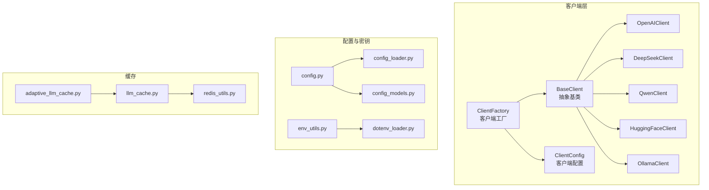
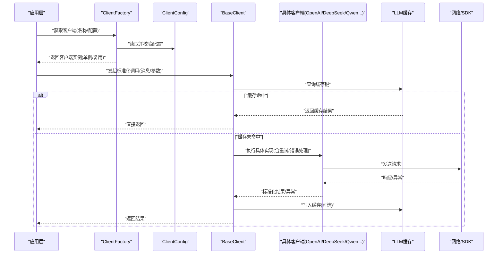
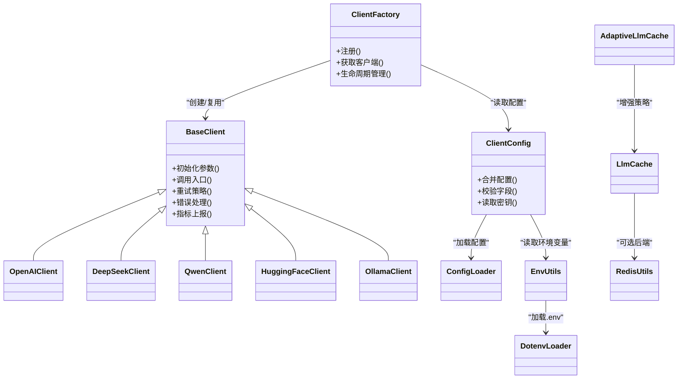

# LLM客户端集成

<cite>
**本文引用的文件**   
- [base_client.py](file://src/penshot/app/client/base_client.py)
- [client_factory.py](file://src/penshot/app/client/client_factory.py)
- [client_config.py](file://src/penshot/app/client/client_config.py)
- [openai_client.py](file://src/penshot/app/client/llm/openai_client.py)
- [deepseek_client.py](file://src/penshot/app/client/llm/deepseek_client.py)
- [qwen_client.py](file://src/penshot/app/client/llm/qwen_client.py)
- [huggingface_client.py](file://src/penshot/app/client/llm/huggingface_client.py)
- [ollama_client.py](file://src/penshot/app/client/llm/ollama_client.py)
- [adaptive_llm_cache.py](file://src/penshot/app/cache/adaptive_llm_cache.py)
- [llm_cache.py](file://src/penshot/app/cache/llm_cache.py)
- [config.py](file://src/penshot/config/config.py)
- [config_loader.py](file://src/penshot/config/config_loader.py)
- [config_models.py](file://src/penshot/config/config_models.py)
- [env_utils.py](file://src/penshot/utils/env_utils.py)
- [dotenv_loader.py](file://src/penshot/utils/dotenv_loader.py)
- [log_utils.py](file://src/penshot/utils/log_utils.py)
- [redis_utils.py](file://src/penshot/utils/redis_utils.py)
</cite>

## 目录
1. [简介](#简介)
2. [项目结构](#项目结构)
3. [核心组件](#核心组件)
4. [架构总览](#架构总览)
5. [详细组件分析](#详细组件分析)
6. [依赖关系分析](#依赖关系分析)
7. [性能考虑](#性能考虑)
8. [故障排查指南](#故障排查指南)
9. [结论](#结论)
10. [附录](#附录)

## 简介
本指南面向需要在系统中接入新的大语言模型服务的开发者，围绕BaseClient抽象与客户端工厂模式，系统阐述如何扩展新的LLM客户端。文档涵盖：
- 基于BaseClient实现新客户端的规范与步骤
- 客户端注册、配置管理、连接池管理的最佳实践
- OpenAI、DeepSeek、Qwen等现有客户端的实现要点
- API密钥管理、请求重试、错误处理、缓存策略等高级特性
- 客户端性能监控与调试方法

## 项目结构
本项目将LLM客户端相关代码集中在app/client目录下，采用“基础抽象 + 具体实现 + 工厂”的分层组织方式；配置与密钥通过统一配置模块加载；缓存能力由独立缓存模块提供。

图表来源
- [base_client.py:1-200](file://src/penshot/app/client/base_client.py#L1-L200)
- [client_factory.py:1-200](file://src/penshot/app/client/client_factory.py#L1-L200)
- [client_config.py:1-200](file://src/penshot/app/client/client_config.py#L1-L200)
- [openai_client.py:1-200](file://src/penshot/app/client/llm/openai_client.py#L1-L200)
- [deepseek_client.py:1-200](file://src/penshot/app/client/llm/deepseek_client.py#L1-L200)
- [qwen_client.py:1-200](file://src/penshot/app/client/llm/qwen_client.py#L1-L200)
- [huggingface_client.py:1-200](file://src/penshot/app/client/llm/huggingface_client.py#L1-L200)
- [ollama_client.py:1-200](file://src/penshot/app/client/llm/ollama_client.py#L1-L200)
- [config.py:1-200](file://src/penshot/config/config.py#L1-L200)
- [config_loader.py:1-200](file://src/penshot/config/config_loader.py#L1-L200)
- [config_models.py:1-200](file://src/penshot/config/config_models.py#L1-L200)
- [env_utils.py:1-200](file://src/penshot/utils/env_utils.py#L1-L200)
- [dotenv_loader.py:1-200](file://src/penshot/utils/dotenv_loader.py#L1-L200)
- [llm_cache.py:1-200](file://src/penshot/app/cache/llm_cache.py#L1-L200)
- [adaptive_llm_cache.py:1-200](file://src/penshot/app/cache/adaptive_llm_cache.py#L1-L200)
- [redis_utils.py:1-200](file://src/penshot/utils/redis_utils.py#L1-L200)

章节来源
- [base_client.py:1-200](file://src/penshot/app/client/base_client.py#L1-L200)
- [client_factory.py:1-200](file://src/penshot/app/client/client_factory.py#L1-L200)
- [client_config.py:1-200](file://src/penshot/app/client/client_config.py#L1-L200)
- [config.py:1-200](file://src/penshot/config/config.py#L1-L200)
- [config_loader.py:1-200](file://src/penshot/config/config_loader.py#L1-L200)
- [config_models.py:1-200](file://src/penshot/config/config_models.py#L1-L200)
- [env_utils.py:1-200](file://src/penshot/utils/env_utils.py#L1-L200)
- [dotenv_loader.py:1-200](file://src/penshot/utils/dotenv_loader.py#L1-L200)
- [llm_cache.py:1-200](file://src/penshot/app/cache/llm_cache.py#L1-L200)
- [adaptive_llm_cache.py:1-200](file://src/penshot/app/cache/adaptive_llm_cache.py#L1-L200)
- [redis_utils.py:1-200](file://src/penshot/utils/redis_utils.py#L1-L200)

## 核心组件
- BaseClient：定义统一的LLM客户端抽象接口，包括初始化参数、通用重试与错误处理、日志与指标上报钩子、以及调用入口的统一签名。
- ClientFactory：负责按名称或配置创建并缓存客户端实例，支持多后端切换与生命周期管理。
- ClientConfig：封装各后端的连接参数、鉴权信息、超时、并发与限流等配置项。
- 具体客户端实现：OpenAI、DeepSeek、Qwen、HuggingFace、Ollama等，分别适配各自SDK或HTTP协议。
- 缓存层：llm_cache与adaptive_llm_cache提供可插拔的缓存策略（内存/Redis），用于减少重复请求成本。
- 配置与密钥：config/config_loader/config_models集中管理配置加载与校验；env_utils与dotenv_loader负责环境变量与.env文件加载。

章节来源
- [base_client.py:1-200](file://src/penshot/app/client/base_client.py#L1-L200)
- [client_factory.py:1-200](file://src/penshot/app/client/client_factory.py#L1-L200)
- [client_config.py:1-200](file://src/penshot/app/client/client_config.py#L1-L200)
- [openai_client.py:1-200](file://src/penshot/app/client/llm/openai_client.py#L1-L200)
- [deepseek_client.py:1-200](file://src/penshot/app/client/llm/deepseek_client.py#L1-L200)
- [qwen_client.py:1-200](file://src/penshot/app/client/llm/qwen_client.py#L1-L200)
- [huggingface_client.py:1-200](file://src/penshot/app/client/llm/huggingface_client.py#L1-L200)
- [ollama_client.py:1-200](file://src/penshot/app/client/llm/ollama_client.py#L1-L200)
- [llm_cache.py:1-200](file://src/penshot/app/cache/llm_cache.py#L1-L200)
- [adaptive_llm_cache.py:1-200](file://src/penshot/app/cache/adaptive_llm_cache.py#L1-L200)
- [config.py:1-200](file://src/penshot/config/config.py#L1-L200)
- [config_loader.py:1-200](file://src/penshot/config/config_loader.py#L1-L200)
- [config_models.py:1-200](file://src/penshot/config/config_models.py#L1-L200)
- [env_utils.py:1-200](file://src/penshot/utils/env_utils.py#L1-L200)
- [dotenv_loader.py:1-200](file://src/penshot/utils/dotenv_loader.py#L1-L200)

## 架构总览
下图展示了从上层业务到具体LLM服务调用的整体流程，包含工厂创建、配置加载、缓存命中、重试与错误处理、以及指标上报的关键路径。

图表来源
- [client_factory.py:1-200](file://src/penshot/app/client/client_factory.py#L1-L200)
- [client_config.py:1-200](file://src/penshot/app/client/client_config.py#L1-L200)
- [base_client.py:1-200](file://src/penshot/app/client/base_client.py#L1-L200)
- [openai_client.py:1-200](file://src/penshot/app/client/llm/openai_client.py#L1-L200)
- [deepseek_client.py:1-200](file://src/penshot/app/client/llm/deepseek_client.py#L1-L200)
- [qwen_client.py:1-200](file://src/penshot/app/client/llm/qwen_client.py#L1-L200)
- [llm_cache.py:1-200](file://src/penshot/app/cache/llm_cache.py#L1-L200)

## 详细组件分析

### BaseClient：抽象基类与通用能力
- 职责
  - 定义统一的客户端初始化参数与调用入口签名
  - 提供通用的重试策略、错误分类与转换、日志与指标上报钩子
  - 暴露缓存接入点与连接池/会话复用约定
- 关键设计
  - 模板方法：在子类中仅实现差异化的API适配逻辑
  - 可插拔：重试器、错误处理器、缓存、指标上报均可替换
- 扩展建议
  - 新增客户端时，继承BaseClient并实现最小必要方法
  - 遵循统一的异常类型与返回结构，便于上层一致处理

章节来源
- [base_client.py:1-200](file://src/penshot/app/client/base_client.py#L1-L200)

### ClientFactory：客户端工厂与注册机制
- 职责
  - 根据名称或配置创建并缓存客户端实例
  - 维护客户端生命周期（创建、复用、销毁）
  - 提供注册表以支持动态发现与热插拔
- 关键设计
  - 单例/共享实例：避免重复创建底层连接
  - 延迟初始化：按需创建，降低启动开销
  - 配置驱动：从ClientConfig或全局配置加载参数
- 使用建议
  - 新增客户端需在工厂注册表中登记
  - 为不同环境提供不同的默认配置映射

章节来源
- [client_factory.py:1-200](file://src/penshot/app/client/client_factory.py#L1-L200)

### ClientConfig：配置管理与校验
- 职责
  - 封装各后端连接参数（端点、模型名、超时、并发、限流等）
  - 提供配置合并、默认值填充与字段校验
- 关键设计
  - 分层配置：全局默认 + 环境覆盖 + 运行时覆盖
  - 安全敏感字段（如API密钥）不持久化明文
- 使用建议
  - 为新客户端添加配置项时，同步更新校验规则与文档
  - 对必填字段进行严格校验，失败时快速失败

章节来源
- [client_config.py:1-200](file://src/penshot/app/client/client_config.py#L1-L200)

### OpenAI客户端实现要点
- 适配内容
  - 认证方式（API Key）、模型选择、流式与非流式调用
  - 参数映射（温度、最大长度、工具调用等）
  - 错误码与重试策略（速率限制、临时错误）
- 性能与稳定性
  - 合理设置并发与超时
  - 结合缓存减少重复请求
- 参考路径
  - [openai_client.py:1-200](file://src/penshot/app/client/llm/openai_client.py#L1-L200)

章节来源
- [openai_client.py:1-200](file://src/penshot/app/client/llm/openai_client.py#L1-L200)

### DeepSeek客户端实现要点
- 适配内容
  - 鉴权与端点配置
  - 参数映射与响应解析
  - 错误分类与重试
- 参考路径
  - [deepseek_client.py:1-200](file://src/penshot/app/client/llm/deepseek_client.py#L1-L200)

章节来源
- [deepseek_client.py:1-200](file://src/penshot/app/client/llm/deepseek_client.py#L1-L200)

### Qwen客户端实现要点
- 适配内容
  - 兼容阿里云DashScope或其他网关
  - 流式输出与分块处理
  - 错误与重试策略
- 参考路径
  - [qwen_client.py:1-200](file://src/penshot/app/client/llm/qwen_client.py#L1-L200)

章节来源
- [qwen_client.py:1-200](file://src/penshot/app/client/llm/qwen_client.py#L1-L200)

### HuggingFace与Ollama客户端
- HuggingFace
  - 适配Inference API或自托管推理服务
  - 关注大模型权重下载与本地资源占用
  - 参考路径：[huggingface_client.py:1-200](file://src/penshot/app/client/llm/huggingface_client.py#L1-L200)
- Ollama
  - 本地运行、模型拉取与版本管理
  - 低延迟与离线场景适用
  - 参考路径：[ollama_client.py:1-200](file://src/penshot/app/client/llm/ollama_client.py#L1-L200)

章节来源
- [huggingface_client.py:1-200](file://src/penshot/app/client/llm/huggingface_client.py#L1-L200)
- [ollama_client.py:1-200](file://src/penshot/app/client/llm/ollama_client.py#L1-L200)

### 缓存策略：llm_cache与adaptive_llm_cache
- llm_cache
  - 提供统一的缓存接口（get/set/exists/clear）
  - 支持内存与Redis两种后端
- adaptive_llm_cache
  - 自适应策略：根据命中率、延迟、成本等动态调整缓存粒度与TTL
- 使用建议
  - 对幂等且高成本的请求启用缓存
  - 注意缓存键的规范化与失效策略

章节来源
- [llm_cache.py:1-200](file://src/penshot/app/cache/llm_cache.py#L1-L200)
- [adaptive_llm_cache.py:1-200](file://src/penshot/app/cache/adaptive_llm_cache.py#L1-L200)
- [redis_utils.py:1-200](file://src/penshot/utils/redis_utils.py#L1-L200)

### 配置与密钥管理：config、config_loader、config_models、env_utils、dotenv_loader
- config/config_loader/config_models
  - 集中加载YAML/JSON等配置文件，提供强类型模型与校验
- env_utils/dotenv_loader
  - 统一读取环境变量与.env文件，保障敏感信息隔离
- 使用建议
  - 生产环境优先使用环境变量注入
  - 对密钥字段做最小权限与脱敏处理

章节来源
- [config.py:1-200](file://src/penshot/config/config.py#L1-L200)
- [config_loader.py:1-200](file://src/penshot/config/config_loader.py#L1-L200)
- [config_models.py:1-200](file://src/penshot/config/config_models.py#L1-L200)
- [env_utils.py:1-200](file://src/penshot/utils/env_utils.py#L1-L200)
- [dotenv_loader.py:1-200](file://src/penshot/utils/dotenv_loader.py#L1-L200)

## 依赖关系分析
下图展示客户端层与配置、缓存、工具层的依赖关系，帮助理解耦合与内聚。

图表来源
- [base_client.py:1-200](file://src/penshot/app/client/base_client.py#L1-L200)
- [client_factory.py:1-200](file://src/penshot/app/client/client_factory.py#L1-L200)
- [client_config.py:1-200](file://src/penshot/app/client/client_config.py#L1-L200)
- [openai_client.py:1-200](file://src/penshot/app/client/llm/openai_client.py#L1-L200)
- [deepseek_client.py:1-200](file://src/penshot/app/client/llm/deepseek_client.py#L1-L200)
- [qwen_client.py:1-200](file://src/penshot/app/client/llm/qwen_client.py#L1-L200)
- [huggingface_client.py:1-200](file://src/penshot/app/client/llm/huggingface_client.py#L1-L200)
- [ollama_client.py:1-200](file://src/penshot/app/client/llm/ollama_client.py#L1-L200)
- [llm_cache.py:1-200](file://src/penshot/app/cache/llm_cache.py#L1-L200)
- [adaptive_llm_cache.py:1-200](file://src/penshot/app/cache/adaptive_llm_cache.py#L1-L200)
- [config.py:1-200](file://src/penshot/config/config.py#L1-L200)
- [config_loader.py:1-200](file://src/penshot/config/config_loader.py#L1-L200)
- [env_utils.py:1-200](file://src/penshot/utils/env_utils.py#L1-L200)
- [dotenv_loader.py:1-200](file://src/penshot/utils/dotenv_loader.py#L1-L200)
- [redis_utils.py:1-200](file://src/penshot/utils/redis_utils.py#L1-L200)

章节来源
- [base_client.py:1-200](file://src/penshot/app/client/base_client.py#L1-L200)
- [client_factory.py:1-200](file://src/penshot/app/client/client_factory.py#L1-L200)
- [client_config.py:1-200](file://src/penshot/app/client/client_config.py#L1-L200)
- [llm_cache.py:1-200](file://src/penshot/app/cache/llm_cache.py#L1-L200)
- [adaptive_llm_cache.py:1-200](file://src/penshot/app/cache/adaptive_llm_cache.py#L1-L200)
- [config.py:1-200](file://src/penshot/config/config.py#L1-L200)
- [config_loader.py:1-200](file://src/penshot/config/config_loader.py#L1-L200)
- [env_utils.py:1-200](file://src/penshot/utils/env_utils.py#L1-L200)
- [dotenv_loader.py:1-200](file://src/penshot/utils/dotenv_loader.py#L1-L200)
- [redis_utils.py:1-200](file://src/penshot/utils/redis_utils.py#L1-L200)

## 性能考虑
- 连接复用与连接池
  - 通过工厂复用客户端实例，避免频繁建立连接
  - 针对HTTP SDK开启连接池与Keep-Alive
- 并发与限流
  - 合理设置并发度与令牌桶/漏桶限流，防止触发服务端速率限制
- 超时与重试
  - 区分可重试与不可重试错误，指数退避与抖动
  - 设置合理的请求与读超时，避免长尾阻塞
- 缓存策略
  - 对高成本、幂等请求启用缓存，结合自适应策略优化TTL与粒度
- 监控与观测
  - 记录关键指标：QPS、P95/P99延迟、错误率、缓存命中率、Token用量
  - 结构化日志与链路追踪，便于定位问题

## 故障排查指南
- 常见问题
  - 鉴权失败：检查API密钥是否加载正确、环境变量是否生效
  - 速率限制：观察重试次数与退避策略，必要时降低并发或提升配额
  - 超时与断连：检查网络连通性、服务端状态与超时阈值
  - 缓存异常：确认缓存后端可用性与键冲突
- 诊断手段
  - 启用详细日志与指标上报
  - 使用测试用例模拟极端场景（空响应、部分流式中断、错误码组合）
  - 对关键路径增加埋点与采样

章节来源
- [log_utils.py:1-200](file://src/penshot/utils/log_utils.py#L1-L200)
- [redis_utils.py:1-200](file://src/penshot/utils/redis_utils.py#L1-L200)

## 结论
通过BaseClient抽象与ClientFactory工厂模式，本项目实现了可扩展、可配置的LLM客户端体系。新增客户端只需聚焦差异化适配，其余通用能力（重试、错误处理、缓存、指标）由基类与工厂统一管理。配合完善的配置与密钥管理、缓存策略与监控手段，可在保证稳定性的同时持续提升性能与可维护性。

## 附录
- 新增客户端开发清单
  - 继承BaseClient并实现必要方法
  - 在ClientFactory注册表中登记
  - 在ClientConfig中添加配置项与校验
  - 编写单元测试与集成测试
  - 补充日志与指标上报
- 常用配置项建议
  - 超时、重试次数、退避策略、并发上限、缓存开关与TTL、指标上报开关