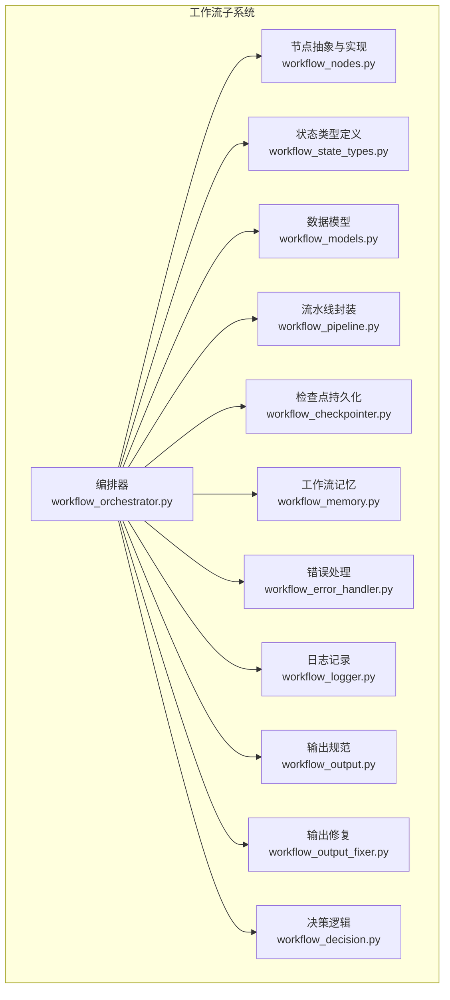
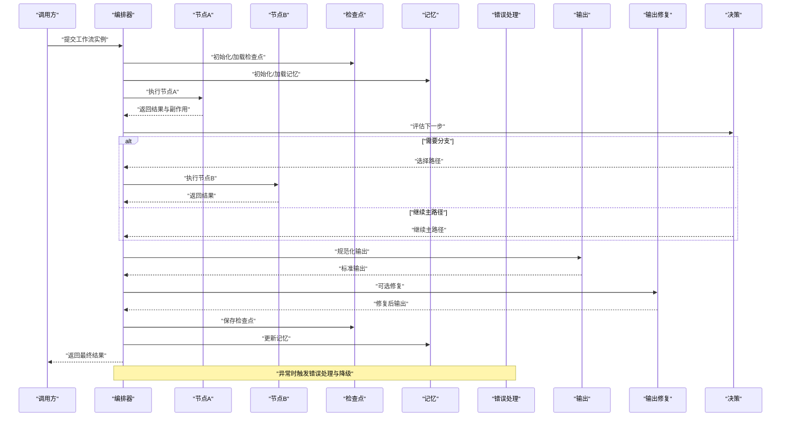
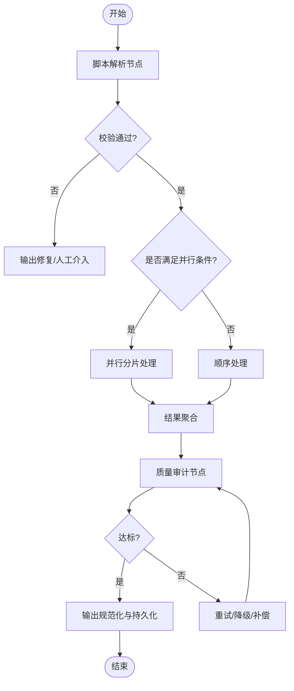
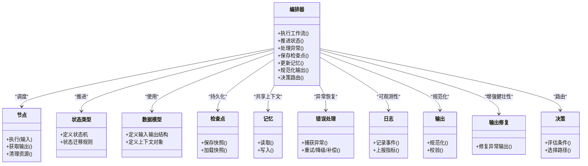

# 工作流定制开发

<cite>
**本文引用的文件**   
- [workflow_orchestrator.py](file://src/penshot/neopen/agent/workflow/workflow_orchestrator.py)
- [workflow_nodes.py](file://src/penshot/neopen/agent/workflow/workflow_nodes.py)
- [workflow_state_types.py](file://src/penshot/neopen/agent/workflow/workflow_state_types.py)
- [workflow_models.py](file://src/penshot/neopen/agent/workflow/workflow_models.py)
- [workflow_pipeline.py](file://src/penshot/neopen/agent/workflow/workflow_pipeline.py)
- [workflow_checkpointer.py](file://src/penshot/neopen/agent/workflow/workflow_checkpointer.py)
- [workflow_memory.py](file://src/penshot/neopen/agent/workflow/workflow_memory.py)
- [workflow_error_handler.py](file://src/penshot/neopen/agent/workflow/workflow_error_handler.py)
- [workflow_logger.py](file://src/penshot/neopen/agent/workflow/workflow_logger.py)
- [workflow_output.py](file://src/penshot/neopen/agent/workflow/workflow_output.py)
- [workflow_output_fixer.py](file://src/penshot/neopen/agent/workflow/workflow_output_fixer.py)
- [workflow_decision.py](file://src/penshot/neopen/agent/workflow/workflow_decision.py)
- [test_workflow_orchestrator.py](file://tests/workflow/test_workflow_orchestrator.py)
</cite>

## 目录
1. [简介](#简介)
2. [项目结构](#项目结构)
3. [核心组件](#核心组件)
4. [架构总览](#架构总览)
5. [详细组件分析](#详细组件分析)
6. [依赖关系分析](#依赖关系分析)
7. [性能考虑](#性能考虑)
8. [故障排查指南](#故障排查指南)
9. [结论](#结论)
10. [附录](#附录)

## 简介
本指南面向需要在视频剪辑代理系统中进行“工作流定制开发”的工程师与产品实现者，围绕自定义节点开发、编排器使用与扩展点、复杂业务场景设计（多步骤脚本处理、条件分支、并行执行）、版本管理与回滚、监控告警、调试与性能优化等方面提供系统化说明。文档以仓库中工作流子系统为核心，结合测试用例与配套模块，给出从概念到落地的完整路径。

## 项目结构
工作流子系统位于 neopen.agent.workflow 包下，采用分层与职责分离的设计：
- 编排层：负责节点调度、状态推进、错误恢复、检查点与记忆等
- 节点层：定义可插拔的节点类型与输入输出契约
- 数据模型与状态：统一的数据结构与状态类型定义
- 辅助能力：日志、决策、输出规范化与修复、错误处理等

图表来源
- [workflow_orchestrator.py](file://src/penshot/neopen/agent/workflow/workflow_orchestrator.py)
- [workflow_nodes.py](file://src/penshot/neopen/agent/workflow/workflow_nodes.py)
- [workflow_state_types.py](file://src/penshot/neopen/agent/workflow/workflow_state_types.py)
- [workflow_models.py](file://src/penshot/neopen/agent/workflow/workflow_models.py)
- [workflow_pipeline.py](file://src/penshot/neopen/agent/workflow/workflow_pipeline.py)
- [workflow_checkpointer.py](file://src/penshot/neopen/agent/workflow/workflow_checkpointer.py)
- [workflow_memory.py](file://src/penshot/neopen/agent/workflow/workflow_memory.py)
- [workflow_error_handler.py](file://src/penshot/neopen/agent/workflow/workflow_error_handler.py)
- [workflow_logger.py](file://src/penshot/neopen/agent/workflow/workflow_logger.py)
- [workflow_output.py](file://src/penshot/neopen/agent/workflow/workflow_output.py)
- [workflow_output_fixer.py](file://src/penshot/neopen/agent/workflow/workflow_output_fixer.py)
- [workflow_decision.py](file://src/penshot/neopen/agent/workflow/workflow_decision.py)

章节来源
- [workflow_orchestrator.py](file://src/penshot/neopen/agent/workflow/workflow_orchestrator.py)
- [workflow_nodes.py](file://src/penshot/neopen/agent/workflow/workflow_nodes.py)
- [workflow_state_types.py](file://src/penshot/neopen/agent/workflow/workflow_state_types.py)
- [workflow_models.py](file://src/penshot/neopen/agent/workflow/workflow_models.py)
- [workflow_pipeline.py](file://src/penshot/neopen/agent/workflow/workflow_pipeline.py)
- [workflow_checkpointer.py](file://src/penshot/neopen/agent/workflow/workflow_checkpointer.py)
- [workflow_memory.py](file://src/penshot/neopen/agent/workflow/workflow_memory.py)
- [workflow_error_handler.py](file://src/penshot/neopen/agent/workflow/workflow_error_handler.py)
- [workflow_logger.py](file://src/penshot/neopen/agent/workflow/workflow_logger.py)
- [workflow_output.py](file://src/penshot/neopen/agent/workflow/workflow_output.py)
- [workflow_output_fixer.py](file://src/penshot/neopen/agent/workflow/workflow_output_fixer.py)
- [workflow_decision.py](file://src/penshot/neopen/agent/workflow/workflow_decision.py)

## 核心组件
- 编排器：负责任务生命周期管理、节点调度、状态推进、异常恢复、检查点与记忆读写、输出规范化与修复、决策路由等
- 节点：定义统一的输入/输出契约与执行接口，支持同步/异步、重试、超时、资源清理等
- 状态与模型：定义工作流运行期状态机、节点执行结果、上下文传递结构等
- 流水线：将多个节点组合为可复用的流程单元，支持顺序、分支、并行等模式
- 检查点与记忆：提供中间状态持久化与跨阶段共享信息的能力
- 错误处理与日志：统一异常捕获、降级策略、可观测性埋点
- 输出与修复：对最终输出进行校验、标准化与自动修复
- 决策：基于规则或外部信号决定下一步执行路径

章节来源
- [workflow_orchestrator.py](file://src/penshot/neopen/agent/workflow/workflow_orchestrator.py)
- [workflow_nodes.py](file://src/penshot/neopen/agent/workflow/workflow_nodes.py)
- [workflow_state_types.py](file://src/penshot/neopen/agent/workflow/workflow_state_types.py)
- [workflow_models.py](file://src/penshot/neopen/agent/workflow/workflow_models.py)
- [workflow_pipeline.py](file://src/penshot/neopen/agent/workflow/workflow_pipeline.py)
- [workflow_checkpointer.py](file://src/penshot/neopen/agent/workflow/workflow_checkpointer.py)
- [workflow_memory.py](file://src/penshot/neopen/agent/workflow/workflow_memory.py)
- [workflow_error_handler.py](file://src/penshot/neopen/agent/workflow/workflow_error_handler.py)
- [workflow_logger.py](file://src/penshot/neopen/agent/workflow/workflow_logger.py)
- [workflow_output.py](file://src/penshot/neopen/agent/workflow/workflow_output.py)
- [workflow_output_fixer.py](file://src/penshot/neopen/agent/workflow/workflow_output_fixer.py)
- [workflow_decision.py](file://src/penshot/neopen/agent/workflow/workflow_decision.py)

## 架构总览
下图展示了工作流在运行时的关键交互：编排器驱动节点执行，通过状态机推进；遇到异常时交由错误处理器处理；必要时写入检查点并更新记忆；最终由输出模块规范化并可选地进行修复；决策模块根据当前状态与策略选择后续路径。

图表来源
- [workflow_orchestrator.py](file://src/penshot/neopen/agent/workflow/workflow_orchestrator.py)
- [workflow_checkpointer.py](file://src/penshot/neopen/agent/workflow/workflow_checkpointer.py)
- [workflow_memory.py](file://src/penshot/neopen/agent/workflow/workflow_memory.py)
- [workflow_error_handler.py](file://src/penshot/neopen/agent/workflow/workflow_error_handler.py)
- [workflow_output.py](file://src/penshot/neopen/agent/workflow/workflow_output.py)
- [workflow_output_fixer.py](file://src/penshot/neopen/agent/workflow/workflow_output_fixer.py)
- [workflow_decision.py](file://src/penshot/neopen/agent/workflow/workflow_decision.py)

## 详细组件分析

### 自定义节点开发指南
- 节点类型定义
  - 明确节点的输入契约（参数、上下文、资源）与输出契约（结构化结果、副作用、元数据）
  - 定义节点的可配置项（如超时、重试次数、并发度、开关）
- 输入输出处理
  - 输入校验：类型、必填字段、范围约束
  - 输出标准化：遵循统一模型，便于下游消费
  - 失败语义：区分可重试与不可重试错误，附带诊断信息
- 状态管理
  - 节点内部状态最小化，优先通过工作流状态与记忆共享
  - 长耗时任务需支持中断与恢复
- 扩展点
  - 钩子：前置/后置处理、指标上报、审计日志
  - 插件式注册：通过工厂或注册表动态发现与加载
- 示例参考
  - 参考现有节点实现风格与接口约定，确保一致性与可维护性

章节来源
- [workflow_nodes.py](file://src/penshot/neopen/agent/workflow/workflow_nodes.py)
- [workflow_models.py](file://src/penshot/neopen/agent/workflow/workflow_models.py)
- [workflow_state_types.py](file://src/penshot/neopen/agent/workflow/workflow_state_types.py)

### 工作流编排器使用方法与扩展点
- 基本用法
  - 创建编排器实例，注入节点、状态、记忆、检查点、错误处理、输出与决策等依赖
  - 提交工作流实例，编排器按状态机推进执行
- 扩展点
  - 自定义决策策略：根据状态与上下文选择分支
  - 自定义错误处理：重试、降级、补偿、告警
  - 自定义输出规范与修复：增强健壮性与一致性
  - 自定义检查点与记忆：适配不同存储后端
- 编排模式
  - 顺序：线性执行
  - 分支：条件路由
  - 并行：并发执行与合并
  - 循环：迭代直至收敛或达到上限

章节来源
- [workflow_orchestrator.py](file://src/penshot/neopen/agent/workflow/workflow_orchestrator.py)
- [workflow_decision.py](file://src/penshot/neopen/agent/workflow/workflow_decision.py)
- [workflow_error_handler.py](file://src/penshot/neopen/agent/workflow/workflow_error_handler.py)
- [workflow_output.py](file://src/penshot/neopen/agent/workflow/workflow_output.py)
- [workflow_output_fixer.py](file://src/penshot/neopen/agent/workflow/workflow_output_fixer.py)
- [workflow_checkpointer.py](file://src/penshot/neopen/agent/workflow/workflow_checkpointer.py)
- [workflow_memory.py](file://src/penshot/neopen/agent/workflow/workflow_memory.py)

### 复杂业务场景设计示例
- 多步骤脚本处理
  - 设计思路：将脚本解析、转换、验证、生成等拆分为独立节点，通过编排器串联
  - 关键点：每步输出标准化，失败快速失败或进入修复路径
- 条件分支处理
  - 设计思路：在关键节点后接入决策节点，依据质量评分、规则命中等选择不同路径
  - 关键点：分支策略可配置，支持热更新
- 并行执行
  - 设计思路：对可并行的子任务（如分片处理）使用并行节点，完成后聚合结果
  - 关键点：控制并发度、资源隔离、结果合并与去重

图表来源
- [workflow_orchestrator.py](file://src/penshot/neopen/agent/workflow/workflow_orchestrator.py)
- [workflow_decision.py](file://src/penshot/neopen/agent/workflow/workflow_decision.py)
- [workflow_output.py](file://src/penshot/neopen/agent/workflow/workflow_output.py)
- [workflow_output_fixer.py](file://src/penshot/neopen/agent/workflow/workflow_output_fixer.py)
- [workflow_error_handler.py](file://src/penshot/neopen/agent/workflow/workflow_error_handler.py)

### 版本管理与回滚机制
- 版本管理
  - 工作流定义与节点实现应带版本号，支持灰度发布与兼容策略
  - 通过配置中心或注册表切换版本，保证运行时平滑升级
- 回滚机制
  - 基于检查点：在关键里程碑保存快照，失败时可恢复到最近稳定点
  - 基于记忆：保留必要上下文，避免重复计算
  - 回滚策略：全量回滚或部分回滚，配合补偿操作保证一致性

章节来源
- [workflow_checkpointer.py](file://src/penshot/neopen/agent/workflow/workflow_checkpointer.py)
- [workflow_memory.py](file://src/penshot/neopen/agent/workflow/workflow_memory.py)
- [workflow_orchestrator.py](file://src/penshot/neopen/agent/workflow/workflow_orchestrator.py)

### 监控告警与可观测性
- 指标采集
  - 节点级：执行时长、成功率、重试次数、错误码分布
  - 流程级：端到端延迟、吞吐、瓶颈节点识别
- 日志与追踪
  - 统一日志格式，关联工作流ID与节点ID
  - 关键路径打点，支持链路追踪
- 告警策略
  - 阈值告警：错误率、延迟、资源占用
  - 趋势告警：异常增长、退化检测
  - 通知渠道：邮件、IM、监控系统集成

章节来源
- [workflow_logger.py](file://src/penshot/neopen/agent/workflow/workflow_logger.py)
- [workflow_orchestrator.py](file://src/penshot/neopen/agent/workflow/workflow_orchestrator.py)

### 调试与最佳实践
- 调试技巧
  - 启用详细日志与断点，定位失败节点与输入输出
  - 使用检查点回放，复现问题
  - 构造最小可复现场景，隔离变量
- 最佳实践
  - 幂等设计：节点可安全重试
  - 超时与熔断：防止雪崩
  - 资源管理：显式释放，避免泄漏
  - 单元测试与集成测试：覆盖正常、异常与边界路径

章节来源
- [workflow_logger.py](file://src/penshot/neopen/agent/workflow/workflow_logger.py)
- [workflow_checkpointer.py](file://src/penshot/neopen/agent/workflow/workflow_checkpointer.py)
- [workflow_error_handler.py](file://src/penshot/neopen/agent/workflow/workflow_error_handler.py)

## 依赖关系分析
工作流子系统内部耦合清晰，编排器作为中枢协调各组件，节点与模型解耦，检查点与记忆可替换，错误处理与日志可插拔。

图表来源
- [workflow_orchestrator.py](file://src/penshot/neopen/agent/workflow/workflow_orchestrator.py)
- [workflow_nodes.py](file://src/penshot/neopen/agent/workflow/workflow_nodes.py)
- [workflow_state_types.py](file://src/penshot/neopen/agent/workflow/workflow_state_types.py)
- [workflow_models.py](file://src/penshot/neopen/agent/workflow/workflow_models.py)
- [workflow_checkpointer.py](file://src/penshot/neopen/agent/workflow/workflow_checkpointer.py)
- [workflow_memory.py](file://src/penshot/neopen/agent/workflow/workflow_memory.py)
- [workflow_error_handler.py](file://src/penshot/neopen/agent/workflow/workflow_error_handler.py)
- [workflow_logger.py](file://src/penshot/neopen/agent/workflow/workflow_logger.py)
- [workflow_output.py](file://src/penshot/neopen/agent/workflow/workflow_output.py)
- [workflow_output_fixer.py](file://src/penshot/neopen/agent/workflow/workflow_output_fixer.py)
- [workflow_decision.py](file://src/penshot/neopen/agent/workflow/workflow_decision.py)

章节来源
- [workflow_orchestrator.py](file://src/penshot/neopen/agent/workflow/workflow_orchestrator.py)
- [workflow_nodes.py](file://src/penshot/neopen/agent/workflow/workflow_nodes.py)
- [workflow_state_types.py](file://src/penshot/neopen/agent/workflow/workflow_state_types.py)
- [workflow_models.py](file://src/penshot/neopen/agent/workflow/workflow_models.py)
- [workflow_checkpointer.py](file://src/penshot/neopen/agent/workflow/workflow_checkpointer.py)
- [workflow_memory.py](file://src/penshot/neopen/agent/workflow/workflow_memory.py)
- [workflow_error_handler.py](file://src/penshot/neopen/agent/workflow/workflow_error_handler.py)
- [workflow_logger.py](file://src/penshot/neopen/agent/workflow/workflow_logger.py)
- [workflow_output.py](file://src/penshot/neopen/agent/workflow/workflow_output.py)
- [workflow_output_fixer.py](file://src/penshot/neopen/agent/workflow/workflow_output_fixer.py)
- [workflow_decision.py](file://src/penshot/neopen/agent/workflow/workflow_decision.py)

## 性能考虑
- 并发与并行
  - 合理设置并发度，避免资源争用
  - 对可并行任务拆分，缩短端到端延迟
- 缓存与复用
  - 利用记忆缓存中间结果，减少重复计算
  - 对热点数据进行本地或分布式缓存
- I/O与序列化
  - 批量写入检查点与日志，降低系统调用开销
  - 使用高效序列化格式，减少网络与磁盘压力
- 资源隔离与限流
  - 对重型节点进行资源配额与限流
  - 使用熔断与退避策略保护系统稳定性
- 监控与调优
  - 基于指标定位瓶颈，持续优化关键路径

[本节为通用指导，不直接分析具体文件]

## 故障排查指南
- 常见问题定位
  - 节点执行失败：查看节点日志与输入输出，确认是否可重试
  - 状态卡住：检查状态迁移规则与决策条件
  - 输出异常：使用输出修复与规范化模块定位问题
- 恢复策略
  - 基于检查点回滚到最近稳定点
  - 使用记忆恢复上下文，避免从头执行
- 工具与技巧
  - 开启详细日志与追踪，关联工作流ID
  - 构造最小复现场景，逐步缩小范围

章节来源
- [workflow_error_handler.py](file://src/penshot/neopen/agent/workflow/workflow_error_handler.py)
- [workflow_logger.py](file://src/penshot/neopen/agent/workflow/workflow_logger.py)
- [workflow_checkpointer.py](file://src/penshot/neopen/agent/workflow/workflow_checkpointer.py)
- [workflow_output.py](file://src/penshot/neopen/agent/workflow/workflow_output.py)
- [workflow_output_fixer.py](file://src/penshot/neopen/agent/workflow/workflow_output_fixer.py)

## 结论
通过本指南，您可以掌握在工作流子系统中进行定制开发的关键要点：定义清晰的节点契约、使用编排器进行灵活编排、设计稳健的状态与错误处理机制、实现版本管理与回滚、完善监控告警与调试手段，并在复杂业务场景中应用顺序、分支与并行模式。建议结合测试用例与最佳实践，持续优化性能与可靠性。

[本节为总结，不直接分析具体文件]

## 附录
- 参考测试用例
  - 编排器行为与边界条件的验证有助于理解正确用法与预期行为

章节来源
- [test_workflow_orchestrator.py](file://tests/workflow/test_workflow_orchestrator.py)