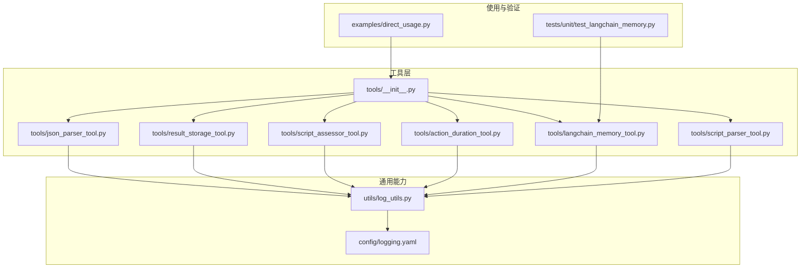
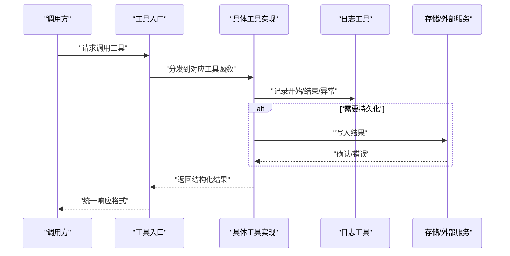
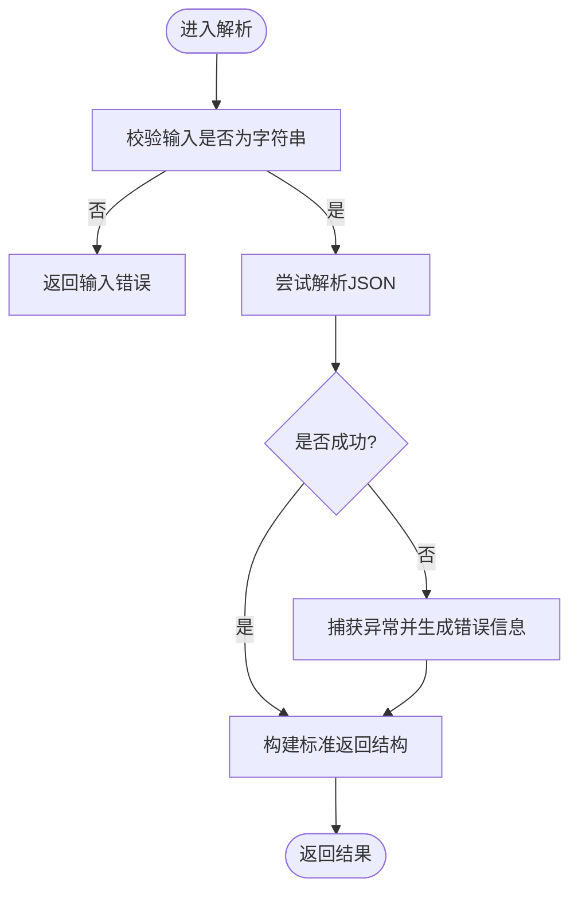
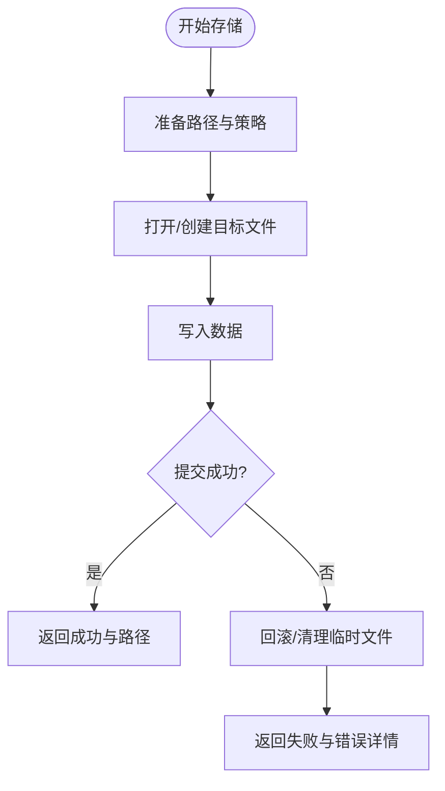
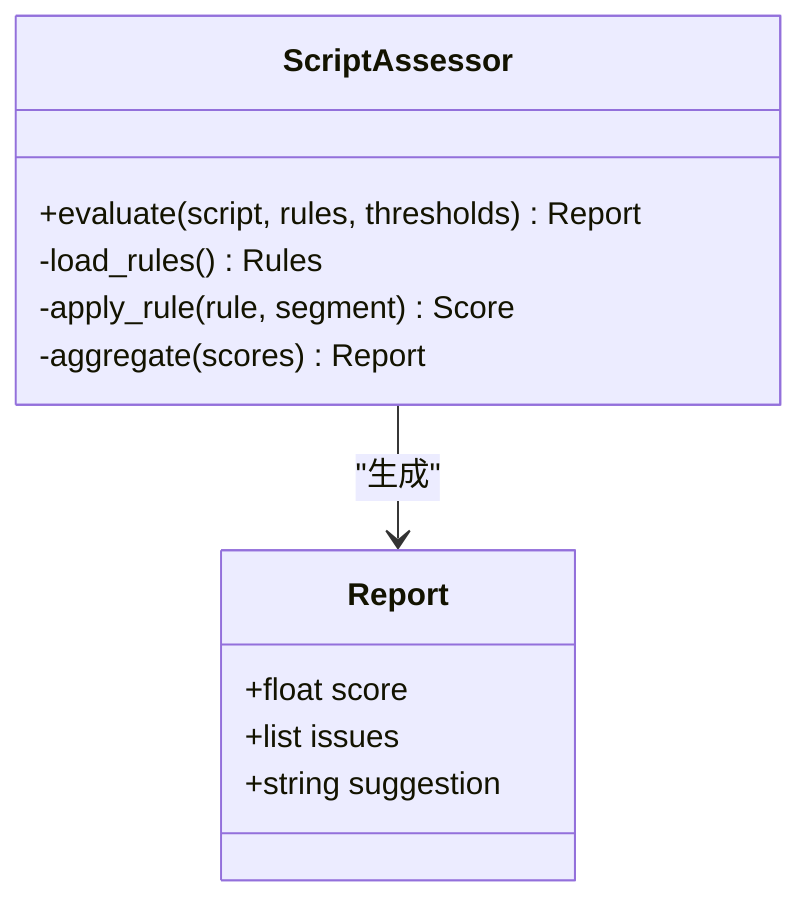
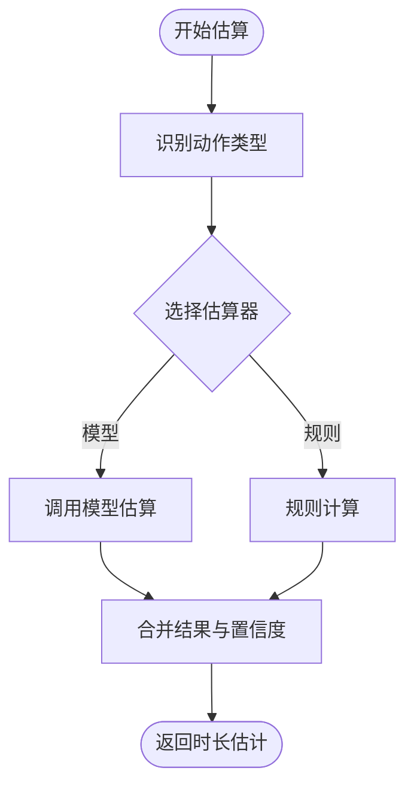
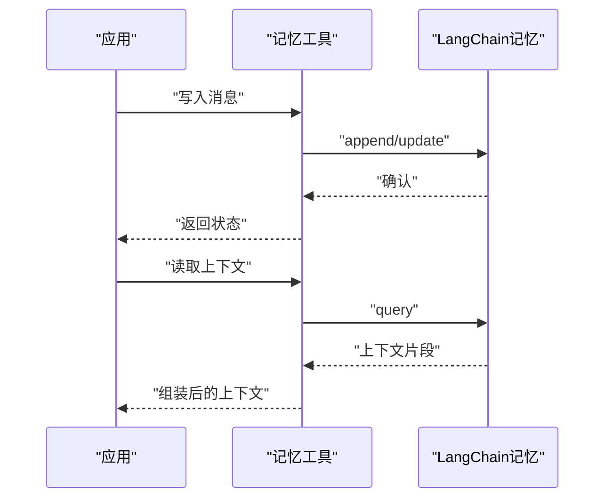
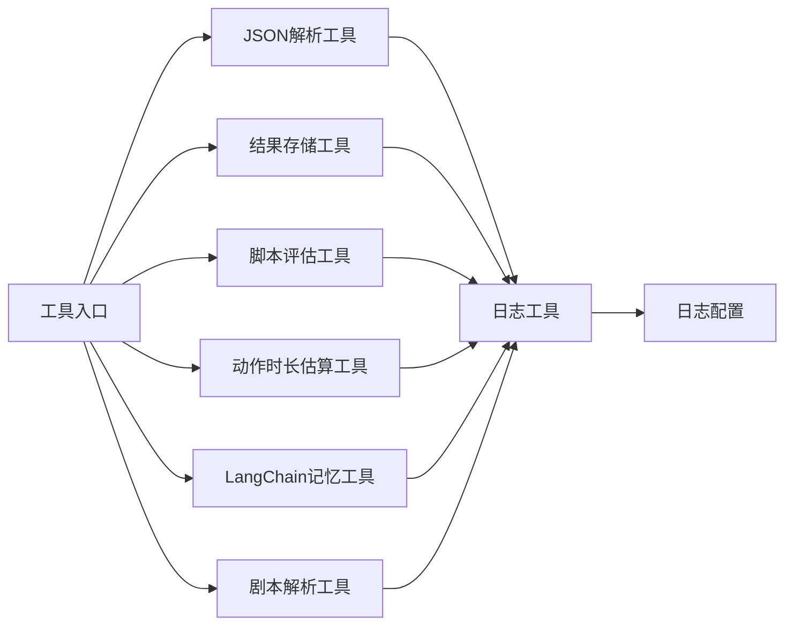

# 工具扩展开发

<cite>
**本文引用的文件**   
- [src/penshot/neopen/tools/__init__.py](file://src/penshot/neopen/tools/__init__.py)
- [src/penshot/neopen/tools/json_parser_tool.py](file://src/penshot/neopen/tools/json_parser_tool.py)
- [src/penshot/neopen/tools/result_storage_tool.py](file://src/penshot/neopen/tools/result_storage_tool.py)
- [src/penshot/neopen/tools/script_assessor_tool.py](file://src/penshot/neopen/tools/script_assessor_tool.py)
- [src/penshot/neopen/tools/action_duration_tool.py](file://src/penshot/neopen/tools/action_duration_tool.py)
- [src/penshot/neopen/tools/langchain_memory_tool.py](file://src/penshot/neopen/tools/langchain_memory_tool.py)
- [src/penshot/neopen/tools/script_parser_tool.py](file://src/penshot/neopen/tools/script_parser_tool.py)
- [src/penshot/utils/log_utils.py](file://src/penshot/utils/log_utils.py)
- [src/penshot/config/logging.yaml](file://src/penshot/config/logging.yaml)
- [examples/direct_usage.py](file://examples/direct_usage.py)
- [tests/unit/test_langchain_memory.py](file://tests/unit/test_langchain_memory.py)
</cite>

## 目录
1. [简介](#简介)
2. [项目结构](#项目结构)
3. [核心组件](#核心组件)
4. [架构总览](#架构总览)
5. [详细组件分析](#详细组件分析)
6. [依赖分析](#依赖分析)
7. [性能考虑](#性能考虑)
8. [故障排查指南](#故障排查指南)
9. [结论](#结论)
10. [附录](#附录)

## 简介
本指南面向希望为系统扩展“工具”能力的开发者，系统性说明如何定义、注册和使用自定义工具函数。内容涵盖：
- 工具函数的定义规范（参数校验、返回值格式、错误处理）
- 工具的注册机制与发现方式
- 典型工具示例：JSON解析、结果存储、脚本评估等
- 日志记录与可观测性
- 性能优化建议
- 测试与调试方法

## 项目结构
工具相关代码集中在 neopen.tools 包中，并通过统一的入口进行导出；通用能力（如日志）位于 utils 与 config 下；示例与测试分别位于 examples 与 tests 目录。

图表来源
- [src/penshot/neopen/tools/__init__.py](file://src/penshot/neopen/tools/__init__.py)
- [src/penshot/neopen/tools/json_parser_tool.py](file://src/penshot/neopen/tools/json_parser_tool.py)
- [src/penshot/neopen/tools/result_storage_tool.py](file://src/penshot/neopen/tools/result_storage_tool.py)
- [src/penshot/neopen/tools/script_assessor_tool.py](file://src/penshot/neopen/tools/script_assessor_tool.py)
- [src/penshot/neopen/tools/action_duration_tool.py](file://src/penshot/neopen/tools/action_duration_tool.py)
- [src/penshot/neopen/tools/langchain_memory_tool.py](file://src/penshot/neopen/tools/langchain_memory_tool.py)
- [src/penshot/neopen/tools/script_parser_tool.py](file://src/penshot/neopen/tools/script_parser_tool.py)
- [src/penshot/utils/log_utils.py](file://src/penshot/utils/log_utils.py)
- [src/penshot/config/logging.yaml](file://src/penshot/config/logging.yaml)
- [examples/direct_usage.py](file://examples/direct_usage.py)
- [tests/unit/test_langchain_memory.py](file://tests/unit/test_langchain_memory.py)

章节来源
- [src/penshot/neopen/tools/__init__.py](file://src/penshot/neopen/tools/__init__.py)
- [src/penshot/utils/log_utils.py](file://src/penshot/utils/log_utils.py)
- [src/penshot/config/logging.yaml](file://src/penshot/config/logging.yaml)
- [examples/direct_usage.py](file://examples/direct_usage.py)
- [tests/unit/test_langchain_memory.py](file://tests/unit/test_langchain_memory.py)

## 核心组件
- 工具包入口：负责统一导出各工具模块，便于上层按名称或接口调用。
- JSON解析工具：提供对输入字符串的健壮解析能力，包含错误捕获与结构化返回。
- 结果存储工具：将工具执行结果持久化到文件系统或外部存储，支持路径配置与幂等写入。
- 脚本评估工具：对脚本内容进行静态检查或规则评估，输出评估报告。
- 动作时长估算工具：基于规则或模型估算动作持续时间，供调度与规划使用。
- LangChain记忆工具：与LangChain记忆系统集成，读写对话上下文。
- 剧本解析工具：将自然语言/结构化文本解析为标准化中间表示。

章节来源
- [src/penshot/neopen/tools/json_parser_tool.py](file://src/penshot/neopen/tools/json_parser_tool.py)
- [src/penshot/neopen/tools/result_storage_tool.py](file://src/penshot/neopen/tools/result_storage_tool.py)
- [src/penshot/neopen/tools/script_assessor_tool.py](file://src/penshot/neopen/tools/script_assessor_tool.py)
- [src/penshot/neopen/tools/action_duration_tool.py](file://src/penshot/neopen/tools/action_duration_tool.py)
- [src/penshot/neopen/tools/langchain_memory_tool.py](file://src/penshot/neopen/tools/langchain_memory_tool.py)
- [src/penshot/neopen/tools/script_parser_tool.py](file://src/penshot/neopen/tools/script_parser_tool.py)

## 架构总览
工具层的总体设计遵循“高内聚、低耦合”的原则：每个工具聚焦单一职责，通过入口集中暴露；工具内部复用通用日志与配置能力；上层应用通过统一接口按需调用。

图表来源
- [src/penshot/neopen/tools/__init__.py](file://src/penshot/neopen/tools/__init__.py)
- [src/penshot/utils/log_utils.py](file://src/penshot/utils/log_utils.py)
- [src/penshot/neopen/tools/result_storage_tool.py](file://src/penshot/neopen/tools/result_storage_tool.py)

## 详细组件分析

### JSON解析工具
- 功能要点
  - 接收原始字符串，尝试多种策略解析为结构化对象
  - 对非法输入进行容错处理，返回明确的错误信息
  - 输出包含解析结果与元数据（如来源、时间戳）
- 参数与返回约定
  - 输入：待解析字符串、可选模式/选项
  - 输出：标准字典结构，包含 data、error、meta 字段
- 错误处理
  - 捕获解析异常并转换为统一错误码
  - 记录关键上下文以便定位问题
- 性能考量
  - 避免重复解析，必要时缓存中间结果
  - 大文本分块解析以降低内存峰值

图表来源
- [src/penshot/neopen/tools/json_parser_tool.py](file://src/penshot/neopen/tools/json_parser_tool.py)

章节来源
- [src/penshot/neopen/tools/json_parser_tool.py](file://src/penshot/neopen/tools/json_parser_tool.py)

### 结果存储工具
- 功能要点
  - 将任意序列化后的结果写入指定位置（本地文件或远程存储）
  - 支持路径模板、自动创建目录、覆盖/追加策略
- 参数与返回约定
  - 输入：数据对象、目标路径、写入策略
  - 输出：写入状态、落盘路径、错误信息
- 错误处理
  - 对IO异常进行捕获与重试（可配置）
  - 失败时保留部分日志与回滚提示
- 性能考量
  - 批量写入时使用缓冲
  - 大对象采用流式写入降低内存占用

图表来源
- [src/penshot/neopen/tools/result_storage_tool.py](file://src/penshot/neopen/tools/result_storage_tool.py)

章节来源
- [src/penshot/neopen/tools/result_storage_tool.py](file://src/penshot/neopen/tools/result_storage_tool.py)

### 脚本评估工具
- 功能要点
  - 对脚本内容进行规则检查、质量评分、风险提示
  - 支持多策略组合与权重汇总
- 参数与返回约定
  - 输入：脚本文本、评估规则集、阈值
  - 输出：评估报告（分数、问题列表、建议）
- 错误处理
  - 规则加载失败时降级为默认规则
  - 单条规则异常不影响整体评估流程
- 性能考量
  - 规则匹配尽量向量化/批量化
  - 长文本分段评估，合并结果

图表来源
- [src/penshot/neopen/tools/script_assessor_tool.py](file://src/penshot/neopen/tools/script_assessor_tool.py)

章节来源
- [src/penshot/neopen/tools/script_assessor_tool.py](file://src/penshot/neopen/tools/script_assessor_tool.py)

### 动作时长估算工具
- 功能要点
  - 根据动作类型、上下文信息估算持续时间
  - 支持规则与模型两种估算器，可切换
- 参数与返回约定
  - 输入：动作描述、上下文特征
  - 输出：时长估计值及置信度
- 错误处理
  - 模型不可用时回退到规则估算
  - 异常时返回默认区间与警告
- 性能考量
  - 缓存常见动作的估算结果
  - 并行估算多个动作以提升吞吐

图表来源
- [src/penshot/neopen/tools/action_duration_tool.py](file://src/penshot/neopen/tools/action_duration_tool.py)

章节来源
- [src/penshot/neopen/tools/action_duration_tool.py](file://src/penshot/neopen/tools/action_duration_tool.py)

### LangChain记忆工具
- 功能要点
  - 封装LangChain记忆接口的读写操作
  - 提供会话级上下文管理
- 参数与返回约定
  - 输入：会话ID、消息/片段、操作类型
  - 输出：操作结果与最新上下文摘要
- 错误处理
  - 连接失败时重试与降级
  - 记录关键上下文用于排障
- 性能考量
  - 批量更新减少往返
  - 合理设置过期与压缩策略

图表来源
- [src/penshot/neopen/tools/langchain_memory_tool.py](file://src/penshot/neopen/tools/langchain_memory_tool.py)

章节来源
- [src/penshot/neopen/tools/langchain_memory_tool.py](file://src/penshot/neopen/tools/langchain_memory_tool.py)
- [tests/unit/test_langchain_memory.py](file://tests/unit/test_langchain_memory.py)

### 剧本解析工具
- 功能要点
  - 将非结构化/半结构化文本解析为标准化的剧本中间表示
  - 支持多种解析策略（规则、LLM）
- 参数与返回约定
  - 输入：原始文本、解析策略、选项
  - 输出：标准化结构体（场景、镜头、台词等）
- 错误处理
  - 解析失败时返回部分结果与错误明细
  - 记录解析过程的关键断点
- 性能考量
  - 增量解析与流式输出
  - 结果缓存与去重

章节来源
- [src/penshot/neopen/tools/script_parser_tool.py](file://src/penshot/neopen/tools/script_parser_tool.py)

## 依赖分析
- 工具间关系
  - 工具入口集中导出，降低上层耦合
  - 工具普遍依赖日志工具，保证可观测性
  - 结果存储工具可作为其他工具的下游依赖
- 外部依赖
  - 日志配置由配置文件驱动
  - 记忆工具依赖LangChain生态

图表来源
- [src/penshot/neopen/tools/__init__.py](file://src/penshot/neopen/tools/__init__.py)
- [src/penshot/utils/log_utils.py](file://src/penshot/utils/log_utils.py)
- [src/penshot/config/logging.yaml](file://src/penshot/config/logging.yaml)

章节来源
- [src/penshot/neopen/tools/__init__.py](file://src/penshot/neopen/tools/__init__.py)
- [src/penshot/utils/log_utils.py](file://src/penshot/utils/log_utils.py)
- [src/penshot/config/logging.yaml](file://src/penshot/config/logging.yaml)

## 性能考虑
- 解析与评估类工具
  - 优先使用流式/分块处理，避免一次性加载大文本
  - 对热点数据进行缓存，注意失效策略
- 存储类工具
  - 批量写入与异步落盘结合，提升吞吐
  - 大对象采用分片与压缩
- 记忆类工具
  - 控制上下文长度，定期压缩或摘要
  - 合理设置TTL与淘汰策略
- 通用优化
  - 避免在热路径中进行I/O阻塞操作
  - 使用连接池与资源复用
  - 监控关键指标（耗时、错误率、内存峰值）

[本节为通用指导，不直接分析具体文件]

## 故障排查指南
- 日志记录
  - 所有工具应使用统一日志工具记录关键步骤与异常
  - 日志级别建议：INFO用于正常流程，ERROR用于异常与失败路径
- 常见问题定位
  - JSON解析失败：检查输入编码与格式，查看错误码与上下文
  - 存储失败：检查路径权限、磁盘空间、网络连通性
  - 记忆读写失败：检查后端连接、认证、配额限制
- 调试技巧
  - 开启更详细的日志输出
  - 使用最小复现用例隔离问题
  - 对关键路径添加埋点与计时

章节来源
- [src/penshot/utils/log_utils.py](file://src/penshot/utils/log_utils.py)
- [src/penshot/config/logging.yaml](file://src/penshot/config/logging.yaml)

## 结论
通过统一的工具入口、清晰的参数与返回约定、完善的错误处理与日志记录，以及合理的性能优化策略，可以高效地扩展与维护工具能力。建议在新增工具时严格遵循本指南的规范，并结合示例与测试方法进行验证。

[本节为总结性内容，不直接分析具体文件]

## 附录

### 工具定义规范（最佳实践清单）
- 命名与职责
  - 单一职责，命名清晰表达功能
- 参数校验
  - 对必填参数进行存在性与类型校验
  - 对范围/格式进行约束（如正则、枚举）
- 返回值格式
  - 统一结构：data、error、meta
  - error为空表示成功，否则包含错误码与消息
- 错误处理
  - 捕获并转换异常为统一错误类型
  - 记录必要上下文，避免泄露敏感信息
- 日志记录
  - 记录入参摘要、关键分支、异常堆栈
  - 使用结构化日志便于检索与分析
- 性能优化
  - 避免不必要的I/O与重复计算
  - 合理使用缓存与并发
- 可测试性
  - 纯函数优先，易于单元测试
  - 对外部依赖注入，便于Mock

[本节为通用指导，不直接分析具体文件]

### 工具注册与使用方式
- 注册机制
  - 在工具入口中集中导入并导出各工具模块
  - 可按需暴露工厂函数或路由表，便于动态发现
- 使用方式
  - 从入口导入所需工具
  - 构造参数并调用，获取统一结构的返回
  - 结合示例进行集成验证

章节来源
- [src/penshot/neopen/tools/__init__.py](file://src/penshot/neopen/tools/__init__.py)
- [examples/direct_usage.py](file://examples/direct_usage.py)

### 实际示例参考
- JSON解析工具
  - 关注点：容错解析、错误码、元数据
  - 参考路径：[json_parser_tool.py](file://src/penshot/neopen/tools/json_parser_tool.py)
- 结果存储工具
  - 关注点：路径模板、幂等写入、失败重试
  - 参考路径：[result_storage_tool.py](file://src/penshot/neopen/tools/result_storage_tool.py)
- 脚本评估工具
  - 关注点：规则组合、评分聚合、建议生成
  - 参考路径：[script_assessor_tool.py](file://src/penshot/neopen/tools/script_assessor_tool.py)
- 动作时长估算工具
  - 关注点：估算器切换、置信度、缓存
  - 参考路径：[action_duration_tool.py](file://src/penshot/neopen/tools/action_duration_tool.py)
- LangChain记忆工具
  - 关注点：会话上下文、读写一致性、压缩
  - 参考路径：[langchain_memory_tool.py](file://src/penshot/neopen/tools/langchain_memory_tool.py)
  - 测试参考：[test_langchain_memory.py](file://tests/unit/test_langchain_memory.py)
- 剧本解析工具
  - 关注点：多策略解析、增量处理、结果标准化
  - 参考路径：[script_parser_tool.py](file://src/penshot/neopen/tools/script_parser_tool.py)