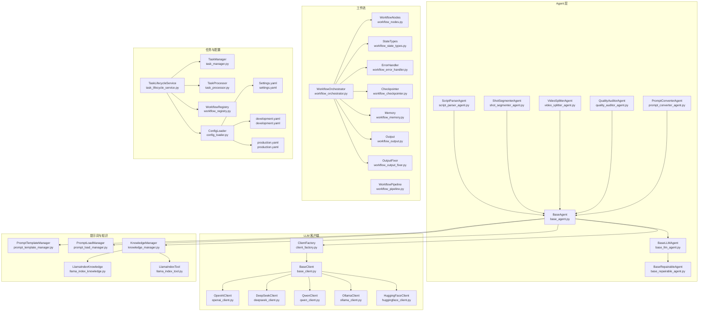
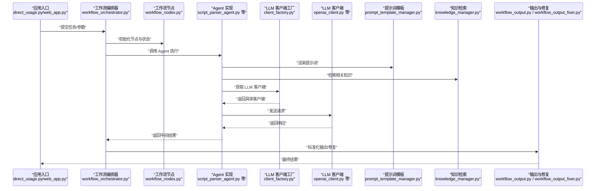
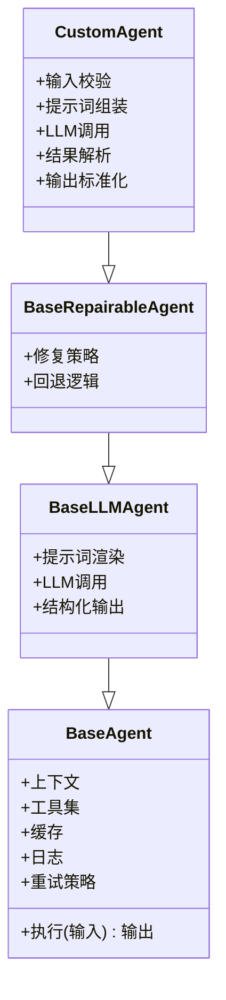
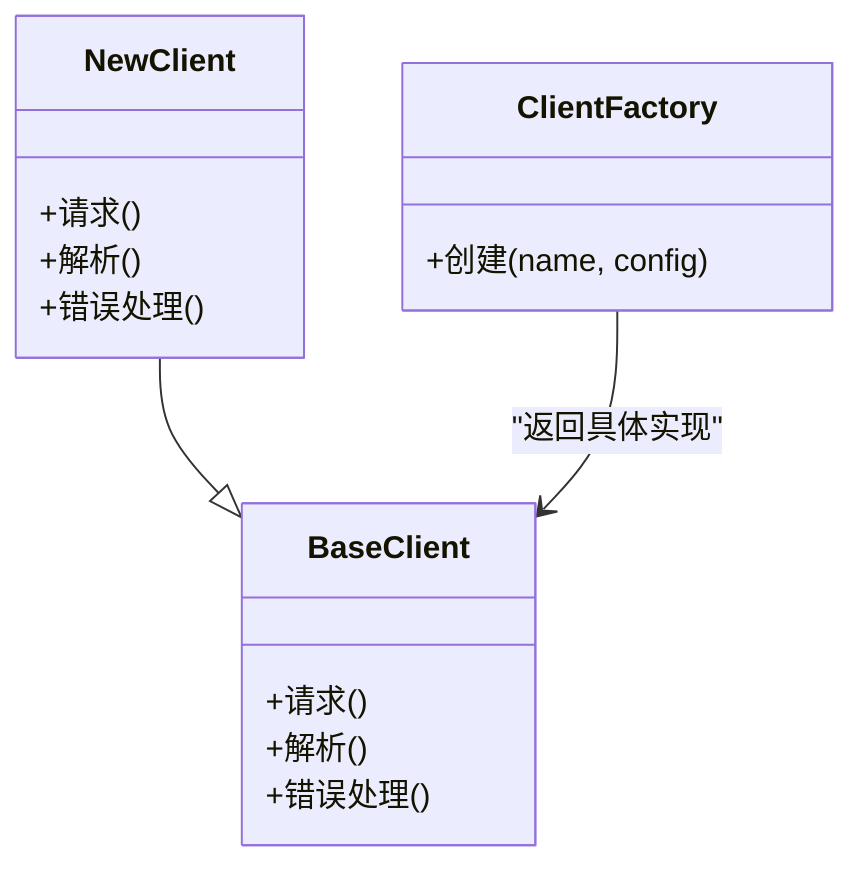
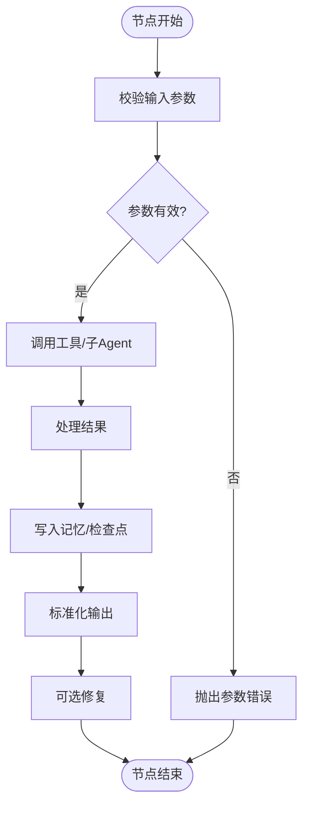
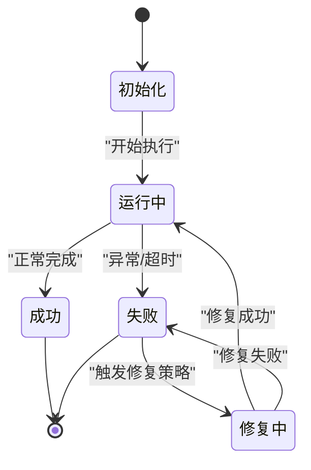
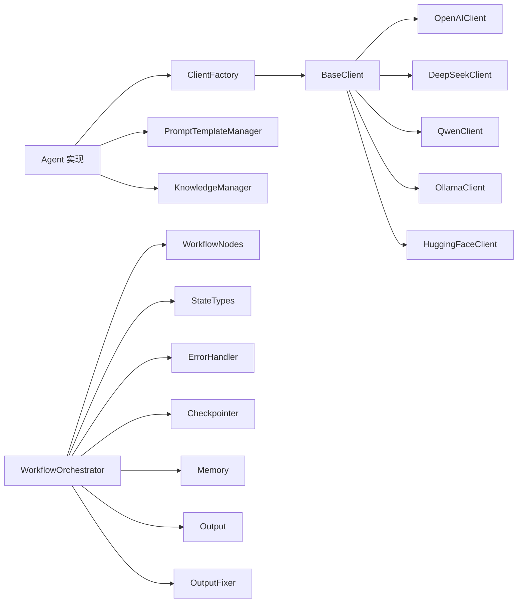

# 扩展开发

<cite>
**本文引用的文件**   
- [base_agent.py](file://src/penshot/neopen/agent/base_agent.py)
- [base_llm_agent.py](file://src/penshot/neopen/agent/base_llm_agent.py)
- [base_repairable_agent.py](file://src/penshot/neopen/agent/base_repairable_agent.py)
- [prompt_converter_agent.py](file://src/penshot/neopen/agent/prompt_converter_agent.py)
- [quality_auditor_agent.py](file://src/penshot/neopen/agent/quality_auditor_agent.py)
- [script_parser_agent.py](file://src/penshot/neopen/agent/script_parser_agent.py)
- [shot_segmenter_agent.py](file://src/penshot/neopen/agent/shot_segmenter_agent.py)
- [video_splitter_agent.py](file://src/penshot/neopen/agent/video_splitter_agent.py)
- [workflow_orchestrator.py](file://src/penshot/neopen/agent/workflow/workflow_orchestrator.py)
- [workflow_nodes.py](file://src/penshot/neopen/agent/workflow/workflow_nodes.py)
- [workflow_pipeline.py](file://src/penshot/neopen/agent/workflow/workflow_pipeline.py)
- [workflow_state_types.py](file://src/penshot/neopen/agent/workflow/workflow_state_types.py)
- [workflow_error_handler.py](file://src/penshot/neopen/agent/workflow/workflow_error_handler.py)
- [workflow_checkpointer.py](file://src/penshot/neopen/agent/workflow/workflow_checkpointer.py)
- [workflow_memory.py](file://src/penshot/neopen/agent/workflow/workflow_memory.py)
- [workflow_output.py](file://src/penshot/neopen/agent/workflow/workflow_output.py)
- [workflow_output_fixer.py](file://src/penshot/neopen/agent/workflow/workflow_output_fixer.py)
- [client_factory.py](file://src/penshot/neopen/client/client_factory.py)
- [base_client.py](file://src/penshot/neopen/client/base_client.py)
- [openai_client.py](file://src/penshot/neopen/client/openai_client.py)
- [deepseek_client.py](file://src/penshot/neopen/client/deepseek_client.py)
- [qwen_client.py](file://src/penshot/neopen/client/qwen_client.py)
- [ollama_client.py](file://src/penshot/neopen/client/ollama_client.py)
- [huggingface_client.py](file://src/penshot/neopen/client/huggingface_client.py)
- [prompt_template_manager.py](file://src/penshot/neopen/prompts/prompt_template_manager.py)
- [prompt_load_manager.py](file://src/penshot/neopen/prompts/prompt_load_manager.py)
- [knowledge_manager.py](file://src/penshot/neopen/knowledge/knowledge_manager.py)
- [llama_index_knowledge.py](file://src/penshot/neopen/knowledge/llamaIndex/llama_index_knowledge.py)
- [llama_index_tool.py](file://src/penshot/neopen/knowledge/llamaIndex/llama_index_tool.py)
- [task_lifecycle_service.py](file://src/penshot/neopen/task/task_lifecycle_service.py)
- [task_manager.py](file://src/penshot/neopen/task/task_manager.py)
- [task_processor.py](file://src/penshot/neopen/task/task_processor.py)
- [workflow_registry.py](file://src/penshot/neopen/task/workflow_registry.py)
- [config_loader.py](file://src/penshot/neopen/config/config_loader.py)
- [settings.yaml](file://src/penshot/neopen/config/settings.yaml)
- [development.yaml](file://src/penshot/neopen/config/env/development.yaml)
- [production.yaml](file://src/penshot/neopen/config/env/production.yaml)
- [direct_usage.py](file://examples/direct_usage.py)
- [web_app.py](file://examples/web_app.py)
</cite>

## 目录
1. [简介](#简介)
2. [项目结构](#项目结构)
3. [核心组件](#核心组件)
4. [架构总览](#架构总览)
5. [详细组件分析](#详细组件分析)
6. [依赖关系分析](#依赖关系分析)
7. [性能考虑](#性能考虑)
8. [故障排查指南](#故障排查指南)
9. [结论](#结论)
10. [附录](#附录)

## 简介
本指南面向希望为 Video Shot Agent 开发自定义 Agent、工作流节点与插件的开发者。内容涵盖：
- 如何继承 BaseAgent 基类并实现必要接口，完成自定义 Agent 的开发与注册
- 插件机制的使用方法：工具库扩展、LLM 客户端集成、提示词模板定制
- 工作流节点的详细开发指南（状态、节点、编排、检查点、记忆、输出）
- 完整的扩展示例路径与最佳实践
- 扩展的生命周期管理与错误处理机制

## 项目结构
本项目采用分层与按功能域组织相结合的结构：
- agent：Agent 抽象与具体实现（脚本解析、分镜分割、视频拆分、质量审计、提示词转换等），以及工作流编排
- client：LLM 客户端抽象与各厂商实现（OpenAI、DeepSeek、Qwen、Ollama、HuggingFace）
- prompts：提示词模板管理与加载
- knowledge：知识检索与工具封装（LlamaIndex 集成）
- task：任务生命周期管理、工作流注册与处理器
- config：配置加载与环境配置
- examples：示例用法（直接调用、Web 应用、A2A/MCP 集成等）

图表来源
- [base_agent.py:1-200](file://src/penshot/neopen/agent/base_agent.py#L1-L200)
- [base_llm_agent.py:1-200](file://src/penshot/neopen/agent/base_llm_agent.py#L1-L200)
- [base_repairable_agent.py:1-200](file://src/penshot/neopen/agent/base_repairable_agent.py#L1-L200)
- [workflow_orchestrator.py:1-200](file://src/penshot/neopen/agent/workflow/workflow_orchestrator.py#L1-L200)
- [workflow_nodes.py:1-200](file://src/penshot/neopen/agent/workflow/workflow_nodes.py#L1-L200)
- [workflow_state_types.py:1-200](file://src/penshot/neopen/agent/workflow/workflow_state_types.py#L1-L200)
- [workflow_error_handler.py:1-200](file://src/penshot/neopen/agent/workflow/workflow_error_handler.py#L1-L200)
- [workflow_checkpointer.py:1-200](file://src/penshot/neopen/agent/workflow/workflow_checkpointer.py#L1-L200)
- [workflow_memory.py:1-200](file://src/penshot/neopen/agent/workflow/workflow_memory.py#L1-L200)
- [workflow_output.py:1-200](file://src/penshot/neopen/agent/workflow/workflow_output.py#L1-L200)
- [workflow_output_fixer.py:1-200](file://src/penshot/neopen/agent/workflow/workflow_output_fixer.py#L1-L200)
- [client_factory.py:1-200](file://src/penshot/neopen/client/client_factory.py#L1-L200)
- [base_client.py:1-200](file://src/penshot/neopen/client/base_client.py#L1-L200)
- [openai_client.py:1-200](file://src/penshot/neopen/client/openai_client.py#L1-L200)
- [deepseek_client.py:1-200](file://src/penshot/neopen/client/deepseek_client.py#L1-L200)
- [qwen_client.py:1-200](file://src/penshot/neopen/client/qwen_client.py#L1-L200)
- [ollama_client.py:1-200](file://src/penshot/neopen/client/ollama_client.py#L1-L200)
- [huggingface_client.py:1-200](file://src/penshot/neopen/client/huggingface_client.py#L1-L200)
- [prompt_template_manager.py:1-200](file://src/penshot/neopen/prompts/prompt_template_manager.py#L1-L200)
- [prompt_load_manager.py:1-200](file://src/penshot/neopen/prompts/prompt_load_manager.py#L1-L200)
- [knowledge_manager.py:1-200](file://src/penshot/neopen/knowledge/knowledge_manager.py#L1-L200)
- [llama_index_knowledge.py:1-200](file://src/penshot/neopen/knowledge/llamaIndex/llama_index_knowledge.py#L1-L200)
- [llama_index_tool.py:1-200](file://src/penshot/neopen/knowledge/llamaIndex/llama_index_tool.py#L1-L200)
- [task_lifecycle_service.py:1-200](file://src/penshot/neopen/task/task_lifecycle_service.py#L1-L200)
- [task_manager.py:1-200](file://src/penshot/neopen/task/task_manager.py#L1-L200)
- [task_processor.py:1-200](file://src/penshot/neopen/task/task_processor.py#L1-L200)
- [workflow_registry.py:1-200](file://src/penshot/neopen/task/workflow_registry.py#L1-L200)
- [config_loader.py:1-200](file://src/penshot/neopen/config/config_loader.py#L1-L200)
- [settings.yaml:1-200](file://src/penshot/neopen/config/settings.yaml#L1-L200)
- [development.yaml:1-200](file://src/penshot/neopen/config/env/development.yaml#L1-L200)
- [production.yaml:1-200](file://src/penshot/neopen/config/env/production.yaml#L1-L200)

章节来源
- [direct_usage.py:1-200](file://examples/direct_usage.py#L1-L200)
- [web_app.py:1-200](file://examples/web_app.py#L1-L200)

## 核心组件
- Agent 基座
  - BaseAgent：定义 Agent 通用能力（上下文、工具、缓存、日志、重试等）
  - BaseLLMAgent：在 BaseAgent 基础上提供 LLM 调用、提示词渲染、结构化输出等能力
  - BaseRepairableAgent：提供可修复能力（失败后自动修复或回退策略）
- 具体 Agent
  - ScriptParserAgent、ShotSegmenterAgent、VideoSplitterAgent、QualityAuditorAgent、PromptConverterAgent：分别对应不同业务能力的 Agent 实现
- 工作流
  - WorkflowOrchestrator：编排节点执行、状态流转、错误处理、检查点与记忆
  - WorkflowNodes：节点抽象与内置节点
  - WorkflowPipeline：流水线式执行
  - StateTypes：统一状态模型
  - ErrorHandler/Checkpointer/Memory/Output/OutputFixer：横切关注点
- LLM 客户端
  - BaseClient + ClientFactory：统一抽象与工厂创建
  - OpenAI/DeepSeek/Qwen/Ollama/HuggingFace：多厂商实现
- 提示词与知识
  - PromptTemplateManager/PromptLoadManager：模板管理与加载
  - KnowledgeManager/LlamaIndexKnowledge/LlamaIndexTool：知识检索与工具化
- 任务与配置
  - TaskLifecycleService/TaskManager/TaskProcessor/WorkflowRegistry：任务生命周期与工作流注册
  - ConfigLoader/Settings.yaml/环境配置：配置加载与覆盖

章节来源
- [base_agent.py:1-200](file://src/penshot/neopen/agent/base_agent.py#L1-L200)
- [base_llm_agent.py:1-200](file://src/penshot/neopen/agent/base_llm_agent.py#L1-L200)
- [base_repairable_agent.py:1-200](file://src/penshot/neopen/agent/base_repairable_agent.py#L1-L200)
- [script_parser_agent.py:1-200](file://src/penshot/neopen/agent/script_parser_agent.py#L1-L200)
- [shot_segmenter_agent.py:1-200](file://src/penshot/neopen/agent/shot_segmenter_agent.py#L1-L200)
- [video_splitter_agent.py:1-200](file://src/penshot/neopen/agent/video_splitter_agent.py#L1-L200)
- [quality_auditor_agent.py:1-200](file://src/penshot/neopen/agent/quality_auditor_agent.py#L1-L200)
- [prompt_converter_agent.py:1-200](file://src/penshot/neopen/agent/prompt_converter_agent.py#L1-L200)
- [workflow_orchestrator.py:1-200](file://src/penshot/neopen/agent/workflow/workflow_orchestrator.py#L1-L200)
- [workflow_nodes.py:1-200](file://src/penshot/neopen/agent/workflow/workflow_nodes.py#L1-L200)
- [workflow_pipeline.py:1-200](file://src/penshot/neopen/agent/workflow/workflow_pipeline.py#L1-L200)
- [workflow_state_types.py:1-200](file://src/penshot/neopen/agent/workflow/workflow_state_types.py#L1-L200)
- [workflow_error_handler.py:1-200](file://src/penshot/neopen/agent/workflow/workflow_error_handler.py#L1-L200)
- [workflow_checkpointer.py:1-200](file://src/penshot/neopen/agent/workflow/workflow_checkpointer.py#L1-L200)
- [workflow_memory.py:1-200](file://src/penshot/neopen/agent/workflow/workflow_memory.py#L1-L200)
- [workflow_output.py:1-200](file://src/penshot/neopen/agent/workflow/workflow_output.py#L1-L200)
- [workflow_output_fixer.py:1-200](file://src/penshot/neopen/agent/workflow/workflow_output_fixer.py#L1-L200)
- [client_factory.py:1-200](file://src/penshot/neopen/client/client_factory.py#L1-L200)
- [base_client.py:1-200](file://src/penshot/neopen/client/base_client.py#L1-L200)
- [openai_client.py:1-200](file://src/penshot/neopen/client/openai_client.py#L1-L200)
- [deepseek_client.py:1-200](file://src/penshot/neopen/client/deepseek_client.py#L1-L200)
- [qwen_client.py:1-200](file://src/penshot/neopen/client/qwen_client.py#L1-L200)
- [ollama_client.py:1-200](file://src/penshot/neopen/client/ollama_client.py#L1-L200)
- [huggingface_client.py:1-200](file://src/penshot/neopen/client/huggingface_client.py#L1-L200)
- [prompt_template_manager.py:1-200](file://src/penshot/neopen/prompts/prompt_template_manager.py#L1-L200)
- [prompt_load_manager.py:1-200](file://src/penshot/neopen/prompts/prompt_load_manager.py#L1-L200)
- [knowledge_manager.py:1-200](file://src/penshot/neopen/knowledge/knowledge_manager.py#L1-L200)
- [llama_index_knowledge.py:1-200](file://src/penshot/neopen/knowledge/llamaIndex/llama_index_knowledge.py#L1-L200)
- [llama_index_tool.py:1-200](file://src/penshot/neopen/knowledge/llamaIndex/llama_index_tool.py#L1-L200)
- [task_lifecycle_service.py:1-200](file://src/penshot/neopen/task/task_lifecycle_service.py#L1-L200)
- [task_manager.py:1-200](file://src/penshot/neopen/task/task_manager.py#L1-L200)
- [task_processor.py:1-200](file://src/penshot/neopen/task/task_processor.py#L1-L200)
- [workflow_registry.py:1-200](file://src/penshot/neopen/task/workflow_registry.py#L1-L200)
- [config_loader.py:1-200](file://src/penshot/neopen/config/config_loader.py#L1-L200)
- [settings.yaml:1-200](file://src/penshot/neopen/config/settings.yaml#L1-L200)
- [development.yaml:1-200](file://src/penshot/neopen/config/env/development.yaml#L1-L200)
- [production.yaml:1-200](file://src/penshot/neopen/config/env/production.yaml#L1-L200)

## 架构总览
下图展示了从外部调用到内部 Agent 执行、LLM 调用、工作流编排与结果输出的整体流程。

图表来源
- [direct_usage.py:1-200](file://examples/direct_usage.py#L1-L200)
- [web_app.py:1-200](file://examples/web_app.py#L1-L200)
- [workflow_orchestrator.py:1-200](file://src/penshot/neopen/agent/workflow/workflow_orchestrator.py#L1-L200)
- [workflow_nodes.py:1-200](file://src/penshot/neopen/agent/workflow/workflow_nodes.py#L1-L200)
- [script_parser_agent.py:1-200](file://src/penshot/neopen/agent/script_parser_agent.py#L1-L200)
- [client_factory.py:1-200](file://src/penshot/neopen/client/client_factory.py#L1-L200)
- [openai_client.py:1-200](file://src/penshot/neopen/client/openai_client.py#L1-L200)
- [prompt_template_manager.py:1-200](file://src/penshot/neopen/prompts/prompt_template_manager.py#L1-L200)
- [knowledge_manager.py:1-200](file://src/penshot/neopen/knowledge/knowledge_manager.py#L1-L200)
- [workflow_output.py:1-200](file://src/penshot/neopen/agent/workflow/workflow_output.py#L1-L200)
- [workflow_output_fixer.py:1-200](file://src/penshot/neopen/agent/workflow/workflow_output_fixer.py#L1-L200)

## 详细组件分析

### 自定义 Agent 开发指南
目标：基于现有基类快速实现一个具备 LLM 能力、可修复、可注册的自定义 Agent。

步骤概览
- 继承 BaseAgent 或 BaseLLMAgent
- 如需失败修复能力，继承 BaseRepairableAgent
- 实现必要的输入校验、提示词渲染、LLM 调用、结果解析与输出
- 将新 Agent 注册到系统（通过工作流注册表或工厂）
- 编写单元测试与端到端用例

关键要点
- 使用统一的上下文对象传递数据（如脚本、片段、元数据）
- 使用提示词模板管理器加载与渲染模板
- 使用 LLM 客户端工厂按需创建客户端实例
- 使用工作流状态类型保证节点间数据结构一致
- 使用输出标准化与修复模块提升鲁棒性

图表来源
- [base_agent.py:1-200](file://src/penshot/neopen/agent/base_agent.py#L1-L200)
- [base_llm_agent.py:1-200](file://src/penshot/neopen/agent/base_llm_agent.py#L1-L200)
- [base_repairable_agent.py:1-200](file://src/penshot/neopen/agent/base_repairable_agent.py#L1-L200)

章节来源
- [base_agent.py:1-200](file://src/penshot/neopen/agent/base_agent.py#L1-L200)
- [base_llm_agent.py:1-200](file://src/penshot/neopen/agent/base_llm_agent.py#L1-L200)
- [base_repairable_agent.py:1-200](file://src/penshot/neopen/agent/base_repairable_agent.py#L1-L200)

### 插件机制：工具库扩展
目标：为 Agent 增加新的工具能力（如脚本评估、JSON 解析、时长估算等）。

步骤概览
- 参考现有工具实现（例如 JSON 解析工具、脚本评估工具）
- 遵循统一的工具接口（输入/输出/错误处理）
- 将工具注入到 Agent 的工具集中
- 在工作流节点中按需调用工具

最佳实践
- 工具函数应幂等、可重试、带超时与限流
- 对异常进行明确分类与记录
- 提供清晰的文档与示例输入输出

章节来源
- [workflow_nodes.py:1-200](file://src/penshot/neopen/agent/workflow/workflow_nodes.py#L1-L200)
- [workflow_memory.py:1-200](file://src/penshot/neopen/agent/workflow/workflow_memory.py#L1-L200)

### 插件机制：LLM 客户端集成
目标：接入新的 LLM 服务（如新增厂商或本地推理引擎）。

步骤概览
- 继承 BaseClient 实现统一接口（请求构造、响应解析、错误处理）
- 在 ClientFactory 中注册新客户端（支持按名称或配置选择）
- 在 Agent 中使用工厂获取客户端实例
- 通过配置切换不同客户端（环境变量或配置文件）

图表来源
- [base_client.py:1-200](file://src/penshot/neopen/client/base_client.py#L1-L200)
- [client_factory.py:1-200](file://src/penshot/neopen/client/client_factory.py#L1-L200)
- [openai_client.py:1-200](file://src/penshot/neopen/client/openai_client.py#L1-L200)
- [deepseek_client.py:1-200](file://src/penshot/neopen/client/deepseek_client.py#L1-L200)
- [qwen_client.py:1-200](file://src/penshot/neopen/client/qwen_client.py#L1-L200)
- [ollama_client.py:1-200](file://src/penshot/neopen/client/ollama_client.py#L1-L200)
- [huggingface_client.py:1-200](file://src/penshot/neopen/client/huggingface_client.py#L1-L200)

章节来源
- [client_factory.py:1-200](file://src/penshot/neopen/client/client_factory.py#L1-L200)
- [base_client.py:1-200](file://src/penshot/neopen/client/base_client.py#L1-L200)
- [openai_client.py:1-200](file://src/penshot/neopen/client/openai_client.py#L1-L200)
- [deepseek_client.py:1-200](file://src/penshot/neopen/client/deepseek_client.py#L1-L200)
- [qwen_client.py:1-200](file://src/penshot/neopen/client/qwen_client.py#L1-L200)
- [ollama_client.py:1-200](file://src/penshot/neopen/client/ollama_client.py#L1-L200)
- [huggingface_client.py:1-200](file://src/penshot/neopen/client/huggingface_client.py#L1-L200)

### 插件机制：提示词模板定制
目标：为不同 Agent 或场景定制提示词模板，支持多语言与版本化管理。

步骤概览
- 使用 PromptTemplateManager 加载与管理模板
- 使用 PromptLoadManager 从文件或配置中读取模板
- 在 Agent 中根据上下文动态渲染模板
- 通过配置切换模板版本或语言

最佳实践
- 模板与代码解耦，便于非开发人员维护
- 模板命名规范与版本控制
- 提供模板校验与回退机制

章节来源
- [prompt_template_manager.py:1-200](file://src/penshot/neopen/prompts/prompt_template_manager.py#L1-L200)
- [prompt_load_manager.py:1-200](file://src/penshot/neopen/prompts/prompt_load_manager.py#L1-L200)

### 插件机制：知识检索与工具化
目标：将外部知识库（如 LlamaIndex）作为工具提供给 Agent。

步骤概览
- 使用 KnowledgeManager 统一管理知识源
- 通过 LlamaIndexKnowledge 构建索引与检索
- 将检索结果以工具形式暴露给 Agent 或工作流节点
- 结合提示词模板增强上下文信息

章节来源
- [knowledge_manager.py:1-200](file://src/penshot/neopen/knowledge/knowledge_manager.py#L1-L200)
- [llama_index_knowledge.py:1-200](file://src/penshot/neopen/knowledge/llamaIndex/llama_index_knowledge.py#L1-L200)
- [llama_index_tool.py:1-200](file://src/penshot/neopen/knowledge/llamaIndex/llama_index_tool.py#L1-L200)

### 工作流节点开发指南
目标：开发可复用的工作流节点，组合多个 Agent 与工具形成复杂流程。

步骤概览
- 定义节点输入/输出契约（基于 StateTypes）
- 实现节点执行逻辑（可包含工具调用、条件分支、重试）
- 使用 WorkflowOrchestrator 编排节点顺序与并行
- 使用 Checkpointer 保存中间状态，支持断点续跑
- 使用 Memory 管理短期/长期记忆
- 使用 Output/OutputFixer 标准化与修复输出

图表来源
- [workflow_nodes.py:1-200](file://src/penshot/neopen/agent/workflow/workflow_nodes.py#L1-L200)
- [workflow_state_types.py:1-200](file://src/penshot/neopen/agent/workflow/workflow_state_types.py#L1-L200)
- [workflow_checkpointer.py:1-200](file://src/penshot/neopen/agent/workflow/workflow_checkpointer.py#L1-L200)
- [workflow_memory.py:1-200](file://src/penshot/neopen/agent/workflow/workflow_memory.py#L1-L200)
- [workflow_output.py:1-200](file://src/penshot/neopen/agent/workflow/workflow_output.py#L1-L200)
- [workflow_output_fixer.py:1-200](file://src/penshot/neopen/agent/workflow/workflow_output_fixer.py#L1-L200)

章节来源
- [workflow_orchestrator.py:1-200](file://src/penshot/neopen/agent/workflow/workflow_orchestrator.py#L1-L200)
- [workflow_nodes.py:1-200](file://src/penshot/neopen/agent/workflow/workflow_nodes.py#L1-L200)
- [workflow_pipeline.py:1-200](file://src/penshot/neopen/agent/workflow/workflow_pipeline.py#L1-L200)
- [workflow_state_types.py:1-200](file://src/penshot/neopen/agent/workflow/workflow_state_types.py#L1-L200)
- [workflow_checkpointer.py:1-200](file://src/penshot/neopen/agent/workflow/workflow_checkpointer.py#L1-L200)
- [workflow_memory.py:1-200](file://src/penshot/neopen/agent/workflow/workflow_memory.py#L1-L200)
- [workflow_output.py:1-200](file://src/penshot/neopen/agent/workflow/workflow_output.py#L1-L200)
- [workflow_output_fixer.py:1-200](file://src/penshot/neopen/agent/workflow/workflow_output_fixer.py#L1-L200)

### 完整扩展示例与最佳实践
- 示例入口
  - 直接调用示例：[direct_usage.py](file://examples/direct_usage.py)
  - Web 应用示例：[web_app.py](file://examples/web_app.py)
- 最佳实践清单
  - 使用统一的状态模型与输出格式
  - 所有外部调用需设置超时与重试
  - 对异常进行分类与记录，避免吞掉错误
  - 模板与配置分离，便于环境与团队协同
  - 使用检查点与记忆提升可观测性与可恢复性
  - 对 LLM 调用进行缓存与去重，降低成本与延迟

章节来源
- [direct_usage.py:1-200](file://examples/direct_usage.py#L1-L200)
- [web_app.py:1-200](file://examples/web_app.py#L1-L200)

### 生命周期管理与错误处理
- 生命周期
  - 任务生命周期服务负责任务的创建、调度、执行与销毁
  - 工作流编排器负责节点生命周期与状态流转
  - 检查点与记忆贯穿整个生命周期，支持中断恢复
- 错误处理
  - 工作流错误处理器统一捕获与分类异常
  - 输出修复器尝试对不合规输出进行自动修复
  - 客户端工厂与 LLM 客户端提供重试与降级策略

图表来源
- [task_lifecycle_service.py:1-200](file://src/penshot/neopen/task/task_lifecycle_service.py#L1-L200)
- [workflow_orchestrator.py:1-200](file://src/penshot/neopen/agent/workflow/workflow_orchestrator.py#L1-L200)
- [workflow_error_handler.py:1-200](file://src/penshot/neopen/agent/workflow/workflow_error_handler.py#L1-L200)
- [workflow_checkpointer.py:1-200](file://src/penshot/neopen/agent/workflow/workflow_checkpointer.py#L1-L200)
- [workflow_output_fixer.py:1-200](file://src/penshot/neopen/agent/workflow/workflow_output_fixer.py#L1-L200)

章节来源
- [task_lifecycle_service.py:1-200](file://src/penshot/neopen/task/task_lifecycle_service.py#L1-L200)
- [task_manager.py:1-200](file://src/penshot/neopen/task/task_manager.py#L1-L200)
- [task_processor.py:1-200](file://src/penshot/neopen/task/task_processor.py#L1-L200)
- [workflow_registry.py:1-200](file://src/penshot/neopen/task/workflow_registry.py#L1-L200)
- [workflow_error_handler.py:1-200](file://src/penshot/neopen/agent/workflow/workflow_error_handler.py#L1-L200)
- [workflow_checkpointer.py:1-200](file://src/penshot/neopen/agent/workflow/workflow_checkpointer.py#L1-L200)
- [workflow_output_fixer.py:1-200](file://src/penshot/neopen/agent/workflow/workflow_output_fixer.py#L1-L200)

## 依赖关系分析
- 松耦合设计
  - Agent 通过工厂获取 LLM 客户端，避免硬编码依赖
  - 提示词模板与知识检索通过管理器注入，便于替换与扩展
  - 工作流编排器与节点之间通过状态契约交互，降低耦合度
- 潜在循环依赖
  - 确保节点与 Agent 之间单向依赖（节点调用 Agent，反之不成立）
  - 通过接口与工厂化解耦具体实现
- 外部依赖
  - LLM 服务（OpenAI、DeepSeek、Qwen、Ollama、HuggingFace）
  - 知识检索（LlamaIndex）
  - 配置与环境变量

图表来源
- [client_factory.py:1-200](file://src/penshot/neopen/client/client_factory.py#L1-L200)
- [base_client.py:1-200](file://src/penshot/neopen/client/base_client.py#L1-L200)
- [openai_client.py:1-200](file://src/penshot/neopen/client/openai_client.py#L1-L200)
- [deepseek_client.py:1-200](file://src/penshot/neopen/client/deepseek_client.py#L1-L200)
- [qwen_client.py:1-200](file://src/penshot/neopen/client/qwen_client.py#L1-L200)
- [ollama_client.py:1-200](file://src/penshot/neopen/client/ollama_client.py#L1-L200)
- [huggingface_client.py:1-200](file://src/penshot/neopen/client/huggingface_client.py#L1-L200)
- [prompt_template_manager.py:1-200](file://src/penshot/neopen/prompts/prompt_template_manager.py#L1-L200)
- [knowledge_manager.py:1-200](file://src/penshot/neopen/knowledge/knowledge_manager.py#L1-L200)
- [workflow_orchestrator.py:1-200](file://src/penshot/neopen/agent/workflow/workflow_orchestrator.py#L1-L200)
- [workflow_nodes.py:1-200](file://src/penshot/neopen/agent/workflow/workflow_nodes.py#L1-L200)
- [workflow_state_types.py:1-200](file://src/penshot/neopen/agent/workflow/workflow_state_types.py#L1-L200)
- [workflow_error_handler.py:1-200](file://src/penshot/neopen/agent/workflow/workflow_error_handler.py#L1-L200)
- [workflow_checkpointer.py:1-200](file://src/penshot/neopen/agent/workflow/workflow_checkpointer.py#L1-L200)
- [workflow_memory.py:1-200](file://src/penshot/neopen/agent/workflow/workflow_memory.py#L1-L200)
- [workflow_output.py:1-200](file://src/penshot/neopen/agent/workflow/workflow_output.py#L1-L200)
- [workflow_output_fixer.py:1-200](file://src/penshot/neopen/agent/workflow/workflow_output_fixer.py#L1-L200)

章节来源
- [client_factory.py:1-200](file://src/penshot/neopen/client/client_factory.py#L1-L200)
- [base_client.py:1-200](file://src/penshot/neopen/client/base_client.py#L1-L200)
- [prompt_template_manager.py:1-200](file://src/penshot/neopen/prompts/prompt_template_manager.py#L1-L200)
- [knowledge_manager.py:1-200](file://src/penshot/neopen/knowledge/knowledge_manager.py#L1-L200)
- [workflow_orchestrator.py:1-200](file://src/penshot/neopen/agent/workflow/workflow_orchestrator.py#L1-L200)

## 性能考虑
- 缓存与去重
  - 对 LLM 调用结果进行缓存，减少重复请求
  - 对相同输入进行哈希去重，避免冗余计算
- 并发与限流
  - 合理设置并发度，避免压垮下游服务
  - 对 LLM 客户端启用速率限制与重试退避
- I/O 优化
  - 使用异步调用与连接池
  - 对大文本进行分块处理与流式输出
- 资源管理
  - 及时释放临时文件与内存占用
  - 监控与告警关键指标（延迟、错误率、成本）

[本节为通用指导，无需特定文件引用]

## 故障排查指南
- 常见问题
  - LLM 调用失败：检查网络、密钥、配额与模型可用性
  - 提示词渲染错误：确认模板存在且参数齐全
  - 输出格式不合法：启用输出修复器或调整模板约束
  - 工作流卡住：检查检查点与记忆是否一致
- 定位方法
  - 查看工作流错误处理器日志
  - 启用更详细的日志级别
  - 使用检查点恢复最近一次成功状态
- 恢复策略
  - 重试与回退到规则模式
  - 切换到备用 LLM 客户端
  - 人工介入修正关键节点输出

章节来源
- [workflow_error_handler.py:1-200](file://src/penshot/neopen/agent/workflow/workflow_error_handler.py#L1-L200)
- [workflow_checkpointer.py:1-200](file://src/penshot/neopen/agent/workflow/workflow_checkpointer.py#L1-L200)
- [workflow_output_fixer.py:1-200](file://src/penshot/neopen/agent/workflow/workflow_output_fixer.py#L1-L200)

## 结论
通过继承 BaseAgent 系列基类、利用 LLM 客户端工厂、提示词模板管理与知识检索工具，开发者可以快速构建可扩展、可修复、可观测的自定义 Agent。配合工作流编排器与节点体系，能够灵活组合复杂业务流程。遵循本文的最佳实践与错误处理机制，可在保证稳定性的同时持续提升性能与可维护性。

[本节为总结性内容，无需特定文件引用]

## 附录
- 配置与环境
  - 主配置：[settings.yaml](file://src/penshot/neopen/config/settings.yaml)
  - 开发环境：[development.yaml](file://src/penshot/neopen/config/env/development.yaml)
  - 生产环境：[production.yaml](file://src/penshot/neopen/config/env/production.yaml)
  - 配置加载器：[config_loader.py](file://src/penshot/neopen/config/config_loader.py)

章节来源
- [settings.yaml:1-200](file://src/penshot/neopen/config/settings.yaml#L1-L200)
- [development.yaml:1-200](file://src/penshot/neopen/config/env/development.yaml#L1-L200)
- [production.yaml:1-200](file://src/penshot/neopen/config/env/production.yaml#L1-L200)
- [config_loader.py:1-200](file://src/penshot/neopen/config/config_loader.py#L1-L200)