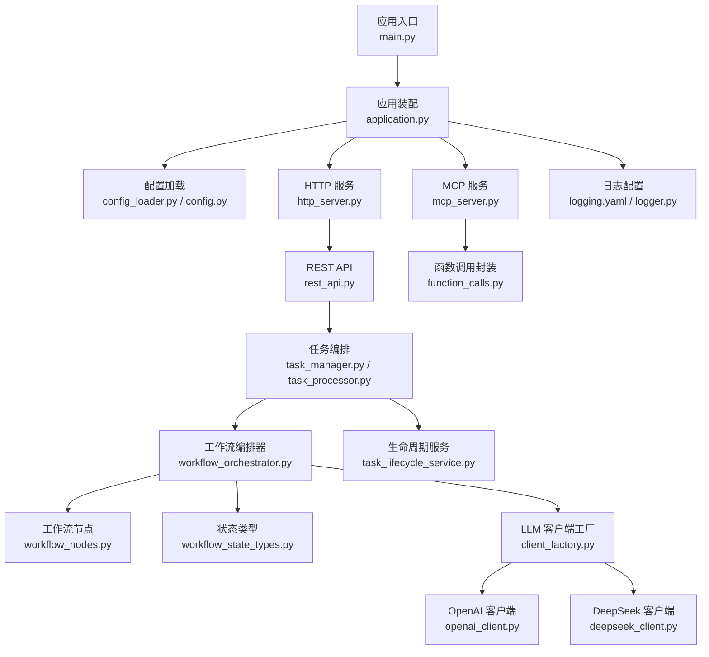
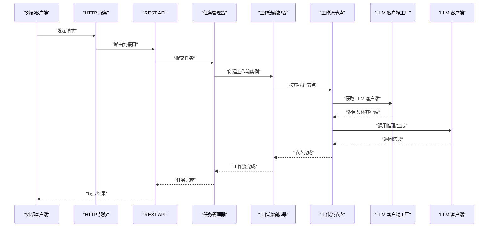
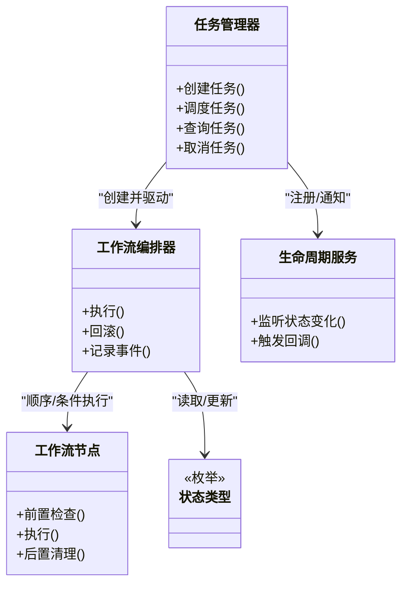
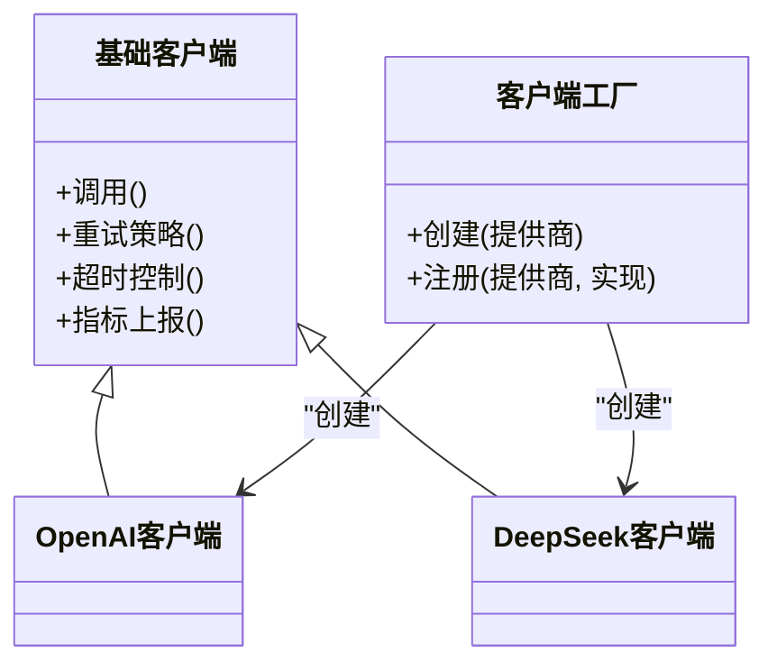
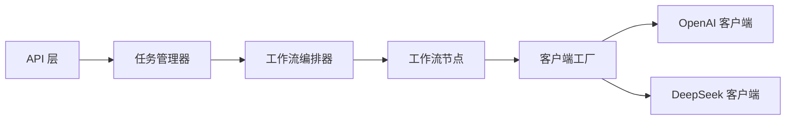

# 扩展开发最佳实践

<cite>
**本文引用的文件**   
- [main.py](file://main.py)
- [pyproject.toml](file://pyproject.toml)
- [README.md](file://README.md)
- [src/penshot/app/application.py](file://src/penshot/app/application.py)
- [src/penshot/config/config.py](file://src/penshot/config/config.py)
- [src/penshot/config/config_loader.py](file://src/penshot/config/config_loader.py)
- [src/penshot/config/settings.yaml](file://src/penshot/config/settings.yaml)
- [src/penshot/config/logging.yaml](file://src/penshot/config/logging.yaml)
- [src/penshot/logger.py](file://src/penshot/logger.py)
- [src/penshot/http_server.py](file://src/penshot/http_server.py)
- [src/penshot/mcp_server.py](file://src/penshot/mcp_server.py)
- [src/penshot/api/rest_api.py](file://src/penshot/api/rest_api.py)
- [src/penshot/api/function_calls.py](file://src/penshot/api/function_calls.py)
- [src/penshot/neopen/agent/base_agent.py](file://src/penshot/neopen/agent/base_agent.py)
- [src/penshot/neopen/agent/base_llm_agent.py](file://src/penshot/neopen/agent/base_llm_agent.py)
- [src/penshot/neopen/agent/script_parser_agent.py](file://src/penshot/neopen/agent/script_parser_agent.py)
- [src/penshot/neopen/agent/shot_segmenter_agent.py](file://src/penshot/neopen/agent/shot_segmenter_agent.py)
- [src/penshot/neopen/agent/video_splitter_agent.py](file://src/penshot/neopen/agent/video_splitter_agent.py)
- [src/penshot/neopen/agent/workflow/workflow_orchestrator.py](file://src/penshot/neopen/agent/workflow/workflow_orchestrator.py)
- [src/penshot/neopen/agent/workflow/workflow_pipeline.py](file://src/penshot/neopen/agent/workflow/workflow_pipeline.py)
- [src/penshot/neopen/agent/workflow/workflow_nodes.py](file://src/penshot/neopen/agent/workflow/workflow_nodes.py)
- [src/penshot/neopen/agent/workflow/workflow_state_types.py](file://src/penshot/neopen/agent/workflow/workflow_state_types.py)
- [src/penshot/neopen/agent/workflow/workflow_error_handler.py](file://src/penshot/neopen/agent/workflow/workflow_error_handler.py)
- [src/penshot/neopen/agent/workflow/workflow_logger.py](file://src/penshot/neopen/agent/workflow/workflow_logger.py)
- [src/penshot/neopen/client/base_client.py](file://src/penshot/neopen/client/base_client.py)
- [src/penshot/neopen/client/client_factory.py](file://src/penshot/neopen/client/client_factory.py)
- [src/penshot/neopen/client/deepseek_client.py](file://src/penshot/neopen/client/deepseek_client.py)
- [src/penshot/neopen/client/openai_client.py](file://src/penshot/neopen/client/openai_client.py)
- [src/penshot/neopen/task/task_manager.py](file://src/penshot/neopen/task/task_manager.py)
- [src/penshot/neopen/task/task_processor.py](file://src/penshot/neopen/task/task_processor.py)
- [src/penshot/neopen/task/task_lifecycle_service.py](file://src/penshot/neopen/task/task_lifecycle_service.py)
- [src/penshot/utils/log_utils.py](file://src/penshot/utils/log_utils.py)
- [tests/unit/test_utils.py](file://tests/unit/test_utils.py)
- [tests/workflow/test_workflow_orchestrator.py](file://tests/workflow/test_workflow_orchestrator.py)
- [tests/integration/](file://tests/integration/)
- [examples/direct_usage.py](file://examples/direct_usage.py)
</cite>

## 目录
1. [简介](#简介)
2. [项目结构](#项目结构)
3. [核心组件](#核心组件)
4. [架构总览](#架构总览)
5. [详细组件分析](#详细组件分析)
6. [依赖分析](#依赖分析)
7. [性能考虑](#性能考虑)
8. [故障排除指南](#故障排除指南)
9. [结论](#结论)
10. [附录](#附录)

## 简介
本指南面向扩展开发者，围绕代码组织、命名规范、错误处理、日志记录、测试方法论、代码审查标准与发布流程、性能优化、内存管理、并发处理等主题，提供可落地的最佳实践。文档以视频片段代理项目的现有实现为依据，提炼通用模式与原则，帮助你在不破坏既有稳定性的前提下，安全地扩展功能。

## 项目结构
本项目采用分层与领域混合的组织方式：
- 应用层：HTTP/MCP 服务入口、应用装配与环境初始化
- 配置层：多环境配置加载、日志配置、设置模型
- 领域层（neopen）：Agent、工作流、任务、客户端、工具、知识、缓存、提示词模板等
- API 层：REST 接口与函数调用封装
- 工具层：通用工具（日志、路径、枚举、Redis 等）
- 示例与脚本：演示用法、CLI、部署脚本
- 测试：单元、集成、端到端、基准

图表来源
- [main.py](file://main.py)
- [src/penshot/app/application.py](file://src/penshot/app/application.py)
- [src/penshot/config/config_loader.py](file://src/penshot/config/config_loader.py)
- [src/penshot/config/config.py](file://src/penshot/config/config.py)
- [src/penshot/http_server.py](file://src/penshot/http_server.py)
- [src/penshot/mcp_server.py](file://src/penshot/mcp_server.py)
- [src/penshot/api/rest_api.py](file://src/penshot/api/rest_api.py)
- [src/penshot/api/function_calls.py](file://src/penshot/api/function_calls.py)
- [src/penshot/neopen/task/task_manager.py](file://src/penshot/neopen/task/task_manager.py)
- [src/penshot/neopen/task/task_processor.py](file://src/penshot/neopen/task/task_processor.py)
- [src/penshot/neopen/task/task_lifecycle_service.py](file://src/penshot/neopen/task/task_lifecycle_service.py)
- [src/penshot/neopen/agent/workflow/workflow_orchestrator.py](file://src/penshot/neopen/agent/workflow/workflow_orchestrator.py)
- [src/penshot/neopen/agent/workflow/workflow_nodes.py](file://src/penshot/neopen/agent/workflow/workflow_nodes.py)
- [src/penshot/neopen/agent/workflow/workflow_state_types.py](file://src/penshot/neopen/agent/workflow/workflow_state_types.py)
- [src/penshot/neopen/client/client_factory.py](file://src/penshot/neopen/client/client_factory.py)
- [src/penshot/neopen/client/openai_client.py](file://src/penshot/neopen/client/openai_client.py)
- [src/penshot/neopen/client/deepseek_client.py](file://src/penshot/neopen/client/deepseek_client.py)
- [src/penshot/config/logging.yaml](file://src/penshot/config/logging.yaml)
- [src/penshot/logger.py](file://src/penshot/logger.py)

章节来源
- [README.md](file://README.md)
- [pyproject.toml](file://pyproject.toml)
- [main.py](file://main.py)
- [src/penshot/app/application.py](file://src/penshot/app/application.py)

## 核心组件
- 应用装配与环境初始化：负责加载配置、注册服务、启动 HTTP/MCP 服务器
- 配置系统：支持多环境 YAML 配置、运行时设置模型、日志配置
- 任务与工作流：任务管理器调度处理器，工作流编排器驱动节点执行，统一状态与错误处理
- LLM 客户端抽象：通过工厂创建不同厂商的客户端，屏蔽差异
- API 层：REST 接口与函数调用封装，暴露能力给外部系统
- 日志与工具：集中式日志配置与通用工具库

章节来源
- [src/penshot/app/application.py](file://src/penshot/app/application.py)
- [src/penshot/config/config.py](file://src/penshot/config/config.py)
- [src/penshot/config/config_loader.py](file://src/penshot/config/config_loader.py)
- [src/penshot/config/settings.yaml](file://src/penshot/config/settings.yaml)
- [src/penshot/config/logging.yaml](file://src/penshot/config/logging.yaml)
- [src/penshot/logger.py](file://src/penshot/logger.py)
- [src/penshot/neopen/task/task_manager.py](file://src/penshot/neopen/task/task_manager.py)
- [src/penshot/neopen/task/task_processor.py](file://src/penshot/neopen/task/task_processor.py)
- [src/penshot/neopen/task/task_lifecycle_service.py](file://src/penshot/neopen/task/task_lifecycle_service.py)
- [src/penshot/neopen/agent/workflow/workflow_orchestrator.py](file://src/penshot/neopen/agent/workflow/workflow_orchestrator.py)
- [src/penshot/neopen/agent/workflow/workflow_nodes.py](file://src/penshot/neopen/agent/workflow/workflow_nodes.py)
- [src/penshot/neopen/agent/workflow/workflow_state_types.py](file://src/penshot/neopen/agent/workflow/workflow_state_types.py)
- [src/penshot/neopen/client/client_factory.py](file://src/penshot/neopen/client/client_factory.py)
- [src/penshot/neopen/client/base_client.py](file://src/penshot/neopen/client/base_client.py)
- [src/penshot/neopen/client/openai_client.py](file://src/penshot/neopen/client/openai_client.py)
- [src/penshot/neopen/client/deepseek_client.py](file://src/penshot/neopen/client/deepseek_client.py)
- [src/penshot/api/rest_api.py](file://src/penshot/api/rest_api.py)
- [src/penshot/api/function_calls.py](file://src/penshot/api/function_calls.py)

## 架构总览
整体采用“服务入口 → 应用装配 → 配置/日志 → 任务与工作流 → LLM 客户端”的分层架构。API 层作为对外边界，内部通过任务与工作流进行编排，使用工厂模式选择具体 LLM 客户端，保证可扩展性与可替换性。

图表来源
- [src/penshot/http_server.py](file://src/penshot/http_server.py)
- [src/penshot/api/rest_api.py](file://src/penshot/api/rest_api.py)
- [src/penshot/neopen/task/task_manager.py](file://src/penshot/neopen/task/task_manager.py)
- [src/penshot/neopen/agent/workflow/workflow_orchestrator.py](file://src/penshot/neopen/agent/workflow/workflow_orchestrator.py)
- [src/penshot/neopen/agent/workflow/workflow_nodes.py](file://src/penshot/neopen/agent/workflow/workflow_nodes.py)
- [src/penshot/neopen/client/client_factory.py](file://src/penshot/neopen/client/client_factory.py)
- [src/penshot/neopen/client/openai_client.py](file://src/penshot/neopen/client/openai_client.py)

## 详细组件分析

### 应用装配与环境初始化
- 职责：加载配置、初始化日志、注册服务、启动 HTTP/MCP 服务器
- 建议：
  - 将服务注册与启动逻辑集中在装配模块，避免散落在入口
  - 使用显式的依赖注入或工厂，便于测试替换
  - 对关键资源（连接池、缓存、队列）提供优雅关闭钩子

章节来源
- [src/penshot/app/application.py](file://src/penshot/app/application.py)
- [main.py](file://main.py)

### 配置系统
- 职责：多环境 YAML 配置、运行时设置模型、日志配置
- 建议：
  - 使用强类型配置模型，减少运行时键名错误
  - 将敏感信息从配置文件剥离，改用环境变量或密钥管理服务
  - 为每个环境提供最小化配置，通过合并策略覆盖默认值

章节来源
- [src/penshot/config/config.py](file://src/penshot/config/config.py)
- [src/penshot/config/config_loader.py](file://src/penshot/config/config_loader.py)
- [src/penshot/config/settings.yaml](file://src/penshot/config/settings.yaml)
- [src/penshot/config/logging.yaml](file://src/penshot/config/logging.yaml)

### 任务与工作流
- 职责：任务生命周期管理、工作流编排、节点执行、状态与错误处理
- 建议：
  - 明确定义状态机，所有状态变更需经过校验与审计
  - 节点设计遵循单一职责，输入输出使用强类型模型
  - 错误处理采用“失败快速 + 重试 + 降级”的组合策略
  - 使用上下文对象传递共享数据，避免全局变量

图表来源
- [src/penshot/neopen/task/task_manager.py](file://src/penshot/neopen/task/task_manager.py)
- [src/penshot/neopen/task/task_processor.py](file://src/penshot/neopen/task/task_processor.py)
- [src/penshot/neopen/task/task_lifecycle_service.py](file://src/penshot/neopen/task/task_lifecycle_service.py)
- [src/penshot/neopen/agent/workflow/workflow_orchestrator.py](file://src/penshot/neopen/agent/workflow/workflow_orchestrator.py)
- [src/penshot/neopen/agent/workflow/workflow_nodes.py](file://src/penshot/neopen/agent/workflow/workflow_nodes.py)
- [src/penshot/neopen/agent/workflow/workflow_state_types.py](file://src/penshot/neopen/agent/workflow/workflow_state_types.py)

章节来源
- [src/penshot/neopen/task/task_manager.py](file://src/penshot/neopen/task/task_manager.py)
- [src/penshot/neopen/task/task_processor.py](file://src/penshot/neopen/task/task_processor.py)
- [src/penshot/neopen/task/task_lifecycle_service.py](file://src/penshot/neopen/task/task_lifecycle_service.py)
- [src/penshot/neopen/agent/workflow/workflow_orchestrator.py](file://src/penshot/neopen/agent/workflow/workflow_orchestrator.py)
- [src/penshot/neopen/agent/workflow/workflow_nodes.py](file://src/penshot/neopen/agent/workflow/workflow_nodes.py)
- [src/penshot/neopen/agent/workflow/workflow_state_types.py](file://src/penshot/neopen/agent/workflow/workflow_state_types.py)

### LLM 客户端抽象与工厂
- 职责：统一客户端接口、根据配置创建具体实现
- 建议：
  - 定义清晰的基类接口，包含重试、超时、限流、指标上报
  - 工厂方法集中注册与发现，新增厂商只需注册即可
  - 客户端实现保持无状态或轻量有状态，避免跨请求污染

图表来源
- [src/penshot/neopen/client/base_client.py](file://src/penshot/neopen/client/base_client.py)
- [src/penshot/neopen/client/client_factory.py](file://src/penshot/neopen/client/client_factory.py)
- [src/penshot/neopen/client/openai_client.py](file://src/penshot/neopen/client/openai_client.py)
- [src/penshot/neopen/client/deepseek_client.py](file://src/penshot/neopen/client/deepseek_client.py)

章节来源
- [src/penshot/neopen/client/base_client.py](file://src/penshot/neopen/client/base_client.py)
- [src/penshot/neopen/client/client_factory.py](file://src/penshot/neopen/client/client_factory.py)
- [src/penshot/neopen/client/openai_client.py](file://src/penshot/neopen/client/openai_client.py)
- [src/penshot/neopen/client/deepseek_client.py](file://src/penshot/neopen/client/deepseek_client.py)

### Agent 与提示词转换
- 职责：基于任务的 Agent 实现，封装提示词转换与业务逻辑
- 建议：
  - 将提示词模板与业务逻辑解耦，便于版本化管理与 A/B 测试
  - 使用统一的模型定义，确保输入输出一致
  - 对不可靠的外部调用增加熔断与降级

章节来源
- [src/penshot/neopen/agent/base_agent.py](file://src/penshot/neopen/agent/base_agent.py)
- [src/penshot/neopen/agent/base_llm_agent.py](file://src/penshot/neopen/agent/base_llm_agent.py)
- [src/penshot/neopen/agent/script_parser_agent.py](file://src/penshot/neopen/agent/script_parser_agent.py)
- [src/penshot/neopen/agent/shot_segmenter_agent.py](file://src/penshot/neopen/agent/shot_segmenter_agent.py)
- [src/penshot/neopen/agent/video_splitter_agent.py](file://src/penshot/neopen/agent/video_splitter_agent.py)

### API 层与函数调用封装
- 职责：对外暴露 REST 接口与函数调用能力
- 建议：
  - 接口幂等设计，支持去重与重试
  - 参数校验前置，错误码标准化
  - 对长耗时操作采用异步任务与回调机制

章节来源
- [src/penshot/api/rest_api.py](file://src/penshot/api/rest_api.py)
- [src/penshot/api/function_calls.py](file://src/penshot/api/function_calls.py)

### 日志与工具
- 职责：集中式日志配置、结构化日志、通用工具
- 建议：
  - 使用结构化日志字段（trace_id、span_id、用户标识等）
  - 分级输出（DEBUG/INFO/WARN/ERROR），生产环境默认 INFO+
  - 工具函数保持纯函数风格，避免副作用

章节来源
- [src/penshot/config/logging.yaml](file://src/penshot/config/logging.yaml)
- [src/penshot/logger.py](file://src/penshot/logger.py)
- [src/penshot/utils/log_utils.py](file://src/penshot/utils/log_utils.py)

## 依赖分析
- 低耦合高内聚：通过工厂与接口隔离外部依赖（如 LLM 厂商）
- 明确的边界：API 层仅暴露必要能力，内部通过任务与工作流协作
- 潜在循环依赖风险：工作流节点应避免反向引用编排器，使用事件/回调替代

图表来源
- [src/penshot/api/rest_api.py](file://src/penshot/api/rest_api.py)
- [src/penshot/neopen/task/task_manager.py](file://src/penshot/neopen/task/task_manager.py)
- [src/penshot/neopen/agent/workflow/workflow_orchestrator.py](file://src/penshot/neopen/agent/workflow/workflow_orchestrator.py)
- [src/penshot/neopen/agent/workflow/workflow_nodes.py](file://src/penshot/neopen/agent/workflow/workflow_nodes.py)
- [src/penshot/neopen/client/client_factory.py](file://src/penshot/neopen/client/client_factory.py)
- [src/penshot/neopen/client/openai_client.py](file://src/penshot/neopen/client/openai_client.py)
- [src/penshot/neopen/client/deepseek_client.py](file://src/penshot/neopen/client/deepseek_client.py)

章节来源
- [pyproject.toml](file://pyproject.toml)

## 性能考虑
- 并发与异步
  - 使用线程池/进程池限制并发度，避免资源耗尽
  - 对 I/O 密集场景采用异步框架，合理设置超时与重试
- 缓存与复用
  - 对热点数据与 LLM 调用结果做多级缓存（内存/Redis）
  - 复用连接与会话，减少握手开销
- 批处理与流式
  - 批量处理小任务，降低调度与序列化开销
  - 对大响应采用流式传输，降低峰值内存
- 资源监控
  - 采集关键指标（QPS、延迟、错误率、内存/CPU）
  - 设置告警阈值，定位瓶颈

[本节为通用指导，无需特定文件来源]

## 故障排除指南
- 常见问题
  - 配置缺失或类型不匹配：优先检查环境与合并策略
  - LLM 调用失败：查看重试与熔断策略，确认凭据与配额
  - 工作流卡死：检查状态机与节点异常分支，核对日志 trace_id
- 诊断步骤
  - 开启 DEBUG 日志，收集完整上下文
  - 复现最小用例，隔离问题范围
  - 使用压测脚本验证稳定性
- 恢复策略
  - 自动重试与退避
  - 降级到规则引擎或本地缓存
  - 人工介入与回滚

章节来源
- [src/penshot/config/config_loader.py](file://src/penshot/config/config_loader.py)
- [src/penshot/neopen/client/base_client.py](file://src/penshot/neopen/client/base_client.py)
- [src/penshot/neopen/agent/workflow/workflow_error_handler.py](file://src/penshot/neopen/agent/workflow/workflow_error_handler.py)
- [src/penshot/neopen/agent/workflow/workflow_logger.py](file://src/penshot/neopen/agent/workflow/workflow_logger.py)
- [src/penshot/utils/log_utils.py](file://src/penshot/utils/log_utils.py)

## 结论
通过分层架构、工厂模式、强类型配置与结构化日志，项目具备良好的可扩展性与可维护性。扩展开发应遵循单一职责、明确边界、可观测与可恢复的原则，结合完善的测试与发布流程，确保质量与稳定性。

[本节为总结，无需特定文件来源]

## 附录

### 扩展开发最佳实践清单
- 代码组织
  - 按领域与层次划分模块，避免跨层直接依赖
  - 使用包级 __init__.py 暴露稳定接口
- 命名规范
  - 模块与包使用小写下划线；类使用帕斯卡命名；常量全大写
  - 文件名体现职责，避免缩写歧义
- 错误处理
  - 自定义异常层次，区分业务与系统错误
  - 统一错误码与消息格式，便于前端展示与监控
- 日志记录
  - 结构化字段：时间、级别、模块、trace_id、用户、耗时
  - 敏感信息脱敏，避免泄露
- 测试方法论
  - 单元测试：覆盖核心算法与工具函数，断言清晰
  - 集成测试：验证组件间交互，模拟外部依赖
  - 性能测试：设定 SLA，回归对比
- 代码审查标准
  - 可读性、可测试性、安全性、性能、可维护性
  - 变更影响面评估与回归用例补充
- 发布流程
  - 分支策略（主分支保护）、PR 审查、自动化构建与测试
  - 灰度发布与回滚预案
- 高级主题
  - 内存管理：避免大对象常驻，及时释放资源
  - 并发处理：锁粒度最小化，避免死锁与饥饿
  - 可观测性：指标、链路追踪、分布式日志

[本节为通用指导，无需特定文件来源]

### 参考示例与测试
- 示例用法
  - 直接调用示例：[examples/direct_usage.py](file://examples/direct_usage.py)
- 测试样例
  - 工具函数单元测试：[tests/unit/test_utils.py](file://tests/unit/test_utils.py)
  - 工作流编排器测试：[tests/workflow/test_workflow_orchestrator.py](file://tests/workflow/test_workflow_orchestrator.py)
  - 集成测试目录：[tests/integration/](file://tests/integration/)

章节来源
- [examples/direct_usage.py](file://examples/direct_usage.py)
- [tests/unit/test_utils.py](file://tests/unit/test_utils.py)
- [tests/workflow/test_workflow_orchestrator.py](file://tests/workflow/test_workflow_orchestrator.py)
- [tests/integration/](file://tests/integration/)