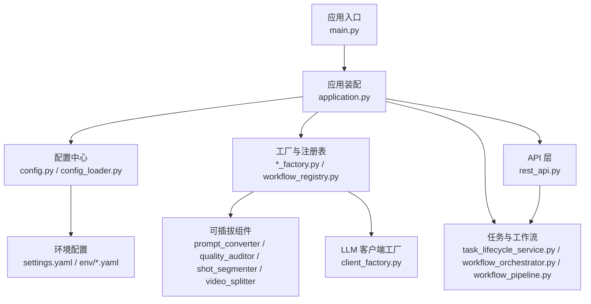
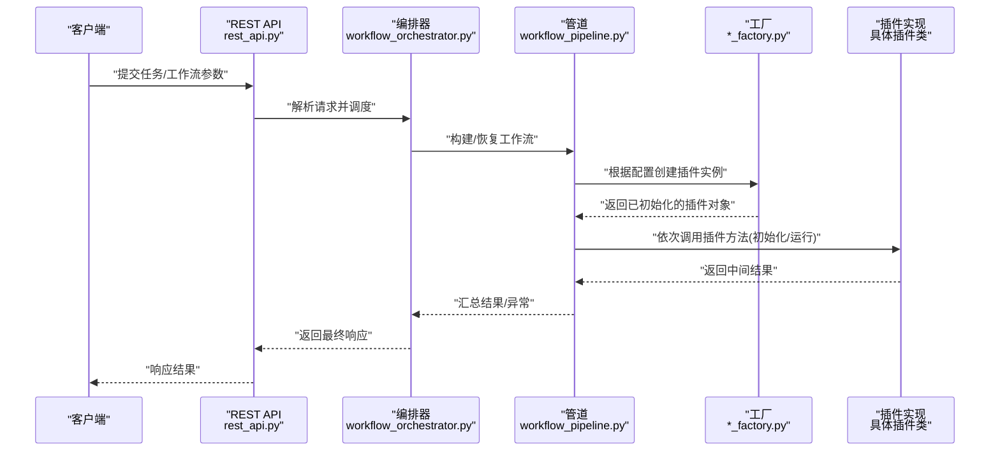
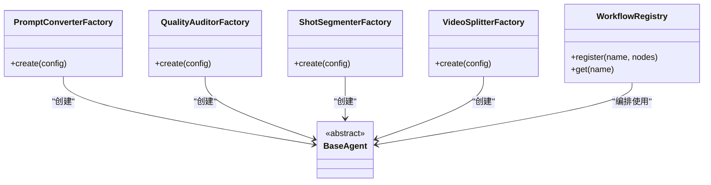
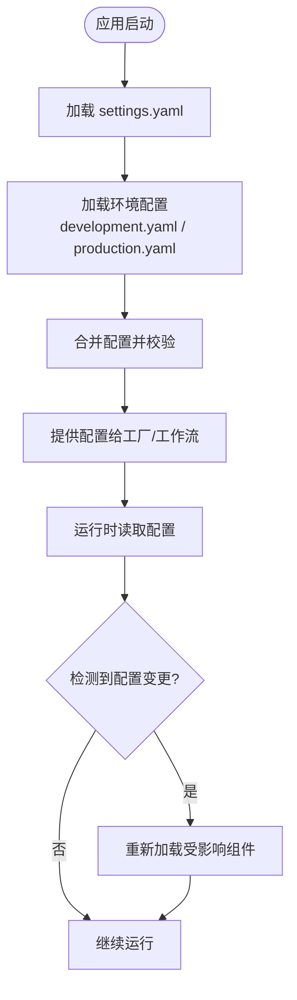
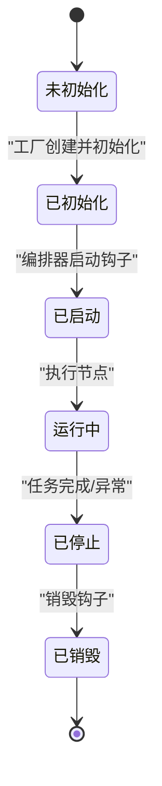
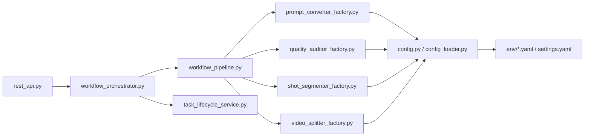

# 插件架构设计

<cite>
**本文引用的文件**   
- [main.py](file://main.py)
- [application.py](file://src/penshot/app/application.py)
- [config.py](file://src/penshot/config/config.py)
- [config_loader.py](file://src/penshot/config/config_loader.py)
- [settings.yaml](file://src/penshot/config/settings.yaml)
- [development.yaml](file://src/penshot/config/env/development.yaml)
- [production.yaml](file://src/penshot/config/env/production.yaml)
- [base_agent.py](file://src/penshot/neopen/agent/base_agent.py)
- [prompt_converter_factory.py](file://src/penshot/neopen/agent/prompt_converter/prompt_converter_factory.py)
- [quality_auditor_factory.py](file://src/penshot/neopen/agent/quality_auditor/quality_auditor_factory.py)
- [shot_segmenter_factory.py](file://src/penshot/neopen/agent/shot_segmenter/shot_segmenter_factory.py)
- [video_splitter_factory.py](file://src/penshot/neopen/agent/video_splitter/video_splitter_factory.py)
- [task_lifecycle_service.py](file://src/penshot/neopen/task/task_lifecycle_service.py)
- [workflow_orchestrator.py](file://src/penshot/neopen/agent/workflow/workflow_orchestrator.py)
- [workflow_pipeline.py](file://src/penshot/neopen/agent/workflow/workflow_pipeline.py)
- [workflow_registry.py](file://src/penshot/neopen/task/workflow_registry.py)
- [client_factory.py](file://src/penshot/neopen/client/client_factory.py)
- [rest_api.py](file://src/penshot/api/rest_api.py)
</cite>

## 目录
1. [简介](#简介)
2. [项目结构](#项目结构)
3. [核心组件](#核心组件)
4. [架构总览](#架构总览)
5. [详细组件分析](#详细组件分析)
6. [依赖关系分析](#依赖关系分析)
7. [性能考量](#性能考量)
8. [故障排查指南](#故障排查指南)
9. [结论](#结论)
10. [附录](#附录)

## 简介
本指南围绕视频剪辑代理项目的插件化架构，系统阐述插件发现、加载顺序、依赖管理、动态配置、生命周期管理、插件间通信与数据共享、安全与隔离策略，以及插件开发模板与规范。文档面向不同技术背景的读者，既提供高层概览，也给出代码级映射与可视化图示，帮助快速理解并扩展系统能力。

## 项目结构
本项目采用分层与按功能域组织相结合的结构：
- 应用入口与装配：负责启动、全局配置加载、服务注册与生命周期协调
- 配置中心：集中管理多环境配置与运行时参数，支持动态更新
- 工厂与注册表：统一创建与获取可插拔组件（如提示词转换器、质量审计器、镜头分割器、视频分割器）
- 任务与工作流编排：定义任务生命周期、工作流节点编排与状态持久化
- API 层：对外暴露 REST/MCP 接口，驱动工作流执行
- 客户端抽象：对多种 LLM 后端进行统一封装并通过工厂选择

图表来源
- [main.py](file://main.py)
- [application.py](file://src/penshot/app/application.py)
- [config.py](file://src/penshot/config/config.py)
- [config_loader.py](file://src/penshot/config/config_loader.py)
- [settings.yaml](file://src/penshot/config/settings.yaml)
- [development.yaml](file://src/penshot/config/env/development.yaml)
- [production.yaml](file://src/penshot/config/env/production.yaml)
- [prompt_converter_factory.py](file://src/penshot/neopen/agent/prompt_converter/prompt_converter_factory.py)
- [quality_auditor_factory.py](file://src/penshot/neopen/agent/quality_auditor/quality_auditor_factory.py)
- [shot_segmenter_factory.py](file://src/penshot/neopen/agent/shot_segmenter/shot_segmenter_factory.py)
- [video_splitter_factory.py](file://src/penshot/neopen/agent/video_splitter/video_splitter_factory.py)
- [workflow_registry.py](file://src/penshot/neopen/task/workflow_registry.py)
- [task_lifecycle_service.py](file://src/penshot/neopen/task/task_lifecycle_service.py)
- [workflow_orchestrator.py](file://src/penshot/neopen/agent/workflow/workflow_orchestrator.py)
- [workflow_pipeline.py](file://src/penshot/neopen/agent/workflow/workflow_pipeline.py)
- [client_factory.py](file://src/penshot/neopen/client/client_factory.py)
- [rest_api.py](file://src/penshot/api/rest_api.py)

章节来源
- [main.py](file://main.py)
- [application.py](file://src/penshot/app/application.py)
- [config.py](file://src/penshot/config/config.py)
- [config_loader.py](file://src/penshot/config/config_loader.py)
- [settings.yaml](file://src/penshot/config/settings.yaml)
- [development.yaml](file://src/penshot/config/env/development.yaml)
- [production.yaml](file://src/penshot/config/env/production.yaml)
- [prompt_converter_factory.py](file://src/penshot/neopen/agent/prompt_converter/prompt_converter_factory.py)
- [quality_auditor_factory.py](file://src/penshot/neopen/agent/quality_auditor/quality_auditor_factory.py)
- [shot_segmenter_factory.py](file://src/penshot/neopen/agent/shot_segmenter/shot_segmenter_factory.py)
- [video_splitter_factory.py](file://src/penshot/neopen/agent/video_splitter/video_splitter_factory.py)
- [workflow_registry.py](file://src/penshot/neopen/task/workflow_registry.py)
- [task_lifecycle_service.py](file://src/penshot/neopen/task/task_lifecycle_service.py)
- [workflow_orchestrator.py](file://src/penshot/neopen/agent/workflow/workflow_orchestrator.py)
- [workflow_pipeline.py](file://src/penshot/neopen/agent/workflow/workflow_pipeline.py)
- [client_factory.py](file://src/penshot/neopen/client/client_factory.py)
- [rest_api.py](file://src/penshot/api/rest_api.py)

## 核心组件
- 应用装配器：负责初始化配置、注册工厂、构建工作流、启动 API 服务
- 配置中心：加载多环境 YAML 配置，提供运行时访问与热更新能力
- 工厂与注册表：为各插件族提供基于配置的实例化与选择逻辑；工作流注册表维护可执行流程
- 任务与服务：任务生命周期服务统一管理任务的创建、调度、恢复与销毁
- 工作流编排器与管道：将多个插件节点组合为有向图或线性流水线，支持错误处理、检查点与输出修正
- API 网关：REST/MCP 接口作为外部触发点，调用编排器执行工作流

章节来源
- [application.py](file://src/penshot/app/application.py)
- [config.py](file://src/penshot/config/config.py)
- [config_loader.py](file://src/penshot/config/config_loader.py)
- [task_lifecycle_service.py](file://src/penshot/neopen/task/task_lifecycle_service.py)
- [workflow_orchestrator.py](file://src/penshot/neopen/agent/workflow/workflow_orchestrator.py)
- [workflow_pipeline.py](file://src/penshot/neopen/agent/workflow/workflow_pipeline.py)
- [rest_api.py](file://src/penshot/api/rest_api.py)

## 架构总览
下图展示从请求到插件执行的端到端路径，体现“配置驱动 + 工厂创建 + 编排执行”的插件化模式。

图表来源
- [rest_api.py](file://src/penshot/api/rest_api.py)
- [workflow_orchestrator.py](file://src/penshot/neopen/agent/workflow/workflow_orchestrator.py)
- [workflow_pipeline.py](file://src/penshot/neopen/agent/workflow/workflow_pipeline.py)
- [prompt_converter_factory.py](file://src/penshot/neopen/agent/prompt_converter/prompt_converter_factory.py)
- [quality_auditor_factory.py](file://src/penshot/neopen/agent/quality_auditor/quality_auditor_factory.py)
- [shot_segmenter_factory.py](file://src/penshot/neopen/agent/shot_segmenter/shot_segmenter_factory.py)
- [video_splitter_factory.py](file://src/penshot/neopen/agent/video_splitter/video_splitter_factory.py)

## 详细组件分析

### 插件发现与注册机制
- 插件族与基类：每个插件族（如提示词转换器、质量审计器、镜头分割器、视频分割器）均定义基类与模型，确保统一的接口契约
- 工厂模式：通过工厂类依据配置键选择具体实现，完成按需实例化与依赖注入
- 注册表：工作流注册表集中声明可用流程及其节点序列，便于动态启用/禁用与版本演进

图表来源
- [prompt_converter_factory.py](file://src/penshot/neopen/agent/prompt_converter/prompt_converter_factory.py)
- [quality_auditor_factory.py](file://src/penshot/neopen/agent/quality_auditor/quality_auditor_factory.py)
- [shot_segmenter_factory.py](file://src/penshot/neopen/agent/shot_segmenter/shot_segmenter_factory.py)
- [video_splitter_factory.py](file://src/penshot/neopen/agent/video_splitter/video_splitter_factory.py)
- [workflow_registry.py](file://src/penshot/neopen/task/workflow_registry.py)
- [base_agent.py](file://src/penshot/neopen/agent/base_agent.py)

章节来源
- [prompt_converter_factory.py](file://src/penshot/neopen/agent/prompt_converter/prompt_converter_factory.py)
- [quality_auditor_factory.py](file://src/penshot/neopen/agent/quality_auditor/quality_auditor_factory.py)
- [shot_segmenter_factory.py](file://src/penshot/neopen/agent/shot_segmenter/shot_segmenter_factory.py)
- [video_splitter_factory.py](file://src/penshot/neopen/agent/video_splitter/video_splitter_factory.py)
- [workflow_registry.py](file://src/penshot/neopen/task/workflow_registry.py)
- [base_agent.py](file://src/penshot/neopen/agent/base_agent.py)

### 加载顺序与依赖管理
- 启动阶段：应用装配器先加载配置，再初始化工厂与工作流注册表，最后启动 API 服务
- 插件实例化：在请求到达时由工厂根据配置键选择实现，避免启动期全量加载
- 依赖注入：工厂负责注入配置项与外部资源（如 LLM 客户端），插件仅关注业务逻辑
- 可选依赖：通过配置开关控制是否启用某插件或某特性，未启用则跳过实例化

章节来源
- [application.py](file://src/penshot/app/application.py)
- [config.py](file://src/penshot/config/config.py)
- [config_loader.py](file://src/penshot/config/config_loader.py)
- [client_factory.py](file://src/penshot/neopen/client/client_factory.py)

### 动态配置与热更新
- 多环境配置：通过 settings.yaml 与环境特定 YAML（development.yaml、production.yaml）组合，支持按环境切换
- 运行时访问：配置中心提供统一读取接口，插件通过工厂传入的配置对象获取参数
- 热更新建议：可在配置中心增加监听与事件总线，当配置文件变更时通知相关工厂或工作流重新加载

图表来源
- [config.py](file://src/penshot/config/config.py)
- [config_loader.py](file://src/penshot/config/config_loader.py)
- [settings.yaml](file://src/penshot/config/settings.yaml)
- [development.yaml](file://src/penshot/config/env/development.yaml)
- [production.yaml](file://src/penshot/config/env/production.yaml)

章节来源
- [config.py](file://src/penshot/config/config.py)
- [config_loader.py](file://src/penshot/config/config_loader.py)
- [settings.yaml](file://src/penshot/config/settings.yaml)
- [development.yaml](file://src/penshot/config/env/development.yaml)
- [production.yaml](file://src/penshot/config/env/production.yaml)

### 插件生命周期管理
- 初始化：插件在工厂创建后执行一次初始化（如加载模型、建立连接）
- 启动：工作流编排器在开始执行前触发插件的启动钩子（如预热缓存）
- 运行：管道按节点顺序调用插件的运行方法，传递上下文与输入数据
- 销毁：任务结束或超时后，编排器触发销毁钩子以释放资源（关闭连接、清理临时文件）

图表来源
- [task_lifecycle_service.py](file://src/penshot/neopen/task/task_lifecycle_service.py)
- [workflow_orchestrator.py](file://src/penshot/neopen/agent/workflow/workflow_orchestrator.py)
- [workflow_pipeline.py](file://src/penshot/neopen/agent/workflow/workflow_pipeline.py)

章节来源
- [task_lifecycle_service.py](file://src/penshot/neopen/task/task_lifecycle_service.py)
- [workflow_orchestrator.py](file://src/penshot/neopen/agent/workflow/workflow_orchestrator.py)
- [workflow_pipeline.py](file://src/penshot/neopen/agent/workflow/workflow_pipeline.py)

### 插件间通信与数据共享
- 上下文对象：工作流在执行过程中维护一个上下文，包含输入、中间结果与元数据
- 管道传递：每个插件节点接收上一节点的输出作为输入，并将自身输出写入上下文
- 共享存储：对于跨节点的大对象或持久化结果，可通过工具层提供的存储工具进行读写
- 事件与回调：必要时可在编排层引入轻量事件总线，用于异步通知与解耦

章节来源
- [workflow_pipeline.py](file://src/penshot/neopen/agent/workflow/workflow_pipeline.py)
- [workflow_orchestrator.py](file://src/penshot/neopen/agent/workflow/workflow_orchestrator.py)

### 安全机制、权限控制与隔离策略
- 最小权限原则：插件仅能访问其所需配置与资源，避免全局共享可变状态
- 输入校验：在工厂与编排层对配置与输入数据进行严格校验，防止恶意参数
- 资源限制：为外部调用（如 LLM 客户端）设置超时、重试上限与速率限制
- 沙箱建议：对不受信插件可采用进程级隔离或容器化部署，限制文件系统与网络访问
- 审计日志：记录关键操作与异常，便于追踪与回溯

章节来源
- [client_factory.py](file://src/penshot/neopen/client/client_factory.py)
- [workflow_orchestrator.py](file://src/penshot/neopen/agent/workflow/workflow_orchestrator.py)

### 插件开发标准模板与规范
- 命名与包结构：按插件族划分目录，遵循现有工厂与基类约定
- 接口契约：继承对应基类，实现必要方法与模型字段，保持向后兼容
- 配置驱动：所有可调参数通过配置注入，禁止硬编码
- 错误处理：抛出明确异常类型，并在编排层捕获与降级
- 测试覆盖：为插件编写单元测试与集成测试，验证边界条件与异常路径
- 文档与示例：提供使用说明、配置样例与示例脚本

章节来源
- [base_agent.py](file://src/penshot/neopen/agent/base_agent.py)
- [prompt_converter_factory.py](file://src/penshot/neopen/agent/prompt_converter/prompt_converter_factory.py)
- [quality_auditor_factory.py](file://src/penshot/neopen/agent/quality_auditor/quality_auditor_factory.py)
- [shot_segmenter_factory.py](file://src/penshot/neopen/agent/shot_segmenter/shot_segmenter_factory.py)
- [video_splitter_factory.py](file://src/penshot/neopen/agent/video_splitter/video_splitter_factory.py)

## 依赖关系分析
- 低耦合高内聚：工厂与注册表解耦插件实现与选择逻辑；编排器只依赖接口契约
- 外部依赖：LLM 客户端通过工厂统一创建，便于替换与限流
- 潜在循环：应避免插件直接反向依赖工厂或编排器，通过上下文与工具层间接交互

图表来源
- [rest_api.py](file://src/penshot/api/rest_api.py)
- [workflow_orchestrator.py](file://src/penshot/neopen/agent/workflow/workflow_orchestrator.py)
- [workflow_pipeline.py](file://src/penshot/neopen/agent/workflow/workflow_pipeline.py)
- [prompt_converter_factory.py](file://src/penshot/neopen/agent/prompt_converter/prompt_converter_factory.py)
- [quality_auditor_factory.py](file://src/penshot/neopen/agent/quality_auditor/quality_auditor_factory.py)
- [shot_segmenter_factory.py](file://src/penshot/neopen/agent/shot_segmenter/shot_segmenter_factory.py)
- [video_splitter_factory.py](file://src/penshot/neopen/agent/video_splitter/video_splitter_factory.py)
- [config.py](file://src/penshot/config/config.py)
- [config_loader.py](file://src/penshot/config/config_loader.py)
- [development.yaml](file://src/penshot/config/env/development.yaml)
- [production.yaml](file://src/penshot/config/env/production.yaml)
- [settings.yaml](file://src/penshot/config/settings.yaml)
- [task_lifecycle_service.py](file://src/penshot/neopen/task/task_lifecycle_service.py)

章节来源
- [rest_api.py](file://src/penshot/api/rest_api.py)
- [workflow_orchestrator.py](file://src/penshot/neopen/agent/workflow/workflow_orchestrator.py)
- [workflow_pipeline.py](file://src/penshot/neopen/agent/workflow/workflow_pipeline.py)
- [prompt_converter_factory.py](file://src/penshot/neopen/agent/prompt_converter/prompt_converter_factory.py)
- [quality_auditor_factory.py](file://src/penshot/neopen/agent/quality_auditor/quality_auditor_factory.py)
- [shot_segmenter_factory.py](file://src/penshot/neopen/agent/shot_segmenter/shot_segmenter_factory.py)
- [video_splitter_factory.py](file://src/penshot/neopen/agent/video_splitter/video_splitter_factory.py)
- [config.py](file://src/penshot/config/config.py)
- [config_loader.py](file://src/penshot/config/config_loader.py)
- [development.yaml](file://src/penshot/config/env/development.yaml)
- [production.yaml](file://src/penshot/config/env/production.yaml)
- [settings.yaml](file://src/penshot/config/settings.yaml)
- [task_lifecycle_service.py](file://src/penshot/neopen/task/task_lifecycle_service.py)

## 性能考量
- 懒加载与按需实例化：仅在需要时创建插件实例，减少启动开销
- 连接复用与池化：对 LLM 客户端等外部资源进行连接池化与复用
- 批处理与并行：在管道中合理并行执行无依赖节点，提升吞吐
- 缓存与去重：对重复计算结果进行缓存，降低外部调用成本
- 监控与指标：采集关键耗时与错误率，定位瓶颈

[本节为通用指导，不直接分析具体文件]

## 故障排查指南
- 配置问题：检查 settings.yaml 与环境配置是否一致，确认工厂选择键正确
- 插件初始化失败：查看工厂日志与异常堆栈，确认依赖资源可达
- 工作流执行异常：通过编排器的错误处理器与检查点定位失败节点
- 资源泄漏：确认插件销毁钩子被调用，外部连接被关闭
- 性能退化：结合监控指标分析热点节点，优化缓存与并发策略

章节来源
- [workflow_orchestrator.py](file://src/penshot/neopen/agent/workflow/workflow_orchestrator.py)
- [workflow_pipeline.py](file://src/penshot/neopen/agent/workflow/workflow_pipeline.py)
- [task_lifecycle_service.py](file://src/penshot/neopen/task/task_lifecycle_service.py)

## 结论
本插件化架构以“配置驱动 + 工厂创建 + 编排执行”为核心，实现了高内聚、低耦合的可扩展体系。通过明确的插件契约、严格的依赖管理与完善的生命周期控制，系统在灵活性与稳定性之间取得平衡。建议在后续迭代中完善热更新、事件总线与安全沙箱，进一步提升可观测性与安全性。

[本节为总结性内容，不直接分析具体文件]

## 附录
- 术语说明
  - 插件：可插拔的功能单元，遵循统一接口契约
  - 工厂：根据配置创建插件实例的组件
  - 编排器：负责任务与工作流的调度与协调
  - 管道：将多个插件节点串联成执行流程
  - 上下文：贯穿整个执行过程的共享数据载体

[本节为概念性内容，不直接分析具体文件]