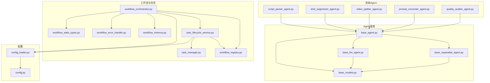
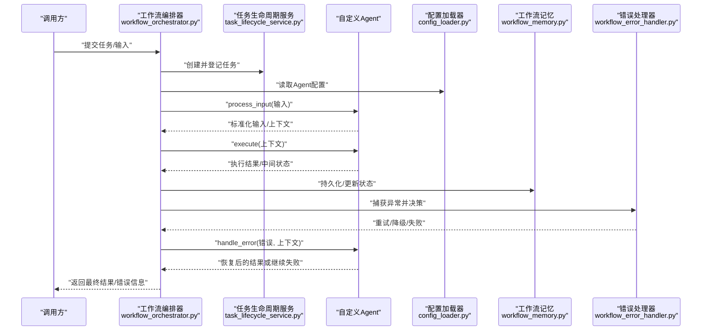
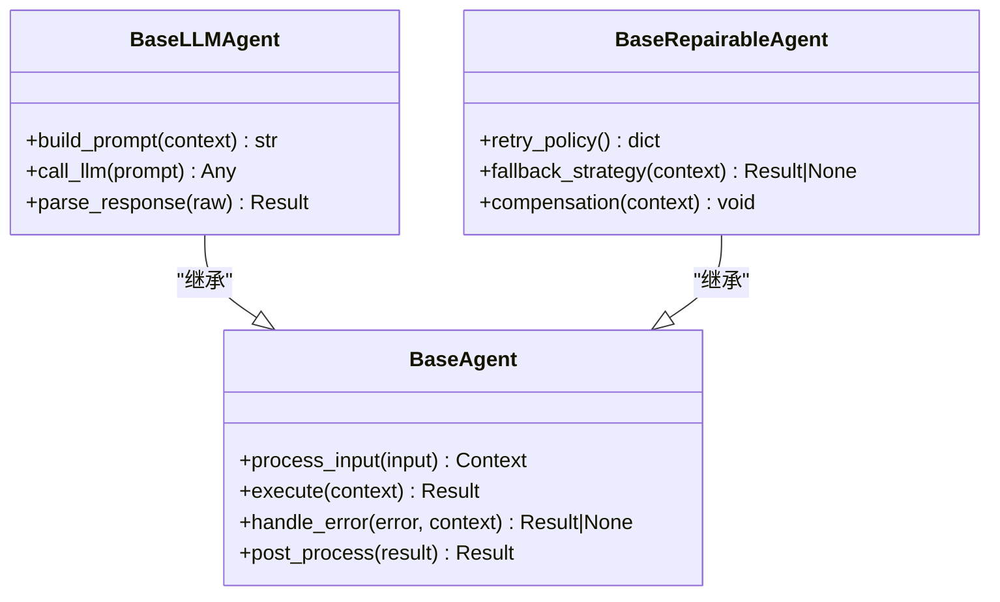
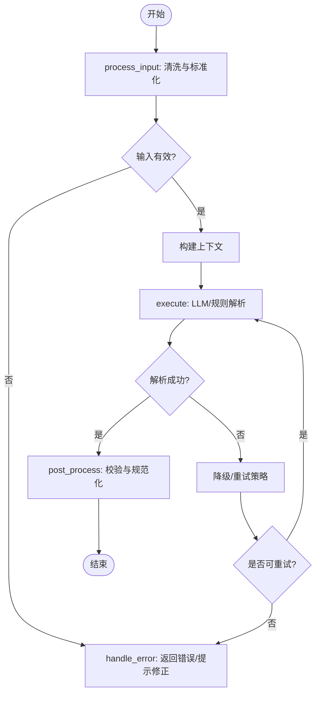
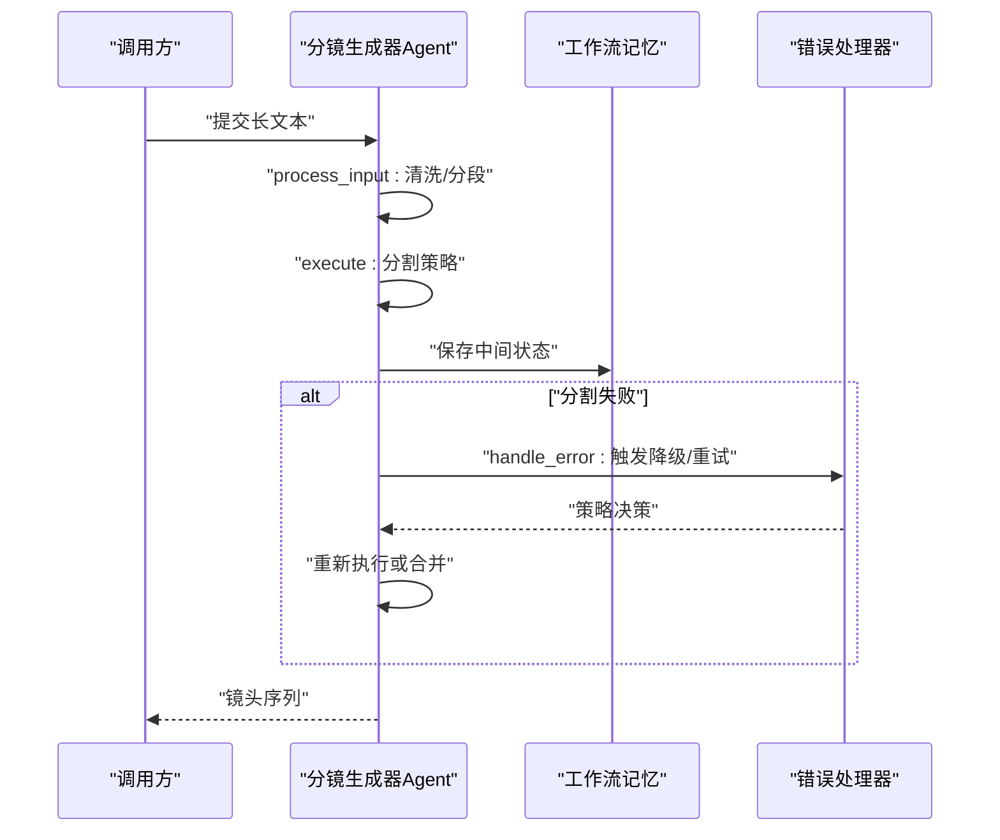
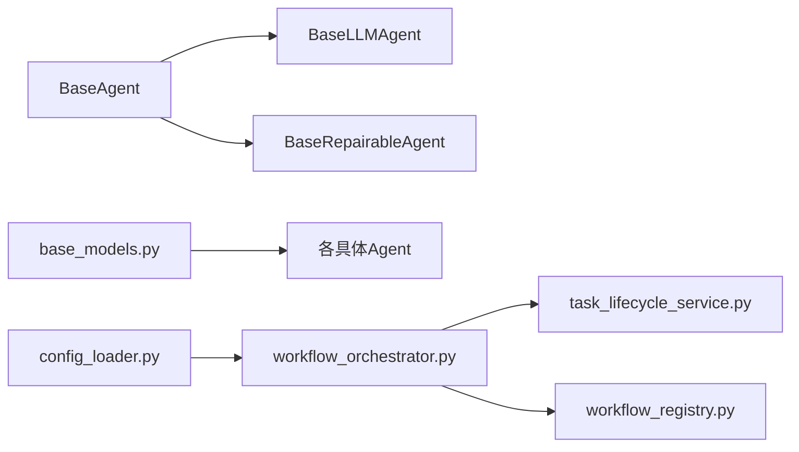

# 自定义Agent开发

<cite>
**本文引用的文件**   
- [base_agent.py](file://src/penshot/neopen/agent/base_agent.py)
- [base_llm_agent.py](file://src/penshot/neopen/agent/base_llm_agent.py)
- [base_repairable_agent.py](file://src/penshot/neopen/agent/base_repairable_agent.py)
- [base_models.py](file://src/penshot/neopen/agent/base_models.py)
- [script_parser_agent.py](file://src/penshot/neopen/agent/script_parser_agent.py)
- [shot_segmenter_agent.py](file://src/penshot/neopen/agent/shot_segmenter_agent.py)
- [video_splitter_agent.py](file://src/penshot/neopen/agent/video_splitter_agent.py)
- [prompt_converter_agent.py](file://src/penshot/neopen/agent/prompt_converter_agent.py)
- [quality_auditor_agent.py](file://src/penshot/neopen/agent/quality_auditor_agent.py)
- [workflow_orchestrator.py](file://src/penshot/neopen/agent/workflow/workflow_orchestrator.py)
- [workflow_state_types.py](file://src/penshot/neopen/agent/workflow/workflow_state_types.py)
- [workflow_error_handler.py](file://src/penshot/neopen/agent/workflow/workflow_error_handler.py)
- [workflow_memory.py](file://src/penshot/neopen/agent/workflow/workflow_memory.py)
- [task_lifecycle_service.py](file://src/penshot/neopen/task/task_lifecycle_service.py)
- [task_manager.py](file://src/penshot/neopen/task/task_manager.py)
- [workflow_registry.py](file://src/penshot/neopen/task/workflow_registry.py)
- [config_loader.py](file://src/penshot/config/config_loader.py)
- [config.py](file://src/penshot/config/config.py)
</cite>

## 目录
1. [简介](#简介)
2. [项目结构](#项目结构)
3. [核心组件](#核心组件)
4. [架构总览](#架构总览)
5. [详细组件分析](#详细组件分析)
6. [依赖分析](#依赖分析)
7. [性能考虑](#性能考虑)
8. [故障排查指南](#故障排查指南)
9. [结论](#结论)
10. [附录](#附录)

## 简介
本指南面向希望基于现有框架扩展或新建自定义Agent的开发者。内容覆盖：
- 如何继承 BaseAgent、BaseLLMAgent 或 BaseRepairableAgent 创建新Agent
- 必须实现的接口方法（如 process_input、execute、handle_error 等）与生命周期
- 状态处理与错误恢复机制
- Agent注册与配置的最佳实践
- 以“脚本解析器”和“分镜生成器”为例，给出端到端实现路径与参考位置

## 项目结构
本项目采用分层与按功能域组织相结合的结构。Agent相关代码集中在 neopen/agent 下，包含通用基类、具体Agent实现以及工作流编排与任务管理模块。

图表来源
- [base_agent.py:1-200](file://src/penshot/neopen/agent/base_agent.py#L1-L200)
- [base_llm_agent.py:1-200](file://src/penshot/neopen/agent/base_llm_agent.py#L1-L200)
- [base_repairable_agent.py:1-200](file://src/penshot/neopen/agent/base_repairable_agent.py#L1-L200)
- [base_models.py:1-200](file://src/penshot/neopen/agent/base_models.py#L1-L200)
- [script_parser_agent.py:1-200](file://src/penshot/neopen/agent/script_parser_agent.py#L1-L200)
- [shot_segmenter_agent.py:1-200](file://src/penshot/neopen/agent/shot_segmenter_agent.py#L1-L200)
- [video_splitter_agent.py:1-200](file://src/penshot/neopen/agent/video_splitter_agent.py#L1-L200)
- [prompt_converter_agent.py:1-200](file://src/penshot/neopen/agent/prompt_converter_agent.py#L1-L200)
- [quality_auditor_agent.py:1-200](file://src/penshot/neopen/agent/quality_auditor_agent.py#L1-L200)
- [workflow_orchestrator.py:1-200](file://src/penshot/neopen/agent/workflow/workflow_orchestrator.py#L1-L200)
- [workflow_state_types.py:1-200](file://src/penshot/neopen/agent/workflow/workflow_state_types.py#L1-L200)
- [workflow_error_handler.py:1-200](file://src/penshot/neopen/agent/workflow/workflow_error_handler.py#L1-L200)
- [workflow_memory.py:1-200](file://src/penshot/neopen/agent/workflow/workflow_memory.py#L1-L200)
- [task_lifecycle_service.py:1-200](file://src/penshot/neopen/task/task_lifecycle_service.py#L1-L200)
- [task_manager.py:1-200](file://src/penshot/neopen/task/task_manager.py#L1-L200)
- [workflow_registry.py:1-200](file://src/penshot/neopen/task/workflow_registry.py#L1-L200)
- [config_loader.py:1-200](file://src/penshot/config/config_loader.py#L1-L200)
- [config.py:1-200](file://src/penshot/config/config.py#L1-L200)

章节来源
- [base_agent.py:1-200](file://src/penshot/neopen/agent/base_agent.py#L1-L200)
- [base_llm_agent.py:1-200](file://src/penshot/neopen/agent/base_llm_agent.py#L1-L200)
- [base_repairable_agent.py:1-200](file://src/penshot/neopen/agent/base_repairable_agent.py#L1-L200)
- [base_models.py:1-200](file://src/penshot/neopen/agent/base_models.py#L1-L200)
- [workflow_orchestrator.py:1-200](file://src/penshot/neopen/agent/workflow/workflow_orchestrator.py#L1-L200)
- [task_lifecycle_service.py:1-200](file://src/penshot/neopen/task/task_lifecycle_service.py#L1-L200)
- [config_loader.py:1-200](file://src/penshot/config/config_loader.py#L1-L200)

## 核心组件
- 基类体系
  - BaseAgent：定义Agent通用生命周期与最小可运行契约，包括输入预处理、执行、错误处理、结果后处理等钩子。
  - BaseLLMAgent：在BaseAgent基础上增加与大模型交互的能力（提示词构建、调用、结果解析）。
  - BaseRepairableAgent：在BaseAgent基础上增加可修复能力（重试、降级、回滚、补偿等策略）。
- 数据模型
  - base_models.py：提供Agent通用的输入输出模型、上下文对象、错误类型等基础数据结构。
- 具体Agent示例
  - script_parser_agent.py：脚本解析Agent，展示如何将文本脚本转换为结构化分镜要素。
  - shot_segmenter_agent.py：分镜分割Agent，负责将长文本切分为镜头单元。
  - video_splitter_agent.py：视频切分Agent，结合时长估算进行切分。
  - prompt_converter_agent.py：提示词转换Agent，用于模板到最终提示词的渲染。
  - quality_auditor_agent.py：质量审计Agent，对输出进行规则或LLM校验。
- 工作流与任务
  - workflow_orchestrator.py：编排多个Agent节点，管理状态流转、错误处理与记忆。
  - task_lifecycle_service.py / task_manager.py / workflow_registry.py：任务生命周期管理与注册中心。
- 配置
  - config_loader.py / config.py：统一加载与访问配置项，支持多环境。

章节来源
- [base_agent.py:1-200](file://src/penshot/neopen/agent/base_agent.py#L1-L200)
- [base_llm_agent.py:1-200](file://src/penshot/neopen/agent/base_llm_agent.py#L1-L200)
- [base_repairable_agent.py:1-200](file://src/penshot/neopen/agent/base_repairable_agent.py#L1-L200)
- [base_models.py:1-200](file://src/penshot/neopen/agent/base_models.py#L1-L200)
- [script_parser_agent.py:1-200](file://src/penshot/neopen/agent/script_parser_agent.py#L1-L200)
- [shot_segmenter_agent.py:1-200](file://src/penshot/neopen/agent/shot_segmenter_agent.py#L1-L200)
- [video_splitter_agent.py:1-200](file://src/penshot/neopen/agent/video_splitter_agent.py#L1-L200)
- [prompt_converter_agent.py:1-200](file://src/penshot/neopen/agent/prompt_converter_agent.py#L1-L200)
- [quality_auditor_agent.py:1-200](file://src/penshot/neopen/agent/quality_auditor_agent.py#L1-L200)
- [workflow_orchestrator.py:1-200](file://src/penshot/neopen/agent/workflow/workflow_orchestrator.py#L1-L200)
- [task_lifecycle_service.py:1-200](file://src/penshot/neopen/task/task_lifecycle_service.py#L1-L200)
- [task_manager.py:1-200](file://src/penshot/neopen/task/task_manager.py#L1-L200)
- [workflow_registry.py:1-200](file://src/penshot/neopen/task/workflow_registry.py#L1-L200)
- [config_loader.py:1-200](file://src/penshot/config/config_loader.py#L1-L200)
- [config.py:1-200](file://src/penshot/config/config.py#L1-L200)

## 架构总览
下图展示了从外部请求到Agent执行的典型流程，包括输入预处理、执行、错误处理、结果后处理，以及与工作流编排、任务生命周期和配置的集成关系。

图表来源
- [workflow_orchestrator.py:1-200](file://src/penshot/neopen/agent/workflow/workflow_orchestrator.py#L1-L200)
- [task_lifecycle_service.py:1-200](file://src/penshot/neopen/task/task_lifecycle_service.py#L1-L200)
- [workflow_memory.py:1-200](file://src/penshot/neopen/agent/workflow/workflow_memory.py#L1-L200)
- [workflow_error_handler.py:1-200](file://src/penshot/neopen/agent/workflow/workflow_error_handler.py#L1-L200)
- [config_loader.py:1-200](file://src/penshot/config/config_loader.py#L1-L200)

## 详细组件分析

### 基类与接口契约
- BaseAgent
  - 职责：定义统一的Agent生命周期与可扩展钩子。
  - 关键方法（需子类实现或覆写）：
    - process_input：输入预处理与标准化，产出上下文对象。
    - execute：核心业务逻辑，消费上下文并产出结果。
    - handle_error：错误处理与恢复策略，决定重试、降级或失败。
    - post_process：可选的结果后处理与格式化。
  - 建议：在process_input中完成参数校验、默认值填充；在execute中保持幂等性；在handle_error中记录上下文以便诊断。
- BaseLLMAgent
  - 职责：封装与大模型的交互细节（提示词构建、调用、解析）。
  - 新增能力：
    - build_prompt：根据上下文与模板生成提示词。
    - call_llm：调用底层客户端并返回原始响应。
    - parse_response：将LLM响应解析为结构化结果。
  - 建议：对LLM调用做超时、重试与缓存；对解析失败走handle_error分支。
- BaseRepairableAgent
  - 职责：在BaseAgent之上提供可修复能力。
  - 新增能力：
    - retry_policy：重试策略（次数、退避、条件）。
    - fallback_strategy：降级策略（规则替代、默认值、旁路）。
    - compensation：补偿操作（撤销副作用、清理资源）。
  - 建议：将不可靠步骤（网络、外部API）放入可修复区域；确保补偿幂等。

图表来源
- [base_agent.py:1-200](file://src/penshot/neopen/agent/base_agent.py#L1-L200)
- [base_llm_agent.py:1-200](file://src/penshot/neopen/agent/base_llm_agent.py#L1-L200)
- [base_repairable_agent.py:1-200](file://src/penshot/neopen/agent/base_repairable_agent.py#L1-L200)

章节来源
- [base_agent.py:1-200](file://src/penshot/neopen/agent/base_agent.py#L1-L200)
- [base_llm_agent.py:1-200](file://src/penshot/neopen/agent/base_llm_agent.py#L1-L200)
- [base_repairable_agent.py:1-200](file://src/penshot/neopen/agent/base_repairable_agent.py#L1-L200)

### 自定义脚本解析器（Script Parser）
- 目标：将自然语言脚本解析为结构化镜头要素（场景、动作、对白、时长等）。
- 推荐基类：BaseLLMAgent（若使用LLM）或 BaseAgent（若使用规则引擎）。
- 关键步骤：
  - 在process_input中清洗文本、提取元信息、构造上下文。
  - 在execute中调用LLM或规则引擎，产出结构化片段列表。
  - 在handle_error中处理解析失败（例如JSON格式错误），尝试二次解析或降级为规则模式。
  - 在post_process中进行一致性校验与规范化。
- 参考实现位置：
  - [script_parser_agent.py](file://src/penshot/neopen/agent/script_parser_agent.py)
  - 相关模型与工具：[base_models.py](file://src/penshot/neopen/agent/base_models.py)

图表来源
- [script_parser_agent.py:1-200](file://src/penshot/neopen/agent/script_parser_agent.py#L1-L200)
- [base_llm_agent.py:1-200](file://src/penshot/neopen/agent/base_llm_agent.py#L1-L200)
- [base_repairable_agent.py:1-200](file://src/penshot/neopen/agent/base_repairable_agent.py#L1-L200)

章节来源
- [script_parser_agent.py:1-200](file://src/penshot/neopen/agent/script_parser_agent.py#L1-L200)
- [base_llm_agent.py:1-200](file://src/penshot/neopen/agent/base_llm_agent.py#L1-L200)
- [base_repairable_agent.py:1-200](file://src/penshot/neopen/agent/base_repairable_agent.py#L1-L200)

### 自定义分镜生成器（Shot Segmenter）
- 目标：将长文本拆分为镜头单元，并估算时长、动作与对话分布。
- 推荐基类：BaseLLMAgent（LLM驱动）或 BaseAgent（规则/启发式）。
- 关键步骤：
  - process_input：加载脚本、分段、抽取主题与风格。
  - execute：调用分割策略（LLM或规则），生成镜头序列。
  - handle_error：针对分割失败或越界情况，采用局部重切或合并策略。
  - post_process：合并相邻短镜头、对齐时长约束。
- 参考实现位置：
  - [shot_segmenter_agent.py](file://src/penshot/neopen/agent/shot_segmenter_agent.py)
  - 相关模型与工具：[base_models.py](file://src/penshot/neopen/agent/base_models.py)

图表来源
- [shot_segmenter_agent.py:1-200](file://src/penshot/neopen/agent/shot_segmenter_agent.py#L1-L200)
- [workflow_memory.py:1-200](file://src/penshot/neopen/agent/workflow/workflow_memory.py#L1-L200)
- [workflow_error_handler.py:1-200](file://src/penshot/neopen/agent/workflow/workflow_error_handler.py#L1-L200)

章节来源
- [shot_segmenter_agent.py:1-200](file://src/penshot/neopen/agent/shot_segmenter_agent.py#L1-L200)
- [workflow_memory.py:1-200](file://src/penshot/neopen/agent/workflow/workflow_memory.py#L1-L200)
- [workflow_error_handler.py:1-200](file://src/penshot/neopen/agent/workflow/workflow_error_handler.py#L1-L200)

### 其他Agent参考
- 视频切分Agent：结合时长估算与语义边界进行切分。
  - 参考：[video_splitter_agent.py](file://src/penshot/neopen/agent/video_splitter_agent.py)
- 提示词转换Agent：模板渲染与变量注入。
  - 参考：[prompt_converter_agent.py](file://src/penshot/neopen/agent/prompt_converter_agent.py)
- 质量审计Agent：规则或LLM校验输出质量。
  - 参考：[quality_auditor_agent.py](file://src/penshot/neopen/agent/quality_auditor_agent.py)

章节来源
- [video_splitter_agent.py:1-200](file://src/penshot/neopen/agent/video_splitter_agent.py#L1-L200)
- [prompt_converter_agent.py:1-200](file://src/penshot/neopen/agent/prompt_converter_agent.py#L1-L200)
- [quality_auditor_agent.py:1-200](file://src/penshot/neopen/agent/quality_auditor_agent.py#L1-L200)

## 依赖分析
- 内部依赖
  - Agent基类之间通过继承形成层次关系，BaseLLMAgent与BaseRepairableAgent均复用BaseAgent的生命周期。
  - 具体Agent依赖base_models中的数据结构与工作流编排器提供的状态与记忆。
- 外部依赖
  - 配置系统由config_loader与config提供，Agent在执行前读取配置项（如模型参数、重试策略）。
  - 工作流编排器orchestrator协调多个Agent节点，并通过task_lifecycle_service管理任务状态。

图表来源
- [base_agent.py:1-200](file://src/penshot/neopen/agent/base_agent.py#L1-L200)
- [base_llm_agent.py:1-200](file://src/penshot/neopen/agent/base_llm_agent.py#L1-L200)
- [base_repairable_agent.py:1-200](file://src/penshot/neopen/agent/base_repairable_agent.py#L1-L200)
- [base_models.py:1-200](file://src/penshot/neopen/agent/base_models.py#L1-L200)
- [workflow_orchestrator.py:1-200](file://src/penshot/neopen/agent/workflow/workflow_orchestrator.py#L1-L200)
- [task_lifecycle_service.py:1-200](file://src/penshot/neopen/task/task_lifecycle_service.py#L1-L200)
- [workflow_registry.py:1-200](file://src/penshot/neopen/task/workflow_registry.py#L1-L200)
- [config_loader.py:1-200](file://src/penshot/config/config_loader.py#L1-L200)

章节来源
- [base_agent.py:1-200](file://src/penshot/neopen/agent/base_agent.py#L1-L200)
- [base_llm_agent.py:1-200](file://src/penshot/neopen/agent/base_llm_agent.py#L1-L200)
- [base_repairable_agent.py:1-200](file://src/penshot/neopen/agent/base_repairable_agent.py#L1-L200)
- [base_models.py:1-200](file://src/penshot/neopen/agent/base_models.py#L1-L200)
- [workflow_orchestrator.py:1-200](file://src/penshot/neopen/agent/workflow/workflow_orchestrator.py#L1-L200)
- [task_lifecycle_service.py:1-200](file://src/penshot/neopen/task/task_lifecycle_service.py#L1-L200)
- [workflow_registry.py:1-200](file://src/penshot/neopen/task/workflow_registry.py#L1-L200)
- [config_loader.py:1-200](file://src/penshot/config/config_loader.py#L1-L200)

## 性能考虑
- 输入预处理尽量轻量，避免在process_input中进行重型计算。
- 对LLM调用启用缓存与批处理，减少重复请求。
- 合理设置重试退避与最大次数，避免雪崩。
- 使用工作流记忆持久化中间状态，便于断点续跑与回溯。
- 对大文本进行分块处理，降低单次内存占用。

## 故障排查指南
- 常见错误定位
  - 输入校验失败：检查process_input的参数清洗与默认值填充。
  - LLM调用失败：确认网络、密钥、速率限制；查看重试策略与降级逻辑。
  - 解析失败：在handle_error中增加二次解析或规则降级。
- 日志与追踪
  - 在工作流编排器与错误处理器中记录关键上下文与错误堆栈。
  - 利用工作流记忆保存每次尝试的输入、输出与决策依据。
- 恢复策略
  - 重试：指数退避、抖动、条件重试（仅特定异常）。
  - 降级：规则替代、默认值、旁路服务。
  - 补偿：撤销副作用、释放资源、清理临时文件。

章节来源
- [workflow_error_handler.py:1-200](file://src/penshot/neopen/agent/workflow/workflow_error_handler.py#L1-L200)
- [workflow_memory.py:1-200](file://src/penshot/neopen/agent/workflow/workflow_memory.py#L1-L200)
- [base_repairable_agent.py:1-200](file://src/penshot/neopen/agent/base_repairable_agent.py#L1-L200)

## 结论
通过继承BaseAgent、BaseLLMAgent或BaseRepairableAgent，开发者可以快速构建具备统一生命周期、可修复性与可扩展性的自定义Agent。配合工作流编排、任务生命周期管理与配置系统，可实现高内聚、低耦合的Agent生态。建议在实现过程中重视输入校验、错误恢复与性能优化，并在测试中覆盖正常路径与异常路径。

## 附录
- 最佳实践清单
  - 明确process_input的输入契约与错误返回。
  - 在execute中保持幂等与可观测性（日志、指标）。
  - 在handle_error中实现可配置的重试与降级策略。
  - 使用base_models的数据结构保证跨组件一致性。
  - 通过config_loader集中管理配置，避免硬编码。
  - 利用工作流编排器组合多个Agent，形成端到端流水线。
- 参考实现路径
  - 脚本解析器：[script_parser_agent.py](file://src/penshot/neopen/agent/script_parser_agent.py)
  - 分镜生成器：[shot_segmenter_agent.py](file://src/penshot/neopen/agent/shot_segmenter_agent.py)
  - 视频切分器：[video_splitter_agent.py](file://src/penshot/neopen/agent/video_splitter_agent.py)
  - 提示词转换器：[prompt_converter_agent.py](file://src/penshot/neopen/agent/prompt_converter_agent.py)
  - 质量审计器：[quality_auditor_agent.py](file://src/penshot/neopen/agent/quality_auditor_agent.py)
  - 基类与模型：[base_agent.py](file://src/penshot/neopen/agent/base_agent.py)、[base_llm_agent.py](file://src/penshot/neopen/agent/base_llm_agent.py)、[base_repairable_agent.py](file://src/penshot/neopen/agent/base_repairable_agent.py)、[base_models.py](file://src/penshot/neopen/agent/base_models.py)
  - 工作流与任务：[workflow_orchestrator.py](file://src/penshot/neopen/agent/workflow/workflow_orchestrator.py)、[task_lifecycle_service.py](file://src/penshot/neopen/task/task_lifecycle_service.py)、[workflow_registry.py](file://src/penshot/neopen/task/workflow_registry.py)
  - 配置：[config_loader.py](file://src/penshot/config/config_loader.py)、[config.py](file://src/penshot/config/config.py)