# 单元测试

<cite>
**本文引用的文件**   
- [conftest.py](file://tests/conftest.py)
- [test_config.py](file://tests/test_config.py)
- [test_api_client.py](file://tests/unit/test_api_client.py)
- [test_ollama_client.py](file://tests/unit/test_ollama_client.py)
- [test_parse_dict.py](file://tests/unit/test_parse_dict.py)
- [test_time_annotation.py](file://tests/unit/test_time_annotation.py)
- [test_utils.py](file://tests/unit/test_utils.py)
- [test_workflow_orchestrator.py](file://tests/workflow/test_workflow_orchestrator.py)
- [test_task_factory.py](file://tests/task/test_task_factory.py)
- [test_task_lifecycle_service.py](file://tests/task/test_task_lifecycle_service.py)
- [test_memory.py](file://tests/task/test_memory.py)
- [test_shot_segmenter.py](file://tests/test_shot_segmenter.py)
- [test_script_parser.py](file://tests/test_script_parser.py)
- [test_continuity_guardian.py](file://tests/test_continuity_guardian.py)
- [base_agent.py](file://src/penshot/neopen/agent/base_agent.py)
- [base_llm_agent.py](file://src/penshot/neopen/agent/base_llm_agent.py)
- [shot_segmenter_agent.py](file://src/penshot/neopen/agent/shot_segmenter_agent.py)
- [script_parser_agent.py](file://src/penshot/neopen/agent/script_parser_agent.py)
- [prompt_converter_agent.py](file://src/penshot/neopen/agent/prompt_converter_agent.py)
- [quality_auditor_agent.py](file://src/penshot/neopen/agent/quality_auditor_agent.py)
- [video_splitter_agent.py](file://src/penshot/neopen/agent/video_splitter_agent.py)
- [base_shot_segmenter.py](file://src/penshot/neopen/agent/shot_segmenter/base_shot_segmenter.py)
- [llm_shot_segmenter.py](file://src/penshot/neopen/agent/shot_segmenter/llm_shot_segmenter.py)
- [rule_shot_segmenter.py](file://src/penshot/neopen/agent/shot_segmenter/rule_shot_segmenter.py)
- [shot_segmenter_factory.py](file://src/penshot/neopen/agent/shot_segmenter/shot_segmenter_factory.py)
- [shot_segmenter_models.py](file://src/penshot/neopen/agent/shot_segmenter/shot_segmenter_models.py)
- [base_script_parser.py](file://src/penshot/neopen/agent/script_parser/base_script_parser.py)
- [llm_script_parser.py](file://src/penshot/neopen/agent/script_parser/llm_script_parser.py)
- [rule_script_parser.py](file://src/penshot/neopen/agent/script_parser/rule_script_parser.py)
- [script_parser_models.py](file://src/penshot/neopen/agent/script_parser/script_parser_models.py)
- [base_prompt_converter.py](file://src/penshot/neopen/agent/prompt_converter/base_prompt_converter.py)
- [llm_prompt_converter.py](file://src/penshot/neopen/agent/prompt_converter/llm_prompt_converter.py)
- [template_prompt_converter.py](file://src/penshot/neopen/agent/prompt_converter/template_prompt_converter.py)
- [prompt_converter_factory.py](file://src/penshot/neopen/agent/prompt_converter/prompt_converter_factory.py)
- [prompt_converter_models.py](file://src/penshot/neopen/agent/prompt_converter/prompt_converter_models.py)
- [base_quality_auditor.py](file://src/penshot/neopen/agent/quality_auditor/base_quality_auditor.py)
- [llm_quality_auditor.py](file://src/penshot/neopen/agent/quality_auditor/llm_quality_auditor.py)
- [rule_quality_auditor.py](file://src/penshot/neopen/agent/quality_auditor/rule_quality_auditor.py)
- [quality_auditor_factory.py](file://src/penshot/neopen/agent/quality_auditor/quality_auditor_factory.py)
- [quality_auditor_models.py](file://src/penshot/neopen/agent/quality_auditor/quality_auditor_models.py)
- [base_video_splitter.py](file://src/penshot/neopen/agent/video_splitter/base_video_splitter.py)
- [llm_video_splitter.py](file://src/penshot/neopen/agent/video_splitter/llm_video_splitter.py)
- [rule_video_splitter.py](file://src/penshot/neopen/agent/video_splitter/rule_video_splitter.py)
- [video_splitter_factory.py](file://src/penshot/neopen/agent/video_splitter/video_splitter_factory.py)
- [video_splitter_models.py](file://src/penshot/neopen/agent/video_splitter/video_splitter_models.py)
- [workflow_orchestrator.py](file://src/penshot/neopen/agent/workflow/workflow_orchestrator.py)
- [workflow_pipeline.py](file://src/penshot/neopen/agent/workflow/workflow_pipeline.py)
- [workflow_state_types.py](file://src/penshot/neopen/agent/workflow/workflow_state_types.py)
- [workflow_output.py](file://src/penshot/neopen/agent/workflow/workflow_output.py)
- [workflow_error_handler.py](file://src/penshot/neopen/agent/workflow/workflow_error_handler.py)
- [client_factory.py](file://src/penshot/neopen/client/client_factory.py)
- [base_client.py](file://src/penshot/neopen/client/base_client.py)
- [client_config.py](file://src/penshot/neopen/client/client_config.py)
- [config.py](file://src/penshot/config/config.py)
- [config_loader.py](file://src/penshot/config/config_loader.py)
- [config_models.py](file://src/penshot/config/config_models.py)
- [settings.yaml](file://src/penshot/config/settings.yaml)
- [development.yaml](file://src/penshot/config/env/development.yaml)
- [production.yaml](file://src/penshot/config/env/production.yaml)
- [file_utils.py](file://src/penshot/utils/file_utils.py)
- [api_utils.py](file://src/penshot/utils/api_utils.py)
- [dotenv_loader.py](file://src/penshot/utils/dotenv_loader.py)
- [log_utils.py](file://src/penshot/utils/log_utils.py)
- [json_parser_tool.py](file://src/penshot/neopen/tools/json_parser_tool.py)
- [result_storage_tool.py](file://src/penshot/neopen/tools/result_storage_tool.py)
- [action_duration_tool.py](file://src/penshot/neopen/tools/action_duration_tool.py)
- [script_assessor_tool.py](file://src/penshot/neopen/tools/script_assessor_tool.py)
- [script_parser_tool.py](file://src/penshot/neopen/tools/script_parser_tool.py)
- [langchain_memory_tool.py](file://src/penshot/neopen/tools/langchain_memory_tool.py)
</cite>

## 目录
1. [简介](#简介)
2. [项目结构](#项目结构)
3. [核心组件](#核心组件)
4. [架构总览](#架构总览)
5. [详细组件分析](#详细组件分析)
6. [依赖分析](#依赖分析)
7. [性能考虑](#性能考虑)
8. [故障排查指南](#故障排查指南)
9. [结论](#结论)
10. [附录](#附录)

## 简介
本指南面向Video Shot Agent的单元测试实践，聚焦于使用pytest编写高质量测试用例。内容涵盖：
- 测试组织与命名规范
- Mock对象与异步测试策略
- 核心模块（Agent基础类、工具函数、配置管理）的测试方法
- LLM客户端模拟、文件操作测试、API客户端测试示例
- 测试数据准备、断言最佳实践与覆盖率要求
- 调试技巧与常见问题定位

## 项目结构
仓库采用分层与按功能域组织的混合方式：
- src/penshot/neopen/agent：各Agent实现与工厂、模型定义
- src/penshot/neopen/client：LLM客户端抽象与具体实现、工厂
- src/penshot/config：配置加载与模型定义
- src/penshot/utils：通用工具（文件、日志、环境变量等）
- tests：单元、集成、端到端、基准测试与共享夹具

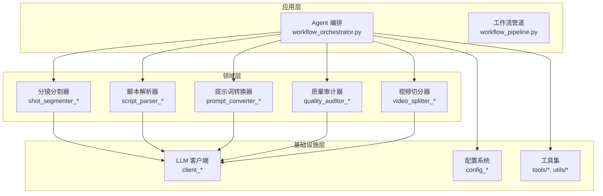

图表来源
- [workflow_orchestrator.py:1-120](file://src/penshot/neopen/agent/workflow/workflow_orchestrator.py#L1-L120)
- [workflow_pipeline.py:1-120](file://src/penshot/neopen/agent/workflow/workflow_pipeline.py#L1-L120)
- [shot_segmenter_factory.py:1-120](file://src/penshot/neopen/agent/shot_segmenter/shot_segmenter_factory.py#L1-L120)
- [script_parser_factory.py:1-120](file://src/penshot/neopen/agent/script_parser/script_parser_factory.py#L1-L120)
- [prompt_converter_factory.py:1-120](file://src/penshot/neopen/agent/prompt_converter/prompt_converter_factory.py#L1-L120)
- [quality_auditor_factory.py:1-120](file://src/penshot/neopen/agent/quality_auditor/quality_auditor_factory.py#L1-L120)
- [video_splitter_factory.py:1-120](file://src/penshot/neopen/agent/video_splitter/video_splitter_factory.py#L1-L120)
- [client_factory.py:1-120](file://src/penshot/neopen/client/client_factory.py#L1-L120)
- [config_loader.py:1-120](file://src/penshot/config/config_loader.py#L1-L120)

章节来源
- [conftest.py:1-200](file://tests/conftest.py#L1-L200)
- [test_config.py:1-200](file://tests/test_config.py#L1-L200)
- [test_workflow_orchestrator.py:1-200](file://tests/workflow/test_workflow_orchestrator.py#L1-L200)

## 核心组件
本节梳理Agent基础类、工厂模式、模型定义与工具链在测试中的关注点。

- Agent基础类与LLM基类
  - base_agent.py：提供Agent通用能力（生命周期、上下文、错误处理钩子）。
  - base_llm_agent.py：封装LLM调用、重试、缓存、提示词渲染等通用逻辑。
  - 测试要点：通过Mock替换LLM客户端；验证异常路径与重试策略；校验状态流转。

- 工厂与模型
  - *_factory.py：根据配置或参数创建具体实现，便于注入不同后端（规则/LLM）。
  - *_models.py：输入输出数据结构，用于构造测试数据与断言结果。
  - 测试要点：覆盖所有分支（如默认实现、未知类型抛出异常）；对模型字段进行边界值断言。

- 工具与配置
  - tools/*：JSON解析、结果存储、时长估算、脚本评估、脚本解析工具等。
  - config/*：配置加载、环境切换、模型定义。
  - 测试要点：隔离外部IO（文件系统、网络），使用内存或临时目录；用fixture注入配置。

章节来源
- [base_agent.py:1-200](file://src/penshot/neopen/agent/base_agent.py#L1-L200)
- [base_llm_agent.py:1-200](file://src/penshot/neopen/agent/base_llm_agent.py#L1-L200)
- [shot_segmenter_factory.py:1-120](file://src/penshot/neopen/agent/shot_segmenter/shot_segmenter_factory.py#L1-L120)
- [script_parser_factory.py:1-120](file://src/penshot/neopen/agent/script_parser/script_parser_factory.py#L1-L120)
- [prompt_converter_factory.py:1-120](file://src/penshot/neopen/agent/prompt_converter/prompt_converter_factory.py#L1-L120)
- [quality_auditor_factory.py:1-120](file://src/penshot/neopen/agent/quality_auditor/quality_auditor_factory.py#L1-L120)
- [video_splitter_factory.py:1-120](file://src/penshot/neopen/agent/video_splitter/video_splitter_factory.py#L1-L120)
- [config_loader.py:1-120](file://src/penshot/config/config_loader.py#L1-L120)
- [config_models.py:1-120](file://src/penshot/config/config_models.py#L1-L120)
- [json_parser_tool.py:1-120](file://src/penshot/neopen/tools/json_parser_tool.py#L1-L120)
- [result_storage_tool.py:1-120](file://src/penshot/neopen/tools/result_storage_tool.py#L1-L120)

## 架构总览
下图展示从编排到具体Agent再到LLM客户端与配置的调用关系，以及测试中常见的Mock注入点。

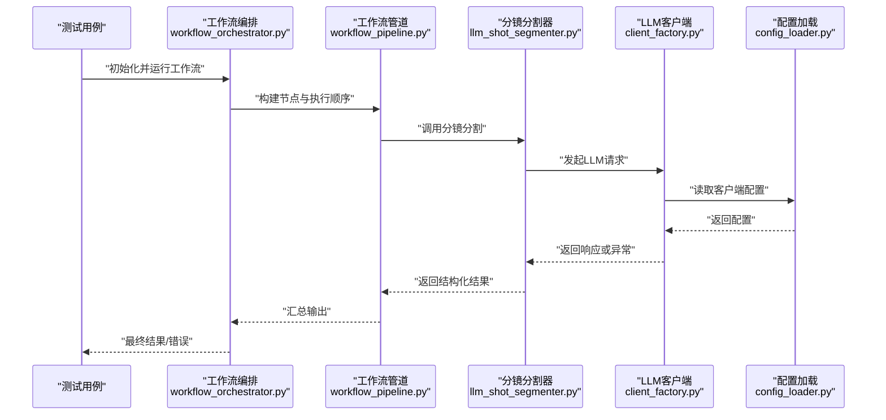

图表来源
- [workflow_orchestrator.py:1-120](file://src/penshot/neopen/agent/workflow/workflow_orchestrator.py#L1-L120)
- [workflow_pipeline.py:1-120](file://src/penshot/neopen/agent/workflow/workflow_pipeline.py#L1-L120)
- [llm_shot_segmenter.py:1-120](file://src/penshot/neopen/agent/shot_segmenter/llm_shot_segmenter.py#L1-L120)
- [client_factory.py:1-120](file://src/penshot/neopen/client/client_factory.py#L1-L120)
- [config_loader.py:1-120](file://src/penshot/config/config_loader.py#L1-L120)

## 详细组件分析

### 分镜分割器（Shot Segmenter）测试
- 关键类与关系
  - base_shot_segmenter.py：抽象接口与通用流程
  - llm_shot_segmenter.py / rule_shot_segmenter.py：LLM与规则两种实现
  - shot_segmenter_factory.py：按配置选择实现
  - shot_segmenter_models.py：输入输出模型

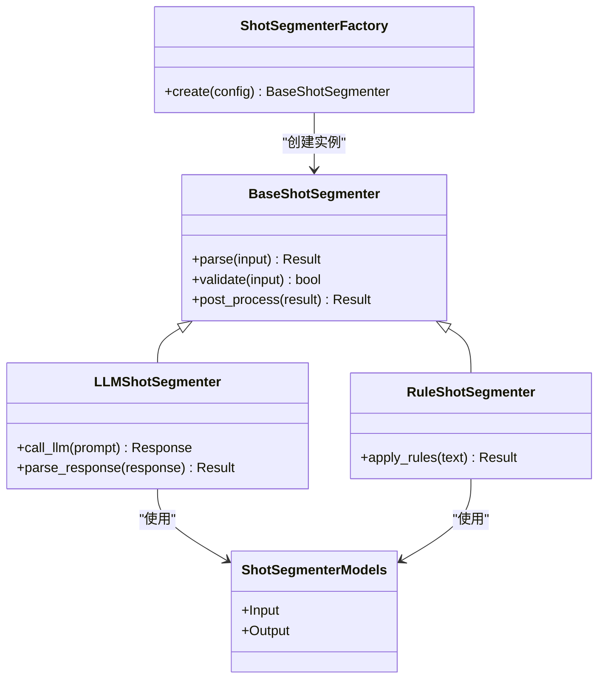

图表来源
- [base_shot_segmenter.py:1-120](file://src/penshot/neopen/agent/shot_segmenter/base_shot_segmenter.py#L1-L120)
- [llm_shot_segmenter.py:1-120](file://src/penshot/neopen/agent/shot_segmenter/llm_shot_segmenter.py#L1-L120)
- [rule_shot_segmenter.py:1-120](file://src/penshot/neopen/agent/shot_segmenter/rule_shot_segmenter.py#L1-L120)
- [shot_segmenter_factory.py:1-120](file://src/penshot/neopen/agent/shot_segmenter/shot_segmenter_factory.py#L1-L120)
- [shot_segmenter_models.py:1-120](file://src/penshot/neopen/agent/shot_segmenter/shot_segmenter_models.py#L1-L120)

- 测试要点
  - 工厂分支：分别传入不同配置，断言返回的具体实现类型。
  - LLM路径：Mock LLM客户端，验证提示词构造、响应解析、异常重试。
  - 规则路径：构造边界文本（空串、超长、特殊字符），断言规则命中与输出结构。
  - 模型校验：对输入输出字段进行必填性、枚举值、范围断言。

- 参考测试文件
  - [test_shot_segmenter.py:1-200](file://tests/test_shot_segmenter.py#L1-L200)

章节来源
- [test_shot_segmenter.py:1-200](file://tests/test_shot_segmenter.py#L1-L200)
- [shot_segmenter_factory.py:1-120](file://src/penshot/neopen/agent/shot_segmenter/shot_segmenter_factory.py#L1-L120)
- [llm_shot_segmenter.py:1-120](file://src/penshot/neopen/agent/shot_segmenter/llm_shot_segmenter.py#L1-L120)
- [rule_shot_segmenter.py:1-120](file://src/penshot/neopen/agent/shot_segmenter/rule_shot_segmenter.py#L1-L120)
- [shot_segmenter_models.py:1-120](file://src/penshot/neopen/agent/shot_segmenter/shot_segmenter_models.py#L1-L120)

### 脚本解析器（Script Parser）测试
- 关键类与关系
  - base_script_parser.py：抽象接口
  - llm_script_parser.py / rule_script_parser.py：LLM与规则实现
  - script_parser_models.py：输入输出模型

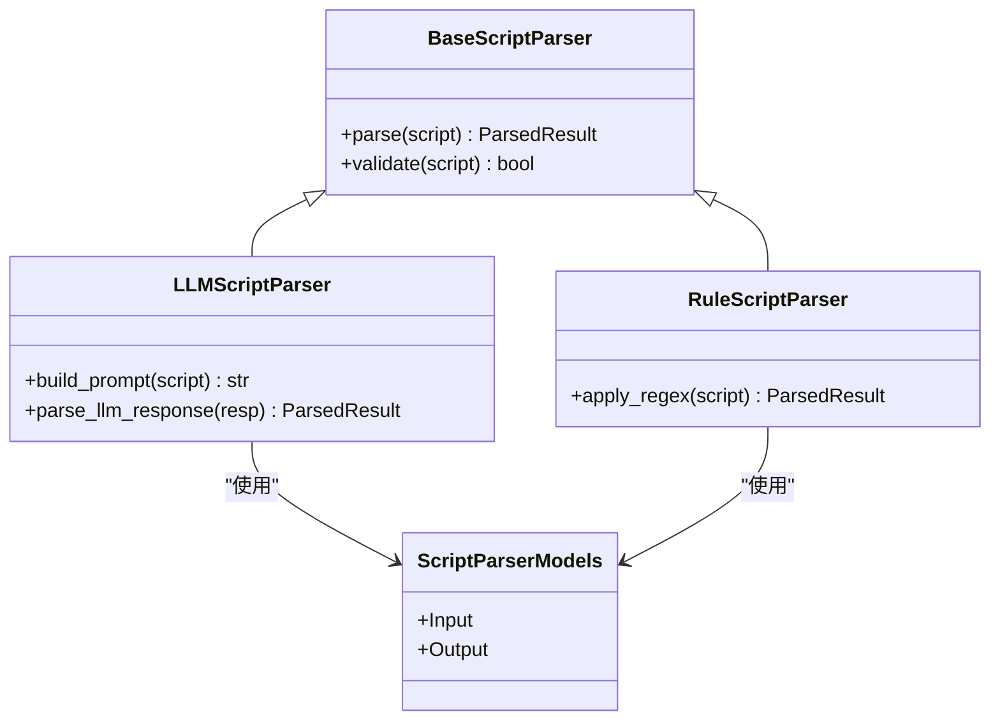

图表来源
- [base_script_parser.py:1-120](file://src/penshot/neopen/agent/script_parser/base_script_parser.py#L1-L120)
- [llm_script_parser.py:1-120](file://src/penshot/neopen/agent/script_parser/llm_script_parser.py#L1-L120)
- [rule_script_parser.py:1-120](file://src/penshot/neopen/agent/script_parser/rule_script_parser.py#L1-L120)
- [script_parser_models.py:1-120](file://src/penshot/neopen/agent/script_parser/script_parser_models.py#L1-L120)

- 测试要点
  - 提示词构造：断言模板变量替换正确。
  - 响应解析：覆盖JSON不完整、字段缺失、类型不匹配等情况。
  - 规则解析：正则边界条件与性能（大文本）断言。

- 参考测试文件
  - [test_script_parser.py:1-200](file://tests/test_script_parser.py#L1-L200)

章节来源
- [test_script_parser.py:1-200](file://tests/test_script_parser.py#L1-L200)
- [llm_script_parser.py:1-120](file://src/penshot/neopen/agent/script_parser/llm_script_parser.py#L1-L120)
- [rule_script_parser.py:1-120](file://src/penshot/neopen/agent/script_parser/rule_script_parser.py#L1-L120)
- [script_parser_models.py:1-120](file://src/penshot/neopen/agent/script_parser/script_parser_models.py#L1-L120)

### 提示词转换器（Prompt Converter）测试
- 关键类与关系
  - base_prompt_converter.py：抽象接口
  - llm_prompt_converter.py / template_prompt_converter.py：LLM与模板实现
  - prompt_converter_factory.py：工厂
  - prompt_converter_models.py：模型

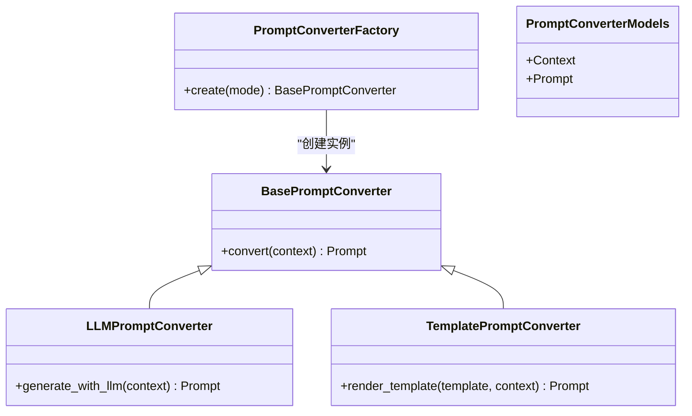

图表来源
- [base_prompt_converter.py:1-120](file://src/penshot/neopen/agent/prompt_converter/base_prompt_converter.py#L1-L120)
- [llm_prompt_converter.py:1-120](file://src/penshot/neopen/agent/prompt_converter/llm_prompt_converter.py#L1-L120)
- [template_prompt_converter.py:1-120](file://src/penshot/neopen/agent/prompt_converter/template_prompt_converter.py#L1-L120)
- [prompt_converter_factory.py:1-120](file://src/penshot/neopen/agent/prompt_converter/prompt_converter_factory.py#L1-L120)
- [prompt_converter_models.py:1-120](file://src/penshot/neopen/agent/prompt_converter/prompt_converter_models.py#L1-L120)

- 测试要点
  - 模板渲染：多语言、占位符缺失、转义字符。
  - LLM生成：Mock响应格式、长度限制、超时重试。
  - 工厂：mode映射与非法mode异常。

章节来源
- [prompt_converter_factory.py:1-120](file://src/penshot/neopen/agent/prompt_converter/prompt_converter_factory.py#L1-L120)
- [llm_prompt_converter.py:1-120](file://src/penshot/neopen/agent/prompt_converter/llm_prompt_converter.py#L1-L120)
- [template_prompt_converter.py:1-120](file://src/penshot/neopen/agent/prompt_converter/template_prompt_converter.py#L1-L120)
- [prompt_converter_models.py:1-120](file://src/penshot/neopen/agent/prompt_converter/prompt_converter_models.py#L1-L120)

### 质量审计器（Quality Auditor）测试
- 关键类与关系
  - base_quality_auditor.py：抽象接口
  - llm_quality_auditor.py / rule_quality_auditor.py：LLM与规则实现
  - quality_auditor_factory.py：工厂
  - quality_auditor_models.py：模型

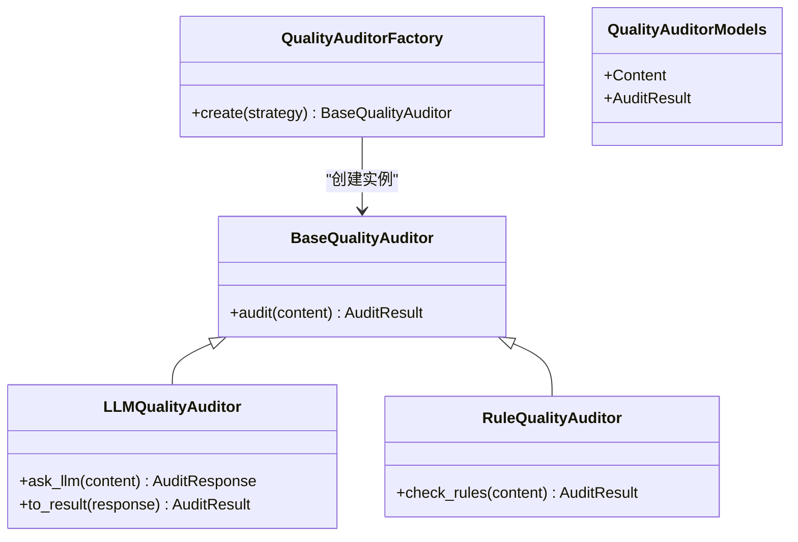

图表来源
- [base_quality_auditor.py:1-120](file://src/penshot/neopen/agent/quality_auditor/base_quality_auditor.py#L1-L120)
- [llm_quality_auditor.py:1-120](file://src/penshot/neopen/agent/quality_auditor/llm_quality_auditor.py#L1-L120)
- [rule_quality_auditor.py:1-120](file://src/penshot/neopen/agent/quality_auditor/rule_quality_auditor.py#L1-L120)
- [quality_auditor_factory.py:1-120](file://src/penshot/neopen/agent/quality_auditor/quality_auditor_factory.py#L1-L120)
- [quality_auditor_models.py:1-120](file://src/penshot/neopen/agent/quality_auditor/quality_auditor_models.py#L1-L120)

- 测试要点
  - 规则审计：阈值、关键词命中、评分计算。
  - LLM审计：响应字段完整性、评分归一化、失败降级。

章节来源
- [quality_auditor_factory.py:1-120](file://src/penshot/neopen/agent/quality_auditor/quality_auditor_factory.py#L1-L120)
- [llm_quality_auditor.py:1-120](file://src/penshot/neopen/agent/quality_auditor/llm_quality_auditor.py#L1-L120)
- [rule_quality_auditor.py:1-120](file://src/penshot/neopen/agent/quality_auditor/rule_quality_auditor.py#L1-L120)
- [quality_auditor_models.py:1-120](file://src/penshot/neopen/agent/quality_auditor/quality_auditor_models.py#L1-L120)

### 视频切分器（Video Splitter）测试
- 关键类与关系
  - base_video_splitter.py：抽象接口
  - llm_video_splitter.py / rule_video_splitter.py：LLM与规则实现
  - video_splitter_factory.py：工厂
  - video_splitter_models.py：模型

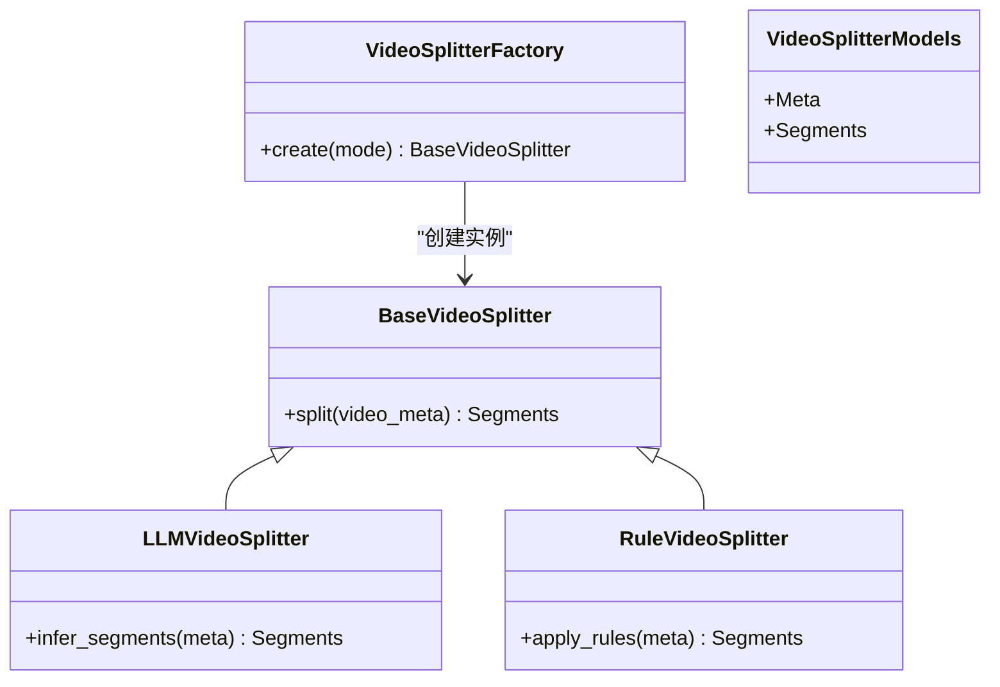

图表来源
- [base_video_splitter.py:1-120](file://src/penshot/neopen/agent/video_splitter/base_video_splitter.py#L1-L120)
- [llm_video_splitter.py:1-120](file://src/penshot/neopen/agent/video_splitter/llm_video_splitter.py#L1-L120)
- [rule_video_splitter.py:1-120](file://src/penshot/neopen/agent/video_splitter/rule_video_splitter.py#L1-L120)
- [video_splitter_factory.py:1-120](file://src/penshot/neopen/agent/video_splitter/video_splitter_factory.py#L1-L120)
- [video_splitter_models.py:1-120](file://src/penshot/neopen/agent/video_splitter/video_splitter_models.py#L1-L120)

- 测试要点
  - 元数据边界：时长为0、负数、超大值。
  - 规则切分：时间戳重叠、去重、排序。
  - LLM切分：响应片段数量、时间区间合法性。

章节来源
- [video_splitter_factory.py:1-120](file://src/penshot/neopen/agent/video_splitter/video_splitter_factory.py#L1-L120)
- [llm_video_splitter.py:1-120](file://src/penshot/neopen/agent/video_splitter/llm_video_splitter.py#L1-L120)
- [rule_video_splitter.py:1-120](file://src/penshot/neopen/agent/video_splitter/rule_video_splitter.py#L1-L120)
- [video_splitter_models.py:1-120](file://src/penshot/neopen/agent/video_splitter/video_splitter_models.py#L1-L120)

### 工作流编排（Workflow Orchestrator）测试
- 关键点
  - 节点注册与执行顺序
  - 中间状态持久化与恢复
  - 错误处理与重试策略
  - 输出规范化与修复

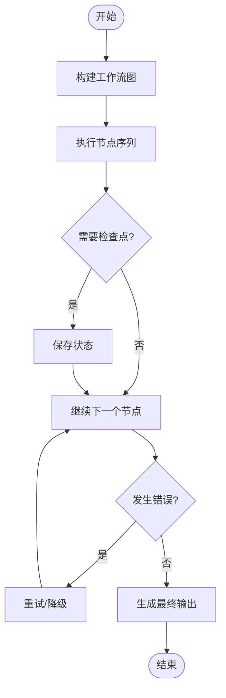

图表来源
- [workflow_orchestrator.py:1-120](file://src/penshot/neopen/agent/workflow/workflow_orchestrator.py#L1-L120)
- [workflow_pipeline.py:1-120](file://src/penshot/neopen/agent/workflow/workflow_pipeline.py#L1-L120)
- [workflow_output.py:1-120](file://src/penshot/neopen/agent/workflow/workflow_output.py#L1-L120)
- [workflow_error_handler.py:1-120](file://src/penshot/neopen/agent/workflow/workflow_error_handler.py#L1-L120)

- 参考测试文件
  - [test_workflow_orchestrator.py:1-200](file://tests/workflow/test_workflow_orchestrator.py#L1-L200)

章节来源
- [test_workflow_orchestrator.py:1-200](file://tests/workflow/test_workflow_orchestrator.py#L1-L200)
- [workflow_orchestrator.py:1-120](file://src/penshot/neopen/agent/workflow/workflow_orchestrator.py#L1-L120)
- [workflow_pipeline.py:1-120](file://src/penshot/neopen/agent/workflow/workflow_pipeline.py#L1-L120)
- [workflow_output.py:1-120](file://src/penshot/neopen/agent/workflow/workflow_output.py#L1-L120)
- [workflow_error_handler.py:1-120](file://src/penshot/neopen/agent/workflow/workflow_error_handler.py#L1-L120)

### LLM客户端与API客户端测试
- 客户端抽象与工厂
  - base_client.py：统一接口与公共行为
  - client_factory.py：按配置创建具体客户端
  - client_config.py：客户端配置模型

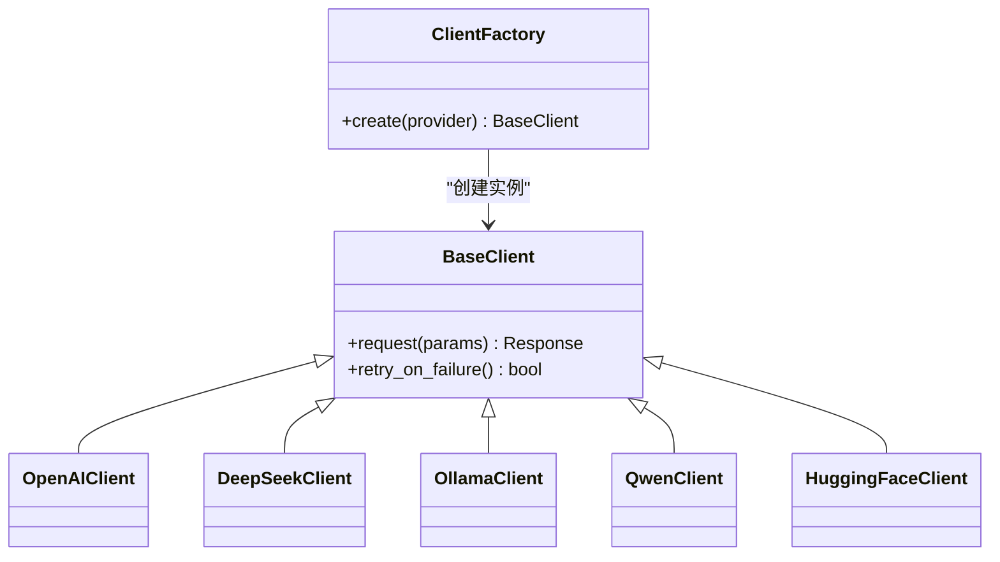

图表来源
- [base_client.py:1-120](file://src/penshot/neopen/client/base_client.py#L1-L120)
- [client_factory.py:1-120](file://src/penshot/neopen/client/client_factory.py#L1-L120)
- [client_config.py:1-120](file://src/penshot/neopen/client/client_config.py#L1-L120)

- 参考测试文件
  - [test_api_client.py:1-200](file://tests/unit/test_api_client.py#L1-L200)
  - [test_ollama_client.py:1-200](file://tests/unit/test_ollama_client.py#L1-L200)

- 测试要点
  - 工厂分支：provider映射、未知provider抛错。
  - 网络异常：超时、重试、退避策略。
  - 响应解析：字段校验、类型转换、错误码处理。

章节来源
- [test_api_client.py:1-200](file://tests/unit/test_api_client.py#L1-L200)
- [test_ollama_client.py:1-200](file://tests/unit/test_ollama_client.py#L1-L200)
- [client_factory.py:1-120](file://src/penshot/neopen/client/client_factory.py#L1-L120)
- [base_client.py:1-120](file://src/penshot/neopen/client/base_client.py#L1-L120)
- [client_config.py:1-120](file://src/penshot/neopen/client/client_config.py#L1-L120)

### 配置管理与测试
- 配置加载与模型
  - config_loader.py：加载YAML与环境变量
  - config_models.py：Pydantic模型定义
  - settings.yaml、development.yaml、production.yaml：环境配置

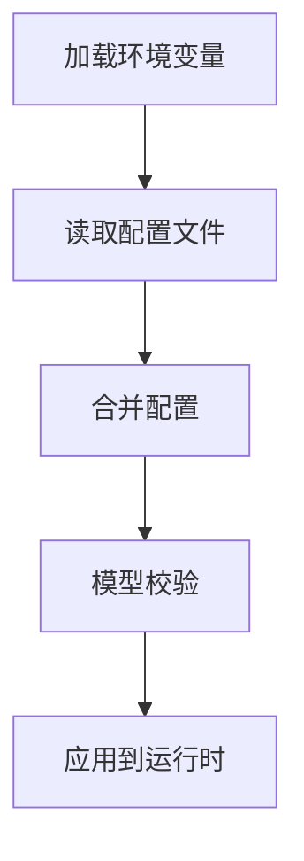

图表来源
- [config_loader.py:1-120](file://src/penshot/config/config_loader.py#L1-L120)
- [config_models.py:1-120](file://src/penshot/config/config_models.py#L1-L120)
- [settings.yaml:1-120](file://src/penshot/config/settings.yaml#L1-L120)
- [development.yaml:1-120](file://src/penshot/config/env/development.yaml#L1-L120)
- [production.yaml:1-120](file://src/penshot/config/env/production.yaml#L1-L120)

- 参考测试文件
  - [test_config.py:1-200](file://tests/test_config.py#L1-L200)

- 测试要点
  - 缺失键与类型不匹配：断言抛出明确错误。
  - 环境切换：development/production差异覆盖。
  - 环境变量优先级：覆盖配置文件同名项。

章节来源
- [test_config.py:1-200](file://tests/test_config.py#L1-L200)
- [config_loader.py:1-120](file://src/penshot/config/config_loader.py#L1-L120)
- [config_models.py:1-120](file://src/penshot/config/config_models.py#L1-L120)
- [settings.yaml:1-120](file://src/penshot/config/settings.yaml#L1-L120)
- [development.yaml:1-120](file://src/penshot/config/env/development.yaml#L1-L120)
- [production.yaml:1-120](file://src/penshot/config/env/production.yaml#L1-L120)

### 工具函数与测试
- 文件与API工具
  - file_utils.py：文件读写、路径处理
  - api_utils.py：HTTP请求封装
  - dotenv_loader.py：.env加载
  - log_utils.py：日志工具

- 参考测试文件
  - [test_utils.py:1-200](file://tests/unit/test_utils.py#L1-L200)

- 测试要点
  - 文件IO：使用临时目录与文件，清理资源。
  - API调用：Mock requests或httpx，断言URL、头、体、状态码。
  - 环境变量：注入与回退策略。

章节来源
- [test_utils.py:1-200](file://tests/unit/test_utils.py#L1-L200)
- [file_utils.py:1-120](file://src/penshot/utils/file_utils.py#L1-L120)
- [api_utils.py:1-120](file://src/penshot/utils/api_utils.py#L1-L120)
- [dotenv_loader.py:1-120](file://src/penshot/utils/dotenv_loader.py#L1-L120)
- [log_utils.py:1-120](file://src/penshot/utils/log_utils.py#L1-L120)

### 任务与工作流相关测试
- 任务工厂与生命周期
  - test_task_factory.py：工厂创建与注册
  - test_task_lifecycle_service.py：任务状态机与事件
  - test_memory.py：记忆存取与一致性

- 参考测试文件
  - [test_task_factory.py:1-200](file://tests/task/test_task_factory.py#L1-L200)
  - [test_task_lifecycle_service.py:1-200](file://tests/task/test_task_lifecycle_service.py#L1-L200)
  - [test_memory.py:1-200](file://tests/task/test_memory.py#L1-L200)

- 测试要点
  - 状态迁移：合法与非法转移断言。
  - 并发安全：竞态条件与锁机制。
  - 记忆一致性：写入后读取一致、过期清理。

章节来源
- [test_task_factory.py:1-200](file://tests/task/test_task_factory.py#L1-L200)
- [test_task_lifecycle_service.py:1-200](file://tests/task/test_task_lifecycle_service.py#L1-L200)
- [test_memory.py:1-200](file://tests/task/test_memory.py#L1-L200)

### 连续性守护（Continuity Guardian）测试
- 参考测试文件
  - [test_continuity_guardian.py:1-200](file://tests/test_continuity_guardian.py#L1-L200)

- 测试要点
  - 跨块一致性校验：冲突检测与修复建议。
  - 风格一致性：提示词风格约束断言。

章节来源
- [test_continuity_guardian.py:1-200](file://tests/test_continuity_guardian.py#L1-L200)

## 依赖分析
- 组件耦合与内聚
  - Agent层依赖工厂与模型，降低与具体实现的耦合。
  - 客户端层通过工厂与配置解耦不同LLM提供商。
  - 工具层保持高内聚、低耦合，便于Mock与替换。

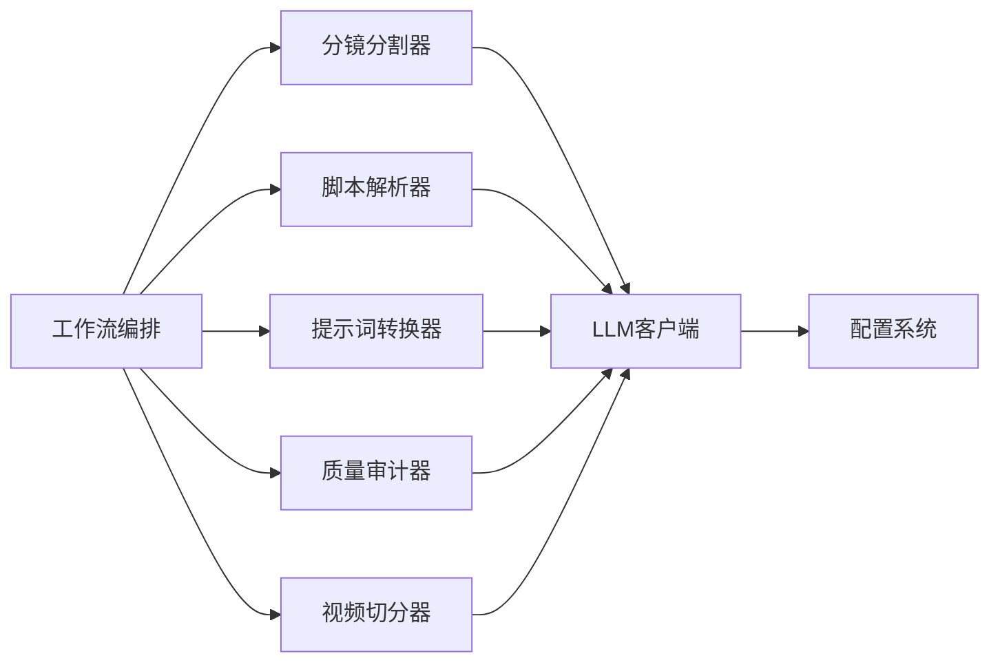

图表来源
- [workflow_orchestrator.py:1-120](file://src/penshot/neopen/agent/workflow/workflow_orchestrator.py#L1-L120)
- [client_factory.py:1-120](file://src/penshot/neopen/client/client_factory.py#L1-L120)
- [config_loader.py:1-120](file://src/penshot/config/config_loader.py#L1-L120)

章节来源
- [workflow_orchestrator.py:1-120](file://src/penshot/neopen/agent/workflow/workflow_orchestrator.py#L1-L120)
- [client_factory.py:1-120](file://src/penshot/neopen/client/client_factory.py#L1-L120)
- [config_loader.py:1-120](file://src/penshot/config/config_loader.py#L1-L120)

## 性能考虑
- 避免真实I/O：使用临时目录与内存数据库，减少磁盘与网络开销。
- 批量与并行：对无副作用的工具函数进行并行测试，注意线程安全。
- 大文本与长视频：构造边界数据验证性能与内存占用。
- 缓存与重试：验证缓存命中与重试退避对时延的影响。

[本节为通用指导，无需源码引用]

## 故障排查指南
- 常见错误
  - 配置缺失或类型错误：检查config_models校验与环境变量覆盖。
  - LLM响应解析失败：断言字段存在性与类型，增加健壮解析逻辑。
  - 文件权限与路径问题：使用绝对路径与临时目录，确保清理。
  - 异步测试超时：合理设置超时与重试上限。

- 调试技巧
  - pytest -v --tb=short：快速查看堆栈。
  - pytest -s：打印stdout以便观察日志。
  - 使用caplog捕获日志，结合断言定位问题。
  - 使用tmp_path fixture隔离文件操作。

章节来源
- [test_config.py:1-200](file://tests/test_config.py#L1-L200)
- [test_utils.py:1-200](file://tests/unit/test_utils.py#L1-L200)
- [test_api_client.py:1-200](file://tests/unit/test_api_client.py#L1-L200)
- [test_ollama_client.py:1-200](file://tests/unit/test_ollama_client.py#L1-L200)

## 结论
通过系统化组织测试、合理使用Mock与异步测试、严格断言与覆盖率要求，可显著提升Video Shot Agent的稳定性和可维护性。建议在CI中强制覆盖率门槛，并结合性能基准测试持续优化。

[本节为总结，无需源码引用]

## 附录
- 测试数据准备
  - 使用fixtures集中管理输入输出样例与配置。
  - 将大样本放入独立目录，按需加载。
- 断言最佳实践
  - 优先断言业务语义而非内部实现细节。
  - 对数值型结果使用近似比较，避免浮点误差。
- 覆盖率要求
  - 行覆盖率≥80%，分支覆盖率≥70%。
  - 关键路径（工厂、解析、错误处理）需接近100%。
- 调试方法
  - 使用pytest-xdist并行加速。
  - 使用pytest-timeout防止挂起。
  - 使用coverage报告定位未覆盖分支。

[本节为通用指导，无需源码引用]