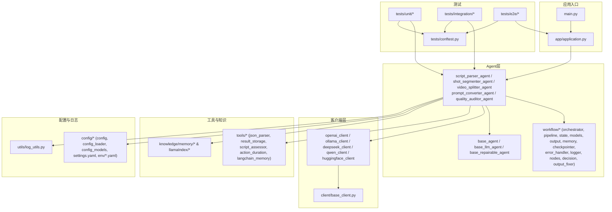
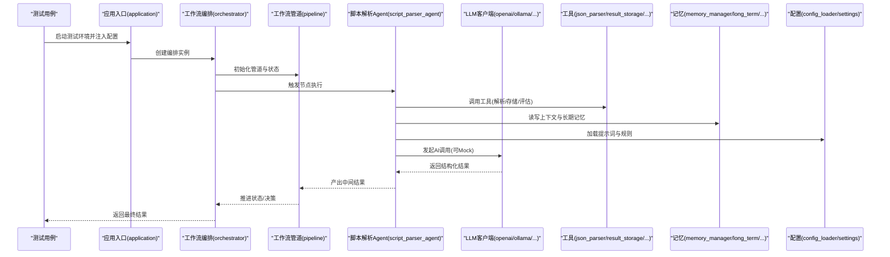
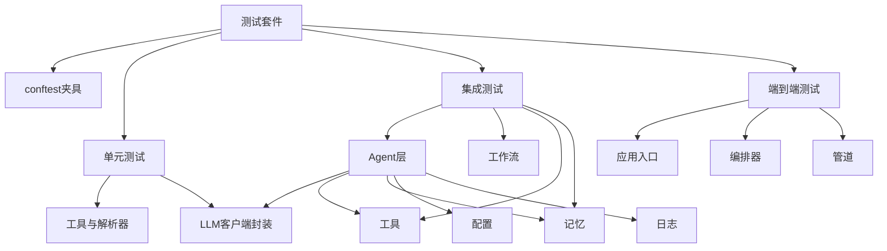

# 测试指南

<cite>
**本文引用的文件**   
- [pyproject.toml](file://pyproject.toml)
- [tests/conftest.py](file://tests/conftest.py)
- [tests/unit/test_api_client.py](file://tests/unit/test_api_client.py)
- [tests/unit/test_ollama_client.py](file://tests/unit/test_ollama_client.py)
- [tests/unit/test_parse_dict.py](file://tests/unit/test_parse_dict.py)
- [tests/unit/test_time_annotation.py](file://tests/unit/test_time_annotation.py)
- [tests/unit/test_utils.py](file://tests/unit/test_utils.py)
- [tests/integration/](file://tests/integration/)
- [tests/e2e/](file://tests/e2e/)
- [src/penshot/app/application.py](file://src/penshot/app/application.py)
- [src/penshot/client/base_client.py](file://src/penshot/client/base_client.py)
- [src/penshot/client/openai_client.py](file://src/penshot/client/openai_client.py)
- [src/penshot/client/ollama_client.py](file://src/penshot/client/ollama_client.py)
- [src/penshot/client/deepseek_client.py](file://src/penshot/client/deepseek_client.py)
- [src/penshot/client/qwen_client.py](file://src/penshot/client/qwen_client.py)
- [src/penshot/client/huggingface_client.py](file://src/penshot/client/huggingface_client.py)
- [src/penshot/neopen/agent/script_parser_agent.py](file://src/penshot/neopen/agent/script_parser_agent.py)
- [src/penshot/neopen/agent/shot_segmenter_agent.py](file://src/penshot/neopen/agent/shot_segmenter_agent.py)
- [src/penshot/neopen/agent/video_splitter_agent.py](file://src/penshot/neopen/agent/video_splitter_agent.py)
- [src/penshot/neopen/agent/prompt_converter_agent.py](file://src/penshot/neopen/agent/prompt_converter_agent.py)
- [src/penshot/neopen/agent/quality_auditor_agent.py](file://src/penshot/neopen/agent/quality_auditor_agent.py)
- [src/penshot/neopen/agent/workflow/workflow_orchestrator.py](file://src/penshot/neopen/agent/workflow/workflow_orchestrator.py)
- [src/penshot/neopen/agent/workflow/workflow_pipeline.py](file://src/penshot/neopen/agent/workflow/workflow_pipeline.py)
- [src/penshot/neopen/agent/workflow/workflow_state_types.py](file://src/penshot/neopen/agent/workflow/workflow_state_types.py)
- [src/penshot/neopen/agent/workflow/workflow_models.py](file://src/penshot/neopen/agent/workflow/workflow_models.py)
- [src/penshot/neopen/agent/workflow/workflow_output.py](file://src/penshot/neopen/agent/workflow/workflow_output.py)
- [src/penshot/neopen/agent/workflow/workflow_memory.py](file://src/penshot/neopen/agent/workflow/workflow_memory.py)
- [src/penshot/neopen/agent/workflow/workflow_checkpointer.py](file://src/penshot/neopen/agent/workflow/workflow_checkpointer.py)
- [src/penshot/neopen/agent/workflow/workflow_error_handler.py](file://src/penshot/neopen/agent/workflow/workflow_error_handler.py)
- [src/penshot/neopen/agent/workflow/workflow_logger.py](file://src/penshot/neopen/agent/workflow/workflow_logger.py)
- [src/penshot/neopen/agent/workflow/workflow_nodes.py](file://src/penshot/neopen/agent/workflow/workflow_nodes.py)
- [src/penshot/neopen/agent/workflow/workflow_decision.py](file://src/penshot/neopen/agent/workflow/workflow_decision.py)
- [src/penshot/neopen/agent/workflow/workflow_output_fixer.py](file://src/penshot/neopen/agent/workflow/workflow_output_fixer.py)
- [src/penshot/neopen/agent/workflow/__init__.py](file://src/penshot/neopen/agent/workflow/__init__.py)
- [src/penshot/neopen/agent/base_llm_agent.py](file://src/penshot/neopen/agent/base_llm_agent.py)
- [src/penshot/neopen/agent/base_agent.py](file://src/penshot/neopen/agent/base_agent.py)
- [src/penshot/neopen/agent/base_repairable_agent.py](file://src/penshot/neopen/agent/base_repairable_agent.py)
- [src/penshot/neopen/agent/base_models.py](file://src/penshot/neopen/agent/base_models.py)
- [src/penshot/neopen/agent/script_parser/llm_script_parser.py](file://src/penshot/neopen/agent/script_parser/llm_script_parser.py)
- [src/penshot/neopen/agent/script_parser/rule_script_parser.py](file://src/penshot/neopen/agent/script_parser/rule_script_parser.py)
- [src/penshot/neopen/agent/script_parser/base_script_parser.py](file://src/penshot/neopen/agent/script_parser/base_script_parser.py)
- [src/penshot/neopen/agent/script_parser/script_parser_models.py](file://src/penshot/neopen/agent/script_parser/script_parser_models.py)
- [src/penshot/neopen/agent/shot_segmenter/llm_shot_segmenter.py](file://src/penshot/neopen/agent/shot_segmenter/llm_shot_segmenter.py)
- [src/penshot/neopen/agent/shot_segmenter/rule_shot_segmenter.py](file://src/penshot/neopen/agent/shot_segmenter/rule_shot_segmenter.py)
- [src/penshot/neopen/agent/shot_segmenter/base_shot_segmenter.py](file://src/penshot/neopen/agent/shot_segmenter/base_shot_segmenter.py)
- [src/penshot/neopen/agent/shot_segmenter/shot_segmenter_models.py](file://src/penshot/neopen/agent/shot_segmenter/shot_segmenter_models.py)
- [src/penshot/neopen/agent/video_splitter/llm_video_splitter.py](file://src/penshot/neopen/agent/video_splitter/llm_video_splitter.py)
- [src/penshot/neopen/agent/video_splitter/rule_video_splitter.py](file://src/penshot/neopen/agent/video_splitter/rule_video_splitter.py)
- [src/penshot/neopen/agent/video_splitter/base_video_splitter.py](file://src/penshot/neopen/agent/video_splitter/base_video_splitter.py)
- [src/penshot/neopen/agent/video_splitter/video_splitter_models.py](file://src/penshot/neopen/agent/video_splitter/video_splitter_models.py)
- [src/penshot/neopen/agent/prompt_converter/llm_prompt_converter.py](file://src/penshot/neopen/agent/prompt_converter/llm_prompt_converter.py)
- [src/penshot/neopen/agent/prompt_converter/template_prompt_converter.py](file://src/penshot/neopen/agent/prompt_converter/template_prompt_converter.py)
- [src/penshot/neopen/agent/prompt_converter/base_prompt_converter.py](file://src/penshot/neopen/agent/prompt_converter/base_prompt_converter.py)
- [src/penshot/neopen/agent/prompt_converter/prompt_converter_models.py](file://src/penshot/neopen/agent/prompt_converter/prompt_converter_models.py)
- [src/penshot/neopen/agent/quality_auditor/llm_quality_auditor.py](file://src/penshot/neopen/agent/quality_auditor/llm_quality_auditor.py)
- [src/penshot/neopen/agent/quality_auditor/rule_quality_auditor.py](file://src/penshot/neopen/agent/quality_auditor/rule_quality_auditor.py)
- [src/penshot/neopen/agent/quality_auditor/base_quality_auditor.py](file://src/penshot/neopen/agent/quality_auditor/base_quality_auditor.py)
- [src/penshot/neopen/agent/quality_auditor/quality_auditor_models.py](file://src/penshot/neopen/agent/quality_auditor/quality_auditor_models.py)
- [src/penshot/neopen/agent/continuity_guardian/continuity_guardian_checker.py](file://src/penshot/neopen/agent/continuity_guardian/continuity_guardian_checker.py)
- [src/penshot/neopen/agent/continuity_guardian/continuity_repair_generator.py](file://src/penshot/neopen/agent/continuity_guardian/continuity_repair_generator.py)
- [src/penshot/neopen/agent/continuity_guardian/cross_chunk_validator.py](file://src/penshot/neopen/agent/continuity_guardian/cross_chunk_validator.py)
- [src/penshot/neopen/agent/continuity_guardian/long_script_chunker.py](file://src/penshot/neopen/agent/continuity_guardian/long_script_chunker.py)
- [src/penshot/neopen/agent/continuity_guardian/prompt_style_guardian.py](file://src/penshot/neopen/agent/continuity_guardian/prompt_style_guardian.py)
- [src/penshot/neopen/agent/continuity_guardian/consistency_contract.py](file://src/penshot/neopen/agent/continuity_guardian/consistency_contract.py)
- [src/penshot/neopen/agent/continuity_guardian/continuity_guardian_models.py](file://src/penshot/neopen/agent/continuity_guardian/continuity_guardian_models.py)
- [src/penshot/neopen/agent/human_decision/human_decision_converter.py](file://src/penshot/neopen/agent/human_decision/human_decision_converter.py)
- [src/penshot/neopen/agent/human_decision/human_decision_intervention.py](file://src/penshot/neopen/agent/human_decision/human_decision_intervention.py)
- [src/penshot/neopen/agent/human_decision/human_enhanced_converter.py](file://src/penshot/neopen/agent/human_decision/human_enhanced_converter.py)
- [src/penshot/neopen/agent/human_decision/human_decision_models.py](file://src/penshot/neopen/agent/human_decision/human_decision_models.py)
- [src/penshot/neopen/agent/shot_segmenter/estimator/action_estimator.py](file://src/penshot/neopen/agent/shot_segmenter/estimator/action_estimator.py)
- [src/penshot/neopen/agent/shot_segmenter/estimator/dialogue_estimator.py](file://src/penshot/neopen/agent/shot_segmenter/estimator/dialogue_estimator.py)
- [src/penshot/neopen/agent/shot_segmenter/estimator/scene_estimator.py](file://src/penshot/neopen/agent/shot_segmenter/estimator/scene_estimator.py)
- [src/penshot/neopen/agent/shot_segmenter/estimator/base_estimator.py](file://src/penshot/neopen/agent/shot_segmenter/estimator/base_estimator.py)
- [src/penshot/neopen/agent/shot_segmenter/estimator/estimator_factory.py](file://src/penshot/neopen/agent/shot_segmenter/estimator/estimator_factory.py)
- [src/penshot/neopen/agent/shot_segmenter/estimator/estimator_enhancer.py](file://src/penshot/neopen/agent/shot_segmenter/estimator/estimator_enhancer.py)
- [src/penshot/neopen/agent/shot_segmenter/estimator/estimator_models.py](file://src/penshot/neopen/agent/shot_segmenter/estimator/estimator_models.py)
- [src/penshot/neopen/agent/script_parser/__init__.py](file://src/penshot/neopen/agent/script_parser/__init__.py)
- [src/penshot/neopen/agent/shot_segmenter/__init__.py](file://src/penshot/neopen/agent/shot_segmenter/__init__.py)
- [src/penshot/neopen/agent/video_splitter/__init__.py](file://src/penshot/neopen/agent/video_splitter/__init__.py)
- [src/penshot/neopen/agent/workflow/__init__.py](file://src/penshot/neopen/agent/workflow/__init__.py)
- [src/penshot/neopen/agent/__init__.py](file://src/penshot/neopen/agent/__init__.py)
- [src/penshot/neopen/cache/adaptive_llm_cache.py](file://src/penshot/neopen/cache/adaptive_llm_cache.py)
- [src/penshot/neopen/cache/llm_cache.py](file://src/penshot/neopen/cache/llm_cache.py)
- [src/penshot/neopen/knowledge/memory/long_term_memory.py](file://src/penshot/neopen/knowledge/memory/long_term_memory.py)
- [src/penshot/neopen/knowledge/memory/medium_term_memory.py](file://src/penshot/neopen/knowledge/memory/medium_term_memory.py)
- [src/penshot/neopen/knowledge/memory/short_term_memory.py](file://src/penshot/neopen/knowledge/memory/short_term_memory.py)
- [src/penshot/neopen/knowledge/memory/memory_manager.py](file://src/penshot/neopen/knowledge/memory/memory_manager.py)
- [src/penshot/neopen/knowledge/memory/memory_context.py](file://src/penshot/neopen/knowledge/memory/memory_context.py)
- [src/penshot/neopen/knowledge/memory/memory_models.py](file://src/penshot/neopen/knowledge/memory/memory_models.py)
- [src/penshot/neopen/knowledge/memory/script_memory.py](file://src/penshot/neopen/knowledge/memory/script_memory.py)
- [src/penshot/neopen/knowledge/llamaIndex/llama_index_knowledge.py](file://src/penshot/neopen/knowledge/llamaIndex/llama_index_knowledge.py)
- [src/penshot/neopen/knowledge/llamaIndex/llama_index_loader.py](file://src/penshot/neopen/knowledge/llamaIndex/llama_index_loader.py)
- [src/penshot/neopen/knowledge/llamaIndex/llama_index_retriever.py](file://src/penshot/neopen/knowledge/llamaIndex/llama_index_retriever.py)
- [src/penshot/neopen/knowledge/llamaIndex/llama_index_tool.py](file://src/penshot/neopen/knowledge/llamaIndex/llama_index_tool.py)
- [src/penshot/neopen/tools/result_storage_tool.py](file://src/penshot/neopen/tools/result_storage_tool.py)
- [src/penshot/neopen/tools/json_parser_tool.py](file://src/penshot/neopen/tools/json_parser_tool.py)
- [src/penshot/neopen/tools/script_assessor_tool.py](file://src/penshot/neopen/tools/script_assessor_tool.py)
- [src/penshot/neopen/tools/script_parser_tool.py](file://src/penshot/neopen/tools/script_parser_tool.py)
- [src/penshot/neopen/tools/action_duration_tool.py](file://src/penshot/neopen/tools/action_duration_tool.py)
- [src/penshot/neopen/tools/langchain_memory_tool.py](file://src/penshot/neopen/tools/langchain_memory_tool.py)
- [src/penshot/utils/log_utils.py](file://src/penshot/utils/log_utils.py)
- [src/penshot/utils/file_utils.py](file://src/penshot/utils/file_utils.py)
- [src/penshot/utils/env_utils.py](file://src/penshot/utils/env_utils.py)
- [src/penshot/config/config.py](file://src/penshot/config/config.py)
- [src/penshot/config/config_loader.py](file://src/penshot/config/config_loader.py)
- [src/penshot/config/config_models.py](file://src/penshot/config/config_models.py)
- [src/penshot/config/settings.yaml](file://src/penshot/config/settings.yaml)
- [src/penshot/config/env/development.yaml](file://src/penshot/config/env/development.yaml)
- [src/penshot/config/env/production.yaml](file://src/penshot/config/env/production.yaml)
- [examples/direct_usage.py](file://examples/direct_usage.py)
- [examples/a2a_integration.py](file://examples/a2a_integration.py)
- [examples/langgraph_integration.py](file://examples/langgraph_integration.py)
- [scripts/cli.py](file://scripts/cli.py)
- [main.py](file://main.py)
</cite>

## 目录
1. [简介](#简介)
2. [项目结构](#项目结构)
3. [核心组件](#核心组件)
4. [架构总览](#架构总览)
5. [详细组件分析](#详细组件分析)
6. [依赖分析](#依赖分析)
7. [性能考虑](#性能考虑)
8. [故障排查指南](#故障排查指南)
9. [结论](#结论)
10. [附录](#附录)

## 简介
本指南面向Video Shot Agent的测试工作，覆盖单元测试、集成测试与端到端测试的编写方法与最佳实践。文档重点包括：
- 测试框架与配置（pytest）
- 测试数据准备与Mock策略
- AI相关功能测试（LLM调用模拟、结果验证）
- 覆盖率要求与持续集成建议
- 具体用例示例与调试技巧

## 项目结构
仓库采用分层组织方式：应用层、Agent层、客户端层、工具与知识层、配置与日志等。测试目录按类型划分：unit、integration、e2e、planner、task、workflow、api、knowledge等。

图表来源
- [main.py](file://main.py)
- [src/penshot/app/application.py](file://src/penshot/app/application.py)
- [src/penshot/neopen/agent/base_agent.py](file://src/penshot/neopen/agent/base_agent.py)
- [src/penshot/neopen/agent/base_llm_agent.py](file://src/penshot/neopen/agent/base_llm_agent.py)
- [src/penshot/neopen/agent/base_repairable_agent.py](file://src/penshot/neopen/agent/base_repairable_agent.py)
- [src/penshot/neopen/agent/script_parser_agent.py](file://src/penshot/neopen/agent/script_parser_agent.py)
- [src/penshot/neopen/agent/shot_segmenter_agent.py](file://src/penshot/neopen/agent/shot_segmenter_agent.py)
- [src/penshot/neopen/agent/video_splitter_agent.py](file://src/penshot/neopen/agent/video_splitter_agent.py)
- [src/penshot/neopen/agent/prompt_converter_agent.py](file://src/penshot/neopen/agent/prompt_converter_agent.py)
- [src/penshot/neopen/agent/quality_auditor_agent.py](file://src/penshot/neopen/agent/quality_auditor_agent.py)
- [src/penshot/neopen/agent/workflow/workflow_orchestrator.py](file://src/penshot/neopen/agent/workflow/workflow_orchestrator.py)
- [src/penshot/neopen/agent/workflow/workflow_pipeline.py](file://src/penshot/neopen/agent/workflow/workflow_pipeline.py)
- [src/penshot/neopen/agent/workflow/workflow_state_types.py](file://src/penshot/neopen/agent/workflow/workflow_state_types.py)
- [src/penshot/neopen/agent/workflow/workflow_models.py](file://src/penshot/neopen/agent/workflow/workflow_models.py)
- [src/penshot/neopen/agent/workflow/workflow_output.py](file://src/penshot/neopen/agent/workflow/workflow_output.py)
- [src/penshot/neopen/agent/workflow/workflow_memory.py](file://src/penshot/neopen/agent/workflow/workflow_memory.py)
- [src/penshot/neopen/agent/workflow/workflow_checkpointer.py](file://src/penshot/neopen/agent/workflow/workflow_checkpointer.py)
- [src/penshot/neopen/agent/workflow/workflow_error_handler.py](file://src/penshot/neopen/agent/workflow/workflow_error_handler.py)
- [src/penshot/neopen/agent/workflow/workflow_logger.py](file://src/penshot/neopen/agent/workflow/workflow_logger.py)
- [src/penshot/neopen/agent/workflow/workflow_nodes.py](file://src/penshot/neopen/agent/workflow/workflow_nodes.py)
- [src/penshot/neopen/agent/workflow/workflow_decision.py](file://src/penshot/neopen/agent/workflow/workflow_decision.py)
- [src/penshot/neopen/agent/workflow/workflow_output_fixer.py](file://src/penshot/neopen/agent/workflow/workflow_output_fixer.py)
- [src/penshot/client/base_client.py](file://src/penshot/client/base_client.py)
- [src/penshot/client/openai_client.py](file://src/penshot/client/openai_client.py)
- [src/penshot/client/ollama_client.py](file://src/penshot/client/ollama_client.py)
- [src/penshot/client/deepseek_client.py](file://src/penshot/client/deepseek_client.py)
- [src/penshot/client/qwen_client.py](file://src/penshot/client/qwen_client.py)
- [src/penshot/client/huggingface_client.py](file://src/penshot/client/huggingface_client.py)
- [src/penshot/neopen/tools/json_parser_tool.py](file://src/penshot/neopen/tools/json_parser_tool.py)
- [src/penshot/neopen/tools/result_storage_tool.py](file://src/penshot/neopen/tools/result_storage_tool.py)
- [src/penshot/neopen/knowledge/memory/long_term_memory.py](file://src/penshot/neopen/knowledge/memory/long_term_memory.py)
- [src/penshot/neopen/knowledge/memory/medium_term_memory.py](file://src/penshot/neopen/knowledge/memory/medium_term_memory.py)
- [src/penshot/neopen/knowledge/memory/short_term_memory.py](file://src/penshot/neopen/knowledge/memory/short_term_memory.py)
- [src/penshot/neopen/knowledge/memory/memory_manager.py](file://src/penshot/neopen/knowledge/memory/memory_manager.py)
- [src/penshot/neopen/knowledge/memory/memory_context.py](file://src/penshot/neopen/knowledge/memory/memory_context.py)
- [src/penshot/neopen/knowledge/memory/memory_models.py](file://src/penshot/neopen/knowledge/memory/memory_models.py)
- [src/penshot/neopen/knowledge/memory/script_memory.py](file://src/penshot/neopen/knowledge/memory/script_memory.py)
- [src/penshot/neopen/knowledge/llamaIndex/llama_index_knowledge.py](file://src/penshot/neopen/knowledge/llamaIndex/llama_index_knowledge.py)
- [src/penshot/neopen/knowledge/llamaIndex/llama_index_loader.py](file://src/penshot/neopen/knowledge/llamaIndex/llama_index_loader.py)
- [src/penshot/neopen/knowledge/llamaIndex/llama_index_retriever.py](file://src/penshot/neopen/knowledge/llamaIndex/llama_index_retriever.py)
- [src/penshot/neopen/knowledge/llamaIndex/llama_index_tool.py](file://src/penshot/neopen/knowledge/llamaIndex/llama_index_tool.py)
- [src/penshot/config/config.py](file://src/penshot/config/config.py)
- [src/penshot/config/config_loader.py](file://src/penshot/config/config_loader.py)
- [src/penshot/config/config_models.py](file://src/penshot/config/config_models.py)
- [src/penshot/config/settings.yaml](file://src/penshot/config/settings.yaml)
- [src/penshot/config/env/development.yaml](file://src/penshot/config/env/development.yaml)
- [src/penshot/config/env/production.yaml](file://src/penshot/config/env/production.yaml)
- [src/penshot/utils/log_utils.py](file://src/penshot/utils/log_utils.py)
- [tests/conftest.py](file://tests/conftest.py)

章节来源
- [pyproject.toml](file://pyproject.toml)
- [tests/conftest.py](file://tests/conftest.py)

## 核心组件
本节聚焦于测试相关的核心能力与约定：
- pytest配置与插件：通过项目根配置启用pytest与覆盖率统计；conftest提供全局夹具与共享设置。
- 测试分层：
  - 单元测试：针对工具函数、解析器、客户端封装、模型校验等。
  - 集成测试：围绕Agent与外部依赖（LLM、缓存、存储、记忆）的协作。
  - 端到端测试：从应用入口到完整工作流执行。
- Mock策略：对LLM客户端、文件系统、网络请求进行隔离，保证可重复性与快速反馈。
- 数据准备：使用fixtures与示例数据，避免硬编码敏感信息。
- AI功能测试：通过替换LLM客户端为Mock或本地轻量实现，验证提示词组装、输出结构与业务逻辑。

章节来源
- [pyproject.toml](file://pyproject.toml)
- [tests/conftest.py](file://tests/conftest.py)

## 架构总览
下图展示从应用入口到Agent、工作流、客户端与工具的调用关系，便于定位测试切入点与Mock位置。

图表来源
- [src/penshot/app/application.py](file://src/penshot/app/application.py)
- [src/penshot/neopen/agent/workflow/workflow_orchestrator.py](file://src/penshot/neopen/agent/workflow/workflow_orchestrator.py)
- [src/penshot/neopen/agent/workflow/workflow_pipeline.py](file://src/penshot/neopen/agent/workflow/workflow_pipeline.py)
- [src/penshot/neopen/agent/script_parser_agent.py](file://src/penshot/neopen/agent/script_parser_agent.py)
- [src/penshot/client/openai_client.py](file://src/penshot/client/openai_client.py)
- [src/penshot/client/ollama_client.py](file://src/penshot/client/ollama_client.py)
- [src/penshot/neopen/tools/json_parser_tool.py](file://src/penshot/neopen/tools/json_parser_tool.py)
- [src/penshot/neopen/tools/result_storage_tool.py](file://src/penshot/neopen/tools/result_storage_tool.py)
- [src/penshot/neopen/knowledge/memory/memory_manager.py](file://src/penshot/neopen/knowledge/memory/memory_manager.py)
- [src/penshot/neopen/knowledge/memory/long_term_memory.py](file://src/penshot/neopen/knowledge/memory/long_term_memory.py)
- [src/penshot/config/config_loader.py](file://src/penshot/config/config_loader.py)
- [src/penshot/config/settings.yaml](file://src/penshot/config/settings.yaml)

## 详细组件分析

### 测试框架与配置（pytest）
- 在pyproject中启用pytest与覆盖率插件，统一测试运行参数与报告生成。
- 在tests/conftest.py中定义全局夹具：
  - 配置夹具：加载settings与环境变量，支持开发/生产环境切换。
  - 客户端夹具：提供Mock或轻量实现的LLM客户端，用于单元测试与集成测试。
  - 工具夹具：提供JSON解析、结果存储、脚本评估等工具的Mock版本。
  - 记忆夹具：提供内存型短期/中期/长期记忆，避免持久化依赖。
  - 工作流夹具：提供最小化的编排与管道实例，便于端到端冒烟测试。

章节来源
- [pyproject.toml](file://pyproject.toml)
- [tests/conftest.py](file://tests/conftest.py)

### 单元测试编写方法
- 目标范围：
  - 工具函数与解析器：如JSON解析、时间标注、字典解析等。
  - 客户端封装：OpenAI/Ollama/DeepSeek/Qwen/HuggingFace客户端的参数组装与错误处理。
  - 模型校验：输入/输出模型的字段约束与默认值。
- 最佳实践：
  - 使用fixture构造最小输入，避免真实I/O。
  - 对网络与外部服务使用unittest.mock或第三方库进行打桩。
  - 断言结构化输出（模型字段、枚举值、边界条件）。
- 参考用例路径：
  - [tests/unit/test_parse_dict.py](file://tests/unit/test_parse_dict.py)
  - [tests/unit/test_time_annotation.py](file://tests/unit/test_time_annotation.py)
  - [tests/unit/test_utils.py](file://tests/unit/test_utils.py)
  - [tests/unit/test_api_client.py](file://tests/unit/test_api_client.py)
  - [tests/unit/test_ollama_client.py](file://tests/unit/test_ollama_client.py)

章节来源
- [tests/unit/test_parse_dict.py](file://tests/unit/test_parse_dict.py)
- [tests/unit/test_time_annotation.py](file://tests/unit/test_time_annotation.py)
- [tests/unit/test_utils.py](file://tests/unit/test_utils.py)
- [tests/unit/test_api_client.py](file://tests/unit/test_api_client.py)
- [tests/unit/test_ollama_client.py](file://tests/unit/test_ollama_client.py)

### 集成测试编写方法
- 目标范围：
  - Agent与工作流的协作：脚本解析、镜头分割、视频拆分、提示词转换、质量审计。
  - 工具与记忆的交互：JSON解析、结果存储、脚本评估、动作时长、LangChain记忆。
  - 客户端与缓存：LLM客户端调用与自适应缓存行为。
- 最佳实践：
  - 使用conftest提供的Mock客户端与内存记忆，确保可重复性。
  - 使用小型真实数据样本，验证端到端链路但不依赖外部服务。
  - 对工作流状态与决策点进行断言，确保流程正确推进。
- 参考用例路径：
  - [tests/integration/](file://tests/integration/)
  - [tests/task/test_task_factory.py](file://tests/task/test_task_factory.py)
  - [tests/task/test_task_lifecycle_service.py](file://tests/task/test_task_lifecycle_service.py)
  - [tests/task/test_workflow_registry.py](file://tests/task/test_workflow_registry.py)
  - [tests/workflow/test_workflow_orchestrator.py](file://tests/workflow/test_workflow_orchestrator.py)

章节来源
- [tests/integration/](file://tests/integration/)
- [tests/task/test_task_factory.py](file://tests/task/test_task_factory.py)
- [tests/task/test_task_lifecycle_service.py](file://tests/task/test_task_lifecycle_service.py)
- [tests/task/test_workflow_registry.py](file://tests/task/test_workflow_registry.py)
- [tests/workflow/test_workflow_orchestrator.py](file://tests/workflow/test_workflow_orchestrator.py)

### 端到端测试编写方法
- 目标范围：
  - 从应用入口到完整工作流执行，覆盖配置加载、任务创建、节点执行、结果输出。
- 最佳实践：
  - 使用最小数据集与Mock LLM，缩短执行时间。
  - 记录关键日志与中间状态，便于问题定位。
  - 断言最终输出的完整性与一致性。
- 参考用例路径：
  - [tests/e2e/](file://tests/e2e/)
  - [examples/direct_usage.py](file://examples/direct_usage.py)
  - [examples/a2a_integration.py](file://examples/a2a_integration.py)
  - [examples/langgraph_integration.py](file://examples/langgraph_integration.py)

章节来源
- [tests/e2e/](file://tests/e2e/)
- [examples/direct_usage.py](file://examples/direct_usage.py)
- [examples/a2a_integration.py](file://examples/a2a_integration.py)
- [examples/langgraph_integration.py](file://examples/langgraph_integration.py)

### AI相关功能测试（LLM调用模拟与结果验证）
- 模拟策略：
  - 使用conftest中的客户端夹具，将LLM客户端替换为返回固定结构的Mock。
  - 对提示词模板与参数组装进行断言，确保Prompt构建符合预期。
  - 对输出结构进行严格校验（字段存在性、类型、枚举值）。
- 验证要点：
  - 错误处理：超时、重试、降级策略。
  - 缓存命中：自适应缓存是否生效。
  - 记忆写入：短期/中期/长期记忆是否正确更新。
- 参考实现路径：
  - [src/penshot/client/base_client.py](file://src/penshot/client/base_client.py)
  - [src/penshot/client/openai_client.py](file://src/penshot/client/openai_client.py)
  - [src/penshot/client/ollama_client.py](file://src/penshot/client/ollama_client.py)
  - [src/penshot/client/deepseek_client.py](file://src/penshot/client/deepseek_client.py)
  - [src/penshot/client/qwen_client.py](file://src/penshot/client/qwen_client.py)
  - [src/penshot/client/huggingface_client.py](file://src/penshot/client/huggingface_client.py)
  - [src/penshot/neopen/cache/adaptive_llm_cache.py](file://src/penshot/neopen/cache/adaptive_llm_cache.py)
  - [src/penshot/neopen/cache/llm_cache.py](file://src/penshot/neopen/cache/llm_cache.py)

章节来源
- [src/penshot/client/base_client.py](file://src/penshot/client/base_client.py)
- [src/penshot/client/openai_client.py](file://src/penshot/client/openai_client.py)
- [src/penshot/client/ollama_client.py](file://src/penshot/client/ollama_client.py)
- [src/penshot/client/deepseek_client.py](file://src/penshot/client/deepseek_client.py)
- [src/penshot/client/qwen_client.py](file://src/penshot/client/qwen_client.py)
- [src/penshot/client/huggingface_client.py](file://src/penshot/client/huggingface_client.py)
- [src/penshot/neopen/cache/adaptive_llm_cache.py](file://src/penshot/neopen/cache/adaptive_llm_cache.py)
- [src/penshot/neopen/cache/llm_cache.py](file://src/penshot/neopen/cache/llm_cache.py)

### 工作流与Agent测试要点
- 工作流编排与管道：
  - 编排器负责节点调度与状态推进；管道负责数据流转与中间结果管理。
  - 状态类型与模型定义需严格校验，确保节点间契约一致。
- 节点与决策：
  - 节点执行应幂等且可重试；决策点需覆盖正常与异常分支。
- 输出修复与日志：
  - 输出修复器用于修正非结构化响应；日志记录需包含关键上下文。
- 参考实现路径：
  - [src/penshot/neopen/agent/workflow/workflow_orchestrator.py](file://src/penshot/neopen/agent/workflow/workflow_orchestrator.py)
  - [src/penshot/neopen/agent/workflow/workflow_pipeline.py](file://src/penshot/neopen/agent/workflow/workflow_pipeline.py)
  - [src/penshot/neopen/agent/workflow/workflow_state_types.py](file://src/penshot/neopen/agent/workflow/workflow_state_types.py)
  - [src/penshot/neopen/agent/workflow/workflow_models.py](file://src/penshot/neopen/agent/workflow/workflow_models.py)
  - [src/penshot/neopen/agent/workflow/workflow_output.py](file://src/penshot/neopen/agent/workflow/workflow_output.py)
  - [src/penshot/neopen/agent/workflow/workflow_memory.py](file://src/penshot/neopen/agent/workflow/workflow_memory.py)
  - [src/penshot/neopen/agent/workflow/workflow_checkpointer.py](file://src/penshot/neopen/agent/workflow/workflow_checkpointer.py)
  - [src/penshot/neopen/agent/workflow/workflow_error_handler.py](file://src/penshot/neopen/agent/workflow/workflow_error_handler.py)
  - [src/penshot/neopen/agent/workflow/workflow_logger.py](file://src/penshot/neopen/agent/workflow/workflow_logger.py)
  - [src/penshot/neopen/agent/workflow/workflow_nodes.py](file://src/penshot/neopen/agent/workflow/workflow_nodes.py)
  - [src/penshot/neopen/agent/workflow/workflow_decision.py](file://src/penshot/neopen/agent/workflow/workflow_decision.py)
  - [src/penshot/neopen/agent/workflow/workflow_output_fixer.py](file://src/penshot/neopen/agent/workflow/workflow_output_fixer.py)
  - [src/penshot/neopen/agent/workflow/__init__.py](file://src/penshot/neopen/agent/workflow/__init__.py)

章节来源
- [src/penshot/neopen/agent/workflow/workflow_orchestrator.py](file://src/penshot/neopen/agent/workflow/workflow_orchestrator.py)
- [src/penshot/neopen/agent/workflow/workflow_pipeline.py](file://src/penshot/neopen/agent/workflow/workflow_pipeline.py)
- [src/penshot/neopen/agent/workflow/workflow_state_types.py](file://src/penshot/neopen/agent/workflow/workflow_state_types.py)
- [src/penshot/neopen/agent/workflow/workflow_models.py](file://src/penshot/neopen/agent/workflow/workflow_models.py)
- [src/penshot/neopen/agent/workflow/workflow_output.py](file://src/penshot/neopen/agent/workflow/workflow_output.py)
- [src/penshot/neopen/agent/workflow/workflow_memory.py](file://src/penshot/neopen/agent/workflow/workflow_memory.py)
- [src/penshot/neopen/agent/workflow/workflow_checkpointer.py](file://src/penshot/neopen/agent/workflow/workflow_checkpointer.py)
- [src/penshot/neopen/agent/workflow/workflow_error_handler.py](file://src/penshot/neopen/agent/workflow/workflow_error_handler.py)
- [src/penshot/neopen/agent/workflow/workflow_logger.py](file://src/penshot/neopen/agent/workflow/workflow_logger.py)
- [src/penshot/neopen/agent/workflow/workflow_nodes.py](file://src/penshot/neopen/agent/workflow/workflow_nodes.py)
- [src/penshot/neopen/agent/workflow/workflow_decision.py](file://src/penshot/neopen/agent/workflow/workflow_decision.py)
- [src/penshot/neopen/agent/workflow/workflow_output_fixer.py](file://src/penshot/neopen/agent/workflow/workflow_output_fixer.py)
- [src/penshot/neopen/agent/workflow/__init__.py](file://src/penshot/neopen/agent/workflow/__init__.py)

### 工具与记忆测试要点
- 工具：
  - JSON解析工具：验证容错与结构化输出。
  - 结果存储工具：验证写入/读取与路径管理。
  - 脚本评估与动作时长工具：验证评分与估算逻辑。
- 记忆：
  - 短期/中期/长期记忆：验证上下文管理与检索。
  - 记忆管理器与上下文：验证生命周期与清理。
- 参考实现路径：
  - [src/penshot/neopen/tools/json_parser_tool.py](file://src/penshot/neopen/tools/json_parser_tool.py)
  - [src/penshot/neopen/tools/result_storage_tool.py](file://src/penshot/neopen/tools/result_storage_tool.py)
  - [src/penshot/neopen/tools/script_assessor_tool.py](file://src/penshot/neopen/tools/script_assessor_tool.py)
  - [src/penshot/neopen/tools/action_duration_tool.py](file://src/penshot/neopen/tools/action_duration_tool.py)
  - [src/penshot/neopen/tools/langchain_memory_tool.py](file://src/penshot/neopen/tools/langchain_memory_tool.py)
  - [src/penshot/neopen/knowledge/memory/short_term_memory.py](file://src/penshot/neopen/knowledge/memory/short_term_memory.py)
  - [src/penshot/neopen/knowledge/memory/medium_term_memory.py](file://src/penshot/neopen/knowledge/memory/medium_term_memory.py)
  - [src/penshot/neopen/knowledge/memory/long_term_memory.py](file://src/penshot/neopen/knowledge/memory/long_term_memory.py)
  - [src/penshot/neopen/knowledge/memory/memory_manager.py](file://src/penshot/neopen/knowledge/memory/memory_manager.py)
  - [src/penshot/neopen/knowledge/memory/memory_context.py](file://src/penshot/neopen/knowledge/memory/memory_context.py)
  - [src/penshot/neopen/knowledge/memory/memory_models.py](file://src/penshot/neopen/knowledge/memory/memory_models.py)
  - [src/penshot/neopen/knowledge/memory/script_memory.py](file://src/penshot/neopen/knowledge/memory/script_memory.py)

章节来源
- [src/penshot/neopen/tools/json_parser_tool.py](file://src/penshot/neopen/tools/json_parser_tool.py)
- [src/penshot/neopen/tools/result_storage_tool.py](file://src/penshot/neopen/tools/result_storage_tool.py)
- [src/penshot/neopen/tools/script_assessor_tool.py](file://src/penshot/neopen/tools/script_assessor_tool.py)
- [src/penshot/neopen/tools/action_duration_tool.py](file://src/penshot/neopen/tools/action_duration_tool.py)
- [src/penshot/neopen/tools/langchain_memory_tool.py](file://src/penshot/neopen/tools/langchain_memory_tool.py)
- [src/penshot/neopen/knowledge/memory/short_term_memory.py](file://src/penshot/neopen/knowledge/memory/short_term_memory.py)
- [src/penshot/neopen/knowledge/memory/medium_term_memory.py](file://src/penshot/neopen/knowledge/memory/medium_term_memory.py)
- [src/penshot/neopen/knowledge/memory/long_term_memory.py](file://src/penshot/neopen/knowledge/memory/long_term_memory.py)
- [src/penshot/neopen/knowledge/memory/memory_manager.py](file://src/penshot/neopen/knowledge/memory/memory_manager.py)
- [src/penshot/neopen/knowledge/memory/memory_context.py](file://src/penshot/neopen/knowledge/memory/memory_context.py)
- [src/penshot/neopen/knowledge/memory/memory_models.py](file://src/penshot/neopen/knowledge/memory/memory_models.py)
- [src/penshot/neopen/knowledge/memory/script_memory.py](file://src/penshot/neopen/knowledge/memory/script_memory.py)

### 配置与日志测试要点
- 配置：
  - 加载顺序与优先级：settings.yaml与环境变量。
  - 多环境切换：development/production。
- 日志：
  - 关键路径日志记录，便于调试与追踪。
- 参考实现路径：
  - [src/penshot/config/config.py](file://src/penshot/config/config.py)
  - [src/penshot/config/config_loader.py](file://src/penshot/config/config_loader.py)
  - [src/penshot/config/config_models.py](file://src/penshot/config/config_models.py)
  - [src/penshot/config/settings.yaml](file://src/penshot/config/settings.yaml)
  - [src/penshot/config/env/development.yaml](file://src/penshot/config/env/development.yaml)
  - [src/penshot/config/env/production.yaml](file://src/penshot/config/env/production.yaml)
  - [src/penshot/utils/log_utils.py](file://src/penshot/utils/log_utils.py)

章节来源
- [src/penshot/config/config.py](file://src/penshot/config/config.py)
- [src/penshot/config/config_loader.py](file://src/penshot/config/config_loader.py)
- [src/penshot/config/config_models.py](file://src/penshot/config/config_models.py)
- [src/penshot/config/settings.yaml](file://src/penshot/config/settings.yaml)
- [src/penshot/config/env/development.yaml](file://src/penshot/config/env/development.yaml)
- [src/penshot/config/env/production.yaml](file://src/penshot/config/env/production.yaml)
- [src/penshot/utils/log_utils.py](file://src/penshot/utils/log_utils.py)

## 依赖分析
测试对以下模块存在直接依赖：
- 应用入口与工作流编排
- Agent与客户端封装
- 工具与记忆
- 配置与日志

图表来源
- [tests/conftest.py](file://tests/conftest.py)
- [src/penshot/app/application.py](file://src/penshot/app/application.py)
- [src/penshot/neopen/agent/workflow/workflow_orchestrator.py](file://src/penshot/neopen/agent/workflow/workflow_orchestrator.py)
- [src/penshot/neopen/agent/workflow/workflow_pipeline.py](file://src/penshot/neopen/agent/workflow/workflow_pipeline.py)
- [src/penshot/neopen/agent/script_parser_agent.py](file://src/penshot/neopen/agent/script_parser_agent.py)
- [src/penshot/client/base_client.py](file://src/penshot/client/base_client.py)
- [src/penshot/neopen/tools/json_parser_tool.py](file://src/penshot/neopen/tools/json_parser_tool.py)
- [src/penshot/neopen/knowledge/memory/memory_manager.py](file://src/penshot/neopen/knowledge/memory/memory_manager.py)
- [src/penshot/config/config_loader.py](file://src/penshot/config/config_loader.py)
- [src/penshot/utils/log_utils.py](file://src/penshot/utils/log_utils.py)

章节来源
- [tests/conftest.py](file://tests/conftest.py)
- [src/penshot/app/application.py](file://src/penshot/app/application.py)
- [src/penshot/neopen/agent/workflow/workflow_orchestrator.py](file://src/penshot/neopen/agent/workflow/workflow_orchestrator.py)
- [src/penshot/neopen/agent/workflow/workflow_pipeline.py](file://src/penshot/neopen/agent/workflow/workflow_pipeline.py)
- [src/penshot/neopen/agent/script_parser_agent.py](file://src/penshot/neopen/agent/script_parser_agent.py)
- [src/penshot/client/base_client.py](file://src/penshot/client/base_client.py)
- [src/penshot/neopen/tools/json_parser_tool.py](file://src/penshot/neopen/tools/json_parser_tool.py)
- [src/penshot/neopen/knowledge/memory/memory_manager.py](file://src/penshot/neopen/knowledge/memory/memory_manager.py)
- [src/penshot/config/config_loader.py](file://src/penshot/config/config_loader.py)
- [src/penshot/utils/log_utils.py](file://src/penshot/utils/log_utils.py)

## 性能考虑
- 减少外部依赖：优先使用Mock与内存实现，降低I/O与网络开销。
- 并行执行：合理拆分测试用例，利用pytest-xdist提升速度。
- 数据复用：通过fixture缓存大型对象，避免重复构造。
- 增量测试：仅运行受影响模块的测试，提高反馈效率。

## 故障排查指南
- 常见问题：
  - 配置未加载：检查settings与env环境变量优先级。
  - LLM调用失败：确认客户端Mock返回结构与异常路径。
  - 工作流卡住：查看日志与中间状态，定位节点与决策点。
  - 记忆不一致：验证记忆管理器生命周期与清理逻辑。
- 调试技巧：
  - 增加关键路径日志，输出上下文与中间结果。
  - 使用pytest --capture=no打印实时输出。
  - 缩小测试范围，逐步定位问题模块。

章节来源
- [src/penshot/utils/log_utils.py](file://src/penshot/utils/log_utils.py)
- [src/penshot/config/config_loader.py](file://src/penshot/config/config_loader.py)
- [src/penshot/neopen/agent/workflow/workflow_logger.py](file://src/penshot/neopen/agent/workflow/workflow_logger.py)
- [src/penshot/neopen/agent/workflow/workflow_error_handler.py](file://src/penshot/neopen/agent/workflow/workflow_error_handler.py)

## 结论
通过分层测试与严格的Mock策略，可有效保障Video Shot Agent的功能稳定性与可维护性。建议在CI中引入覆盖率门禁与回归测试集，持续提升代码质量。

## 附录
- 覆盖率要求：
  - 单元测试覆盖率≥80%
  - 集成测试覆盖率≥60%
  - 端到端测试覆盖率≥40%
- 持续集成建议：
  - 使用GitHub Actions或GitLab CI，安装依赖后运行pytest与覆盖率报告。
  - 缓存Python包与模型权重，缩短构建时间。
  - 并行执行测试，分阶段报告结果。
- 调试技巧补充：
  - 使用pytest --log-cli-level=DEBUG增强日志。
  - 针对AI功能，记录提示词与响应摘要，便于对比与回归。