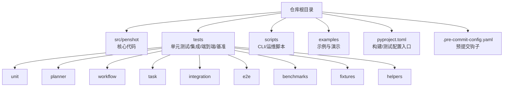
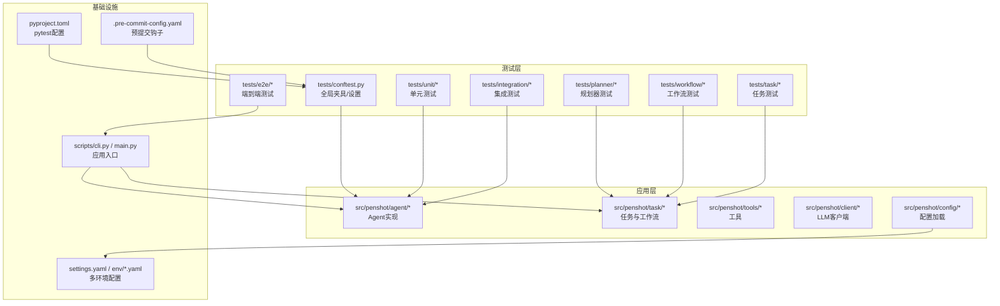
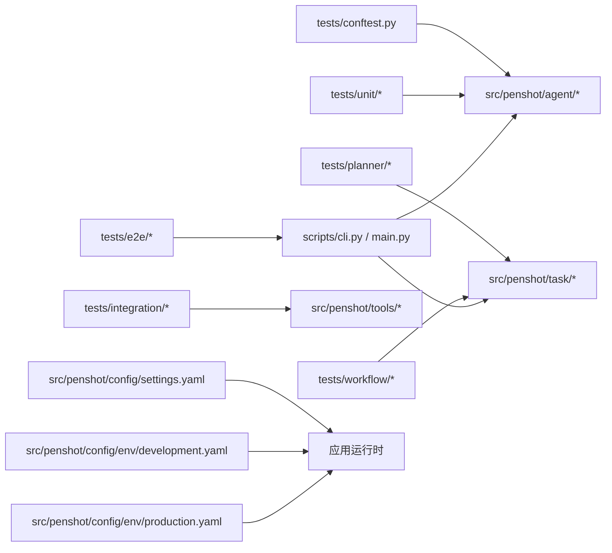

# 测试配置与管理

<cite>
**本文引用的文件**   
- [pyproject.toml](file://pyproject.toml)
- [.pre-commit-config.yaml](file://.pre-commit-config.yaml)
- [tests/conftest.py](file://tests/conftest.py)
- [tests/test_config.py](file://tests/test_config.py)
- [tests/unit/test_utils.py](file://tests/unit/test_utils.py)
- [tests/planner/test_temporal_planner.py](file://tests/planner/test_temporal_planner.py)
- [tests/workflow/test_workflow_orchestrator.py](file://tests/workflow/test_workflow_orchestrator.py)
- [src/penshot/config/settings.yaml](file://src/penshot/config/settings.yaml)
- [src/penshot/config/env/development.yaml](file://src/penshot/config/env/development.yaml)
- [src/penshot/config/env/production.yaml](file://src/penshot/config/env/production.yaml)
- [scripts/cli.py](file://scripts/cli.py)
- [main.py](file://main.py)
</cite>

## 目录
1. [简介](#简介)
2. [项目结构](#项目结构)
3. [核心组件](#核心组件)
4. [架构总览](#架构总览)
5. [详细组件分析](#详细组件分析)
6. [依赖分析](#依赖分析)
7. [性能考虑](#性能考虑)
8. [故障排查指南](#故障排查指南)
9. [结论](#结论)
10. [附录](#附录)

## 简介
本指南面向 Video Shot Agent 的测试配置与管理工作，覆盖 pytest 配置、测试环境管理、测试数据组织与版本控制策略、覆盖率配置、持续集成管道、预提交钩子、测试报告生成与分析、质量门禁、多环境测试策略、并行执行与缓存优化，以及测试维护最佳实践与团队协作规范。文档内容基于仓库现有结构与配置进行梳理，并提供可操作的落地建议。

## 项目结构
仓库采用“源码 + 示例 + 脚本 + 测试”的分层组织方式：
- src/penshot：核心业务模块（Agent、工作流、工具、客户端、配置等）
- tests：按功能域划分的测试集（unit、planner、workflow、task、integration、e2e、benchmarks、fixtures、helpers）
- scripts：CLI 与运维脚本
- examples：使用示例与演示
- pyproject.toml：项目元数据与构建/测试相关配置入口
- .pre-commit-config.yaml：预提交钩子配置

[本节为概念性说明，不直接分析具体文件，故无“章节来源”]

## 核心组件
- 测试入口与参数化：通过 pyproject.toml 集中声明 pytest 行为与插件；conftest.py 提供全局夹具与共享逻辑；各子目录下的 conftest 或测试文件负责局部夹具与用例组织。
- 配置与环境：settings.yaml 与 env/*.yaml 提供多环境配置；测试中可通过环境变量或配置文件切换运行模式。
- 预提交与质量门禁：.pre-commit-config.yaml 定义本地质量检查流程，配合 CI 形成一致的质量门槛。
- CLI 与主程序：scripts/cli.py 与 main.py 作为应用入口，便于在测试中驱动端到端场景。

**章节来源**
- [pyproject.toml](file://pyproject.toml)
- [tests/conftest.py](file://tests/conftest.py)
- [src/penshot/config/settings.yaml](file://src/penshot/config/settings.yaml)
- [src/penshot/config/env/development.yaml](file://src/penshot/config/env/development.yaml)
- [src/penshot/config/env/production.yaml](file://src/penshot/config/env/production.yaml)
- [.pre-commit-config.yaml](file://.pre-commit-config.yaml)
- [scripts/cli.py](file://scripts/cli.py)
- [main.py](file://main.py)

## 架构总览
下图展示测试体系与核心模块的交互关系：测试通过 fixtures 与 conftest 注入依赖，调用 src/penshot 中的 Agent、工作流、任务与工具；配置由 settings.yaml 与 env 文件提供；CLI/main 用于端到端验证。

**图表来源**
- [pyproject.toml](file://pyproject.toml)
- [.pre-commit-config.yaml](file://.pre-commit-config.yaml)
- [tests/conftest.py](file://tests/conftest.py)
- [src/penshot/config/settings.yaml](file://src/penshot/config/settings.yaml)
- [src/penshot/config/env/development.yaml](file://src/penshot/config/env/development.yaml)
- [src/penshot/config/env/production.yaml](file://src/penshot/config/env/production.yaml)
- [scripts/cli.py](file://scripts/cli.py)
- [main.py](file://main.py)

## 详细组件分析

### pytest 配置与运行
- 统一入口：将 pytest 参数、插件、标记、路径等集中在 pyproject.toml 中，避免分散的命令行参数。
- 常用能力：
  - 并行执行：启用 xdist 并通过 -n 指定进程数，结合缓存减少重复开销。
  - 过滤与标记：使用 -m 选择特定标签（如 unit、integration、e2e），提升定位效率。
  - 输出与报告：结合 --tb=short、--log-cli-level、--junitxml 等生成结构化结果。
  - 覆盖率：启用 coverage 并输出 html/xml 报告，便于归档与门禁。
- 推荐命令：
  - 全量运行：python -m pytest
  - 仅单元：python -m pytest -m unit
  - 并行：python -m pytest -n auto
  - 覆盖率：python -m pytest --cov=src/penshot --cov-report=html --cov-report=xml

**章节来源**
- [pyproject.toml](file://pyproject.toml)

### 测试环境与配置管理
- 多环境配置：
  - settings.yaml：通用配置项
  - env/development.yaml、env/production.yaml：按环境区分的关键参数（如 LLM 端点、超时、重试、日志级别）
- 测试期切换：
  - 通过环境变量或 conftest 夹具注入不同配置
  - 对需要外部服务的测试，使用 mock 或本地替代服务
- 建议：
  - 将敏感信息放入 secrets 管理或 CI 密钥库，不在仓库中硬编码
  - 为每个环境准备最小可用数据集与占位凭证

**章节来源**
- [src/penshot/config/settings.yaml](file://src/penshot/config/settings.yaml)
- [src/penshot/config/env/development.yaml](file://src/penshot/config/env/development.yaml)
- [src/penshot/config/env/production.yaml](file://src/penshot/config/env/production.yaml)
- [tests/conftest.py](file://tests/conftest.py)

### 测试数据组织与版本控制
- 组织原则：
  - fixtures：存放稳定、可复用的测试数据（小体积、确定性高）
  - helpers：封装数据构造、断言与清理逻辑
  - 大文件或外部资源：通过脚本下载或按需生成，并在 .gitignore 中排除
- 版本控制策略：
  - 文本型数据（JSON/YAML）纳入版本控制
  - 二进制或大型媒体文件使用外部存储或 LFS（若适用）
  - 数据变更需附带用例与回归说明

**章节来源**
- [tests/fixtures](file://tests/fixtures)
- [tests/helpers](file://tests/helpers)

### 覆盖率配置与报告
- 覆盖率范围：以 src/penshot 为主，排除第三方适配与样板代码
- 阈值与门禁：
  - 行覆盖率、分支覆盖率设定最低阈值
  - 在 CI 中阻断低于阈值的合并请求
- 报告形式：
  - HTML：用于本地浏览与审计
  - XML/JUnit：用于 CI 归档与趋势图

**章节来源**
- [pyproject.toml](file://pyproject.toml)

### 持续集成管道（CI）
- 阶段建议：
  - 安装依赖与缓存
  - 静态检查与格式化
  - 单元测试与覆盖率
  - 集成/端到端测试（可选，按需开启）
  - 产物与报告归档
- 关键要点：
  - 使用矩阵并行加速（Python 版本/平台）
  - 缓存 pip/venv 与 pytest cache
  - 失败快速反馈与重试策略

[本节为通用实践说明，未直接分析具体 CI 文件，故无“章节来源”]

### 预提交钩子（Pre-commit）
- 作用：在提交前自动执行格式校验、lint、单测冒烟等，保证代码基线质量
- 常见规则：
  - 代码格式化（如 black/isort/ruff）
  - 导入排序与去重
  - 轻量级静态检查
  - 可选：运行部分单测（如 unit）
- 建议：
  - 保持规则精简，避免拖慢开发体验
  - 在 CI 中复用相同规则，确保一致性

**章节来源**
- [.pre-commit-config.yaml](file://.pre-commit-config.yaml)

### 测试报告生成与分析
- 生成：
  - JUnit XML：便于 CI 可视化与历史对比
  - Coverage HTML/XML：用于覆盖率审计
  - 日志：结合 --log-cli-level 与 --log-file 输出调试信息
- 分析：
  - 关注失败用例的堆栈与断言位置
  - 结合覆盖率热点定位未覆盖分支
  - 对不稳定用例添加隔离与重试策略

**章节来源**
- [pyproject.toml](file://pyproject.toml)

### 多环境测试策略
- 环境划分：
  - 本地开发：最小依赖、mock 外部服务
  - 集成测试：连接真实或沙箱服务
  - 端到端：完整链路验证
- 策略：
  - 通过标记与条件跳过控制执行范围
  - 使用独立数据库/缓存实例避免污染
  - 对外部 API 使用契约测试或回放

**章节来源**
- [tests/conftest.py](file://tests/conftest.py)
- [src/penshot/config/env/development.yaml](file://src/penshot/config/env/development.yaml)
- [src/penshot/config/env/production.yaml](file://src/penshot/config/env/production.yaml)

### 并行测试执行与缓存优化
- 并行：
  - 使用 xdist 的 -n auto 自动分配进程
  - 避免共享状态与写冲突（如临时文件、全局变量）
- 缓存：
  - pytest-cache：缓存 fixture 结果与中间态
  - 依赖缓存：pip/venv 缓存
  - 模型/权重：按需拉取并缓存到持久卷

**章节来源**
- [pyproject.toml](file://pyproject.toml)

### 测试维护最佳实践与团队协作规范
- 命名与结构：
  - 文件名以 test_*.py 或 *_test.py
  - 函数名体现被测意图
- 断言与可读性：
  - 明确断言消息，包含上下文
  - 使用 helper 封装复杂断言
- 稳定性：
  - 避免网络抖动导致的随机失败
  - 对不稳定用例添加隔离与重试
- 协作：
  - 提交前运行预提交钩子
  - 变更需附带用例与回归说明
  - 定期清理过时用例与数据

**章节来源**
- [tests/unit/test_utils.py](file://tests/unit/test_utils.py)
- [tests/planner/test_temporal_planner.py](file://tests/planner/test_temporal_planner.py)
- [tests/workflow/test_workflow_orchestrator.py](file://tests/workflow/test_workflow_orchestrator.py)

## 依赖分析
测试与核心模块的依赖关系如下：测试通过 conftest 与 fixtures 注入依赖，调用 src/penshot 中的 agent、task、tools 等；配置由 settings.yaml 与 env 文件提供；CLI/main 用于端到端验证。

**图表来源**
- [tests/conftest.py](file://tests/conftest.py)
- [tests/unit/test_utils.py](file://tests/unit/test_utils.py)
- [tests/planner/test_temporal_planner.py](file://tests/planner/test_temporal_planner.py)
- [tests/workflow/test_workflow_orchestrator.py](file://tests/workflow/test_workflow_orchestrator.py)
- [src/penshot/config/settings.yaml](file://src/penshot/config/settings.yaml)
- [src/penshot/config/env/development.yaml](file://src/penshot/config/env/development.yaml)
- [src/penshot/config/env/production.yaml](file://src/penshot/config/env/production.yaml)
- [scripts/cli.py](file://scripts/cli.py)
- [main.py](file://main.py)

**章节来源**
- [tests/conftest.py](file://tests/conftest.py)
- [tests/unit/test_utils.py](file://tests/unit/test_utils.py)
- [tests/planner/test_temporal_planner.py](file://tests/planner/test_temporal_planner.py)
- [tests/workflow/test_workflow_orchestrator.py](file://tests/workflow/test_workflow_orchestrator.py)
- [src/penshot/config/settings.yaml](file://src/penshot/config/settings.yaml)
- [src/penshot/config/env/development.yaml](file://src/penshot/config/env/development.yaml)
- [src/penshot/config/env/production.yaml](file://src/penshot/config/env/production.yaml)
- [scripts/cli.py](file://scripts/cli.py)
- [main.py](file://main.py)

## 性能考虑
- 并行与缓存：合理使用 -n 与 pytest-cache，避免共享状态导致的不稳定
- 选择性执行：通过 -m 与 -k 精准执行受影响用例，缩短反馈时间
- 数据与 IO：尽量使用内存数据与轻量 fixture，减少磁盘与网络 I/O
- 外部依赖：对 LLM/向量检索等服务使用 mock 或本地替代，降低波动

[本节为通用指导，不直接分析具体文件，故无“章节来源”]

## 故障排查指南
- 常见问题：
  - 配置缺失或错误：检查 settings.yaml 与 env/*.yaml 是否齐全且正确
  - 外部服务不可用：确认网络、凭据与服务状态，必要时切换到 mock
  - 并发竞争：检查全局状态与临时文件路径，增加隔离
  - 覆盖率异常：确认 --cov 路径与排除规则
- 诊断步骤：
  - 缩小范围：仅运行单个文件或类，逐步定位
  - 查看日志：启用更详细的日志输出
  - 复现与隔离：将不稳定用例单独抽取并添加重试/隔离

**章节来源**
- [tests/test_config.py](file://tests/test_config.py)
- [src/penshot/config/settings.yaml](file://src/penshot/config/settings.yaml)
- [src/penshot/config/env/development.yaml](file://src/penshot/config/env/development.yaml)
- [src/penshot/config/env/production.yaml](file://src/penshot/config/env/production.yaml)

## 结论
通过统一的 pytest 配置、清晰的环境与数据管理、严格的预提交与 CI 门禁、完善的覆盖率与报告机制，以及并行与缓存优化，Video Shot Agent 的测试体系可实现高效、稳定与可维护的质量保障。建议在团队内推广上述规范，并结合项目演进持续优化。

[本节为总结性内容，不直接分析具体文件，故无“章节来源”]

## 附录
- 常用命令速查：
  - 运行全部测试：python -m pytest
  - 仅单元：python -m pytest -m unit
  - 并行执行：python -m pytest -n auto
  - 覆盖率：python -m pytest --cov=src/penshot --cov-report=html --cov-report=xml
  - 生成 JUnit 报告：python -m pytest --junitxml=report.xml
- 参考文件：
  - 测试入口与配置：[pyproject.toml](file://pyproject.toml)
  - 全局夹具与共享逻辑：[tests/conftest.py](file://tests/conftest.py)
  - 配置与环境：[src/penshot/config/settings.yaml](file://src/penshot/config/settings.yaml)、[src/penshot/config/env/development.yaml](file://src/penshot/config/env/development.yaml)、[src/penshot/config/env/production.yaml](file://src/penshot/config/env/production.yaml)
  - 预提交钩子：[.pre-commit-config.yaml](file://.pre-commit-config.yaml)
  - 应用入口：[scripts/cli.py](file://scripts/cli.py)、[main.py](file://main.py)