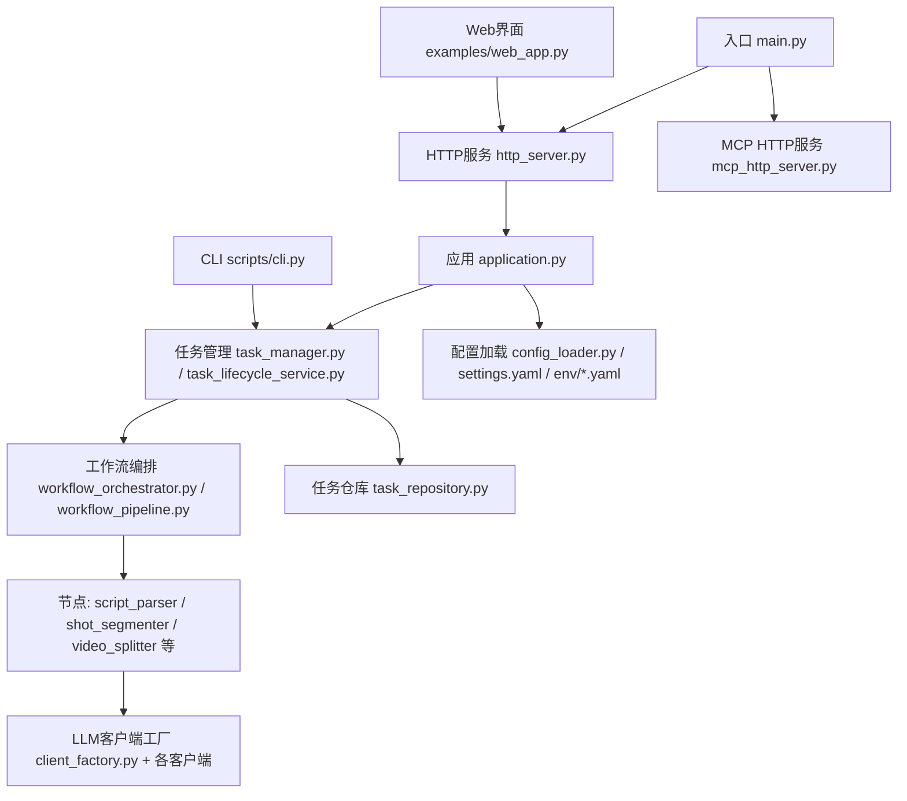
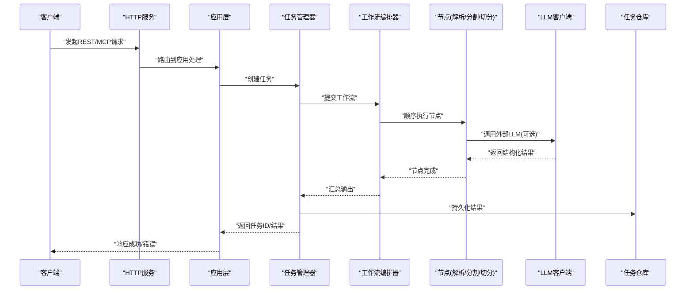
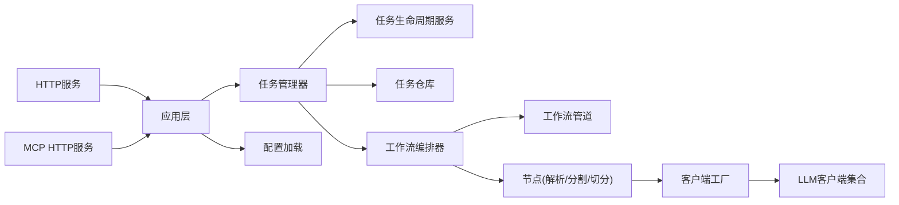

# 端到端测试

<cite>
**本文引用的文件**   
- [README.md](file://README.md)
- [docker-compose.yml](file://docker-compose.yml)
- [Dockerfile](file://Dockerfile)
- [main.py](file://main.py)
- [src/penshot/http_server.py](file://src/penshot/http_server.py)
- [src/penshot/mcp_http_server.py](file://src/penshot/mcp_http_server.py)
- [scripts/cli.py](file://scripts/cli.py)
- [examples/web_app.py](file://examples/web_app.py)
- [tests/conftest.py](file://tests/conftest.py)
- [tests/api/test_function_calls.py](file://tests/api/test_function_calls.py)
- [tests/api/test_mcp.py](file://tests/api/test_mcp.py)
- [tests/workflow/test_workflow_orchestrator.py](file://tests/workflow/test_workflow_orchestrator.py)
- [tests/task/test_task_lifecycle_service.py](file://tests/task/test_task_lifecycle_service.py)
- [tests/planner/test_temporal_planner.py](file://tests/planner/test_temporal_planner.py)
- [tests/unit/test_api_client.py](file://tests/unit/test_api_client.py)
- [examples/a2a_integration.py](file://examples/a2a_integration.py)
- [examples/neopen_demo.py](file://examples/neopen_demo.py)
- [examples/langgraph_integration.py](file://examples/langgraph_integration.py)
- [examples/mcp_client.py](file://examples/mcp_client.py)
- [examples/mcp_http_client.py](file://examples/mcp_http_client.py)
- [src/penshot/app/application.py](file://src/penshot/app/application.py)
- [src/penshot/config/config_loader.py](file://src/penshot/config/config_loader.py)
- [src/penshot/config/settings.yaml](file://src/penshot/config/settings.yaml)
- [src/penshot/config/env/development.yaml](file://src/penshot/config/env/development.yaml)
- [src/penshot/config/env/production.yaml](file://src/penshot/config/env/production.yaml)
- [src/penshot/task/task_manager.py](file://src/penshot/task/task_manager.py)
- [src/penshot/task/task_lifecycle_service.py](file://src/penshot/task/task_lifecycle_service.py)
- [src/penshot/task/task_repository.py](file://src/penshot/task/task_repository.py)
- [src/penshot/task/workflow_registry.py](file://src/penshot/task/workflow_registry.py)
- [src/penshot/agent/workflow/workflow_orchestrator.py](file://src/penshot/agent/workflow/workflow_orchestrator.py)
- [src/penshot/agent/workflow/workflow_pipeline.py](file://src/penshot/agent/workflow/workflow_pipeline.py)
- [src/penshot/agent/workflow/workflow_state_types.py](file://src/penshot/agent/workflow/workflow_state_types.py)
- [src/penshot/agent/workflow/workflow_output.py](file://src/penshot/agent/workflow/workflow_output.py)
- [src/penshot/agent/workflow/workflow_error_handler.py](file://src/penshot/agent/workflow/workflow_error_handler.py)
- [src/penshot/agent/workflow/workflow_memory.py](file://src/penshot/agent/workflow/workflow_memory.py)
- [src/penshot/agent/workflow/workflow_checkpointer.py](file://src/penshot/agent/workflow/workflow_checkpointer.py)
- [src/penshot/agent/workflow/workflow_nodes.py](file://src/penshot/agent/workflow/workflow_nodes.py)
- [src/penshot/agent/workflow/workflow_decision.py](file://src/penshot/agent/workflow/workflow_decision.py)
- [src/penshot/agent/script_parser_agent.py](file://src/penshot/agent/script_parser_agent.py)
- [src/penshot/agent/shot_segmenter_agent.py](file://src/penshot/agent/shot_segmenter_agent.py)
- [src/penshot/agent/video_splitter_agent.py](file://src/penshot/agent/video_splitter_agent.py)
- [src/penshot/agent/prompt_converter_agent.py](file://src/penshot/agent/prompt_converter_agent.py)
- [src/penshot/agent/quality_auditor_agent.py](file://src/penshot/agent/quality_auditor_agent.py)
- [src/penshot/client/client_factory.py](file://src/penshot/client/client_factory.py)
- [src/penshot/client/openai_client.py](file://src/penshot/client/openai_client.py)
- [src/penshot/client/deepseek_client.py](file://src/penshot/client/deepseek_client.py)
- [src/penshot/client/qwen_client.py](file://src/penshot/client/qwen_client.py)
- [src/penshot/client/huggingface_client.py](file://src/penshot/client/huggingface_client.py)
- [src/penshot/client/ollama_client.py](file://src/penshot/client/ollama_client.py)
- [src/penshot/knowledge/memory/long_term_memory.py](file://src/penshot/knowledge/memory/long_term_memory.py)
- [src/penshot/knowledge/memory/medium_term_memory.py](file://src/penshot/knowledge/memory/medium_term_memory.py)
- [src/penshot/knowledge/memory/short_term_memory.py](file://src/penshot/knowledge/memory/short_term_memory.py)
- [src/penshot/knowledge/memory/memory_manager.py](file://src/penshot/knowledge/memory/memory_manager.py)
- [src/penshot/tools/result_storage_tool.py](file://src/penshot/tools/result_storage_tool.py)
- [src/penshot/utils/file_utils.py](file://src/penshot/utils/file_utils.py)
- [src/penshot/utils/log_utils.py](file://src/penshot/utils/log_utils.py)
</cite>

## 目录
1. [简介](#简介)
2. [项目结构](#项目结构)
3. [核心组件](#核心组件)
4. [架构总览](#架构总览)
5. [详细组件分析](#详细组件分析)
6. [依赖分析](#依赖分析)
7. [性能考虑](#性能考虑)
8. [故障排查指南](#故障排查指南)
9. [结论](#结论)
10. [附录](#附录)

## 简介
本指南面向Video Shot Agent的端到端（E2E）测试，目标是覆盖从“脚本输入”到“分镜输出”的完整用户工作流。文档将说明：
- E2E测试环境搭建与外部服务集成策略（真实或模拟）
- 测试数据准备与管理方法
- REST API、CLI工具、Web界面的E2E示例
- 测试场景设计、结果验证方法与自动化流水线配置
- 性能测试、压力测试与回归测试最佳实践

## 项目结构
仓库采用分层组织：应用入口、HTTP/MCP服务、任务与工作流编排、Agent实现、客户端适配、知识/记忆、工具与配置等。测试目录包含单元、集成、工作流、规划器与API测试样例，便于扩展为完整的E2E套件。

图表来源
- [main.py](file://main.py)
- [src/penshot/http_server.py](file://src/penshot/http_server.py)
- [src/penshot/mcp_http_server.py](file://src/penshot/mcp_http_server.py)
- [src/penshot/app/application.py](file://src/penshot/app/application.py)
- [src/penshot/task/task_manager.py](file://src/penshot/task/task_manager.py)
- [src/penshot/task/task_lifecycle_service.py](file://src/penshot/task/task_lifecycle_service.py)
- [src/penshot/agent/workflow/workflow_orchestrator.py](file://src/penshot/agent/workflow/workflow_orchestrator.py)
- [src/penshot/agent/workflow/workflow_pipeline.py](file://src/penshot/agent/workflow/workflow_pipeline.py)
- [src/penshot/agent/script_parser_agent.py](file://src/penshot/agent/script_parser_agent.py)
- [src/penshot/agent/shot_segmenter_agent.py](file://src/penshot/agent/shot_segmenter_agent.py)
- [src/penshot/agent/video_splitter_agent.py](file://src/penshot/agent/video_splitter_agent.py)
- [src/penshot/client/client_factory.py](file://src/penshot/client/client_factory.py)
- [src/penshot/config/config_loader.py](file://src/penshot/config/config_loader.py)
- [src/penshot/config/settings.yaml](file://src/penshot/config/settings.yaml)
- [src/penshot/config/env/development.yaml](file://src/penshot/config/env/development.yaml)
- [src/penshot/config/env/production.yaml](file://src/penshot/config/env/production.yaml)
- [scripts/cli.py](file://scripts/cli.py)
- [examples/web_app.py](file://examples/web_app.py)

章节来源
- [README.md](file://README.md)
- [docker-compose.yml](file://docker-compose.yml)
- [Dockerfile](file://Dockerfile)
- [main.py](file://main.py)
- [src/penshot/http_server.py](file://src/penshot/http_server.py)
- [src/penshot/mcp_http_server.py](file://src/penshot/mcp_http_server.py)
- [scripts/cli.py](file://scripts/cli.py)
- [examples/web_app.py](file://examples/web_app.py)

## 核心组件
- 应用与服务
  - HTTP服务与MCP HTTP服务提供REST与MCP协议接口，承载E2E请求入口。
  - 应用层负责初始化配置、注册任务与工作流、启动服务。
- 任务与工作流
  - 任务管理器与生命周期服务协调任务创建、调度、状态流转与持久化。
  - 工作流编排器与管道驱动脚本解析、镜头分割、视频切分等节点执行。
- Agent与客户端
  - 脚本解析、镜头分割、视频切分、提示词转换、质量审计等Agent实现具体业务逻辑。
  - 客户端工厂统一接入OpenAI、DeepSeek、Qwen、HuggingFace、Ollama等LLM后端。
- 配置与环境
  - 通过配置文件与环境变量注入不同运行环境（开发/生产）。
- 工具与存储
  - 结果存储工具、日志与文件工具支撑E2E数据的读写与可观测性。

章节来源
- [src/penshot/app/application.py](file://src/penshot/app/application.py)
- [src/penshot/task/task_manager.py](file://src/penshot/task/task_manager.py)
- [src/penshot/task/task_lifecycle_service.py](file://src/penshot/task/task_lifecycle_service.py)
- [src/penshot/agent/workflow/workflow_orchestrator.py](file://src/penshot/agent/workflow/workflow_orchestrator.py)
- [src/penshot/agent/workflow/workflow_pipeline.py](file://src/penshot/agent/workflow/workflow_pipeline.py)
- [src/penshot/agent/script_parser_agent.py](file://src/penshot/agent/script_parser_agent.py)
- [src/penshot/agent/shot_segmenter_agent.py](file://src/penshot/agent/shot_segmenter_agent.py)
- [src/penshot/agent/video_splitter_agent.py](file://src/penshot/agent/video_splitter_agent.py)
- [src/penshot/client/client_factory.py](file://src/penshot/client/client_factory.py)
- [src/penshot/config/config_loader.py](file://src/penshot/config/config_loader.py)
- [src/penshot/config/settings.yaml](file://src/penshot/config/settings.yaml)
- [src/penshot/config/env/development.yaml](file://src/penshot/config/env/development.yaml)
- [src/penshot/config/env/production.yaml](file://src/penshot/config/env/production.yaml)
- [src/penshot/tools/result_storage_tool.py](file://src/penshot/tools/result_storage_tool.py)
- [src/penshot/utils/file_utils.py](file://src/penshot/utils/file_utils.py)
- [src/penshot/utils/log_utils.py](file://src/penshot/utils/log_utils.py)

## 架构总览
下图展示E2E端到端流程：从REST/MCP/CLI/Web入口进入，经应用层路由至任务与工作流编排，依次执行脚本解析、镜头分割、视频切分等节点，最终产出分镜结果并持久化。

图表来源
- [src/penshot/http_server.py](file://src/penshot/http_server.py)
- [src/penshot/mcp_http_server.py](file://src/penshot/mcp_http_server.py)
- [src/penshot/app/application.py](file://src/penshot/app/application.py)
- [src/penshot/task/task_manager.py](file://src/penshot/task/task_manager.py)
- [src/penshot/agent/workflow/workflow_orchestrator.py](file://src/penshot/agent/workflow/workflow_orchestrator.py)
- [src/penshot/agent/workflow/workflow_pipeline.py](file://src/penshot/agent/workflow/workflow_pipeline.py)
- [src/penshot/agent/script_parser_agent.py](file://src/penshot/agent/script_parser_agent.py)
- [src/penshot/agent/shot_segmenter_agent.py](file://src/penshot/agent/shot_segmenter_agent.py)
- [src/penshot/agent/video_splitter_agent.py](file://src/penshot/agent/video_splitter_agent.py)
- [src/penshot/client/client_factory.py](file://src/penshot/client/client_factory.py)
- [src/penshot/task/task_repository.py](file://src/penshot/task/task_repository.py)

## 详细组件分析

### E2E测试环境与外部服务集成
- 容器化与编排
  - 使用Docker镜像构建应用，docker-compose编排数据库、缓存、对象存储等依赖（如有），并提供一键启动能力。
- 配置与环境
  - 通过settings.yaml与环境特定配置（development.yaml/production.yaml）切换行为；在测试环境中建议启用轻量或本地LLM（如Ollama）以稳定E2E。
- 外部服务模拟
  - 对LLM调用可通过客户端工厂替换为Mock或本地模型；对存储与检索可使用内存或轻量实现，确保E2E可重复。
- 关键路径参考
  - 应用初始化与配置加载、服务启动、任务与工作流注册。

章节来源
- [docker-compose.yml](file://docker-compose.yml)
- [Dockerfile](file://Dockerfile)
- [src/penshot/config/config_loader.py](file://src/penshot/config/config_loader.py)
- [src/penshot/config/settings.yaml](file://src/penshot/config/settings.yaml)
- [src/penshot/config/env/development.yaml](file://src/penshot/config/env/development.yaml)
- [src/penshot/config/env/production.yaml](file://src/penshot/config/env/production.yaml)
- [src/penshot/app/application.py](file://src/penshot/app/application.py)
- [src/penshot/client/client_factory.py](file://src/penshot/client/client_factory.py)
- [src/penshot/client/ollama_client.py](file://src/penshot/client/ollama_client.py)

### 测试数据准备与管理
- 数据来源
  - 示例JSON与脚本文本位于examples/json_demo与examples/script_txt，可作为标准输入集。
- 数据规范
  - 输入应包含脚本文本、风格/语言偏好、时长约束等；输出需包含分镜条目、时间轴、动作/对话标注等。
- 数据版本与清理
  - 建议在测试夹具中集中管理，支持按用例隔离与自动清理，避免污染共享环境。
- 关键路径参考
  - 文件工具用于读写；结果存储工具用于落盘；日志工具用于可观测性。

章节来源
- [src/penshot/utils/file_utils.py](file://src/penshot/utils/file_utils.py)
- [src/penshot/tools/result_storage_tool.py](file://src/penshot/tools/result_storage_tool.py)
- [src/penshot/utils/log_utils.py](file://src/penshot/utils/log_utils.py)

### REST API E2E示例
- 目标
  - 验证从脚本输入到分镜输出的完整链路，包括任务创建、工作流执行、结果持久化与查询。
- 步骤
  - 启动服务后，调用REST接口提交脚本；轮询任务状态直至完成；校验输出结构与字段完整性。
- 失败分支
  - 验证非法输入、超时、外部服务不可用时的错误码与重试/回退策略。
- 参考实现
  - 现有API测试样例可作为基线扩展。

章节来源
- [tests/api/test_function_calls.py](file://tests/api/test_function_calls.py)
- [src/penshot/http_server.py](file://src/penshot/http_server.py)
- [src/penshot/task/task_manager.py](file://src/penshot/task/task_manager.py)
- [src/penshot/agent/workflow/workflow_orchestrator.py](file://src/penshot/agent/workflow/workflow_orchestrator.py)

### MCP协议E2E示例
- 目标
  - 验证MCP客户端与服务端的交互，包括会话建立、消息收发、工具调用与结果返回。
- 步骤
  - 使用MCP客户端发起请求，检查服务端是否正确路由到任务与工作流，并返回一致的分镜结果。
- 参考实现
  - 现有MCP测试样例与示例客户端。

章节来源
- [tests/api/test_mcp.py](file://tests/api/test_mcp.py)
- [src/penshot/mcp_http_server.py](file://src/penshot/mcp_http_server.py)
- [examples/mcp_client.py](file://examples/mcp_client.py)
- [examples/mcp_http_client.py](file://examples/mcp_http_client.py)

### CLI工具E2E示例
- 目标
  - 验证命令行入口的端到端能力，包括参数解析、任务提交、进度查看与结果导出。
- 步骤
  - 使用CLI命令传入脚本文件与配置，等待任务完成，检查输出文件是否符合预期。
- 参考实现
  - CLI脚本与示例命令。

章节来源
- [scripts/cli.py](file://scripts/cli.py)
- [src/penshot/task/task_manager.py](file://src/penshot/task/task_manager.py)
- [src/penshot/agent/workflow/workflow_orchestrator.py](file://src/penshot/agent/workflow/workflow_orchestrator.py)

### Web界面E2E示例
- 目标
  - 验证Web前端与后端服务的协作，包括上传脚本、触发任务、展示进度与下载结果。
- 步骤
  - 通过Web界面提交脚本，观察任务状态更新，确认最终分镜结果正确生成并可下载。
- 参考实现
  - Web应用示例。

章节来源
- [examples/web_app.py](file://examples/web_app.py)
- [src/penshot/http_server.py](file://src/penshot/http_server.py)
- [src/penshot/task/task_manager.py](file://src/penshot/task/task_manager.py)

### 工作流与节点E2E示例
- 目标
  - 验证工作流编排器与管道的执行顺序、状态机流转、错误处理与恢复机制。
- 步骤
  - 构造典型脚本，触发工作流，断言每个节点的输入输出契约与整体一致性。
- 参考实现
  - 工作流编排器测试与相关节点实现。

章节来源
- [tests/workflow/test_workflow_orchestrator.py](file://tests/workflow/test_workflow_orchestrator.py)
- [src/penshot/agent/workflow/workflow_orchestrator.py](file://src/penshot/agent/workflow/workflow_orchestrator.py)
- [src/penshot/agent/workflow/workflow_pipeline.py](file://src/penshot/agent/workflow/workflow_pipeline.py)
- [src/penshot/agent/workflow/workflow_state_types.py](file://src/penshot/agent/workflow/workflow_state_types.py)
- [src/penshot/agent/workflow/workflow_output.py](file://src/penshot/agent/workflow/workflow_output.py)
- [src/penshot/agent/workflow/workflow_error_handler.py](file://src/penshot/agent/workflow/workflow_error_handler.py)
- [src/penshot/agent/workflow/workflow_memory.py](file://src/penshot/agent/workflow/workflow_memory.py)
- [src/penshot/agent/workflow/workflow_checkpointer.py](file://src/penshot/agent/workflow/workflow_checkpointer.py)
- [src/penshot/agent/workflow/workflow_nodes.py](file://src/penshot/agent/workflow/workflow_nodes.py)
- [src/penshot/agent/workflow/workflow_decision.py](file://src/penshot/agent/workflow/workflow_decision.py)

### 任务生命周期E2E示例
- 目标
  - 验证任务创建、调度、执行、完成与清理的全生命周期。
- 步骤
  - 创建任务，监控状态变更，断言最终状态与持久化结果的一致性。
- 参考实现
  - 任务生命周期服务测试。

章节来源
- [tests/task/test_task_lifecycle_service.py](file://tests/task/test_task_lifecycle_service.py)
- [src/penshot/task/task_lifecycle_service.py](file://src/penshot/task/task_lifecycle_service.py)
- [src/penshot/task/task_repository.py](file://src/penshot/task/task_repository.py)

### 规划器与估算E2E示例
- 目标
  - 验证时间规划与时长估算在E2E中的表现，确保分镜时间轴合理。
- 步骤
  - 使用典型脚本触发规划器，断言输出时间戳与动作/对话时长的合理性。
- 参考实现
  - 规划器测试样例。

章节来源
- [tests/planner/test_temporal_planner.py](file://tests/planner/test_temporal_planner.py)

### 客户端与外部服务集成E2E示例
- 目标
  - 验证多LLM客户端在E2E中的可用性，包括真实服务与本地模拟。
- 步骤
  - 切换不同客户端配置，执行相同脚本，比较输出一致性与性能差异。
- 参考实现
  - 客户端工厂与各客户端实现。

章节来源
- [src/penshot/client/client_factory.py](file://src/penshot/client/client_factory.py)
- [src/penshot/client/openai_client.py](file://src/penshot/client/openai_client.py)
- [src/penshot/client/deepseek_client.py](file://src/penshot/client/deepseek_client.py)
- [src/penshot/client/qwen_client.py](file://src/penshot/client/qwen_client.py)
- [src/penshot/client/huggingface_client.py](file://src/penshot/client/huggingface_client.py)
- [src/penshot/client/ollama_client.py](file://src/penshot/client/ollama_client.py)

### 记忆与知识E2E示例
- 目标
  - 验证长/中/短期记忆与知识管理在E2E中的作用，确保上下文连贯与结果稳定。
- 步骤
  - 多次执行相似脚本，断言记忆对后续处理的正向影响。
- 参考实现
  - 记忆管理与模板知识模块。

章节来源
- [src/penshot/knowledge/memory/long_term_memory.py](file://src/penshot/knowledge/memory/long_term_memory.py)
- [src/penshot/knowledge/memory/medium_term_memory.py](file://src/penshot/knowledge/memory/medium_term_memory.py)
- [src/penshot/knowledge/memory/short_term_memory.py](file://src/penshot/knowledge/memory/short_term_memory.py)
- [src/penshot/knowledge/memory/memory_manager.py](file://src/penshot/knowledge/memory/memory_manager.py)

### 集成示例与第三方生态
- 目标
  - 验证与A2A、NeOpen、LangGraph等生态的集成能力。
- 步骤
  - 使用示例脚本进行端到端调用，检查集成点是否正常工作。
- 参考实现
  - 集成示例脚本。

章节来源
- [examples/a2a_integration.py](file://examples/a2a_integration.py)
- [examples/neopen_demo.py](file://examples/neopen_demo.py)
- [examples/langgraph_integration.py](file://examples/langgraph_integration.py)

## 依赖分析
E2E链路的关键依赖关系如下：

图表来源
- [src/penshot/http_server.py](file://src/penshot/http_server.py)
- [src/penshot/mcp_http_server.py](file://src/penshot/mcp_http_server.py)
- [src/penshot/app/application.py](file://src/penshot/app/application.py)
- [src/penshot/task/task_manager.py](file://src/penshot/task/task_manager.py)
- [src/penshot/task/task_lifecycle_service.py](file://src/penshot/task/task_lifecycle_service.py)
- [src/penshot/task/task_repository.py](file://src/penshot/task/task_repository.py)
- [src/penshot/agent/workflow/workflow_orchestrator.py](file://src/penshot/agent/workflow/workflow_orchestrator.py)
- [src/penshot/agent/workflow/workflow_pipeline.py](file://src/penshot/agent/workflow/workflow_pipeline.py)
- [src/penshot/agent/script_parser_agent.py](file://src/penshot/agent/script_parser_agent.py)
- [src/penshot/agent/shot_segmenter_agent.py](file://src/penshot/agent/shot_segmenter_agent.py)
- [src/penshot/agent/video_splitter_agent.py](file://src/penshot/agent/video_splitter_agent.py)
- [src/penshot/client/client_factory.py](file://src/penshot/client/client_factory.py)
- [src/penshot/config/config_loader.py](file://src/penshot/config/config_loader.py)

章节来源
- [src/penshot/http_server.py](file://src/penshot/http_server.py)
- [src/penshot/mcp_http_server.py](file://src/penshot/mcp_http_server.py)
- [src/penshot/app/application.py](file://src/penshot/app/application.py)
- [src/penshot/task/task_manager.py](file://src/penshot/task/task_manager.py)
- [src/penshot/task/task_lifecycle_service.py](file://src/penshot/task/task_lifecycle_service.py)
- [src/penshot/task/task_repository.py](file://src/penshot/task/task_repository.py)
- [src/penshot/agent/workflow/workflow_orchestrator.py](file://src/penshot/agent/workflow/workflow_orchestrator.py)
- [src/penshot/agent/workflow/workflow_pipeline.py](file://src/penshot/agent/workflow/workflow_pipeline.py)
- [src/penshot/client/client_factory.py](file://src/penshot/client/client_factory.py)
- [src/penshot/config/config_loader.py](file://src/penshot/config/config_loader.py)

## 性能考虑
- 并发与吞吐
  - 通过任务队列与并行工作流实例提升吞吐；注意外部LLM限流与重试退避。
- 资源与缓存
  - 启用结果缓存与中间态检查点，减少重复计算；合理设置内存与磁盘配额。
- 压测与基准
  - 使用批量脚本与不同长度分布进行压测，记录P95/P99延迟与错误率。
- 回归与稳定性
  - 引入固定种子与确定性配置，保证回归测试的可重复性。

[本节为通用指导，无需代码引用]

## 故障排查指南
- 常见问题定位
  - 服务启动失败：检查配置与环境变量、端口占用、依赖服务可达性。
  - 任务卡住：检查工作流状态机与错误处理器，确认节点是否抛出异常或未返回。
  - LLM调用失败：检查客户端配置、密钥、网络连通与速率限制。
- 可观测性
  - 利用日志工具与结果存储工具收集诊断信息；必要时开启调试模式。
- 参考实现
  - 日志与文件工具、错误处理器、工作流状态类型与输出模型。

章节来源
- [src/penshot/utils/log_utils.py](file://src/penshot/utils/log_utils.py)
- [src/penshot/utils/file_utils.py](file://src/penshot/utils/file_utils.py)
- [src/penshot/agent/workflow/workflow_error_handler.py](file://src/penshot/agent/workflow/workflow_error_handler.py)
- [src/penshot/agent/workflow/workflow_state_types.py](file://src/penshot/agent/workflow/workflow_state_types.py)
- [src/penshot/agent/workflow/workflow_output.py](file://src/penshot/agent/workflow/workflow_output.py)

## 结论
通过上述E2E测试指南，您可以从REST/MCP/CLI/Web多个入口验证Video Shot Agent的完整工作流，覆盖脚本解析、镜头分割、视频切分与结果持久化。结合容器化与配置管理，可在开发与生产环境保持一致的测试体验。配合性能与回归测试策略，持续提升系统稳定性与交付质量。

[本节为总结，无需代码引用]

## 附录

### 端到端测试清单
- 环境准备
  - 启动容器与依赖服务，加载测试配置，准备测试数据。
- 功能验证
  - REST/MCP/CLI/Web四种入口的脚本输入与分镜输出验证。
- 错误与边界
  - 非法输入、超时、外部服务不可用、重试与回退。
- 性能与回归
  - 压测指标采集、回归用例执行与报告生成。

[本节为清单，无需代码引用]

### 自动化流水线配置建议
- 触发条件
  - 代码推送、合并请求、定时任务。
- 阶段划分
  - 构建与镜像打包、依赖安装、单元测试、集成测试、E2E测试、性能测试、报告归档。
- 环境隔离
  - 为E2E与性能测试提供独立命名空间与数据卷。
- 失败处理
  - 失败重试、告警通知、失败快照与日志留存。

[本节为流水线建议，无需代码引用]