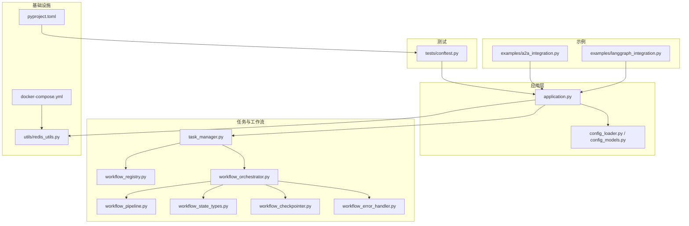
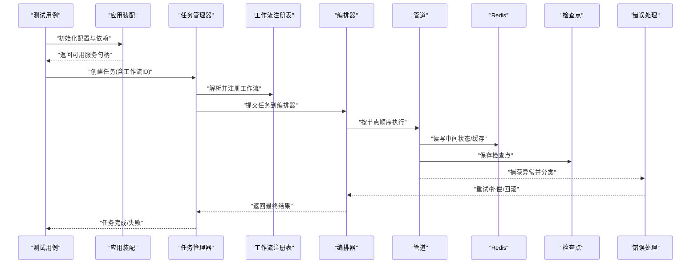
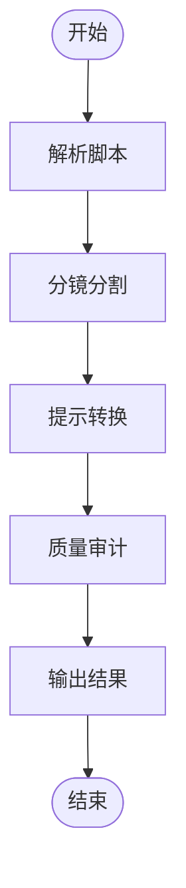
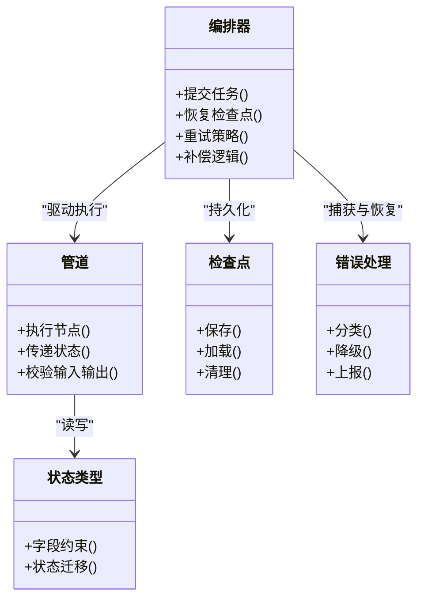
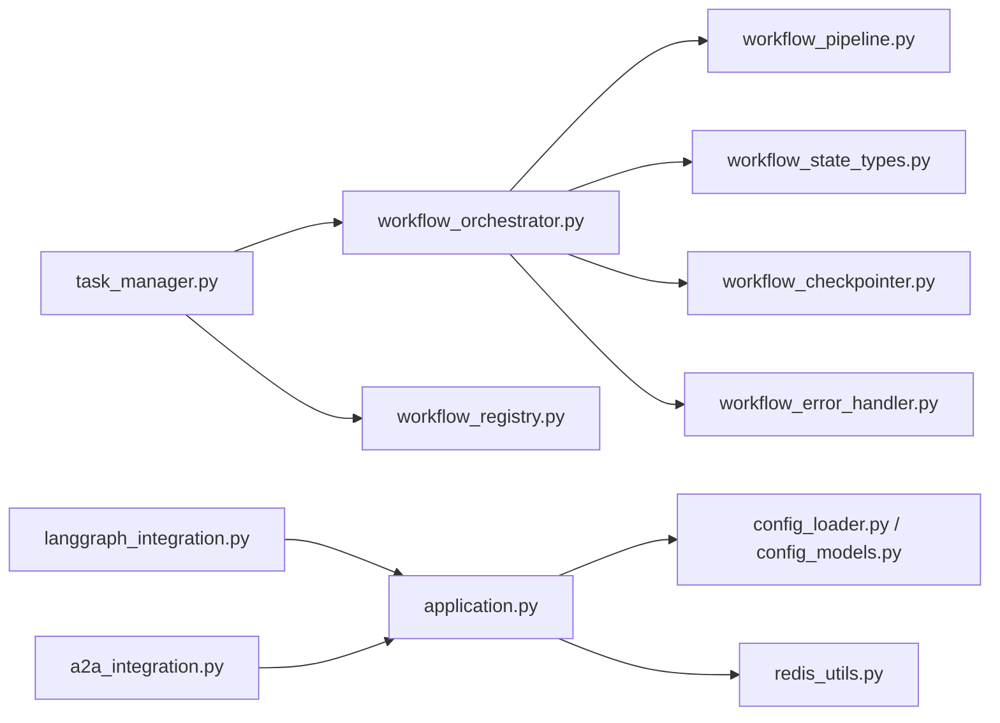

# 集成测试

<cite>
**本文引用的文件**   
- [tests/conftest.py](file://tests/conftest.py)
- [src/penshot/app/application.py](file://src/penshot/app/application.py)
- [src/penshot/task/task_manager.py](file://src/penshot/task/task_manager.py)
- [src/penshot/task/workflow_registry.py](file://src/penshot/task/workflow_registry.py)
- [src/penshot/agent/workflow/workflow_orchestrator.py](file://src/penshot/agent/workflow/workflow_orchestrator.py)
- [src/penshot/agent/workflow/workflow_pipeline.py](file://src/penshot/agent/workflow/workflow_pipeline.py)
- [src/penshot/agent/workflow/workflow_state_types.py](file://src/penshot/agent/workflow/workflow_state_types.py)
- [src/penshot/agent/workflow/workflow_checkpointer.py](file://src/penshot/agent/workflow/workflow_checkpointer.py)
- [src/penshot/agent/workflow/workflow_error_handler.py](file://src/penshot/agent/workflow/workflow_error_handler.py)
- [src/penshot/utils/redis_utils.py](file://src/penshot/utils/redis_utils.py)
- [src/penshot/config/config_loader.py](file://src/penshot/config/config_loader.py)
- [src/penshot/config/config_models.py](file://src/penshot/config/config_models.py)
- [examples/langgraph_integration.py](file://examples/langgraph_integration.py)
- [examples/a2a_integration.py](file://examples/a2a_integration.py)
- [docker-compose.yml](file://docker-compose.yml)
- [pyproject.toml](file://pyproject.toml)
</cite>

## 目录
1. [简介](#简介)
2. [项目结构](#项目结构)
3. [核心组件](#核心组件)
4. [架构总览](#架构总览)
5. [详细组件分析](#详细组件分析)
6. [依赖分析](#依赖分析)
7. [性能考虑](#性能考虑)
8. [故障排查指南](#故障排查指南)
9. [结论](#结论)
10. [附录](#附录)

## 简介
本指南面向Video Shot Agent的集成测试，聚焦多组件交互验证：Agent协作、工作流编排与执行、任务管理、数据库与缓存操作。内容涵盖测试环境搭建、外部依赖Mock（Redis、数据库等）、测试数据管理、端到端流程示例（分镜生成、任务管理、工作流编排）、异步与错误处理测试方法、并发与隔离策略，以及性能基准测试实践。

## 项目结构
仓库采用分层组织：应用入口、配置加载、任务与工作流、Agent实现、工具与客户端、示例脚本与测试集。测试目录包含单元、集成、E2E、基准与辅助夹具。

图表来源
- [src/penshot/app/application.py](file://src/penshot/app/application.py)
- [src/penshot/config/config_loader.py](file://src/penshot/config/config_loader.py)
- [src/penshot/config/config_models.py](file://src/penshot/config/config_models.py)
- [src/penshot/task/task_manager.py](file://src/penshot/task/task_manager.py)
- [src/penshot/task/workflow_registry.py](file://src/penshot/task/workflow_registry.py)
- [src/penshot/agent/workflow/workflow_orchestrator.py](file://src/penshot/agent/workflow/workflow_orchestrator.py)
- [src/penshot/agent/workflow/workflow_pipeline.py](file://src/penshot/agent/workflow/workflow_pipeline.py)
- [src/penshot/agent/workflow/workflow_state_types.py](file://src/penshot/agent/workflow/workflow_state_types.py)
- [src/penshot/agent/workflow/workflow_checkpointer.py](file://src/penshot/agent/workflow/workflow_checkpointer.py)
- [src/penshot/agent/workflow/workflow_error_handler.py](file://src/penshot/agent/workflow/workflow_error_handler.py)
- [src/penshot/utils/redis_utils.py](file://src/penshot/utils/redis_utils.py)
- [docker-compose.yml](file://docker-compose.yml)
- [pyproject.toml](file://pyproject.toml)
- [examples/langgraph_integration.py](file://examples/langgraph_integration.py)
- [examples/a2a_integration.py](file://examples/a2a_integration.py)
- [tests/conftest.py](file://tests/conftest.py)

章节来源
- [tests/conftest.py](file://tests/conftest.py)
- [src/penshot/app/application.py](file://src/penshot/app/application.py)
- [src/penshot/config/config_loader.py](file://src/penshot/config/config_loader.py)
- [src/penshot/config/config_models.py](file://src/penshot/config/config_models.py)
- [src/penshot/task/task_manager.py](file://src/penshot/task/task_manager.py)
- [src/penshot/task/workflow_registry.py](file://src/penshot/task/workflow_registry.py)
- [src/penshot/agent/workflow/workflow_orchestrator.py](file://src/penshot/agent/workflow/workflow_orchestrator.py)
- [src/penshot/agent/workflow/workflow_pipeline.py](file://src/penshot/agent/workflow/workflow_pipeline.py)
- [src/penshot/agent/workflow/workflow_state_types.py](file://src/penshot/agent/workflow/workflow_state_types.py)
- [src/penshot/agent/workflow/workflow_checkpointer.py](file://src/penshot/agent/workflow/workflow_checkpointer.py)
- [src/penshot/agent/workflow/workflow_error_handler.py](file://src/penshot/agent/workflow/workflow_error_handler.py)
- [src/penshot/utils/redis_utils.py](file://src/penshot/utils/redis_utils.py)
- [docker-compose.yml](file://docker-compose.yml)
- [pyproject.toml](file://pyproject.toml)
- [examples/langgraph_integration.py](file://examples/langgraph_integration.py)
- [examples/a2a_integration.py](file://examples/a2a_integration.py)

## 核心组件
- 应用装配与生命周期：负责初始化配置、注册工作流、启动服务与资源清理。
- 任务管理器：统一创建、调度、查询与状态流转的任务抽象。
- 工作流编排器：组合节点、维护状态、持久化检查点、错误恢复与重试。
- 工作流管道：定义节点顺序、输入输出契约与中间态传递。
- 状态类型：定义工作流状态机与字段约束。
- 检查点与错误处理：提供断点续跑与异常分类、降级与补偿。
- Redis工具：封装连接、键空间隔离与序列化策略。
- 配置加载与模型：集中读取环境变量与配置文件，提供强类型配置对象。
- 示例集成：LangGraph与A2A集成示例，用于演示外部编排与Agent通信。

章节来源
- [src/penshot/app/application.py](file://src/penshot/app/application.py)
- [src/penshot/task/task_manager.py](file://src/penshot/task/task_manager.py)
- [src/penshot/task/workflow_registry.py](file://src/penshot/task/workflow_registry.py)
- [src/penshot/agent/workflow/workflow_orchestrator.py](file://src/penshot/agent/workflow/workflow_orchestrator.py)
- [src/penshot/agent/workflow/workflow_pipeline.py](file://src/penshot/agent/workflow/workflow_pipeline.py)
- [src/penshot/agent/workflow/workflow_state_types.py](file://src/penshot/agent/workflow/workflow_state_types.py)
- [src/penshot/agent/workflow/workflow_checkpointer.py](file://src/penshot/agent/workflow/workflow_checkpointer.py)
- [src/penshot/agent/workflow/workflow_error_handler.py](file://src/penshot/agent/workflow/workflow_error_handler.py)
- [src/penshot/utils/redis_utils.py](file://src/penshot/utils/redis_utils.py)
- [src/penshot/config/config_loader.py](file://src/penshot/config/config_loader.py)
- [src/penshot/config/config_models.py](file://src/penshot/config/config_models.py)
- [examples/langgraph_integration.py](file://examples/langgraph_integration.py)
- [examples/a2a_integration.py](file://examples/a2a_integration.py)

## 架构总览
下图展示集成测试中关键路径：测试通过应用装配注入配置与依赖，调用任务与工作流编排器，经由管道执行节点，使用Redis进行状态与结果缓存，并通过检查点与错误处理器保障可恢复性。

图表来源
- [src/penshot/app/application.py](file://src/penshot/app/application.py)
- [src/penshot/task/task_manager.py](file://src/penshot/task/task_manager.py)
- [src/penshot/task/workflow_registry.py](file://src/penshot/task/workflow_registry.py)
- [src/penshot/agent/workflow/workflow_orchestrator.py](file://src/penshot/agent/workflow/workflow_orchestrator.py)
- [src/penshot/agent/workflow/workflow_pipeline.py](file://src/penshot/agent/workflow/workflow_pipeline.py)
- [src/penshot/agent/workflow/workflow_checkpointer.py](file://src/penshot/agent/workflow/workflow_checkpointer.py)
- [src/penshot/agent/workflow/workflow_error_handler.py](file://src/penshot/agent/workflow/workflow_error_handler.py)
- [src/penshot/utils/redis_utils.py](file://src/penshot/utils/redis_utils.py)

## 详细组件分析

### 测试环境与依赖Mock
- 容器化依赖：使用docker-compose拉起Redis等基础服务，确保测试在稳定环境中运行。
- 配置注入：通过配置加载器与模型，为测试提供独立命名空间与键前缀，避免污染宿主环境。
- Redis Mock：基于Redis工具封装，可在测试中切换至内存后端或设置短过期时间；必要时替换为轻量Mock以加速。
- 数据库Mock：若工作流或任务持久化涉及数据库，建议通过配置切换到SQLite内存库或使用事务回滚策略。

章节来源
- [docker-compose.yml](file://docker-compose.yml)
- [src/penshot/config/config_loader.py](file://src/penshot/config/config_loader.py)
- [src/penshot/config/config_models.py](file://src/penshot/config/config_models.py)
- [src/penshot/utils/redis_utils.py](file://src/penshot/utils/redis_utils.py)

### 测试数据管理
- 固定种子数据：准备最小化的剧本、提示模板与参数集，保证可重复性。
- 动态生成：对长文本或随机性较强的输入，使用确定性随机种子生成，便于复现。
- 数据隔离：每个测试用例使用独立键空间或命名空间，避免交叉影响。
- 清理策略：测试前后自动清理临时文件、缓存与检查点，保持环境干净。

章节来源
- [src/penshot/utils/redis_utils.py](file://src/penshot/utils/redis_utils.py)
- [src/penshot/agent/workflow/workflow_checkpointer.py](file://src/penshot/agent/workflow/workflow_checkpointer.py)

### 分镜生成流程测试
目标：验证从脚本解析、分镜分割、提示转换、质量审计到输出的完整链路。

图表来源
- [src/penshot/agent/workflow/workflow_pipeline.py](file://src/penshot/agent/workflow/workflow_pipeline.py)
- [src/penshot/agent/workflow/workflow_state_types.py](file://src/penshot/agent/workflow/workflow_state_types.py)

章节来源
- [src/penshot/agent/workflow/workflow_pipeline.py](file://src/penshot/agent/workflow/workflow_pipeline.py)
- [src/penshot/agent/workflow/workflow_state_types.py](file://src/penshot/agent/workflow/workflow_state_types.py)

### 任务管理测试
要点：
- 任务创建与查询：验证任务生命周期与状态一致性。
- 工作流绑定：确认任务正确关联工作流定义与参数。
- 并发安全：多线程/协程下任务状态更新无竞态。
- 幂等性：重复提交同一任务不会产生副作用。

章节来源
- [src/penshot/task/task_manager.py](file://src/penshot/task/task_manager.py)
- [src/penshot/task/workflow_registry.py](file://src/penshot/task/workflow_registry.py)

### 工作流编排测试
要点：
- 节点顺序与分支：验证管道节点执行顺序与条件分支。
- 状态持久化：检查点在异常后仍可恢复。
- 错误分类与重试：区分可重试与不可重试错误，执行补偿逻辑。
- 超时与限流：节点级超时控制与外部依赖限流保护。

图表来源
- [src/penshot/agent/workflow/workflow_orchestrator.py](file://src/penshot/agent/workflow/workflow_orchestrator.py)
- [src/penshot/agent/workflow/workflow_pipeline.py](file://src/penshot/agent/workflow/workflow_pipeline.py)
- [src/penshot/agent/workflow/workflow_state_types.py](file://src/penshot/agent/workflow/workflow_state_types.py)
- [src/penshot/agent/workflow/workflow_checkpointer.py](file://src/penshot/agent/workflow/workflow_checkpointer.py)
- [src/penshot/agent/workflow/workflow_error_handler.py](file://src/penshot/agent/workflow/workflow_error_handler.py)

章节来源
- [src/penshot/agent/workflow/workflow_orchestrator.py](file://src/penshot/agent/workflow/workflow_orchestrator.py)
- [src/penshot/agent/workflow/workflow_pipeline.py](file://src/penshot/agent/workflow/workflow_pipeline.py)
- [src/penshot/agent/workflow/workflow_state_types.py](file://src/penshot/agent/workflow/workflow_state_types.py)
- [src/penshot/agent/workflow/workflow_checkpointer.py](file://src/penshot/agent/workflow/workflow_checkpointer.py)
- [src/penshot/agent/workflow/workflow_error_handler.py](file://src/penshot/agent/workflow/workflow_error_handler.py)

### 外部编排与Agent协作测试
- LangGraph集成：验证外部图编排与内部工作流的对接，包括消息路由与状态同步。
- A2A集成：验证Agent间通信协议、消息格式与容错机制。

章节来源
- [examples/langgraph_integration.py](file://examples/langgraph_integration.py)
- [examples/a2a_integration.py](file://examples/a2a_integration.py)

## 依赖分析
- 直接依赖：应用装配依赖配置加载与Redis工具；任务管理器依赖工作流注册表；编排器依赖管道、状态类型、检查点与错误处理。
- 间接依赖：示例集成依赖应用装配暴露的服务接口。
- 潜在循环：应避免在配置加载与工作流注册之间形成循环导入；通过延迟导入或接口解耦解决。
- 外部依赖：Redis作为共享状态与缓存；数据库（如使用）需具备事务与回滚能力。

图表来源
- [src/penshot/app/application.py](file://src/penshot/app/application.py)
- [src/penshot/config/config_loader.py](file://src/penshot/config/config_loader.py)
- [src/penshot/config/config_models.py](file://src/penshot/config/config_models.py)
- [src/penshot/utils/redis_utils.py](file://src/penshot/utils/redis_utils.py)
- [src/penshot/task/task_manager.py](file://src/penshot/task/task_manager.py)
- [src/penshot/task/workflow_registry.py](file://src/penshot/task/workflow_registry.py)
- [src/penshot/agent/workflow/workflow_orchestrator.py](file://src/penshot/agent/workflow/workflow_orchestrator.py)
- [src/penshot/agent/workflow/workflow_pipeline.py](file://src/penshot/agent/workflow/workflow_pipeline.py)
- [src/penshot/agent/workflow/workflow_state_types.py](file://src/penshot/agent/workflow/workflow_state_types.py)
- [src/penshot/agent/workflow/workflow_checkpointer.py](file://src/penshot/agent/workflow/workflow_checkpointer.py)
- [src/penshot/agent/workflow/workflow_error_handler.py](file://src/penshot/agent/workflow/workflow_error_handler.py)
- [examples/langgraph_integration.py](file://examples/langgraph_integration.py)
- [examples/a2a_integration.py](file://examples/a2a_integration.py)

章节来源
- [src/penshot/app/application.py](file://src/penshot/app/application.py)
- [src/penshot/task/task_manager.py](file://src/penshot/task/task_manager.py)
- [src/penshot/agent/workflow/workflow_orchestrator.py](file://src/penshot/agent/workflow/workflow_orchestrator.py)
- [examples/langgraph_integration.py](file://examples/langgraph_integration.py)
- [examples/a2a_integration.py](file://examples/a2a_integration.py)

## 性能考虑
- 基准测试设计：以端到端分镜生成为主场景，统计吞吐、时延与资源占用；对比不同节点实现与缓存命中率。
- 缓存策略：利用Redis缓存中间结果与提示模板，减少重复计算；注意键空间隔离与过期策略。
- 并发与限流：对高并发任务启用队列与限流，避免下游服务过载；监控背压与丢弃率。
- I/O优化：批量写入检查点与日志，降低磁盘与网络开销。
- 指标采集：收集关键指标（节点耗时、错误率、重试次数、缓存命中），纳入回归基线。

[本节为通用指导，不直接分析具体文件]

## 故障排查指南
- 常见错误分类：网络超时、外部API限流、JSON解析失败、状态不一致、检查点损坏。
- 定位步骤：
  - 查看错误处理器的分类与上报信息。
  - 核对检查点是否完整，尝试从最近检查点恢复。
  - 检查Redis键空间是否被其他测试污染。
  - 验证配置是否正确加载，尤其是命名空间与前缀。
- 恢复策略：
  - 可重试错误：指数退避重试。
  - 不可重试错误：快速失败并记录上下文。
  - 状态不一致：触发补偿与回滚。

章节来源
- [src/penshot/agent/workflow/workflow_error_handler.py](file://src/penshot/agent/workflow/workflow_error_handler.py)
- [src/penshot/agent/workflow/workflow_checkpointer.py](file://src/penshot/agent/workflow/workflow_checkpointer.py)
- [src/penshot/utils/redis_utils.py](file://src/penshot/utils/redis_utils.py)
- [src/penshot/config/config_loader.py](file://src/penshot/config/config_loader.py)

## 结论
通过系统化的集成测试策略，可以全面验证Video Shot Agent在多组件协作下的稳定性与正确性。结合容器化依赖、配置隔离、Redis与检查点机制，能够有效提升测试的可重复性与可恢复性。建议在CI中持续运行基准与回归测试，确保性能与功能演进可控。

[本节为总结，不直接分析具体文件]

## 附录

### 测试隔离与并发技巧
- 命名空间隔离：为每个测试用例分配独立的Redis键空间与检查点前缀。
- 事务回滚：对数据库相关操作使用事务并在用例结束后回滚。
- 并发控制：使用线程池或协程池限制并发度，避免资源争用。
- 随机性控制：固定随机种子，确保结果可复现。

章节来源
- [src/penshot/utils/redis_utils.py](file://src/penshot/utils/redis_utils.py)
- [src/penshot/agent/workflow/workflow_checkpointer.py](file://src/penshot/agent/workflow/workflow_checkpointer.py)

### 异步操作测试
- 事件驱动：对异步回调与消息队列，使用等待与断言来验证最终一致性。
- 超时与取消：为异步任务设置合理超时，并在测试中覆盖取消路径。
- 重试与幂等：验证重试不会导致重复副作用，确保幂等键有效。

章节来源
- [src/penshot/agent/workflow/workflow_orchestrator.py](file://src/penshot/agent/workflow/workflow_orchestrator.py)
- [src/penshot/agent/workflow/workflow_pipeline.py](file://src/penshot/agent/workflow/workflow_pipeline.py)

### 错误处理测试
- 注入故障：模拟外部依赖失败、超时与非法输入，验证错误分类与恢复。
- 降级路径：验证降级策略与兜底输出是否符合预期。
- 上报与追踪：确认错误信息与上下文被正确记录与上报。

章节来源
- [src/penshot/agent/workflow/workflow_error_handler.py](file://src/penshot/agent/workflow/workflow_error_handler.py)

### 性能基准测试方法
- 场景选择：选取典型分镜生成任务，覆盖不同长度与复杂度。
- 指标采集：记录端到端时延、节点耗时、缓存命中率、错误率与资源使用。
- 回归基线：将关键指标纳入基线，防止性能退化。

[本节为通用指导，不直接分析具体文件]

### 测试运行与依赖
- 依赖安装：参考项目依赖声明文件安装必要包。
- 服务启动：使用docker-compose启动Redis等外部服务。
- 运行测试：通过测试框架执行集成测试套件。

章节来源
- [pyproject.toml](file://pyproject.toml)
- [docker-compose.yml](file://docker-compose.yml)
- [tests/conftest.py](file://tests/conftest.py)