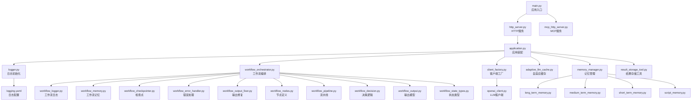
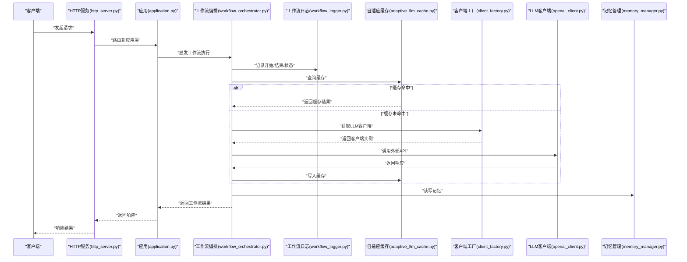
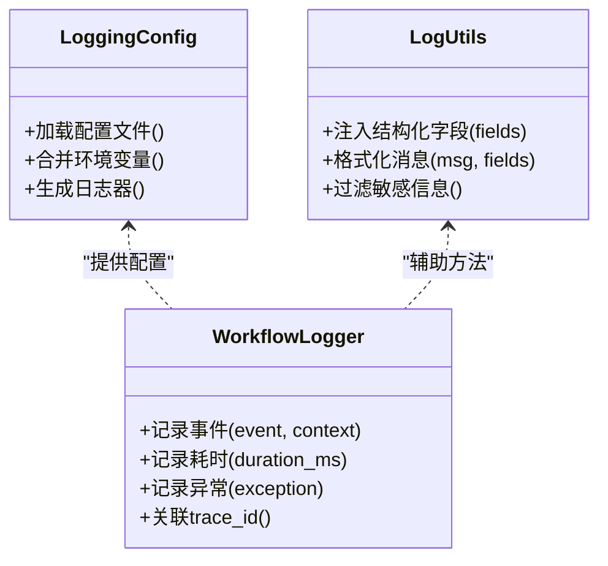
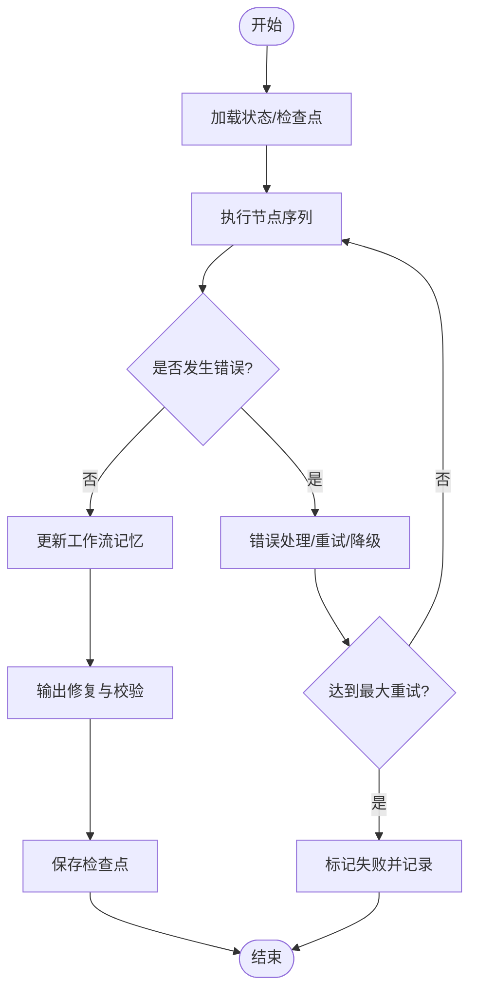
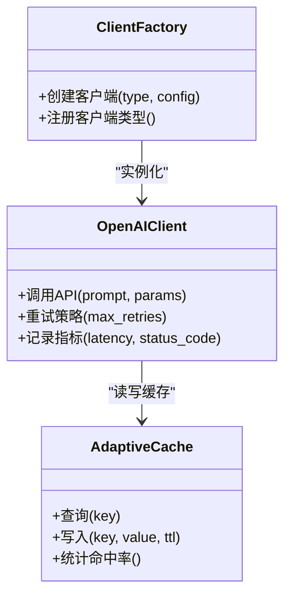
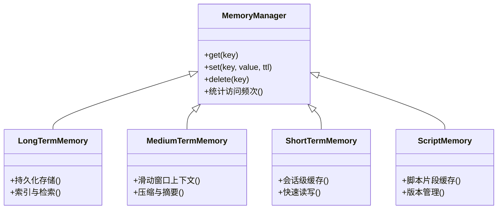
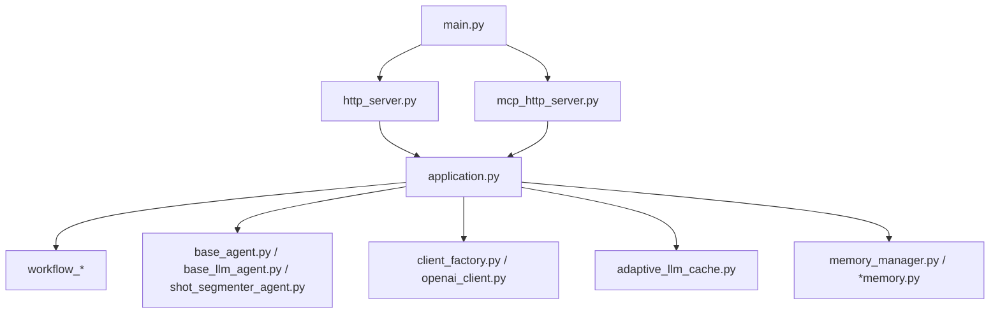

# 调试与性能分析

<cite>
**本文引用的文件**   
- [main.py](file://main.py)
- [src/penshot/logger.py](file://src/penshot/logger.py)
- [src/penshot/config/logging.yaml](file://src/penshot/config/logging.yaml)
- [src/penshot/config/config.py](file://src/penshot/config/config.py)
- [src/penshot/app/application.py](file://src/penshot/app/application.py)
- [src/penshot/http_server.py](file://src/penshot/http_server.py)
- [src/penshot/mcp_http_server.py](file://src/penshot/mcp_http_server.py)
- [src/penshot/neopen/agent/workflow/workflow_logger.py](file://src/penshot/neopen/agent/workflow/workflow_logger.py)
- [src/penshot/utils/log_utils.py](file://src/penshot/utils/log_utils.py)
- [src/penshot/neopen/agent/workflow/workflow_orchestrator.py](file://src/penshot/neopen/agent/workflow/workflow_orchestrator.py)
- [src/penshot/neopen/agent/workflow/workflow_state_types.py](file://src/penshot/neopen/agent/workflow/workflow_state_types.py)
- [src/penshot/neopen/agent/workflow/workflow_memory.py](file://src/penshot/neopen/agent/workflow/workflow_memory.py)
- [src/penshot/neopen/agent/workflow/workflow_checkpointer.py](file://src/penshot/neopen/agent/workflow/workflow_checkpointer.py)
- [src/penshot/neopen/agent/workflow/workflow_error_handler.py](file://src/penshot/neopen/agent/workflow/workflow_error_handler.py)
- [src/penshot/neopen/agent/workflow/workflow_output_fixer.py](file://src/penshot/neopen/agent/workflow/workflow_output_fixer.py)
- [src/penshot/neopen/agent/workflow/workflow_nodes.py](file://src/penshot/neopen/agent/workflow/workflow_nodes.py)
- [src/penshot/neopen/agent/workflow/workflow_pipeline.py](file://src/penshot/neopen/agent/workflow/workflow_pipeline.py)
- [src/penshot/neopen/agent/workflow/workflow_decision.py](file://src/penshot/neopen/agent/workflow/workflow_decision.py)
- [src/penshot/neopen/agent/workflow/workflow_output.py](file://src/penshot/neopen/agent/workflow/workflow_output.py)
- [src/penshot/neopen/agent/workflow/__init__.py](file://src/penshot/neopen/agent/workflow/__init__.py)
- [src/penshot/neopen/agent/base_agent.py](file://src/penshot/neopen/agent/base_agent.py)
- [src/penshot/neopen/agent/base_llm_agent.py](file://src/penshot/neopen/agent/base_llm_agent.py)
- [src/penshot/neopen/agent/shot_segmenter_agent.py](file://src/penshot/neopen/agent/shot_segmenter_agent.py)
- [src/penshot/neopen/client/client_factory.py](file://src/penshot/neopen/client/client_factory.py)
- [src/penshot/neopen/client/openai_client.py](file://src/penshot/neopen/client/openai_client.py)
- [src/penshot/neopen/cache/adaptive_llm_cache.py](file://src/penshot/neopen/cache/adaptive_llm_cache.py)
- [src/penshot/neopen/knowledge/memory/long_term_memory.py](file://src/penshot/neopen/knowledge/memory/long_term_memory.py)
- [src/penshot/neopen/knowledge/memory/medium_term_memory.py](file://src/penshot/neopen/knowledge/memory/medium_term_memory.py)
- [src/penshot/neopen/knowledge/memory/short_term_memory.py](file://src/penshot/neopen/knowledge/memory/short_term_memory.py)
- [src/penshot/neopen/knowledge/memory/memory_manager.py](file://src/penshot/neopen/knowledge/memory/memory_manager.py)
- [src/penshot/neopen/knowledge/memory/script_memory.py](file://src/penshot/neopen/knowledge/memory/script_memory.py)
- [src/penshot/neopen/tools/result_storage_tool.py](file://src/penshot/neopen/tools/result_storage_tool.py)
- [scripts/cli.py](file://scripts/cli.py)
- [examples/web_app.py](file://examples/web_app.py)
</cite>

## 目录
1. [简介](#简介)
2. [项目结构](#项目结构)
3. [核心组件](#核心组件)
4. [架构总览](#架构总览)
5. [详细组件分析](#详细组件分析)
6. [依赖关系分析](#依赖关系分析)
7. [性能考量](#性能考量)
8. [故障排查指南](#故障排查指南)
9. [结论](#结论)
10. [附录](#附录)

## 简介
本指南面向Video Shot Agent的调试与性能分析，聚焦以下目标：
- 日志系统：日志级别配置、结构化日志输出、日志分析与定位技巧
- 调试工具：断点调试、内存分析、性能瓶颈识别
- 监控指标：关键指标收集与告警配置建议
- 常见问题：典型问题定位方法与解决方案
- 优化案例：性能优化实践与调优建议

## 项目结构
本项目采用分层与模块化组织方式，日志与可观测性相关代码主要分布在以下位置：
- 应用启动与HTTP服务入口：main.py、http_server.py、mcp_http_server.py
- 日志配置与封装：config/logging.yaml、logger.py、utils/log_utils.py
- 工作流与Agent：neopen/agent/workflow/*、neopen/agent/*
- 客户端与缓存：neopen/client/*、neopen/cache/*
- 记忆与知识：neopen/knowledge/memory/*
- 工具与存储：neopen/tools/*

图表来源
- [main.py:1-200](file://main.py#L1-L200)
- [src/penshot/http_server.py:1-200](file://src/penshot/http_server.py#L1-L200)
- [src/penshot/mcp_http_server.py:1-200](file://src/penshot/mcp_http_server.py#L1-L200)
- [src/penshot/app/application.py:1-200](file://src/penshot/app/application.py#L1-L200)
- [src/penshot/logger.py:1-200](file://src/penshot/logger.py#L1-L200)
- [src/penshot/config/logging.yaml:1-200](file://src/penshot/config/logging.yaml#L1-L200)
- [src/penshot/neopen/agent/workflow/workflow_orchestrator.py:1-200](file://src/penshot/neopen/agent/workflow/workflow_orchestrator.py#L1-L200)
- [src/penshot/neopen/agent/workflow/workflow_logger.py:1-200](file://src/penshot/neopen/agent/workflow/workflow_logger.py#L1-L200)
- [src/penshot/neopen/agent/workflow/workflow_memory.py:1-200](file://src/penshot/neopen/agent/workflow/workflow_memory.py#L1-L200)
- [src/penshot/neopen/agent/workflow/workflow_checkpointer.py:1-200](file://src/penshot/neopen/agent/workflow/workflow_checkpointer.py#L1-L200)
- [src/penshot/neopen/agent/workflow/workflow_error_handler.py:1-200](file://src/penshot/neopen/agent/workflow/workflow_error_handler.py#L1-L200)
- [src/penshot/neopen/agent/workflow/workflow_output_fixer.py:1-200](file://src/penshot/neopen/agent/workflow/workflow_output_fixer.py#L1-L200)
- [src/penshot/neopen/agent/workflow/workflow_nodes.py:1-200](file://src/penshot/neopen/agent/workflow/workflow_nodes.py#L1-L200)
- [src/penshot/neopen/agent/workflow/workflow_pipeline.py:1-200](file://src/penshot/neopen/agent/workflow/workflow_pipeline.py#L1-L200)
- [src/penshot/neopen/agent/workflow/workflow_decision.py:1-200](file://src/penshot/neopen/agent/workflow/workflow_decision.py#L1-L200)
- [src/penshot/neopen/agent/workflow/workflow_output.py:1-200](file://src/penshot/neopen/agent/workflow/workflow_output.py#L1-L200)
- [src/penshot/neopen/agent/workflow/workflow_state_types.py:1-200](file://src/penshot/neopen/agent/workflow/workflow_state_types.py#L1-L200)
- [src/penshot/neopen/client/client_factory.py:1-200](file://src/penshot/neopen/client/client_factory.py#L1-L200)
- [src/penshot/neopen/client/openai_client.py:1-200](file://src/penshot/neopen/client/openai_client.py#L1-L200)
- [src/penshot/neopen/cache/adaptive_llm_cache.py:1-200](file://src/penshot/neopen/cache/adaptive_llm_cache.py#L1-L200)
- [src/penshot/neopen/knowledge/memory/memory_manager.py:1-200](file://src/penshot/neopen/knowledge/memory/memory_manager.py#L1-L200)
- [src/penshot/neopen/knowledge/memory/long_term_memory.py:1-200](file://src/penshot/neopen/knowledge/memory/long_term_memory.py#L1-L200)
- [src/penshot/neopen/knowledge/memory/medium_term_memory.py:1-200](file://src/penshot/neopen/knowledge/memory/medium_term_memory.py#L1-L200)
- [src/penshot/neopen/knowledge/memory/short_term_memory.py:1-200](file://src/penshot/neopen/knowledge/memory/short_term_memory.py#L1-L200)
- [src/penshot/neopen/knowledge/memory/script_memory.py:1-200](file://src/penshot/neopen/knowledge/memory/script_memory.py#L1-L200)
- [src/penshot/neopen/tools/result_storage_tool.py:1-200](file://src/penshot/neopen/tools/result_storage_tool.py#L1-L200)

章节来源
- [main.py:1-200](file://main.py#L1-L200)
- [src/penshot/http_server.py:1-200](file://src/penshot/http_server.py#L1-L200)
- [src/penshot/mcp_http_server.py:1-200](file://src/penshot/mcp_http_server.py#L1-L200)
- [src/penshot/app/application.py:1-200](file://src/penshot/app/application.py#L1-L200)
- [src/penshot/logger.py:1-200](file://src/penshot/logger.py#L1-L200)
- [src/penshot/config/logging.yaml:1-200](file://src/penshot/config/logging.yaml#L1-L200)

## 核心组件
本节聚焦日志系统与可观测性相关的核心组件，说明其职责与交互。

- 日志配置与初始化
  - logging.yaml：集中定义日志级别、输出目标（控制台/文件）、格式化策略等
  - logger.py：加载配置并初始化全局日志器，提供统一接口
  - utils/log_utils.py：封装常用日志辅助方法（如结构化字段注入）

- 工作流日志
  - workflow_logger.py：在工作流执行过程中记录关键事件、状态转换、耗时等
  - workflow_orchestrator.py：编排节点执行，集成日志与错误处理

- 客户端与缓存
  - client_factory.py：根据配置创建不同LLM客户端实例
  - openai_client.py：具体客户端实现，适合埋点请求耗时、重试次数等指标
  - adaptive_llm_cache.py：自适应缓存，命中/未命中可作为性能指标

- 记忆与存储
  - memory_manager.py：统一管理长短期记忆与脚本记忆
  - long_term_memory.py / medium_term_memory.py / short_term_memory.py / script_memory.py：不同层级记忆读写，便于追踪数据访问路径
  - result_storage_tool.py：结果持久化工具，记录写入成功/失败及耗时

章节来源
- [src/penshot/config/logging.yaml:1-200](file://src/penshot/config/logging.yaml#L1-L200)
- [src/penshot/logger.py:1-200](file://src/penshot/logger.py#L1-L200)
- [src/penshot/utils/log_utils.py:1-200](file://src/penshot/utils/log_utils.py#L1-L200)
- [src/penshot/neopen/agent/workflow/workflow_logger.py:1-200](file://src/penshot/neopen/agent/workflow/workflow_logger.py#L1-L200)
- [src/penshot/neopen/agent/workflow/workflow_orchestrator.py:1-200](file://src/penshot/neopen/agent/workflow/workflow_orchestrator.py#L1-L200)
- [src/penshot/neopen/client/client_factory.py:1-200](file://src/penshot/neopen/client/client_factory.py#L1-L200)
- [src/penshot/neopen/client/openai_client.py:1-200](file://src/penshot/neopen/client/openai_client.py#L1-L200)
- [src/penshot/neopen/cache/adaptive_llm_cache.py:1-200](file://src/penshot/neopen/cache/adaptive_llm_cache.py#L1-L200)
- [src/penshot/neopen/knowledge/memory/memory_manager.py:1-200](file://src/penshot/neopen/knowledge/memory/memory_manager.py#L1-L200)
- [src/penshot/neopen/knowledge/memory/long_term_memory.py:1-200](file://src/penshot/neopen/knowledge/memory/long_term_memory.py#L1-L200)
- [src/penshot/neopen/knowledge/memory/medium_term_memory.py:1-200](file://src/penshot/neopen/knowledge/memory/medium_term_memory.py#L1-L200)
- [src/penshot/neopen/knowledge/memory/short_term_memory.py:1-200](file://src/penshot/neopen/knowledge/memory/short_term_memory.py#L1-L200)
- [src/penshot/neopen/knowledge/memory/script_memory.py:1-200](file://src/penshot/neopen/knowledge/memory/script_memory.py#L1-L200)
- [src/penshot/neopen/tools/result_storage_tool.py:1-200](file://src/penshot/neopen/tools/result_storage_tool.py#L1-L200)

## 架构总览
下图展示从HTTP/MCP入口到工作流编排、客户端调用、缓存与记忆的完整链路，以及日志在各层的落点。

图表来源
- [src/penshot/http_server.py:1-200](file://src/penshot/http_server.py#L1-L200)
- [src/penshot/app/application.py:1-200](file://src/penshot/app/application.py#L1-L200)
- [src/penshot/neopen/agent/workflow/workflow_orchestrator.py:1-200](file://src/penshot/neopen/agent/workflow/workflow_orchestrator.py#L1-L200)
- [src/penshot/neopen/agent/workflow/workflow_logger.py:1-200](file://src/penshot/neopen/agent/workflow/workflow_logger.py#L1-L200)
- [src/penshot/neopen/cache/adaptive_llm_cache.py:1-200](file://src/penshot/neopen/cache/adaptive_llm_cache.py#L1-L200)
- [src/penshot/neopen/client/client_factory.py:1-200](file://src/penshot/neopen/client/client_factory.py#L1-L200)
- [src/penshot/neopen/client/openai_client.py:1-200](file://src/penshot/neopen/client/openai_client.py#L1-L200)
- [src/penshot/neopen/knowledge/memory/memory_manager.py:1-200](file://src/penshot/neopen/knowledge/memory/memory_manager.py#L1-L200)

## 详细组件分析

### 日志系统
- 配置中心
  - logging.yaml：定义各级别（DEBUG/INFO/WARNING/ERROR/CRITICAL）、输出目标（控制台/文件）、格式模板（时间戳、模块名、消息体、结构化字段）
  - config/config.py：加载YAML配置，合并环境变量，暴露统一配置对象供日志器使用

- 日志初始化
  - logger.py：读取配置，设置根日志器与子模块日志器，确保跨进程/线程一致性
  - utils/log_utils.py：提供结构化字段注入（如任务ID、用户ID、上下文键值），便于后续检索与分析

- 工作流日志
  - workflow_logger.py：在节点进入/退出、状态变更、异常发生时记录结构化日志；支持按trace_id聚合
  - workflow_orchestrator.py：在编排阶段注入日志上下文，保证端到端可追踪

图表来源
- [src/penshot/config/logging.yaml:1-200](file://src/penshot/config/logging.yaml#L1-L200)
- [src/penshot/config/config.py:1-200](file://src/penshot/config/config.py#L1-L200)
- [src/penshot/logger.py:1-200](file://src/penshot/logger.py#L1-L200)
- [src/penshot/utils/log_utils.py:1-200](file://src/penshot/utils/log_utils.py#L1-L200)
- [src/penshot/neopen/agent/workflow/workflow_logger.py:1-200](file://src/penshot/neopen/agent/workflow/workflow_logger.py#L1-L200)

章节来源
- [src/penshot/config/logging.yaml:1-200](file://src/penshot/config/logging.yaml#L1-L200)
- [src/penshot/config/config.py:1-200](file://src/penshot/config/config.py#L1-L200)
- [src/penshot/logger.py:1-200](file://src/penshot/logger.py#L1-L200)
- [src/penshot/utils/log_utils.py:1-200](file://src/penshot/utils/log_utils.py#L1-L200)
- [src/penshot/neopen/agent/workflow/workflow_logger.py:1-200](file://src/penshot/neopen/agent/workflow/workflow_logger.py#L1-L200)

### 工作流编排与状态
- 编排器
  - workflow_orchestrator.py：负责节点调度、错误恢复、重试策略、超时控制
- 状态与类型
  - workflow_state_types.py：定义工作流状态枚举与数据结构
- 记忆与检查点
  - workflow_memory.py：维护执行过程中的中间状态
  - workflow_checkpointer.py：持久化检查点，支持断点续跑
- 错误处理与输出修复
  - workflow_error_handler.py：捕获异常、降级策略、告警上报
  - workflow_output_fixer.py：对输出进行校验与修复，提升鲁棒性

图表来源
- [src/penshot/neopen/agent/workflow/workflow_orchestrator.py:1-200](file://src/penshot/neopen/agent/workflow/workflow_orchestrator.py#L1-L200)
- [src/penshot/neopen/agent/workflow/workflow_state_types.py:1-200](file://src/penshot/neopen/agent/workflow/workflow_state_types.py#L1-L200)
- [src/penshot/neopen/agent/workflow/workflow_memory.py:1-200](file://src/penshot/neopen/agent/workflow/workflow_memory.py#L1-L200)
- [src/penshot/neopen/agent/workflow/workflow_checkpointer.py:1-200](file://src/penshot/neopen/agent/workflow/workflow_checkpointer.py#L1-L200)
- [src/penshot/neopen/agent/workflow/workflow_error_handler.py:1-200](file://src/penshot/neopen/agent/workflow/workflow_error_handler.py#L1-L200)
- [src/penshot/neopen/agent/workflow/workflow_output_fixer.py:1-200](file://src/penshot/neopen/agent/workflow/workflow_output_fixer.py#L1-L200)

章节来源
- [src/penshot/neopen/agent/workflow/workflow_orchestrator.py:1-200](file://src/penshot/neopen/agent/workflow/workflow_orchestrator.py#L1-L200)
- [src/penshot/neopen/agent/workflow/workflow_state_types.py:1-200](file://src/penshot/neopen/agent/workflow/workflow_state_types.py#L1-L200)
- [src/penshot/neopen/agent/workflow/workflow_memory.py:1-200](file://src/penshot/neopen/agent/workflow/workflow_memory.py#L1-L200)
- [src/penshot/neopen/agent/workflow/workflow_checkpointer.py:1-200](file://src/penshot/neopen/agent/workflow/workflow_checkpointer.py#L1-L200)
- [src/penshot/neopen/agent/workflow/workflow_error_handler.py:1-200](file://src/penshot/neopen/agent/workflow/workflow_error_handler.py#L1-L200)
- [src/penshot/neopen/agent/workflow/workflow_output_fixer.py:1-200](file://src/penshot/neopen/agent/workflow/workflow_output_fixer.py#L1-L200)

### 客户端与缓存
- 客户端工厂
  - client_factory.py：根据配置动态创建OpenAI/Qwen/Ollama等客户端
- OpenAI客户端
  - openai_client.py：封装请求/重试/超时/限流，适合埋点指标（延迟、成功率、错误码分布）
- 自适应缓存
  - adaptive_llm_cache.py：基于相似度或规则选择缓存策略，记录命中率与过期行为

图表来源
- [src/penshot/neopen/client/client_factory.py:1-200](file://src/penshot/neopen/client/client_factory.py#L1-L200)
- [src/penshot/neopen/client/openai_client.py:1-200](file://src/penshot/neopen/client/openai_client.py#L1-L200)
- [src/penshot/neopen/cache/adaptive_llm_cache.py:1-200](file://src/penshot/neopen/cache/adaptive_llm_cache.py#L1-L200)

章节来源
- [src/penshot/neopen/client/client_factory.py:1-200](file://src/penshot/neopen/client/client_factory.py#L1-L200)
- [src/penshot/neopen/client/openai_client.py:1-200](file://src/penshot/neopen/client/openai_client.py#L1-L200)
- [src/penshot/neopen/cache/adaptive_llm_cache.py:1-200](file://src/penshot/neopen/cache/adaptive_llm_cache.py#L1-L200)

### 记忆与存储
- 记忆管理
  - memory_manager.py：统一接口管理长短期记忆与脚本记忆
- 各层记忆
  - long_term_memory.py / medium_term_memory.py / short_term_memory.py / script_memory.py：分别承担长期沉淀、中期上下文、短期会话与脚本专用记忆
- 结果存储
  - result_storage_tool.py：将最终结果持久化，记录写入耗时与失败原因

图表来源
- [src/penshot/neopen/knowledge/memory/memory_manager.py:1-200](file://src/penshot/neopen/knowledge/memory/memory_manager.py#L1-L200)
- [src/penshot/neopen/knowledge/memory/long_term_memory.py:1-200](file://src/penshot/neopen/knowledge/memory/long_term_memory.py#L1-L200)
- [src/penshot/neopen/knowledge/memory/medium_term_memory.py:1-200](file://src/penshot/neopen/knowledge/memory/medium_term_memory.py#L1-L200)
- [src/penshot/neopen/knowledge/memory/short_term_memory.py:1-200](file://src/penshot/neopen/knowledge/memory/short_term_memory.py#L1-L200)
- [src/penshot/neopen/knowledge/memory/script_memory.py:1-200](file://src/penshot/neopen/knowledge/memory/script_memory.py#L1-L200)
- [src/penshot/neopen/tools/result_storage_tool.py:1-200](file://src/penshot/neopen/tools/result_storage_tool.py#L1-L200)

章节来源
- [src/penshot/neopen/knowledge/memory/memory_manager.py:1-200](file://src/penshot/neopen/knowledge/memory/memory_manager.py#L1-L200)
- [src/penshot/neopen/knowledge/memory/long_term_memory.py:1-200](file://src/penshot/neopen/knowledge/memory/long_term_memory.py#1-L200)
- [src/penshot/neopen/knowledge/memory/medium_term_memory.py:1-200](file://src/penshot/neopen/knowledge/memory/medium_term_memory.py#L1-L200)
- [src/penshot/neopen/knowledge/memory/short_term_memory.py:1-200](file://src/penshot/neopen/knowledge/memory/short_term_memory.py#L1-L200)
- [src/penshot/neopen/knowledge/memory/script_memory.py:1-200](file://src/penshot/neopen/knowledge/memory/script_memory.py#L1-L200)
- [src/penshot/neopen/tools/result_storage_tool.py:1-200](file://src/penshot/neopen/tools/result_storage_tool.py#L1-L200)

## 依赖关系分析
- 入口与服务
  - main.py：应用主入口，组装HTTP/MCP服务与配置
  - http_server.py / mcp_http_server.py：对外暴露REST与MCP接口
- 应用装配
  - application.py：集中装配日志、工作流、客户端、缓存、记忆等组件
- 工作流与Agent
  - workflow_*：工作流核心模块
  - base_agent.py / base_llm_agent.py / shot_segmenter_agent.py：Agent基类与具体实现

图表来源
- [main.py:1-200](file://main.py#L1-L200)
- [src/penshot/http_server.py:1-200](file://src/penshot/http_server.py#L1-L200)
- [src/penshot/mcp_http_server.py:1-200](file://src/penshot/mcp_http_server.py#L1-L200)
- [src/penshot/app/application.py:1-200](file://src/penshot/app/application.py#L1-L200)
- [src/penshot/neopen/agent/workflow/__init__.py:1-200](file://src/penshot/neopen/agent/workflow/__init__.py#L1-L200)
- [src/penshot/neopen/agent/base_agent.py:1-200](file://src/penshot/neopen/agent/base_agent.py#L1-L200)
- [src/penshot/neopen/agent/base_llm_agent.py:1-200](file://src/penshot/neopen/agent/base_llm_agent.py#L1-L200)
- [src/penshot/neopen/agent/shot_segmenter_agent.py:1-200](file://src/penshot/neopen/agent/shot_segmenter_agent.py#L1-L200)

章节来源
- [main.py:1-200](file://main.py#L1-L200)
- [src/penshot/http_server.py:1-200](file://src/penshot/http_server.py#L1-L200)
- [src/penshot/mcp_http_server.py:1-200](file://src/penshot/mcp_http_server.py#L1-L200)
- [src/penshot/app/application.py:1-200](file://src/penshot/app/application.py#L1-L200)
- [src/penshot/neopen/agent/workflow/__init__.py:1-200](file://src/penshot/neopen/agent/workflow/__init__.py#L1-L200)
- [src/penshot/neopen/agent/base_agent.py:1-200](file://src/penshot/neopen/agent/base_agent.py#L1-L200)
- [src/penshot/neopen/agent/base_llm_agent.py:1-200](file://src/penshot/neopen/agent/base_llm_agent.py#L1-L200)
- [src/penshot/neopen/agent/shot_segmenter_agent.py:1-200](file://src/penshot/neopen/agent/shot_segmenter_agent.py#L1-L200)

## 性能考量
- 日志开销
  - 避免在高并发路径中频繁写入大对象；使用异步或批量化写入
  - 合理设置日志级别，生产环境默认INFO及以上
- 缓存命中率
  - 通过adaptive_llm_cache的命中率与TTL调整减少外部API调用
- 客户端限流与重试
  - 在openai_client中配置合理的max_retries与backoff策略，避免雪崩
- 记忆层优化
  - 短中期记忆采用滑动窗口与压缩策略，降低I/O压力
- 工作流并行度
  - 在workflow_orchestrator中评估节点间依赖，尽可能并行执行无依赖节点

[本节为通用指导，不直接分析具体文件]

## 故障排查指南
- 日志定位
  - 使用trace_id串联一次请求的全链路日志
  - 关注ERROR/CRITICAL级别，结合结构化字段快速筛选
- 断点调试
  - 在workflow_orchestrator的关键分支与工作流节点处设置断点
  - 在openai_client的请求前后插入断点，观察参数与响应
- 内存分析
  - 使用内存快照工具对比工作流执行前后的对象增长
  - 关注记忆层的大对象引用，及时释放或压缩
- 性能瓶颈识别
  - 通过日志中的耗时字段定位慢节点
  - 结合缓存命中率与外部API延迟判断瓶颈来源
- 监控与告警
  - 收集关键指标：请求量、P95/P99延迟、错误率、缓存命中率、重试次数
  - 配置阈值告警：错误率突增、延迟飙升、缓存命中率骤降

章节来源
- [src/penshot/neopen/agent/workflow/workflow_orchestrator.py:1-200](file://src/penshot/neopen/agent/workflow/workflow_orchestrator.py#L1-L200)
- [src/penshot/neopen/client/openai_client.py:1-200](file://src/penshot/neopen/client/openai_client.py#L1-L200)
- [src/penshot/neopen/cache/adaptive_llm_cache.py:1-200](file://src/penshot/neopen/cache/adaptive_llm_cache.py#L1-L200)
- [src/penshot/neopen/knowledge/memory/memory_manager.py:1-200](file://src/penshot/neopen/knowledge/memory/memory_manager.py#L1-L200)

## 结论
通过统一的日志配置、结构化输出与全链路追踪，配合工作流编排、客户端与缓存的可观测性埋点，能够高效定位问题并优化性能。建议在开发环境开启DEBUG日志，在生产环境以INFO为主，并结合监控告警形成闭环。

[本节为总结，不直接分析具体文件]

## 附录
- CLI与示例
  - scripts/cli.py：命令行工具，便于本地调试与批量任务
  - examples/web_app.py：Web示例，演示如何集成与调用
- 参考入口
  - main.py：应用主入口，了解整体装配流程

章节来源
- [scripts/cli.py:1-200](file://scripts/cli.py#L1-L200)
- [examples/web_app.py:1-200](file://examples/web_app.py#L1-L200)
- [main.py:1-200](file://main.py#L1-L200)