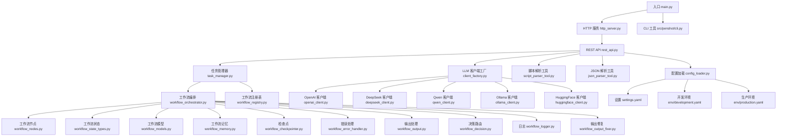
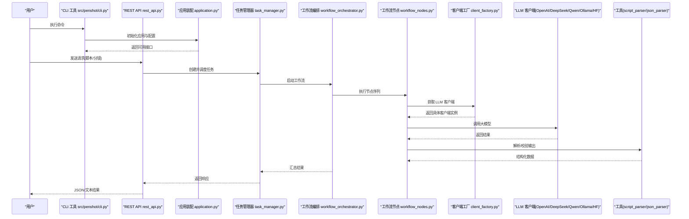
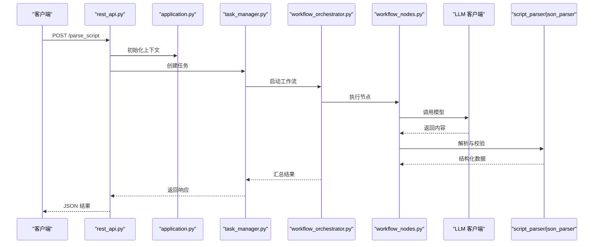
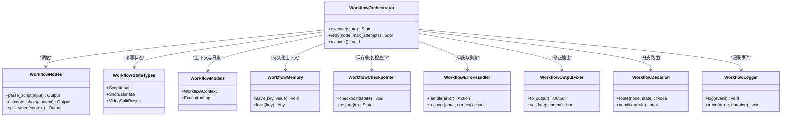
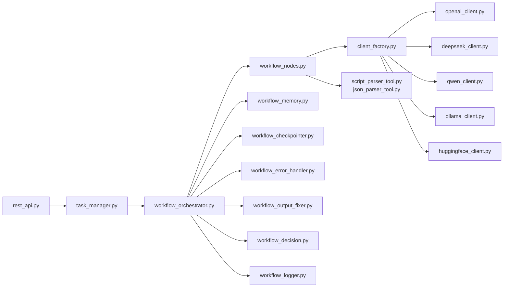

# 快速开始

<cite>
**本文引用的文件**   
- [README_zh.md](file://README_zh.md)
- [pyproject.toml](file://pyproject.toml)
- [main.py](file://main.py)
- [src/penshot/cli.py](file://src/penshot/cli.py)
- [src/penshot/api/rest_api.py](file://src/penshot/api/rest_api.py)
- [examples/direct_usage.py](file://examples/direct_usage.py)
- [examples/web_app.py](file://examples/web_app.py)
- [src/penshot/app/application.py](file://src/penshot/app/application.py)
- [src/penshot/config/config_loader.py](file://src/penshot/config/config_loader.py)
- [src/penshot/config/settings.yaml](file://src/penshot/config/settings.yaml)
- [src/penshot/config/env/development.yaml](file://src/penshot/config/env/development.yaml)
- [src/penshot/config/env/production.yaml](file://src/penshot/config/env/production.yaml)
- [src/penshot/client/client_factory.py](file://src/penshot/client/client_factory.py)
- [src/penshot/client/openai_client.py](file://src/penshot/client/openai_client.py)
- [src/penshot/client/deepseek_client.py](file://src/penshot/client/deepseek_client.py)
- [src/penshot/client/qwen_client.py](file://src/penshot/client/qwen_client.py)
- [src/penshot/client/ollama_client.py](file://src/penshot/client/ollama_client.py)
- [src/penshot/client/huggingface_client.py](file://src/penshot/client/huggingface_client.py)
- [src/penshot/tools/script_parser_tool.py](file://src/penshot/tools/script_parser_tool.py)
- [src/penshot/tools/json_parser_tool.py](file://src/penshot/tools/json_parser_tool.py)
- [src/penshot/task/task_manager.py](file://src/penshot/task/task_manager.py)
- [src/penshot/task/workflow_registry.py](file://src/penshot/task/workflow_registry.py)
- [src/penshot/agent/workflow/workflow_orchestrator.py](file://src/penshot/agent/workflow/workflow_orchestrator.py)
- [src/penshot/agent/workflow/workflow_pipeline.py](file://src/penshot/agent/workflow/workflow_pipeline.py)
- [src/penshot/agent/workflow/workflow_state_types.py](file://src/penshot/agent/workflow/workflow_state_types.py)
- [src/penshot/agent/workflow/workflow_models.py](file://src/penshot/agent/workflow/workflow_models.py)
- [src/penshot/agent/workflow/workflow_nodes.py](file://src/penshot/agent/workflow/workflow_nodes.py)
- [src/penshot/agent/workflow/workflow_memory.py](file://src/penshot/agent/workflow/workflow_memory.py)
- [src/penshot/agent/workflow/workflow_checkpointer.py](file://src/penshot/agent/workflow/workflow_checkpointer.py)
- [src/penshot/agent/workflow/workflow_error_handler.py](file://src/penshot/agent/workflow/workflow_error_handler.py)
- [src/penshot/agent/workflow/workflow_output.py](file://src/penshot/agent/workflow/workflow_output.py)
- [src/penshot/agent/workflow/workflow_decision.py](file://src/penshot/agent/workflow/workflow_decision.py)
- [src/penshot/agent/workflow/workflow_logger.py](file://src/penshot/agent/workflow/workflow_logger.py)
- [src/penshot/agent/workflow/workflow_output_fixer.py](file://src/penshot/agent/workflow/workflow_output_fixer.py)
- [src/penshot/agent/script_parser_agent.py](file://src/penshot/agent/script_parser_agent.py)
- [src/penshot/agent/shot_segmenter_agent.py](file://src/penshot/agent/shot_segmenter_agent.py)
- [src/penshot/agent/video_splitter_agent.py](file://src/penshot/agent/video_splitter_agent.py)
- [src/penshot/agent/prompt_converter_agent.py](file://src/penshot/agent/prompt_converter_agent.py)
- [src/penshot/agent/quality_auditor_agent.py](file://src/penshot/agent/quality_auditor_agent.py)
- [src/penshot/agent/base_llm_agent.py](file://src/penshot/agent/base_llm_agent.py)
- [src/penshot/agent/base_agent.py](file://src/penshot/agent/base_agent.py)
- [src/penshot/agent/base_models.py](file://src/penshot/agent/base_models.py)
- [src/penshot/agent/base_repairable_agent.py](file://src/penshot/agent/base_repairable_agent.py)
- [src/penshot/agent/shot_context.py](file://src/penshot/agent/shot_context.py)
- [src/penshot/agent/shot_config.py](file://src/penshot/agent/shot_config.py)
- [src/penshot/agent/shot_language.py](file://src/penshot/agent/shot_language.py)
- [src/penshot/knowledge/knowledge_manager.py](file://src/penshot/knowledge/knowledge_manager.py)
- [src/penshot/knowledge/memory/long_term_memory.py](file://src/penshot/knowledge/memory/long_term_memory.py)
- [src/penshot/knowledge/memory/medium_term_memory.py](file://src/penshot/knowledge/memory/medium_term_memory.py)
- [src/penshot/knowledge/memory/short_term_memory.py](file://src/penshot/knowledge/memory/short_term_memory.py)
- [src/penshot/knowledge/memory/memory_manager.py](file://src/penshot/knowledge/memory/memory_manager.py)
- [src/penshot/knowledge/memory/memory_models.py](file://src/penshot/knowledge/memory/memory_models.py)
- [src/penshot/knowledge/memory/script_memory.py](file://src/penshot/knowledge/memory/script_memory.py)
- [src/penshot/knowledge/memory/memory_context.py](file://src/penshot/knowledge/memory/memory_context.py)
- [src/penshot/knowledge/template/prompt_template_knowledge.py](file://src/penshot/knowledge/template/prompt_template_knowledge.py)
- [src/penshot/prompts/prompt_load_manager.py](file://src/penshot/prompts/prompt_load_manager.py)
- [src/penshot/prompts/prompt_template_manager.py](file://src/penshot/prompts/prompt_template_manager.py)
- [src/penshot/utils/log_utils.py](file://src/penshot/utils/log_utils.py)
- [src/penshot/utils/file_utils.py](file://src/penshot/utils/file_utils.py)
- [src/penshot/utils/path_utils.py](file://src/penshot/utils/path_utils.py)
- [src/penshot/utils/env_utils.py](file://src/penshot/utils/env_utils.py)
- [src/penshot/utils/dotenv_loader.py](file://src/penshot/utils/dotenv_loader.py)
- [src/penshot/http_server.py](file://src/penshot/http_server.py)
- [Dockerfile](file://Dockerfile)
- [docker-compose.yml](file://docker-compose.yml)
</cite>

## 更新摘要
**所做更改**   
- 优化了main.py中的路径处理逻辑，改进了应用程序启动时的路径解析机制
- 提升了文件操作的性能和可靠性，确保在不同运行环境下都能正确解析路径
- 更新了相关的使用说明以反映路径处理的改进

## 目录
1. [简介](#简介)
2. [项目结构](#项目结构)
3. [核心组件](#核心组件)
4. [架构总览](#架构总览)
5. [详细组件分析](#详细组件分析)
6. [依赖分析](#依赖分析)
7. [性能考虑](#性能考虑)
8. [故障排除指南](#故障排除指南)
9. [结论](#结论)
10. [附录](#附录)

## 简介
本指南面向首次接触 Video Shot Agent 的用户，目标是帮助你在最短时间内完成环境准备、安装依赖、配置运行，并通过三种方式（Python 直接调用、REST API、命令行）体验从脚本解析到分镜生成的完整流程。文档同时提供常见问题与排错建议，确保你能够顺利运行第一个示例。

## 项目结构
仓库采用分层组织：应用入口、API 层、Agent 工作流、任务编排、工具与客户端、配置与提示词、示例与脚本等。核心路径说明如下：
- 应用入口与服务器：main.py、http_server.py、app/application.py
- REST API：api/rest_api.py
- CLI 工具：src/penshot/cli.py（已迁移）
- Agent 与工作流：agent/*、agent/workflow/*
- 任务管理：task/*
- 工具与客户端：tools/*、client/*
- 配置与提示词：config/*、prompts/*、knowledge/*
- 示例：examples/*
- 容器化：Dockerfile、docker-compose.yml

图表来源
- [main.py:1-200](file://main.py#L1-L200)
- [src/penshot/http_server.py:1-200](file://src/penshot/http_server.py#L1-L200)
- [src/penshot/api/rest_api.py:1-200](file://src/penshot/api/rest_api.py#L1-L200)
- [src/penshot/cli.py:1-200](file://src/penshot/cli.py#L1-L200)
- [src/penshot/task/task_manager.py:1-200](file://src/penshot/task/task_manager.py#L1-L200)
- [src/penshot/agent/workflow/workflow_orchestrator.py:1-200](file://src/penshot/agent/workflow/workflow_orchestrator.py#L1-L200)
- [src/penshot/agent/workflow/workflow_nodes.py:1-200](file://src/penshot/agent/workflow/workflow_nodes.py#L1-L200)
- [src/penshot/agent/workflow/workflow_state_types.py:1-200](file://src/penshot/agent/workflow/workflow_state_types.py#L1-L200)
- [src/penshot/agent/workflow/workflow_models.py:1-200](file://src/penshot/agent/workflow/workflow_models.py#L1-L200)
- [src/penshot/agent/workflow/workflow_memory.py:1-200](file://src/penshot/agent/workflow/workflow_memory.py#L1-L200)
- [src/penshot/agent/workflow/workflow_checkpointer.py:1-200](file://src/penshot/agent/workflow/workflow_checkpointer.py#L1-L200)
- [src/penshot/agent/workflow/workflow_error_handler.py:1-200](file://src/penshot/agent/workflow/workflow_error_handler.py#L1-L200)
- [src/penshot/agent/workflow/workflow_output.py:1-200](file://src/penshot/agent/workflow/workflow_output.py#L1-L200)
- [src/penshot/agent/workflow/workflow_decision.py:1-200](file://src/penshot/agent/workflow/workflow_decision.py#L1-L200)
- [src/penshot/agent/workflow/workflow_logger.py:1-200](file://src/penshot/agent/workflow/workflow_logger.py#L1-L200)
- [src/penshot/agent/workflow/workflow_output_fixer.py:1-200](file://src/penshot/agent/workflow/workflow_output_fixer.py#L1-L200)
- [src/penshot/task/workflow_registry.py:1-200](file://src/penshot/task/workflow_registry.py#L1-L200)
- [src/penshot/client/client_factory.py:1-200](file://src/penshot/client/client_factory.py#L1-L200)
- [src/penshot/client/openai_client.py:1-200](file://src/penshot/client/openai_client.py#L1-L200)
- [src/penshot/client/deepseek_client.py:1-200](file://src/penshot/client/deepseek_client.py#L1-L200)
- [src/penshot/client/qwen_client.py:1-200](file://src/penshot/client/qwen_client.py#L1-L200)
- [src/penshot/client/ollama_client.py:1-200](file://src/penshot/client/ollama_client.py#L1-L200)
- [src/penshot/client/huggingface_client.py:1-200](file://src/penshot/client/huggingface_client.py#L1-L200)
- [src/penshot/tools/script_parser_tool.py:1-200](file://src/penshot/tools/script_parser_tool.py#L1-L200)
- [src/penshot/tools/json_parser_tool.py:1-200](file://src/penshot/tools/json_parser_tool.py#L1-L200)
- [src/penshot/config/config_loader.py:1-200](file://src/penshot/config/config_loader.py#L1-L200)
- [src/penshot/config/settings.yaml:1-200](file://src/penshot/config/settings.yaml#L1-L200)
- [src/penshot/config/env/development.yaml:1-200](file://src/penshot/config/env/development.yaml#L1-L200)
- [src/penshot/config/env/production.yaml:1-200](file://src/penshot/config/env/production.yaml#L1-L200)

章节来源
- [README_zh.md:1-200](file://README_zh.md#L1-L200)
- [pyproject.toml:1-200](file://pyproject.toml#L1-L200)
- [main.py:1-200](file://main.py#L1-L200)
- [src/penshot/http_server.py:1-200](file://src/penshot/http_server.py#L1-L200)
- [src/penshot/api/rest_api.py:1-200](file://src/penshot/api/rest_api.py#L1-L200)
- [src/penshot/cli.py:1-200](file://src/penshot/cli.py#L1-L200)

## 核心组件
- 应用启动与配置
  - 入口 main.py 负责初始化应用上下文并启动 HTTP 服务或 CLI，现已优化路径处理逻辑以提升性能和可靠性。
  - 配置加载器 config_loader.py 统一读取 settings.yaml 与环境配置文件（development.yaml、production.yaml）。
  - 应用装配 application.py 负责组装服务、注册路由与中间件。
- REST API
  - rest_api.py 暴露脚本解析、分镜生成、视频切分等接口，内部通过任务管理器调度工作流。
- CLI 工具
  - cli.py（位于src/penshot/cli.py）提供命令行参数解析与快捷执行，适合本地快速验证。
- 任务与工作流
  - task_manager.py 管理任务生命周期；workflow_orchestrator.py 编排节点执行；workflow_nodes.py 定义具体步骤；workflow_state_types.py 与 workflow_models.py 描述状态与数据模型；workflow_memory.py 维护上下文；workflow_checkpointer.py 持久化检查点；workflow_error_handler.py 统一错误处理；workflow_output.py 标准化输出；workflow_decision.py 控制分支；workflow_logger.py 记录日志；workflow_output_fixer.py 修复异常输出。
- LLM 客户端
  - client_factory.py 根据配置选择 OpenAI、DeepSeek、Qwen、Ollama、HuggingFace 等后端。
- 工具
  - script_parser_tool.py 与 json_parser_tool.py 为工作流提供结构化输入与解析能力。

章节来源
- [src/penshot/app/application.py:1-200](file://src/penshot/app/application.py#L1-L200)
- [src/penshot/config/config_loader.py:1-200](file://src/penshot/config/config_loader.py#L1-L200)
- [src/penshot/config/settings.yaml:1-200](file://src/penshot/config/settings.yaml#L1-L200)
- [src/penshot/config/env/development.yaml:1-200](file://src/penshot/config/env/development.yaml#L1-L200)
- [src/penshot/config/env/production.yaml:1-200](file://src/penshot/config/env/production.yaml#L1-L200)
- [src/penshot/api/rest_api.py:1-200](file://src/penshot/api/rest_api.py#L1-L200)
- [src/penshot/cli.py:1-200](file://src/penshot/cli.py#L1-L200)
- [src/penshot/task/task_manager.py:1-200](file://src/penshot/task/task_manager.py#L1-L200)
- [src/penshot/agent/workflow/workflow_orchestrator.py:1-200](file://src/penshot/agent/workflow/workflow_orchestrator.py#L1-L200)
- [src/penshot/agent/workflow/workflow_nodes.py:1-200](file://src/penshot/agent/workflow/workflow_nodes.py#L1-L200)
- [src/penshot/agent/workflow/workflow_state_types.py:1-200](file://src/penshot/agent/workflow/workflow_state_types.py#L1-L200)
- [src/penshot/agent/workflow/workflow_models.py:1-200](file://src/penshot/agent/workflow/workflow_models.py#L1-L200)
- [src/penshot/agent/workflow/workflow_memory.py:1-200](file://src/penshot/agent/workflow/workflow_memory.py#L1-L200)
- [src/penshot/agent/workflow/workflow_checkpointer.py:1-200](file://src/penshot/agent/workflow/workflow_checkpointer.py#L1-L200)
- [src/penshot/agent/workflow/workflow_error_handler.py:1-200](file://src/penshot/agent/workflow/workflow_error_handler.py#L1-L200)
- [src/penshot/agent/workflow/workflow_output.py:1-200](file://src/penshot/agent/workflow/workflow_output.py#L1-L200)
- [src/penshot/agent/workflow/workflow_decision.py:1-200](file://src/penshot/agent/workflow/workflow_decision.py#L1-L200)
- [src/penshot/agent/workflow/workflow_logger.py:1-200](file://src/penshot/agent/workflow/workflow_logger.py#L1-L200)
- [src/penshot/agent/workflow/workflow_output_fixer.py:1-200](file://src/penshot/agent/workflow/workflow_output_fixer.py#L1-L200)
- [src/penshot/client/client_factory.py:1-200](file://src/penshot/client/client_factory.py#L1-L200)
- [src/penshot/client/openai_client.py:1-200](file://src/penshot/client/openai_client.py#L1-L200)
- [src/penshot/client/deepseek_client.py:1-200](file://src/penshot/client/deepseek_client.py#L1-L200)
- [src/penshot/client/qwen_client.py:1-200](file://src/penshot/client/qwen_client.py#L1-L200)
- [src/penshot/client/ollama_client.py:1-200](file://src/penshot/client/ollama_client.py#L1-L200)
- [src/penshot/client/huggingface_client.py:1-200](file://src/penshot/client/huggingface_client.py#L1-L200)
- [src/penshot/tools/script_parser_tool.py:1-200](file://src/penshot/tools/script_parser_tool.py#L1-L200)
- [src/penshot/tools/json_parser_tool.py:1-200](file://src/penshot/tools/json_parser_tool.py#L1-L200)

## 架构总览
下图展示从请求入口到工作流执行的端到端流程，包括配置加载、任务编排、LLM 客户端选择与工具调用。

图表来源
- [src/penshot/cli.py:1-200](file://src/penshot/cli.py#L1-L200)
- [src/penshot/api/rest_api.py:1-200](file://src/penshot/api/rest_api.py#L1-L200)
- [src/penshot/app/application.py:1-200](file://src/penshot/app/application.py#L1-L200)
- [src/penshot/task/task_manager.py:1-200](file://src/penshot/task/task_manager.py#L1-L200)
- [src/penshot/agent/workflow/workflow_orchestrator.py:1-200](file://src/penshot/agent/workflow/workflow_orchestrator.py#L1-L200)
- [src/penshot/agent/workflow/workflow_nodes.py:1-200](file://src/penshot/agent/workflow/workflow_nodes.py#L1-L200)
- [src/penshot/client/client_factory.py:1-200](file://src/penshot/client/client_factory.py#L1-L200)
- [src/penshot/client/openai_client.py:1-200](file://src/penshot/client/openai_client.py#L1-L200)
- [src/penshot/client/deepseek_client.py:1-200](file://src/penshot/client/deepseek_client.py#L1-L200)
- [src/penshot/client/qwen_client.py:1-200](file://src/penshot/client/qwen_client.py#L1-L200)
- [src/penshot/client/ollama_client.py:1-200](file://src/penshot/client/ollama_client.py#L1-L200)
- [src/penshot/client/huggingface_client.py:1-200](file://src/penshot/client/huggingface_client.py#L1-L200)
- [src/penshot/tools/script_parser_tool.py:1-200](file://src/penshot/tools/script_parser_tool.py#L1-L200)
- [src/penshot/tools/json_parser_tool.py:1-200](file://src/penshot/tools/json_parser_tool.py#L1-L200)

## 详细组件分析

### 环境准备与安装
- Python 版本要求
  - 参考 pyproject.toml 中的版本约束，建议使用与约束兼容的 Python 版本。
- 依赖安装
  - 使用包管理器安装项目依赖（例如基于 pyproject.toml 的安装方式）。
- 配置设置
  - 主配置 settings.yaml 用于全局开关与默认参数。
  - 环境配置 development.yaml 与 production.yaml 用于区分开发与生产行为。
  - 环境变量可通过 dotenv_loader.py 与 env_utils.py 加载。
- 可选：容器化运行
  - Dockerfile 与 docker-compose.yml 提供一键部署方案。

**更新** main.py 中的路径处理逻辑已优化，现在能够更可靠地解析不同运行环境下的文件路径，提升启动性能和稳定性。

章节来源
- [pyproject.toml:1-200](file://pyproject.toml#L1-L200)
- [src/penshot/config/settings.yaml:1-200](file://src/penshot/config/settings.yaml#L1-L200)
- [src/penshot/config/env/development.yaml:1-200](file://src/penshot/config/env/development.yaml#L1-L200)
- [src/penshot/config/env/production.yaml:1-200](file://src/penshot/config/env/production.yaml#L1-L200)
- [src/penshot/utils/dotenv_loader.py:1-200](file://src/penshot/utils/dotenv_loader.py#L1-L200)
- [src/penshot/utils/env_utils.py:1-200](file://src/penshot/utils/env_utils.py#L1-L200)
- [Dockerfile:1-200](file://Dockerfile#L1-L200)
- [docker-compose.yml:1-200](file://docker-compose.yml#L1-L200)
- [main.py:1-200](file://main.py#L1-L200)

### 使用方式一：直接 Python 调用
- 适用场景：在脚本中集成解析、分镜生成等能力。
- 关键路径
  - 示例 direct_usage.py 演示如何导入模块、构造上下文、调用工作流并获取结果。
  - 工作流入口 orchestrator.py 与节点 nodes.py 定义执行顺序。
  - 状态与模型 state_types.py 与 models.py 描述输入输出结构。
  - 记忆 memory.py 与检查点 checkpointer.py 支持长任务恢复。
  - 错误处理 error_handler.py 与输出修复 output_fixer.py 提升鲁棒性。
- 典型流程
  - 加载配置 → 构建上下文 → 选择工作流 → 执行节点 → 收集结果 → 持久化或返回。

章节来源
- [examples/direct_usage.py:1-200](file://examples/direct_usage.py#L1-L200)
- [src/penshot/agent/workflow/workflow_orchestrator.py:1-200](file://src/penshot/agent/workflow/workflow_orchestrator.py#L1-L200)
- [src/penshot/agent/workflow/workflow_nodes.py:1-200](file://src/penshot/agent/workflow/workflow_nodes.py#L1-L200)
- [src/penshot/agent/workflow/workflow_state_types.py:1-200](file://src/penshot/agent/workflow/workflow_state_types.py#L1-L200)
- [src/penshot/agent/workflow/workflow_models.py:1-200](file://src/penshot/agent/workflow/workflow_models.py#L1-L200)
- [src/penshot/agent/workflow/workflow_memory.py:1-200](file://src/penshot/agent/workflow/workflow_memory.py#L1-L200)
- [src/penshot/agent/workflow/workflow_checkpointer.py:1-200](file://src/penshot/agent/workflow/workflow_checkpointer.py#L1-L200)
- [src/penshot/agent/workflow/workflow_error_handler.py:1-200](file://src/penshot/agent/workflow/workflow_error_handler.py#L1-L200)
- [src/penshot/agent/workflow/workflow_output_fixer.py:1-200](file://src/penshot/agent/workflow/workflow_output_fixer.py#L1-L200)

### 使用方式二：REST API 接口
- 适用场景：Web 集成、跨语言调用、批量处理。
- 关键路径
  - REST 接口 rest_api.py 提供脚本解析、分镜生成、视频切分等端点。
  - 应用装配 application.py 注册路由与中间件。
  - 任务管理器 task_manager.py 将请求转为任务并调度工作流。
- 典型流程
  - 客户端发起 HTTP 请求 → API 接收并校验 → 创建任务 → 编排工作流 → 返回 JSON 结果。

图表来源
- [src/penshot/api/rest_api.py:1-200](file://src/penshot/api/rest_api.py#L1-L200)
- [src/penshot/app/application.py:1-200](file://src/penshot/app/application.py#L1-L200)
- [src/penshot/task/task_manager.py:1-200](file://src/penshot/task/task_manager.py#L1-L200)
- [src/penshot/agent/workflow/workflow_orchestrator.py:1-200](file://src/penshot/agent/workflow/workflow_orchestrator.py#L1-L200)
- [src/penshot/agent/workflow/workflow_nodes.py:1-200](file://src/penshot/agent/workflow/workflow_nodes.py#L1-L200)
- [src/penshot/tools/script_parser_tool.py:1-200](file://src/penshot/tools/script_parser_tool.py#L1-L200)
- [src/penshot/tools/json_parser_tool.py:1-200](file://src/penshot/tools/json_parser_tool.py#L1-L200)

章节来源
- [src/penshot/api/rest_api.py:1-200](file://src/penshot/api/rest_api.py#L1-L200)
- [src/penshot/app/application.py:1-200](file://src/penshot/app/application.py#L1-L200)
- [src/penshot/task/task_manager.py:1-200](file://src/penshot/task/task_manager.py#L1-L200)

### 使用方式三：命令行工具
- 适用场景：本地快速验证、批处理、CI/CD 集成。
- 关键路径
  - CLI 入口已迁移至 **src/penshot/cli.py**，提供子命令与参数解析。
  - 示例 web_app.py 可作为轻量 Web 界面辅助调试。
- 典型流程
  - 解析命令行参数 → 加载配置 → 调用对应功能 → 输出结果到终端或文件。

**更新** CLI工具已从scripts/cli.py迁移到src/penshot/cli.py，新的导入路径和使用模式更加符合项目的模块化架构。同时，main.py的路径处理优化确保了CLI工具在不同运行环境下的稳定启动。

章节来源
- [src/penshot/cli.py:1-200](file://src/penshot/cli.py#L1-L200)
- [examples/web_app.py:1-200](file://examples/web_app.py#L1-L200)
- [main.py:1-200](file://main.py#L1-L200)

### 工作流与节点详解
- 编排器 orchestrator.py 负责节点调度、重试与回滚。
- 节点 nodes.py 定义脚本解析、分镜估算、视频切分等步骤。
- 状态 state_types.py 与模型 models.py 明确输入输出契约。
- 记忆 memory.py 与检查点 checkpointer.py 支持断点续跑。
- 错误处理 error_handler.py 与输出修复 output_fixer.py 保障稳定性。
- 决策 decision.py 与日志 logger.py 增强可观测性与可控性。

图表来源
- [src/penshot/agent/workflow/workflow_orchestrator.py:1-200](file://src/penshot/agent/workflow/workflow_orchestrator.py#L1-L200)
- [src/penshot/agent/workflow/workflow_nodes.py:1-200](file://src/penshot/agent/workflow/workflow_nodes.py#L1-L200)
- [src/penshot/agent/workflow/workflow_state_types.py:1-200](file://src/penshot/agent/workflow/workflow_state_types.py#L1-L200)
- [src/penshot/agent/workflow/workflow_models.py:1-200](file://src/penshot/agent/workflow/workflow_models.py#L1-L200)
- [src/penshot/agent/workflow/workflow_memory.py:1-200](file://src/penshot/agent/workflow/workflow_memory.py#L1-L200)
- [src/penshot/agent/workflow/workflow_checkpointer.py:1-200](file://src/penshot/agent/workflow/workflow_checkpointer.py#L1-L200)
- [src/penshot/agent/workflow/workflow_error_handler.py:1-200](file://src/penshot/agent/workflow/workflow_error_handler.py#L1-L200)
- [src/penshot/agent/workflow/workflow_output_fixer.py:1-200](file://src/penshot/agent/workflow/workflow_output_fixer.py#L1-L200)
- [src/penshot/agent/workflow/workflow_decision.py:1-200](file://src/penshot/agent/workflow/workflow_decision.py#L1-L200)
- [src/penshot/agent/workflow/workflow_logger.py:1-200](file://src/penshot/agent/workflow/workflow_logger.py#L1-L200)

### Agent 与工具
- Agent 层
  - script_parser_agent.py、shot_segmenter_agent.py、video_splitter_agent.py、prompt_converter_agent.py、quality_auditor_agent.py 分别封装不同阶段的能力。
  - base_agent.py、base_llm_agent.py、base_repairable_agent.py、base_models.py 提供通用基类与模型。
  - shot_context.py、shot_config.py、shot_language.py 提供上下文与配置。
- 工具层
  - script_parser_tool.py 与 json_parser_tool.py 提供结构化解析与校验。
- 知识管理与提示词
  - knowledge_manager.py 与 prompt_load_manager.py、prompt_template_manager.py 统一管理知识与模板。
  - memory_* 系列实现长/中/短期记忆与脚本记忆。

章节来源
- [src/penshot/agent/script_parser_agent.py:1-200](file://src/penshot/agent/script_parser_agent.py#L1-L200)
- [src/penshot/agent/shot_segmenter_agent.py:1-200](file://src/penshot/agent/shot_segmenter_agent.py#L1-L200)
- [src/penshot/agent/video_splitter_agent.py:1-200](file://src/penshot/agent/video_splitter_agent.py#L1-L200)
- [src/penshot/agent/prompt_converter_agent.py:1-200](file://src/penshot/agent/prompt_converter_agent.py#L1-L200)
- [src/penshot/agent/quality_auditor_agent.py:1-200](file://src/penshot/agent/quality_auditor_agent.py#L1-L200)
- [src/penshot/agent/base_agent.py:1-200](file://src/penshot/agent/base_agent.py#L1-L200)
- [src/penshot/agent/base_llm_agent.py:1-200](file://src/penshot/agent/base_llm_agent.py#L1-L200)
- [src/penshot/agent/base_repairable_agent.py:1-200](file://src/penshot/agent/base_repairable_agent.py#L1-L200)
- [src/penshot/agent/base_models.py:1-200](file://src/penshot/agent/base_models.py#L1-L200)
- [src/penshot/agent/shot_context.py:1-200](file://src/penshot/agent/shot_context.py#L1-L200)
- [src/penshot/agent/shot_config.py:1-200](file://src/penshot/agent/shot_config.py#L1-L200)
- [src/penshot/agent/shot_language.py:1-200](file://src/penshot/agent/shot_language.py#L1-L200)
- [src/penshot/tools/script_parser_tool.py:1-200](file://src/penshot/tools/script_parser_tool.py#L1-L200)
- [src/penshot/tools/json_parser_tool.py:1-200](file://src/penshot/tools/json_parser_tool.py#L1-L200)
- [src/penshot/knowledge/knowledge_manager.py:1-200](file://src/penshot/knowledge/knowledge_manager.py#L1-L200)
- [src/penshot/prompts/prompt_load_manager.py:1-200](file://src/penshot/prompts/prompt_load_manager.py#L1-L200)
- [src/penshot/prompts/prompt_template_manager.py:1-200](file://src/penshot/prompts/prompt_template_manager.py#L1-L200)
- [src/penshot/knowledge/memory/long_term_memory.py:1-200](file://src/penshot/knowledge/memory/long_term_memory.py#L1-L200)
- [src/penshot/knowledge/memory/medium_term_memory.py:1-200](file://src/penshot/knowledge/memory/medium_term_memory.py#L1-L200)
- [src/penshot/knowledge/memory/short_term_memory.py:1-200](file://src/penshot/knowledge/memory/short_term_memory.py#L1-L200)
- [src/penshot/knowledge/memory/memory_manager.py:1-200](file://src/penshot/knowledge/memory/memory_manager.py#L1-L200)
- [src/penshot/knowledge/memory/memory_models.py:1-200](file://src/penshot/knowledge/memory/memory_models.py#L1-L200)
- [src/penshot/knowledge/memory/script_memory.py:1-200](file://src/penshot/knowledge/memory/script_memory.py#L1-L200)
- [src/penshot/knowledge/memory/memory_context.py:1-200](file://src/penshot/knowledge/memory/memory_context.py#L1-L200)
- [src/penshot/knowledge/template/prompt_template_knowledge.py:1-200](file://src/penshot/knowledge/template/prompt_template_knowledge.py#L1-L200)

## 依赖分析
- 外部依赖
  - LLM 客户端：OpenAI、DeepSeek、Qwen、Ollama、HuggingFace 通过 client_factory.py 动态选择。
  - 配置与日志：settings.yaml、logging.yaml、log_utils.py。
  - 文件与路径：file_utils.py、path_utils.py。
- 内部耦合
  - API 层依赖任务与工作流；工作流依赖节点、记忆、检查点、错误处理与输出修复；节点依赖 LLM 客户端与工具。
- 潜在循环依赖
  - 通过工厂模式与接口抽象降低耦合；若新增节点，应遵循现有注册机制避免环。

图表来源
- [src/penshot/api/rest_api.py:1-200](file://src/penshot/api/rest_api.py#L1-L200)
- [src/penshot/task/task_manager.py:1-200](file://src/penshot/task/task_manager.py#L1-L200)
- [src/penshot/agent/workflow/workflow_orchestrator.py:1-200](file://src/penshot/agent/workflow/workflow_orchestrator.py#L1-L200)
- [src/penshot/agent/workflow/workflow_nodes.py:1-200](file://src/penshot/agent/workflow/workflow_nodes.py#L1-L200)
- [src/penshot/agent/workflow/workflow_memory.py:1-200](file://src/penshot/agent/workflow/workflow_memory.py#L1-L200)
- [src/penshot/agent/workflow/workflow_checkpointer.py:1-200](file://src/penshot/agent/workflow/workflow_checkpointer.py#L1-L200)
- [src/penshot/agent/workflow/workflow_error_handler.py:1-200](file://src/penshot/agent/workflow/workflow_error_handler.py#L1-L200)
- [src/penshot/agent/workflow/workflow_output_fixer.py:1-200](file://src/penshot/agent/workflow/workflow_output_fixer.py#L1-L200)
- [src/penshot/agent/workflow/workflow_decision.py:1-200](file://src/penshot/agent/workflow/workflow_decision.py#L1-L200)
- [src/penshot/agent/workflow/workflow_logger.py:1-200](file://src/penshot/agent/workflow/workflow_logger.py#L1-L200)
- [src/penshot/client/client_factory.py:1-200](file://src/penshot/client/client_factory.py#L1-L200)
- [src/penshot/client/openai_client.py:1-200](file://src/penshot/client/openai_client.py#L1-L200)
- [src/penshot/client/deepseek_client.py:1-200](file://src/penshot/client/deepseek_client.py#L1-L200)
- [src/penshot/client/qwen_client.py:1-200](file://src/penshot/client/qwen_client.py#L1-L200)
- [src/penshot/client/ollama_client.py:1-200](file://src/penshot/client/ollama_client.py#L1-L200)
- [src/penshot/client/huggingface_client.py:1-200](file://src/penshot/client/huggingface_client.py#L1-L200)
- [src/penshot/tools/script_parser_tool.py:1-200](file://src/penshot/tools/script_parser_tool.py#L1-L200)
- [src/penshot/tools/json_parser_tool.py:1-200](file://src/penshot/tools/json_parser_tool.py#L1-L200)

章节来源
- [src/penshot/client/client_factory.py:1-200](file://src/penshot/client/client_factory.py#L1-L200)
- [src/penshot/tools/script_parser_tool.py:1-200](file://src/penshot/tools/script_parser_tool.py#L1-L200)
- [src/penshot/tools/json_parser_tool.py:1-200](file://src/penshot/tools/json_parser_tool.py#L1-L200)
- [src/penshot/utils/log_utils.py:1-200](file://src/penshot/utils/log_utils.py#L1-L200)
- [src/penshot/utils/file_utils.py:1-200](file://src/penshot/utils/file_utils.py#L1-L200)
- [src/penshot/utils/path_utils.py:1-200](file://src/penshot/utils/path_utils.py#L1-L200)

## 性能考虑
- 并发与限流
  - 在高并发场景下，合理设置 LLM 客户端的请求限流与重试策略，避免触发速率限制。
- 缓存与记忆
  - 利用 workflow_memory.py 与 memory_* 系列减少重复计算；对稳定片段启用缓存。
- 检查点与断点续跑
  - 使用 workflow_checkpointer.py 保存中间状态，缩短失败恢复时间。
- 输出修复与校验
  - 借助 workflow_output_fixer.py 与 json_parser_tool.py 提高下游可用性，减少二次处理成本。
- 日志与追踪
  - 通过 workflow_logger.py 与 log_utils.py 定位瓶颈，优化热点节点。
- **路径处理优化**
  - main.py 中的路径处理逻辑已优化，减少了文件操作的开销，提升了启动速度和运行稳定性。

## 故障排除指南
- 常见环境问题
  - Python 版本不匹配：检查 pyproject.toml 的版本约束。
  - 依赖缺失：确认已按 pyproject.toml 安装依赖。
  - 环境变量未加载：检查 dotenv_loader.py 与 env_utils.py 的配置。
- 配置问题
  - settings.yaml 与开发/生产环境配置不一致：核对 development.yaml 与 production.yaml。
  - LLM 密钥或地址配置错误：确认 client_factory.py 选择的客户端与对应配置项。
- 运行时错误
  - 工作流节点失败：查看 workflow_error_handler.py 的错误分类与恢复策略。
  - 输出格式异常：使用 workflow_output_fixer.py 与 json_parser_tool.py 进行修复与校验。
  - 长任务中断：启用 workflow_checkpointer.py 的检查点，恢复后继续执行。
- CLI 工具问题
  - **更新** 如果CLI命令无法识别，请确认使用的是新路径 `src/penshot/cli.py` 而非旧的 `scripts/cli.py`。
  - 检查CLI模块是否正确导入和相关依赖是否安装。
  - **路径问题** 如果遇到路径解析错误，main.py 的路径处理优化应该能自动解决大多数问题。
- 日志与诊断
  - 开启详细日志：通过 workflow_logger.py 与 log_utils.py 输出执行轨迹。
  - 文件与路径问题：使用 file_utils.py 与 path_utils.py 排查 IO 错误。

**更新** 针对路径相关问题，main.py 的路径处理优化已经改进了应用程序启动时的路径解析逻辑，提升了文件操作的性能和可靠性。如果遇到路径相关的启动问题，建议检查运行环境和配置文件。

章节来源
- [pyproject.toml:1-200](file://pyproject.toml#L1-L200)
- [src/penshot/utils/dotenv_loader.py:1-200](file://src/penshot/utils/dotenv_loader.py#L1-L200)
- [src/penshot/utils/env_utils.py:1-200](file://src/penshot/utils/env_utils.py#L1-L200)
- [src/penshot/config/settings.yaml:1-200](file://src/penshot/config/settings.yaml#L1-L200)
- [src/penshot/config/env/development.yaml:1-200](file://src/penshot/config/env/development.yaml#L1-L200)
- [src/penshot/config/env/production.yaml:1-200](file://src/penshot/config/env/production.yaml#L1-L200)
- [src/penshot/client/client_factory.py:1-200](file://src/penshot/client/client_factory.py#L1-L200)
- [src/penshot/agent/workflow/workflow_error_handler.py:1-200](file://src/penshot/agent/workflow/workflow_error_handler.py#L1-L200)
- [src/penshot/agent/workflow/workflow_output_fixer.py:1-200](file://src/penshot/agent/workflow/workflow_output_fixer.py#L1-L200)
- [src/penshot/agent/workflow/workflow_checkpointer.py:1-200](file://src/penshot/agent/workflow/workflow_checkpointer.py#L1-L200)
- [src/penshot/agent/workflow/workflow_logger.py:1-200](file://src/penshot/agent/workflow/workflow_logger.py#L1-L200)
- [src/penshot/utils/log_utils.py:1-200](file://src/penshot/utils/log_utils.py#L1-L200)
- [src/penshot/utils/file_utils.py:1-200](file://src/penshot/utils/file_utils.py#L1-L200)
- [src/penshot/utils/path_utils.py:1-200](file://src/penshot/utils/path_utils.py#L1-L200)
- [src/penshot/cli.py:1-200](file://src/penshot/cli.py#L1-L200)
- [main.py:1-200](file://main.py#L1-L200)

## 结论
通过以上步骤，你可以在最短时间内完成环境准备、安装依赖、配置运行，并使用 Python 直接调用、REST API 或命令行工具体验从脚本解析到分镜生成的完整流程。结合工作流的记忆、检查点与错误处理机制，你可以构建稳定且可扩展的视频分镜自动化管线。

**更新** main.py 的路径处理优化进一步提升了应用的稳定性和性能，确保在各种运行环境下都能可靠启动和运行。

## 附录
- 示例参考
  - direct_usage.py：Python 直接调用示例。
  - web_app.py：轻量 Web 应用示例。
  - **更新** cli.py：命令行工具示例（现位于src/penshot/cli.py）。
- 容器化
  - Dockerfile 与 docker-compose.yml：一键部署与运行。

章节来源
- [examples/direct_usage.py:1-200](file://examples/direct_usage.py#L1-L200)
- [examples/web_app.py:1-200](file://examples/web_app.py#L1-L200)
- [src/penshot/cli.py:1-200](file://src/penshot/cli.py#L1-L200)
- [Dockerfile:1-200](file://Dockerfile#L1-L200)
- [docker-compose.yml:1-200](file://docker-compose.yml#L1-L200)