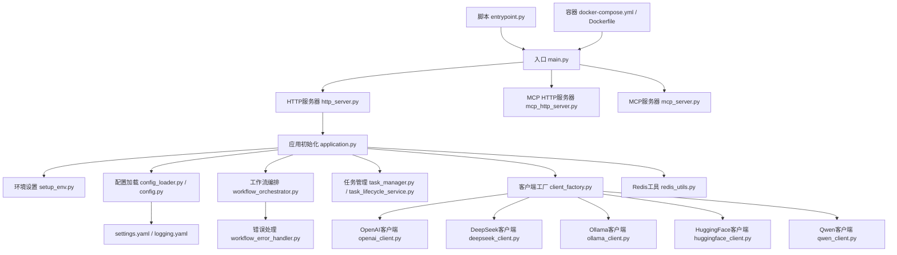
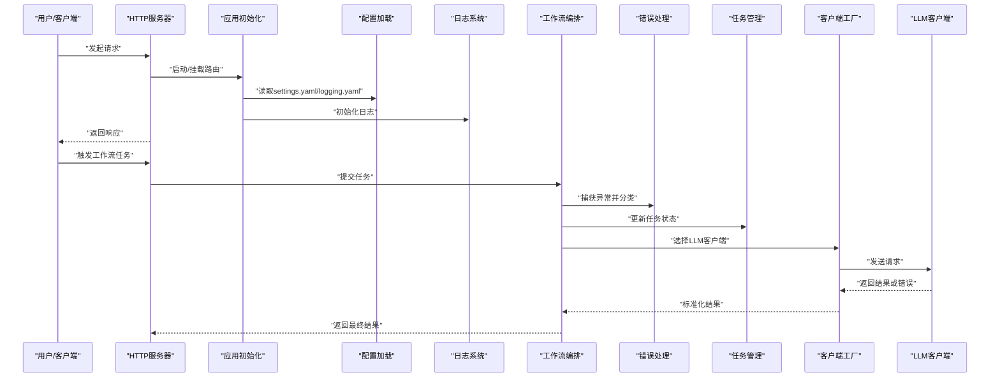
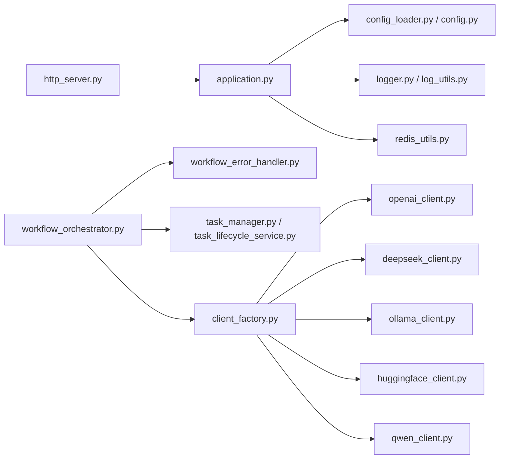
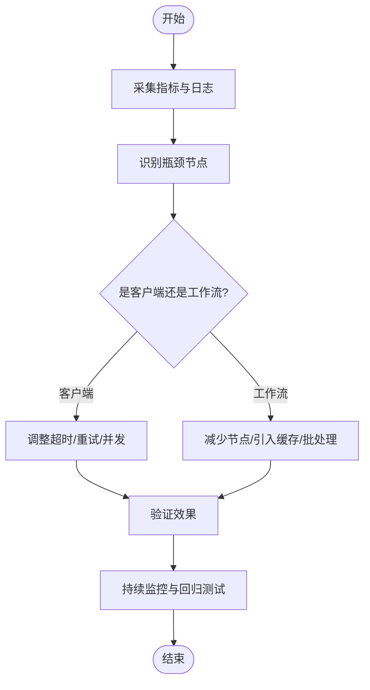

# 故障排除

<cite>
**本文引用的文件**   
- [main.py](file://main.py)
- [http_server.py](file://src/penshot/http_server.py)
- [mcp_http_server.py](file://src/penshot/mcp_http_server.py)
- [mcp_server.py](file://src/penshot/mcp_server.py)
- [application.py](file://src/penshot/app/application.py)
- [setup_env.py](file://src/penshot/app/setup_env.py)
- [config.py](file://src/penshot/config/config.py)
- [config_loader.py](file://src/penshot/config/config_loader.py)
- [settings.yaml](file://src/penshot/config/settings.yaml)
- [logging.yaml](file://src/penshot/config/logging.yaml)
- [logger.py](file://src/penshot/logger.py)
- [log_utils.py](file://src/penshot/utils/log_utils.py)
- [workflow_error_handler.py](file://src/penshot/neopen/agent/workflow/workflow_error_handler.py)
- [workflow_orchestrator.py](file://src/penshot/neopen/agent/workflow/workflow_orchestrator.py)
- [task_manager.py](file://src/penshot/neopen/task/task_manager.py)
- [task_lifecycle_service.py](file://src/penshot/neopen/task/task_lifecycle_service.py)
- [client_factory.py](file://src/penshot/neopen/client/client_factory.py)
- [base_client.py](file://src/penshot/neopen/client/base_client.py)
- [openai_client.py](file://src/penshot/neopen/client/openai_client.py)
- [deepseek_client.py](file://src/penshot/neopen/client/deepseek_client.py)
- [ollama_client.py](file://src/penshot/neopen/client/ollama_client.py)
- [huggingface_client.py](file://src/penshot/neopen/client/huggingface_client.py)
- [qwen_client.py](file://src/penshot/neopen/client/qwen_client.py)
- [redis_utils.py](file://src/penshot/utils/redis_utils.py)
- [entrypoint.py](file://scripts/entrypoint.py)
- [docker-compose.yml](file://docker-compose.yml)
- [Dockerfile](file://Dockerfile)
- [pyproject.toml](file://pyproject.toml)
- [README_zh.md](file://README_zh.md)
</cite>

## 目录
1. [简介](#简介)
2. [项目结构](#项目结构)
3. [核心组件](#核心组件)
4. [架构总览](#架构总览)
5. [详细组件分析](#详细组件分析)
6. [依赖关系分析](#依赖关系分析)
7. [性能考虑](#性能考虑)
8. [故障排除指南](#故障排除指南)
9. [结论](#结论)
10. [附录](#附录)

## 简介
本指南面向Video Shot Agent的运维与开发者，聚焦安装部署、配置错误、运行时异常、日志分析与调试技巧、性能瓶颈识别与优化、监控告警与健康检查、诊断工具使用以及社区支持渠道。文档以仓库实际实现为依据，提供可操作的排障步骤与定位方法。

## 项目结构
本项目采用分层模块化组织：应用入口与HTTP/MCP服务位于顶层与src/penshot；配置与日志在src/penshot/config；Agent工作流与任务编排位于neopen子模块；客户端适配（LLM）位于client；工具与通用能力位于utils；脚本与容器化配置位于scripts与根目录。

图表来源
- [main.py:1-200](file://main.py#L1-L200)
- [http_server.py:1-200](file://src/penshot/http_server.py#L1-L200)
- [mcp_http_server.py:1-200](file://src/penshot/mcp_http_server.py#L1-L200)
- [mcp_server.py:1-200](file://src/penshot/mcp_server.py#L1-L200)
- [application.py:1-200](file://src/penshot/app/application.py#L1-L200)
- [setup_env.py:1-200](file://src/penshot/app/setup_env.py#L1-L200)
- [config.py:1-200](file://src/penshot/config/config.py#L1-L200)
- [config_loader.py:1-200](file://src/penshot/config/config_loader.py#L1-L200)
- [settings.yaml:1-200](file://src/penshot/config/settings.yaml#L1-L200)
- [logging.yaml:1-200](file://src/penshot/config/logging.yaml#L1-L200)
- [workflow_orchestrator.py:1-200](file://src/penshot/neopen/agent/workflow/workflow_orchestrator.py#L1-L200)
- [workflow_error_handler.py:1-200](file://src/penshot/neopen/agent/workflow/workflow_error_handler.py#L1-L200)
- [task_manager.py:1-200](file://src/penshot/neopen/task/task_manager.py#L1-L200)
- [task_lifecycle_service.py:1-200](file://src/penshot/neopen/task/task_lifecycle_service.py#L1-L200)
- [client_factory.py:1-200](file://src/penshot/neopen/client/client_factory.py#L1-L200)
- [openai_client.py:1-200](file://src/penshot/neopen/client/openai_client.py#L1-L200)
- [deepseek_client.py:1-200](file://src/penshot/neopen/client/deepseek_client.py#L1-L200)
- [ollama_client.py:1-200](file://src/penshot/neopen/client/ollama_client.py#L1-L200)
- [huggingface_client.py:1-200](file://src/penshot/neopen/client/huggingface_client.py#L1-L200)
- [qwen_client.py:1-200](file://src/penshot/neopen/client/qwen_client.py#L1-L200)
- [redis_utils.py:1-200](file://src/penshot/utils/redis_utils.py#L1-L200)
- [entrypoint.py:1-200](file://scripts/entrypoint.py#L1-L200)
- [docker-compose.yml:1-200](file://docker-compose.yml#L1-L200)
- [Dockerfile:1-200](file://Dockerfile#L1-L200)

章节来源
- [main.py:1-200](file://main.py#L1-L200)
- [http_server.py:1-200](file://src/penshot/http_server.py#L1-L200)
- [mcp_http_server.py:1-200](file://src/penshot/mcp_http_server.py#L1-L200)
- [mcp_server.py:1-200](file://src/penshot/mcp_server.py#L1-L200)
- [application.py:1-200](file://src/penshot/app/application.py#L1-L200)
- [setup_env.py:1-200](file://src/penshot/app/setup_env.py#L1-L200)
- [config.py:1-200](file://src/penshot/config/config.py#L1-L200)
- [config_loader.py:1-200](file://src/penshot/config/config_loader.py#L1-L200)
- [settings.yaml:1-200](file://src/penshot/config/settings.yaml#L1-L200)
- [logging.yaml:1-200](file://src/penshot/config/logging.yaml#L1-L200)
- [workflow_orchestrator.py:1-200](file://src/penshot/neopen/agent/workflow/workflow_orchestrator.py#L1-L200)
- [workflow_error_handler.py:1-200](file://src/penshot/neopen/agent/workflow/workflow_error_handler.py#L1-L200)
- [task_manager.py:1-200](file://src/penshot/neopen/task/task_manager.py#L1-L200)
- [task_lifecycle_service.py:1-200](file://src/penshot/neopen/task/task_lifecycle_service.py#L1-L200)
- [client_factory.py:1-200](file://src/penshot/neopen/client/client_factory.py#L1-L200)
- [openai_client.py:1-200](file://src/penshot/neopen/client/openai_client.py#L1-L200)
- [deepseek_client.py:1-200](file://src/penshot/neopen/client/deepseek_client.py#L1-L200)
- [ollama_client.py:1-200](file://src/penshot/neopen/client/ollama_client.py#L1-L200)
- [huggingface_client.py:1-200](file://src/penshot/neopen/client/huggingface_client.py#L1-L200)
- [qwen_client.py:1-200](file://src/penshot/neopen/client/qwen_client.py#L1-L200)
- [redis_utils.py:1-200](file://src/penshot/utils/redis_utils.py#L1-L200)
- [entrypoint.py:1-200](file://scripts/entrypoint.py#L1-L200)
- [docker-compose.yml:1-200](file://docker-compose.yml#L1-L200)
- [Dockerfile:1-200](file://Dockerfile#L1-L200)

## 核心组件
- 应用启动与生命周期
  - 入口main负责创建并运行HTTP/MCP服务；应用初始化application负责加载配置、初始化日志、注册路由与中间件、准备缓存与外部依赖。
  - 环境设置setup_env用于注入环境变量与基础校验。
- 配置与日志
  - 配置通过config_loader与config解析settings.yaml与logging.yaml，支持多环境与键值覆盖。
  - 日志由logger与log_utils统一输出，便于集中采集与分析。
- 工作流与任务
  - 工作流编排orchestrator驱动节点执行，error_handler捕获并分类异常，task_manager与task_lifecycle_service负责任务调度与状态流转。
- 客户端适配
  - client_factory根据配置选择具体LLM客户端（OpenAI、DeepSeek、Ollama、HuggingFace、Qwen），各客户端封装网络请求、重试与错误映射。
- 缓存与存储
  - Redis工具redis_utils提供连接与常用操作封装，供缓存与会话使用。
- 脚本与容器
  - scripts/entrypoint.py作为容器入口；docker-compose.yml与Dockerfile定义镜像与服务编排。

章节来源
- [main.py:1-200](file://main.py#L1-L200)
- [application.py:1-200](file://src/penshot/app/application.py#L1-L200)
- [setup_env.py:1-200](file://src/penshot/app/setup_env.py#L1-L200)
- [config.py:1-200](file://src/penshot/config/config.py#L1-L200)
- [config_loader.py:1-200](file://src/penshot/config/config_loader.py#L1-L200)
- [settings.yaml:1-200](file://src/penshot/config/settings.yaml#L1-L200)
- [logging.yaml:1-200](file://src/penshot/config/logging.yaml#L1-L200)
- [logger.py:1-200](file://src/penshot/logger.py#L1-L200)
- [log_utils.py:1-200](file://src/penshot/utils/log_utils.py#L1-L200)
- [workflow_orchestrator.py:1-200](file://src/penshot/neopen/agent/workflow/workflow_orchestrator.py#L1-L200)
- [workflow_error_handler.py:1-200](file://src/penshot/neopen/agent/workflow/workflow_error_handler.py#L1-L200)
- [task_manager.py:1-200](file://src/penshot/neopen/task/task_manager.py#L1-L200)
- [task_lifecycle_service.py:1-200](file://src/penshot/neopen/task/task_lifecycle_service.py#L1-L200)
- [client_factory.py:1-200](file://src/penshot/neopen/client/client_factory.py#L1-L200)
- [openai_client.py:1-200](file://src/penshot/neopen/client/openai_client.py#L1-L200)
- [deepseek_client.py:1-200](file://src/penshot/neopen/client/deepseek_client.py#L1-L200)
- [ollama_client.py:1-200](file://src/penshot/neopen/client/ollama_client.py#L1-L200)
- [huggingface_client.py:1-200](file://src/penshot/neopen/client/huggingface_client.py#L1-L200)
- [qwen_client.py:1-200](file://src/penshot/neopen/client/qwen_client.py#L1-L200)
- [redis_utils.py:1-200](file://src/penshot/utils/redis_utils.py#L1-L200)
- [entrypoint.py:1-200](file://scripts/entrypoint.py#L1-L200)
- [docker-compose.yml:1-200](file://docker-compose.yml#L1-L200)
- [Dockerfile:1-200](file://Dockerfile#L1-L200)

## 架构总览
系统对外暴露HTTP与MCP接口，内部通过应用层装配配置、日志、缓存与工作流，调用不同LLM客户端完成视频分镜相关任务。

图表来源
- [http_server.py:1-200](file://src/penshot/http_server.py#L1-L200)
- [application.py:1-200](file://src/penshot/app/application.py#L1-L200)
- [config_loader.py:1-200](file://src/penshot/config/config_loader.py#L1-L200)
- [config.py:1-200](file://src/penshot/config/config.py#L1-L200)
- [logging.yaml:1-200](file://src/penshot/config/logging.yaml#L1-L200)
- [logger.py:1-200](file://src/penshot/logger.py#L1-L200)
- [workflow_orchestrator.py:1-200](file://src/penshot/neopen/agent/workflow/workflow_orchestrator.py#L1-L200)
- [workflow_error_handler.py:1-200](file://src/penshot/neopen/agent/workflow/workflow_error_handler.py#L1-L200)
- [task_manager.py:1-200](file://src/penshot/neopen/task/task_manager.py#L1-L200)
- [client_factory.py:1-200](file://src/penshot/neopen/client/client_factory.py#L1-L200)
- [openai_client.py:1-200](file://src/penshot/neopen/client/openai_client.py#L1-L200)
- [deepseek_client.py:1-200](file://src/penshot/neopen/client/deepseek_client.py#L1-L200)
- [ollama_client.py:1-200](file://src/penshot/neopen/client/ollama_client.py#L1-L200)
- [huggingface_client.py:1-200](file://src/penshot/neopen/client/huggingface_client.py#L1-L200)
- [qwen_client.py:1-200](file://src/penshot/neopen/client/qwen_client.py#L1-L200)

## 详细组件分析

### 安装与环境问题
- Python版本与依赖
  - 确认pyproject.toml中定义的Python版本与依赖满足要求；若本地环境不匹配，优先使用虚拟环境或容器。
- 容器化部署
  - 使用Dockerfile构建镜像，docker-compose.yml编排服务；确保端口映射、环境变量与数据卷挂载正确。
- 常见症状
  - 启动失败：检查入口脚本与依赖安装；查看容器日志与标准输出。
  - 端口冲突：修改docker-compose.yml中的端口映射。
  - 权限问题：确认数据目录读写权限。

章节来源
- [pyproject.toml:1-200](file://pyproject.toml#L1-L200)
- [Dockerfile:1-200](file://Dockerfile#L1-L200)
- [docker-compose.yml:1-200](file://docker-compose.yml#L1-L200)
- [entrypoint.py:1-200](file://scripts/entrypoint.py#L1-L200)

### 配置错误排查
- 配置文件位置与优先级
  - settings.yaml为默认配置，可通过环境变量或命令行参数覆盖；logging.yaml控制日志级别与输出目标。
- 关键配置项
  - LLM客户端：provider、model、api_key、base_url、timeout、max_retries等。
  - 缓存与存储：Redis地址、密码、数据库索引。
  - 日志：level、handlers、format。
- 验证方法
  - 启动时打印配置摘要；对缺失或非法字段进行快速校验。
- 常见问题
  - API密钥未设置或格式错误导致认证失败。
  - base_url不正确导致连接超时。
  - Redis连接失败导致缓存不可用。

章节来源
- [config_loader.py:1-200](file://src/penshot/config/config_loader.py#L1-L200)
- [config.py:1-200](file://src/penshot/config/config.py#L1-L200)
- [settings.yaml:1-200](file://src/penshot/config/settings.yaml#L1-L200)
- [logging.yaml:1-200](file://src/penshot/config/logging.yaml#L1-L200)
- [redis_utils.py:1-200](file://src/penshot/utils/redis_utils.py#L1-L200)

### 运行时异常与错误处理
- 工作流异常
  - orchestrator在执行节点时抛出异常，error_handler进行分类与降级策略（重试、回退、记录上下文）。
- 任务生命周期
  - task_manager与task_lifecycle_service维护任务状态机，异常会触发状态迁移与持久化。
- 客户端异常
  - 各LLM客户端将底层网络/协议错误映射为统一异常类型，包含错误码、消息与重试建议。
- 定位步骤
  - 从日志中提取trace_id与错误堆栈；核对配置与网络连通性；复现最小用例。

章节来源
- [workflow_orchestrator.py:1-200](file://src/penshot/neopen/agent/workflow/workflow_orchestrator.py#L1-L200)
- [workflow_error_handler.py:1-200](file://src/penshot/neopen/agent/workflow/workflow_error_handler.py#L1-L200)
- [task_manager.py:1-200](file://src/penshot/neopen/task/task_manager.py#L1-L200)
- [task_lifecycle_service.py:1-200](file://src/penshot/neopen/task/task_lifecycle_service.py#L1-L200)
- [base_client.py:1-200](file://src/penshot/neopen/client/base_client.py#L1-L200)
- [openai_client.py:1-200](file://src/penshot/neopen/client/openai_client.py#L1-L200)
- [deepseek_client.py:1-200](file://src/penshot/neopen/client/deepseek_client.py#L1-L200)
- [ollama_client.py:1-200](file://src/penshot/neopen/client/ollama_client.py#L1-L200)
- [huggingface_client.py:1-200](file://src/penshot/neopen/client/huggingface_client.py#L1-L200)
- [qwen_client.py:1-200](file://src/penshot/neopen/client/qwen_client.py#L1-L200)

### 日志分析与调试技巧
- 日志配置
  - 调整logging.yaml的level与handlers，启用结构化输出与文件轮转。
- 关键日志点
  - 启动阶段：配置加载、依赖初始化、路由注册。
  - 请求阶段：入参、出参、耗时、错误码。
  - 工作流阶段：节点开始/结束、异常、重试次数。
  - 客户端阶段：请求URL、状态码、错误信息。
- 调试技巧
  - 使用trace_id关联一次请求的全链路日志。
  - 开启DEBUG级别仅用于本地或测试环境。
  - 针对特定模块过滤日志，缩小范围。

章节来源
- [logging.yaml:1-200](file://src/penshot/config/logging.yaml#L1-L200)
- [logger.py:1-200](file://src/penshot/logger.py#L1-L200)
- [log_utils.py:1-200](file://src/penshot/utils/log_utils.py#L1-L200)
- [application.py:1-200](file://src/penshot/app/application.py#L1-L200)

### 性能瓶颈识别与优化
- 指标观测
  - 请求延迟分布、P95/P99、吞吐、错误率、重试率、队列积压。
- 常见瓶颈
  - LLM服务端限流或高延迟；网络抖动；缓存命中率低；I/O阻塞。
- 优化策略
  - 合理设置timeout与max_retries；启用缓存与批量请求；调整并发度与线程池大小；对热点数据进行预取。
- 定位方法
  - 在工作流节点埋点耗时；对比不同provider的性能差异；观察Redis命中率与连接数。

章节来源
- [workflow_orchestrator.py:1-200](file://src/penshot/neopen/agent/workflow/workflow_orchestrator.py#L1-L200)
- [client_factory.py:1-200](file://src/penshot/neopen/client/client_factory.py#L1-L200)
- [redis_utils.py:1-200](file://src/penshot/utils/redis_utils.py#L1-L200)

### 监控与告警配置
- 指标采集
  - 在服务启动后暴露健康检查端点；收集CPU、内存、GC、请求计数与错误率。
- 告警规则
  - 错误率阈值、延迟阈值、重试失败比例、Redis连接异常。
- 集成建议
  - 将日志与指标推送到统一平台；基于trace_id做跨服务追踪。

章节来源
- [http_server.py:1-200](file://src/penshot/http_server.py#L1-L200)
- [application.py:1-200](file://src/penshot/app/application.py#L1-L200)
- [logger.py:1-200](file://src/penshot/logger.py#L1-L200)

### 系统健康检查与诊断工具
- 健康检查
  - 提供健康检查接口，返回服务状态、依赖可用性（如Redis、LLM可达性）。
- 诊断工具
  - 使用内置脚本或CLI进行配置校验、依赖探测、简单请求压测。
- 容器诊断
  - 查看容器日志、资源使用、网络连通性；必要时进入容器执行命令。

章节来源
- [http_server.py:1-200](file://src/penshot/http_server.py#L1-L200)
- [entrypoint.py:1-200](file://scripts/entrypoint.py#L1-L200)
- [docker-compose.yml:1-200](file://docker-compose.yml#L1-L200)

### 社区支持与问题反馈
- 参考仓库说明文档获取贡献流程与支持渠道。
- 提交Issue时附上：环境信息、配置摘要、日志片段、复现步骤与期望行为。

章节来源
- [README_zh.md:1-200](file://README_zh.md#L1-L200)

## 依赖关系分析
- 组件耦合
  - application依赖config与logger；http_server依赖application；workflows依赖task与clients；clients通过factory选择实现。
- 外部依赖
  - LLM提供商API、Redis、文件系统与网络。
- 潜在循环依赖
  - 避免在client与workflow之间直接双向引用，通过接口与工厂解耦。

图表来源
- [application.py:1-200](file://src/penshot/app/application.py#L1-L200)
- [config_loader.py:1-200](file://src/penshot/config/config_loader.py#L1-L200)
- [config.py:1-200](file://src/penshot/config/config.py#L1-L200)
- [logger.py:1-200](file://src/penshot/logger.py#L1-L200)
- [log_utils.py:1-200](file://src/penshot/utils/log_utils.py#L1-L200)
- [http_server.py:1-200](file://src/penshot/http_server.py#L1-L200)
- [workflow_orchestrator.py:1-200](file://src/penshot/neopen/agent/workflow/workflow_orchestrator.py#L1-L200)
- [workflow_error_handler.py:1-200](file://src/penshot/neopen/agent/workflow/workflow_error_handler.py#L1-L200)
- [task_manager.py:1-200](file://src/penshot/neopen/task/task_manager.py#L1-L200)
- [task_lifecycle_service.py:1-200](file://src/penshot/neopen/task/task_lifecycle_service.py#L1-L200)
- [client_factory.py:1-200](file://src/penshot/neopen/client/client_factory.py#L1-L200)
- [openai_client.py:1-200](file://src/penshot/neopen/client/openai_client.py#L1-L200)
- [deepseek_client.py:1-200](file://src/penshot/neopen/client/deepseek_client.py#L1-L200)
- [ollama_client.py:1-200](file://src/penshot/neopen/client/ollama_client.py#L1-L200)
- [huggingface_client.py:1-200](file://src/penshot/neopen/client/huggingface_client.py#L1-L200)
- [qwen_client.py:1-200](file://src/penshot/neopen/client/qwen_client.py#L1-L200)
- [redis_utils.py:1-200](file://src/penshot/utils/redis_utils.py#L1-L200)

## 性能考虑
- 客户端侧
  - 合理设置并发与超时；启用指数退避重试；限制最大重试次数。
- 工作流侧
  - 减少不必要的节点；合并小任务；引入缓存与去重。
- 存储侧
  - Redis连接池与过期策略；大对象拆分与压缩。
- 观测与调优
  - 基于日志与指标持续迭代；A/B对比不同provider与模型。

[本节为通用指导，无需列出具体文件来源]

## 故障排除指南

### 安装与启动问题
- 症状
  - 启动报错、依赖缺失、端口占用、容器无法拉取镜像。
- 排查步骤
  - 检查Python版本与依赖；确认端口未被占用；查看容器日志；验证网络与代理设置。
- 解决建议
  - 使用虚拟环境或容器；更换端口；修复镜像源与网络。

章节来源
- [pyproject.toml:1-200](file://pyproject.toml#L1-L200)
- [Dockerfile:1-200](file://Dockerfile#L1-L200)
- [docker-compose.yml:1-200](file://docker-compose.yml#L1-L200)
- [entrypoint.py:1-200](file://scripts/entrypoint.py#L1-L200)

### 配置错误
- 症状
  - 认证失败、连接超时、配置键不存在。
- 排查步骤
  - 核对settings.yaml与env变量；验证API密钥与base_url；检查Redis地址与密码。
- 解决建议
  - 修正配置项；重启服务；使用配置校验脚本。

章节来源
- [config_loader.py:1-200](file://src/penshot/config/config_loader.py#L1-L200)
- [config.py:1-200](file://src/penshot/config/config.py#L1-L200)
- [settings.yaml:1-200](file://src/penshot/config/settings.yaml#L1-L200)
- [redis_utils.py:1-200](file://src/penshot/utils/redis_utils.py#L1-L200)

### 运行时异常
- 症状
  - 工作流节点失败、任务卡住、客户端返回错误码。
- 排查步骤
  - 提取trace_id与错误堆栈；检查网络与限流；查看重试与回退策略是否生效。
- 解决建议
  - 调整重试参数；增加超时；切换provider或模型；补充缓存。

章节来源
- [workflow_orchestrator.py:1-200](file://src/penshot/neopen/agent/workflow/workflow_orchestrator.py#L1-L200)
- [workflow_error_handler.py:1-200](file://src/penshot/neopen/agent/workflow/workflow_error_handler.py#L1-L200)
- [task_manager.py:1-200](file://src/penshot/neopen/task/task_manager.py#L1-L200)
- [task_lifecycle_service.py:1-200](file://src/penshot/neopen/task/task_lifecycle_service.py#L1-L200)
- [base_client.py:1-200](file://src/penshot/neopen/client/base_client.py#L1-L200)
- [openai_client.py:1-200](file://src/penshot/neopen/client/openai_client.py#L1-L200)
- [deepseek_client.py:1-200](file://src/penshot/neopen/client/deepseek_client.py#L1-L200)
- [ollama_client.py:1-200](file://src/penshot/neopen/client/ollama_client.py#L1-L200)
- [huggingface_client.py:1-200](file://src/penshot/neopen/client/huggingface_client.py#L1-L200)
- [qwen_client.py:1-200](file://src/penshot/neopen/client/qwen_client.py#L1-L200)

### 日志分析方法
- 步骤
  - 定位时间窗口；按trace_id聚合；关注ERROR/WARN级别；对比前后变更。
- 技巧
  - 使用结构化日志字段；导出到分析平台；建立基线与阈值。

章节来源
- [logging.yaml:1-200](file://src/penshot/config/logging.yaml#L1-L200)
- [logger.py:1-200](file://src/penshot/logger.py#L1-L200)
- [log_utils.py:1-200](file://src/penshot/utils/log_utils.py#L1-L200)

### 性能优化流程

[此图为概念流程，无需图表来源]

### 监控与告警配置
- 健康检查
  - 提供健康检查端点，返回服务与依赖状态。
- 告警规则
  - 错误率、延迟、重试失败、Redis异常。
- 集成
  - 推送日志与指标到统一平台；基于trace_id追踪。

章节来源
- [http_server.py:1-200](file://src/penshot/http_server.py#L1-L200)
- [application.py:1-200](file://src/penshot/app/application.py#L1-L200)
- [logger.py:1-200](file://src/penshot/logger.py#L1-L200)

### 健康检查与诊断工具
- 健康检查
  - 访问健康检查接口，确认服务可用与依赖正常。
- 诊断工具
  - 使用脚本进行配置校验、依赖探测与简单压测。
- 容器诊断
  - 查看日志、资源使用、网络连通性。

章节来源
- [http_server.py:1-200](file://src/penshot/http_server.py#L1-L200)
- [entrypoint.py:1-200](file://scripts/entrypoint.py#L1-L200)
- [docker-compose.yml:1-200](file://docker-compose.yml#L1-L200)

### 社区支持与问题反馈
- 参考仓库说明文档获取贡献流程与支持渠道。
- 提交Issue时附上：环境信息、配置摘要、日志片段、复现步骤与期望行为。

章节来源
- [README_zh.md:1-200](file://README_zh.md#L1-L200)

## 结论
通过系统化地定位配置、日志、工作流与客户端层面的问题，结合监控与诊断工具，能够快速恢复服务并持续优化性能。建议在生产环境完善健康检查与告警，建立基线指标与回归测试，保障稳定性与可观测性。

## 附录
- 快速清单
  - 启动前：检查Python版本、依赖、端口、镜像。
  - 启动后：验证健康检查、查看日志、确认依赖连通。
  - 运行中：监控指标、设置告警、定期复盘。
- 参考路径
  - 配置与日志：src/penshot/config
  - 应用与服务：src/penshot/app, src/penshot/http_server.py, src/penshot/mcp_*.py
  - 工作流与任务：src/penshot/neopen/agent/workflow, src/penshot/neopen/task
  - 客户端适配：src/penshot/neopen/client
  - 工具与脚本：src/penshot/utils, scripts

[本节为概览性内容，无需列出具体文件来源]