# Agent框架设计

<cite>
**本文引用的文件**   
- [base_agent.py](file://src/penshot/neopen/agent/base_agent.py)
- [base_llm_agent.py](file://src/penshot/neopen/agent/base_llm_agent.py)
- [base_repairable_agent.py](file://src/penshot/neopen/agent/base_repairable_agent.py)
- [prompt_converter_agent.py](file://src/penshot/neopen/agent/prompt_converter_agent.py)
- [quality_auditor_agent.py](file://src/penshot/neopen/agent/quality_auditor_agent.py)
- [script_parser_agent.py](file://src/penshot/neopen/agent/script_parser_agent.py)
- [shot_segmenter_agent.py](file://src/penshot/neopen/agent/shot_segmenter_agent.py)
- [video_splitter_agent.py](file://src/penshot/neopen/agent/video_splitter_agent.py)
- [workflow_orchestrator.py](file://src/penshot/neopen/agent/workflow/workflow_orchestrator.py)
- [workflow_pipeline.py](file://src/penshot/neopen/agent/workflow/workflow_pipeline.py)
- [workflow_state_types.py](file://src/penshot/neopen/agent/workflow/workflow_state_types.py)
- [workflow_error_handler.py](file://src/penshot/neopen/agent/workflow/workflow_error_handler.py)
- [workflow_output_fixer.py](file://src/penshot/neopen/agent/workflow/workflow_output_fixer.py)
- [workflow_memory.py](file://src/penshot/neopen/agent/workflow/workflow_memory.py)
- [workflow_logger.py](file://src/penshot/neopen/agent/workflow/workflow_logger.py)
- [workflow_checkpointer.py](file://src/penshot/neopen/agent/workflow/workflow_checkpointer.py)
- [workflow_models.py](file://src/penshot/neopen/agent/workflow/workflow_models.py)
- [workflow_nodes.py](file://src/penshot/neopen/agent/workflow/workflow_nodes.py)
- [workflow_decision.py](file://src/penshot/neopen/agent/workflow/workflow_decision.py)
- [workflow_output.py](file://src/penshot/neopen/agent/workflow/workflow_output.py)
- [llm_prompt_converter.py](file://src/penshot/neopen/agent/prompt_converter/llm_prompt_converter.py)
- [template_prompt_converter.py](file://src/penshot/neopen/agent/prompt_converter/template_prompt_converter.py)
- [prompt_converter_factory.py](file://src/penshot/neopen/agent/prompt_converter/prompt_converter_factory.py)
- [base_prompt_converter.py](file://src/penshot/neopen/agent/prompt_converter/base_prompt_converter.py)
- [prompt_template_manager.py](file://src/penshot/neopen/prompts/prompt_template_manager.py)
- [prompt_load_manager.py](file://src/penshot/neopen/prompts/prompt_load_manager.py)
- [client_factory.py](file://src/penshot/neopen/client/client_factory.py)
- [base_client.py](file://src/penshot/neopen/client/base_client.py)
- [deepseek_client.py](file://src/penshot/neopen/client/deepseek_client.py)
- [openai_client.py](file://src/penshot/neopen/client/openai_client.py)
- [ollama_client.py](file://src/penshot/neopen/client/ollama_client.py)
- [qwen_client.py](file://src/penshot/neopen/client/qwen_client.py)
- [huggingface_client.py](file://src/penshot/neopen/client/huggingface_client.py)
- [json_parser_tool.py](file://src/penshot/neopen/tools/json_parser_tool.py)
- [result_storage_tool.py](file://src/penshot/neopen/tools/result_storage_tool.py)
- [script_assessor_tool.py](file://src/penshot/neopen/tools/script_assessor_tool.py)
- [action_duration_tool.py](file://src/penshot/neopen/tools/action_duration_tool.py)
- [langchain_memory_tool.py](file://src/penshot/neopen/tools/langchain_memory_tool.py)
- [continuity_guardian_checker.py](file://src/penshot/neopen/agent/continuity_guardian/continuity_guardian_checker.py)
- [continuity_repair_generator.py](file://src/penshot/neopen/agent/continuity_guardian/continuity_repair_generator.py)
- [cross_chunk_validator.py](file://src/penshot/neopen/agent/continuity_guardian/cross_chunk_validator.py)
- [long_script_chunker.py](file://src/penshot/neopen/agent/continuity_guardian/long_script_chunker.py)
- [prompt_style_guardian.py](file://src/penshot/neopen/agent/continuity_guardian/prompt_style_guardian.py)
- [human_decision_intervention.py](file://src/penshot/neopen/agent/human_decision/human_decision_intervention.py)
- [human_enhanced_converter.py](file://src/penshot/neopen/agent/human_decision/human_enhanced_converter.py)
- [task_lifecycle_service.py](file://src/penshot/neopen/task/task_lifecycle_service.py)
- [task_manager.py](file://src/penshot/neopen/task/task_manager.py)
- [task_processor.py](file://src/penshot/neopen/task/task_processor.py)
- [task_repository.py](file://src/penshot/neopen/task/task_repository.py)
- [task_factory.py](file://src/penshot/neopen/task/task_factory.py)
- [task_workflow_registry.py](file://src/penshot/neopen/task/workflow_registry.py)
</cite>

## 目录
1. [简介](#简介)
2. [项目结构](#项目结构)
3. [核心组件](#核心组件)
4. [架构总览](#架构总览)
5. [详细组件分析](#详细组件分析)
6. [依赖关系分析](#依赖关系分析)
7. [性能考量](#性能考量)
8. [故障排查指南](#故障排查指南)
9. [结论](#结论)
10. [附录：Agent开发指南与最佳实践](#附录agent开发指南与最佳实践)

## 简介
本文件面向Agent框架的设计与实现，围绕以下目标展开：
- 深入解释BaseAgent抽象类的设计模式与接口定义，包括生命周期管理、工具注册机制、消息传递协议。
- 详细说明LLM Agent的实现原理，涵盖提示词模板管理、上下文构建、响应解析与错误恢复。
- 阐述可修复Agent的设计理念，包括质量检查、自动修复策略与人工干预点。
- 提供完整的Agent开发指南，包括如何继承基类、实现必要方法、注册自定义工具，并给出代码示例路径与最佳实践建议。

## 项目结构
本项目采用分层与领域驱动相结合的组织方式：
- 抽象层：BaseAgent、BaseLLMAgent、BaseRepairableAgent等定义了通用能力与扩展点。
- 领域Agent：PromptConverterAgent、QualityAuditorAgent、ScriptParserAgent、ShotSegmenterAgent、VideoSplitterAgent等实现具体业务。
- LLM客户端：OpenAI、DeepSeek、Ollama、Qwen、HuggingFace等多厂商统一封装。
- 工作流编排：WorkflowOrchestrator、Pipeline、State、ErrorHandling、Checkpointer、Memory、Logger等。
- 工具生态：JSON解析、结果存储、脚本评估、动作时长估算、LangChain记忆等。
- 提示词工程：模板管理与加载器，支持多版本与多语言。
- 任务系统：Task生命周期、仓库、工厂、处理器与工作流注册表。

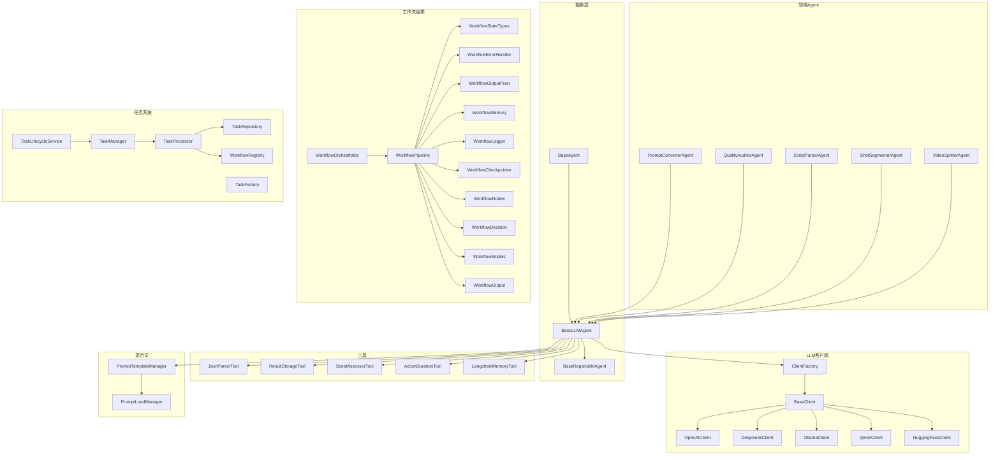

图表来源
- [base_agent.py:1-200](file://src/penshot/neopen/agent/base_agent.py#L1-L200)
- [base_llm_agent.py:1-200](file://src/penshot/neopen/agent/base_llm_agent.py#L1-L200)
- [base_repairable_agent.py:1-200](file://src/penshot/neopen/agent/base_repairable_agent.py#L1-L200)
- [workflow_orchestrator.py:1-200](file://src/penshot/neopen/agent/workflow/workflow_orchestrator.py#L1-L200)
- [workflow_pipeline.py:1-200](file://src/penshot/neopen/agent/workflow/workflow_pipeline.py#L1-L200)
- [client_factory.py:1-200](file://src/penshot/neopen/client/client_factory.py#L1-L200)
- [base_client.py:1-200](file://src/penshot/neopen/client/base_client.py#L1-L200)
- [prompt_template_manager.py:1-200](file://src/penshot/neopen/prompts/prompt_template_manager.py#L1-L200)
- [prompt_load_manager.py:1-200](file://src/penshot/neopen/prompts/prompt_load_manager.py#L1-L200)
- [json_parser_tool.py:1-200](file://src/penshot/neopen/tools/json_parser_tool.py#L1-L200)
- [result_storage_tool.py:1-200](file://src/penshot/neopen/tools/result_storage_tool.py#L1-L200)
- [script_assessor_tool.py:1-200](file://src/penshot/neopen/tools/script_assessor_tool.py#L1-L200)
- [action_duration_tool.py:1-200](file://src/penshot/neopen/tools/action_duration_tool.py#L1-L200)
- [langchain_memory_tool.py:1-200](file://src/penshot/neopen/tools/langchain_memory_tool.py#L1-L200)

章节来源
- [base_agent.py:1-200](file://src/penshot/neopen/agent/base_agent.py#L1-L200)
- [base_llm_agent.py:1-200](file://src/penshot/neopen/agent/base_llm_agent.py#L1-L200)
- [workflow_orchestrator.py:1-200](file://src/penshot/neopen/agent/workflow/workflow_orchestrator.py#L1-L200)
- [client_factory.py:1-200](file://src/penshot/neopen/client/client_factory.py#L1-L200)
- [prompt_template_manager.py:1-200](file://src/penshot/neopen/prompts/prompt_template_manager.py#L1-L200)

## 核心组件
本节聚焦于Agent抽象层与关键扩展点，说明其职责边界与协作方式。

- BaseAgent抽象类
  - 职责：定义Agent通用生命周期（初始化、运行、清理）、工具注册与调用、消息协议（输入/输出/状态）、日志与追踪、异常处理钩子。
  - 关键点：统一的run入口；工具注册表；消息序列化/反序列化的契约；可扩展的错误处理与重试策略。
- BaseLLMAgent
  - 职责：在BaseAgent基础上增加LLM交互能力，包括提示词模板加载、上下文构建、模型调用、响应解析、结构化输出校验、错误恢复与降级。
  - 关键点：与PromptTemplateManager集成；与ClientFactory及BaseClient对接；支持多后端切换；内置JSON/结构化解析与容错。
- BaseRepairableAgent
  - 职责：在LLM Agent之上引入“可修复”能力，包括质量检查、自动修复策略、人工干预点、修复记录与审计。
  - 关键点：质量检查器接入；修复生成器；人工决策桥接；修复后重跑与一致性校验。

章节来源
- [base_agent.py:1-200](file://src/penshot/neopen/agent/base_agent.py#L1-L200)
- [base_llm_agent.py:1-200](file://src/penshot/neopen/agent/base_llm_agent.py#L1-L200)
- [base_repairable_agent.py:1-200](file://src/penshot/neopen/agent/base_repairable_agent.py#L1-L200)

## 架构总览
整体架构以“抽象Agent + 领域Agent + LLM客户端 + 工作流编排 + 工具生态 + 提示词工程 + 任务系统”为核心模块，形成高内聚、低耦合的可扩展体系。

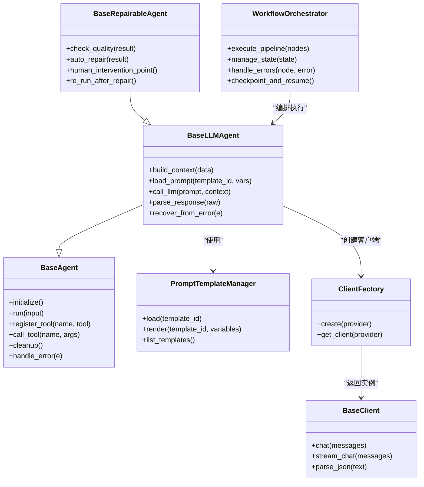

图表来源
- [base_agent.py:1-200](file://src/penshot/neopen/agent/base_agent.py#L1-L200)
- [base_llm_agent.py:1-200](file://src/penshot/neopen/agent/base_llm_agent.py#L1-L200)
- [base_repairable_agent.py:1-200](file://src/penshot/neopen/agent/base_repairable_agent.py#L1-L200)
- [workflow_orchestrator.py:1-200](file://src/penshot/neopen/agent/workflow/workflow_orchestrator.py#L1-L200)
- [prompt_template_manager.py:1-200](file://src/penshot/neopen/prompts/prompt_template_manager.py#L1-L200)
- [client_factory.py:1-200](file://src/penshot/neopen/client/client_factory.py#L1-L200)
- [base_client.py:1-200](file://src/penshot/neopen/client/base_client.py#L1-L200)

## 详细组件分析

### BaseAgent抽象类设计与接口
- 生命周期管理
  - initialize：完成资源准备、配置加载、工具注册。
  - run：统一入口，负责输入校验、上下文构建、工具调用、结果组装、异常捕获与上报。
  - cleanup：释放资源、持久化中间状态、关闭连接。
- 工具注册机制
  - register_tool：将工具函数或对象注册到名称空间，支持元数据描述（参数、返回值、用途）。
  - call_tool：按名称查找并调用工具，包含参数校验、错误包装、日志记录。
- 消息传递协议
  - 输入/输出/状态对象定义，确保跨Agent与工作流的稳定契约。
  - 支持结构化输出（如JSON）与错误码约定。

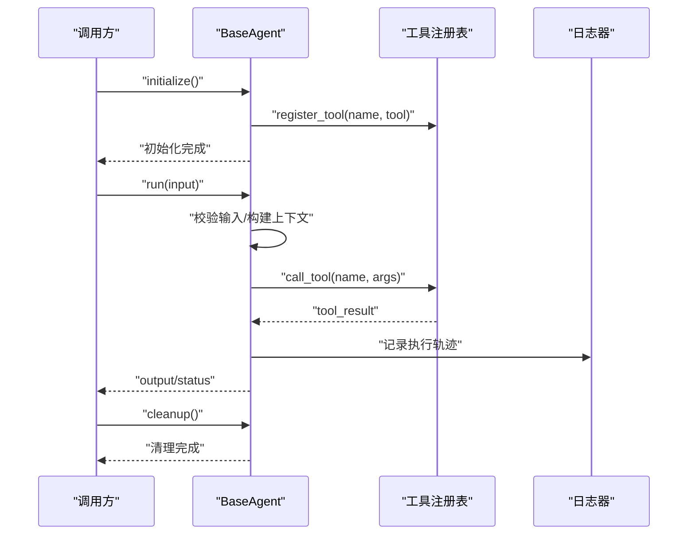

图表来源
- [base_agent.py:1-200](file://src/penshot/neopen/agent/base_agent.py#L1-L200)

章节来源
- [base_agent.py:1-200](file://src/penshot/neopen/agent/base_agent.py#L1-L200)

### LLM Agent实现原理
- 提示词模板管理
  - 通过PromptTemplateManager加载与渲染模板，支持变量注入与多版本管理。
- 上下文构建
  - 聚合用户输入、历史对话、工具结果、知识库检索片段，形成结构化上下文。
- 模型调用与响应解析
  - 借助ClientFactory选择后端（OpenAI、DeepSeek、Ollama、Qwen、HuggingFace），统一调用BaseClient的chat/stream接口。
  - 对原始响应进行JSON/结构化解析，失败时触发恢复策略。
- 错误恢复
  - 重试、降级（切换到备用模型）、回退到规则解析、人工介入标记。

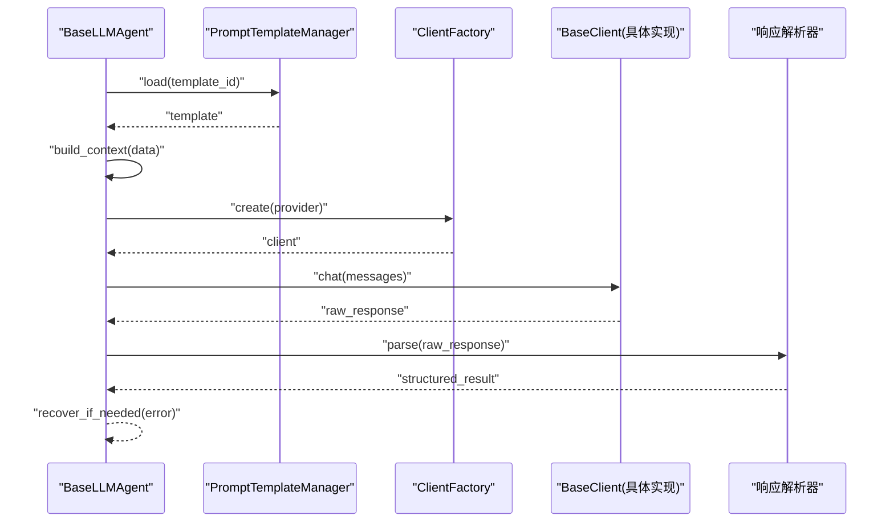

图表来源
- [base_llm_agent.py:1-200](file://src/penshot/neopen/agent/base_llm_agent.py#L1-L200)
- [prompt_template_manager.py:1-200](file://src/penshot/neopen/prompts/prompt_template_manager.py#L1-L200)
- [client_factory.py:1-200](file://src/penshot/neopen/client/client_factory.py#L1-L200)
- [base_client.py:1-200](file://src/penshot/neopen/client/base_client.py#L1-L200)

章节来源
- [base_llm_agent.py:1-200](file://src/penshot/neopen/agent/base_llm_agent.py#L1-L200)
- [prompt_template_manager.py:1-200](file://src/penshot/neopen/prompts/prompt_template_manager.py#L1-L200)
- [client_factory.py:1-200](file://src/penshot/neopen/client/client_factory.py#L1-L200)
- [base_client.py:1-200](file://src/penshot/neopen/client/base_client.py#L1-L200)

### 可修复Agent设计理念
- 质量检查
  - 基于规则与LLM双重校验，检测输出完整性、一致性与格式正确性。
- 自动修复策略
  - 针对常见错误（缺失字段、类型不匹配、逻辑不一致）应用修复模板与重写策略。
- 人工干预点
  - 当自动修复置信度不足或涉及高风险变更时，进入人工决策流程，由人类确认后再继续。

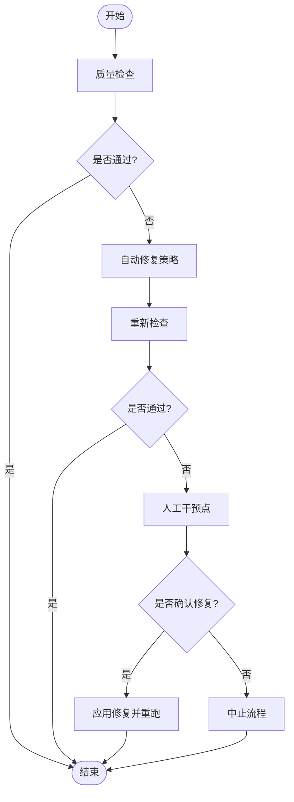

图表来源
- [base_repairable_agent.py:1-200](file://src/penshot/neopen/agent/base_repairable_agent.py#L1-L200)
- [workflow_output_fixer.py:1-200](file://src/penshot/neopen/agent/workflow/workflow_output_fixer.py#L1-L200)
- [human_decision_intervention.py:1-200](file://src/penshot/neopen/agent/human_decision/human_decision_intervention.py#L1-200)

章节来源
- [base_repairable_agent.py:1-200](file://src/penshot/neopen/agent/base_repairable_agent.py#L1-L200)
- [workflow_output_fixer.py:1-200](file://src/penshot/neopen/agent/workflow/workflow_output_fixer.py#L1-L200)
- [human_decision_intervention.py:1-200](file://src/penshot/neopen/agent/human_decision/human_decision_intervention.py#L1-200)

### 领域Agent实现要点
- PromptConverterAgent
  - 负责提示词转换，结合模板与LLM进行风格迁移与格式标准化。
- QualityAuditorAgent
  - 负责质量审核，结合规则与LLM进行多维度评估与打分。
- ScriptParserAgent
  - 负责剧本解析，提取场景、动作、对白等结构化信息。
- ShotSegmenterAgent
  - 负责镜头分割，结合估计器与规则进行时间轴切分。
- VideoSplitterAgent
  - 负责视频分段，依据时长与语义进行合理拆分。

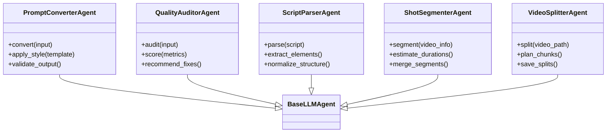

图表来源
- [prompt_converter_agent.py:1-200](file://src/penshot/neopen/agent/prompt_converter_agent.py#L1-L200)
- [quality_auditor_agent.py:1-200](file://src/penshot/neopen/agent/quality_auditor_agent.py#L1-L200)
- [script_parser_agent.py:1-200](file://src/penshot/neopen/agent/script_parser_agent.py#L1-L200)
- [shot_segmenter_agent.py:1-200](file://src/penshot/neopen/agent/shot_segmenter_agent.py#L1-L200)
- [video_splitter_agent.py:1-200](file://src/penshot/neopen/agent/video_splitter_agent.py#L1-L200)
- [base_llm_agent.py:1-200](file://src/penshot/neopen/agent/base_llm_agent.py#L1-L200)

章节来源
- [prompt_converter_agent.py:1-200](file://src/penshot/neopen/agent/prompt_converter_agent.py#L1-L200)
- [quality_auditor_agent.py:1-200](file://src/penshot/neopen/agent/quality_auditor_agent.py#L1-L200)
- [script_parser_agent.py:1-200](file://src/penshot/neopen/agent/script_parser_agent.py#L1-L200)
- [shot_segmenter_agent.py:1-200](file://src/penshot/neopen/agent/shot_segmenter_agent.py#L1-L200)
- [video_splitter_agent.py:1-200](file://src/penshot/neopen/agent/video_splitter_agent.py#L1-L200)

### 工作流编排与状态管理
- WorkflowOrchestrator
  - 负责节点调度、状态流转、错误处理、检查点与恢复。
- WorkflowPipeline
  - 定义节点顺序与依赖，支持并行与条件分支。
- WorkflowStateTypes
  - 定义状态枚举与状态机约束，保证流程一致性。
- WorkflowErrorHandler
  - 集中式错误处理，支持重试、降级、告警与人工介入。
- WorkflowOutputFixer
  - 输出修复器，结合规则与LLM进行自动修复。
- WorkflowMemory/Logger/Checkpointer
  - 内存、日志与检查点，保障可观测性与可恢复性。

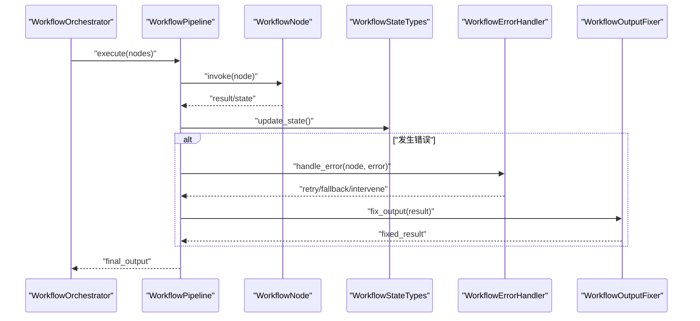

图表来源
- [workflow_orchestrator.py:1-200](file://src/penshot/neopen/agent/workflow/workflow_orchestrator.py#L1-L200)
- [workflow_pipeline.py:1-200](file://src/penshot/neopen/agent/workflow/workflow_pipeline.py#L1-L200)
- [workflow_state_types.py:1-200](file://src/penshot/neopen/agent/workflow/workflow_state_types.py#L1-L200)
- [workflow_error_handler.py:1-200](file://src/penshot/neopen/agent/workflow/workflow_error_handler.py#L1-L200)
- [workflow_output_fixer.py:1-200](file://src/penshot/neopen/agent/workflow/workflow_output_fixer.py#L1-L200)

章节来源
- [workflow_orchestrator.py:1-200](file://src/penshot/neopen/agent/workflow/workflow_orchestrator.py#L1-L200)
- [workflow_pipeline.py:1-200](file://src/penshot/neopen/agent/workflow/workflow_pipeline.py#L1-L200)
- [workflow_state_types.py:1-200](file://src/penshot/neopen/agent/workflow/workflow_state_types.py#L1-L200)
- [workflow_error_handler.py:1-200](file://src/penshot/neopen/agent/workflow/workflow_error_handler.py#L1-L200)
- [workflow_output_fixer.py:1-200](file://src/penshot/neopen/agent/workflow/workflow_output_fixer.py#L1-L200)

### 提示词模板与加载管理
- PromptTemplateManager
  - 提供模板加载、渲染、列表查询能力，支持变量替换与版本控制。
- PromptLoadManager
  - 负责从文件系统或远程源加载模板，缓存与热更新。

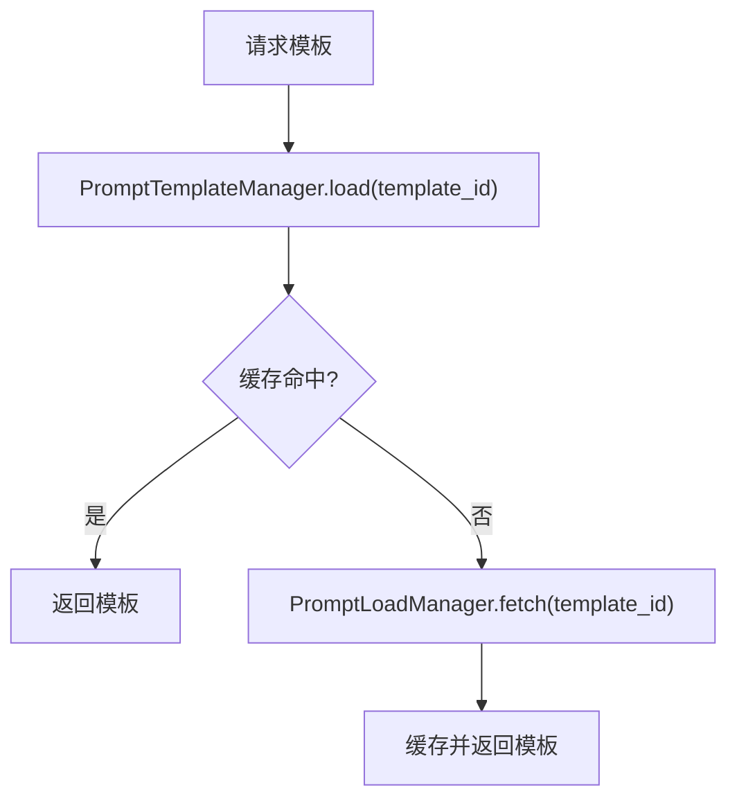

图表来源
- [prompt_template_manager.py:1-200](file://src/penshot/neopen/prompts/prompt_template_manager.py#L1-L200)
- [prompt_load_manager.py:1-200](file://src/penshot/neopen/prompts/prompt_load_manager.py#L1-L200)

章节来源
- [prompt_template_manager.py:1-200](file://src/penshot/neopen/prompts/prompt_template_manager.py#L1-L200)
- [prompt_load_manager.py:1-200](file://src/penshot/neopen/prompts/prompt_load_manager.py#L1-L200)

### LLM客户端与工厂
- ClientFactory
  - 根据provider创建对应客户端实例，统一管理配置与连接池。
- BaseClient与各实现
  - OpenAI、DeepSeek、Ollama、Qwen、HuggingFace等统一接口，屏蔽差异。

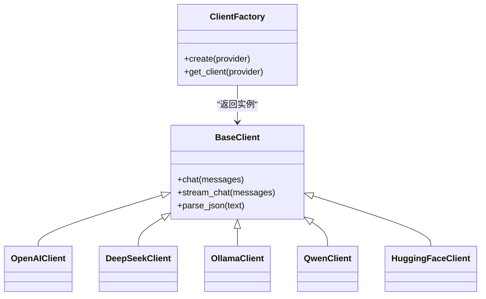

图表来源
- [client_factory.py:1-200](file://src/penshot/neopen/client/client_factory.py#L1-L200)
- [base_client.py:1-200](file://src/penshot/neopen/client/base_client.py#L1-L200)
- [openai_client.py:1-200](file://src/penshot/neopen/client/openai_client.py#L1-L200)
- [deepseek_client.py:1-200](file://src/penshot/neopen/client/deepseek_client.py#L1-L200)
- [ollama_client.py:1-200](file://src/penshot/neopen/client/ollama_client.py#L1-L200)
- [qwen_client.py:1-200](file://src/penshot/neopen/client/qwen_client.py#L1-L200)
- [huggingface_client.py:1-200](file://src/penshot/neopen/client/huggingface_client.py#L1-L200)

章节来源
- [client_factory.py:1-200](file://src/penshot/neopen/client/client_factory.py#L1-L200)
- [base_client.py:1-200](file://src/penshot/neopen/client/base_client.py#L1-L200)
- [openai_client.py:1-200](file://src/penshot/neopen/client/openai_client.py#L1-L200)
- [deepseek_client.py:1-200](file://src/penshot/neopen/client/deepseek_client.py#L1-L200)
- [ollama_client.py:1-200](file://src/penshot/neopen/client/ollama_client.py#L1-L200)
- [qwen_client.py:1-200](file://src/penshot/neopen/client/qwen_client.py#L1-L200)
- [huggingface_client.py:1-200](file://src/penshot/neopen/client/huggingface_client.py#L1-L200)

### 工具生态与集成
- JsonParserTool：安全解析JSON，支持容错与回退。
- ResultStorageTool：结果持久化与检索。
- ScriptAssessorTool：脚本质量评估与指标计算。
- ActionDurationTool：动作时长估算与规划。
- LangchainMemoryTool：与LangChain记忆系统集成。

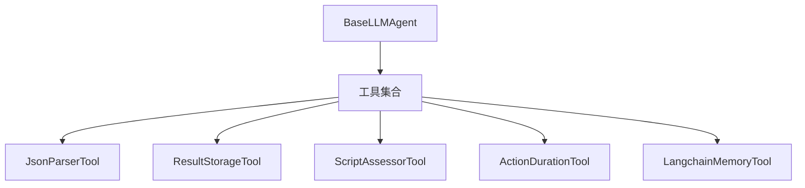

图表来源
- [json_parser_tool.py:1-200](file://src/penshot/neopen/tools/json_parser_tool.py#L1-L200)
- [result_storage_tool.py:1-200](file://src/penshot/neopen/tools/result_storage_tool.py#L1-L200)
- [script_assessor_tool.py:1-200](file://src/penshot/neopen/tools/script_assessor_tool.py#L1-L200)
- [action_duration_tool.py:1-200](file://src/penshot/neopen/tools/action_duration_tool.py#L1-L200)
- [langchain_memory_tool.py:1-200](file://src/penshot/neopen/tools/langchain_memory_tool.py#L1-L200)

章节来源
- [json_parser_tool.py:1-200](file://src/penshot/neopen/tools/json_parser_tool.py#L1-L200)
- [result_storage_tool.py:1-200](file://src/penshot/neopen/tools/result_storage_tool.py#L1-L200)
- [script_assessor_tool.py:1-200](file://src/penshot/neopen/tools/script_assessor_tool.py#L1-L200)
- [action_duration_tool.py:1-200](file://src/penshot/neopen/tools/action_duration_tool.py#L1-L200)
- [langchain_memory_tool.py:1-200](file://src/penshot/neopen/tools/langchain_memory_tool.py#L1-L200)

### 连续性守护与长脚本处理
- ContinuityGuardianChecker：连续性检查，确保跨片段的一致性。
- ContinuityRepairGenerator：基于检查结果生成修复建议。
- CrossChunkValidator：跨块验证，避免重复或缺失。
- LongScriptChunker：长脚本分块策略，优化处理效率。
- PromptStyleGuardian：风格一致性守护，保持输出风格统一。

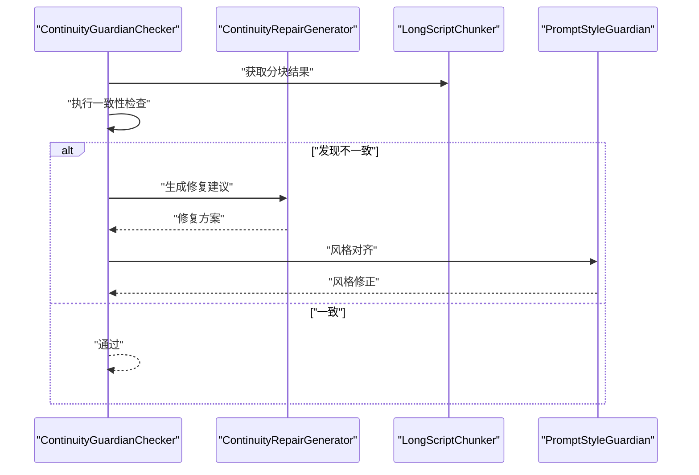

图表来源
- [continuity_guardian_checker.py:1-200](file://src/penshot/neopen/agent/continuity_guardian/continuity_guardian_checker.py#L1-L200)
- [continuity_repair_generator.py:1-200](file://src/penshot/neopen/agent/continuity_guardian/continuity_repair_generator.py#L1-L200)
- [cross_chunk_validator.py:1-200](file://src/penshot/neopen/agent/continuity_guardian/cross_chunk_validator.py#L1-L200)
- [long_script_chunker.py:1-200](file://src/penshot/neopen/agent/continuity_guardian/long_script_chunker.py#L1-L200)
- [prompt_style_guardian.py:1-200](file://src/penshot/neopen/agent/continuity_guardian/prompt_style_guardian.py#L1-L200)

章节来源
- [continuity_guardian_checker.py:1-200](file://src/penshot/neopen/agent/continuity_guardian/continuity_guardian_checker.py#L1-L200)
- [continuity_repair_generator.py:1-200](file://src/penshot/neopen/agent/continuity_guardian/continuity_repair_generator.py#L1-L200)
- [cross_chunk_validator.py:1-200](file://src/penshot/neopen/agent/continuity_guardian/cross_chunk_validator.py#L1-L200)
- [long_script_chunker.py:1-200](file://src/penshot/neopen/agent/continuity_guardian/long_script_chunker.py#L1-L200)
- [prompt_style_guardian.py:1-200](file://src/penshot/neopen/agent/continuity_guardian/prompt_style_guardian.py#L1-L200)

### 人工增强与决策
- HumanDecisionIntervention：人工决策桥接，支持审批与修改。
- HumanEnhancedConverter：在自动转换基础上引入人工增强，提升质量与可控性。

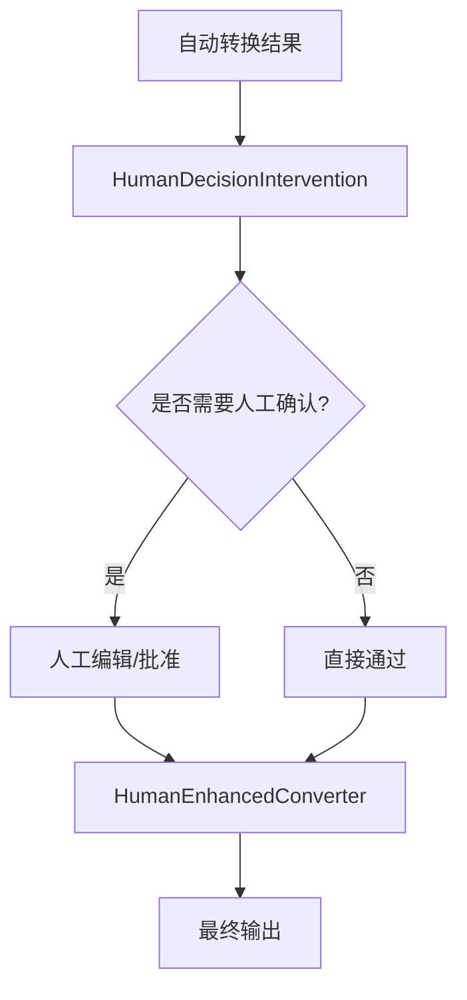

图表来源
- [human_decision_intervention.py:1-200](file://src/penshot/neopen/agent/human_decision/human_decision_intervention.py#L1-L200)
- [human_enhanced_converter.py:1-200](file://src/penshot/neopen/agent/human_decision/human_enhanced_converter.py#L1-L200)

章节来源
- [human_decision_intervention.py:1-200](file://src/penshot/neopen/agent/human_decision/human_decision_intervention.py#L1-L200)
- [human_enhanced_converter.py:1-200](file://src/penshot/neopen/agent/human_decision/human_enhanced_converter.py#L1-L200)

### 任务系统与生命周期
- TaskLifecycleService：任务生命周期服务，协调创建、调度、监控与销毁。
- TaskManager：任务管理器，维护任务队列与优先级。
- TaskProcessor：任务处理器，执行业务逻辑并产出结果。
- TaskRepository：任务仓库，持久化与检索任务状态。
- TaskFactory：任务工厂，根据类型创建任务实例。
- WorkflowRegistry：工作流注册表，管理可用工作流与节点映射。

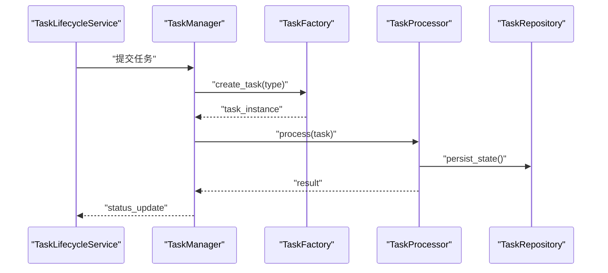

图表来源
- [task_lifecycle_service.py:1-200](file://src/penshot/neopen/task/task_lifecycle_service.py#L1-L200)
- [task_manager.py:1-200](file://src/penshot/neopen/task/task_manager.py#L1-L200)
- [task_factory.py:1-200](file://src/penshot/neopen/task/task_factory.py#L1-L200)
- [task_processor.py:1-200](file://src/penshot/neopen/task/task_processor.py#L1-L200)
- [task_repository.py:1-200](file://src/penshot/neopen/task/task_repository.py#L1-L200)
- [task_workflow_registry.py:1-200](file://src/penshot/neopen/task/workflow_registry.py#L1-L200)

章节来源
- [task_lifecycle_service.py:1-200](file://src/penshot/neopen/task/task_lifecycle_service.py#L1-L200)
- [task_manager.py:1-200](file://src/penshot/neopen/task/task_manager.py#L1-L200)
- [task_factory.py:1-200](file://src/penshot/neopen/task/task_factory.py#L1-L200)
- [task_processor.py:1-200](file://src/penshot/neopen/task/task_processor.py#L1-L200)
- [task_repository.py:1-200](file://src/penshot/neopen/task/task_repository.py#L1-L200)
- [task_workflow_registry.py:1-200](file://src/penshot/neopen/task/workflow_registry.py#L1-L200)

## 依赖关系分析
- 组件耦合与内聚
  - BaseAgent与BaseLLMAgent、BaseRepairableAgent形成清晰的继承链，职责逐步增强。
  - LLM客户端通过工厂解耦，便于扩展新提供商。
  - 工作流编排独立于领域Agent，具备良好复用性。
- 外部依赖与集成点
  - 多LLM后端统一封装，降低切换成本。
  - 工具生态模块化，按需注册与组合。
  - 提示词模板与加载器分离，支持热更新与版本管理。

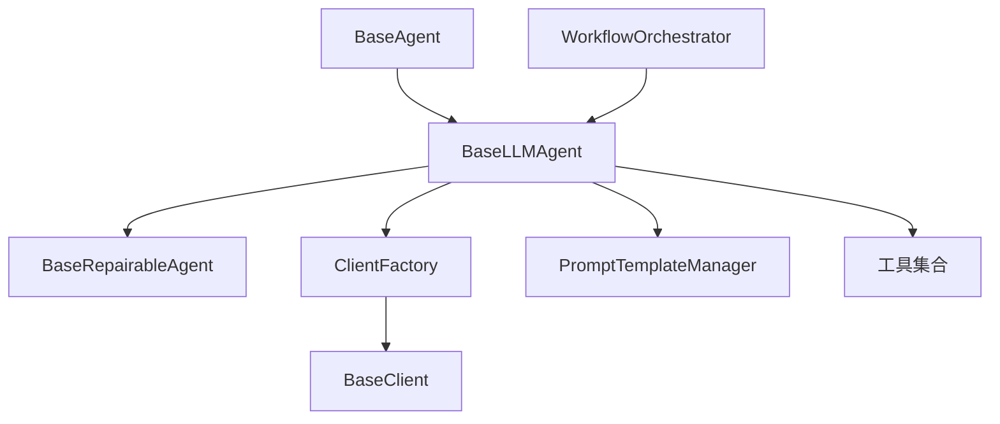

图表来源
- [base_agent.py:1-200](file://src/penshot/neopen/agent/base_agent.py#L1-L200)
- [base_llm_agent.py:1-200](file://src/penshot/neopen/agent/base_llm_agent.py#L1-L200)
- [base_repairable_agent.py:1-200](file://src/penshot/neopen/agent/base_repairable_agent.py#L1-L200)
- [client_factory.py:1-200](file://src/penshot/neopen/client/client_factory.py#L1-L200)
- [base_client.py:1-200](file://src/penshot/neopen/client/base_client.py#L1-L200)
- [prompt_template_manager.py:1-200](file://src/penshot/neopen/prompts/prompt_template_manager.py#L1-L200)
- [workflow_orchestrator.py:1-200](file://src/penshot/neopen/agent/workflow/workflow_orchestrator.py#L1-L200)

章节来源
- [base_agent.py:1-200](file://src/penshot/neopen/agent/base_agent.py#L1-L200)
- [base_llm_agent.py:1-200](file://src/penshot/neopen/agent/base_llm_agent.py#L1-L200)
- [base_repairable_agent.py:1-200](file://src/penshot/neopen/agent/base_repairable_agent.py#L1-L200)
- [client_factory.py:1-200](file://src/penshot/neopen/client/client_factory.py#L1-L200)
- [base_client.py:1-200](file://src/penshot/neopen/client/base_client.py#L1-L200)
- [prompt_template_manager.py:1-200](file://src/penshot/neopen/prompts/prompt_template_manager.py#L1-L200)
- [workflow_orchestrator.py:1-200](file://src/penshot/neopen/agent/workflow/workflow_orchestrator.py#L1-L200)

## 性能考量
- 缓存与复用
  - 提示词模板缓存、LLM响应缓存、工具结果缓存，减少重复计算与网络开销。
- 并发与批处理
  - 工作流节点并行执行、批量处理长脚本分块，提高吞吐。
- 降级与限流
  - 多后端切换与限流策略，保障稳定性与可用性。
- 内存与I/O优化
  - 流式处理大响应、分页读取与增量写入，降低峰值内存占用。

[本节为通用指导，无需特定文件引用]

## 故障排查指南
- 常见问题定位
  - 模板加载失败：检查模板ID与版本、加载器配置与权限。
  - LLM调用超时：检查网络、配额与重试策略，必要时切换备用模型。
  - JSON解析错误：启用容错解析与回退规则，记录原始响应以便诊断。
  - 工具调用异常：核对工具签名与参数类型，查看日志与错误码。
  - 工作流卡死：检查状态机约束与节点依赖，查看检查点与日志。
- 调试与观测
  - 启用详细日志与追踪，记录关键步骤与中间状态。
  - 使用检查点与断点恢复，快速复现问题。
  - 人工干预通道用于紧急修复与确认。

章节来源
- [workflow_error_handler.py:1-200](file://src/penshot/neopen/agent/workflow/workflow_error_handler.py#L1-L200)
- [workflow_logger.py:1-200](file://src/penshot/neopen/agent/workflow/workflow_logger.py#L1-L200)
- [workflow_checkpointer.py:1-200](file://src/penshot/neopen/agent/workflow/workflow_checkpointer.py#L1-L200)
- [workflow_output_fixer.py:1-200](file://src/penshot/neopen/agent/workflow/workflow_output_fixer.py#L1-L200)

## 结论
本Agent框架通过抽象层、领域Agent、LLM客户端、工作流编排、工具生态与提示词工程的协同，实现了高内聚、低耦合、可扩展的Agent体系。BaseAgent定义了统一的生命周期与消息协议，BaseLLMAgent增强了提示词与模型交互能力，BaseRepairableAgent引入了质量检查与自动修复机制。配合工作流编排与任务系统，能够支撑复杂业务流程与高可靠交付。

[本节为总结性内容，无需特定文件引用]

## 附录：Agent开发指南与最佳实践

### 如何继承基类
- 继承BaseAgent
  - 实现initialize、run、cleanup等生命周期方法。
  - 在initialize中注册所需工具。
- 继承BaseLLMAgent
  - 实现build_context、load_prompt、call_llm、parse_response等方法。
  - 使用PromptTemplateManager加载与渲染模板。
  - 通过ClientFactory创建并调用LLM客户端。
- 继承BaseRepairableAgent
  - 实现check_quality、auto_repair、human_intervention_point等方法。
  - 结合WorkflowOutputFixer与HumanDecisionIntervention进行修复与干预。

章节来源
- [base_agent.py:1-200](file://src/penshot/neopen/agent/base_agent.py#L1-L200)
- [base_llm_agent.py:1-200](file://src/penshot/neopen/agent/base_llm_agent.py#L1-L200)
- [base_repairable_agent.py:1-200](file://src/penshot/neopen/agent/base_repairable_agent.py#L1-L200)

### 实现必要方法
- 输入校验与上下文构建
  - 严格校验输入结构与类型，构建稳定的上下文对象。
- 提示词模板管理
  - 使用模板ID与变量渲染，避免硬编码字符串。
- 模型调用与响应解析
  - 统一调用BaseClient接口，解析结构化输出，处理异常与降级。
- 质量检查与修复
  - 定义检查规则与评分指标，自动生成修复建议并支持人工确认。

章节来源
- [prompt_template_manager.py:1-200](file://src/penshot/neopen/prompts/prompt_template_manager.py#L1-L200)
- [client_factory.py:1-200](file://src/penshot/neopen/client/client_factory.py#L1-L200)
- [base_client.py:1-200](file://src/penshot/neopen/client/base_client.py#L1-L200)
- [workflow_output_fixer.py:1-200](file://src/penshot/neopen/agent/workflow/workflow_output_fixer.py#L1-L200)
- [human_decision_intervention.py:1-200](file://src/penshot/neopen/agent/human_decision/human_decision_intervention.py#L1-L200)

### 注册自定义工具
- 定义工具函数或类，提供清晰的参数与返回值描述。
- 在Agent.initialize中调用register_tool进行注册。
- 在run中通过call_tool调用工具，处理结果与异常。

章节来源
- [base_agent.py:1-200](file://src/penshot/neopen/agent/base_agent.py#L1-L200)
- [json_parser_tool.py:1-200](file://src/penshot/neopen/tools/json_parser_tool.py#L1-L200)
- [result_storage_tool.py:1-200](file://src/penshot/neopen/tools/result_storage_tool.py#L1-L200)
- [script_assessor_tool.py:1-200](file://src/penshot/neopen/tools/script_assessor_tool.py#L1-L200)
- [action_duration_tool.py:1-200](file://src/penshot/neopen/tools/action_duration_tool.py#L1-L200)
- [langchain_memory_tool.py:1-200](file://src/penshot/neopen/tools/langchain_memory_tool.py#L1-L200)

### 代码示例路径
- 领域Agent示例
  - [prompt_converter_agent.py:1-200](file://src/penshot/neopen/agent/prompt_converter_agent.py#L1-L200)
  - [quality_auditor_agent.py:1-200](file://src/penshot/neopen/agent/quality_auditor_agent.py#L1-L200)
  - [script_parser_agent.py:1-200](file://src/penshot/neopen/agent/script_parser_agent.py#L1-L200)
  - [shot_segmenter_agent.py:1-200](file://src/penshot/neopen/agent/shot_segmenter_agent.py#L1-L200)
  - [video_splitter_agent.py:1-200](file://src/penshot/neopen/agent/video_splitter_agent.py#L1-L200)
- 提示词转换器实现
  - [llm_prompt_converter.py:1-200](file://src/penshot/neopen/agent/prompt_converter/llm_prompt_converter.py#L1-L200)
  - [template_prompt_converter.py:1-200](file://src/penshot/neopen/agent/prompt_converter/template_prompt_converter.py#L1-L200)
  - [prompt_converter_factory.py:1-200](file://src/penshot/neopen/agent/prompt_converter/prompt_converter_factory.py#L1-L200)
  - [base_prompt_converter.py:1-200](file://src/penshot/neopen/agent/prompt_converter/base_prompt_converter.py#L1-L200)

章节来源
- [prompt_converter_agent.py:1-200](file://src/penshot/neopen/agent/prompt_converter_agent.py#L1-L200)
- [quality_auditor_agent.py:1-200](file://src/penshot/neopen/agent/quality_auditor_agent.py#L1-L200)
- [script_parser_agent.py:1-200](file://src/penshot/neopen/agent/script_parser_agent.py#L1-L200)
- [shot_segmenter_agent.py:1-200](file://src/penshot/neopen/agent/shot_segmenter_agent.py#L1-L200)
- [video_splitter_agent.py:1-200](file://src/penshot/neopen/agent/video_splitter_agent.py#L1-L200)
- [llm_prompt_converter.py:1-200](file://src/penshot/neopen/agent/prompt_converter/llm_prompt_converter.py#L1-L200)
- [template_prompt_converter.py:1-200](file://src/penshot/neopen/agent/prompt_converter/template_prompt_converter.py#L1-L200)
- [prompt_converter_factory.py:1-200](file://src/penshot/neopen/agent/prompt_converter/prompt_converter_factory.py#L1-L200)
- [base_prompt_converter.py:1-200](file://src/penshot/neopen/agent/prompt_converter/base_prompt_converter.py#L1-L200)

### 最佳实践建议
- 明确契约
  - 定义清晰的输入/输出/状态对象，确保跨组件稳定通信。
- 可观测性
  - 完善日志与追踪，记录关键步骤与异常堆栈。
- 弹性与容错
  - 设置重试、降级与回退策略，保障高可用。
- 可维护性
  - 模板与配置外置，支持热更新与版本管理。
- 安全性
  - 工具调用参数校验与白名单，防止注入与越权。
- 性能优化
  - 缓存热点数据，批处理与并行执行，流式处理大响应。

[本节为通用指导，无需特定文件引用]