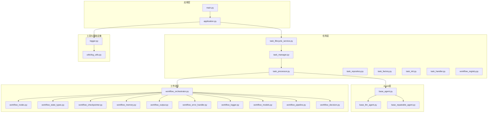
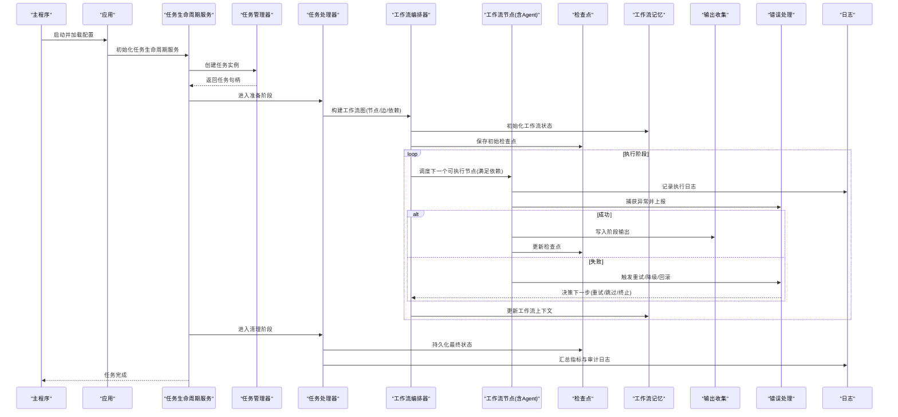
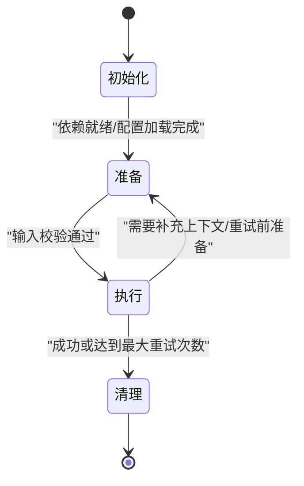
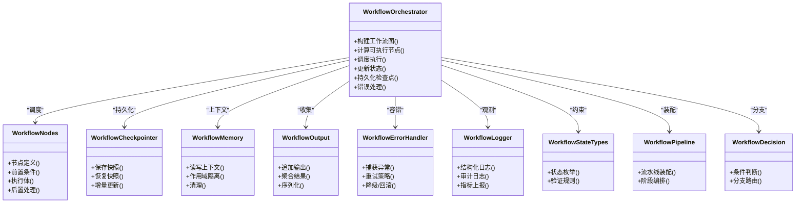
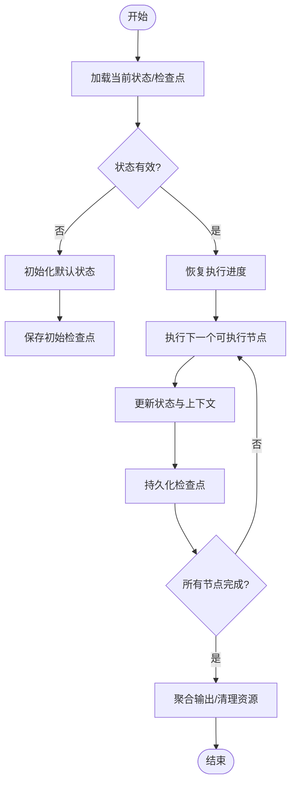
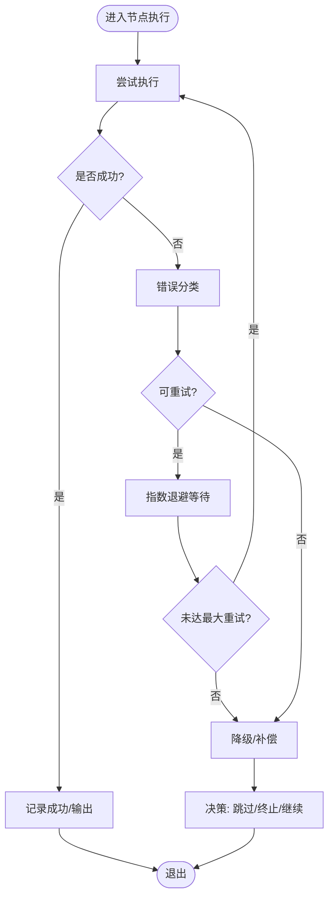
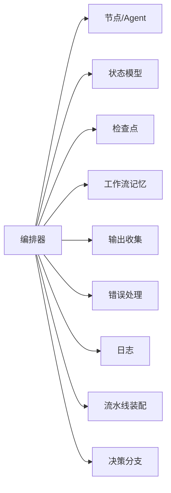

# Agent生命周期管理

<cite>
**本文引用的文件**   
- [main.py](file://main.py)
- [src/penshot/app/application.py](file://src/penshot/app/application.py)
- [src/penshot/neopen/agent/base_agent.py](file://src/penshot/neopen/agent/base_agent.py)
- [src/penshot/neopen/agent/base_llm_agent.py](file://src/penshot/neopen/agent/base_llm_agent.py)
- [src/penshot/neopen/agent/base_repairable_agent.py](file://src/penshot/neopen/agent/base_repairable_agent.py)
- [src/penshot/neopen/agent/workflow/workflow_orchestrator.py](file://src/penshot/neopen/agent/workflow/workflow_orchestrator.py)
- [src/penshot/neopen/agent/workflow/workflow_state_types.py](file://src/penshot/neopen/agent/workflow/workflow_state_types.py)
- [src/penshot/neopen/agent/workflow/workflow_checkpointer.py](file://src/penshot/neopen/agent/workflow/workflow_checkpointer.py)
- [src/penshot/neopen/agent/workflow/workflow_memory.py](file://src/penshot/neopen/agent/workflow/workflow_memory.py)
- [src/penshot/neopen/agent/workflow/workflow_nodes.py](file://src/penshot/neopen/agent/workflow/workflow_nodes.py)
- [src/penshot/neopen/agent/workflow/workflow_output.py](file://src/penshot/neopen/agent/workflow/workflow_output.py)
- [src/penshot/neopen/agent/workflow/workflow_error_handler.py](file://src/penshot/neopen/agent/workflow/workflow_error_handler.py)
- [src/penshot/neopen/agent/workflow/workflow_logger.py](file://src/penshot/neopen/agent/workflow/workflow_logger.py)
- [src/penshot/neopen/agent/workflow/workflow_models.py](file://src/penshot/neopen/agent/workflow/workflow_models.py)
- [src/penshot/neopen/agent/workflow/workflow_pipeline.py](file://src/penshot/neopen/agent/workflow/workflow_pipeline.py)
- [src/penshot/neopen/agent/workflow/workflow_decision.py](file://src/penshot/neopen/agent/workflow/workflow_decision.py)
- [src/penshot/task/task_lifecycle_service.py](file://src/penshot/task/task_lifecycle_service.py)
- [src/penshot/task/task_manager.py](file://src/penshot/task/task_manager.py)
- [src/penshot/task/task_processor.py](file://src/penshot/task/task_processor.py)
- [src/penshot/task/task_repository.py](file://src/penshot/task/task_repository.py)
- [src/penshot/task/task_factory.py](file://src/penshot/task/task_factory.py)
- [src/penshot/task/task_init.py](file://src/penshot/task/task_init.py)
- [src/penshot/task/task_handler.py](file://src/penshot/task/task_handler.py)
- [src/penshot/task/workflow_registry.py](file://src/penshot/task/workflow_registry.py)
- [src/penshot/logger.py](file://src/penshot/logger.py)
- [src/penshot/utils/log_utils.py](file://src/penshot/utils/log_utils.py)
- [examples/direct_usage.py](file://examples/direct_usage.py)
- [examples/langgraph_integration.py](file://examples/langgraph_integration.py)
</cite>

## 目录
1. [简介](#简介)
2. [项目结构](#项目结构)
3. [核心组件](#核心组件)
4. [架构总览](#架构总览)
5. [详细组件分析](#详细组件分析)
6. [依赖关系分析](#依赖关系分析)
7. [性能考虑](#性能考虑)
8. [故障排查指南](#故障排查指南)
9. [结论](#结论)
10. [附录](#附录)

## 简介
本文件围绕“Agent生命周期管理”展开，系统性阐述从创建到销毁的完整生命周期：初始化、准备、执行、清理四个阶段的状态转换；工作流编排器如何协调多个Agent的执行顺序、依赖与并行；状态管理机制（持久化、恢复、并发控制）；监控与调试工具（日志、指标、错误追踪）；并提供复杂协作流程的设计与实现示例路径。

## 项目结构
本项目采用分层与按功能域组织相结合的结构：
- 应用层：应用启动、配置加载、HTTP/MCP服务入口
- 任务层：任务生命周期服务、任务管理器、处理器、仓库、工厂等
- Agent层：通用Agent基类、LLM Agent、可修复Agent、具体Agent实现
- 工作流层：编排器、节点、状态类型、检查点、记忆、输出、错误处理、决策、流水线等
- 工具与基础设施：日志、缓存、客户端、知识、提示词、配置等

图表来源
- [main.py:1-200](file://main.py#L1-L200)
- [src/penshot/app/application.py:1-200](file://src/penshot/app/application.py#L1-L200)
- [src/penshot/task/task_lifecycle_service.py:1-200](file://src/penshot/task/task_lifecycle_service.py#L1-L200)
- [src/penshot/task/task_manager.py:1-200](file://src/penshot/task/task_manager.py#L1-L200)
- [src/penshot/task/task_processor.py:1-200](file://src/penshot/task/task_processor.py#L1-L200)
- [src/penshot/neopen/agent/workflow/workflow_orchestrator.py:1-200](file://src/penshot/neopen/agent/workflow/workflow_orchestrator.py#L1-L200)
- [src/penshot/neopen/agent/base_agent.py:1-200](file://src/penshot/neopen/agent/base_agent.py#L1-L200)
- [src/penshot/neopen/agent/base_llm_agent.py:1-200](file://src/penshot/neopen/agent/base_llm_agent.py#L1-L200)
- [src/penshot/neopen/agent/base_repairable_agent.py:1-200](file://src/penshot/neopen/agent/base_repairable_agent.py#L1-L200)
- [src/penshot/logger.py:1-200](file://src/penshot/logger.py#L1-L200)
- [src/penshot/utils/log_utils.py:1-200](file://src/penshot/utils/log_utils.py#L1-L200)

章节来源
- [main.py:1-200](file://main.py#L1-L200)
- [src/penshot/app/application.py:1-200](file://src/penshot/app/application.py#L1-L200)

## 核心组件
- 应用与应用上下文：负责启动、配置加载、服务注册、资源初始化与关闭
- 任务生命周期服务：统一驱动任务的创建、准备、执行、清理与状态流转
- 任务管理器/处理器/仓库/工厂：提供任务实例化、调度、存储与生命周期钩子
- Agent基类族：定义Agent通用接口、LLM能力封装、可修复策略
- 工作流编排器：编排多Agent执行顺序、依赖解析、并行度控制、错误与重试、检查点与恢复
- 工作流状态与记忆：状态模型、持久化检查点、内存上下文、输出收集
- 日志与监控：结构化日志、指标埋点、错误追踪

章节来源
- [src/penshot/task/task_lifecycle_service.py:1-200](file://src/penshot/task/task_lifecycle_service.py#L1-L200)
- [src/penshot/task/task_manager.py:1-200](file://src/penshot/task/task_manager.py#L1-L200)
- [src/penshot/task/task_processor.py:1-200](file://src/penshot/task/task_processor.py#L1-L200)
- [src/penshot/neopen/agent/base_agent.py:1-200](file://src/penshot/neopen/agent/base_agent.py#L1-L200)
- [src/penshot/neopen/agent/base_llm_agent.py:1-200](file://src/penshot/neopen/agent/base_llm_agent.py#L1-L200)
- [src/penshot/neopen/agent/base_repairable_agent.py:1-200](file://src/penshot/neopen/agent/base_repairable_agent.py#L1-L200)
- [src/penshot/neopen/agent/workflow/workflow_orchestrator.py:1-200](file://src/penshot/neopen/agent/workflow/workflow_orchestrator.py#L1-L200)
- [src/penshot/neopen/agent/workflow/workflow_state_types.py:1-200](file://src/penshot/neopen/agent/workflow/workflow_state_types.py#L1-L200)
- [src/penshot/neopen/agent/workflow/workflow_checkpointer.py:1-200](file://src/penshot/neopen/agent/workflow/workflow_checkpointer.py#L1-L200)
- [src/penshot/neopen/agent/workflow/workflow_memory.py:1-200](file://src/penshot/neopen/agent/workflow/workflow_memory.py#L1-L200)
- [src/penshot/neopen/agent/workflow/workflow_output.py:1-200](file://src/penshot/neopen/agent/workflow/workflow_output.py#L1-L200)
- [src/penshot/neopen/agent/workflow/workflow_error_handler.py:1-200](file://src/penshot/neopen/agent/workflow/workflow_error_handler.py#L1-L200)
- [src/penshot/neopen/agent/workflow/workflow_logger.py:1-200](file://src/penshot/neopen/agent/workflow/workflow_logger.py#L1-L200)
- [src/penshot/neopen/agent/workflow/workflow_models.py:1-200](file://src/penshot/neopen/agent/workflow/workflow_models.py#L1-L200)
- [src/penshot/neopen/agent/workflow/workflow_pipeline.py:1-200](file://src/penshot/neopen/agent/workflow/workflow_pipeline.py#L1-L200)
- [src/penshot/neopen/agent/workflow/workflow_decision.py:1-200](file://src/penshot/neopen/agent/workflow/workflow_decision.py#L1-L200)

## 架构总览
下图展示从应用启动到任务执行、工作流编排、Agent调用、状态持久化的整体流程。

图表来源
- [src/penshot/app/application.py:1-200](file://src/penshot/app/application.py#L1-L200)
- [src/penshot/task/task_lifecycle_service.py:1-200](file://src/penshot/task/task_lifecycle_service.py#L1-L200)
- [src/penshot/task/task_manager.py:1-200](file://src/penshot/task/task_manager.py#L1-L200)
- [src/penshot/task/task_processor.py:1-200](file://src/penshot/task/task_processor.py#L1-L200)
- [src/penshot/neopen/agent/workflow/workflow_orchestrator.py:1-200](file://src/penshot/neopen/agent/workflow/workflow_orchestrator.py#L1-L200)
- [src/penshot/neopen/agent/workflow/workflow_nodes.py:1-200](file://src/penshot/neopen/agent/workflow/workflow_nodes.py#L1-L200)
- [src/penshot/neopen/agent/workflow/workflow_checkpointer.py:1-200](file://src/penshot/neopen/agent/workflow/workflow_checkpointer.py#L1-L200)
- [src/penshot/neopen/agent/workflow/workflow_memory.py:1-200](file://src/penshot/neopen/agent/workflow/workflow_memory.py#L1-L200)
- [src/penshot/neopen/agent/workflow/workflow_output.py:1-200](file://src/penshot/neopen/agent/workflow/workflow_output.py#L1-L200)
- [src/penshot/neopen/agent/workflow/workflow_error_handler.py:1-200](file://src/penshot/neopen/agent/workflow/workflow_error_handler.py#L1-L200)
- [src/penshot/neopen/agent/workflow/workflow_logger.py:1-200](file://src/penshot/neopen/agent/workflow/workflow_logger.py#L1-L200)

## 详细组件分析

### Agent生命周期状态机
Agent在任务生命周期中经历如下状态转换：
- 初始化：构造、依赖注入、资源预分配
- 准备：校验输入、加载提示词/模板、建立上下文
- 执行：调用外部能力（如LLM）、执行业务逻辑、产出中间结果
- 清理：释放资源、持久化最终状态、上报指标与审计日志

章节来源
- [src/penshot/neopen/agent/base_agent.py:1-200](file://src/penshot/neopen/agent/base_agent.py#L1-L200)
- [src/penshot/neopen/agent/base_llm_agent.py:1-200](file://src/penshot/neopen/agent/base_llm_agent.py#L1-L200)
- [src/penshot/neopen/agent/base_repairable_agent.py:1-200](file://src/penshot/neopen/agent/base_repairable_agent.py#L1-L200)
- [src/penshot/task/task_lifecycle_service.py:1-200](file://src/penshot/task/task_lifecycle_service.py#L1-L200)

### 工作流编排器与节点
编排器负责：
- 解析工作流图（节点、边、依赖）
- 计算可执行集合（拓扑排序+依赖满足）
- 控制并行度（并发队列/信号量）
- 维护工作流状态与检查点
- 错误处理与重试策略
- 输出聚合与决策分支

图表来源
- [src/penshot/neopen/agent/workflow/workflow_orchestrator.py:1-200](file://src/penshot/neopen/agent/workflow/workflow_orchestrator.py#L1-L200)
- [src/penshot/neopen/agent/workflow/workflow_nodes.py:1-200](file://src/penshot/neopen/agent/workflow/workflow_nodes.py#L1-L200)
- [src/penshot/neopen/agent/workflow/workflow_checkpointer.py:1-200](file://src/penshot/neopen/agent/workflow/workflow_checkpointer.py#L1-L200)
- [src/penshot/neopen/agent/workflow/workflow_memory.py:1-200](file://src/penshot/neopen/agent/workflow/workflow_memory.py#L1-L200)
- [src/penshot/neopen/agent/workflow/workflow_output.py:1-200](file://src/penshot/neopen/agent/workflow/workflow_output.py#L1-L200)
- [src/penshot/neopen/agent/workflow/workflow_error_handler.py:1-200](file://src/penshot/neopen/agent/workflow/workflow_error_handler.py#L1-L200)
- [src/penshot/neopen/agent/workflow/workflow_logger.py:1-200](file://src/penshot/neopen/agent/workflow/workflow_logger.py#L1-L200)
- [src/penshot/neopen/agent/workflow/workflow_state_types.py:1-200](file://src/penshot/neopen/agent/workflow/workflow_state_types.py#L1-L200)
- [src/penshot/neopen/agent/workflow/workflow_pipeline.py:1-200](file://src/penshot/neopen/agent/workflow/workflow_pipeline.py#L1-L200)
- [src/penshot/neopen/agent/workflow/workflow_decision.py:1-200](file://src/penshot/neopen/agent/workflow/workflow_decision.py#L1-L200)

章节来源
- [src/penshot/neopen/agent/workflow/workflow_orchestrator.py:1-200](file://src/penshot/neopen/agent/workflow/workflow_orchestrator.py#L1-L200)
- [src/penshot/neopen/agent/workflow/workflow_nodes.py:1-200](file://src/penshot/neopen/agent/workflow/workflow_nodes.py#L1-L200)
- [src/penshot/neopen/agent/workflow/workflow_checkpointer.py:1-200](file://src/penshot/neopen/agent/workflow/workflow_checkpointer.py#L1-L200)
- [src/penshot/neopen/agent/workflow/workflow_memory.py:1-200](file://src/penshot/neopen/agent/workflow/workflow_memory.py#L1-L200)
- [src/penshot/neopen/agent/workflow/workflow_output.py:1-200](file://src/penshot/neopen/agent/workflow/workflow_output.py#L1-L200)
- [src/penshot/neopen/agent/workflow/workflow_error_handler.py:1-200](file://src/penshot/neopen/agent/workflow/workflow_error_handler.py#L1-L200)
- [src/penshot/neopen/agent/workflow/workflow_logger.py:1-200](file://src/penshot/neopen/agent/workflow/workflow_logger.py#L1-L200)
- [src/penshot/neopen/agent/workflow/workflow_state_types.py:1-200](file://src/penshot/neopen/agent/workflow/workflow_state_types.py#L1-L200)
- [src/penshot/neopen/agent/workflow/workflow_pipeline.py:1-200](file://src/penshot/neopen/agent/workflow/workflow_pipeline.py#L1-L200)
- [src/penshot/neopen/agent/workflow/workflow_decision.py:1-200](file://src/penshot/neopen/agent/workflow/workflow_decision.py#L1-L200)

### 状态管理与持久化
- 状态模型：定义工作流状态字段、枚举与校验规则
- 检查点：支持全量/增量快照、幂等写入、版本兼容
- 恢复：从检查点重建工作流上下文与进度
- 并发控制：基于锁/信号量保证同一工作流的串行一致性，跨工作流并行

图表来源
- [src/penshot/neopen/agent/workflow/workflow_state_types.py:1-200](file://src/penshot/neopen/agent/workflow/workflow_state_types.py#L1-L200)
- [src/penshot/neopen/agent/workflow/workflow_checkpointer.py:1-200](file://src/penshot/neopen/agent/workflow/workflow_checkpointer.py#L1-L200)
- [src/penshot/neopen/agent/workflow/workflow_memory.py:1-200](file://src/penshot/neopen/agent/workflow/workflow_memory.py#L1-L200)
- [src/penshot/neopen/agent/workflow/workflow_orchestrator.py:1-200](file://src/penshot/neopen/agent/workflow/workflow_orchestrator.py#L1-L200)

章节来源
- [src/penshot/neopen/agent/workflow/workflow_state_types.py:1-200](file://src/penshot/neopen/agent/workflow/workflow_state_types.py#L1-L200)
- [src/penshot/neopen/agent/workflow/workflow_checkpointer.py:1-200](file://src/penshot/neopen/agent/workflow/workflow_checkpointer.py#L1-L200)
- [src/penshot/neopen/agent/workflow/workflow_memory.py:1-200](file://src/penshot/neopen/agent/workflow/workflow_memory.py#L1-L200)

### 错误处理与重试
- 错误分类：网络/超时、业务校验失败、不可恢复错误
- 重试策略：指数退避、最大重试次数、熔断/降级
- 回滚与补偿：对副作用操作进行补偿性清理
- 决策分支：根据错误类型决定重试、跳过或终止

图表来源
- [src/penshot/neopen/agent/workflow/workflow_error_handler.py:1-200](file://src/penshot/neopen/agent/workflow/workflow_error_handler.py#L1-L200)
- [src/penshot/neopen/agent/workflow/workflow_decision.py:1-200](file://src/penshot/neopen/agent/workflow/workflow_decision.py#L1-L200)

章节来源
- [src/penshot/neopen/agent/workflow/workflow_error_handler.py:1-200](file://src/penshot/neopen/agent/workflow/workflow_error_handler.py#L1-L200)
- [src/penshot/neopen/agent/workflow/workflow_decision.py:1-200](file://src/penshot/neopen/agent/workflow/workflow_decision.py#L1-L200)

### 监控与调试
- 结构化日志：为每个节点/步骤打点，包含trace_id、阶段、耗时、输入摘要
- 指标收集：成功率、延迟分布、重试次数、吞吐、资源占用
- 错误追踪：异常堆栈、上下文快照、关联ID
- 使用建议：开启审计日志、设置采样率、导出至集中式日志系统

章节来源
- [src/penshot/neopen/agent/workflow/workflow_logger.py:1-200](file://src/penshot/neopen/agent/workflow/workflow_logger.py#L1-L200)
- [src/penshot/logger.py:1-200](file://src/penshot/logger.py#L1-L200)
- [src/penshot/utils/log_utils.py:1-200](file://src/penshot/utils/log_utils.py#L1-L200)

### 任务与Agent协作流程示例
以下示例路径展示了如何设计复杂的多Agent协作流程（脚本解析→分镜分割→视频切分→提示词转换→质量审核），并通过工作流编排器串联：
- 直接用法示例：[examples/direct_usage.py](file://examples/direct_usage.py)
- 集成LangGraph示例：[examples/langgraph_integration.py](file://examples/langgraph_integration.py)
- 任务生命周期服务入口：[src/penshot/task/task_lifecycle_service.py](file://src/penshot/task/task_lifecycle_service.py)
- 工作流编排器：[src/penshot/neopen/agent/workflow/workflow_orchestrator.py](file://src/penshot/neopen/agent/workflow/workflow_orchestrator.py)
- 工作流节点与流水线：[src/penshot/neopen/agent/workflow/workflow_nodes.py](file://src/penshot/neopen/agent/workflow/workflow_nodes.py), [src/penshot/neopen/agent/workflow/workflow_pipeline.py](file://src/penshot/neopen/agent/workflow/workflow_pipeline.py)
- 状态与检查点：[src/penshot/neopen/agent/workflow/workflow_state_types.py](file://src/penshot/neopen/agent/workflow/workflow_state_types.py), [src/penshot/neopen/agent/workflow/workflow_checkpointer.py](file://src/penshot/neopen/agent/workflow/workflow_checkpointer.py)
- 错误处理与决策：[src/penshot/neopen/agent/workflow/workflow_error_handler.py](file://src/penshot/neopen/agent/workflow/workflow_error_handler.py), [src/penshot/neopen/agent/workflow/workflow_decision.py](file://src/penshot/neopen/agent/workflow/workflow_decision.py)
- 输出与记忆：[src/penshot/neopen/agent/workflow/workflow_output.py](file://src/penshot/neopen/agent/workflow/workflow_output.py), [src/penshot/neopen/agent/workflow/workflow_memory.py](file://src/penshot/neopen/agent/workflow/workflow_memory.py)

章节来源
- [examples/direct_usage.py:1-200](file://examples/direct_usage.py#L1-L200)
- [examples/langgraph_integration.py:1-200](file://examples/langgraph_integration.py#L1-L200)
- [src/penshot/task/task_lifecycle_service.py:1-200](file://src/penshot/task/task_lifecycle_service.py#L1-L200)
- [src/penshot/neopen/agent/workflow/workflow_orchestrator.py:1-200](file://src/penshot/neopen/agent/workflow/workflow_orchestrator.py#L1-L200)
- [src/penshot/neopen/agent/workflow/workflow_nodes.py:1-200](file://src/penshot/neopen/agent/workflow/workflow_nodes.py#L1-L200)
- [src/penshot/neopen/agent/workflow/workflow_pipeline.py:1-200](file://src/penshot/neopen/agent/workflow/workflow_pipeline.py#L1-L200)
- [src/penshot/neopen/agent/workflow/workflow_state_types.py:1-200](file://src/penshot/neopen/agent/workflow/workflow_state_types.py#L1-L200)
- [src/penshot/neopen/agent/workflow/workflow_checkpointer.py:1-200](file://src/penshot/neopen/agent/workflow/workflow_checkpointer.py#L1-L200)
- [src/penshot/neopen/agent/workflow/workflow_error_handler.py:1-200](file://src/penshot/neopen/agent/workflow/workflow_error_handler.py#L1-L200)
- [src/penshot/neopen/agent/workflow/workflow_decision.py:1-200](file://src/penshot/neopen/agent/workflow/workflow_decision.py#L1-L200)
- [src/penshot/neopen/agent/workflow/workflow_output.py:1-200](file://src/penshot/neopen/agent/workflow/workflow_output.py#L1-L200)
- [src/penshot/neopen/agent/workflow/workflow_memory.py:1-200](file://src/penshot/neopen/agent/workflow/workflow_memory.py#L1-L200)

## 依赖关系分析
- 松耦合：工作流编排器通过抽象节点接口与Agent解耦，便于替换实现
- 内聚性：各模块职责清晰，状态、检查点、输出、错误处理各自独立
- 外部依赖：日志、配置、存储后端（检查点持久化）通过适配器接入

图表来源
- [src/penshot/neopen/agent/workflow/workflow_orchestrator.py:1-200](file://src/penshot/neopen/agent/workflow/workflow_orchestrator.py#L1-L200)
- [src/penshot/neopen/agent/workflow/workflow_nodes.py:1-200](file://src/penshot/neopen/agent/workflow/workflow_nodes.py#L1-L200)
- [src/penshot/neopen/agent/workflow/workflow_state_types.py:1-200](file://src/penshot/neopen/agent/workflow/workflow_state_types.py#L1-L200)
- [src/penshot/neopen/agent/workflow/workflow_checkpointer.py:1-200](file://src/penshot/neopen/agent/workflow/workflow_checkpointer.py#L1-L200)
- [src/penshot/neopen/agent/workflow/workflow_memory.py:1-200](file://src/penshot/neopen/agent/workflow/workflow_memory.py#L1-L200)
- [src/penshot/neopen/agent/workflow/workflow_output.py:1-200](file://src/penshot/neopen/agent/workflow/workflow_output.py#L1-L200)
- [src/penshot/neopen/agent/workflow/workflow_error_handler.py:1-200](file://src/penshot/neopen/agent/workflow/workflow_error_handler.py#L1-L200)
- [src/penshot/neopen/agent/workflow/workflow_logger.py:1-200](file://src/penshot/neopen/agent/workflow/workflow_logger.py#L1-L200)
- [src/penshot/neopen/agent/workflow/workflow_pipeline.py:1-200](file://src/penshot/neopen/agent/workflow/workflow_pipeline.py#L1-L200)
- [src/penshot/neopen/agent/workflow/workflow_decision.py:1-200](file://src/penshot/neopen/agent/workflow/workflow_decision.py#L1-L200)

章节来源
- [src/penshot/neopen/agent/workflow/workflow_orchestrator.py:1-200](file://src/penshot/neopen/agent/workflow/workflow_orchestrator.py#L1-L200)

## 性能考虑
- 并行度调优：依据节点I/O/CPU特性调整并发上限，避免资源争用
- 检查点粒度：合理选择增量更新频率，平衡恢复成本与数据一致性
- 重试策略：指数退避与抖动结合，降低雪崩风险
- 输出聚合：批量写入与异步落盘，减少阻塞
- 日志采样：在高吞吐场景下启用采样，保留关键链路信息

## 故障排查指南
- 定位问题：通过trace_id关联日志与检查点快照，快速还原执行上下文
- 常见错误：
  - 依赖未满足导致节点无法调度：检查工作流图与前置条件
  - 检查点损坏：比对版本与校验和，必要时回滚到上一快照
  - 重试风暴：检查退避参数与熔断阈值
- 诊断工具：
  - 结构化日志查询与过滤
  - 指标看板（成功率、延迟、重试计数）
  - 错误追踪平台（异常堆栈与上下文）

章节来源
- [src/penshot/neopen/agent/workflow/workflow_logger.py:1-200](file://src/penshot/neopen/agent/workflow/workflow_logger.py#L1-L200)
- [src/penshot/neopen/agent/workflow/workflow_error_handler.py:1-200](file://src/penshot/neopen/agent/workflow/workflow_error_handler.py#L1-L200)
- [src/penshot/neopen/agent/workflow/workflow_checkpointer.py:1-200](file://src/penshot/neopen/agent/workflow/workflow_checkpointer.py#L1-L200)

## 结论
通过统一的Agent生命周期管理与工作流编排机制，系统实现了高可靠、可观测、可扩展的多Agent协作能力。状态持久化与恢复保障了长时任务稳定性，错误处理与重试提升了鲁棒性，完善的日志与指标体系支撑了运维与优化闭环。

## 附录
- 参考示例：
  - 直接用法：[examples/direct_usage.py](file://examples/direct_usage.py)
  - LangGraph集成：[examples/langgraph_integration.py](file://examples/langgraph_integration.py)
- 相关文档：
  - 任务层拆分设计与实现文档：[docs/任务层拆分设计与实现文档.md](file://docs/任务层拆分设计与实现文档.md)
  - 架构演进：从 MVP 到成品：[docs/架构演进：从 MVP 到成品.md](file://docs/架构演进：从 MVP 到成品.md)